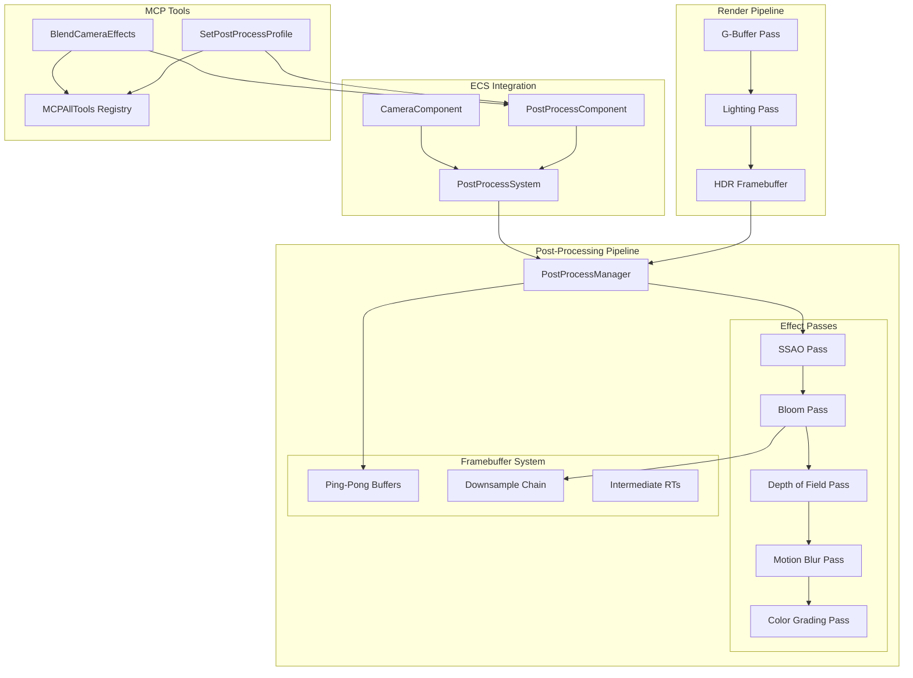
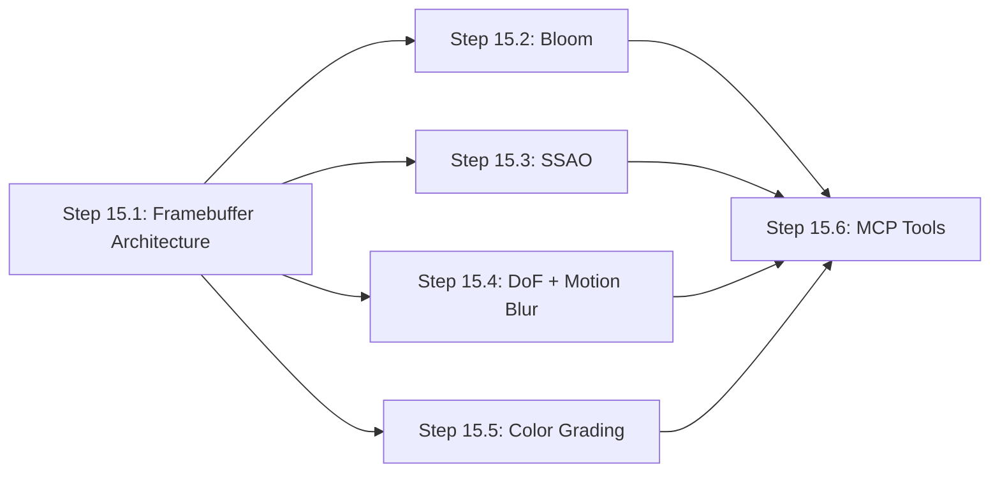

# Phase 15: Post-Processing & Cinematic Polish - Implementation Plan

## Goal

Implement a comprehensive post-processing pipeline for the Artificial Intelligence Game Engine that enables cinematic-quality visual effects. This phase establishes a flexible framebuffer architecture for chaining multiple effects, implements physically-based bloom, SSAO, depth of field, motion blur, and professional color grading with LUT support. The MCP tools integration allows AI agents to dynamically control visual mood and camera effects, enabling narrative-driven cinematography.

## Requirements

### Core Infrastructure
- Ping-pong framebuffer system for efficient multi-pass post-processing
- Configurable render pass ordering and dependency management
- Efficient GPU memory management for intermediate buffers
- Support for HDR rendering throughout the pipeline

### Visual Effects
- **Bloom**: Physically-based with multi-resolution blur chain (13-tap kernel)
- **SSAO**: Screen-space ambient occlusion with bilateral blur
- **Depth of Field**: Bokeh-quality blur with focal plane control
- **Motion Blur**: Per-pixel velocity-based blur with camera integration
- **Color Grading**: 3D LUT support with ACES tonemapping

### AI Integration
- `SetPostProcessProfile` MCP tool for preset-based mood switching
- `BlendCameraEffects` MCP tool for smooth effect transitions
- JSON-configurable effect presets for AI-driven cinematography

## Technical Considerations

### System Architecture Overview



### Technology Stack

| Layer | Technology | Rationale |
|-------|------------|-----------|
| Graphics API | Vulkan 1.3 | Low-level control for render pass management |
| Shaders | GLSL 450 | Native Vulkan shader language |
| Math | GLM (via Math.h alias) | Consistent with existing engine |
| ECS | EnTT | Existing entity-component system |
| Serialization | nlohmann/json | MCP tool parameter handling |

### File System Structure

```
Core/
├── ECS/
│   ├── Components/
│   │   └── PostProcessComponent.h          # Step 15.1 - Effect parameters
│   └── Systems/
│       ├── PostProcessSystem.h             # Step 15.1 - Pipeline orchestration
│       └── PostProcessSystem.cpp
├── Renderer/
│   └── PostProcess/
│       ├── PostProcessManager.h            # Step 15.1 - Pass management
│       ├── PostProcessManager.cpp
│       ├── PostProcessPass.h               # Step 15.1 - Base pass interface
│       ├── FramebufferChain.h              # Step 15.1 - Ping-pong system
│       ├── FramebufferChain.cpp
│       ├── BloomPass.h                     # Step 15.2 - Bloom effect
│       ├── BloomPass.cpp
│       ├── SSAOPass.h                      # Step 15.3 - Ambient occlusion
│       ├── SSAOPass.cpp
│       ├── DepthOfFieldPass.h              # Step 15.4 - DoF effect
│       ├── DepthOfFieldPass.cpp
│       ├── MotionBlurPass.h                # Step 15.4 - Motion blur
│       ├── MotionBlurPass.cpp
│       ├── ColorGradingPass.h              # Step 15.5 - Color grading + tonemapping
│       └── ColorGradingPass.cpp
└── MCP/
    └── MCPPostProcessTools.h               # Step 15.6 - AI cinematography tools

Shaders/
├── post_process_common.glsl                # Step 15.1 - Shared utilities
├── fullscreen_quad.vert                    # Step 15.1 - Common vertex shader
├── bloom_downsample.frag                   # Step 15.2 - 13-tap downsample
├── bloom_upsample.frag                     # Step 15.2 - Tent filter upsample
├── bloom_composite.frag                    # Step 15.2 - Final bloom blend
├── ssao.frag                               # Step 15.3 - AO calculation
├── ssao_blur.frag                          # Step 15.3 - Bilateral blur
├── depth_of_field.frag                     # Step 15.4 - CoC + blur
├── motion_blur.frag                        # Step 15.4 - Velocity-based blur
├── color_grading.frag                      # Step 15.5 - LUT + tonemapping
└── aces_tonemapping.glsl                   # Step 15.5 - ACES functions
```

---

## Implementation Steps

### Step 15.1: Ping-Pong Framebuffer Architecture

#### Goal
Establish the foundational infrastructure for chaining multiple post-processing passes efficiently using a ping-pong buffer system.

#### Components to Create

**PostProcessComponent.h**
```cpp
struct PostProcessSettings {
    // Bloom
    bool bloomEnabled = true;
    float bloomIntensity = 1.0f;
    float bloomThreshold = 1.0f;
    
    // SSAO
    bool ssaoEnabled = true;
    float ssaoRadius = 0.5f;
    float ssaoIntensity = 1.0f;
    int ssaoSamples = 16;
    
    // Depth of Field
    bool dofEnabled = false;
    float dofFocalDistance = 10.0f;
    float dofFocalRange = 5.0f;
    float dofMaxBlur = 1.0f;
    
    // Motion Blur
    bool motionBlurEnabled = false;
    float motionBlurScale = 1.0f;
    int motionBlurSamples = 8;
    
    // Color Grading
    bool colorGradingEnabled = true;
    float exposure = 1.0f;
    float contrast = 1.0f;
    float saturation = 1.0f;
    std::string lutTexturePath = "";
    
    // Tonemapping
    int tonemapOperator = 0; // 0=ACES, 1=Reinhard, 2=Uncharted2
};
```

**FramebufferChain.h**
- Manages ping-pong framebuffer allocation
- Automatic resolution scaling support
- VkImage/VkImageView/VkFramebuffer lifecycle

**PostProcessPass.h (Interface)**
```cpp
class PostProcessPass {
public:
    virtual ~PostProcessPass() = default;
    virtual void Initialize(VkDevice device, VkRenderPass renderPass) = 0;
    virtual void Execute(VkCommandBuffer cmd, const FramebufferChain& chain) = 0;
    virtual void Cleanup() = 0;
    virtual bool IsEnabled() const = 0;
};
```

**PostProcessManager.h**
- Ordered list of PostProcessPass instances
- Manages pass dependencies and execution order
- Handles framebuffer swapping between passes

#### Shaders

**fullscreen_quad.vert**
```glsl
#version 450
layout(location = 0) out vec2 fragUV;

void main() {
    fragUV = vec2((gl_VertexIndex << 1) & 2, gl_VertexIndex & 2);
    gl_Position = vec4(fragUV * 2.0 - 1.0, 0.0, 1.0);
}
```

**post_process_common.glsl**
- Shared functions: linearize depth, reconstruct position, blur kernels

---

### Step 15.2: Physically-Based Bloom

#### Goal
Implement high-quality bloom using a multi-resolution blur technique with 13-tap filtering for smooth, physically accurate light bleeding.

#### Algorithm
1. **Threshold**: Extract pixels above luminance threshold
2. **Downsample Chain**: 6 levels with 13-tap filter
3. **Upsample Chain**: Tent filter with progressive blending
4. **Composite**: Additive blend with scene

#### Key Parameters
```cpp
struct BloomSettings {
    float threshold = 1.0f;      // HDR threshold
    float softKnee = 0.5f;       // Soft threshold transition
    float intensity = 1.0f;      // Final bloom strength
    int mipLevels = 6;           // Blur iterations
    float scatter = 0.7f;        // Energy distribution
};
```

#### Shaders

**bloom_downsample.frag** - 13-tap Karis average for anti-firefly
**bloom_upsample.frag** - 9-tap tent filter for smooth upscaling
**bloom_composite.frag** - Additive blend with original scene

---

### Step 15.3: Screen Space Ambient Occlusion (SSAO)

#### Goal
Add contact shadows and depth cues using screen-space ambient occlusion with bilateral blur for noise reduction.

#### Algorithm
1. Generate random sample kernel (hemisphere)
2. For each pixel, sample depth buffer in kernel pattern
3. Compare depths to estimate occlusion
4. Apply bilateral blur (preserves edges)
5. Multiply with lighting result

#### Key Parameters
```cpp
struct SSAOSettings {
    float radius = 0.5f;         // Sample radius in world units
    float bias = 0.025f;         // Depth comparison bias
    float intensity = 1.0f;      // AO strength
    int kernelSize = 16;         // Sample count (16/32/64)
    int noiseSize = 4;           // Noise texture dimension
    int blurPasses = 2;          // Bilateral blur iterations
};
```

#### Shaders

**ssao.frag** - Hemisphere sampling with noise rotation
**ssao_blur.frag** - Edge-preserving bilateral blur

---

### Step 15.4: Depth of Field & Motion Blur

#### Goal
Implement camera-linked DoF and motion blur effects using velocity buffers and circle of confusion calculations.

#### Depth of Field Algorithm
1. Calculate circle of confusion (CoC) from depth
2. Separate near/far field
3. Apply variable-width blur based on CoC
4. Composite with sharp in-focus region

#### Motion Blur Algorithm
1. Read per-pixel velocity from G-Buffer
2. Scale velocity by shutter time
3. Sample along velocity vector
4. Weight samples by depth/velocity magnitude

#### Camera Integration
```cpp
// Link to CameraComponent
struct CameraMotionData {
    mat4 currentViewProj;
    mat4 previousViewProj;
    float shutterSpeed;
    float focalLength;
    float aperture;
    float focusDistance;
};
```

#### Shaders

**depth_of_field.frag** - CoC calculation + separable blur
**motion_blur.frag** - Velocity-based directional blur

---

### Step 15.5: Color Grading & ACES Tonemapping

#### Goal
Implement professional color correction using 3D lookup tables (LUTs) and the industry-standard ACES tonemapping curve.

#### Color Grading Pipeline
1. Apply exposure adjustment
2. Apply contrast/saturation curves
3. Sample 3D LUT for color transformation
4. Apply ACES filmic tonemapping
5. Convert to sRGB output

#### 3D LUT Support
- 32x32x32 or 64x64x64 LUT textures
- .cube file format loading
- Trilinear interpolation in shader

#### ACES Tonemapping
```glsl
// ACES approximation (Stephen Hill)
vec3 ACESFilm(vec3 x) {
    float a = 2.51f;
    float b = 0.03f;
    float c = 2.43f;
    float d = 0.59f;
    float e = 0.14f;
    return clamp((x*(a*x+b))/(x*(c*x+d)+e), 0.0, 1.0);
}
```

#### Key Parameters
```cpp
struct ColorGradingSettings {
    float exposure = 1.0f;
    float contrast = 1.0f;
    float saturation = 1.0f;
    vec3 colorFilter = vec3(1.0f);
    float temperature = 0.0f;    // -1 to 1 (cool to warm)
    float tint = 0.0f;           // -1 to 1 (green to magenta)
    std::string lutPath = "";
    int tonemapMode = 0;         // ACES, Reinhard, etc.
};
```

#### Shaders

**aces_tonemapping.glsl** - ACES functions and alternatives
**color_grading.frag** - Full color pipeline with LUT sampling

---

### Step 15.6: MCP Post-Processing Tools

#### Goal
Enable AI agents to control the visual mood and camera effects through MCP tools for narrative-driven cinematography.

#### Tools to Implement

**SetPostProcessProfile**
```json
{
    "name": "SetPostProcessProfile",
    "description": "Apply a post-processing profile to set the visual mood",
    "inputSchema": {
        "type": "object",
        "properties": {
            "profile": {
                "type": "string",
                "enum": ["cinematic", "horror", "vibrant", "noir", "dreamy", "custom"]
            },
            "customSettings": {
                "type": "object",
                "properties": {
                    "bloomIntensity": { "type": "number" },
                    "ssaoIntensity": { "type": "number" },
                    "exposure": { "type": "number" },
                    "saturation": { "type": "number" },
                    "vignetteIntensity": { "type": "number" }
                }
            }
        },
        "required": ["profile"]
    }
}
```

**BlendCameraEffects**
```json
{
    "name": "BlendCameraEffects",
    "description": "Smoothly transition camera effects over time",
    "inputSchema": {
        "type": "object",
        "properties": {
            "effect": {
                "type": "string",
                "enum": ["depthOfField", "motionBlur", "all"]
            },
            "focalDistance": { "type": "number" },
            "aperture": { "type": "number" },
            "motionBlurStrength": { "type": "number" },
            "transitionDuration": { "type": "number", "default": 1.0 }
        },
        "required": ["effect"]
    }
}
```

#### Preset Profiles
| Profile | Bloom | SSAO | DoF | Saturation | Contrast | LUT |
|---------|-------|------|-----|------------|----------|-----|
| Cinematic | 0.8 | 1.0 | On | 0.9 | 1.1 | cinematic.cube |
| Horror | 0.3 | 1.5 | Off | 0.6 | 1.3 | desaturated.cube |
| Vibrant | 1.2 | 0.8 | Off | 1.3 | 1.0 | vibrant.cube |
| Noir | 0.5 | 1.2 | On | 0.0 | 1.4 | noir.cube |
| Dreamy | 1.5 | 0.5 | On | 1.1 | 0.9 | soft.cube |

---

## Implementation Order & Dependencies



| Step | Name | Dependencies | Estimated Complexity |
|------|------|--------------|---------------------|
| 15.1 | Framebuffer Architecture | None | High |
| 15.2 | Bloom | 15.1 | Medium |
| 15.3 | SSAO | 15.1 | Medium |
| 15.4 | DoF + Motion Blur | 15.1, CameraComponent | Medium-High |
| 15.5 | Color Grading | 15.1 | Medium |
| 15.6 | MCP Tools | 15.1-15.5 | Low |

---

## Testing Strategy

### Unit Tests
- Framebuffer allocation/deallocation
- Shader compilation validation
- LUT file parsing

### Visual Validation
- Reference images for each effect
- A/B comparison with commercial engines
- Performance profiling (GPU timings)

### Integration Tests
- Full pipeline with all effects enabled
- MCP tool response validation
- Profile switching performance

---

## Performance Considerations

| Effect | Cost | Optimization |
|--------|------|--------------|
| Bloom | Medium | Half-resolution blur |
| SSAO | High | Quarter-resolution + bilateral upsample |
| DoF | Medium | Separable blur, tiled CoC |
| Motion Blur | Low | Early-out for static pixels |
| Color Grading | Low | Single fullscreen pass |

**Target Budget**: < 2ms total at 1080p on mid-range GPU

---

## Deliverables Checklist

- [ ] PostProcessComponent with all effect parameters
- [ ] PostProcessSystem for pipeline orchestration
- [ ] FramebufferChain ping-pong implementation
- [ ] PostProcessManager with ordered pass execution
- [ ] BloomPass with 13-tap downsample/upsample
- [ ] SSAOPass with bilateral blur
- [ ] DepthOfFieldPass with CoC calculation
- [ ] MotionBlurPass with velocity sampling
- [ ] ColorGradingPass with LUT and ACES
- [ ] All associated GLSL shaders
- [ ] MCPPostProcessTools (SetPostProcessProfile, BlendCameraEffects)
- [ ] Integration into MCPAllTools registry
- [ ] Updated engine_roadmap.md with completion status

<!-- release-doc-sync:2026-04-15 -->

## Release Sync (2026-04-15)

- Verified clean Release rebuild: `cmake --build build --config Release --target ALL_BUILD --clean-first -- /m /nologo /verbosity:minimal`.
- Verified Release test sweep: `ctest --test-dir build -C Release` (**18/18 passed**).
- Confirmed executable composition: `AIGameEngine` links `EngineCore`, and `EngineCore` includes `Core/MCP/HttpServer.cpp` + `Core/MCP/MCPServer.cpp`.
- Runtime MCP integration is now enabled in `Core::Application` by default; runtime flags: `--disable-mcp`, `--mcp-host=<host>`, `--mcp-port=<port>`.
