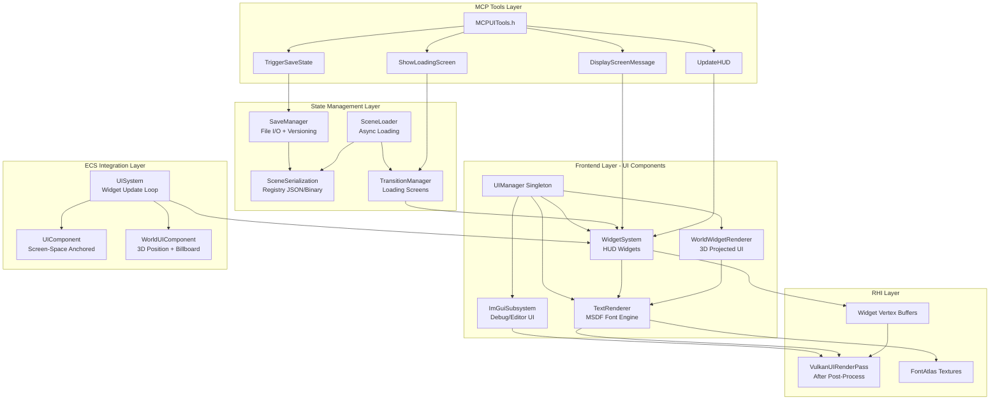
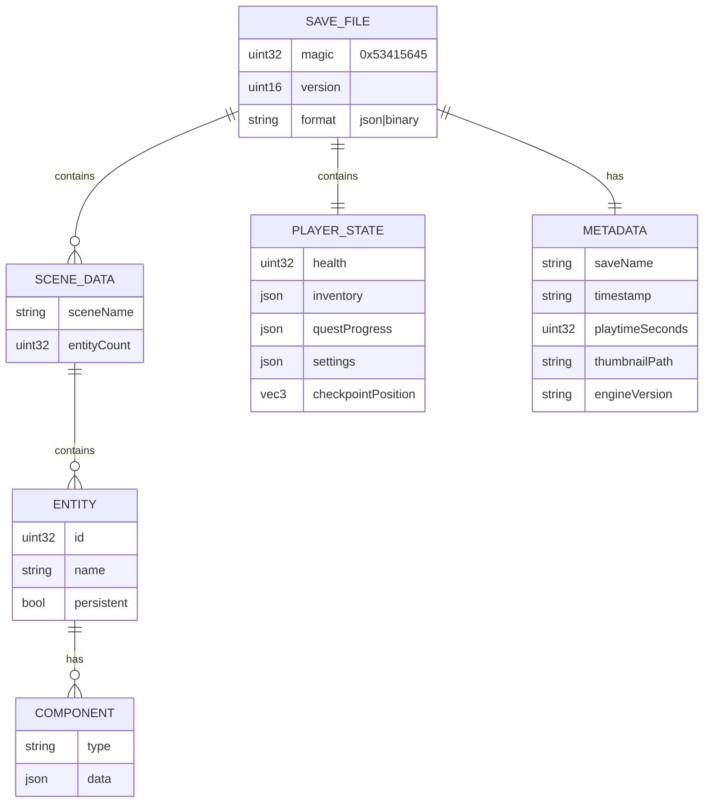
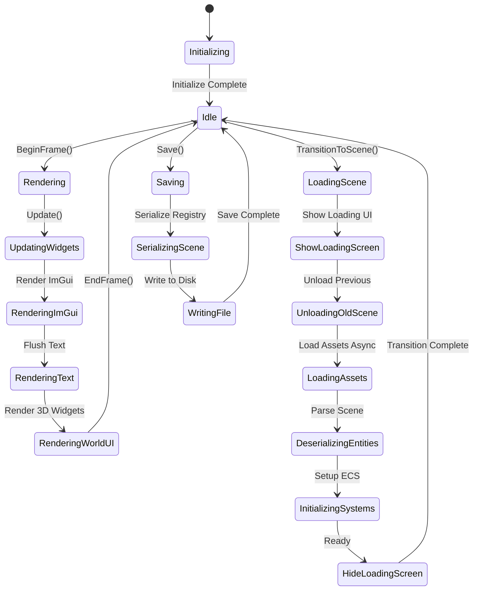

# Phase 16: In-Game UI Framework & State Management

## Implementation Plan

---

## Goal

Implement a comprehensive UI framework and state management system for the Artificial Intelligence Game Engine. This phase delivers a hybrid UI architecture combining Dear ImGui for debug/editor interfaces, MSDF-based text rendering for high-quality game HUDs, a flexible widget system with viewport anchoring, 3D world-space widget projection, robust save/load serialization leveraging the existing MCP JSON schemas, asynchronous scene loading infrastructure, and MCP tool extensions enabling AI agents to act as dynamic Game Masters controlling on-screen messaging, HUD updates, and save state triggers.

---

## Requirements

### Core UI Framework (Step 16.1)
- Integrate Dear ImGui with official Vulkan backend for debug overlays and editor UI
- Implement MSDF (Multi-channel Signed Distance Field) text renderer for game HUD elements
- Support multiple font families, sizes, and styles (regular, bold, italic)
- Provide text effects: outlines, drop shadows, glow
- Achieve resolution-independent rendering that scales cleanly from 720p to 4K
- Target < 1.0ms CPU and < 0.5ms GPU budget for entire UI subsystem

### UIComponent & Widget System (Step 16.2)
- Create `UIComponent` ECS component for screen-space and world-space UI attachment
- Implement 9-point anchor system (TopLeft, TopCenter, TopRight, CenterLeft, Center, CenterRight, BottomLeft, BottomCenter, BottomRight)
- Support world-to-screen projection for 3D floating widgets (health bars, nameplates, markers)
- Provide billboarding and fixed-orientation modes for 3D widgets
- Build reusable widget library: HealthBar, ProgressBar, Label, Panel, Crosshair, ObjectiveMarker, MiniMap stub
- Implement input focus management for UI element interaction

### Save/Load State System (Step 16.3)
- Extend `SceneSerialization.h` to support full registry serialization (all 26+ component types)
- Implement player-specific state serialization (inventory, quest progress, settings)
- Create versioned save file format with header metadata (version, timestamp, playtime, thumbnail)
- Support JSON and binary save formats (JSON for debugging, binary for production)
- Implement incremental auto-save with configurable intervals
- Add save file validation and corruption recovery mechanisms

### Asynchronous Scene Loading (Step 16.4)
- Implement scene loading on background threads via JobSystem
- Create transition/loading screen framework with progress reporting
- Support level streaming architecture (load adjacent chunks before player reaches them)
- Implement asset reference counting and garbage collection for unloaded scenes
- Provide scene transition callbacks for gameplay code (OnSceneUnload, OnSceneLoad, OnSceneReady)

### MCP UI Tools (Step 16.5)
- Implement `DisplayScreenMessage` tool for narrative text, alerts, and tutorial prompts
- Implement `UpdateHUD` tool for dynamic objective trackers, score displays, and status indicators
- Implement `TriggerSaveState` tool for AI-controlled checkpoints and narrative save points
- Implement `ShowLoadingScreen` tool for AI-orchestrated scene transitions
- Add safety validation to prevent UI spam and ensure message queuing

---

## Technical Considerations

### System Architecture Overview



### Technology Stack Selection

| Layer | Technology | Rationale |
|-------|------------|-----------|
| Debug UI | Dear ImGui | Official Vulkan backend, battle-tested, zero-risk integration |
| HUD Text | Custom MSDF | Resolution-independent, GPU-efficient, supports effects |
| Font Generation | msdf-atlas-gen | Industry standard MSDF tool |
| JSON Serialization | nlohmann::json | Already integrated in MCP layer |
| Binary Serialization | Custom + zlib | Fast load times, small file sizes |
| Async Loading | Core::JobSystem | Existing multi-threaded infrastructure |

### Integration Points

- **Renderer Integration**: UI renders as final pass after post-processing, before present
- **Input Integration**: Extend `Core::Input` for UI focus/hover, priority over gameplay input
- **ECS Integration**: `UIComponent` and `WorldUIComponent` managed by `UISystem`
- **MCP Integration**: New tool category `MCPUITools.h` following existing patterns
- **Scene Integration**: `Scene::OnUpdate()` calls `UISystem::Update()`

### Deployment Architecture

```
Core/
├── UI/
│   ├── UIManager.h/cpp           # Singleton coordinating all UI systems
│   ├── ImGuiSubsystem.h/cpp      # Dear ImGui Vulkan integration
│   ├── TextRenderer.h/cpp         # MSDF text rendering engine
│   ├── FontAtlas.h/cpp            # Font loading and glyph metrics
│   ├── WidgetSystem.h/cpp         # Widget update and batching
│   ├── WorldWidgetRenderer.h/cpp  # 3D projected widgets
│   ├── Widgets/
│   │   ├── Widget.h               # Base widget interface
│   │   ├── Label.h/cpp
│   │   ├── Panel.h/cpp
│   │   ├── HealthBar.h/cpp
│   │   ├── ProgressBar.h/cpp
│   │   ├── Crosshair.h/cpp
│   │   ├── ObjectiveMarker.h/cpp
│   │   └── MessageBox.h/cpp
│   └── Anchoring.h                # Anchor enum and utilities
├── ECS/
│   ├── Components/
│   │   ├── UIComponent.h          # Screen-space UI attachment
│   │   └── WorldUIComponent.h     # 3D world-space UI attachment
│   └── Systems/
│       └── UISystem.h/cpp         # UI update system
├── State/
│   ├── SaveManager.h/cpp          # Save/Load coordination
│   ├── SaveFile.h                 # Save file format definitions
│   ├── SceneLoader.h/cpp          # Async scene loading
│   └── TransitionManager.h/cpp    # Loading screen management
├── MCP/
│   ├── MCPUITools.h               # All UI-related MCP tools
│   └── MCPAllTools.h              # Updated to include UI tools
└── Shaders/
    ├── msdf_text.vert
    ├── msdf_text.frag
    ├── widget.vert
    └── widget.frag
```

### Scalability Considerations

- **Batching**: All text glyphs batched into single draw call per font atlas
- **Instancing**: Widget backgrounds use instanced rendering
- **Culling**: Off-screen widgets skipped entirely
- **LOD**: World-space widgets fade/shrink with distance
- **Async**: Scene loading never blocks main thread

---

## Database Schema Design

### Save File Format (JSON Schema)



### Component Serialization Coverage

| Component | Serializable | Notes |
|-----------|--------------|-------|
| TransformComponent | ✅ | Position, Rotation (Euler), Scale |
| MeshComponent | ✅ | Mesh path, material index |
| LightComponent | ✅ | Type, color, intensity, radius |
| CameraComponent | ✅ | FOV, near/far, projection type |
| RigidBodyComponent | ✅ | Mass, velocity, angular velocity |
| ColliderComponent | ✅ | Type, dimensions, offset |
| AnimatorComponent | ✅ | Current state, blend weights |
| AudioSourceComponent | ✅ | Clip path, volume, pitch, loop |
| ParticleEmitterComponent | ✅ | All emission parameters |
| UIComponent | ✅ | Anchor, offset, widget type |
| WorldUIComponent | ✅ | World position, billboard mode |
| NetworkTransformComponent | ⚠️ | Stripped in saves (reconstructed) |

---

## API Design

### UIManager Singleton

```cpp
namespace Core::UI {

class UIManager {
public:
    static UIManager& Get();
    
    // Lifecycle
    void Initialize(RHI::RHIDevice* device, Window* window);
    void Shutdown();
    
    // Per-frame
    void BeginFrame();
    void Update(float deltaTime);
    void Render(RHI::RHICommandList* cmdList);
    
    // Subsystem access
    ImGuiSubsystem& GetImGui();
    TextRenderer& GetTextRenderer();
    WidgetSystem& GetWidgets();
    
    // Quick text API
    void DrawText(std::string_view text, glm::vec2 screenPos, 
                  const TextStyle& style = {});
    void DrawText3D(std::string_view text, glm::vec3 worldPos,
                    const TextStyle& style = {}, bool billboard = true);
    void DrawTextAnchored(std::string_view text, Anchor anchor,
                          glm::vec2 offset, const TextStyle& style = {});
    
    // Screen messages (for MCP)
    void ShowMessage(std::string_view text, float duration = 3.0f,
                     MessageType type = MessageType::Info);
    void ClearMessages();
    
private:
    std::unique_ptr<ImGuiSubsystem> m_imgui;
    std::unique_ptr<TextRenderer> m_textRenderer;
    std::unique_ptr<WidgetSystem> m_widgets;
    std::unique_ptr<WorldWidgetRenderer> m_worldWidgets;
};

} // namespace Core::UI
```

### TextRenderer API

```cpp
namespace Core::UI {

struct TextStyle {
    std::string fontFamily = "default";
    float fontSize = 16.0f;
    glm::vec4 color = {1, 1, 1, 1};
    glm::vec4 outlineColor = {0, 0, 0, 1};
    float outlineWidth = 0.0f;      // 0 = no outline
    float shadowOffset = 0.0f;       // 0 = no shadow
    glm::vec4 shadowColor = {0, 0, 0, 0.5f};
    HorizontalAlign hAlign = HorizontalAlign::Left;
    VerticalAlign vAlign = VerticalAlign::Top;
};

enum class HorizontalAlign { Left, Center, Right };
enum class VerticalAlign { Top, Center, Bottom };
enum class Anchor {
    TopLeft, TopCenter, TopRight,
    CenterLeft, Center, CenterRight,
    BottomLeft, BottomCenter, BottomRight
};

class TextRenderer {
public:
    void Initialize(RHI::RHIDevice* device);
    void LoadFont(const std::string& name, const std::string& atlasPath,
                  const std::string& metricsPath);
    
    // Screen-space text (pixel coordinates)
    void DrawText(std::string_view text, glm::vec2 position,
                  const TextStyle& style);
    
    // Anchored text (relative to viewport)
    void DrawTextAnchored(std::string_view text, Anchor anchor,
                          glm::vec2 offset, const TextStyle& style);
    
    // World-space text
    void DrawText3D(std::string_view text, glm::vec3 worldPosition,
                    const glm::mat4& viewProj, const TextStyle& style,
                    bool billboard = true);
    
    // Measure text bounds
    glm::vec2 MeasureText(std::string_view text, const TextStyle& style);
    
    // Batch and render all queued text
    void Flush(RHI::RHICommandList* cmdList, const glm::mat4& orthoProj);
    
private:
    struct FontData {
        RHI::RHITexture* atlas;
        std::unordered_map<uint32_t, GlyphMetrics> glyphs;
        float lineHeight;
        float ascent, descent;
    };
    
    std::unordered_map<std::string, FontData> m_fonts;
    std::vector<TextVertex> m_vertices;
    std::vector<uint32_t> m_indices;
    RHI::RHIBuffer* m_vertexBuffer;
    RHI::RHIBuffer* m_indexBuffer;
    RHI::RHIPipelineState* m_pipeline;
};

} // namespace Core::UI
```

### SaveManager API

```cpp
namespace Core::State {

struct SaveMetadata {
    std::string saveName;
    std::string timestamp;
    uint32_t playtimeSeconds;
    std::string thumbnailPath;
    std::string engineVersion;
    std::string sceneName;
};

enum class SaveFormat { JSON, Binary };

class SaveManager {
public:
    static SaveManager& Get();
    
    // Save operations
    bool Save(const std::string& slotName, ECS::Scene* scene,
              const PlayerState& playerState, SaveFormat format = SaveFormat::Binary);
    bool QuickSave(ECS::Scene* scene, const PlayerState& playerState);
    bool AutoSave(ECS::Scene* scene, const PlayerState& playerState);
    
    // Load operations
    bool Load(const std::string& slotName, ECS::Scene* scene,
              PlayerState& outPlayerState);
    bool QuickLoad(ECS::Scene* scene, PlayerState& outPlayerState);
    
    // Async operations
    std::future<bool> SaveAsync(const std::string& slotName, ECS::Scene* scene,
                                 const PlayerState& playerState);
    std::future<bool> LoadAsync(const std::string& slotName, ECS::Scene* scene,
                                 PlayerState& outPlayerState);
    
    // Save management
    std::vector<SaveMetadata> GetSaveSlots();
    bool DeleteSave(const std::string& slotName);
    bool ValidateSave(const std::string& slotName);
    
    // Auto-save configuration
    void SetAutoSaveInterval(float seconds);
    void EnableAutoSave(bool enable);
    
private:
    std::string m_saveDirectory;
    float m_autoSaveInterval = 300.0f; // 5 minutes
    bool m_autoSaveEnabled = true;
    float m_autoSaveTimer = 0.0f;
};

} // namespace Core::State
```

### SceneLoader API

```cpp
namespace Core::State {

enum class LoadingPhase {
    Starting,
    UnloadingPrevious,
    LoadingAssets,
    DeserializingEntities,
    InitializingSystems,
    Ready
};

struct LoadingProgress {
    LoadingPhase phase;
    float progress;          // 0.0 - 1.0
    std::string description;
};

using LoadingCallback = std::function<void(const LoadingProgress&)>;
using SceneReadyCallback = std::function<void(ECS::Scene*)>;

class SceneLoader {
public:
    static SceneLoader& Get();
    
    // Synchronous loading (blocks)
    std::unique_ptr<ECS::Scene> LoadScene(const std::string& scenePath);
    
    // Asynchronous loading
    void LoadSceneAsync(const std::string& scenePath,
                        SceneReadyCallback onReady,
                        LoadingCallback onProgress = nullptr);
    
    // Scene transitions
    void TransitionToScene(const std::string& scenePath,
                           TransitionStyle style = TransitionStyle::Fade,
                           float duration = 0.5f);
    
    // Level streaming
    void PreloadAdjacentScene(const std::string& scenePath);
    void UnloadScene(const std::string& scenePath);
    bool IsSceneLoaded(const std::string& scenePath);
    
    // Callbacks
    std::function<void(ECS::Scene*)> OnSceneUnload;
    std::function<void(ECS::Scene*)> OnSceneLoad;
    std::function<void(ECS::Scene*)> OnSceneReady;
    
private:
    std::unordered_map<std::string, std::unique_ptr<ECS::Scene>> m_loadedScenes;
    std::queue<std::string> m_loadQueue;
    std::atomic<bool> m_isLoading{false};
};

enum class TransitionStyle {
    None,
    Fade,
    Wipe,
    Custom
};

} // namespace Core::State
```

### MCP UI Tools API

```cpp
namespace Core::MCP {

// DisplayScreenMessage - Show narrative text, alerts, tutorials
// Input Schema:
// {
//   "message": string,           // Required: Text to display
//   "duration": number,          // Optional: Seconds (default: 3.0)
//   "type": string,              // Optional: "info"|"warning"|"error"|"narrative"|"tutorial"
//   "position": string,          // Optional: "top"|"center"|"bottom" (default: "center")
//   "style": {                   // Optional: Custom styling
//     "fontSize": number,
//     "color": {r, g, b, a},
//     "outline": boolean
//   }
// }

// UpdateHUD - Modify HUD widget values
// Input Schema:
// {
//   "widget": string,            // Required: "health"|"ammo"|"objective"|"score"|"custom"
//   "value": any,                // Required: New value (number, string, or object)
//   "animate": boolean,          // Optional: Animate the change (default: true)
//   "visible": boolean           // Optional: Show/hide widget
// }

// TriggerSaveState - Create a save checkpoint
// Input Schema:
// {
//   "slotName": string,          // Optional: Named slot (default: auto-generated)
//   "description": string,       // Optional: Save description
//   "silent": boolean,           // Optional: No UI feedback (default: false)
//   "format": string             // Optional: "json"|"binary" (default: "binary")
// }

// ShowLoadingScreen - Display loading screen during transitions
// Input Schema:
// {
//   "show": boolean,             // Required: Show or hide
//   "message": string,           // Optional: Loading message
//   "progress": number,          // Optional: 0.0-1.0 progress value
//   "tips": [string]             // Optional: Rotating gameplay tips
// }

MCPToolPtr CreateDisplayScreenMessageTool();
MCPToolPtr CreateUpdateHUDTool();
MCPToolPtr CreateTriggerSaveStateTool();
MCPToolPtr CreateShowLoadingScreenTool();

// Factory to register all UI tools
void RegisterUITools(MCPServer& server);

} // namespace Core::MCP
```

### Error Handling

| Error Code | HTTP Status | Description |
|------------|-------------|-------------|
| `UI_FONT_NOT_FOUND` | 404 | Requested font family not loaded |
| `UI_WIDGET_NOT_FOUND` | 404 | Unknown widget identifier |
| `SAVE_FILE_CORRUPT` | 500 | Save file failed validation |
| `SAVE_VERSION_MISMATCH` | 400 | Incompatible save version |
| `SCENE_LOAD_FAILED` | 500 | Scene file parsing error |
| `MCP_MESSAGE_THROTTLED` | 429 | Too many UI messages queued |

---

## Frontend Architecture

### Component Hierarchy

```
UI System
├── UIManager (singleton)
│   ├── ImGuiSubsystem
│   │   ├── Performance Overlay
│   │   ├── Entity Inspector
│   │   └── Render Stats
│   ├── TextRenderer
│   │   ├── FontAtlas ("default", "title", "mono")
│   │   └── Glyph Batch Buffers
│   ├── WidgetSystem
│   │   ├── ScreenWidget (HUDWidget)
│   │   │   ├── HealthBar
│   │   │   ├── AmmoCounter
│   │   │   ├── Crosshair
│   │   │   ├── MiniMap
│   │   │   └── ObjectivePanel
│   │   └── MessageQueue
│   │       ├── MessageBox (narrative)
│   │       ├── AlertBox (warnings)
│   │       └── TutorialBox (hints)
│   └── WorldWidgetRenderer
│       ├── NameplateWidget (enemy names)
│       ├── HealthBarWidget (floating HP)
│       └── ObjectiveMarker (3D waypoints)
└── TransitionManager
    ├── LoadingScreen
    │   ├── Progress Bar
    │   ├── Loading Message
    │   └── Tip Carousel
    └── Fade Overlay
```

### State Flow Diagram



---

## Security & Performance

### Input Validation

- All MCP tool inputs validated against JSON schemas
- Message text sanitized (strip control characters, limit length to 500 chars)
- Save slot names validated (alphanumeric + underscore only)
- Progress values clamped to [0, 1] range

### Performance Optimization

| Technique | Target | Implementation |
|-----------|--------|----------------|
| Text Batching | 1 draw call per font | Merge all glyphs into single vertex buffer |
| Widget Instancing | 1 draw call per widget type | Instance background quads |
| Dirty Flags | Skip unchanged widgets | Only rebuild buffers when text changes |
| Culling | 0 cost for hidden UI | Skip render calls entirely |
| Async I/O | No main thread stalls | JobSystem for save/load |

### Performance Budget

| System | CPU Budget | GPU Budget | Memory |
|--------|------------|------------|--------|
| ImGui | 0.3ms | 0.1ms | 2 MB |
| Text Renderer | 0.2ms | 0.1ms | 4 MB (atlases) |
| Widgets | 0.2ms | 0.1ms | 1 MB |
| World UI | 0.1ms | 0.1ms | 512 KB |
| Save/Load | Background | N/A | 10 MB (temp) |
| **Total** | **< 1.0ms** | **< 0.5ms** | **~18 MB** |

---

## Detailed Step Breakdown

### Step 16.1: UI Rendering Library Integration

#### Sub-step 16.1.1: Dear ImGui Vulkan Integration
- Add `imgui` to `vcpkg.json` dependencies
- Create `Core/UI/ImGuiSubsystem.h/cpp`
- Initialize ImGui with Vulkan backend in `Application::Initialize()`
- Implement debug overlays: FPS counter, memory stats, entity inspector
- Hook into main render loop after post-processing pass
- **Deliverable**: Working ImGui rendering in engine

#### Sub-step 16.1.2: MSDF Font Atlas Pipeline
- Integrate `msdf-atlas-gen` into asset pipeline
- Create `Core/UI/FontAtlas.h/cpp` for loading atlas PNG + JSON metrics
- Define `GlyphMetrics` struct: advance, bearing, UV coordinates
- Implement kerning pair lookup
- Generate default font atlases: "default" (Roboto), "title" (bold), "mono" (code)
- **Deliverable**: Font atlases loadable at runtime

#### Sub-step 16.1.3: MSDF Text Renderer
- Create `Core/UI/TextRenderer.h/cpp`
- Implement MSDF fragment shader with anti-aliasing
- Add outline support via two-pass or shader-based approach
- Implement drop shadow rendering
- Create vertex buffer management for glyph quads
- Implement text batching (sort by atlas, merge buffers)
- **Deliverable**: High-quality text rendering

#### Sub-step 16.1.4: Text Shaders
- Create `Shaders/msdf_text.vert` - Transform glyph quads
- Create `Shaders/msdf_text.frag` - MSDF sampling with effects
- Implement push constants for outline/shadow parameters
- Compile to SPIR-V in build pipeline
- **Deliverable**: Complete text shader pipeline

#### Sub-step 16.1.5: UIManager Singleton
- Create `Core/UI/UIManager.h/cpp`
- Implement initialization sequence for all subsystems
- Provide quick API for common text operations
- Integrate with `Application` main loop
- **Deliverable**: Unified UI management entry point

---

### Step 16.2: UIComponent & Widget System

#### Sub-step 16.2.1: Anchor System
- Create `Core/UI/Anchoring.h` with Anchor enum
- Implement anchor-to-screen-position conversion
- Support viewport resize handling
- Add margin/offset support
- **Deliverable**: Flexible screen positioning

#### Sub-step 16.2.2: UIComponent ECS Integration
- Create `Core/ECS/Components/UIComponent.h`
- Define anchor, offset, widget reference, visibility
- Create `Core/ECS/Components/WorldUIComponent.h`
- Define world position, billboard mode, distance fade
- Add to `Components.h` include list
- **Deliverable**: UI ECS components

#### Sub-step 16.2.3: UISystem
- Create `Core/ECS/Systems/UISystem.h/cpp`
- Iterate UIComponent entities, update positions
- Iterate WorldUIComponent entities, project to screen
- Handle widget dirty state propagation
- Integrate with `Scene::OnUpdate()`
- **Deliverable**: UI update loop

#### Sub-step 16.2.4: Base Widget Class
- Create `Core/UI/Widgets/Widget.h`
- Define virtual `Update()`, `Render()` interface
- Implement anchor, visibility, animation support
- Add input focus handling
- **Deliverable**: Widget base class

#### Sub-step 16.2.5: HUD Widgets Implementation
- Create `HealthBar.h/cpp` - Segmented/smooth health display
- Create `ProgressBar.h/cpp` - Generic progress indicator
- Create `Label.h/cpp` - Styled text label
- Create `Panel.h/cpp` - Background panel with border
- Create `Crosshair.h/cpp` - Dynamic crosshair
- Create `ObjectiveMarker.h/cpp` - 3D waypoint with distance
- **Deliverable**: Complete widget library

#### Sub-step 16.2.6: World Widget Renderer
- Create `Core/UI/WorldWidgetRenderer.h/cpp`
- Implement world-to-screen projection
- Add billboarding matrix calculation
- Implement distance-based scaling and fading
- Support off-screen indicator arrows
- **Deliverable**: 3D widget projection

#### Sub-step 16.2.7: Widget Batching System
- Create `Core/UI/WidgetSystem.h/cpp`
- Implement widget collection and sorting
- Batch similar widget backgrounds
- Integrate with TextRenderer for text portions
- **Deliverable**: Efficient widget rendering

---

### Step 16.3: Save/Load State System

#### Sub-step 16.3.1: Extended Scene Serialization
- Extend `SceneSerialization.h` with new components
- Add `UIComponent`, `WorldUIComponent` serialization
- Ensure all 26+ components covered
- Add unit tests for round-trip serialization
- **Deliverable**: Complete component serialization

#### Sub-step 16.3.2: Save File Format
- Create `Core/State/SaveFile.h`
- Define `SaveHeader` struct with magic number, version
- Define `SaveMetadata` struct
- Implement JSON and binary format writers
- **Deliverable**: Save file format spec

#### Sub-step 16.3.3: SaveManager Implementation
- Create `Core/State/SaveManager.h/cpp`
- Implement `Save()`, `Load()`, `QuickSave()`, `QuickLoad()`
- Add save slot enumeration
- Implement save validation
- Add corruption recovery (backup previous save)
- **Deliverable**: Core save/load functionality

#### Sub-step 16.3.4: Async Save/Load
- Implement `SaveAsync()`, `LoadAsync()` using JobSystem
- Add progress callbacks
- Ensure thread-safe registry access
- Implement save thumbnail capture
- **Deliverable**: Non-blocking save/load

#### Sub-step 16.3.5: Auto-Save System
- Add configurable auto-save interval
- Implement checkpoint detection (scene changes, events)
- Add auto-save indicator widget
- Implement save rotation (keep last N auto-saves)
- **Deliverable**: Automatic save points

#### Sub-step 16.3.6: Player State Serialization
- Define `PlayerState` struct in `SaveFile.h`
- Include inventory, quest progress, settings
- Serialize alongside scene state
- Support partial player state updates
- **Deliverable**: Player-specific persistence

---

### Step 16.4: Asynchronous Scene Loading

#### Sub-step 16.4.1: SceneLoader Core
- Create `Core/State/SceneLoader.h/cpp`
- Implement synchronous `LoadScene()`
- Define `LoadingPhase` enum and progress tracking
- Integrate with existing `Scene` class
- **Deliverable**: Basic scene loading

#### Sub-step 16.4.2: Async Loading Pipeline
- Implement `LoadSceneAsync()` using JobSystem
- Define loading stages: assets, entities, systems
- Add cancellation support
- Implement progress reporting
- **Deliverable**: Background scene loading

#### Sub-step 16.4.3: TransitionManager
- Create `Core/State/TransitionManager.h/cpp`
- Implement fade transition
- Implement wipe transition
- Support custom transition callbacks
- Coordinate with SceneLoader
- **Deliverable**: Scene transition system

#### Sub-step 16.4.4: Loading Screen Widget
- Create `LoadingScreen.h/cpp` widget
- Display progress bar
- Show loading messages
- Implement tip carousel
- Support custom backgrounds
- **Deliverable**: Loading screen UI

#### Sub-step 16.4.5: Level Streaming Infrastructure
- Implement `PreloadAdjacentScene()`
- Add scene reference counting
- Implement `UnloadScene()` with garbage collection
- Define streaming trigger volumes
- **Deliverable**: Level streaming foundation

#### Sub-step 16.4.6: Scene Callbacks
- Implement `OnSceneUnload` callback
- Implement `OnSceneLoad` callback
- Implement `OnSceneReady` callback
- Document callback order guarantees
- **Deliverable**: Scene lifecycle hooks

---

### Step 16.5: MCP Server UI Tools

#### Sub-step 16.5.1: MCPUITools Header
- Create `Core/MCP/MCPUITools.h`
- Define tool input schemas using existing patterns
- Follow `MCPPostProcessTools.h` structure
- **Deliverable**: UI tools header

#### Sub-step 16.5.2: DisplayScreenMessage Tool
- Implement message queue with priority
- Support message types: info, warning, error, narrative, tutorial
- Add animation: fade in, hold, fade out
- Implement throttling (max 3 concurrent messages)
- **Deliverable**: Screen message MCP tool

#### Sub-step 16.5.3: UpdateHUD Tool
- Implement widget lookup by ID
- Support value updates with validation
- Add animation triggers
- Support visibility toggling
- **Deliverable**: HUD update MCP tool

#### Sub-step 16.5.4: TriggerSaveState Tool
- Integrate with SaveManager
- Support named and auto-generated slots
- Add optional UI feedback (save icon)
- Implement silent mode for checkpoints
- **Deliverable**: Save trigger MCP tool

#### Sub-step 16.5.5: ShowLoadingScreen Tool
- Integrate with TransitionManager
- Support custom messages and tips
- Allow progress updates
- Implement show/hide toggle
- **Deliverable**: Loading screen MCP tool

#### Sub-step 16.5.6: Tool Registration
- Update `MCPAllTools.h` to include UI tools
- Register tools with MCPServer
- Add tool validation tests
- Document tool usage in code comments
- **Deliverable**: Complete MCP UI integration

---

## Dependencies

### External Libraries (vcpkg)

```json
{
  "dependencies": [
    "imgui",
    "imgui[vulkan-binding]",
    "imgui[sdl3-binding]"
  ]
}
```

### Internal Dependencies

- **Phase 10**: MCP Server, JSON serialization (`nlohmann::json`)
- **Phase 3**: RHI layer for texture/buffer creation
- **Phase 5**: ECS framework (EnTT)
- **Phase 15**: Post-process chain (UI renders after)
- **JobSystem**: For async save/load
- **Asset System**: For font atlas loading

### Asset Dependencies

- Default font: Roboto Regular (OFL license)
- Title font: Roboto Bold (OFL license)
- Mono font: JetBrains Mono (OFL license)
- Generated MSDF atlases (4096x4096 recommended)

---

## Testing Strategy

### Unit Tests

| Test | Description |
|------|-------------|
| `TextRenderer_MeasureText` | Verify text measurement accuracy |
| `Anchor_AllPositions` | Test all 9 anchor positions |
| `SaveManager_RoundTrip` | Save and load identical state |
| `SaveManager_Corruption` | Handle invalid save files gracefully |
| `SceneLoader_AsyncCancel` | Cancel in-progress load |
| `MCPUITools_Validation` | Reject invalid tool inputs |

### Integration Tests

| Test | Description |
|------|-------------|
| `UI_FullRenderPipeline` | Render ImGui + text + widgets in one frame |
| `Save_AllComponents` | Serialize scene with all component types |
| `SceneTransition_NoStutter` | Async load without frame drops |
| `MCP_EndToEnd` | AI triggers message → appears on screen |

### Performance Tests

| Test | Target |
|------|--------|
| `Text_1000Glyphs` | < 0.5ms render |
| `Widgets_100Items` | < 1.0ms update + render |
| `Save_10000Entities` | < 2s async |
| `Load_10000Entities` | < 3s async |

---

## Risk Mitigation

| Risk | Mitigation |
|------|------------|
| MSDF quality issues | Fallback to bitmap fonts, increase atlas resolution |
| ImGui style mismatch | Custom theme, or use only for debug builds |
| Save corruption | Backup before overwrite, validation on load |
| Async race conditions | Mutex around registry access during serialization |
| UI blocking main thread | Strict async boundaries, loading screen coverage |

---

## Milestones

| Milestone | Steps | Estimated Duration |
|-----------|-------|-------------------|
| M1: Text Rendering | 16.1.1 - 16.1.5 | 2 weeks |
| M2: Widget System | 16.2.1 - 16.2.7 | 2 weeks |
| M3: Save/Load | 16.3.1 - 16.3.6 | 2 weeks |
| M4: Scene Loading | 16.4.1 - 16.4.6 | 1.5 weeks |
| M5: MCP Integration | 16.5.1 - 16.5.6 | 1.5 weeks |
| **Total** | | **~9 weeks** |

---

## References

- Dear ImGui Vulkan Backend: https://github.com/ocornut/imgui/tree/master/backends
- MSDF Atlas Generator: https://github.com/Chlumsky/msdf-atlas-gen
- MSDF Shader Techniques: https://github.com/Chlumsky/msdfgen
- EnTT Serialization: https://github.com/skypjack/entt/wiki/Crash-Course:-entity-component-system#serialization
- Vulkan Memory Best Practices: https://gpuopen.com/learn/vulkan-device-memory/
