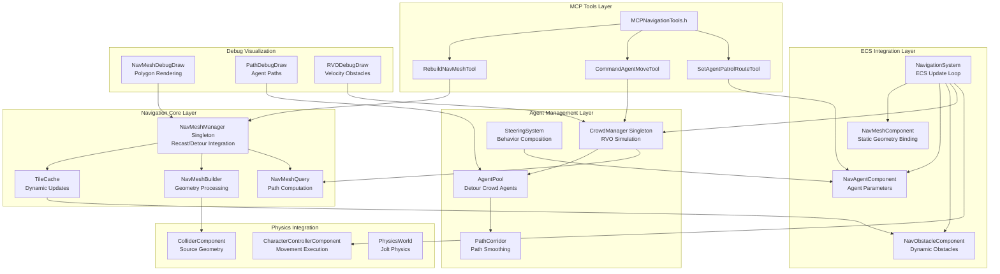
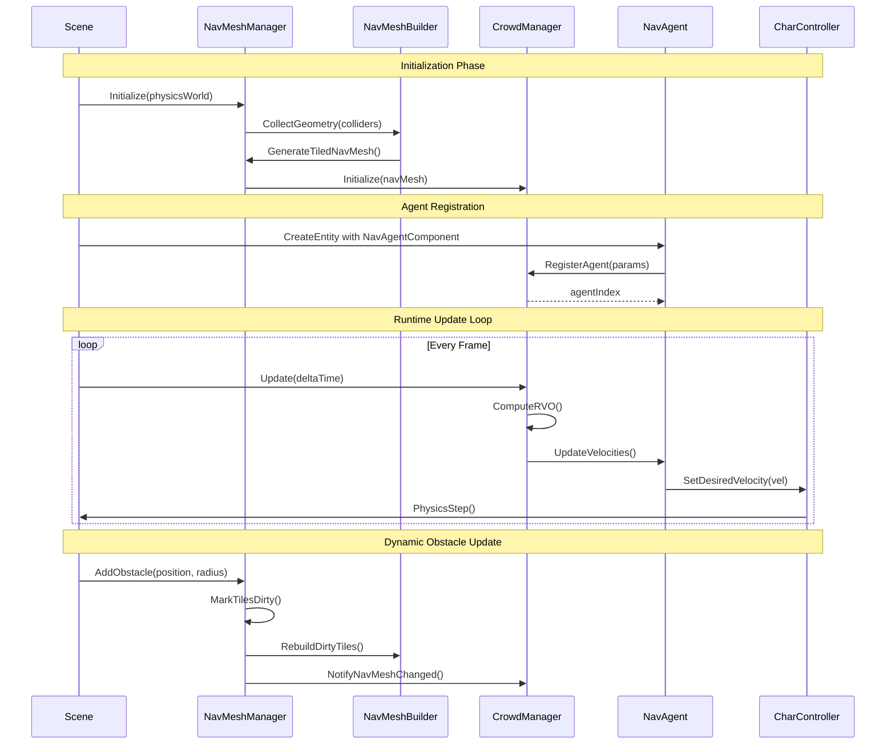
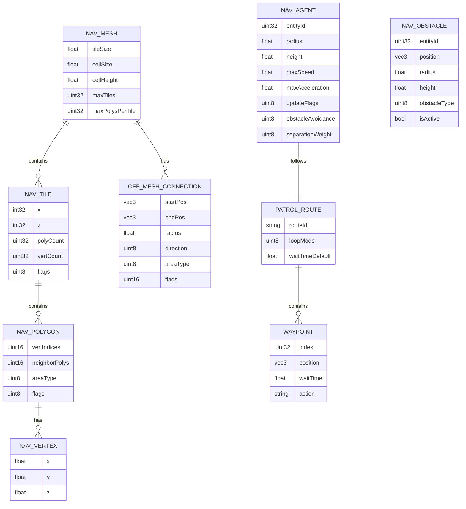
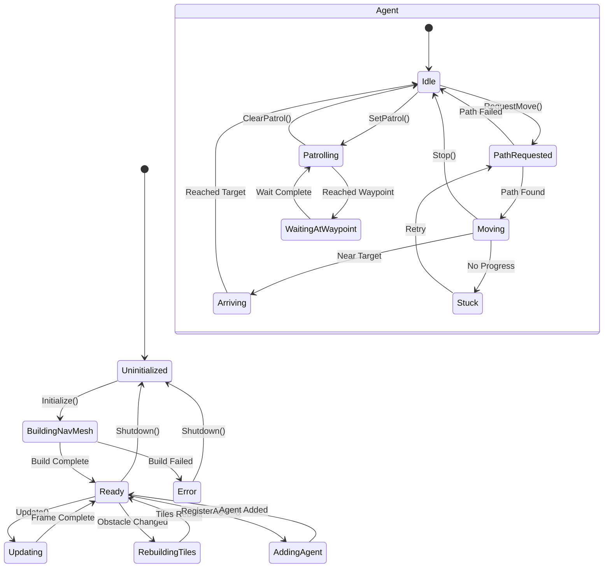

# Phase 17: Navigation & AI Pathfinding

## Implementation Plan

---

## Goal

Implement a comprehensive navigation and AI pathfinding system for the Artificial Intelligence Game Engine. This phase delivers NavMesh generation from collision geometry using RecastNavigation/Detour, dynamic runtime NavMesh carving for obstacle changes, NavAgentComponent with A* pathfinding and steering behaviors, crowd simulation using Reciprocal Velocity Obstacles (RVO) for multi-agent collision avoidance, and MCP tool extensions enabling AI agents to orchestrate complex NPC movements, rebuild navigation meshes, and set patrol routes dynamically.

---

## Requirements

### NavMesh Dependency Integration (Step 17.1)

- Integrate RecastNavigation library via vcpkg for industry-standard NavMesh generation
- Generate walkable surfaces from existing `ColliderComponent` mesh data and physics geometry
- Support configurable agent parameters: radius, height, max climb, max slope
- Implement tile-based NavMesh for large world support
- Provide debug visualization for NavMesh polygons, edges, and agent paths
- Target < 2ms NavMesh query time for path calculations

### Dynamic NavMesh Building (Step 17.2)

- Implement real-time NavMesh obstacle carving when environment changes
- Support temporary obstacles (doors, moving platforms) and permanent changes (destroyed geometry)
- Use Detour TileCache for efficient incremental updates
- Implement NavMesh region masking for area-specific navigation rules
- Support off-mesh connections for jumps, ladders, and teleporters
- Target < 50ms for single tile rebuild on obstacle change

### NavAgentComponent & Pathfinding (Step 17.3)

- Create `NavMeshComponent` for static navigation geometry binding
- Create `NavAgentComponent` for agent-specific movement parameters
- Implement A* pathfinding via Detour with path corridor smoothing
- Add corner rounding and path optimization for natural movement
- Integrate steering behaviors: Seek, Flee, Arrive, Wander, Path Following
- Implement movement synchronization with `CharacterControllerComponent`
- Support partial path recalculation on path invalidation

### Crowd Simulation (Step 17.4)

- Implement RVO (Reciprocal Velocity Obstacles) for local collision avoidance
- Create `CrowdManager` singleton for batched agent updates
- Support agent priority levels for precedence in tight spaces
- Implement separation steering to prevent agent overlap
- Add velocity obstacle visualization for debugging
- Target 200+ simultaneous agents at 60fps
- Integrate with JobSystem for parallel velocity computation

### MCP Navigation Tools (Step 17.5)

- Implement `RebuildNavMesh` tool for AI-triggered mesh regeneration
- Implement `CommandAgentMove` tool for AI-directed NPC movement
- Implement `SetAgentPatrolRoute` tool for defining patrol waypoint sequences
- Add safety validation for path reachability and valid coordinates
- Support async NavMesh rebuild with progress reporting
- Enable AI-generated maze validation (ensure solvability)

---

## Technical Considerations

### System Architecture Overview



### Data Flow Diagram



### Technology Stack Selection

| Layer              | Technology          | Rationale                                            |
| ------------------ | ------------------- | ---------------------------------------------------- |
| NavMesh Generation | Recast              | Industry standard, used in Unreal/Unity, open source |
| Pathfinding        | Detour              | Optimized A* with path corridors, tile-based queries |
| Dynamic Updates    | DetourTileCache     | Incremental rebuild, obstacle carving support        |
| Crowd Simulation   | DetourCrowd         | Built-in RVO, integrates with Detour pathfinding     |
| Alternative RVO    | RVO2 Library        | Fallback if DetourCrowd insufficient                 |
| Parallel Execution | Core::JobSystem     | Existing multi-threaded infrastructure               |
| Debug Rendering    | DebugDraw Interface | Custom Vulkan implementation                         |
| JSON Schemas       | nlohmann::json      | Already integrated in MCP layer                      |

### Integration Points

- **Physics Integration**: NavMesh generated from `ColliderComponent` mesh data; agent movement via `CharacterControllerComponent`
- **ECS Integration**: `NavAgentComponent`, `NavMeshComponent`, `NavObstacleComponent` managed by `NavigationSystem`
- **MCP Integration**: New tool category `MCPNavigationTools.h` following existing patterns
- **Renderer Integration**: Debug visualization renders after main scene pass
- **JobSystem Integration**: Parallel NavMesh rebuild and crowd velocity computation

### Deployment Architecture

```
Core/
├── Navigation/
│   ├── NavMeshManager.h/cpp           # Singleton managing all NavMesh operations
│   ├── NavMeshBuilder.h/cpp           # Geometry collection and mesh generation
│   ├── NavMeshQuery.h/cpp             # Path queries and corridor management
│   ├── TileCacheManager.h/cpp         # Dynamic obstacle handling
│   ├── CrowdManager.h/cpp             # RVO crowd simulation
│   ├── SteeringBehaviors.h/cpp        # Seek, Flee, Arrive, Wander, etc.
│   ├── PathCorridor.h/cpp             # Path smoothing and corner rounding
│   ├── OffMeshConnection.h            # Jump links, ladders, teleporters
│   ├── NavMeshDebugDraw.h/cpp         # Debug visualization
│   ├── NavigationConfig.h             # Configuration structs
│   └── RecastDetourInternal.h         # Internal Recast/Detour wrappers
├── ECS/
│   ├── Components/
│   │   ├── NavMeshComponent.h         # Static navigation mesh binding
│   │   ├── NavAgentComponent.h        # Agent movement parameters
│   │   └── NavObstacleComponent.h     # Dynamic obstacle definition
│   └── Systems/
│       └── NavigationSystem.h/cpp     # Navigation update system
├── MCP/
│   ├── MCPNavigationTools.h           # All navigation MCP tools
│   └── MCPAllTools.h                  # Updated to include navigation tools
└── Shaders/
    ├── navmesh_debug.vert             # NavMesh polygon visualization
    └── navmesh_debug.frag             # NavMesh debug coloring
```

### Scalability Considerations

- **Tile-Based NavMesh**: Large worlds split into tiles (256x256 units recommended)
- **Async Rebuild**: NavMesh regeneration on worker threads via JobSystem
- **Agent LOD**: Reduce pathfinding frequency for distant agents
- **Spatial Hashing**: Quick agent neighbor queries for RVO
- **Batch Updates**: Group dirty tiles for bulk rebuild
- **Memory Pools**: Pre-allocated path buffers to avoid runtime allocation

---

## Database Schema Design

### Navigation Data Structures



### Area Type Definitions

| Area Type       | ID  | Cost Multiplier | Description              |
| --------------- | --- | --------------- | ------------------------ |
| `AREA_GROUND`   | 0   | 1.0             | Normal walkable ground   |
| `AREA_WATER`    | 1   | 10.0            | Shallow water (wadeable) |
| `AREA_ROAD`     | 2   | 0.5             | Fast travel paths        |
| `AREA_GRASS`    | 3   | 1.2             | Slightly slower movement |
| `AREA_DOOR`     | 4   | 1.5             | Doors (can be blocked)   |
| `AREA_JUMP`     | 5   | 2.0             | Jump-required traversal  |
| `AREA_DISABLED` | 63  | ∞               | Non-walkable             |

---

## API Design

### NavMeshManager Singleton

```cpp
namespace Core::Navigation {

struct NavMeshConfig {
    float CellSize = 0.3f;              // XZ voxel size (smaller = more detail)
    float CellHeight = 0.2f;            // Y voxel size
    float AgentHeight = 2.0f;           // Default agent height
    float AgentRadius = 0.6f;           // Default agent radius
    float AgentMaxClimb = 0.4f;         // Max step height
    float AgentMaxSlope = 45.0f;        // Max walkable slope (degrees)
    float TileSize = 48.0f;             // Tile size in world units
    uint32_t MaxTiles = 1024;           // Maximum tile count
    uint32_t MaxPolysPerTile = 4096;    // Max polygons per tile
    float RegionMinSize = 8.0f;         // Min region area
    float RegionMergeSize = 20.0f;      // Region merge threshold
    float EdgeMaxLen = 12.0f;           // Max edge length
    float EdgeMaxError = 1.3f;          // Simplification error
    float DetailSampleDist = 6.0f;      // Detail mesh sample distance
    float DetailSampleMaxError = 1.0f;  // Detail mesh max error
    bool BuildDetailMesh = true;        // Generate height detail
    bool FilterLedgeSpans = true;       // Remove ledge spans
    bool FilterWalkableLowHeightSpans = true;
    bool FilterLowHangingObstacles = true;
};

struct NavMeshBuildResult {
    bool Success = false;
    std::string ErrorMessage;
    uint32_t TilesBuilt = 0;
    uint32_t PolygonCount = 0;
    float BuildTimeMs = 0.0f;
    size_t MemoryUsedBytes = 0;
};

struct PathQueryResult {
    bool Found = false;
    std::vector<Math::Vec3> Path;           // Smoothed path points
    std::vector<dtPolyRef> PolygonPath;     // Polygon refs for corridor
    float PathLength = 0.0f;
    uint32_t PolygonCount = 0;
};

class NavMeshManager {
public:
    static NavMeshManager& Get();

    // Lifecycle
    bool Initialize(const NavMeshConfig& config = NavMeshConfig{});
    void Shutdown();

    // NavMesh Building
    NavMeshBuildResult BuildFromScene(ECS::Scene* scene);
    NavMeshBuildResult BuildFromColliders(const std::vector<ColliderData>& colliders);
    NavMeshBuildResult RebuildTile(int32_t tileX, int32_t tileZ);
    std::future<NavMeshBuildResult> BuildFromSceneAsync(ECS::Scene* scene);

    // NavMesh Access
    dtNavMesh* GetNavMesh();
    dtNavMeshQuery* GetNavMeshQuery();
    bool IsInitialized() const;
    bool HasNavMeshData() const;

    // Path Queries
    PathQueryResult FindPath(const Math::Vec3& start, const Math::Vec3& end,
                             const dtQueryFilter* filter = nullptr);
    Math::Vec3 FindNearestPoint(const Math::Vec3& position, 
                                 const Math::Vec3& extents = {2.0f, 4.0f, 2.0f});
    bool IsPointOnNavMesh(const Math::Vec3& position,
                          const Math::Vec3& extents = {0.5f, 2.0f, 0.5f});
    float GetDistanceToNavMesh(const Math::Vec3& position);

    // Raycast on NavMesh
    bool Raycast(const Math::Vec3& start, const Math::Vec3& end,
                 Math::Vec3& hitPoint, Math::Vec3& hitNormal);

    // Off-Mesh Connections
    void AddOffMeshConnection(const Math::Vec3& start, const Math::Vec3& end,
                              float radius, bool bidirectional = false,
                              uint8_t areaType = AREA_JUMP);
    void RemoveOffMeshConnection(uint32_t connectionId);
    void ClearOffMeshConnections();

    // Tile Management
    void GetTileAt(const Math::Vec3& position, int32_t& outX, int32_t& outZ);
    void MarkTileDirty(int32_t tileX, int32_t tileZ);
    void MarkTilesDirtyInRadius(const Math::Vec3& center, float radius);
    void RebuildDirtyTiles();

    // Configuration
    const NavMeshConfig& GetConfig() const;
    void SetQueryFilter(const dtQueryFilter& filter);

    // Debug Visualization
    void SetDebugDrawEnabled(bool enabled);
    void DrawDebugNavMesh(RHI::RHICommandList* cmdList, const Math::Mat4& viewProj);

    // Statistics
    struct NavMeshStats {
        uint32_t TileCount;
        uint32_t PolygonCount;
        uint32_t VertexCount;
        size_t MemoryUsedBytes;
        float LastRebuildTimeMs;
    };
    NavMeshStats GetStats() const;

private:
    NavMeshConfig m_config;
    dtNavMesh* m_navMesh = nullptr;
    dtNavMeshQuery* m_navQuery = nullptr;
    dtTileCache* m_tileCache = nullptr;
    std::unique_ptr<NavMeshBuilder> m_builder;
    std::set<std::pair<int32_t, int32_t>> m_dirtyTiles;
    std::mutex m_mutex;
    bool m_debugDrawEnabled = false;
};

} // namespace Core::Navigation
```

### NavMeshComponent Structure

```cpp
namespace Core::ECS {

// Marks an entity as contributing to the NavMesh (static geometry source)
struct NavMeshComponent {
    bool IncludeInNavMesh = true;           // Whether to use for NavMesh generation
    uint8_t AreaType = Navigation::AREA_GROUND; // Area type for generated polygons
    uint16_t AreaFlags = Navigation::FLAG_WALK; // Navigation flags
    float WalkableSlopeOverride = -1.0f;    // Override max slope (-1 = use default)
    bool GenerateOffMeshLinks = false;       // Auto-generate jump links at edges

    // Factory methods
    static NavMeshComponent Create(uint8_t areaType = Navigation::AREA_GROUND);
    static NavMeshComponent CreateNonWalkable();
    static NavMeshComponent CreateWater();
    static NavMeshComponent CreateRoad();
};

} // namespace Core::ECS
```

### NavAgentComponent Structure

```cpp
namespace Core::ECS {

enum class AgentState : uint8_t {
    Idle,           // Not moving
    Moving,         // Following path
    Arriving,       // Slowing down near goal
    Stuck,          // Cannot make progress
    OffMesh,        // Traversing off-mesh connection
    Waiting         // At patrol waypoint
};

enum class PathFollowMode : uint8_t {
    Strict,         // Follow path exactly
    Smooth,         // Smooth corners
    Optimistic      // Cut corners when possible
};

enum class AvoidanceQuality : uint8_t {
    None = 0,       // No avoidance
    Low = 1,        // 4 sample directions
    Medium = 2,     // 8 sample directions
    High = 3        // 16 sample directions
};

struct PatrolWaypoint {
    Math::Vec3 Position;
    float WaitTime = 0.0f;              // Seconds to wait at waypoint
    std::string Action;                  // Optional action to trigger
};

struct PatrolRoute {
    std::string RouteId;
    std::vector<PatrolWaypoint> Waypoints;
    bool Loop = true;                    // Loop back to start
    bool PingPong = false;               // Reverse at end instead of looping
    uint32_t CurrentWaypointIndex = 0;
    float WaitTimer = 0.0f;
};

struct NavAgentComponent {
    // Physical parameters (Detour agent params)
    float Radius = 0.6f;                // Agent collision radius
    float Height = 2.0f;                // Agent height
    float MaxSpeed = 3.5f;              // Maximum movement speed (m/s)
    float MaxAcceleration = 8.0f;       // Maximum acceleration (m/s²)

    // Pathfinding parameters
    float PathOptimizationRange = 30.0f;    // Corridor optimization range
    float SeparationWeight = 2.0f;          // Agent separation strength
    uint8_t UpdateFlags = DT_CROWD_ANTICIPATE_TURNS | 
                          DT_CROWD_OPTIMIZE_VIS | 
                          DT_CROWD_OPTIMIZE_TOPO;
    AvoidanceQuality ObstacleAvoidance = AvoidanceQuality::High;
    PathFollowMode FollowMode = PathFollowMode::Smooth;

    // Current state
    AgentState State = AgentState::Idle;
    Math::Vec3 TargetPosition{0, 0, 0};
    Math::Vec3 CurrentVelocity{0, 0, 0};
    Math::Vec3 DesiredVelocity{0, 0, 0};
    float DistanceToGoal = 0.0f;
    float StuckTimer = 0.0f;

    // Patrol route (optional)
    std::optional<PatrolRoute> Patrol;

    // Crowd integration
    int32_t CrowdAgentIndex = -1;       // Index in DetourCrowd (-1 = not registered)
    bool IsRegistered = false;
    bool NeedsPathRecalc = false;

    // Steering weights (0-1)
    float SeekWeight = 1.0f;
    float FleeWeight = 0.0f;
    float ArriveWeight = 1.0f;
    float WanderWeight = 0.0f;
    float PathFollowWeight = 1.0f;

    // Callbacks
    std::function<void(const Math::Vec3&)> OnReachedDestination;
    std::function<void()> OnPathFailed;
    std::function<void(const PatrolWaypoint&)> OnWaypointReached;

    // Factory methods
    static NavAgentComponent Create(float radius = 0.6f, float height = 2.0f);
    static NavAgentComponent CreateFast(float maxSpeed = 6.0f);
    static NavAgentComponent CreateSlow(float maxSpeed = 1.5f);

    // Helper methods
    bool IsMoving() const { return State == AgentState::Moving || State == AgentState::Arriving; }
    bool IsIdle() const { return State == AgentState::Idle || State == AgentState::Waiting; }
    bool HasPatrol() const { return Patrol.has_value() && !Patrol->Waypoints.empty(); }
    void SetDestination(const Math::Vec3& target);
    void Stop();
    void SetPatrolRoute(const PatrolRoute& route);
    void ClearPatrolRoute();
};

} // namespace Core::ECS
```

### NavObstacleComponent Structure

```cpp
namespace Core::ECS {

enum class ObstacleType : uint8_t {
    Cylinder,   // Vertical cylinder (radius + height)
    Box,        // Axis-aligned box
    Convex      // Convex hull from vertices
};

struct NavObstacleComponent {
    ObstacleType Type = ObstacleType::Cylinder;

    // Cylinder parameters
    float Radius = 1.0f;
    float Height = 2.0f;

    // Box parameters (for Type::Box)
    Math::Vec3 HalfExtents{1.0f, 1.0f, 1.0f};

    // Convex hull (for Type::Convex)
    std::vector<Math::Vec3> Vertices;

    // Obstacle state
    bool IsActive = true;                   // Whether obstacle is currently blocking
    uint8_t AreaType = Navigation::AREA_DISABLED; // Area type within obstacle
    dtObstacleRef ObstacleRef = 0;          // TileCache obstacle reference
    bool IsDirty = true;                    // Needs TileCache update

    // Factory methods
    static NavObstacleComponent CreateCylinder(float radius, float height);
    static NavObstacleComponent CreateBox(const Math::Vec3& halfExtents);
    static NavObstacleComponent CreateFromCollider(const ColliderComponent& collider);

    // Helper methods
    void SetActive(bool active);
    void UpdateFromTransform(const TransformComponent& transform);
};

} // namespace Core::ECS
```

### CrowdManager Class

```cpp
namespace Core::Navigation {

struct CrowdConfig {
    uint32_t MaxAgents = 256;                       // Maximum simultaneous agents
    float MaxAgentRadius = 2.0f;                    // Largest agent radius
    float UpdateDelta = 1.0f / 60.0f;               // Target update rate
    bool UseParallelUpdate = true;                  // Use JobSystem for updates
    uint32_t VelocitySampleCount = 6;               // RVO velocity samples
    float PathQueryTimeSlice = 2.0f;                // Max ms per frame for path queries
    float ObstacleAvoidanceTimeHorizon = 2.5f;      // Seconds to look ahead
    float ObstacleAvoidanceTimeHorizonObst = 1.5f;  // For static obstacles
    float CollisionQueryRange = 12.0f;              // Neighbor query range
};

struct AgentDebugInfo {
    int32_t AgentIndex;
    Math::Vec3 Position;
    Math::Vec3 Velocity;
    Math::Vec3 DesiredVelocity;
    Math::Vec3 TargetPosition;
    std::vector<Math::Vec3> CornerPath;
    std::vector<Math::Vec3> VelocityObstacles; // For debug visualization
    bool IsActive;
    AgentState State;
};

class CrowdManager {
public:
    static CrowdManager& Get();

    // Lifecycle
    bool Initialize(dtNavMesh* navMesh, const CrowdConfig& config = CrowdConfig{});
    void Shutdown();

    // Agent Management
    int32_t RegisterAgent(const Math::Vec3& position, const NavAgentComponent& params);
    void UnregisterAgent(int32_t agentIndex);
    void UpdateAgentParams(int32_t agentIndex, const NavAgentComponent& params);
    bool IsAgentValid(int32_t agentIndex) const;

    // Agent Commands
    bool RequestMoveTarget(int32_t agentIndex, const Math::Vec3& target);
    bool RequestMoveVelocity(int32_t agentIndex, const Math::Vec3& velocity);
    void ResetAgentMove(int32_t agentIndex);

    // Agent Queries
    Math::Vec3 GetAgentPosition(int32_t agentIndex) const;
    Math::Vec3 GetAgentVelocity(int32_t agentIndex) const;
    Math::Vec3 GetAgentDesiredVelocity(int32_t agentIndex) const;
    Math::Vec3 GetAgentTargetPosition(int32_t agentIndex) const;
    AgentState GetAgentState(int32_t agentIndex) const;
    std::vector<Math::Vec3> GetAgentPath(int32_t agentIndex) const;

    // Simulation
    void Update(float deltaTime);
    void UpdateParallel(float deltaTime);

    // Configuration
    const CrowdConfig& GetConfig() const;
    void SetFilter(int32_t agentIndex, const dtQueryFilter& filter);

    // NavMesh updates
    void NotifyNavMeshChanged();
    void RefreshAllAgentPaths();

    // Debug
    std::vector<AgentDebugInfo> GetAllAgentDebugInfo() const;
    void SetDebugDrawEnabled(bool enabled);
    void DrawDebugAgents(RHI::RHICommandList* cmdList, const Math::Mat4& viewProj);

    // Statistics
    struct CrowdStats {
        uint32_t ActiveAgentCount;
        uint32_t MaxActiveAgents;
        float LastUpdateTimeMs;
        uint32_t PathQueriesThisFrame;
        uint32_t VelocityUpdatesThisFrame;
    };
    CrowdStats GetStats() const;

private:
    CrowdConfig m_config;
    dtCrowd* m_crowd = nullptr;
    dtNavMesh* m_navMesh = nullptr;
    std::vector<bool> m_agentSlotUsed;
    std::mutex m_mutex;
    bool m_debugDrawEnabled = false;

    // Parallel update helpers
    void ComputeVelocitiesParallel(float deltaTime);
    void IntegratePositions(float deltaTime);
};

} // namespace Core::Navigation
```

### NavigationSystem Class

```cpp
namespace Core::ECS::Systems {

class NavigationSystem {
public:
    void Initialize(Navigation::NavMeshManager* navMeshManager,
                    Navigation::CrowdManager* crowdManager,
                    Physics::PhysicsWorld* physicsWorld);

    // System lifecycle
    void PreUpdate(Scene& scene);   // Register new agents, remove deleted
    void Update(Scene& scene, float deltaTime);
    void PostUpdate(Scene& scene);  // Sync velocities to CharacterControllers

    // Manual controls
    void RebuildNavMesh(Scene& scene);
    std::future<bool> RebuildNavMeshAsync(Scene& scene);

    // Agent commands (convenience wrappers)
    bool MoveAgentTo(Scene& scene, entt::entity entity, const Math::Vec3& target);
    void StopAgent(Scene& scene, entt::entity entity);
    void SetAgentPatrol(Scene& scene, entt::entity entity, const PatrolRoute& route);

    // Obstacle management
    void AddObstacle(Scene& scene, entt::entity entity);
    void RemoveObstacle(Scene& scene, entt::entity entity);
    void UpdateObstacles(Scene& scene);

    // Configuration
    void SetUpdateRate(float updatesPerSecond);
    void EnableParallelUpdate(bool enable);

    // Debug
    void SetDebugVisualization(bool enabled);

private:
    Navigation::NavMeshManager* m_navMeshManager = nullptr;
    Navigation::CrowdManager* m_crowdManager = nullptr;
    Physics::PhysicsWorld* m_physicsWorld = nullptr;

    float m_updateAccumulator = 0.0f;
    float m_fixedUpdateRate = 1.0f / 60.0f;
    bool m_parallelUpdate = true;

    void RegisterNewAgents(Scene& scene);
    void UnregisterRemovedAgents(Scene& scene);
    void UpdateAgentStates(Scene& scene);
    void SyncToCharacterControllers(Scene& scene);
    void ProcessPatrolLogic(Scene& scene, float deltaTime);
};

} // namespace Core::ECS::Systems
```

### Steering Behaviors

```cpp
namespace Core::Navigation {

struct SteeringOutput {
    Math::Vec3 Linear{0, 0, 0};     // Linear acceleration
    float Angular = 0.0f;            // Angular acceleration (radians/s²)
};

class SteeringBehaviors {
public:
    // Basic behaviors
    static SteeringOutput Seek(const Math::Vec3& position, 
                                const Math::Vec3& target,
                                float maxAcceleration);

    static SteeringOutput Flee(const Math::Vec3& position,
                                const Math::Vec3& threat,
                                float maxAcceleration,
                                float panicDistance = 10.0f);

    static SteeringOutput Arrive(const Math::Vec3& position,
                                  const Math::Vec3& target,
                                  const Math::Vec3& velocity,
                                  float maxSpeed,
                                  float maxAcceleration,
                                  float slowRadius = 5.0f,
                                  float targetRadius = 0.5f);

    static SteeringOutput Wander(const Math::Vec3& position,
                                  const Math::Vec3& velocity,
                                  float wanderRadius,
                                  float wanderDistance,
                                  float wanderJitter,
                                  Math::Vec3& wanderTarget);

    static SteeringOutput FollowPath(const Math::Vec3& position,
                                      const Math::Vec3& velocity,
                                      const std::vector<Math::Vec3>& path,
                                      uint32_t& currentPathIndex,
                                      float maxAcceleration,
                                      float pathRadius = 1.0f);

    // Group behaviors
    static SteeringOutput Separation(const Math::Vec3& position,
                                      const std::vector<Math::Vec3>& neighbors,
                                      float desiredSeparation,
                                      float maxAcceleration);

    static SteeringOutput Cohesion(const Math::Vec3& position,
                                    const std::vector<Math::Vec3>& neighbors,
                                    float maxAcceleration);

    static SteeringOutput Alignment(const Math::Vec3& velocity,
                                     const std::vector<Math::Vec3>& neighborVelocities,
                                     float maxAcceleration);

    // Combination
    static SteeringOutput Combine(const std::vector<std::pair<SteeringOutput, float>>& behaviors);

    // Utility
    static Math::Vec3 TruncateVector(const Math::Vec3& v, float maxLength);
    static Math::Vec3 ClampMagnitude(const Math::Vec3& v, float minLength, float maxLength);
};

} // namespace Core::Navigation
```

### MCP Navigation Tools

```cpp
namespace Core::MCP {

// ============================================================================
// RebuildNavMesh Tool
// ============================================================================
// Triggers full or partial NavMesh regeneration
//
// Input Schema:
// {
//   "mode": string,                    // Required: "full" | "region" | "tile"
//   "region": {                        // Required if mode="region"
//     "minX": number, "minZ": number,
//     "maxX": number, "maxZ": number
//   },
//   "tile": {                          // Required if mode="tile"
//     "x": number, "z": number
//   },
//   "async": boolean,                  // Optional: Run in background (default: true)
//   "config": {                        // Optional: Override build config
//     "cellSize": number,
//     "cellHeight": number,
//     "agentHeight": number,
//     "agentRadius": number,
//     "agentMaxClimb": number,
//     "agentMaxSlope": number
//   }
// }
//
// Returns:
// {
//   "success": boolean,
//   "tilesRebuilt": number,
//   "polygonCount": number,
//   "buildTimeMs": number,
//   "message": string
// }

class RebuildNavMeshTool : public MCPTool {
public:
    RebuildNavMeshTool();

    ToolInputSchema GetInputSchema() const override;
    ToolResult Execute(const Json& arguments, ECS::Scene* scene) override;
    bool RequiresScene() const override { return true; }
};

// ============================================================================
// CommandAgentMove Tool
// ============================================================================
// Commands an NPC agent to move to a target location
//
// Input Schema:
// {
//   "entityId": number,                // Required: Target entity ID
//   "entityName": string,              // Alternative: Entity name (if no ID)
//   "target": {                        // Required: Destination
//     "x": number, "y": number, "z": number
//   },
//   "targetEntity": number,            // Alternative: Move to another entity
//   "speed": number,                   // Optional: Override max speed
//   "stopDistance": number,            // Optional: Stop this far from target (default: 0.5)
//   "validatePath": boolean,           // Optional: Check path exists first (default: true)
//   "queueCommand": boolean            // Optional: Add to command queue (default: false)
// }
//
// Returns:
// {
//   "success": boolean,
//   "entityId": number,
//   "pathFound": boolean,
//   "pathLength": number,
//   "estimatedTime": number,
//   "message": string
// }

class CommandAgentMoveTool : public MCPTool {
public:
    CommandAgentMoveTool();

    ToolInputSchema GetInputSchema() const override;
    ToolResult Execute(const Json& arguments, ECS::Scene* scene) override;
    bool RequiresScene() const override { return true; }
};

// ============================================================================
// SetAgentPatrolRoute Tool
// ============================================================================
// Assigns a patrol route to an NPC agent
//
// Input Schema:
// {
//   "entityId": number,                // Required: Target entity ID
//   "entityName": string,              // Alternative: Entity name
//   "waypoints": [                     // Required: Array of patrol points
//     {
//       "position": { "x": number, "y": number, "z": number },
//       "waitTime": number,            // Optional: Seconds to wait (default: 0)
//       "action": string               // Optional: Action to trigger at waypoint
//     }
//   ],
//   "loop": boolean,                   // Optional: Loop patrol (default: true)
//   "pingPong": boolean,               // Optional: Reverse at end (default: false)
//   "startImmediately": boolean,       // Optional: Begin patrol now (default: true)
//   "validateRoute": boolean           // Optional: Check all waypoints reachable (default: true)
// }
//
// Returns:
// {
//   "success": boolean,
//   "entityId": number,
//   "waypointCount": number,
//   "totalDistance": number,
//   "estimatedCycleTime": number,
//   "unreachableWaypoints": [number],  // Indices of unreachable waypoints
//   "message": string
// }

class SetAgentPatrolRouteTool : public MCPTool {
public:
    SetAgentPatrolRouteTool();

    ToolInputSchema GetInputSchema() const override;
    ToolResult Execute(const Json& arguments, ECS::Scene* scene) override;
    bool RequiresScene() const override { return true; }
};

// ============================================================================
// GetNavigationInfo Tool (Bonus utility tool)
// ============================================================================
// Query navigation system state
//
// Input Schema:
// {
//   "query": string,                   // Required: "navmesh" | "agents" | "path" | "reachability"
//   "entityId": number,                // For agent/path queries
//   "from": { "x": number, "y": number, "z": number },  // For path/reachability
//   "to": { "x": number, "y": number, "z": number }     // For path/reachability
// }

class GetNavigationInfoTool : public MCPTool {
public:
    GetNavigationInfoTool();

    ToolInputSchema GetInputSchema() const override;
    ToolResult Execute(const Json& arguments, ECS::Scene* scene) override;
    bool RequiresScene() const override { return true; }
};

// Factory function to create all navigation tools
inline std::vector<MCPToolPtr> CreateNavigationTools() {
    return {
        std::make_shared<RebuildNavMeshTool>(),
        std::make_shared<CommandAgentMoveTool>(),
        std::make_shared<SetAgentPatrolRouteTool>(),
        std::make_shared<GetNavigationInfoTool>()
    };
}

} // namespace Core::MCP
```

### Error Handling

| Error Code               | HTTP Status | Description                      |
| ------------------------ | ----------- | -------------------------------- |
| `NAV_NOT_INITIALIZED`    | 500         | NavMesh system not initialized   |
| `NAV_BUILD_FAILED`       | 500         | NavMesh generation failed        |
| `NAV_PATH_NOT_FOUND`     | 404         | No valid path between points     |
| `NAV_POINT_OFF_MESH`     | 400         | Position not on NavMesh          |
| `NAV_AGENT_NOT_FOUND`    | 404         | Entity has no NavAgentComponent  |
| `NAV_AGENT_LIMIT`        | 429         | Maximum agent count reached      |
| `NAV_INVALID_WAYPOINT`   | 400         | Waypoint position not reachable  |
| `NAV_TILE_OUT_OF_BOUNDS` | 400         | Tile coordinates outside NavMesh |

---

## Frontend Architecture

### Debug Visualization Hierarchy

```
Navigation Debug System
├── NavMeshDebugDraw
│   ├── Polygon Faces (color by area type)
│   ├── Polygon Edges (white wireframe)
│   ├── Off-Mesh Connections (orange arcs)
│   └── Tile Boundaries (gray grid)
├── AgentDebugDraw
│   ├── Agent Cylinders (green/red based on state)
│   ├── Current Path (blue line)
│   ├── Path Corridor (transparent blue polygons)
│   └── Target Position (crosshair marker)
├── CrowdDebugDraw
│   ├── Velocity Vectors (yellow arrows)
│   ├── Desired Velocity (cyan arrows)
│   ├── RVO Obstacles (purple circles)
│   └── Separation Radius (dotted circles)
└── ObstacleDebugDraw
    ├── Active Obstacles (red tint)
    └── Carved Regions (hatched pattern)
```

### State Flow Diagram



---

## Security & Performance

### Input Validation

- All MCP tool inputs validated against JSON schemas
- Position coordinates clamped to world bounds (±1,000,000 units)
- Entity IDs validated against scene registry
- Waypoint counts limited (max 100 waypoints per route)
- NavMesh rebuild rate-limited (max 1 full rebuild per 5 seconds)
- Agent count validated against CrowdConfig.MaxAgents

### Performance Optimization

| Technique          | Target               | Implementation                                |
| ------------------ | -------------------- | --------------------------------------------- |
| Tile-Based NavMesh | Large worlds         | 48x48 unit tiles, only rebuild affected tiles |
| Path Caching       | Repeated queries     | LRU cache for recent path queries             |
| Async Rebuild      | No main thread stall | JobSystem background task                     |
| Agent LOD          | Distant agents       | Reduce update frequency based on distance     |
| Spatial Hashing    | Neighbor queries     | O(1) agent neighbor lookup                    |
| Parallel RVO       | 200+ agents          | Split agents across worker threads            |
| Path Corridor      | Smooth movement      | Incremental corridor optimization             |

### Performance Budget

| System                      | CPU Budget  | Memory     | Notes                     |
| --------------------------- | ----------- | ---------- | ------------------------- |
| NavMesh Storage             | N/A         | 2-10 MB    | Depends on world size     |
| NavMesh Query               | 0.5ms       | 64 KB      | Per-query temp allocation |
| Crowd Update (100 agents)   | 1.0ms       | 512 KB     | With parallel RVO         |
| Crowd Update (200 agents)   | 1.8ms       | 1 MB       | Linear scaling            |
| Tile Rebuild (single)       | 20-50ms     | 2 MB temp  | Background thread         |
| Full Rebuild (medium world) | 2-5s        | 50 MB temp | Async only                |
| **Total per Frame**         | **< 2.5ms** | **~15 MB** | At 200 agents             |

---

## Detailed Step Breakdown

### Step 17.1: NavMesh Dependency Integration (v0.17.1.x)

#### Sub-step 17.1.1: RecastNavigation vcpkg Integration (v0.17.1.1)

- Add `recastnavigation` to `vcpkg.json` dependencies
- Verify Recast/Detour headers accessible
- Add to CMakeLists.txt link targets
- Create `Core/Navigation/` directory structure
- **Deliverable**: Recast/Detour compiles and links

#### Sub-step 17.1.2: NavMeshConfig & Types (v0.17.1.2)

- Create `Core/Navigation/NavigationConfig.h`
- Define `NavMeshConfig` struct with all Recast parameters
- Define area type constants (AREA_GROUND, AREA_WATER, etc.)
- Define navigation flags (FLAG_WALK, FLAG_SWIM, etc.)
- **Deliverable**: Configuration types defined

#### Sub-step 17.1.3: NavMeshBuilder Implementation (v0.17.1.3)

- Create `Core/Navigation/NavMeshBuilder.h/cpp`
- Implement geometry collection from `ColliderComponent` meshes
- Convert engine mesh format to Recast input format
- Build rcHeightfield from collision geometry
- Implement rcCompactHeightfield generation
- Add region building and contour tracing
- Generate dtNavMesh from Detour poly mesh
- **Deliverable**: NavMesh generation from scene geometry

#### Sub-step 17.1.4: NavMeshManager Singleton (v0.17.1.4)

- Create `Core/Navigation/NavMeshManager.h/cpp`
- Implement singleton pattern following existing conventions
- Initialize dtNavMesh and dtNavMeshQuery
- Implement `BuildFromScene()` synchronous method
- Add basic path query with `FindPath()`
- **Deliverable**: Core NavMesh management working

#### Sub-step 17.1.5: Tile-Based NavMesh Support (v0.17.1.5)

- Extend NavMeshBuilder for tiled generation
- Implement `rcCreateHeightfieldLayerSet` for tile layers
- Create dtTileCacheParams configuration
- Add tile coordinate conversion utilities
- Implement `GetTileAt()` and `RebuildTile()`
- **Deliverable**: Large world NavMesh support

#### Sub-step 17.1.6: NavMesh Debug Visualization (v0.17.1.6)

- Create `Core/Navigation/NavMeshDebugDraw.h/cpp`
- Implement Vulkan debug draw for NavMesh polygons
- Color polygons by area type
- Draw polygon edges as wireframe
- Draw off-mesh connections as arcs
- Add tile boundary visualization
- **Deliverable**: Visual NavMesh debugging

#### Sub-step 17.1.7: NavMeshComponent ECS Integration (v0.17.1.7)

- Create `Core/ECS/Components/NavMeshComponent.h`
- Define component struct with area type and flags
- Add to `Components.h` includes
- Implement serialization for save/load
- **Deliverable**: NavMesh ECS component

---

### Step 17.2: Dynamic NavMesh Building (v0.17.2.x)

#### Sub-step 17.2.1: TileCache Integration (v0.17.2.1)

- Create `Core/Navigation/TileCacheManager.h/cpp`
- Initialize dtTileCache with compression support
- Implement obstacle layer processing
- Configure tile cache allocator and compressor
- **Deliverable**: TileCache infrastructure

#### Sub-step 17.2.2: NavObstacleComponent (v0.17.2.2)

- Create `Core/ECS/Components/NavObstacleComponent.h`
- Define obstacle types (Cylinder, Box, Convex)
- Implement factory methods
- Add serialization support
- **Deliverable**: Obstacle ECS component

#### Sub-step 17.2.3: Dynamic Obstacle Carving (v0.17.2.3)

- Implement `AddObstacle()` in TileCacheManager
- Convert NavObstacleComponent to dtTileCacheObstacle
- Handle obstacle position updates
- Implement `RemoveObstacle()` for cleanup
- **Deliverable**: Runtime obstacle carving

#### Sub-step 17.2.4: Dirty Tile Tracking (v0.17.2.4)

- Implement dirty tile set in NavMeshManager
- Add `MarkTileDirty()` and `MarkTilesDirtyInRadius()`
- Trigger dirty marking on obstacle add/remove/move
- Implement batched dirty tile processing
- **Deliverable**: Efficient incremental updates

#### Sub-step 17.2.5: Async Tile Rebuild (v0.17.2.5)

- Implement `RebuildDirtyTiles()` async via JobSystem
- Add thread-safe tile replacement
- Implement rebuild progress tracking
- Handle NavMesh query during rebuild (stale data)
- **Deliverable**: Background tile updates

#### Sub-step 17.2.6: Off-Mesh Connections (v0.17.2.6)

- Implement `AddOffMeshConnection()` API
- Support bidirectional connections
- Add connection visualization in debug draw
- Handle connection validation
- **Deliverable**: Jump links and special traversal

#### Sub-step 17.2.7: Area Masking (v0.17.2.7)

- Implement dtQueryFilter setup per agent type
- Support area cost multipliers
- Add area exclusion flags
- Implement water/flying agent filters
- **Deliverable**: Area-specific navigation rules

---

### Step 17.3: NavAgentComponent & Pathfinding (v0.17.3.x)

#### Sub-step 17.3.1: NavAgentComponent Definition (v0.17.3.1)

- Create `Core/ECS/Components/NavAgentComponent.h`
- Define all agent parameters (radius, height, speed, etc.)
- Define AgentState enum
- Add PatrolRoute and PatrolWaypoint structs
- Implement factory methods
- **Deliverable**: Agent ECS component

#### Sub-step 17.3.2: CrowdManager Core (v0.17.3.2)

- Create `Core/Navigation/CrowdManager.h/cpp`
- Initialize dtCrowd with configured capacity
- Implement `RegisterAgent()` and `UnregisterAgent()`
- Map dtCrowd agent indices to ECS entities
- **Deliverable**: Crowd agent management

#### Sub-step 17.3.3: Path Request System (v0.17.3.3)

- Implement `RequestMoveTarget()` in CrowdManager
- Handle path query via dtNavMeshQuery
- Store path in dtPathCorridor per agent
- Implement path validation and failure detection
- **Deliverable**: Path request handling

#### Sub-step 17.3.4: Path Corridor & Smoothing (v0.17.3.4)

- Create `Core/Navigation/PathCorridor.h/cpp`
- Implement corner extraction from polygon path
- Add Catmull-Rom spline smoothing for corners
- Implement path shortcut optimization
- Support partial path recalculation
- **Deliverable**: Smooth path following

#### Sub-step 17.3.5: Steering Behaviors (v0.17.3.5)

- Create `Core/Navigation/SteeringBehaviors.h/cpp`
- Implement Seek, Flee, Arrive behaviors
- Implement Wander with configurable parameters
- Implement FollowPath with lookahead
- Add behavior combination with weights
- **Deliverable**: Steering behavior library

#### Sub-step 17.3.6: CharacterController Integration (v0.17.3.6)

- Sync NavAgent desired velocity to CharacterController
- Handle vertical movement (stairs, slopes)
- Implement ground detection for NavMesh projection
- Handle off-mesh connection traversal
- **Deliverable**: Physics-integrated movement

#### Sub-step 17.3.7: NavigationSystem Implementation (v0.17.3.7)

- Create `Core/ECS/Systems/NavigationSystem.h/cpp`
- Implement agent registration/unregistration loop
- Update agent states from CrowdManager
- Process patrol waypoint logic
- Sync velocities to CharacterControllers
- **Deliverable**: ECS navigation system

---

### Step 17.4: Crowd Simulation (v0.17.4.x)

#### Sub-step 17.4.1: RVO Integration (v0.17.4.1)

- Configure dtCrowd obstacle avoidance parameters
- Set velocity sample count based on quality setting
- Configure time horizons for agents and obstacles
- **Deliverable**: Basic RVO collision avoidance

#### Sub-step 17.4.2: Agent Priority System (v0.17.4.2)

- Add priority field to NavAgentComponent
- Implement priority-based avoidance weights
- Higher priority agents yield less in conflicts
- **Deliverable**: Priority-based navigation

#### Sub-step 17.4.3: Separation Steering (v0.17.4.3)

- Implement neighbor query using spatial hashing
- Calculate separation forces between close agents
- Add configurable separation weight
- Blend with RVO velocity
- **Deliverable**: Agent separation behavior

#### Sub-step 17.4.4: Parallel Crowd Update (v0.17.4.4)

- Split agent velocity computation across JobSystem workers
- Implement thread-local scratch buffers
- Batch neighbor queries for cache efficiency
- Maintain determinism with fixed update order
- **Deliverable**: Parallel RVO computation

#### Sub-step 17.4.5: Velocity Obstacle Visualization (v0.17.4.5)

- Extend NavMeshDebugDraw for RVO visualization
- Draw velocity vectors and desired velocity
- Visualize velocity obstacles as cones/circles
- Show avoidance samples
- **Deliverable**: RVO debug rendering

#### Sub-step 17.4.6: Crowd Statistics & Profiling (v0.17.4.6)

- Add Tracy profiling zones for crowd update
- Implement CrowdStats tracking
- Log performance warnings for overbudget frames
- Add agent count monitoring
- **Deliverable**: Performance instrumentation

---

### Step 17.5: MCP Server Navigation Tools (v0.17.5.x)

#### Sub-step 17.5.1: MCPNavigationTools Header (v0.17.5.1)

- Create `Core/MCP/MCPNavigationTools.h`
- Define tool input schemas using JSON Schema
- Follow existing MCPTool patterns
- **Deliverable**: Navigation tools header

#### Sub-step 17.5.2: RebuildNavMesh Tool (v0.17.5.2)

- Implement full NavMesh rebuild mode
- Implement region-based partial rebuild
- Implement single tile rebuild
- Support async execution with progress
- Add config override support
- Validate rebuild not in progress
- **Deliverable**: NavMesh rebuild MCP tool

#### Sub-step 17.5.3: CommandAgentMove Tool (v0.17.5.3)

- Implement entity lookup by ID and name
- Validate target position on NavMesh
- Request move through CrowdManager
- Return path information in result
- Support move-to-entity mode
- Add command queuing option
- **Deliverable**: Agent move MCP tool

#### Sub-step 17.5.4: SetAgentPatrolRoute Tool (v0.17.5.4)

- Validate all waypoints reachable
- Calculate total route distance
- Estimate cycle time based on agent speed
- Support loop and ping-pong modes
- Trigger immediate patrol start
- Return unreachable waypoint indices
- **Deliverable**: Patrol route MCP tool

#### Sub-step 17.5.5: GetNavigationInfo Tool (v0.17.5.5)

- Implement NavMesh status query
- Implement agent list query
- Implement path query between points
- Implement point reachability check
- Return structured navigation data
- **Deliverable**: Navigation query MCP tool

#### Sub-step 17.5.6: Tool Registration (v0.17.5.6)

- Update `MCPAllTools.h` to include navigation tools
- Add `CreateNavigationTools()` factory call
- Register tools with MCPServer
- Add input validation tests
- Document tool usage in comments
- **Deliverable**: Complete MCP navigation integration

---

## Dependencies

### External Libraries (vcpkg)

```json
{
  "dependencies": [
    "recastnavigation"
  ]
}
```

### Internal Dependencies

- **Phase 6**: Jolt Physics (ColliderComponent, CharacterControllerComponent)
- **Phase 5**: ECS framework (EnTT, Scene, Entity)
- **Phase 10**: MCP Server infrastructure
- **Phase 1**: JobSystem for parallel processing
- **Phase 4**: RHI for debug visualization

### Integration Requirements

- ColliderComponent must expose mesh vertices for NavMesh generation
- CharacterControllerComponent velocity sync for agent movement
- Scene must support NavMeshComponent, NavAgentComponent, NavObstacleComponent
- MCP server must be running for tool access

---

## Testing Strategy

### Unit Tests

| Test                            | Description                             |
| ------------------------------- | --------------------------------------- |
| `NavMeshBuilder_SimpleGeometry` | Build NavMesh from simple box colliders |
| `NavMeshBuilder_ComplexMesh`    | Build NavMesh from imported GLTF mesh   |
| `NavMeshQuery_FindPath`         | Verify path found between valid points  |
| `NavMeshQuery_NoPath`           | Verify failure when path impossible     |
| `CrowdManager_RegisterAgent`    | Add and remove agents correctly         |
| `CrowdManager_MoveAgent`        | Agent reaches target position           |
| `TileCache_AddObstacle`         | Obstacle carves NavMesh correctly       |
| `TileCache_RemoveObstacle`      | NavMesh restored after removal          |
| `SteeringBehaviors_Arrive`      | Agent decelerates approaching target    |
| `PatrolRoute_Loop`              | Agent cycles through waypoints          |
| `MCPTool_Validation`            | Reject invalid tool inputs              |

### Integration Tests

| Test                      | Description                                  |
| ------------------------- | -------------------------------------------- |
| `NavMesh_FullPipeline`    | Build NavMesh, spawn agents, move to targets |
| `Crowd_100Agents`         | 100 agents navigate without deadlock         |
| `DynamicObstacle_Reroute` | Agents reroute when obstacle added           |
| `MCP_EndToEnd`            | AI commands agent move via MCP tool          |
| `SaveLoad_NavAgent`       | NavAgentComponent survives save/load         |

### Performance Tests

| Test                    | Target                         |
| ----------------------- | ------------------------------ |
| `NavMesh_BuildTime`     | < 5s for 1000x1000 unit world  |
| `NavMesh_QueryTime`     | < 0.5ms per path query         |
| `Crowd_200Agents_60fps` | Maintain 60fps with 200 agents |
| `TileRebuild_Time`      | < 50ms per tile                |
| `MemoryUsage_Stable`    | No memory growth over 1 hour   |

---

## Risk Mitigation

| Risk                         | Mitigation                                         |
| ---------------------------- | -------------------------------------------------- |
| NavMesh quality issues       | Tune cell size/height, provide debug visualization |
| Agent stuck in geometry      | Implement stuck detection, auto-reroute            |
| Performance with many agents | Parallel RVO, agent LOD, reduce update rate        |
| Thread safety during rebuild | Mutex protection, stale query handling             |
| Path invalidation race       | Version stamp on NavMesh, requery on change        |
| Memory spikes during build   | Streaming build, temp allocator limits             |

---

## Milestones

| Milestone              | Steps           | Estimated Duration |
| ---------------------- | --------------- | ------------------ |
| M1: NavMesh Generation | 17.1.1 - 17.1.7 | 2 weeks            |
| M2: Dynamic Updates    | 17.2.1 - 17.2.7 | 1.5 weeks          |
| M3: Agent Pathfinding  | 17.3.1 - 17.3.7 | 2 weeks            |
| M4: Crowd Simulation   | 17.4.1 - 17.4.6 | 1.5 weeks          |
| M5: MCP Integration    | 17.5.1 - 17.5.6 | 1 week             |
| **Total**              |                 | **~8 weeks**       |

---

## References

- Recast Navigation: https://github.com/recastnavigation/recastnavigation
- Detour Crowd: https://github.com/recastnavigation/recastnavigation/tree/main/DetourCrowd
- RVO2 Library: https://gamma.cs.unc.edu/RVO2/
- Steering Behaviors: https://www.red3d.com/cwr/steer/
- GDC Navigation Mesh Generation: https://www.gdcvault.com/play/1014514/AI-Navigation
- Game AI Pro Pathfinding: http://www.gameaipro.com/
- Mikko Mononen Blog (Recast author): https://digestingduck.blogspot.com/
