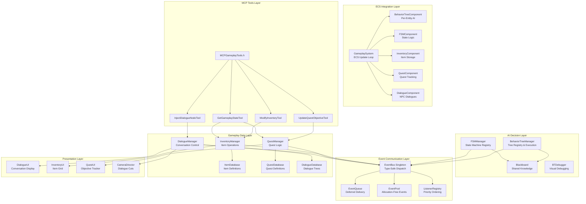
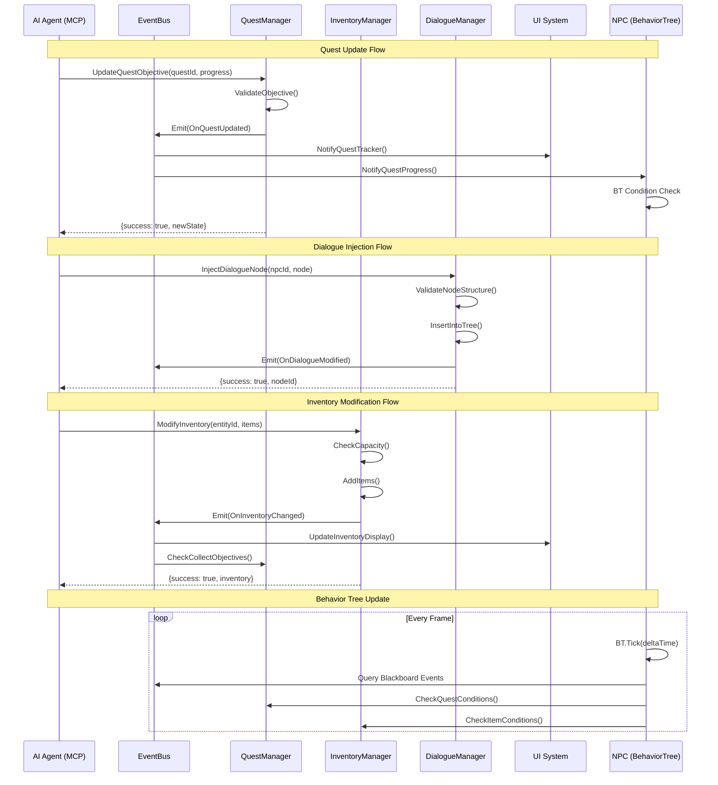
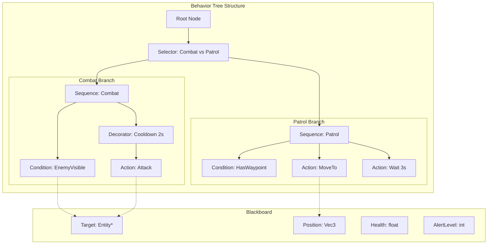
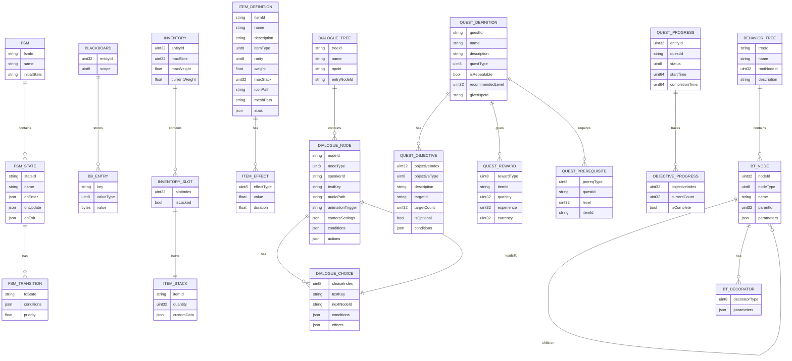
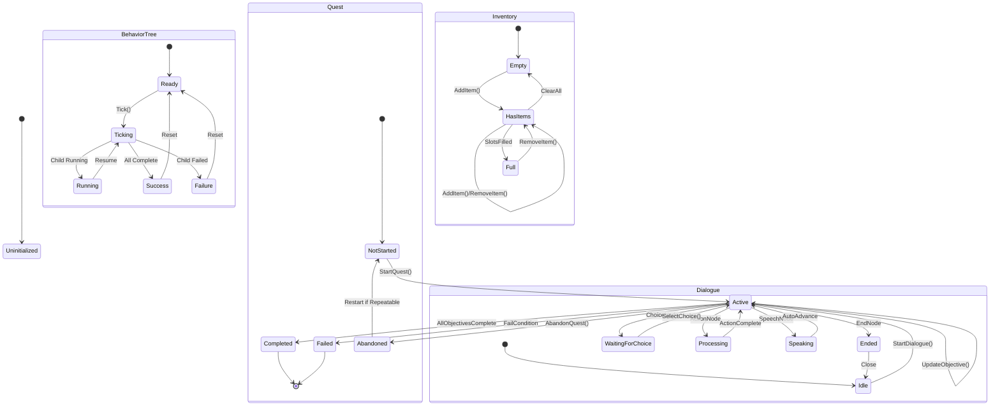

# Phase 18: Advanced Gameplay Systems & Logic

## Implementation Plan

---

## Goal

Implement comprehensive gameplay systems infrastructure for the Artificial Intelligence Game Engine. This phase delivers a data-driven Behavior Tree/FSM framework for complex NPC decision-making, a global Event/Message Bus for decoupled system communication, structured Quest and Inventory systems with serialization, a branching Dialogue system with camera cuts and animations, and MCP tool extensions enabling AI agents to dynamically inject dialogue, update quests, and modify inventory through natural language commands.

---

## Requirements

### Behavior Tree / FSM Framework (Step 18.1)

- Implement data-driven Behavior Tree framework with composite nodes (Sequence, Selector, Parallel)
- Support decorator nodes (Inverter, Repeater, Succeeder, UntilFail, Cooldown)
- Implement leaf nodes (Action, Condition) with lambda support for custom behaviors
- Create Finite State Machine (FSM) as alternative to BT for simpler state-based logic
- Support blackboard data sharing between nodes for contextual decision-making
- Enable runtime tree modification and state inspection for debugging
- Provide visual debug overlay showing active node paths
- Target < 0.1ms per agent BT tick with 100+ agents

### Event/Message Bus Pattern (Step 18.2)

- Implement global EventBus singleton with type-safe event dispatching
- Support synchronous and deferred (queued) event delivery modes
- Implement priority-based listener ordering for deterministic execution
- Create common gameplay events (OnPlayerDamaged, OnItemCollected, OnQuestUpdated, etc.)
- Support event filtering by entity, type, or custom predicates
- Implement event pooling to avoid runtime allocations
- Enable cross-system communication without hard dependencies
- Provide event history and replay for debugging

### Quest and Inventory System (Step 18.3)

- Create `InventoryComponent` with slot-based item storage and weight limits
- Implement `ItemDefinition` data structure with stats, effects, and metadata
- Build `QuestComponent` tracking active, completed, and failed quests
- Define `QuestDefinition` with objectives, rewards, prerequisites, and branching paths
- Implement quest objective types: Kill, Collect, Talk, Reach, Escort, Timer
- Support nested sub-quests and objective dependencies
- Serialize inventory and quest state with Phase 16 SaveManager
- Integrate with EventBus for quest progress notifications

### Dialogue Data Structure (Step 18.4)

- Create `DialogueTree` data structure with branching conversation nodes
- Implement `DialogueNode` types: Speech, Choice, Condition, Action, Random
- Support dialogue variables and condition checking for dynamic responses
- Trigger camera cuts to speaker faces during conversation
- Trigger character animations synced to dialogue timing
- Enable dialogue localization support with string table references
- Create `DialogueComponent` for NPC dialogue triggers
- Implement dialogue history tracking for context-aware responses

### MCP Dialogue/Quest/Inventory Tools (Step 18.5)

- Implement `InjectDialogueNode` tool for AI-generated conversation branches
- Implement `UpdateQuestObjective` tool for dynamic quest modification
- Implement `ModifyInventory` tool for adding/removing items programmatically
- Implement `GetGameplayState` tool for querying player progression
- Add safety validation for item IDs, quest states, and dialogue integrity
- Support procedural quest generation through MCP commands
- Enable AI-driven narrative adaptation based on player choices

---

## Technical Considerations

### System Architecture Overview



### Data Flow Diagram



### Behavior Tree Architecture



### Technology Stack Selection

| Layer              | Technology           | Rationale                                               |
| ------------------ | -------------------- | ------------------------------------------------------- |
| Behavior Trees     | Custom Implementation| Game-specific features, no external dependency          |
| FSM                | Custom Implementation| Lightweight, integrated with ECS                        |
| Event Bus          | Custom Implementation| Type-safe C++17, template-based dispatch                |
| Item/Quest Data    | JSON + nlohmann::json| Already integrated, human-readable, easy to author      |
| Dialogue Data      | JSON + nlohmann::json| Supports complex branching, localization-ready          |
| Serialization      | Phase 16 SaveManager | Existing infrastructure, consistent save format         |
| UI Integration     | Phase 16 UI Framework| Existing widget system                                  |
| Camera Control     | Phase 7 CameraSystem | Existing interpolation infrastructure                   |

### Integration Points

- **ECS Integration**: `BehaviorTreeComponent`, `FSMComponent`, `InventoryComponent`, `QuestComponent`, `DialogueComponent`
- **Phase 7 Camera**: Dialogue camera cuts use `CameraViewInterpolatorSystem`
- **Phase 12 Animation**: Dialogue triggers animation states via `AnimatorComponent`
- **Phase 16 UI**: Quest tracker, inventory grid, dialogue boxes via `UISystem`
- **Phase 16 Save/Load**: Inventory and quest state serialized via `SaveManager`
- **Phase 10 MCP**: New tool category `MCPGameplayTools.h`
- **Phase 11 Audio**: Dialogue audio playback via `AudioSourceComponent`

### Deployment Architecture

```
Core/
├── AI/
│   ├── BehaviorTree/
│   │   ├── BehaviorTree.h               # Tree structure and node types
│   │   ├── BehaviorTreeManager.h/cpp    # Tree registry and execution
│   │   ├── BTNodes.h                    # All node implementations
│   │   ├── BTComposites.h               # Sequence, Selector, Parallel
│   │   ├── BTDecorators.h               # Inverter, Repeater, Cooldown
│   │   ├── BTLeaves.h                   # Action, Condition
│   │   ├── Blackboard.h/cpp             # Shared knowledge store
│   │   └── BTDebugDraw.h/cpp            # Visual debugging
│   └── FSM/
│       ├── FSM.h                        # State machine structure
│       ├── FSMManager.h/cpp             # FSM registry
│       ├── FSMState.h                   # State base class
│       └── FSMTransition.h              # Transition conditions
├── Events/
│   ├── EventBus.h/cpp                   # Global event dispatcher
│   ├── EventTypes.h                     # Common gameplay events
│   ├── EventQueue.h                     # Deferred delivery
│   └── EventPool.h                      # Allocation-free events
├── Gameplay/
│   ├── Inventory/
│   │   ├── InventoryManager.h/cpp       # Inventory operations
│   │   ├── ItemDatabase.h/cpp           # Item definitions
│   │   └── ItemDefinition.h             # Item data structure
│   ├── Quest/
│   │   ├── QuestManager.h/cpp           # Quest logic
│   │   ├── QuestDatabase.h/cpp          # Quest definitions
│   │   ├── QuestDefinition.h            # Quest data structure
│   │   └── QuestObjective.h             # Objective types
│   └── Dialogue/
│       ├── DialogueManager.h/cpp        # Dialogue controller
│       ├── DialogueDatabase.h/cpp       # Dialogue trees
│       ├── DialogueTree.h               # Tree structure
│       ├── DialogueNode.h               # Node types
│       └── DialogueCondition.h          # Condition evaluation
├── ECS/
│   ├── Components/
│   │   ├── BehaviorTreeComponent.h      # Per-entity BT
│   │   ├── FSMComponent.h               # Per-entity FSM
│   │   ├── InventoryComponent.h         # Item storage
│   │   ├── QuestComponent.h             # Quest tracking
│   │   └── DialogueComponent.h          # NPC dialogues
│   └── Systems/
│       ├── BehaviorTreeSystem.h/cpp     # BT update system
│       ├── FSMSystem.h/cpp              # FSM update system
│       └── GameplaySystem.h/cpp         # Combined gameplay logic
└── MCP/
    ├── MCPGameplayTools.h               # All gameplay MCP tools
    └── MCPAllTools.h                    # Updated to include gameplay tools
```

### Scalability Considerations

- **Behavior Tree Pooling**: Pre-allocated node pools for common tree patterns
- **Event Batching**: Group events by type for cache-efficient dispatch
- **Hierarchical Blackboard**: Global → Group → Entity blackboard inheritance
- **LOD AI**: Reduce BT tick rate for distant NPCs
- **Quest Indexing**: Hash-based lookup for active quest objectives
- **Dialogue Caching**: Pre-parse dialogue trees at load time
- **Inventory Slots**: Fixed-size slot arrays avoid dynamic allocation

---

## Database Schema Design

### Gameplay Data Structures



### Event Type Definitions

| Event Type              | Payload                                        | Description                          |
| ----------------------- | ---------------------------------------------- | ------------------------------------ |
| `OnPlayerDamaged`       | `{entityId, damage, sourceId, damageType}`     | Player took damage                   |
| `OnPlayerHealed`        | `{entityId, amount, sourceId}`                 | Player received healing              |
| `OnItemCollected`       | `{entityId, itemId, quantity, slotIndex}`      | Item added to inventory              |
| `OnItemDropped`         | `{entityId, itemId, quantity, position}`       | Item removed from inventory          |
| `OnItemUsed`            | `{entityId, itemId, targetId}`                 | Consumable/equipment used            |
| `OnQuestStarted`        | `{entityId, questId}`                          | New quest accepted                   |
| `OnQuestUpdated`        | `{entityId, questId, objectiveIndex, progress}`| Quest objective progress changed     |
| `OnQuestCompleted`      | `{entityId, questId, rewards[]}`               | Quest finished successfully          |
| `OnQuestFailed`         | `{entityId, questId, reason}`                  | Quest failed                         |
| `OnDialogueStarted`     | `{playerId, npcId, treeId}`                    | Conversation began                   |
| `OnDialogueChoice`      | `{playerId, npcId, nodeId, choiceIndex}`       | Player made dialogue choice          |
| `OnDialogueEnded`       | `{playerId, npcId, treeId, outcome}`           | Conversation concluded               |
| `OnNPCStateChanged`     | `{entityId, oldState, newState}`               | NPC behavior state transition        |
| `OnCombatStarted`       | `{aggressorId, targetId}`                      | Combat engagement began              |
| `OnCombatEnded`         | `{winnerId, loserId, outcome}`                 | Combat concluded                     |
| `OnLevelUp`             | `{entityId, newLevel, statIncreases}`          | Character level increased            |
| `OnAchievementUnlocked` | `{entityId, achievementId}`                    | Achievement earned                   |

---

## API Design

### EventBus Singleton

```cpp
namespace Core::Events {

// Type-erased event base for storage
struct EventBase {
    virtual ~EventBase() = default;
    virtual size_t GetTypeHash() const = 0;
};

// Typed event wrapper
template<typename T>
struct TypedEvent : EventBase {
    T Data;
    
    explicit TypedEvent(const T& data) : Data(data) {}
    explicit TypedEvent(T&& data) : Data(std::move(data)) {}
    
    size_t GetTypeHash() const override {
        return typeid(T).hash_code();
    }
};

// Listener handle for unsubscription
using ListenerHandle = uint64_t;

// Listener priority levels
enum class ListenerPriority : uint8_t {
    Highest = 0,    // System-critical listeners
    High = 64,      // Important gameplay listeners
    Normal = 128,   // Default priority
    Low = 192,      // Non-critical listeners
    Lowest = 255    // Cleanup/logging listeners
};

// Delivery mode for events
enum class DeliveryMode : uint8_t {
    Immediate,      // Synchronous dispatch
    Deferred,       // Queue for end-of-frame dispatch
    NextFrame       // Queue for next frame start
};

struct ListenerInfo {
    ListenerHandle Handle;
    ListenerPriority Priority;
    std::string DebugName;
    bool IsActive = true;
};

class EventBus {
public:
    static EventBus& Get();

    // Lifecycle
    void Initialize();
    void Shutdown();
    void Update();  // Process deferred events

    // Subscribe to events (returns handle for unsubscription)
    template<typename EventType>
    ListenerHandle Subscribe(
        std::function<void(const EventType&)> callback,
        ListenerPriority priority = ListenerPriority::Normal,
        const std::string& debugName = "");

    // Subscribe with entity filter
    template<typename EventType>
    ListenerHandle SubscribeFiltered(
        std::function<void(const EventType&)> callback,
        std::function<bool(const EventType&)> filter,
        ListenerPriority priority = ListenerPriority::Normal);

    // Unsubscribe from events
    void Unsubscribe(ListenerHandle handle);
    
    // Unsubscribe all listeners for a type
    template<typename EventType>
    void UnsubscribeAll();

    // Emit events
    template<typename EventType>
    void Emit(const EventType& event, DeliveryMode mode = DeliveryMode::Immediate);

    template<typename EventType>
    void Emit(EventType&& event, DeliveryMode mode = DeliveryMode::Immediate);

    // Deferred event helpers
    template<typename EventType, typename... Args>
    void EmitDeferred(Args&&... args);

    template<typename EventType, typename... Args>
    void EmitNextFrame(Args&&... args);

    // Query
    template<typename EventType>
    size_t GetListenerCount() const;

    std::vector<ListenerInfo> GetAllListeners() const;
    
    // Debugging
    void SetEventLoggingEnabled(bool enabled);
    void SetDebugMode(bool enabled);
    std::vector<std::string> GetEventHistory(size_t maxCount = 100) const;
    void ClearEventHistory();

    // Statistics
    struct EventStats {
        size_t TotalEventsEmitted = 0;
        size_t TotalListenersCalled = 0;
        size_t DeferredQueueSize = 0;
        size_t NextFrameQueueSize = 0;
        float LastDispatchTimeMs = 0.0f;
    };
    EventStats GetStats() const;

private:
    EventBus() = default;
    
    // Type-erased listener storage
    struct ListenerEntry {
        ListenerHandle Handle;
        size_t TypeHash;
        ListenerPriority Priority;
        std::function<void(const EventBase&)> Callback;
        std::function<bool(const EventBase&)> Filter;
        std::string DebugName;
        bool IsActive = true;
    };

    std::vector<ListenerEntry> m_Listeners;
    std::vector<std::unique_ptr<EventBase>> m_DeferredQueue;
    std::vector<std::unique_ptr<EventBase>> m_NextFrameQueue;
    std::mutex m_Mutex;
    ListenerHandle m_NextHandle = 1;
    bool m_LoggingEnabled = false;
    bool m_DebugMode = false;
    std::vector<std::string> m_EventHistory;
    EventStats m_Stats;
};

// Common gameplay events
struct OnPlayerDamaged {
    uint32_t EntityId;
    float Damage;
    uint32_t SourceId;
    uint8_t DamageType;
};

struct OnItemCollected {
    uint32_t EntityId;
    std::string ItemId;
    uint32_t Quantity;
    uint32_t SlotIndex;
};

struct OnQuestUpdated {
    uint32_t EntityId;
    std::string QuestId;
    uint32_t ObjectiveIndex;
    uint32_t CurrentProgress;
    uint32_t TargetProgress;
    bool IsComplete;
};

struct OnDialogueStarted {
    uint32_t PlayerId;
    uint32_t NpcId;
    std::string TreeId;
    std::string EntryNodeId;
};

struct OnDialogueChoice {
    uint32_t PlayerId;
    uint32_t NpcId;
    std::string NodeId;
    uint8_t ChoiceIndex;
    std::string NextNodeId;
};

struct OnNPCStateChanged {
    uint32_t EntityId;
    std::string OldState;
    std::string NewState;
    std::string Reason;
};

} // namespace Core::Events
```

### Behavior Tree Framework

```cpp
namespace Core::AI {

// Forward declarations
class BehaviorTree;
class BTNode;
class Blackboard;

// Node execution status
enum class BTStatus : uint8_t {
    Success,    // Node completed successfully
    Failure,    // Node failed
    Running     // Node still executing
};

// Node types
enum class BTNodeType : uint8_t {
    // Composites
    Sequence,       // Execute children in order, fail on first failure
    Selector,       // Execute children in order, succeed on first success
    Parallel,       // Execute all children simultaneously
    RandomSelector, // Random child selection
    
    // Decorators
    Inverter,       // Invert child result
    Succeeder,      // Always return success
    Failer,         // Always return failure
    Repeater,       // Repeat child N times or forever
    RepeatUntilFail,// Repeat until child fails
    Cooldown,       // Add cooldown between executions
    TimeLimit,      // Fail if child takes too long
    
    // Leaves
    Action,         // Execute custom action
    Condition,      // Check condition
    Wait,           // Wait for duration
    Log,            // Debug logging
    SubTree         // Reference another behavior tree
};

// Blackboard for shared data
class Blackboard {
public:
    // Value accessors with type safety
    template<typename T>
    void Set(const std::string& key, const T& value);
    
    template<typename T>
    T Get(const std::string& key, const T& defaultValue = T{}) const;
    
    template<typename T>
    bool Has(const std::string& key) const;
    
    void Remove(const std::string& key);
    void Clear();
    
    // Hierarchical blackboard support
    void SetParent(Blackboard* parent);
    Blackboard* GetParent() const;
    
    // Serialization
    Json ToJson() const;
    void FromJson(const Json& json);
    
    // Debug
    std::vector<std::string> GetAllKeys() const;
    std::string GetValueAsString(const std::string& key) const;

private:
    std::unordered_map<std::string, std::any> m_Data;
    Blackboard* m_Parent = nullptr;
};

// Base node class
class BTNode {
public:
    BTNode(BTNodeType type, const std::string& name = "");
    virtual ~BTNode() = default;

    // Core execution
    virtual BTStatus Tick(float deltaTime, Blackboard& blackboard) = 0;
    virtual void Reset();
    
    // Tree structure
    void AddChild(std::unique_ptr<BTNode> child);
    void RemoveChild(size_t index);
    const std::vector<std::unique_ptr<BTNode>>& GetChildren() const;
    BTNode* GetParent() const;
    
    // Accessors
    BTNodeType GetType() const { return m_Type; }
    const std::string& GetName() const { return m_Name; }
    BTStatus GetLastStatus() const { return m_LastStatus; }
    bool IsRunning() const { return m_LastStatus == BTStatus::Running; }
    
    // Debug visualization
    bool IsActive() const { return m_IsActive; }
    float GetLastTickTime() const { return m_LastTickTime; }

protected:
    BTNodeType m_Type;
    std::string m_Name;
    BTNode* m_Parent = nullptr;
    std::vector<std::unique_ptr<BTNode>> m_Children;
    BTStatus m_LastStatus = BTStatus::Success;
    bool m_IsActive = false;
    float m_LastTickTime = 0.0f;
};

// Composite nodes
class SequenceNode : public BTNode {
public:
    SequenceNode(const std::string& name = "Sequence");
    BTStatus Tick(float deltaTime, Blackboard& blackboard) override;
    void Reset() override;
    
private:
    size_t m_CurrentChildIndex = 0;
};

class SelectorNode : public BTNode {
public:
    SelectorNode(const std::string& name = "Selector");
    BTStatus Tick(float deltaTime, Blackboard& blackboard) override;
    void Reset() override;
    
private:
    size_t m_CurrentChildIndex = 0;
};

class ParallelNode : public BTNode {
public:
    enum class Policy {
        RequireOne,     // Succeed if any child succeeds
        RequireAll      // Succeed only if all children succeed
    };

    ParallelNode(Policy successPolicy = Policy::RequireAll,
                 Policy failurePolicy = Policy::RequireOne,
                 const std::string& name = "Parallel");
    BTStatus Tick(float deltaTime, Blackboard& blackboard) override;
    void Reset() override;
    
private:
    Policy m_SuccessPolicy;
    Policy m_FailurePolicy;
};

// Decorator nodes
class InverterNode : public BTNode {
public:
    InverterNode(const std::string& name = "Inverter");
    BTStatus Tick(float deltaTime, Blackboard& blackboard) override;
};

class RepeaterNode : public BTNode {
public:
    RepeaterNode(int32_t repeatCount = -1, const std::string& name = "Repeater");
    BTStatus Tick(float deltaTime, Blackboard& blackboard) override;
    void Reset() override;
    
private:
    int32_t m_RepeatCount;      // -1 = infinite
    int32_t m_CurrentCount = 0;
};

class CooldownNode : public BTNode {
public:
    CooldownNode(float cooldownSeconds, const std::string& name = "Cooldown");
    BTStatus Tick(float deltaTime, Blackboard& blackboard) override;
    void Reset() override;
    
private:
    float m_CooldownSeconds;
    float m_Timer = 0.0f;
    bool m_OnCooldown = false;
};

// Leaf nodes
class ActionNode : public BTNode {
public:
    using ActionFunc = std::function<BTStatus(float, Blackboard&)>;
    
    ActionNode(ActionFunc action, const std::string& name = "Action");
    BTStatus Tick(float deltaTime, Blackboard& blackboard) override;
    
private:
    ActionFunc m_Action;
};

class ConditionNode : public BTNode {
public:
    using ConditionFunc = std::function<bool(const Blackboard&)>;
    
    ConditionNode(ConditionFunc condition, const std::string& name = "Condition");
    BTStatus Tick(float deltaTime, Blackboard& blackboard) override;
    
private:
    ConditionFunc m_Condition;
};

class WaitNode : public BTNode {
public:
    WaitNode(float waitSeconds, const std::string& name = "Wait");
    BTStatus Tick(float deltaTime, Blackboard& blackboard) override;
    void Reset() override;
    
private:
    float m_WaitSeconds;
    float m_Timer = 0.0f;
};

// Behavior Tree container
class BehaviorTree {
public:
    BehaviorTree(const std::string& name = "BehaviorTree");

    // Execution
    BTStatus Tick(float deltaTime);
    void Reset();
    
    // Structure
    void SetRoot(std::unique_ptr<BTNode> root);
    BTNode* GetRoot() const;
    
    // Blackboard
    Blackboard& GetBlackboard();
    const Blackboard& GetBlackboard() const;
    
    // Serialization
    Json ToJson() const;
    static std::unique_ptr<BehaviorTree> FromJson(const Json& json);
    
    // Debug
    const std::string& GetName() const { return m_Name; }
    BTStatus GetLastStatus() const { return m_LastStatus; }
    std::vector<BTNode*> GetActivePath() const;

private:
    std::string m_Name;
    std::unique_ptr<BTNode> m_Root;
    Blackboard m_Blackboard;
    BTStatus m_LastStatus = BTStatus::Success;
};

// Tree builder for fluent construction
class BehaviorTreeBuilder {
public:
    BehaviorTreeBuilder(const std::string& name = "BehaviorTree");

    // Composite builders
    BehaviorTreeBuilder& Sequence(const std::string& name = "Sequence");
    BehaviorTreeBuilder& Selector(const std::string& name = "Selector");
    BehaviorTreeBuilder& Parallel(ParallelNode::Policy successPolicy = ParallelNode::Policy::RequireAll,
                                   const std::string& name = "Parallel");
    
    // Decorator builders
    BehaviorTreeBuilder& Inverter();
    BehaviorTreeBuilder& Repeater(int32_t count = -1);
    BehaviorTreeBuilder& Cooldown(float seconds);
    
    // Leaf builders
    BehaviorTreeBuilder& Action(ActionNode::ActionFunc action, const std::string& name = "Action");
    BehaviorTreeBuilder& Condition(ConditionNode::ConditionFunc condition, const std::string& name = "Condition");
    BehaviorTreeBuilder& Wait(float seconds);
    
    // Structure control
    BehaviorTreeBuilder& End();  // Close current composite/decorator
    
    // Build
    std::unique_ptr<BehaviorTree> Build();

private:
    std::string m_Name;
    std::unique_ptr<BTNode> m_Root;
    std::vector<BTNode*> m_NodeStack;
};

// Manager singleton
class BehaviorTreeManager {
public:
    static BehaviorTreeManager& Get();

    // Lifecycle
    void Initialize();
    void Shutdown();
    void Update(float deltaTime);

    // Tree registration
    void RegisterTree(const std::string& treeId, std::unique_ptr<BehaviorTree> tree);
    BehaviorTree* GetTree(const std::string& treeId);
    void UnregisterTree(const std::string& treeId);
    
    // Tree templates (clone for instances)
    void RegisterTemplate(const std::string& templateId, const Json& treeJson);
    std::unique_ptr<BehaviorTree> CreateFromTemplate(const std::string& templateId);
    
    // Entity association
    void AttachTree(uint32_t entityId, const std::string& treeId);
    void DetachTree(uint32_t entityId);
    BehaviorTree* GetEntityTree(uint32_t entityId);
    
    // Debug
    void SetDebugVisualization(bool enabled);
    void DrawDebugTrees(RHI::RHICommandList* cmdList, const Math::Mat4& viewProj);
    
    // Statistics
    struct BTStats {
        uint32_t TotalTrees;
        uint32_t ActiveTrees;
        float LastUpdateTimeMs;
        uint32_t NodesTickedThisFrame;
    };
    BTStats GetStats() const;

private:
    std::unordered_map<std::string, std::unique_ptr<BehaviorTree>> m_Trees;
    std::unordered_map<std::string, Json> m_Templates;
    std::unordered_map<uint32_t, std::string> m_EntityTrees;
    bool m_DebugVisualization = false;
    BTStats m_Stats{};
};

} // namespace Core::AI
```

### FSM Framework

```cpp
namespace Core::AI {

// Forward declarations
class FSM;
class FSMState;

// State execution callbacks
struct FSMCallbacks {
    std::function<void(Blackboard&)> OnEnter;
    std::function<void(float, Blackboard&)> OnUpdate;
    std::function<void(Blackboard&)> OnExit;
};

// Transition condition
struct FSMTransitionCondition {
    std::string ParameterName;
    ComparisonOp Operator = ComparisonOp::Equal;
    std::variant<float, bool, std::string> Value;
    
    bool Evaluate(const Blackboard& blackboard) const;
};

// State transition
struct FSMTransition {
    std::string TargetStateId;
    std::vector<FSMTransitionCondition> Conditions;
    float Priority = 0.0f;          // Higher priority evaluated first
    bool RequireAllConditions = true; // AND vs OR logic
    
    bool CanTransition(const Blackboard& blackboard) const;
};

// FSM State
class FSMState {
public:
    FSMState(const std::string& stateId, const std::string& name = "");

    // Lifecycle
    void Enter(Blackboard& blackboard);
    void Update(float deltaTime, Blackboard& blackboard);
    void Exit(Blackboard& blackboard);
    
    // Configuration
    void SetCallbacks(const FSMCallbacks& callbacks);
    void AddTransition(const FSMTransition& transition);
    
    // Accessors
    const std::string& GetStateId() const { return m_StateId; }
    const std::string& GetName() const { return m_Name; }
    const std::vector<FSMTransition>& GetTransitions() const { return m_Transitions; }
    float GetTimeInState() const { return m_TimeInState; }
    
    // Transition evaluation
    std::optional<std::string> EvaluateTransitions(const Blackboard& blackboard) const;

private:
    std::string m_StateId;
    std::string m_Name;
    FSMCallbacks m_Callbacks;
    std::vector<FSMTransition> m_Transitions;
    float m_TimeInState = 0.0f;
};

// Finite State Machine
class FSM {
public:
    FSM(const std::string& name = "FSM");

    // Lifecycle
    void Start();
    void Update(float deltaTime);
    void Stop();
    
    // State management
    void AddState(std::unique_ptr<FSMState> state);
    void SetInitialState(const std::string& stateId);
    void ForceTransition(const std::string& stateId);
    
    // Accessors
    FSMState* GetCurrentState() const;
    FSMState* GetState(const std::string& stateId) const;
    const std::string& GetCurrentStateId() const { return m_CurrentStateId; }
    Blackboard& GetBlackboard() { return m_Blackboard; }
    
    // State history
    const std::vector<std::string>& GetStateHistory() const { return m_StateHistory; }
    void ClearStateHistory();
    
    // Serialization
    Json ToJson() const;
    static std::unique_ptr<FSM> FromJson(const Json& json);
    
    // Debug
    bool IsRunning() const { return m_IsRunning; }
    const std::string& GetName() const { return m_Name; }

private:
    std::string m_Name;
    std::unordered_map<std::string, std::unique_ptr<FSMState>> m_States;
    std::string m_InitialStateId;
    std::string m_CurrentStateId;
    Blackboard m_Blackboard;
    std::vector<std::string> m_StateHistory;
    bool m_IsRunning = false;
    
    void TransitionTo(const std::string& stateId);
};

// FSM Builder for fluent construction
class FSMBuilder {
public:
    FSMBuilder(const std::string& name = "FSM");

    FSMBuilder& State(const std::string& stateId, const std::string& name = "");
    FSMBuilder& OnEnter(std::function<void(Blackboard&)> callback);
    FSMBuilder& OnUpdate(std::function<void(float, Blackboard&)> callback);
    FSMBuilder& OnExit(std::function<void(Blackboard&)> callback);
    FSMBuilder& Transition(const std::string& targetState);
    FSMBuilder& When(const std::string& paramName, ComparisonOp op, float value);
    FSMBuilder& When(const std::string& paramName, bool value);
    FSMBuilder& WithPriority(float priority);
    FSMBuilder& RequireAny();  // OR logic for conditions
    FSMBuilder& Initial();     // Mark as initial state
    
    std::unique_ptr<FSM> Build();

private:
    std::string m_Name;
    std::vector<std::unique_ptr<FSMState>> m_States;
    FSMState* m_CurrentState = nullptr;
    FSMTransition* m_CurrentTransition = nullptr;
    std::string m_InitialStateId;
};

// Manager singleton
class FSMManager {
public:
    static FSMManager& Get();

    void Initialize();
    void Shutdown();
    void Update(float deltaTime);

    void RegisterFSM(const std::string& fsmId, std::unique_ptr<FSM> fsm);
    FSM* GetFSM(const std::string& fsmId);
    void UnregisterFSM(const std::string& fsmId);
    
    void RegisterTemplate(const std::string& templateId, const Json& fsmJson);
    std::unique_ptr<FSM> CreateFromTemplate(const std::string& templateId);

private:
    std::unordered_map<std::string, std::unique_ptr<FSM>> m_FSMs;
    std::unordered_map<std::string, Json> m_Templates;
};

} // namespace Core::AI
```

### BehaviorTreeComponent Structure

```cpp
namespace Core::ECS {

struct BehaviorTreeComponent {
    // Tree configuration
    std::string TreeId;                         // Reference to registered tree
    std::string TemplateId;                     // Alternative: create from template
    std::unique_ptr<AI::BehaviorTree> Tree;     // Owned tree instance
    
    // Execution state
    bool IsEnabled = true;
    bool IsPaused = false;
    float TickRate = 0.0f;                      // 0 = every frame, >0 = fixed rate
    float TickAccumulator = 0.0f;
    AI::BTStatus LastStatus = AI::BTStatus::Success;
    
    // Debug
    bool DebugEnabled = false;
    std::vector<std::string> ActiveNodePath;
    
    // Blackboard shortcuts
    AI::Blackboard* GetBlackboard() {
        return Tree ? &Tree->GetBlackboard() : nullptr;
    }
    
    template<typename T>
    void SetBlackboardValue(const std::string& key, const T& value) {
        if (Tree) Tree->GetBlackboard().Set(key, value);
    }
    
    template<typename T>
    T GetBlackboardValue(const std::string& key, const T& defaultValue = T{}) const {
        return Tree ? Tree->GetBlackboard().Get(key, defaultValue) : defaultValue;
    }
    
    // Factory methods
    static BehaviorTreeComponent Create(const std::string& treeId);
    static BehaviorTreeComponent CreateFromTemplate(const std::string& templateId);
    static BehaviorTreeComponent CreateCustom(std::unique_ptr<AI::BehaviorTree> tree);
};

} // namespace Core::ECS
```

### FSMComponent Structure

```cpp
namespace Core::ECS {

struct FSMComponent {
    // FSM configuration
    std::string FSMId;                          // Reference to registered FSM
    std::string TemplateId;                     // Alternative: create from template
    std::unique_ptr<AI::FSM> StateMachine;      // Owned FSM instance
    
    // Execution state
    bool IsEnabled = true;
    bool IsRunning = false;
    
    // State tracking
    std::string CurrentStateId;
    std::string PreviousStateId;
    float TimeInCurrentState = 0.0f;
    
    // Debug
    bool DebugEnabled = false;
    
    // Blackboard shortcuts
    AI::Blackboard* GetBlackboard() {
        return StateMachine ? &StateMachine->GetBlackboard() : nullptr;
    }
    
    // Factory methods
    static FSMComponent Create(const std::string& fsmId);
    static FSMComponent CreateFromTemplate(const std::string& templateId);
    static FSMComponent CreateCustom(std::unique_ptr<AI::FSM> fsm);
};

} // namespace Core::ECS
```

### InventoryComponent Structure

```cpp
namespace Core::ECS {

// Item rarity levels
enum class ItemRarity : uint8_t {
    Common = 0,
    Uncommon,
    Rare,
    Epic,
    Legendary
};

// Item types
enum class ItemType : uint8_t {
    Consumable = 0,     // Potions, food
    Equipment,          // Weapons, armor
    Material,           // Crafting materials
    QuestItem,          // Quest-related items
    Currency,           // Gold, tokens
    Key,                // Keys, access items
    Ammo,               // Ammunition
    Misc                // Everything else
};

// Item effect types
enum class ItemEffectType : uint8_t {
    RestoreHealth = 0,
    RestoreMana,
    BuffStrength,
    BuffAgility,
    BuffIntelligence,
    BuffDefense,
    DamageOverTime,
    HealOverTime,
    IncreaseSpeed,
    Custom
};

struct ItemEffect {
    ItemEffectType Type = ItemEffectType::RestoreHealth;
    float Value = 0.0f;
    float Duration = 0.0f;          // 0 = instant
    std::string CustomEffectId;     // For Type::Custom
};

struct ItemDefinition {
    std::string ItemId;             // Unique identifier
    std::string Name;               // Display name
    std::string Description;        // Item description
    ItemType Type = ItemType::Misc;
    ItemRarity Rarity = ItemRarity::Common;
    
    // Physical properties
    float Weight = 0.0f;            // Weight per unit
    uint32_t MaxStack = 1;          // Max stack size (1 = not stackable)
    float Value = 0.0f;             // Base currency value
    
    // Visual
    std::string IconPath;           // UI icon path
    std::string MeshPath;           // 3D mesh for world representation
    
    // Stats (for equipment)
    std::unordered_map<std::string, float> Stats;
    
    // Effects (for consumables)
    std::vector<ItemEffect> Effects;
    
    // Requirements
    uint32_t RequiredLevel = 0;
    std::unordered_map<std::string, float> RequiredStats;
    
    // Flags
    bool IsDroppable = true;
    bool IsSellable = true;
    bool IsDestroyable = true;
    bool IsUnique = false;          // Only one can exist in inventory
    
    // Custom data
    Json CustomData;
    
    // Factory methods
    static ItemDefinition CreateConsumable(const std::string& id, const std::string& name);
    static ItemDefinition CreateEquipment(const std::string& id, const std::string& name);
    static ItemDefinition CreateQuestItem(const std::string& id, const std::string& name);
};

struct ItemStack {
    std::string ItemId;
    uint32_t Quantity = 0;
    Json CustomData;                // Instance-specific data (durability, enchants)
    
    bool IsEmpty() const { return Quantity == 0 || ItemId.empty(); }
};

struct InventorySlot {
    uint32_t SlotIndex = 0;
    ItemStack Stack;
    bool IsLocked = false;          // Slot cannot be modified
    bool IsHotbarSlot = false;      // Quick access slot
    
    bool IsEmpty() const { return Stack.IsEmpty(); }
};

struct InventoryComponent {
    // Configuration
    uint32_t MaxSlots = 40;
    float MaxWeight = 100.0f;
    bool EnforceWeight = true;
    
    // Storage
    std::vector<InventorySlot> Slots;
    float CurrentWeight = 0.0f;
    
    // Currency (separate from items)
    std::unordered_map<std::string, int64_t> Currencies;
    
    // Equipment slots
    std::unordered_map<std::string, ItemStack> EquippedItems;
    
    // Operations
    bool AddItem(const std::string& itemId, uint32_t quantity = 1);
    bool RemoveItem(const std::string& itemId, uint32_t quantity = 1);
    bool HasItem(const std::string& itemId, uint32_t quantity = 1) const;
    uint32_t GetItemCount(const std::string& itemId) const;
    bool CanAddItem(const std::string& itemId, uint32_t quantity = 1) const;
    
    // Slot operations
    bool MoveItem(uint32_t fromSlot, uint32_t toSlot);
    bool SwapSlots(uint32_t slot1, uint32_t slot2);
    bool SplitStack(uint32_t slot, uint32_t quantity);
    
    // Equipment
    bool EquipItem(uint32_t slot, const std::string& equipSlot);
    bool UnequipItem(const std::string& equipSlot);
    const ItemStack* GetEquippedItem(const std::string& equipSlot) const;
    
    // Currency
    void AddCurrency(const std::string& currencyId, int64_t amount);
    bool RemoveCurrency(const std::string& currencyId, int64_t amount);
    int64_t GetCurrency(const std::string& currencyId) const;
    
    // Utility
    std::vector<const InventorySlot*> FindItems(const std::string& itemId) const;
    std::vector<const InventorySlot*> FindItemsByType(ItemType type) const;
    int32_t GetFirstEmptySlot() const;
    void SortInventory(bool byType = true, bool byRarity = false);
    void ClearInventory();
    
    // Serialization
    Json ToJson() const;
    void FromJson(const Json& json);
    
    // Factory methods
    static InventoryComponent Create(uint32_t maxSlots = 40, float maxWeight = 100.0f);
    static InventoryComponent CreateSmall(uint32_t maxSlots = 16);
    static InventoryComponent CreateUnlimited();
};

// Item database singleton
class ItemDatabase {
public:
    static ItemDatabase& Get();

    void Initialize();
    void Shutdown();
    
    // Item registration
    void RegisterItem(const ItemDefinition& definition);
    void RegisterItemsFromJson(const Json& json);
    void LoadItemsFromFile(const std::string& path);
    
    // Item lookup
    const ItemDefinition* GetItem(const std::string& itemId) const;
    std::vector<const ItemDefinition*> GetItemsByType(ItemType type) const;
    std::vector<const ItemDefinition*> GetItemsByRarity(ItemRarity rarity) const;
    bool ItemExists(const std::string& itemId) const;
    
    // Queries
    std::vector<std::string> GetAllItemIds() const;
    size_t GetItemCount() const;

private:
    std::unordered_map<std::string, ItemDefinition> m_Items;
};

// Inventory manager singleton
class InventoryManager {
public:
    static InventoryManager& Get();

    void Initialize(Events::EventBus* eventBus);
    void Shutdown();
    
    // Item operations (convenience wrappers with events)
    bool GiveItem(uint32_t entityId, const std::string& itemId, uint32_t quantity = 1);
    bool TakeItem(uint32_t entityId, const std::string& itemId, uint32_t quantity = 1);
    bool TransferItem(uint32_t fromEntity, uint32_t toEntity, 
                      const std::string& itemId, uint32_t quantity = 1);
    
    // Loot generation
    std::vector<ItemStack> GenerateLoot(const std::string& lootTableId);
    void GiveLoot(uint32_t entityId, const std::string& lootTableId);
    
private:
    Events::EventBus* m_EventBus = nullptr;
};

} // namespace Core::ECS
```

### QuestComponent Structure

```cpp
namespace Core::ECS {

// Quest status
enum class QuestStatus : uint8_t {
    NotStarted = 0,
    Active,
    Completed,
    Failed,
    Abandoned
};

// Objective types
enum class QuestObjectiveType : uint8_t {
    Kill = 0,       // Kill N enemies
    Collect,        // Collect N items
    Talk,           // Talk to NPC
    Reach,          // Reach location
    Escort,         // Escort NPC to location
    Defend,         // Defend location for time
    Interact,       // Interact with object
    Timer,          // Complete within time limit
    Custom          // Custom objective logic
};

struct QuestObjective {
    uint32_t ObjectiveIndex = 0;
    QuestObjectiveType Type = QuestObjectiveType::Custom;
    std::string Description;
    std::string TargetId;           // NPC/Item/Location ID
    uint32_t TargetCount = 1;
    uint32_t CurrentCount = 0;
    bool IsOptional = false;
    bool IsHidden = false;          // Don't show in UI until revealed
    bool IsComplete = false;
    
    // For timed objectives
    float TimeLimit = 0.0f;         // 0 = no limit
    float ElapsedTime = 0.0f;
    
    // Conditions for objective to become active
    std::vector<uint32_t> PrerequisiteObjectives;
    
    // Custom data
    Json CustomData;
    
    bool IsTimedOut() const { return TimeLimit > 0.0f && ElapsedTime >= TimeLimit; }
    float GetProgress() const { return TargetCount > 0 ? (float)CurrentCount / TargetCount : 0.0f; }
};

struct QuestReward {
    std::string ItemId;
    uint32_t Quantity = 0;
    uint32_t Experience = 0;
    int64_t Currency = 0;
    std::string CurrencyType = "gold";
    std::string UnlockId;           // Unlock ability/recipe/etc.
    
    static QuestReward Item(const std::string& itemId, uint32_t quantity = 1);
    static QuestReward Experience(uint32_t xp);
    static QuestReward Currency(int64_t amount, const std::string& type = "gold");
};

struct QuestPrerequisite {
    enum class Type : uint8_t {
        QuestComplete,      // Another quest must be complete
        QuestNotStarted,    // Another quest must not be started
        Level,              // Minimum level required
        Item,               // Must have item
        Reputation,         // Minimum reputation with faction
        Custom              // Custom check
    };

    Type PrereqType = Type::QuestComplete;
    std::string TargetId;
    int32_t Value = 0;
    
    bool IsSatisfied(const QuestComponent& questComp) const;
};

struct QuestDefinition {
    std::string QuestId;
    std::string Name;
    std::string Description;
    std::string Summary;            // Short description for UI
    
    // Classification
    uint8_t QuestType = 0;          // Main, Side, Daily, etc. (game-defined)
    uint32_t RecommendedLevel = 1;
    bool IsRepeatable = false;
    uint32_t RepeatCooldown = 0;    // Seconds before can repeat
    
    // NPCs
    std::string GiverNpcId;
    std::string TurnInNpcId;        // If different from giver
    
    // Objectives
    std::vector<QuestObjective> Objectives;
    
    // Rewards
    std::vector<QuestReward> Rewards;
    std::vector<QuestReward> OptionalRewards;   // Bonus for optional objectives
    
    // Prerequisites
    std::vector<QuestPrerequisite> Prerequisites;
    
    // Branching
    std::string NextQuestId;                    // Auto-start on completion
    std::vector<std::string> UnlocksQuests;     // Quests that become available
    
    // Dialogue integration
    std::string AcceptDialogueId;
    std::string ProgressDialogueId;
    std::string CompleteDialogueId;
    
    // Time limits
    float TimeLimit = 0.0f;         // 0 = no limit
    bool FailOnTimeout = true;
    
    // Custom data
    Json CustomData;
    
    // Factory methods
    static QuestDefinition CreateSimple(const std::string& id, const std::string& name);
    static QuestDefinition CreateKillQuest(const std::string& id, const std::string& enemyId, 
                                            uint32_t count);
    static QuestDefinition CreateCollectQuest(const std::string& id, const std::string& itemId,
                                               uint32_t count);
};

struct QuestProgress {
    std::string QuestId;
    QuestStatus Status = QuestStatus::NotStarted;
    std::vector<QuestObjective> Objectives;     // Copy with progress
    uint64_t StartTime = 0;
    uint64_t CompletionTime = 0;
    float TotalTime = 0.0f;
    uint32_t RepeatCount = 0;
    
    bool IsActive() const { return Status == QuestStatus::Active; }
    bool IsFinished() const { return Status == QuestStatus::Completed || 
                                     Status == QuestStatus::Failed ||
                                     Status == QuestStatus::Abandoned; }
    float GetOverallProgress() const;
};

struct QuestComponent {
    // Active quest tracking
    std::unordered_map<std::string, QuestProgress> ActiveQuests;
    std::vector<std::string> CompletedQuestIds;
    std::vector<std::string> FailedQuestIds;
    
    // Limits
    uint32_t MaxActiveQuests = 25;
    
    // Statistics
    uint32_t TotalQuestsCompleted = 0;
    uint32_t TotalQuestsFailed = 0;
    
    // Operations
    bool StartQuest(const std::string& questId);
    bool AbandonQuest(const std::string& questId);
    bool CompleteQuest(const std::string& questId);
    bool FailQuest(const std::string& questId);
    
    // Objective updates
    bool UpdateObjective(const std::string& questId, uint32_t objectiveIndex, 
                         uint32_t progress);
    bool IncrementObjective(const std::string& questId, uint32_t objectiveIndex,
                            uint32_t amount = 1);
    bool CompleteObjective(const std::string& questId, uint32_t objectiveIndex);
    
    // Queries
    bool HasQuest(const std::string& questId) const;
    bool IsQuestActive(const std::string& questId) const;
    bool IsQuestComplete(const std::string& questId) const;
    const QuestProgress* GetQuestProgress(const std::string& questId) const;
    std::vector<const QuestProgress*> GetActiveQuests() const;
    
    // Event objective helpers
    void OnEnemyKilled(const std::string& enemyId);
    void OnItemCollected(const std::string& itemId, uint32_t quantity = 1);
    void OnLocationReached(const std::string& locationId);
    void OnNpcTalkedTo(const std::string& npcId);
    
    // Serialization
    Json ToJson() const;
    void FromJson(const Json& json);
    
    // Factory methods
    static QuestComponent Create(uint32_t maxActiveQuests = 25);
};

// Quest database singleton
class QuestDatabase {
public:
    static QuestDatabase& Get();

    void Initialize();
    void Shutdown();
    
    void RegisterQuest(const QuestDefinition& definition);
    void RegisterQuestsFromJson(const Json& json);
    void LoadQuestsFromFile(const std::string& path);
    
    const QuestDefinition* GetQuest(const std::string& questId) const;
    std::vector<const QuestDefinition*> GetQuestsByGiver(const std::string& npcId) const;
    std::vector<const QuestDefinition*> GetAvailableQuests(const QuestComponent& questComp,
                                                            uint32_t playerLevel = 1) const;
    bool QuestExists(const std::string& questId) const;

private:
    std::unordered_map<std::string, QuestDefinition> m_Quests;
};

// Quest manager singleton
class QuestManager {
public:
    static QuestManager& Get();

    void Initialize(Events::EventBus* eventBus);
    void Shutdown();
    void Update(float deltaTime, ECS::Scene& scene);
    
    // Quest operations with event emission
    bool StartQuest(uint32_t entityId, const std::string& questId);
    bool CompleteQuest(uint32_t entityId, const std::string& questId);
    bool FailQuest(uint32_t entityId, const std::string& questId);
    bool UpdateQuestObjective(uint32_t entityId, const std::string& questId,
                              uint32_t objectiveIndex, uint32_t progress);
    
    // Event handlers (auto-registered)
    void OnEnemyKilled(const Events::OnEnemyKilled& event);
    void OnItemCollected(const Events::OnItemCollected& event);

private:
    Events::EventBus* m_EventBus = nullptr;
    std::vector<Events::ListenerHandle> m_ListenerHandles;
};

} // namespace Core::ECS
```

### DialogueComponent Structure

```cpp
namespace Core::ECS {

// Dialogue node types
enum class DialogueNodeType : uint8_t {
    Speech = 0,     // NPC says something
    Choice,         // Player chooses response
    Condition,      // Branch based on condition
    Action,         // Trigger game action
    Random,         // Random branch selection
    Jump,           // Jump to another node
    End             // End conversation
};

// Dialogue condition types
enum class DialogueConditionType : uint8_t {
    QuestStatus = 0,    // Quest is in certain state
    HasItem,            // Player has item
    PlayerLevel,        // Player level check
    Variable,           // Custom variable check
    Reputation,         // Faction reputation
    PreviousChoice,     // Based on prior dialogue choice
    Random,             // Random chance
    Custom              // Custom condition
};

struct DialogueCondition {
    DialogueConditionType Type = DialogueConditionType::Variable;
    std::string TargetId;           // Quest/Item/Variable ID
    ComparisonOp Operator = ComparisonOp::Equal;
    std::variant<int32_t, float, bool, std::string> Value;
    bool Negate = false;
    
    bool Evaluate(const DialogueContext& context) const;
};

struct DialogueAction {
    enum class Type : uint8_t {
        StartQuest,
        CompleteQuest,
        GiveItem,
        TakeItem,
        SetVariable,
        PlayAnimation,
        PlaySound,
        TriggerEvent,
        Custom
    };

    Type ActionType = Type::Custom;
    std::string TargetId;
    std::variant<int32_t, float, bool, std::string> Value;
    
    void Execute(DialogueContext& context) const;
};

struct DialogueChoice {
    uint8_t ChoiceIndex = 0;
    std::string TextKey;            // Localization key
    std::string Text;               // Fallback text
    std::string NextNodeId;
    std::vector<DialogueCondition> Conditions;  // Only show if all true
    std::vector<DialogueAction> Effects;        // Execute on selection
    bool IsDefault = false;         // Auto-select if only option
};

struct DialogueCameraSettings {
    bool UseCamera = true;
    std::string CameraMode = "speaker";     // "speaker", "listener", "custom"
    Math::Vec3 Offset{0, 0, 0};
    float FieldOfView = 45.0f;
    float TransitionTime = 0.5f;
    std::string CustomCameraId;
};

struct DialogueNode {
    std::string NodeId;
    DialogueNodeType Type = DialogueNodeType::Speech;
    
    // Content (for Speech)
    std::string SpeakerId;          // Who is speaking
    std::string TextKey;            // Localization key
    std::string Text;               // Fallback text
    std::string AudioPath;          // Voice-over audio
    std::string AnimationTrigger;   // Animation to play
    float Duration = 0.0f;          // Auto-advance time (0 = wait for input)
    
    // Choices (for Choice type)
    std::vector<DialogueChoice> Choices;
    
    // Conditions (for Condition type)
    std::vector<DialogueCondition> Conditions;
    std::string TrueNodeId;
    std::string FalseNodeId;
    
    // Random (for Random type)
    std::vector<std::pair<std::string, float>> RandomNodes;  // nodeId, weight
    
    // Camera
    DialogueCameraSettings Camera;
    
    // Actions
    std::vector<DialogueAction> OnEnterActions;
    std::vector<DialogueAction> OnExitActions;
    
    // Navigation
    std::string NextNodeId;         // Default next node
    
    // Factory methods
    static DialogueNode CreateSpeech(const std::string& nodeId, const std::string& speakerId,
                                      const std::string& text);
    static DialogueNode CreateChoice(const std::string& nodeId, 
                                      const std::vector<DialogueChoice>& choices);
    static DialogueNode CreateCondition(const std::string& nodeId, 
                                         const DialogueCondition& condition,
                                         const std::string& trueNode,
                                         const std::string& falseNode);
    static DialogueNode CreateEnd(const std::string& nodeId);
};

struct DialogueTree {
    std::string TreeId;
    std::string Name;
    std::string NpcId;              // Associated NPC
    std::string EntryNodeId;
    std::unordered_map<std::string, DialogueNode> Nodes;
    
    // Variables local to this tree
    std::unordered_map<std::string, std::variant<int32_t, float, bool, std::string>> Variables;
    
    // Metadata
    std::string Description;
    std::vector<std::string> Tags;
    
    // Node access
    const DialogueNode* GetNode(const std::string& nodeId) const;
    DialogueNode* GetMutableNode(const std::string& nodeId);
    void AddNode(DialogueNode node);
    void RemoveNode(const std::string& nodeId);
    
    // Validation
    bool Validate(std::vector<std::string>& errors) const;
    
    // Serialization
    Json ToJson() const;
    static DialogueTree FromJson(const Json& json);
};

// Runtime dialogue context
struct DialogueContext {
    uint32_t PlayerId = 0;
    uint32_t NpcId = 0;
    DialogueTree* Tree = nullptr;
    const DialogueNode* CurrentNode = nullptr;
    std::vector<std::string> NodeHistory;
    std::unordered_map<std::string, std::variant<int32_t, float, bool, std::string>> Variables;
    
    // References to game state for condition evaluation
    QuestComponent* PlayerQuests = nullptr;
    InventoryComponent* PlayerInventory = nullptr;
};

struct DialogueComponent {
    // Dialogue trees this NPC can initiate
    std::vector<std::string> DialogueTreeIds;
    std::string DefaultTreeId;
    
    // Conversation state
    bool IsInConversation = false;
    uint32_t ConversationPartner = 0;
    std::string CurrentTreeId;
    std::string CurrentNodeId;
    
    // Conversation history
    std::vector<std::pair<std::string, std::string>> ConversationLog;  // nodeId, text
    
    // Conditions for initiating dialogue
    float InteractionRange = 3.0f;
    bool RequiresLineOfSight = true;
    std::vector<DialogueCondition> CanTalkConditions;
    
    // Callbacks
    std::function<void(const DialogueNode&)> OnNodeEnter;
    std::function<void(uint8_t)> OnChoiceSelected;
    std::function<void(bool)> OnConversationEnd;  // bool = completed normally
    
    // Operations
    bool StartConversation(uint32_t playerId);
    bool AdvanceDialogue();
    bool SelectChoice(uint8_t choiceIndex);
    void EndConversation();
    
    // Queries
    const DialogueNode* GetCurrentNode() const;
    std::vector<DialogueChoice> GetAvailableChoices() const;
    bool CanTalk(const DialogueContext& context) const;
    
    // Factory methods
    static DialogueComponent Create(const std::string& defaultTreeId);
    static DialogueComponent CreateMulti(const std::vector<std::string>& treeIds);
};

// Dialogue database singleton
class DialogueDatabase {
public:
    static DialogueDatabase& Get();

    void Initialize();
    void Shutdown();
    
    void RegisterTree(DialogueTree tree);
    void RegisterTreesFromJson(const Json& json);
    void LoadTreesFromFile(const std::string& path);
    
    const DialogueTree* GetTree(const std::string& treeId) const;
    DialogueTree* GetMutableTree(const std::string& treeId);
    std::vector<const DialogueTree*> GetTreesForNpc(const std::string& npcId) const;
    bool TreeExists(const std::string& treeId) const;
    
    // Dynamic modification (for MCP)
    bool InjectNode(const std::string& treeId, DialogueNode node, 
                    const std::string& afterNodeId = "");
    bool RemoveNode(const std::string& treeId, const std::string& nodeId);
    bool UpdateNode(const std::string& treeId, const DialogueNode& node);

private:
    std::unordered_map<std::string, DialogueTree> m_Trees;
    mutable std::shared_mutex m_Mutex;
};

// Dialogue manager singleton
class DialogueManager {
public:
    static DialogueManager& Get();

    void Initialize(Events::EventBus* eventBus, ECS::Scene* scene);
    void Shutdown();
    void Update(float deltaTime);
    
    // Conversation control
    bool StartDialogue(uint32_t playerId, uint32_t npcId, 
                       const std::string& treeId = "");
    bool AdvanceDialogue(uint32_t playerId);
    bool SelectChoice(uint32_t playerId, uint8_t choiceIndex);
    void EndDialogue(uint32_t playerId);
    
    // Queries
    bool IsInDialogue(uint32_t playerId) const;
    const DialogueContext* GetContext(uint32_t playerId) const;
    
    // Camera integration
    void SetCameraController(class CameraDirector* cameraDirector);
    
    // Audio integration
    void SetAudioController(class AudioManager* audioManager);

private:
    Events::EventBus* m_EventBus = nullptr;
    ECS::Scene* m_Scene = nullptr;
    std::unordered_map<uint32_t, DialogueContext> m_ActiveDialogues;
    class CameraDirector* m_CameraDirector = nullptr;
    class AudioManager* m_AudioManager = nullptr;
};

} // namespace Core::ECS
```

### MCP Gameplay Tools

```cpp
namespace Core::MCP {

// ============================================================================
// InjectDialogueNode Tool
// ============================================================================
// Dynamically insert a new dialogue node into an existing tree
//
// Input Schema:
// {
//   "treeId": string,                  // Required: Target dialogue tree
//   "node": {                          // Required: Node to insert
//     "nodeId": string,                // Required: Unique node ID
//     "type": string,                  // Required: "speech" | "choice" | "condition" | "end"
//     "speakerId": string,             // For speech: speaker entity name/ID
//     "text": string,                  // Dialogue text content
//     "choices": [                     // For choice type
//       {
//         "text": string,
//         "nextNodeId": string,
//         "conditions": [...]
//       }
//     ],
//     "nextNodeId": string,            // Default next node
//     "animation": string,             // Animation to trigger
//     "camera": {                      // Camera settings
//       "mode": string,                // "speaker" | "listener" | "custom"
//       "transitionTime": number
//     }
//   },
//   "afterNodeId": string,             // Optional: Insert after this node
//   "connectTo": string,               // Optional: Make this node's next point to target
//   "updateReferences": boolean        // Optional: Update existing references (default: true)
// }
//
// Returns:
// {
//   "success": boolean,
//   "nodeId": string,
//   "treeId": string,
//   "message": string,
//   "validation": {
//     "warnings": [string],
//     "errors": [string]
//   }
// }

class InjectDialogueNodeTool : public MCPTool {
public:
    InjectDialogueNodeTool();

    ToolInputSchema GetInputSchema() const override;
    ToolResult Execute(const Json& arguments, ECS::Scene* scene) override;
    bool RequiresScene() const override { return false; }  // Uses DialogueDatabase
    
private:
    bool ValidateNode(const Json& nodeJson, std::vector<std::string>& errors);
    ECS::DialogueNode ParseNode(const Json& nodeJson);
};

// ============================================================================
// UpdateQuestObjective Tool
// ============================================================================
// Modify quest objective progress or state
//
// Input Schema:
// {
//   "entityId": number,                // Required: Entity with QuestComponent
//   "entityName": string,              // Alternative: Entity name
//   "questId": string,                 // Required: Quest to update
//   "objectiveIndex": number,          // Required: Objective index (0-based)
//   "operation": string,               // Required: "set" | "increment" | "complete" | "fail"
//   "value": number,                   // For set/increment: new value or delta
//   "message": string,                 // Optional: Progress message for UI
//   "hidden": boolean                  // Optional: Hide this update from player
// }
//
// Returns:
// {
//   "success": boolean,
//   "questId": string,
//   "objectiveIndex": number,
//   "previousProgress": number,
//   "newProgress": number,
//   "targetProgress": number,
//   "isComplete": boolean,
//   "questStatus": string,
//   "message": string
// }

class UpdateQuestObjectiveTool : public MCPTool {
public:
    UpdateQuestObjectiveTool();

    ToolInputSchema GetInputSchema() const override;
    ToolResult Execute(const Json& arguments, ECS::Scene* scene) override;
    bool RequiresScene() const override { return true; }
};

// ============================================================================
// ModifyInventory Tool
// ============================================================================
// Add, remove, or modify items in an entity's inventory
//
// Input Schema:
// {
//   "entityId": number,                // Required: Entity with InventoryComponent
//   "entityName": string,              // Alternative: Entity name
//   "operation": string,               // Required: "add" | "remove" | "set" | "clear"
//   "items": [                         // Required for add/remove/set
//     {
//       "itemId": string,              // Item definition ID
//       "quantity": number,            // Amount (default: 1)
//       "slot": number                 // Optional: Specific slot
//     }
//   ],
//   "currency": {                      // Optional: Currency modification
//     "type": string,                  // Currency type (e.g., "gold")
//     "amount": number,                // Amount to add/remove (can be negative)
//     "operation": string              // "add" | "set"
//   },
//   "validateCapacity": boolean,       // Optional: Check weight/slots (default: true)
//   "silent": boolean                  // Optional: Don't emit events (default: false)
// }
//
// Returns:
// {
//   "success": boolean,
//   "entityId": number,
//   "modifiedItems": [
//     {
//       "itemId": string,
//       "previousQuantity": number,
//       "newQuantity": number,
//       "slot": number
//     }
//   ],
//   "currencyChange": {
//     "type": string,
//     "previousAmount": number,
//     "newAmount": number
//   },
//   "inventorySummary": {
//     "usedSlots": number,
//     "maxSlots": number,
//     "currentWeight": number,
//     "maxWeight": number
//   },
//   "message": string
// }

class ModifyInventoryTool : public MCPTool {
public:
    ModifyInventoryTool();

    ToolInputSchema GetInputSchema() const override;
    ToolResult Execute(const Json& arguments, ECS::Scene* scene) override;
    bool RequiresScene() const override { return true; }
    
private:
    bool ValidateItemId(const std::string& itemId, std::string& error);
};

// ============================================================================
// GetGameplayState Tool
// ============================================================================
// Query comprehensive gameplay state for an entity
//
// Input Schema:
// {
//   "entityId": number,                // Required: Target entity
//   "entityName": string,              // Alternative: Entity name
//   "include": [string],               // Optional: "inventory" | "quests" | "dialogue" | "ai" | "all"
//   "questFilter": {                   // Optional: Quest filtering
//     "status": string,                // "active" | "completed" | "failed" | "all"
//     "questId": string                // Specific quest
//   },
//   "inventoryFilter": {               // Optional: Inventory filtering
//     "itemType": string,
//     "minQuantity": number
//   }
// }
//
// Returns:
// {
//   "success": boolean,
//   "entityId": number,
//   "entityName": string,
//   "inventory": {
//     "slots": [...],
//     "currencies": {...},
//     "equippedItems": {...},
//     "weight": { "current": number, "max": number }
//   },
//   "quests": {
//     "active": [...],
//     "completed": [...],
//     "failed": [...],
//     "statistics": {...}
//   },
//   "dialogue": {
//     "isInConversation": boolean,
//     "currentTree": string,
//     "currentNode": string,
//     "conversationPartner": number
//   },
//   "ai": {
//     "behaviorTree": {
//       "treeId": string,
//       "status": string,
//       "activePath": [string]
//     },
//     "fsm": {
//       "currentState": string,
//       "previousState": string,
//       "timeInState": number
//     },
//     "blackboard": {...}
//   }
// }

class GetGameplayStateTool : public MCPTool {
public:
    GetGameplayStateTool();

    ToolInputSchema GetInputSchema() const override;
    ToolResult Execute(const Json& arguments, ECS::Scene* scene) override;
    bool RequiresScene() const override { return true; }
};

// ============================================================================
// StartQuest Tool (Bonus)
// ============================================================================
// Start a quest for an entity
//
// Input Schema:
// {
//   "entityId": number,
//   "questId": string,
//   "skipPrerequisites": boolean,      // Optional: Ignore prerequisites (default: false)
//   "showUI": boolean                  // Optional: Show quest started UI (default: true)
// }

class StartQuestTool : public MCPTool {
public:
    StartQuestTool();

    ToolInputSchema GetInputSchema() const override;
    ToolResult Execute(const Json& arguments, ECS::Scene* scene) override;
    bool RequiresScene() const override { return true; }
};

// ============================================================================
// TriggerDialogue Tool (Bonus)
// ============================================================================
// Force start a dialogue between player and NPC
//
// Input Schema:
// {
//   "playerId": number,
//   "npcId": number,
//   "treeId": string,                  // Optional: Specific tree (default: NPC's default)
//   "startNodeId": string              // Optional: Start at specific node
// }

class TriggerDialogueTool : public MCPTool {
public:
    TriggerDialogueTool();

    ToolInputSchema GetInputSchema() const override;
    ToolResult Execute(const Json& arguments, ECS::Scene* scene) override;
    bool RequiresScene() const override { return true; }
};

// Factory function to create all gameplay tools
inline std::vector<MCPToolPtr> CreateGameplayTools() {
    return {
        std::make_shared<InjectDialogueNodeTool>(),
        std::make_shared<UpdateQuestObjectiveTool>(),
        std::make_shared<ModifyInventoryTool>(),
        std::make_shared<GetGameplayStateTool>(),
        std::make_shared<StartQuestTool>(),
        std::make_shared<TriggerDialogueTool>()
    };
}

} // namespace Core::MCP
```

### Error Handling

| Error Code                   | HTTP Status | Description                           |
| ---------------------------- | ----------- | ------------------------------------- |
| `GAMEPLAY_NOT_INITIALIZED`   | 500         | Gameplay system not initialized       |
| `QUEST_NOT_FOUND`            | 404         | Quest ID does not exist               |
| `QUEST_ALREADY_ACTIVE`       | 409         | Quest already in progress             |
| `QUEST_PREREQUISITES_NOT_MET`| 400         | Quest prerequisites not satisfied     |
| `OBJECTIVE_NOT_FOUND`        | 404         | Objective index out of bounds         |
| `ITEM_NOT_FOUND`             | 404         | Item ID does not exist                |
| `INVENTORY_FULL`             | 400         | No room in inventory                  |
| `INVENTORY_WEIGHT_EXCEEDED`  | 400         | Would exceed weight limit             |
| `DIALOGUE_TREE_NOT_FOUND`    | 404         | Dialogue tree ID does not exist       |
| `DIALOGUE_NODE_EXISTS`       | 409         | Node ID already exists in tree        |
| `DIALOGUE_INVALID_NODE`      | 400         | Node structure is invalid             |
| `DIALOGUE_CYCLE_DETECTED`    | 400         | Node creates infinite loop            |
| `ENTITY_NOT_FOUND`           | 404         | Entity ID does not exist              |
| `COMPONENT_NOT_FOUND`        | 404         | Entity missing required component     |
| `BT_TREE_NOT_FOUND`          | 404         | Behavior tree ID does not exist       |
| `FSM_STATE_NOT_FOUND`        | 404         | FSM state ID does not exist           |
| `EVENT_DISPATCH_FAILED`      | 500         | Event dispatch error                  |

---

## Frontend Architecture

### Debug Visualization Hierarchy

```
Gameplay Debug System
├── BehaviorTreeDebugDraw
│   ├── Tree Structure Overlay
│   ├── Active Node Highlight (green pulse)
│   ├── Running Node Path (blue line)
│   ├── Failed Node Markers (red X)
│   └── Blackboard Value Display
├── FSMDebugDraw
│   ├── State Name Display
│   ├── Transition Arrows
│   ├── Current State Highlight
│   └── Available Transitions
├── EventBusDebugDraw
│   ├── Event Timeline
│   ├── Listener Count per Event
│   ├── Recent Events List
│   └── Event Frequency Heatmap
├── QuestDebugDraw
│   ├── Active Quest List
│   ├── Objective Progress Bars
│   ├── Quest State Icons
│   └── Reward Previews
├── InventoryDebugDraw
│   ├── Slot Grid Overlay
│   ├── Weight Bar
│   ├── Item Highlights
│   └── Currency Display
└── DialogueDebugDraw
    ├── Tree Graph View
    ├── Current Node Highlight
    ├── Choice Indicators
    └── Condition State
```

### State Flow Diagrams



---

## Security & Performance

### Input Validation

- All MCP tool inputs validated against JSON schemas
- Item IDs validated against ItemDatabase
- Quest IDs validated against QuestDatabase
- Dialogue tree/node IDs validated against DialogueDatabase
- Entity IDs validated against Scene registry
- Quantity values clamped to reasonable ranges (1-9999)
- Currency amounts validated (no overflow)
- Behavior tree depth limited (max 50 levels)

### Performance Optimization

| Technique              | Target                | Implementation                            |
| ---------------------- | --------------------- | ----------------------------------------- |
| BT Node Pooling        | Reduce allocations    | Pre-allocated node pools per type         |
| Event Batching         | Cache efficiency      | Group events by type for dispatch         |
| Hierarchical Blackboard| Memory efficiency     | Share common data between entities        |
| Item Definition Caching| Fast lookup           | Hash-based O(1) item lookup               |
| Quest Indexing         | Fast objective checks | Index active objectives by event type     |
| Dialogue Pre-parsing   | Fast node lookup      | Parse trees at load, cache node pointers  |
| LOD AI Updates         | CPU efficiency        | Reduce tick rate for distant NPCs         |
| Event Pool             | Zero allocation       | Pre-allocated event objects               |

### Performance Budget

| System                      | CPU Budget  | Memory     | Notes                        |
| --------------------------- | ----------- | ---------- | ---------------------------- |
| BT Tick (single agent)      | 0.05ms      | 4 KB       | Per-agent per-frame          |
| BT Tick (100 agents)        | 3.0ms       | 400 KB     | With parallel execution      |
| Event Dispatch (100 events) | 0.5ms       | 8 KB       | Immediate mode               |
| Quest Update                | 0.1ms       | 2 KB       | Per objective update         |
| Inventory Operation         | 0.05ms      | 1 KB       | Add/remove item              |
| Dialogue Node Advance       | 0.2ms       | 4 KB       | Including camera/animation   |
| Blackboard Access           | 0.001ms     | -          | O(1) hash lookup             |
| **Total per Frame**         | **< 5ms**   | **~2 MB**  | At 100 AI agents             |

---

## Detailed Step Breakdown

### Step 18.1: Behavior Tree / FSM Framework (v0.18.1.x)

#### Sub-step 18.1.1: Core Directory Structure (v0.18.1.1)

- Create `Core/AI/BehaviorTree/` directory
- Create `Core/AI/FSM/` directory
- Set up CMakeLists.txt includes
- **Deliverable**: Directory structure ready

#### Sub-step 18.1.2: BTStatus and Node Types (v0.18.1.2)

- Create `Core/AI/BehaviorTree/BehaviorTree.h`
- Define `BTStatus` enum (Success, Failure, Running)
- Define `BTNodeType` enum for all node types
- Define base `BTNode` class with virtual methods
- **Deliverable**: Core BT types defined

#### Sub-step 18.1.3: Blackboard Implementation (v0.18.1.3)

- Create `Core/AI/BehaviorTree/Blackboard.h/cpp`
- Implement type-safe value storage with `std::any`
- Implement hierarchical blackboard support (parent chain)
- Add serialization to/from JSON
- Implement key listing and debug string conversion
- **Deliverable**: Blackboard shared data store

#### Sub-step 18.1.4: Composite Nodes (v0.18.1.4)

- Create `Core/AI/BehaviorTree/BTComposites.h/cpp`
- Implement `SequenceNode` - fail-fast sequence
- Implement `SelectorNode` - succeed-fast selection
- Implement `ParallelNode` - concurrent execution with policies
- Implement `RandomSelectorNode` - weighted random selection
- **Deliverable**: Composite node implementations

#### Sub-step 18.1.5: Decorator Nodes (v0.18.1.5)

- Create `Core/AI/BehaviorTree/BTDecorators.h/cpp`
- Implement `InverterNode` - invert child result
- Implement `SucceederNode` - always succeed
- Implement `FailerNode` - always fail
- Implement `RepeaterNode` - repeat N times or infinite
- Implement `CooldownNode` - rate limiting
- Implement `TimeLimitNode` - fail if timeout
- **Deliverable**: Decorator node implementations

#### Sub-step 18.1.6: Leaf Nodes (v0.18.1.6)

- Create `Core/AI/BehaviorTree/BTLeaves.h/cpp`
- Implement `ActionNode` - custom action lambda
- Implement `ConditionNode` - condition check lambda
- Implement `WaitNode` - timed wait
- Implement `LogNode` - debug logging
- Implement `SubTreeNode` - reference another tree
- **Deliverable**: Leaf node implementations

#### Sub-step 18.1.7: BehaviorTree Container (v0.18.1.7)

- Create `Core/AI/BehaviorTree/BehaviorTree.cpp`
- Implement `BehaviorTree` class with root node
- Implement `Tick()` method with delta time
- Implement `Reset()` for tree restart
- Add JSON serialization/deserialization
- **Deliverable**: Complete BT container

#### Sub-step 18.1.8: BehaviorTreeBuilder (v0.18.1.8)

- Implement fluent `BehaviorTreeBuilder` class
- Support method chaining for tree construction
- Implement `End()` for scope management
- Add validation during build
- **Deliverable**: Fluent tree builder

#### Sub-step 18.1.9: BehaviorTreeManager (v0.18.1.9)

- Create `Core/AI/BehaviorTree/BehaviorTreeManager.h/cpp`
- Implement singleton pattern
- Implement tree registration and lookup
- Implement template system for tree cloning
- Add entity-to-tree association mapping
- **Deliverable**: Central BT management

#### Sub-step 18.1.10: FSM Core Classes (v0.18.1.10)

- Create `Core/AI/FSM/FSM.h/cpp`
- Implement `FSMState` class with callbacks
- Implement `FSMTransition` condition evaluation
- Implement `FSM` container class
- Add state history tracking
- **Deliverable**: Core FSM implementation

#### Sub-step 18.1.11: FSMBuilder and Manager (v0.18.1.11)

- Implement fluent `FSMBuilder` class
- Create `FSMManager` singleton
- Implement template system
- Add JSON serialization
- **Deliverable**: FSM management infrastructure

#### Sub-step 18.1.12: BehaviorTreeComponent (v0.18.1.12)

- Create `Core/ECS/Components/BehaviorTreeComponent.h`
- Define component struct with tree reference
- Implement blackboard access helpers
- Add factory methods
- Update `Components.h` includes
- **Deliverable**: BT ECS component

#### Sub-step 18.1.13: FSMComponent (v0.18.1.13)

- Create `Core/ECS/Components/FSMComponent.h`
- Define component struct with FSM reference
- Add factory methods
- Update `Components.h` includes
- **Deliverable**: FSM ECS component

#### Sub-step 18.1.14: BehaviorTreeSystem (v0.18.1.14)

- Create `Core/ECS/Systems/BehaviorTreeSystem.h/cpp`
- Implement system that ticks all BT components
- Support variable tick rates per entity
- Integrate with JobSystem for parallel ticking
- **Deliverable**: BT ECS system

#### Sub-step 18.1.15: FSMSystem (v0.18.1.15)

- Create `Core/ECS/Systems/FSMSystem.h/cpp`
- Implement system that updates all FSM components
- Handle state transitions and callbacks
- **Deliverable**: FSM ECS system

#### Sub-step 18.1.16: BT Debug Visualization (v0.18.1.16)

- Create `Core/AI/BehaviorTree/BTDebugDraw.h/cpp`
- Implement tree structure overlay rendering
- Highlight active nodes and paths
- Display blackboard values
- **Deliverable**: BT visual debugging

---

### Step 18.2: Event/Message Bus Pattern (v0.18.2.x)

#### Sub-step 18.2.1: Events Directory Structure (v0.18.2.1)

- Create `Core/Events/` directory
- Set up CMakeLists.txt includes
- **Deliverable**: Events directory ready

#### Sub-step 18.2.2: EventBase and Type System (v0.18.2.2)

- Create `Core/Events/EventTypes.h`
- Define `EventBase` type-erased base class
- Implement `TypedEvent<T>` template wrapper
- Define `ListenerHandle` type
- Define `ListenerPriority` enum
- Define `DeliveryMode` enum
- **Deliverable**: Core event types

#### Sub-step 18.2.3: EventBus Core (v0.18.2.3)

- Create `Core/Events/EventBus.h/cpp`
- Implement singleton pattern
- Implement `Subscribe<T>()` with priority
- Implement `Unsubscribe()` by handle
- Implement immediate `Emit<T>()`
- **Deliverable**: Core event bus

#### Sub-step 18.2.4: Deferred Event Queue (v0.18.2.4)

- Create `Core/Events/EventQueue.h`
- Implement deferred event queue
- Implement next-frame queue
- Add `Update()` to process queued events
- **Deliverable**: Deferred event delivery

#### Sub-step 18.2.5: Event Filtering (v0.18.2.5)

- Implement `SubscribeFiltered<T>()` with predicate
- Support entity ID filtering
- Support event property filtering
- **Deliverable**: Event filtering

#### Sub-step 18.2.6: Event Pool (v0.18.2.6)

- Create `Core/Events/EventPool.h`
- Implement pre-allocated event object pool
- Support custom allocators
- Reduce runtime allocations to zero
- **Deliverable**: Allocation-free events

#### Sub-step 18.2.7: Common Gameplay Events (v0.18.2.7)

- Define `OnPlayerDamaged` event
- Define `OnItemCollected` event
- Define `OnQuestUpdated` event
- Define `OnDialogueStarted/Ended` events
- Define `OnNPCStateChanged` event
- Add more gameplay events as needed
- **Deliverable**: Standard event definitions

#### Sub-step 18.2.8: Event Statistics and Debug (v0.18.2.8)

- Implement `EventStats` tracking
- Add event history for replay
- Implement event logging toggle
- Add debug visualization
- **Deliverable**: Event debugging tools

---

### Step 18.3: Quest and Inventory System (v0.18.3.x)

#### Sub-step 18.3.1: Gameplay Directory Structure (v0.18.3.1)

- Create `Core/Gameplay/Inventory/` directory
- Create `Core/Gameplay/Quest/` directory
- Set up CMakeLists.txt includes
- **Deliverable**: Gameplay directories ready

#### Sub-step 18.3.2: ItemDefinition Structure (v0.18.3.2)

- Create `Core/Gameplay/Inventory/ItemDefinition.h`
- Define `ItemType` enum
- Define `ItemRarity` enum
- Define `ItemEffect` struct
- Define `ItemDefinition` struct with all properties
- Add factory methods
- **Deliverable**: Item data structure

#### Sub-step 18.3.3: ItemDatabase (v0.18.3.3)

- Create `Core/Gameplay/Inventory/ItemDatabase.h/cpp`
- Implement singleton pattern
- Implement item registration
- Implement JSON loading
- Add lookup by ID, type, rarity
- **Deliverable**: Item database

#### Sub-step 18.3.4: InventoryComponent (v0.18.3.4)

- Create `Core/ECS/Components/InventoryComponent.h`
- Define `ItemStack` struct
- Define `InventorySlot` struct
- Define `InventoryComponent` struct
- Implement Add/Remove/Has item methods
- Implement slot operations (move, swap, split)
- Implement currency operations
- Add serialization to/from JSON
- **Deliverable**: Inventory ECS component

#### Sub-step 18.3.5: InventoryManager (v0.18.3.5)

- Create `Core/Gameplay/Inventory/InventoryManager.h/cpp`
- Implement singleton with EventBus integration
- Implement `GiveItem()` with event emission
- Implement `TakeItem()` with event emission
- Implement `TransferItem()` between entities
- **Deliverable**: Inventory management

#### Sub-step 18.3.6: QuestDefinition Structure (v0.18.3.6)

- Create `Core/Gameplay/Quest/QuestDefinition.h`
- Define `QuestStatus` enum
- Define `QuestObjectiveType` enum
- Define `QuestObjective` struct
- Define `QuestReward` struct
- Define `QuestPrerequisite` struct
- Define `QuestDefinition` struct
- Add factory methods
- **Deliverable**: Quest data structures

#### Sub-step 18.3.7: QuestProgress Structure (v0.18.3.7)

- Create `Core/Gameplay/Quest/QuestProgress.h`
- Define `QuestProgress` struct with runtime state
- Implement progress calculation
- Implement objective tracking
- **Deliverable**: Quest progress tracking

#### Sub-step 18.3.8: QuestDatabase (v0.18.3.8)

- Create `Core/Gameplay/Quest/QuestDatabase.h/cpp`
- Implement singleton pattern
- Implement quest registration
- Implement JSON loading
- Add lookup by ID, giver NPC
- Add available quest filtering
- **Deliverable**: Quest database

#### Sub-step 18.3.9: QuestComponent (v0.18.3.9)

- Create `Core/ECS/Components/QuestComponent.h`
- Define `QuestComponent` struct
- Implement Start/Abandon/Complete/Fail methods
- Implement objective update methods
- Implement event helper methods (OnEnemyKilled, etc.)
- Add serialization to/from JSON
- **Deliverable**: Quest ECS component

#### Sub-step 18.3.10: QuestManager (v0.18.3.10)

- Create `Core/Gameplay/Quest/QuestManager.h/cpp`
- Implement singleton with EventBus integration
- Register as listener for gameplay events
- Auto-update objectives on relevant events
- Emit quest progress events
- **Deliverable**: Quest management

#### Sub-step 18.3.11: Inventory/Quest Serialization (v0.18.3.11)

- Integrate with Phase 16 SaveManager
- Add inventory serialization to save files
- Add quest progress serialization to save files
- Implement load restoration
- **Deliverable**: Persistent inventory/quests

---

### Step 18.4: Dialogue Data Structure (v0.18.4.x)

#### Sub-step 18.4.1: Dialogue Directory Structure (v0.18.4.1)

- Create `Core/Gameplay/Dialogue/` directory
- Set up CMakeLists.txt includes
- **Deliverable**: Dialogue directory ready

#### Sub-step 18.4.2: DialogueNode Types (v0.18.4.2)

- Create `Core/Gameplay/Dialogue/DialogueNode.h`
- Define `DialogueNodeType` enum
- Define `DialogueConditionType` enum
- Define `DialogueCondition` struct
- Define `DialogueAction` struct
- Define `DialogueChoice` struct
- Define `DialogueCameraSettings` struct
- Define `DialogueNode` struct with all properties
- Add factory methods
- **Deliverable**: Dialogue node structures

#### Sub-step 18.4.3: DialogueTree Structure (v0.18.4.3)

- Create `Core/Gameplay/Dialogue/DialogueTree.h`
- Define `DialogueTree` struct with node map
- Implement node access methods
- Implement tree validation
- Add JSON serialization/deserialization
- **Deliverable**: Dialogue tree container

#### Sub-step 18.4.4: DialogueContext (v0.18.4.4)

- Create `Core/Gameplay/Dialogue/DialogueContext.h`
- Define `DialogueContext` struct for runtime state
- Store references to player quests/inventory
- Track conversation history
- **Deliverable**: Runtime dialogue state

#### Sub-step 18.4.5: DialogueDatabase (v0.18.4.5)

- Create `Core/Gameplay/Dialogue/DialogueDatabase.h/cpp`
- Implement singleton pattern
- Implement tree registration
- Implement JSON loading
- Add lookup by ID, NPC
- Implement thread-safe modification for MCP
- **Deliverable**: Dialogue database

#### Sub-step 18.4.6: DialogueComponent (v0.18.4.6)

- Create `Core/ECS/Components/DialogueComponent.h`
- Define component struct with tree references
- Implement conversation state tracking
- Add conversation log
- Implement callbacks for node events
- Add factory methods
- **Deliverable**: Dialogue ECS component

#### Sub-step 18.4.7: DialogueManager (v0.18.4.7)

- Create `Core/Gameplay/Dialogue/DialogueManager.h/cpp`
- Implement singleton with EventBus integration
- Implement `StartDialogue()` method
- Implement `AdvanceDialogue()` method
- Implement `SelectChoice()` method
- Implement `EndDialogue()` method
- Store active dialogues by player
- **Deliverable**: Dialogue controller

#### Sub-step 18.4.8: Condition Evaluation (v0.18.4.8)

- Create `Core/Gameplay/Dialogue/DialogueCondition.cpp`
- Implement `Evaluate()` for each condition type
- Support quest status checks
- Support item checks
- Support variable checks
- Support custom conditions
- **Deliverable**: Condition evaluation

#### Sub-step 18.4.9: Action Execution (v0.18.4.9)

- Implement `Execute()` for each action type
- Support quest start/complete
- Support item give/take
- Support variable set
- Support animation triggers
- Support sound playback
- **Deliverable**: Action execution

#### Sub-step 18.4.10: Camera Integration (v0.18.4.10)

- Create `CameraDirector` class for dialogue cameras
- Integrate with Phase 7 `CameraViewInterpolatorSystem`
- Implement speaker/listener camera modes
- Implement smooth transitions
- Support custom camera positions
- **Deliverable**: Dialogue camera cuts

#### Sub-step 18.4.11: Animation Integration (v0.18.4.11)

- Integrate with Phase 12 `AnimatorComponent`
- Trigger animations on dialogue node enter
- Support talking animations
- Support gesture animations
- Sync animation duration with dialogue
- **Deliverable**: Dialogue animations

#### Sub-step 18.4.12: Dialogue UI Integration (v0.18.4.12)

- Create dialogue UI widgets
- Implement speech bubble/text display
- Implement choice selection UI
- Integrate with Phase 16 UI framework
- **Deliverable**: Dialogue presentation

---

### Step 18.5: MCP Gameplay Tools (v0.18.5.x)

#### Sub-step 18.5.1: MCPGameplayTools Header (v0.18.5.1)

- Create `Core/MCP/MCPGameplayTools.h`
- Define tool input schemas using JSON Schema
- Follow existing MCPTool patterns
- **Deliverable**: Gameplay tools header

#### Sub-step 18.5.2: InjectDialogueNode Tool (v0.18.5.2)

- Implement node structure validation
- Implement node parsing from JSON
- Implement tree modification
- Handle reference updates
- Validate for cycles
- **Deliverable**: Dialogue injection MCP tool

#### Sub-step 18.5.3: UpdateQuestObjective Tool (v0.18.5.3)

- Implement entity lookup
- Validate quest and objective existence
- Implement set/increment/complete/fail operations
- Emit appropriate events
- Return progress details
- **Deliverable**: Quest update MCP tool

#### Sub-step 18.5.4: ModifyInventory Tool (v0.18.5.4)

- Implement entity lookup
- Validate item IDs
- Implement add/remove/set/clear operations
- Handle currency modifications
- Validate capacity constraints
- Emit appropriate events
- **Deliverable**: Inventory modification MCP tool

#### Sub-step 18.5.5: GetGameplayState Tool (v0.18.5.5)

- Implement entity lookup
- Gather inventory state
- Gather quest state
- Gather dialogue state
- Gather AI state (BT/FSM)
- Support filtering options
- **Deliverable**: State query MCP tool

#### Sub-step 18.5.6: Bonus Tools (v0.18.5.6)

- Implement `StartQuestTool`
- Implement `TriggerDialogueTool`
- Add additional utility tools as needed
- **Deliverable**: Extended MCP tools

#### Sub-step 18.5.7: Tool Registration (v0.18.5.7)

- Update `MCPAllTools.h` to include gameplay tools
- Add `CreateGameplayTools()` factory call
- Register tools with MCPServer
- Add input validation tests
- Document tool usage in comments
- **Deliverable**: Complete MCP gameplay integration

---

## Dependencies

### External Libraries (vcpkg)

```json
{
  "dependencies": [
    // No new external dependencies required
    // Uses existing nlohmann::json for serialization
  ]
}
```

### Internal Dependencies

- **Phase 5**: ECS framework (EnTT, Scene, Entity)
- **Phase 7**: Camera system (CameraViewInterpolatorSystem)
- **Phase 10**: MCP Server infrastructure
- **Phase 11**: Audio system (for dialogue audio)
- **Phase 12**: Animation system (AnimatorComponent)
- **Phase 16**: UI framework, SaveManager
- **Phase 1**: JobSystem for parallel BT ticking

### Integration Requirements

- SaveManager must support custom serialization callbacks
- UISystem must support dynamic widget creation for dialogue
- CameraSystem must support external camera control requests
- AnimatorComponent must support trigger parameters
- MCP server must be running for tool access

---

## Testing Strategy

### Unit Tests

| Test                             | Description                                |
| -------------------------------- | ------------------------------------------ |
| `BT_Sequence_AllSuccess`         | Sequence succeeds when all children pass   |
| `BT_Sequence_EarlyFail`          | Sequence fails on first child failure      |
| `BT_Selector_FirstSuccess`       | Selector succeeds on first child success   |
| `BT_Parallel_RequireAll`         | Parallel waits for all children            |
| `BT_Cooldown_RespectTimer`       | Cooldown prevents rapid execution          |
| `BT_Blackboard_TypeSafe`         | Blackboard type-safe access works          |
| `FSM_Transition_Condition`       | FSM transitions on condition met           |
| `FSM_StateCallbacks`             | Enter/Update/Exit callbacks fire correctly |
| `EventBus_TypeDispatch`          | Events dispatched to correct listeners     |
| `EventBus_Priority`              | Listeners fire in priority order           |
| `EventBus_Deferred`              | Deferred events fire in Update()           |
| `Inventory_AddRemove`            | Items added and removed correctly          |
| `Inventory_WeightLimit`          | Weight enforcement works                   |
| `Inventory_Stacking`             | Stackable items combine                    |
| `Quest_ObjectiveProgress`        | Objective progress tracked correctly       |
| `Quest_Prerequisites`            | Prerequisites block quest start            |
| `Quest_Completion`               | Quest completes when all objectives done   |
| `Dialogue_ConditionEval`         | Dialogue conditions evaluate correctly     |
| `Dialogue_ChoiceFiltering`       | Unavailable choices hidden                 |
| `Dialogue_TreeValidation`        | Invalid trees rejected                     |
| `MCPTool_Validation`             | Reject invalid tool inputs                 |

### Integration Tests

| Test                         | Description                                   |
| ---------------------------- | --------------------------------------------- |
| `BT_EventBus_Integration`    | BT nodes can emit/receive events              |
| `Quest_Inventory_Integration`| Collect objectives track item pickups         |
| `Dialogue_Quest_Integration` | Dialogue can start/complete quests            |
| `Dialogue_Camera_Integration`| Dialogue camera cuts work smoothly            |
| `MCP_EndToEnd`               | AI can modify gameplay state via MCP tools    |
| `SaveLoad_AllSystems`        | Inventory/quest/dialogue survive save/load    |
| `100Agents_BT`               | 100 AI agents with BTs run at 60fps           |

### Performance Tests

| Test                      | Target                          |
| ------------------------- | ------------------------------- |
| `BT_TickTime_100Agents`   | < 3ms for 100 agents            |
| `EventBus_1000Events`     | < 1ms for 1000 event dispatches |
| `Inventory_1000Items`     | < 1ms for 1000 item operations  |
| `Quest_100Active`         | < 0.5ms for 100 quest updates   |
| `Dialogue_LargeTree`      | < 0.1ms node traversal          |
| `MemoryUsage_Stable`      | No memory growth over 1 hour    |

---

## Risk Mitigation

| Risk                          | Mitigation                                     |
| ----------------------------- | ---------------------------------------------- |
| BT performance with many NPCs | Parallel ticking, LOD tick rates               |
| Event listener memory leaks   | RAII handle cleanup, weak references           |
| Dialogue tree cycles          | Validation on load/inject, depth limits        |
| Save file corruption          | Version headers, checksums, backup saves       |
| MCP injection attacks         | Schema validation, rate limiting, sandboxing   |
| UI blocking during dialogue   | Async UI updates, non-blocking input           |
| Quest state desync            | Event-driven updates, periodic validation      |

---

## Milestones

| Milestone               | Steps           | Estimated Duration |
| ----------------------- | --------------- | ------------------ |
| M1: AI Framework        | 18.1.1 - 18.1.16| 2.5 weeks          |
| M2: Event Bus           | 18.2.1 - 18.2.8 | 1 week             |
| M3: Quest & Inventory   | 18.3.1 - 18.3.11| 2 weeks            |
| M4: Dialogue System     | 18.4.1 - 18.4.12| 2 weeks            |
| M5: MCP Integration     | 18.5.1 - 18.5.7 | 1 week             |
| **Total**               |                 | **~8.5 weeks**     |

---

## References

- Behavior Trees in Games: https://www.gamedeveloper.com/programming/behavior-trees-for-ai-how-they-work
- Understanding Behavior Trees: https://www.behaviortree.dev/
- Finite State Machines for Game AI: https://gameprogrammingpatterns.com/state.html
- Event-Driven Architecture: https://martinfowler.com/articles/201701-event-driven.html
- Game Quest Design: https://www.gamedeveloper.com/design/quest-design-series
- Dialogue Systems in Games: https://www.gamedeveloper.com/design/creating-dialogue-systems
- Data-Driven AI: http://www.gameaipro.com/
- GDC AI Summit: https://www.gdcvault.com/browse/gdc-19/play/all/ai
