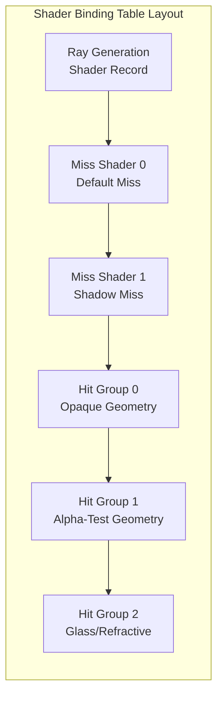

# Phase 19: Hardware Ray Tracing & Modern Illumination

## Implementation Plan

---

## Goal

Extend the Artificial Intelligence Game Engine's Render Hardware Interface (RHI) to support Vulkan Ray Tracing extensions for cutting-edge real-time graphics. This phase implements Bottom-Level Acceleration Structures (BLAS) for mesh geometry and Top-Level Acceleration Structures (TLAS) for scene hierarchy, enabling hardware-accelerated ray queries. The implementation delivers Ray-Traced Hard and Soft Shadows as a high-fidelity alternative to shadow maps, Ray-Traced Reflections for accurate surface reflections without screen-space limitations, and a Global Illumination solution for realistic indirect lighting. MCP tool extensions enable AI agents to dynamically toggle ray tracing features and trigger GI baking for real-time scene mood transformations.

---

## Requirements

### RHI Ray Tracing Extensions (Step 19.1)

- Extend RHI abstraction to support Vulkan Ray Tracing Pipeline (VK_KHR_ray_tracing_pipeline)
- Add BLAS and TLAS handle types to RHI resource management
- Implement ray tracing shader stages: Ray Generation, Closest Hit, Any Hit, Miss, Intersection
- Create Shader Binding Table (SBT) abstraction for hit group management
- Add ray tracing pipeline state object creation
- Support hybrid rasterization/ray tracing rendering paths
- Implement capability queries for RT hardware support
- Target NVIDIA RTX 20xx+ and AMD RDNA2+ hardware

### Acceleration Structure Management (Step 19.2)

- Implement BLAS building from `MeshComponent` vertex/index data
- Support BLAS compaction for memory optimization
- Create TLAS builder with per-entity transform updates
- Implement instancing support for TLAS entries
- Add BLAS/TLAS update strategies: full rebuild vs incremental update
- Support multiple geometry types: triangles, AABBs, procedural
- Implement acceleration structure caching for static geometry
- Target < 1ms TLAS rebuild for 1000 dynamic objects

### Ray-Traced Shadows (Step 19.3)

- Implement ray-traced hard shadows with single-ray queries
- Add soft shadow support with randomized ray jittering
- Support all light types: directional, point, spot
- Implement shadow denoising for temporal stability
- Create hybrid shadow mode: RT for hero objects, shadow maps for distant
- Add per-light RT shadow toggle for performance scaling
- Integrate with existing deferred lighting pipeline
- Target 1080p at 60fps with RT shadows on mid-range RTX

### Ray-Traced Reflections (Step 19.4)

- Implement glossy reflections with roughness-based ray distribution
- Add reflection ray hierarchy: RT → SSR fallback → cubemap fallback
- Support multi-bounce reflections for recursive accuracy
- Implement reflection denoising (SVGF or similar)
- Create reflection probe blending for indoor/outdoor transitions
- Add per-material reflection quality settings
- Support transparent and refractive surfaces
- Target screen-space independent reflection accuracy

### Global Illumination (Step 19.5)

- Implement screen-space global illumination (SSGI) as baseline
- Add voxel-based GI (VXGI-style) for full scene coverage
- Support irradiance probes for static GI with dynamic updates
- Implement light propagation volumes as fallback
- Create GI baking pipeline for static scenes
- Add bounce count configuration (1-3 bounces)
- Implement emissive surface contribution to GI
- Support real-time GI parameter adjustment

### MCP Ray Tracing Tools (Step 19.5)

- Implement `ToggleRayTracingFeatures` tool for dynamic feature control
- Implement `BakeGlobalIllumination` tool for GI prebaking
- Add `SetReflectionQuality` tool for per-scene quality adjustment
- Support feature availability queries
- Enable AI-driven graphics quality adaptation
- Implement batch feature changes for mood transitions

---

## Technical Considerations

### System Architecture Overview

```mermaid
graph TB
    subgraph "RHI Ray Tracing Layer"
        RHIDevice[RHIDevice<br/>VK_KHR_ray_tracing_pipeline]
        RTCapabilities[RTCapabilities<br/>Feature Detection]
        AccelerationStructure[AccelerationStructure<br/>BLAS/TLAS Handle]
        RTPipeline[RTPipeline<br/>Ray Tracing PSO]
        SBT[ShaderBindingTable<br/>Hit Group Management]
    end

    subgraph "Acceleration Structure Management"
        BLASBuilder[BLASBuilder<br/>Mesh Geometry]
        TLASBuilder[TLASBuilder<br/>Scene Hierarchy]
        ASCache[ASCache<br/>Static Geometry Cache]
        ASCompactor[ASCompactor<br/>Memory Optimization]
    end

    subgraph "Ray Tracing Effects"
        RTShadowPass[RTShadowPass<br/>Hard/Soft Shadows]
        RTReflectionPass[RTReflectionPass<br/>Glossy Reflections]
        RTGIPass[RTGIPass<br/>Global Illumination]
        RTDenoiser[RTDenoiser<br/>Temporal Filtering]
    end

    subgraph "Fallback Systems"
        ShadowMapPass[ShadowMapPass<br/>Phase 4 Shadows]
        SSRPass[SSRPass<br/>Screen-Space Reflections]
        CubemapProbes[CubemapProbes<br/>Environment Maps]
        LightProbes[LightProbes<br/>Irradiance Cache]
    end

    subgraph "MCP Integration"
        MCPRTTools[MCPRayTracingTools.h]
        ToggleRTFeatures[ToggleRayTracingFeatures]
        BakeGI[BakeGlobalIllumination]
        SetReflectionQuality[SetReflectionQuality]
    end

    subgraph "Existing Systems"
        MeshComponent[MeshComponent<br/>Vertex Data]
        TransformComponent[TransformComponent<br/>Entity Transforms]
        MaterialComponent[MaterialComponent<br/>PBR Properties]
        LightComponent[LightComponent<br/>Light Sources]
        DeferredRenderer[DeferredRenderer<br/>G-Buffer]
    end

    %% RHI Connections
    RHIDevice --> RTCapabilities
    RHIDevice --> AccelerationStructure
    RHIDevice --> RTPipeline
    RTPipeline --> SBT

    %% AS Building
    MeshComponent --> BLASBuilder
    BLASBuilder --> AccelerationStructure
    TransformComponent --> TLASBuilder
    BLASBuilder --> TLASBuilder
    TLASBuilder --> AccelerationStructure
    ASCache --> BLASBuilder
    ASCompactor --> AccelerationStructure

    %% RT Effects
    AccelerationStructure --> RTShadowPass
    AccelerationStructure --> RTReflectionPass
    AccelerationStructure --> RTGIPass
    LightComponent --> RTShadowPass
    MaterialComponent --> RTReflectionPass
    DeferredRenderer --> RTShadowPass
    DeferredRenderer --> RTReflectionPass
    DeferredRenderer --> RTGIPass

    %% Denoising
    RTShadowPass --> RTDenoiser
    RTReflectionPass --> RTDenoiser
    RTGIPass --> RTDenoiser

    %% Fallbacks
    RTShadowPass -.->|Fallback| ShadowMapPass
    RTReflectionPass -.->|Fallback| SSRPass
    SSRPass -.->|Fallback| CubemapProbes
    RTGIPass -.->|Fallback| LightProbes

    %% MCP Integration
    MCPRTTools --> ToggleRTFeatures
    MCPRTTools --> BakeGI
    MCPRTTools --> SetReflectionQuality
    ToggleRTFeatures --> RTShadowPass
    ToggleRTFeatures --> RTReflectionPass
    ToggleRTFeatures --> RTGIPass
    BakeGI --> LightProbes
```



### Technology Stack Selection

| Component | Technology | Rationale |
|-----------|------------|-----------|
| Ray Tracing API | Vulkan VK_KHR_ray_tracing_pipeline | Cross-vendor support (NVIDIA, AMD, Intel) |
| Acceleration Structures | Hardware BVH | Native GPU acceleration |
| Denoising | SVGF-based temporal filter | Balance between quality and performance |
| GI Baseline | Screen-space GI | Fast, works everywhere |
| GI Advanced | Voxel Cone Tracing | Full scene coverage without RT requirement |
| Fallback Shadows | CSM (existing Phase 4) | Guaranteed compatibility |
| Fallback Reflections | SSR + Cubemaps | Screen-space + offline baked |

### Vulkan Ray Tracing Extension Requirements

```cpp
// Required Vulkan extensions
const std::vector<const char*> rtExtensions = {
    VK_KHR_ACCELERATION_STRUCTURE_EXTENSION_NAME,
    VK_KHR_RAY_TRACING_PIPELINE_EXTENSION_NAME,
    VK_KHR_DEFERRED_HOST_OPERATIONS_EXTENSION_NAME,
    VK_KHR_BUFFER_DEVICE_ADDRESS_EXTENSION_NAME,
    VK_KHR_SPIRV_1_4_EXTENSION_NAME,
    VK_KHR_SHADER_FLOAT_CONTROLS_EXTENSION_NAME
};

// Required Vulkan features
VkPhysicalDeviceRayTracingPipelineFeaturesKHR rtPipelineFeatures = {
    .sType = VK_STRUCTURE_TYPE_PHYSICAL_DEVICE_RAY_TRACING_PIPELINE_FEATURES_KHR,
    .rayTracingPipeline = VK_TRUE,
    .rayTraversalPrimitiveCulling = VK_TRUE
};

VkPhysicalDeviceAccelerationStructureFeaturesKHR asFeatures = {
    .sType = VK_STRUCTURE_TYPE_PHYSICAL_DEVICE_ACCELERATION_STRUCTURE_FEATURES_KHR,
    .accelerationStructure = VK_TRUE,
    .accelerationStructureIndirectBuild = VK_TRUE,
    .descriptorBindingAccelerationStructureUpdateAfterBind = VK_TRUE
};
```

### Memory Layout for Shader Binding Table



---

## API Design

### RHI Ray Tracing Extensions

```cpp
// Core/Include/RHI/RHIRayTracing.h

#pragma once
#include "RHIResources.h"
#include <vector>
#include <memory>
#include <glm/glm.hpp>

namespace AIEngine::RHI {

// Forward declarations
class RHIDevice;
class RHICommandBuffer;
class RHIBuffer;
class RHIPipeline;

/// Ray tracing capability flags
enum class RTCapabilityFlags : uint32_t {
    None = 0,
    RayTracingPipeline = 1 << 0,
    RayQuery = 1 << 1,
    AccelerationStructure = 1 << 2,
    IndirectBuild = 1 << 3,
    HostCommands = 1 << 4,
    PrimitiveCulling = 1 << 5
};

/// Ray tracing pipeline stage
enum class RTShaderStage {
    RayGeneration,
    ClosestHit,
    AnyHit,
    Miss,
    Intersection,
    Callable
};

/// Acceleration structure type
enum class AccelerationStructureType {
    BottomLevel,    ///< BLAS - geometry data
    TopLevel        ///< TLAS - instance data
};

/// Acceleration structure build flags
enum class ASBuildFlags : uint32_t {
    None = 0,
    AllowUpdate = 1 << 0,
    AllowCompaction = 1 << 1,
    PreferFastTrace = 1 << 2,
    PreferFastBuild = 1 << 3,
    LowMemory = 1 << 4
};

/// Geometry type for BLAS
enum class GeometryType {
    Triangles,
    AABBs,
    Instances
};

/// Geometry flags
enum class GeometryFlags : uint32_t {
    None = 0,
    Opaque = 1 << 0,
    NoDuplicateAnyHit = 1 << 1
};

/// Ray tracing capabilities query result
struct RTCapabilities {
    RTCapabilityFlags flags = RTCapabilityFlags::None;
    uint32_t maxRayRecursionDepth = 0;
    uint32_t maxRayDispatchInvocations = 0;
    uint32_t maxGeometryCount = 0;
    uint32_t maxInstanceCount = 0;
    uint32_t maxPrimitiveCount = 0;
    uint32_t shaderGroupHandleSize = 0;
    uint32_t shaderGroupBaseAlignment = 0;
    uint32_t shaderGroupHandleAlignment = 0;
    uint64_t maxScratchDataSize = 0;
};

/// Triangle geometry description for BLAS
struct TriangleGeometryDesc {
    RHIBuffer* vertexBuffer = nullptr;
    uint64_t vertexOffset = 0;
    uint32_t vertexStride = 0;
    uint32_t vertexCount = 0;
    VertexFormat vertexFormat = VertexFormat::Float3;  ///< Position format
    
    RHIBuffer* indexBuffer = nullptr;
    uint64_t indexOffset = 0;
    uint32_t indexCount = 0;
    IndexFormat indexFormat = IndexFormat::UInt32;
    
    RHIBuffer* transformBuffer = nullptr;  ///< Optional 3x4 transform
    uint64_t transformOffset = 0;
    
    GeometryFlags flags = GeometryFlags::Opaque;
};

/// AABB geometry description for BLAS
struct AABBGeometryDesc {
    RHIBuffer* aabbBuffer = nullptr;
    uint64_t offset = 0;
    uint32_t stride = 0;
    uint32_t count = 0;
    
    GeometryFlags flags = GeometryFlags::None;
};

/// Instance description for TLAS
struct InstanceDesc {
    glm::mat3x4 transform;          ///< 3x4 row-major transform matrix
    uint32_t instanceId : 24;       ///< User-defined instance ID
    uint32_t mask : 8;              ///< Visibility mask
    uint32_t hitGroupOffset : 24;   ///< SBT hit group offset
    uint32_t flags : 8;             ///< Instance flags
    uint64_t blasAddress;           ///< Device address of BLAS
};

/// Acceleration structure build info
struct ASBuildInfo {
    AccelerationStructureType type = AccelerationStructureType::BottomLevel;
    ASBuildFlags flags = ASBuildFlags::PreferFastTrace;
    
    std::vector<TriangleGeometryDesc> triangleGeometries;
    std::vector<AABBGeometryDesc> aabbGeometries;
    
    // For TLAS
    RHIBuffer* instanceBuffer = nullptr;
    uint64_t instanceOffset = 0;
    uint32_t instanceCount = 0;
    
    // For update
    bool isUpdate = false;
    class AccelerationStructure* sourceAS = nullptr;
};

/// Acceleration structure size info
struct ASSizeInfo {
    uint64_t accelerationStructureSize = 0;
    uint64_t buildScratchSize = 0;
    uint64_t updateScratchSize = 0;
};

/// Acceleration structure handle
class AccelerationStructure {
public:
    virtual ~AccelerationStructure() = default;
    
    virtual AccelerationStructureType GetType() const = 0;
    virtual uint64_t GetDeviceAddress() const = 0;
    virtual uint64_t GetSize() const = 0;
    virtual bool IsCompacted() const = 0;
};

/// Shader binding table description
struct SBTDesc {
    struct ShaderRecord {
        const void* shaderGroupHandle = nullptr;
        const void* inlineData = nullptr;
        uint32_t inlineDataSize = 0;
    };
    
    std::vector<ShaderRecord> rayGenRecords;
    std::vector<ShaderRecord> missRecords;
    std::vector<ShaderRecord> hitGroupRecords;
    std::vector<ShaderRecord> callableRecords;
};

/// Shader binding table handle
class ShaderBindingTable {
public:
    virtual ~ShaderBindingTable() = default;
    
    virtual uint64_t GetRayGenAddress() const = 0;
    virtual uint64_t GetMissAddress() const = 0;
    virtual uint64_t GetHitGroupAddress() const = 0;
    virtual uint64_t GetCallableAddress() const = 0;
    
    virtual uint64_t GetRayGenStride() const = 0;
    virtual uint64_t GetMissStride() const = 0;
    virtual uint64_t GetHitGroupStride() const = 0;
    virtual uint64_t GetCallableStride() const = 0;
    
    virtual uint64_t GetRayGenSize() const = 0;
    virtual uint64_t GetMissSize() const = 0;
    virtual uint64_t GetHitGroupSize() const = 0;
    virtual uint64_t GetCallableSize() const = 0;
};

/// Ray tracing pipeline description
struct RTPipelineDesc {
    struct ShaderStageDesc {
        RTShaderStage stage;
        const void* shaderCode = nullptr;
        size_t codeSize = 0;
        const char* entryPoint = "main";
    };
    
    struct HitGroupDesc {
        const char* name = nullptr;
        int closestHitIndex = -1;  ///< -1 = no shader
        int anyHitIndex = -1;
        int intersectionIndex = -1;
    };
    
    std::vector<ShaderStageDesc> stages;
    std::vector<HitGroupDesc> hitGroups;
    std::vector<int> missShaderIndices;
    int rayGenIndex = 0;
    
    uint32_t maxRayRecursionDepth = 1;
    uint32_t maxPayloadSize = 32;
    uint32_t maxAttributeSize = 8;
    
    class RHIPipelineLayout* pipelineLayout = nullptr;
};

/// Ray tracing pipeline handle
class RTPipeline {
public:
    virtual ~RTPipeline() = default;
    
    virtual const void* GetShaderGroupHandle(uint32_t groupIndex) const = 0;
    virtual uint32_t GetShaderGroupCount() const = 0;
};

/// Extended RHI device interface for ray tracing
class RHIDeviceRT {
public:
    virtual ~RHIDeviceRT() = default;
    
    /// Query ray tracing capabilities
    virtual RTCapabilities GetRTCapabilities() const = 0;
    
    /// Check if ray tracing is supported
    virtual bool IsRayTracingSupported() const = 0;
    
    /// Query acceleration structure build sizes
    virtual ASSizeInfo GetAccelerationStructureBuildSizes(
        const ASBuildInfo& buildInfo) const = 0;
    
    /// Create acceleration structure
    virtual std::unique_ptr<AccelerationStructure> CreateAccelerationStructure(
        AccelerationStructureType type,
        uint64_t size) = 0;
    
    /// Create ray tracing pipeline
    virtual std::unique_ptr<RTPipeline> CreateRTPipeline(
        const RTPipelineDesc& desc) = 0;
    
    /// Create shader binding table
    virtual std::unique_ptr<ShaderBindingTable> CreateShaderBindingTable(
        const RTPipeline* pipeline,
        const SBTDesc& desc) = 0;
};

/// Extended command buffer interface for ray tracing
class RHICommandBufferRT {
public:
    virtual ~RHICommandBufferRT() = default;
    
    /// Build acceleration structure
    virtual void BuildAccelerationStructure(
        const ASBuildInfo& buildInfo,
        AccelerationStructure* dst,
        RHIBuffer* scratchBuffer,
        uint64_t scratchOffset) = 0;
    
    /// Compact acceleration structure
    virtual void CompactAccelerationStructure(
        AccelerationStructure* src,
        AccelerationStructure* dst) = 0;
    
    /// Copy acceleration structure
    virtual void CopyAccelerationStructure(
        AccelerationStructure* src,
        AccelerationStructure* dst) = 0;
    
    /// Trace rays
    virtual void TraceRays(
        const ShaderBindingTable* sbt,
        uint32_t width,
        uint32_t height,
        uint32_t depth = 1) = 0;
    
    /// Bind ray tracing pipeline
    virtual void BindRTPipeline(const RTPipeline* pipeline) = 0;
    
    /// Write acceleration structure compacted size to buffer
    virtual void WriteAccelerationStructureProperties(
        AccelerationStructure* as,
        RHIBuffer* buffer,
        uint64_t offset) = 0;
};

} // namespace AIEngine::RHI
```

### Acceleration Structure Builder

```cpp
// Core/Include/Rendering/AccelerationStructureBuilder.h

#pragma once
#include "RHI/RHIRayTracing.h"
#include <entt/entt.hpp>
#include <unordered_map>
#include <memory>
#include <vector>

namespace AIEngine::Rendering {

/// BLAS cache key
struct BLASCacheKey {
    uint64_t meshHandle = 0;
    uint32_t lodLevel = 0;
    bool operator==(const BLASCacheKey& other) const {
        return meshHandle == other.meshHandle && lodLevel == other.lodLevel;
    }
};

struct BLASCacheKeyHash {
    size_t operator()(const BLASCacheKey& key) const {
        return std::hash<uint64_t>()(key.meshHandle) ^ 
               (std::hash<uint32_t>()(key.lodLevel) << 1);
    }
};

/// BLAS entry in cache
struct BLASEntry {
    std::unique_ptr<RHI::AccelerationStructure> blas;
    std::unique_ptr<RHI::RHIBuffer> scratchBuffer;
    bool isBuilt = false;
    bool needsRebuild = false;
    uint64_t lastUsedFrame = 0;
};

/// TLAS instance entry
struct TLASInstance {
    entt::entity entity = entt::null;
    uint64_t blasAddress = 0;
    glm::mat4 transform;
    uint32_t customIndex = 0;
    uint32_t mask = 0xFF;
    uint32_t hitGroupOffset = 0;
    uint32_t flags = 0;
};

/// Acceleration structure builder
class AccelerationStructureBuilder {
public:
    AccelerationStructureBuilder(RHI::RHIDeviceRT* device);
    ~AccelerationStructureBuilder();
    
    /// Build BLAS for a mesh
    RHI::AccelerationStructure* GetOrCreateBLAS(
        const class MeshAsset* mesh,
        uint32_t lodLevel = 0);
    
    /// Mark BLAS for rebuild (e.g., mesh deformation)
    void MarkBLASForRebuild(const class MeshAsset* mesh);
    
    /// Build TLAS from scene entities
    void BuildTLAS(entt::registry& registry,
                   RHI::RHICommandBufferRT* cmdBuffer);
    
    /// Get the scene TLAS
    RHI::AccelerationStructure* GetTLAS() const { return m_TLAS.get(); }
    
    /// Update TLAS transforms (incremental update)
    void UpdateTLASTransforms(entt::registry& registry,
                              RHI::RHICommandBufferRT* cmdBuffer);
    
    /// Force full TLAS rebuild
    void MarkTLASForRebuild() { m_TLASNeedsRebuild = true; }
    
    /// Compact all BLAS structures
    void CompactBLASStructures(RHI::RHICommandBufferRT* cmdBuffer);
    
    /// Clear BLAS cache for unused meshes
    void PruneUnusedBLAS(uint64_t currentFrame, uint64_t maxUnusedFrames = 60);
    
    /// Get statistics
    struct Stats {
        uint32_t blasCount = 0;
        uint32_t tlasInstanceCount = 0;
        uint64_t totalBLASMemory = 0;
        uint64_t tlasMemory = 0;
        float lastTLASBuildTimeMs = 0.0f;
    };
    Stats GetStats() const { return m_Stats; }
    
private:
    BLASEntry* CreateBLASEntry(const class MeshAsset* mesh, uint32_t lodLevel);
    void BuildBLASEntry(BLASEntry* entry, const class MeshAsset* mesh,
                        RHI::RHICommandBufferRT* cmdBuffer);
    void CollectTLASInstances(entt::registry& registry);
    
    RHI::RHIDeviceRT* m_Device = nullptr;
    
    std::unordered_map<BLASCacheKey, BLASEntry, BLASCacheKeyHash> m_BLASCache;
    
    std::unique_ptr<RHI::AccelerationStructure> m_TLAS;
    std::unique_ptr<RHI::RHIBuffer> m_TLASScratchBuffer;
    std::unique_ptr<RHI::RHIBuffer> m_InstanceBuffer;
    std::vector<TLASInstance> m_TLASInstances;
    bool m_TLASNeedsRebuild = true;
    
    Stats m_Stats;
};

} // namespace AIEngine::Rendering
```

### Ray-Traced Shadow Pass

```cpp
// Core/Include/Rendering/RTShadowPass.h

#pragma once
#include "RHI/RHIRayTracing.h"
#include "RHI/RHIResources.h"
#include <memory>
#include <vector>

namespace AIEngine::Rendering {

/// Shadow quality preset
enum class RTShadowQuality {
    Off,        ///< Use shadow maps only
    Low,        ///< 1 spp, no denoising
    Medium,     ///< 1 spp, temporal denoising
    High,       ///< 4 spp, spatial + temporal denoising
    Ultra       ///< 8 spp, full denoising
};

/// Per-light shadow settings
struct RTShadowLightSettings {
    bool useRayTracing = true;
    RTShadowQuality quality = RTShadowQuality::Medium;
    float softShadowRadius = 0.1f;  ///< Light source radius for soft shadows
    float maxRayDistance = 1000.0f;
    float shadowBias = 0.001f;
};

/// Ray-traced shadow pass
class RTShadowPass {
public:
    RTShadowPass(RHI::RHIDeviceRT* device, class AccelerationStructureBuilder* asBuilder);
    ~RTShadowPass();
    
    /// Initialize shadow pass resources
    bool Initialize(uint32_t width, uint32_t height);
    
    /// Resize shadow textures
    void Resize(uint32_t width, uint32_t height);
    
    /// Render shadows for all lights
    void Render(RHI::RHICommandBufferRT* cmdBuffer,
                const struct GBuffer& gbuffer,
                const std::vector<struct LightData>& lights);
    
    /// Get shadow mask texture
    RHI::RHITexture* GetShadowMask() const { return m_ShadowMask.get(); }
    
    /// Set global quality
    void SetQuality(RTShadowQuality quality) { m_GlobalQuality = quality; }
    RTShadowQuality GetQuality() const { return m_GlobalQuality; }
    
    /// Set per-light settings
    void SetLightSettings(uint32_t lightIndex, const RTShadowLightSettings& settings);
    
    /// Enable/disable denoising
    void SetDenoisingEnabled(bool enabled) { m_DenoisingEnabled = enabled; }
    
private:
    void CreatePipeline();
    void CreateSBT();
    void UpdateDescriptors(const struct GBuffer& gbuffer);
    void DenoiseOutput(RHI::RHICommandBufferRT* cmdBuffer);
    
    RHI::RHIDeviceRT* m_Device = nullptr;
    AccelerationStructureBuilder* m_ASBuilder = nullptr;
    
    std::unique_ptr<RHI::RTPipeline> m_Pipeline;
    std::unique_ptr<RHI::ShaderBindingTable> m_SBT;
    std::unique_ptr<RHI::RHITexture> m_ShadowMask;
    std::unique_ptr<RHI::RHITexture> m_ShadowHistory;
    
    RTShadowQuality m_GlobalQuality = RTShadowQuality::Medium;
    std::vector<RTShadowLightSettings> m_LightSettings;
    bool m_DenoisingEnabled = true;
    
    uint32_t m_Width = 0;
    uint32_t m_Height = 0;
    uint32_t m_FrameIndex = 0;
};

} // namespace AIEngine::Rendering
```

### Ray-Traced Reflection Pass

```cpp
// Core/Include/Rendering/RTReflectionPass.h

#pragma once
#include "RHI/RHIRayTracing.h"
#include "RHI/RHIResources.h"
#include <memory>

namespace AIEngine::Rendering {

/// Reflection quality preset
enum class RTReflectionQuality {
    Off,            ///< SSR + cubemap only
    Low,            ///< 0.5x resolution, 1 bounce
    Medium,         ///< 0.75x resolution, 1 bounce, denoising
    High,           ///< Full resolution, 2 bounces, denoising
    Ultra           ///< Full resolution, 3 bounces, full denoising
};

/// Reflection pass configuration
struct RTReflectionConfig {
    RTReflectionQuality quality = RTReflectionQuality::Medium;
    uint32_t maxBounces = 1;
    float roughnessThreshold = 0.5f;    ///< Above this, use SSR/cubemap
    float maxRayDistance = 500.0f;
    bool enableSSRFallback = true;
    bool enableCubemapFallback = true;
    float resolutionScale = 1.0f;
    uint32_t samplesPerPixel = 1;
};

/// Ray-traced reflection pass
class RTReflectionPass {
public:
    RTReflectionPass(RHI::RHIDeviceRT* device, 
                     class AccelerationStructureBuilder* asBuilder);
    ~RTReflectionPass();
    
    /// Initialize reflection pass resources
    bool Initialize(uint32_t width, uint32_t height);
    
    /// Resize reflection textures
    void Resize(uint32_t width, uint32_t height);
    
    /// Render reflections
    void Render(RHI::RHICommandBufferRT* cmdBuffer,
                const struct GBuffer& gbuffer,
                RHI::RHITexture* colorBuffer,
                RHI::RHITexture* depthBuffer);
    
    /// Get reflection color texture
    RHI::RHITexture* GetReflectionColor() const { return m_ReflectionColor.get(); }
    
    /// Set configuration
    void SetConfig(const RTReflectionConfig& config);
    const RTReflectionConfig& GetConfig() const { return m_Config; }
    
    /// Set environment cubemap for fallback
    void SetEnvironmentCubemap(RHI::RHITexture* cubemap) { 
        m_EnvironmentCubemap = cubemap; 
    }
    
private:
    void CreatePipeline();
    void CreateSBT();
    void UpdateDescriptors(const struct GBuffer& gbuffer,
                           RHI::RHITexture* colorBuffer,
                           RHI::RHITexture* depthBuffer);
    void DenoiseOutput(RHI::RHICommandBufferRT* cmdBuffer);
    void CompositeWithFallbacks(RHI::RHICommandBufferRT* cmdBuffer);
    
    RHI::RHIDeviceRT* m_Device = nullptr;
    AccelerationStructureBuilder* m_ASBuilder = nullptr;
    
    std::unique_ptr<RHI::RTPipeline> m_Pipeline;
    std::unique_ptr<RHI::ShaderBindingTable> m_SBT;
    std::unique_ptr<RHI::RHITexture> m_ReflectionColor;
    std::unique_ptr<RHI::RHITexture> m_ReflectionHistory;
    std::unique_ptr<RHI::RHITexture> m_ReflectionRaw;  ///< Before denoising
    
    RHI::RHITexture* m_EnvironmentCubemap = nullptr;
    
    RTReflectionConfig m_Config;
    
    uint32_t m_Width = 0;
    uint32_t m_Height = 0;
    uint32_t m_FrameIndex = 0;
};

} // namespace AIEngine::Rendering
```

### Global Illumination System

```cpp
// Core/Include/Rendering/GlobalIllumination.h

#pragma once
#include "RHI/RHIRayTracing.h"
#include "RHI/RHIResources.h"
#include <memory>
#include <vector>
#include <glm/glm.hpp>

namespace AIEngine::Rendering {

/// GI technique selection
enum class GITechnique {
    None,               ///< No indirect lighting
    ScreenSpace,        ///< SSGI (fast, limited)
    VoxelConeTracing,   ///< VXGI (medium, full coverage)
    RayTraced,          ///< RTGI (highest quality, RT required)
    IrradianceProbes    ///< Baked + dynamic (balanced)
};

/// GI quality preset
enum class GIQuality {
    Off,
    Low,        ///< 1 bounce, low resolution
    Medium,     ///< 1 bounce, medium resolution
    High,       ///< 2 bounces, high resolution
    Ultra       ///< 3 bounces, full resolution
};

/// Irradiance probe data
struct IrradianceProbe {
    glm::vec3 position;
    float radius = 10.0f;
    glm::vec3 irradiance[6];  ///< Cube directions
    bool isDynamic = false;
    bool needsUpdate = true;
};

/// Irradiance probe volume
struct IrradianceVolume {
    glm::vec3 minBounds;
    glm::vec3 maxBounds;
    glm::ivec3 resolution = {8, 4, 8};
    std::vector<IrradianceProbe> probes;
    
    std::unique_ptr<RHI::RHITexture> probeTexture;
};

/// GI configuration
struct GIConfig {
    GITechnique technique = GITechnique::ScreenSpace;
    GIQuality quality = GIQuality::Medium;
    
    // SSGI settings
    float ssgiRadius = 5.0f;
    uint32_t ssgiSamples = 8;
    
    // VXGI settings
    uint32_t voxelResolution = 128;
    float voxelScale = 0.25f;
    
    // RTGI settings
    uint32_t rtgiBounces = 1;
    uint32_t rtgiSamplesPerPixel = 1;
    float rtgiMaxDistance = 100.0f;
    
    // Common
    float indirectIntensity = 1.0f;
    bool enableEmissiveContribution = true;
    float emissiveBoost = 1.0f;
};

/// Global illumination manager
class GlobalIllumination {
public:
    GlobalIllumination(RHI::RHIDeviceRT* device,
                       class AccelerationStructureBuilder* asBuilder);
    ~GlobalIllumination();
    
    /// Initialize GI resources
    bool Initialize(uint32_t width, uint32_t height);
    
    /// Resize GI textures
    void Resize(uint32_t width, uint32_t height);
    
    /// Compute indirect lighting
    void Compute(RHI::RHICommandBufferRT* cmdBuffer,
                 const struct GBuffer& gbuffer,
                 const std::vector<struct LightData>& lights);
    
    /// Get indirect lighting texture
    RHI::RHITexture* GetIndirectLighting() const { return m_IndirectLighting.get(); }
    
    /// Set GI configuration
    void SetConfig(const GIConfig& config);
    const GIConfig& GetConfig() const { return m_Config; }
    
    /// Set technique (may trigger resource reallocation)
    void SetTechnique(GITechnique technique);
    
    /// Bake irradiance probes
    void BakeIrradianceProbes(RHI::RHICommandBufferRT* cmdBuffer,
                              entt::registry& registry);
    
    /// Add irradiance volume
    void AddIrradianceVolume(const glm::vec3& minBounds,
                             const glm::vec3& maxBounds,
                             const glm::ivec3& resolution);
    
    /// Update dynamic probes
    void UpdateDynamicProbes(RHI::RHICommandBufferRT* cmdBuffer);
    
    /// Get voxel grid texture (for VXGI)
    RHI::RHITexture* GetVoxelGrid() const { return m_VoxelGrid.get(); }
    
private:
    void ComputeSSGI(RHI::RHICommandBufferRT* cmdBuffer,
                     const struct GBuffer& gbuffer);
    void ComputeVXGI(RHI::RHICommandBufferRT* cmdBuffer,
                     const struct GBuffer& gbuffer,
                     const std::vector<struct LightData>& lights);
    void ComputeRTGI(RHI::RHICommandBufferRT* cmdBuffer,
                     const struct GBuffer& gbuffer);
    void ComputeProbeGI(RHI::RHICommandBufferRT* cmdBuffer,
                        const struct GBuffer& gbuffer);
    
    void VoxelizeScene(RHI::RHICommandBufferRT* cmdBuffer,
                       const std::vector<struct LightData>& lights);
    void InjectRadiance(RHI::RHICommandBufferRT* cmdBuffer,
                        const std::vector<struct LightData>& lights);
    void PropagateRadiance(RHI::RHICommandBufferRT* cmdBuffer);
    
    void CreateSSGIResources();
    void CreateVXGIResources();
    void CreateRTGIResources();
    void CreateProbeResources();
    
    RHI::RHIDeviceRT* m_Device = nullptr;
    AccelerationStructureBuilder* m_ASBuilder = nullptr;
    
    GIConfig m_Config;
    
    // Output
    std::unique_ptr<RHI::RHITexture> m_IndirectLighting;
    std::unique_ptr<RHI::RHITexture> m_IndirectHistory;
    
    // SSGI resources
    std::unique_ptr<RHI::RHIPipeline> m_SSGIPipeline;
    
    // VXGI resources
    std::unique_ptr<RHI::RHITexture> m_VoxelGrid;
    std::unique_ptr<RHI::RHITexture> m_VoxelRadiance;
    std::unique_ptr<RHI::RHIPipeline> m_VoxelizePipeline;
    std::unique_ptr<RHI::RHIPipeline> m_VoxelConePipeline;
    
    // RTGI resources
    std::unique_ptr<RHI::RTPipeline> m_RTGIPipeline;
    std::unique_ptr<RHI::ShaderBindingTable> m_RTGISBT;
    
    // Probe resources
    std::vector<IrradianceVolume> m_IrradianceVolumes;
    std::unique_ptr<RHI::RHIPipeline> m_ProbeSamplePipeline;
    
    uint32_t m_Width = 0;
    uint32_t m_Height = 0;
    uint32_t m_FrameIndex = 0;
};

} // namespace AIEngine::Rendering
```

### MCP Ray Tracing Tools

```cpp
// Core/Include/MCP/MCPRayTracingTools.h

#pragma once
#include "MCPTool.h"
#include "Rendering/RTShadowPass.h"
#include "Rendering/RTReflectionPass.h"
#include "Rendering/GlobalIllumination.h"
#include <nlohmann/json.hpp>

namespace AIEngine::MCP {

/// Tool to toggle ray tracing features
class ToggleRayTracingFeaturesTool : public MCPTool {
public:
    std::string GetName() const override { return "ToggleRayTracingFeatures"; }
    std::string GetDescription() const override {
        return "Enable, disable, or adjust ray tracing features for dynamic graphics quality";
    }
    
    nlohmann::json GetInputSchema() const override {
        return {
            {"type", "object"},
            {"properties", {
                {"feature", {
                    {"type", "string"},
                    {"enum", {"shadows", "reflections", "gi", "all"}},
                    {"description", "Ray tracing feature to control"}
                }},
                {"enabled", {
                    {"type", "boolean"},
                    {"description", "Whether to enable the feature"}
                }},
                {"quality", {
                    {"type", "string"},
                    {"enum", {"off", "low", "medium", "high", "ultra"}},
                    {"description", "Quality preset to apply"}
                }},
                {"shadowSoftness", {
                    {"type", "number"},
                    {"description", "Soft shadow radius (0.0-1.0)"},
                    {"minimum", 0.0},
                    {"maximum", 1.0}
                }},
                {"reflectionBounces", {
                    {"type", "integer"},
                    {"description", "Number of reflection bounces (1-3)"},
                    {"minimum", 1},
                    {"maximum", 3}
                }},
                {"giIntensity", {
                    {"type", "number"},
                    {"description", "Global illumination intensity (0.0-5.0)"},
                    {"minimum", 0.0},
                    {"maximum", 5.0}
                }},
                {"giTechnique", {
                    {"type", "string"},
                    {"enum", {"none", "screenspace", "voxel", "raytraced", "probes"}},
                    {"description", "GI technique to use"}
                }}
            }},
            {"required", ["feature"]}
        };
    }
    
    nlohmann::json Execute(const nlohmann::json& params,
                           entt::registry& registry) override;
    
    void SetRTShadowPass(Rendering::RTShadowPass* pass) { m_ShadowPass = pass; }
    void SetRTReflectionPass(Rendering::RTReflectionPass* pass) { m_ReflectionPass = pass; }
    void SetGlobalIllumination(Rendering::GlobalIllumination* gi) { m_GI = gi; }
    
private:
    Rendering::RTShadowPass* m_ShadowPass = nullptr;
    Rendering::RTReflectionPass* m_ReflectionPass = nullptr;
    Rendering::GlobalIllumination* m_GI = nullptr;
};

/// Tool to bake global illumination
class BakeGlobalIlluminationTool : public MCPTool {
public:
    std::string GetName() const override { return "BakeGlobalIllumination"; }
    std::string GetDescription() const override {
        return "Bake global illumination probes for static or semi-static lighting";
    }
    
    nlohmann::json GetInputSchema() const override {
        return {
            {"type", "object"},
            {"properties", {
                {"volumeBounds", {
                    {"type", "object"},
                    {"properties", {
                        {"minX", {{"type", "number"}}},
                        {"minY", {{"type", "number"}}},
                        {"minZ", {{"type", "number"}}},
                        {"maxX", {{"type", "number"}}},
                        {"maxY", {{"type", "number"}}},
                        {"maxZ", {{"type", "number"}}}
                    }},
                    {"description", "Bounding volume for probe placement"}
                }},
                {"resolution", {
                    {"type", "object"},
                    {"properties", {
                        {"x", {{"type", "integer"}, {"minimum", 2}, {"maximum", 64}}},
                        {"y", {{"type", "integer"}, {"minimum", 2}, {"maximum", 64}}},
                        {"z", {{"type", "integer"}, {"minimum", 2}, {"maximum", 64}}}
                    }},
                    {"description", "Probe grid resolution"}
                }},
                {"bounces", {
                    {"type", "integer"},
                    {"description", "Number of light bounces to simulate"},
                    {"minimum", 1},
                    {"maximum", 5},
                    {"default", 2}
                }},
                {"samplesPerProbe", {
                    {"type", "integer"},
                    {"description", "Samples per probe for baking"},
                    {"minimum", 64},
                    {"maximum", 4096},
                    {"default", 256}
                }},
                {"async", {
                    {"type", "boolean"},
                    {"description", "Bake asynchronously over multiple frames"},
                    {"default", true}
                }}
            }}
        };
    }
    
    nlohmann::json Execute(const nlohmann::json& params,
                           entt::registry& registry) override;
    
    void SetGlobalIllumination(Rendering::GlobalIllumination* gi) { m_GI = gi; }
    
private:
    Rendering::GlobalIllumination* m_GI = nullptr;
};

/// Tool to set reflection quality per material/surface
class SetReflectionQualityTool : public MCPTool {
public:
    std::string GetName() const override { return "SetReflectionQuality"; }
    std::string GetDescription() const override {
        return "Set reflection quality for specific materials or scene-wide";
    }
    
    nlohmann::json GetInputSchema() const override {
        return {
            {"type", "object"},
            {"properties", {
                {"scope", {
                    {"type", "string"},
                    {"enum", {"global", "material", "entity"}},
                    {"description", "Scope of quality change"}
                }},
                {"materialId", {
                    {"type", "string"},
                    {"description", "Material ID for material scope"}
                }},
                {"entityId", {
                    {"type", "integer"},
                    {"description", "Entity ID for entity scope"}
                }},
                {"quality", {
                    {"type", "string"},
                    {"enum", {"off", "low", "medium", "high", "ultra"}},
                    {"description", "Reflection quality preset"}
                }},
                {"roughnessThreshold", {
                    {"type", "number"},
                    {"description", "Roughness above which to use cheaper fallback"},
                    {"minimum", 0.0},
                    {"maximum", 1.0}
                }},
                {"maxBounces", {
                    {"type", "integer"},
                    {"description", "Maximum reflection bounces"},
                    {"minimum", 1},
                    {"maximum", 3}
                }}
            }},
            {"required", ["scope", "quality"]}
        };
    }
    
    nlohmann::json Execute(const nlohmann::json& params,
                           entt::registry& registry) override;
    
    void SetRTReflectionPass(Rendering::RTReflectionPass* pass) { m_ReflectionPass = pass; }
    
private:
    Rendering::RTReflectionPass* m_ReflectionPass = nullptr;
};

/// Tool to query ray tracing capabilities
class QueryRTCapabilitiesTool : public MCPTool {
public:
    std::string GetName() const override { return "QueryRTCapabilities"; }
    std::string GetDescription() const override {
        return "Query hardware ray tracing capabilities and current settings";
    }
    
    nlohmann::json GetInputSchema() const override {
        return {
            {"type", "object"},
            {"properties", {
                {"includeHardwareInfo", {
                    {"type", "boolean"},
                    {"description", "Include detailed hardware capability info"},
                    {"default", true}
                }},
                {"includeCurrentSettings", {
                    {"type", "boolean"},
                    {"description", "Include current RT feature settings"},
                    {"default", true}
                }}
            }}
        };
    }
    
    nlohmann::json Execute(const nlohmann::json& params,
                           entt::registry& registry) override;
    
    void SetRHIDevice(RHI::RHIDeviceRT* device) { m_Device = device; }
    void SetRTShadowPass(Rendering::RTShadowPass* pass) { m_ShadowPass = pass; }
    void SetRTReflectionPass(Rendering::RTReflectionPass* pass) { m_ReflectionPass = pass; }
    void SetGlobalIllumination(Rendering::GlobalIllumination* gi) { m_GI = gi; }
    
private:
    RHI::RHIDeviceRT* m_Device = nullptr;
    Rendering::RTShadowPass* m_ShadowPass = nullptr;
    Rendering::RTReflectionPass* m_ReflectionPass = nullptr;
    Rendering::GlobalIllumination* m_GI = nullptr;
};

/// Register all ray tracing MCP tools
void RegisterRayTracingMCPTools(class MCPServer& server);

} // namespace AIEngine::MCP
```

### Ray Tracing Shaders

```glsl
// Shaders/RayTracing/RTShadow.rgen
#version 460
#extension GL_EXT_ray_tracing : require

layout(location = 0) rayPayloadEXT bool isShadowed;

layout(set = 0, binding = 0) uniform accelerationStructureEXT topLevelAS;
layout(set = 0, binding = 1, rgba8) uniform image2D shadowMask;
layout(set = 0, binding = 2) uniform sampler2D gBufferNormal;
layout(set = 0, binding = 3) uniform sampler2D gBufferDepth;

layout(set = 1, binding = 0) uniform LightData {
    vec4 position;      // xyz = position/direction, w = type
    vec4 colorIntensity;
    vec4 params;        // x = radius (soft shadows), y = range
} light;

layout(set = 1, binding = 1) uniform CameraData {
    mat4 viewProj;
    mat4 invViewProj;
    vec4 cameraPos;
} camera;

layout(push_constant) uniform PushConstants {
    uint frameIndex;
    float softRadius;
    float shadowBias;
    float maxDistance;
} pc;

vec3 reconstructWorldPos(vec2 uv, float depth) {
    vec4 clipPos = vec4(uv * 2.0 - 1.0, depth, 1.0);
    vec4 worldPos = camera.invViewProj * clipPos;
    return worldPos.xyz / worldPos.w;
}

// Simple hash for random sampling
float hash(vec2 p) {
    return fract(sin(dot(p, vec2(127.1, 311.7))) * 43758.5453);
}

vec2 sampleDisk(vec2 seed) {
    float angle = hash(seed) * 6.283185;
    float radius = sqrt(hash(seed + 0.5));
    return vec2(cos(angle), sin(angle)) * radius;
}

void main() {
    ivec2 pixelCoord = ivec2(gl_LaunchIDEXT.xy);
    vec2 uv = (vec2(pixelCoord) + 0.5) / vec2(gl_LaunchSizeEXT.xy);
    
    float depth = texture(gBufferDepth, uv).r;
    if (depth == 1.0) {
        imageStore(shadowMask, pixelCoord, vec4(1.0));
        return;
    }
    
    vec3 worldPos = reconstructWorldPos(uv, depth);
    vec3 normal = normalize(texture(gBufferNormal, uv).xyz * 2.0 - 1.0);
    
    // Light direction
    vec3 lightDir;
    float lightDistance;
    
    if (light.position.w == 0.0) {
        // Directional light
        lightDir = normalize(-light.position.xyz);
        lightDistance = pc.maxDistance;
    } else {
        // Point/Spot light
        vec3 toLight = light.position.xyz - worldPos;
        lightDistance = length(toLight);
        lightDir = toLight / lightDistance;
    }
    
    // Bias to avoid self-shadowing
    vec3 origin = worldPos + normal * pc.shadowBias;
    
    float shadow = 0.0;
    uint sampleCount = (pc.softRadius > 0.0) ? 4 : 1;
    
    for (uint i = 0; i < sampleCount; i++) {
        vec3 rayDir = lightDir;
        
        // Soft shadow jittering
        if (pc.softRadius > 0.0) {
            vec2 seed = vec2(pixelCoord) + vec2(pc.frameIndex, i);
            vec2 diskSample = sampleDisk(seed) * pc.softRadius;
            
            // Create orthonormal basis around light direction
            vec3 tangent = normalize(cross(lightDir, vec3(0, 1, 0)));
            vec3 bitangent = cross(lightDir, tangent);
            
            rayDir = normalize(lightDir + tangent * diskSample.x + bitangent * diskSample.y);
        }
        
        isShadowed = true;
        
        traceRayEXT(
            topLevelAS,
            gl_RayFlagsTerminateOnFirstHitEXT | gl_RayFlagsSkipClosestHitShaderEXT,
            0xFF,
            0,  // sbtRecordOffset
            0,  // sbtRecordStride
            0,  // missIndex
            origin,
            0.0,
            rayDir,
            lightDistance,
            0   // payload location
        );
        
        shadow += isShadowed ? 0.0 : 1.0;
    }
    
    shadow /= float(sampleCount);
    imageStore(shadowMask, pixelCoord, vec4(shadow));
}

// Shaders/RayTracing/RTShadow.rmiss
#version 460
#extension GL_EXT_ray_tracing : require

layout(location = 0) rayPayloadInEXT bool isShadowed;

void main() {
    isShadowed = false;
}
```

```glsl
// Shaders/RayTracing/RTReflection.rgen
#version 460
#extension GL_EXT_ray_tracing : require

layout(location = 0) rayPayloadEXT vec4 hitValue;

layout(set = 0, binding = 0) uniform accelerationStructureEXT topLevelAS;
layout(set = 0, binding = 1, rgba16f) uniform image2D reflectionOutput;
layout(set = 0, binding = 2) uniform sampler2D gBufferAlbedo;
layout(set = 0, binding = 3) uniform sampler2D gBufferNormal;
layout(set = 0, binding = 4) uniform sampler2D gBufferMetallicRoughness;
layout(set = 0, binding = 5) uniform sampler2D gBufferDepth;
layout(set = 0, binding = 6) uniform sampler2D sceneColor;
layout(set = 0, binding = 7) uniform samplerCube environmentMap;

layout(set = 1, binding = 0) uniform CameraData {
    mat4 viewProj;
    mat4 invViewProj;
    vec4 cameraPos;
} camera;

layout(push_constant) uniform PushConstants {
    uint frameIndex;
    uint maxBounces;
    float maxDistance;
    float roughnessThreshold;
} pc;

vec3 reconstructWorldPos(vec2 uv, float depth) {
    vec4 clipPos = vec4(uv * 2.0 - 1.0, depth, 1.0);
    vec4 worldPos = camera.invViewProj * clipPos;
    return worldPos.xyz / worldPos.w;
}

// Importance sample GGX distribution
vec3 importanceSampleGGX(vec2 Xi, vec3 N, float roughness) {
    float a = roughness * roughness;
    
    float phi = 2.0 * 3.14159265 * Xi.x;
    float cosTheta = sqrt((1.0 - Xi.y) / (1.0 + (a*a - 1.0) * Xi.y));
    float sinTheta = sqrt(1.0 - cosTheta * cosTheta);
    
    vec3 H;
    H.x = cos(phi) * sinTheta;
    H.y = sin(phi) * sinTheta;
    H.z = cosTheta;
    
    vec3 up = abs(N.z) < 0.999 ? vec3(0.0, 0.0, 1.0) : vec3(1.0, 0.0, 0.0);
    vec3 tangent = normalize(cross(up, N));
    vec3 bitangent = cross(N, tangent);
    
    return normalize(tangent * H.x + bitangent * H.y + N * H.z);
}

float hash(vec2 p) {
    return fract(sin(dot(p, vec2(127.1, 311.7))) * 43758.5453);
}

void main() {
    ivec2 pixelCoord = ivec2(gl_LaunchIDEXT.xy);
    vec2 uv = (vec2(pixelCoord) + 0.5) / vec2(gl_LaunchSizeEXT.xy);
    
    float depth = texture(gBufferDepth, uv).r;
    if (depth == 1.0) {
        imageStore(reflectionOutput, pixelCoord, vec4(0.0));
        return;
    }
    
    vec4 metallicRoughness = texture(gBufferMetallicRoughness, uv);
    float metallic = metallicRoughness.r;
    float roughness = metallicRoughness.g;
    
    // Skip non-reflective surfaces
    if (metallic < 0.01 && roughness > pc.roughnessThreshold) {
        // Sample environment map as fallback
        vec3 normal = normalize(texture(gBufferNormal, uv).xyz * 2.0 - 1.0);
        vec3 worldPos = reconstructWorldPos(uv, depth);
        vec3 viewDir = normalize(camera.cameraPos.xyz - worldPos);
        vec3 reflectDir = reflect(-viewDir, normal);
        vec3 envColor = texture(environmentMap, reflectDir).rgb;
        imageStore(reflectionOutput, pixelCoord, vec4(envColor * 0.1, 1.0));
        return;
    }
    
    vec3 worldPos = reconstructWorldPos(uv, depth);
    vec3 normal = normalize(texture(gBufferNormal, uv).xyz * 2.0 - 1.0);
    vec3 viewDir = normalize(camera.cameraPos.xyz - worldPos);
    
    // Generate sample direction
    vec2 seed = vec2(pixelCoord) + vec2(pc.frameIndex, 0);
    vec2 Xi = vec2(hash(seed), hash(seed + 0.5));
    
    vec3 halfVec = importanceSampleGGX(Xi, normal, roughness);
    vec3 rayDir = reflect(-viewDir, halfVec);
    
    // Offset to avoid self-intersection
    vec3 origin = worldPos + normal * 0.001;
    
    hitValue = vec4(0.0);
    
    traceRayEXT(
        topLevelAS,
        gl_RayFlagsOpaqueEXT,
        0xFF,
        0,
        0,
        0,
        origin,
        0.001,
        rayDir,
        pc.maxDistance,
        0
    );
    
    // Apply fresnel
    float NdotV = max(dot(normal, viewDir), 0.0);
    vec3 F0 = mix(vec3(0.04), texture(gBufferAlbedo, uv).rgb, metallic);
    vec3 fresnel = F0 + (1.0 - F0) * pow(1.0 - NdotV, 5.0);
    
    vec3 reflection = hitValue.rgb * fresnel;
    imageStore(reflectionOutput, pixelCoord, vec4(reflection, hitValue.a));
}

// Shaders/RayTracing/RTReflection.rchit
#version 460
#extension GL_EXT_ray_tracing : require
#extension GL_EXT_nonuniform_qualifier : require

layout(location = 0) rayPayloadInEXT vec4 hitValue;
hitAttributeEXT vec2 attribs;

layout(set = 2, binding = 0) uniform sampler2D textures[];

struct Material {
    vec4 albedo;
    vec4 metallicRoughnessEmissive;
    int albedoTexture;
    int normalTexture;
    int metallicRoughnessTexture;
    int padding;
};

layout(std430, set = 2, binding = 1) readonly buffer Materials {
    Material materials[];
};

layout(std430, set = 2, binding = 2) readonly buffer VertexBuffer {
    float vertices[];
};

layout(std430, set = 2, binding = 3) readonly buffer IndexBuffer {
    uint indices[];
};

struct InstanceData {
    uint materialIndex;
    uint vertexOffset;
    uint indexOffset;
    uint padding;
};

layout(std430, set = 2, binding = 4) readonly buffer Instances {
    InstanceData instances[];
};

vec3 getVertexPosition(uint index, uint vertexOffset) {
    uint i = (vertexOffset + index) * 8; // 8 floats per vertex
    return vec3(vertices[i], vertices[i+1], vertices[i+2]);
}

vec2 getVertexUV(uint index, uint vertexOffset) {
    uint i = (vertexOffset + index) * 8 + 6; // UV at offset 6
    return vec2(vertices[i], vertices[i+1]);
}

void main() {
    InstanceData instance = instances[gl_InstanceCustomIndexEXT];
    
    // Get triangle indices
    uint i0 = indices[instance.indexOffset + gl_PrimitiveID * 3 + 0];
    uint i1 = indices[instance.indexOffset + gl_PrimitiveID * 3 + 1];
    uint i2 = indices[instance.indexOffset + gl_PrimitiveID * 3 + 2];
    
    // Interpolate UV
    vec2 uv0 = getVertexUV(i0, instance.vertexOffset);
    vec2 uv1 = getVertexUV(i1, instance.vertexOffset);
    vec2 uv2 = getVertexUV(i2, instance.vertexOffset);
    
    vec3 barycentrics = vec3(1.0 - attribs.x - attribs.y, attribs.x, attribs.y);
    vec2 uv = uv0 * barycentrics.x + uv1 * barycentrics.y + uv2 * barycentrics.z;
    
    // Sample material
    Material mat = materials[instance.materialIndex];
    vec3 albedo = mat.albedo.rgb;
    
    if (mat.albedoTexture >= 0) {
        albedo *= texture(textures[nonuniformEXT(mat.albedoTexture)], uv).rgb;
    }
    
    // Add emissive
    vec3 emissive = mat.metallicRoughnessEmissive.b * albedo;
    
    hitValue = vec4(albedo + emissive, 1.0);
}

// Shaders/RayTracing/RTReflection.rmiss
#version 460
#extension GL_EXT_ray_tracing : require

layout(location = 0) rayPayloadInEXT vec4 hitValue;
layout(set = 0, binding = 7) uniform samplerCube environmentMap;

void main() {
    vec3 envColor = texture(environmentMap, gl_WorldRayDirectionEXT).rgb;
    hitValue = vec4(envColor, 0.0);
}
```

---

## Implementation Steps

### Step 19.1: RHI Ray Tracing Extensions

#### v0.19.1.1: Capability Detection
- Add VK_KHR_ray_tracing_pipeline extension to device creation
- Query VkPhysicalDeviceRayTracingPipelineFeaturesKHR
- Query VkPhysicalDeviceAccelerationStructureFeaturesKHR
- Implement IsRayTracingSupported() check
- Create RTCapabilities structure

#### v0.19.1.2: Acceleration Structure Handles
- Create AccelerationStructure base class in RHI
- Implement VulkanAccelerationStructure with VkAccelerationStructureKHR
- Add device address querying
- Implement memory allocation via VMA

#### v0.19.1.3: Geometry Descriptions
- Implement TriangleGeometryDesc structure
- Implement AABBGeometryDesc structure
- Implement InstanceDesc structure
- Create ASBuildInfo aggregate structure

#### v0.19.1.4: Build Size Queries
- Implement GetAccelerationStructureBuildSizes()
- Calculate scratch buffer requirements
- Support compaction size queries
- Handle both BLAS and TLAS

#### v0.19.1.5: Ray Tracing Pipeline
- Create RTPipelineDesc structure
- Implement shader stage compilation for RT shaders
- Create hit group definitions
- Build VkRayTracingPipelineCreateInfoKHR

#### v0.19.1.6: Shader Binding Table
- Implement SBTDesc structure
- Create ShaderBindingTable class
- Calculate alignment requirements
- Build ray gen, miss, and hit group regions

#### v0.19.1.7: Command Buffer Extensions
- Add BuildAccelerationStructure() command
- Add CompactAccelerationStructure() command
- Add TraceRays() command
- Add BindRTPipeline() command

#### v0.19.1.8: Hybrid Rendering Support
- Create render path selection logic
- Support fallback when RT unavailable
- Add runtime feature toggling
- Implement capability-based shader selection

### Step 19.2: Acceleration Structure Management

#### v0.19.2.1: BLAS Builder
- Create AccelerationStructureBuilder class
- Implement GetOrCreateBLAS() with caching
- Extract vertex/index data from MeshAsset
- Build TriangleGeometryDesc from mesh data

#### v0.19.2.2: BLAS Building
- Implement BuildBLASEntry() with command recording
- Allocate scratch buffer with proper sizing
- Execute VkCmdBuildAccelerationStructuresKHR
- Add build completion synchronization

#### v0.19.2.3: BLAS Compaction
- Query compacted size after build
- Allocate compacted BLAS
- Execute compaction copy
- Update cache with compacted structure

#### v0.19.2.4: BLAS Caching
- Implement BLASCacheKey with mesh handle + LOD
- Add LRU-style usage tracking
- Implement PruneUnusedBLAS()
- Support hot-reload mesh updates

#### v0.19.2.5: TLAS Instance Collection
- Implement CollectTLASInstances() from registry
- Query MeshComponent and TransformComponent
- Build InstanceDesc array with transforms
- Set visibility masks and hit group offsets

#### v0.19.2.6: TLAS Building
- Create TLAS with proper instance count
- Build instance buffer on GPU
- Execute TLAS build command
- Support incremental TLAS updates

#### v0.19.2.7: TLAS Update Optimization
- Detect static vs dynamic entities
- Implement transform-only updates
- Use ASBuildFlags::AllowUpdate for dynamic TLAS
- Batch transform updates

#### v0.19.2.8: Statistics and Debugging
- Track BLAS/TLAS memory usage
- Measure build times
- Add ImGui debug visualization
- Log acceleration structure events

### Step 19.3: Ray-Traced Shadows

#### v0.19.3.1: Shadow Pass Structure
- Create RTShadowPass class
- Initialize shadow mask texture
- Set up descriptor sets for G-buffer access
- Create push constant structure

#### v0.19.3.2: Shadow Ray Generation Shader
- Implement world position reconstruction
- Calculate light direction per pixel
- Implement hard shadow ray tracing
- Store result in shadow mask

#### v0.19.3.3: Soft Shadow Implementation
- Add randomized ray jittering
- Implement disk sampling for soft shadows
- Use temporal accumulation for noise reduction
- Configure shadow softness per light

#### v0.19.3.4: Shadow Shader Binding Table
- Create ray generation shader
- Create miss shader (returns unshadowed)
- Set up minimal SBT (no closest hit needed)
- Configure ray flags for shadow rays

#### v0.19.3.5: Per-Light Settings
- Implement RTShadowLightSettings structure
- Support per-light quality override
- Add max ray distance configuration
- Configure shadow bias per light

#### v0.19.3.6: Shadow Denoising
- Implement temporal accumulation
- Add variance-guided spatial filter
- Use motion vectors for reprojection
- Blend denoised with raw for sharpness

#### v0.19.3.7: Hybrid Shadow Mode
- Detect hero objects vs distant geometry
- Use RT shadows for nearby/important lights
- Fall back to shadow maps for distant lights
- Blend RT and shadow map results

#### v0.19.3.8: Performance Optimization
- Implement 1/2 resolution shadow tracing
- Add temporal upscaling
- Use ray flags for early termination
- Profile and optimize ray counts

### Step 19.4: Ray-Traced Reflections

#### v0.19.4.1: Reflection Pass Structure
- Create RTReflectionPass class
- Initialize reflection color textures
- Set up descriptor sets for scene access
- Configure resolution scaling

#### v0.19.4.2: Reflection Ray Generation
- Implement importance sampling for GGX
- Calculate reflection direction from roughness
- Trace reflection rays against TLAS
- Store hit color in output texture

#### v0.19.4.3: Closest Hit Shader
- Sample hit geometry material
- Interpolate UV coordinates
- Sample albedo texture
- Return shaded hit color

#### v0.19.4.4: Reflection Miss Shader
- Sample environment cubemap
- Return sky color for misses
- Support HDR environment maps

#### v0.19.4.5: Multi-Bounce Reflections
- Implement recursive ray tracing
- Track bounce count in payload
- Attenuate with each bounce
- Limit max bounces for performance

#### v0.19.4.6: Reflection Denoising
- Implement SVGF-style denoiser
- Use roughness for filter size
- Apply temporal reprojection
- Handle disocclusions

#### v0.19.4.7: Fallback Integration
- Detect RT failure/unavailable
- Fall back to SSR for screen-visible
- Fall back to cubemap for off-screen
- Blend hierarchically

#### v0.19.4.8: Quality Presets
- Implement RTReflectionQuality enum
- Configure samples per pixel per quality
- Configure resolution scale per quality
- Expose quality in MCP tools

### Step 19.5: Global Illumination

#### v0.19.5.1: Screen-Space GI (SSGI)
- Create compute shader for SSGI
- Sample hemisphere around each pixel
- Use depth buffer for occlusion
- Accumulate indirect color

#### v0.19.5.2: Voxel Grid Setup (VXGI)
- Create 3D voxel texture
- Configure voxel resolution and scale
- Set up voxelization pipeline
- Create radiance injection pipeline

#### v0.19.5.3: Scene Voxelization
- Render scene to voxel grid
- Store albedo and normal in voxels
- Handle alpha-tested geometry
- Update incrementally for dynamic objects

#### v0.19.5.4: Radiance Injection
- Inject direct light into voxels
- Sample shadow maps for visibility
- Store radiance in 3D texture
- Support emissive surfaces

#### v0.19.5.5: Voxel Cone Tracing
- Implement cone tracing compute shader
- Trace cones in hemisphere
- Sample voxel mip levels for cone aperture
- Accumulate indirect radiance

#### v0.19.5.6: RT Global Illumination
- Create RT GI pipeline
- Trace indirect rays from G-buffer
- Sample material at hit points
- Accumulate multi-bounce lighting

#### v0.19.5.7: Irradiance Probes
- Create IrradianceVolume structure
- Place probes in bounding volume
- Bake probe irradiance
- Sample probes for indirect lighting

#### v0.19.5.8: GI Technique Selection
- Implement GITechnique enum
- Create unified GI interface
- Switch techniques at runtime
- Blend techniques if needed

### Step 19.6: MCP Ray Tracing Tools

#### v0.19.6.1: ToggleRayTracingFeatures Tool
- Create tool with feature enum
- Support enable/disable operations
- Apply quality presets
- Handle feature dependencies

#### v0.19.6.2: BakeGlobalIllumination Tool
- Create tool with volume parameters
- Implement async baking option
- Report baking progress
- Store baked data to disk

#### v0.19.6.3: SetReflectionQuality Tool
- Create tool with scope selection
- Support per-material override
- Support per-entity override
- Apply quality presets

#### v0.19.6.4: QueryRTCapabilities Tool
- Report hardware RT support
- List available features
- Report current settings
- Include performance metrics

#### v0.19.6.5: Tool Registration
- Create RegisterRayTracingMCPTools()
- Register all tools with MCPServer
- Connect tools to rendering systems
- Add tool documentation

#### v0.19.6.6: AI Graphics Adaptation
- Enable quality scaling based on frame time
- Support mood transitions via RT settings
- Allow AI to optimize RT features
- Log RT feature changes

---

## Testing Strategy

### Unit Tests
- RHI RT capability detection
- Acceleration structure building
- SBT creation and indexing
- Shader compilation for RT stages

### Integration Tests
- BLAS from MeshComponent
- TLAS from scene entities
- Shadow rays hitting geometry
- Reflection rays with material sampling
- GI probe baking and sampling

### Visual Tests
- Compare RT shadows vs shadow maps
- Compare RT reflections vs SSR
- Validate GI color bleeding
- Check denoiser temporal stability

### Performance Benchmarks
- BLAS build time for various mesh sizes
- TLAS rebuild time for 1000 instances
- RT shadow performance at various resolutions
- RT reflection cost with multiple bounces
- GI technique comparison

---

## Dependencies

### External Libraries
- Vulkan SDK 1.2+ with RT extensions
- SPIR-V tools for shader compilation
- VMA (existing) for memory management

### Internal Dependencies
- Phase 4: Shadow mapping (fallback)
- Phase 5: PBR materials (reflection inputs)
- Phase 7: Deferred rendering (G-buffer)
- MeshComponent, TransformComponent, MaterialComponent

---

## Hardware Requirements

| Feature | Minimum | Recommended |
|---------|---------|-------------|
| RT Shadows | NVIDIA RTX 2060 / AMD RX 6600 | RTX 3070 / RX 6800 |
| RT Reflections | RTX 2070 / RX 6700 | RTX 3080 / RX 6900 |
| RTGI | RTX 2080 / RX 6800 | RTX 3090 / RX 6950 |
| VXGI | Any Vulkan 1.2 GPU | GTX 1070+ / RX 580+ |
| SSGI | Any Vulkan 1.0 GPU | Any modern GPU |

---

## Risks & Mitigations

| Risk | Mitigation |
|------|------------|
| RT hardware not available | Comprehensive fallback system |
| Performance too slow | Quality presets with automatic scaling |
| TLAS rebuild bottleneck | Incremental updates for transforms |
| Denoiser artifacts | Multiple denoiser options |
| Memory pressure from AS | BLAS compaction and pruning |

---

## Success Criteria

- [ ] RT shadows achieve 60fps at 1080p on RTX 3060
- [ ] RT reflections maintain quality parity with offline renders
- [ ] TLAS rebuilds in < 1ms for 1000 dynamic objects
- [ ] GI provides visible indirect lighting contribution
- [ ] All features gracefully degrade on non-RT hardware
- [ ] MCP tools enable AI-driven graphics adaptation
- [ ] Denoiser produces stable, artifact-free output
