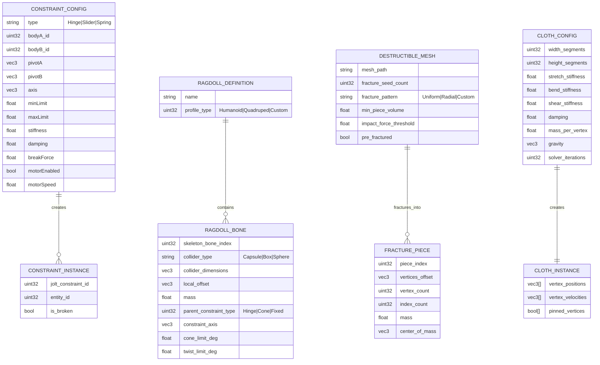

# Phase 20: Advanced Physics & Destruction

## Implementation Plan

---

## Goal

Extend the Artificial Intelligence Game Engine's physics capabilities with advanced constraint systems (Hinges, Sliders, Springs) for interactive environments like vehicles, doors, and machinery. Implement a runtime Ragdoll generation system that converts the AnimatorComponent's skeletal hierarchy into physics-driven rigidbody networks upon entity death. Develop a Destructible Mesh pipeline using Voronoi fracturing for dynamic mesh shattering into physics-enabled debris. Integrate Cloth and Soft Body simulation for realistic fabric, flags, and vegetation wind interaction. Finally, expose these systems through MCP tools enabling AI agents to dynamically trigger destruction, spawn ragdolls, and manipulate constraints in real-time.

---

## Requirements

### Complex Constraints System (Step 20.1)
- Extend Jolt Physics integration with `HingeConstraint`, `SliderConstraint`, and `SpringConstraint` components
- Implement constraint creation from ECS components with automatic body pairing
- Support constraint limits (angle limits for hinges, distance limits for sliders)
- Implement motor-driven constraints for automated doors, drawbridges, and machinery
- Provide breakable constraints with configurable force thresholds
- Support constraint serialization for save/load and MCP modification

### Ragdoll Generation System (Step 20.2)
- Create `RagdollDefinition` data structure mapping skeleton bones to collider shapes
- Implement automatic ragdoll generation from AnimatorComponent skeletal hierarchy
- Support pre-defined ragdoll profiles for different character types (humanoid, quadruped, custom)
- Implement smooth animation-to-ragdoll blending for natural death transitions
- Support partial ragdolls (e.g., only ragdoll upper body while legs remain animated)
- Integrate with collision layers for ragdoll-vs-world and ragdoll-vs-ragdoll interactions

### Destructible Mesh Pipeline (Step 20.3)
- Implement Voronoi cell generation using 3D Delaunay triangulation
- Create `DestructibleMeshComponent` with pre-fractured or runtime fracturing modes
- Implement fracture point seeding strategies (uniform, impact-based, structural weak points)
- Generate physics-enabled debris pieces with appropriate mass and collision shapes
- Implement debris lifecycle management (pooling, despawn timers, LOD culling)
- Support hierarchical destruction (large pieces break into smaller on subsequent impacts)

### Cloth & Soft Body Simulation (Step 20.4)
- Implement `ClothComponent` for capes, flags, banners, and curtains
- Create cloth constraint solver supporting stretch, bend, and shear constraints
- Implement wind force field interaction for dynamic cloth movement
- Support cloth-collider interaction with nearby rigid bodies
- Implement `SoftBodyComponent` for vegetation, ropes, and deformable objects
- Provide vertex pinning for cloth attachment points

### MCP Physics Tools (Step 20.5)
- Implement `TriggerDestruction` tool for AI-controlled destruction events
- Implement `SpawnRagdoll` tool for converting animated entities to physics ragdolls
- Implement `ModifyConstraint` tool for runtime constraint parameter adjustment
- Add safety validation to prevent physics explosion (velocity limits, constraint sanity checks)
- Support batch operations for multiple simultaneous destructions

---

## Technical Considerations

### System Architecture Overview

```mermaid
graph TB
    subgraph "Physics Constraint Layer"
        ConstraintSystem[ConstraintSystem<br/>Manages All Constraints]
        HingeConstraint[HingeConstraintComponent<br/>Doors, Wheels]
        SliderConstraint[SliderConstraintComponent<br/>Pistons, Drawers]
        SpringConstraint[SpringConstraintComponent<br/>Suspension, Bounce]
        BreakableConstraint[BreakableConstraint<br/>Destructible Joints]
    end

    subgraph "Ragdoll Layer"
        RagdollSystem[RagdollSystem<br/>Death Transitions]
        RagdollDefinition[RagdollDefinition<br/>Bone-to-Collider Map]
        RagdollComponent[RagdollComponent<br/>Runtime Ragdoll State]
        BlendController[AnimToRagdollBlender<br/>Smooth Transitions]
    end

    subgraph "Destruction Layer"
        DestructionSystem[DestructionSystem<br/>Fracture Processing]
        VoronoiFracturer[VoronoiFracturer<br/>Mesh Splitting]
        DebrisManager[DebrisManager<br/>Pooling & Cleanup]
        DestructibleMesh[DestructibleMeshComponent<br/>Pre-fractured Data]
    end

    subgraph "Soft Body Layer"
        ClothSystem[ClothSystem<br/>Constraint Solver]
        ClothComponent[ClothComponent<br/>Fabric Simulation]
        SoftBodyComponent[SoftBodyComponent<br/>Deformables]
        WindField[WindFieldComponent<br/>Force Application]
    end

    subgraph "MCP Integration Layer"
        MCPPhysicsTools[MCPPhysicsTools.h]
        TriggerDestruction[TriggerDestruction]
        SpawnRagdoll[SpawnRagdoll]
        ModifyConstraint[ModifyConstraint]
    end

    subgraph "Core Physics - Jolt"
        PhysicsWorld[PhysicsWorld<br/>JPH::PhysicsSystem]
        BodyInterface[BodyInterface<br/>Body Creation]
        ConstraintManager[JPH::ConstraintManager<br/>Native Constraints]
    end

    ConstraintSystem --> HingeConstraint
    ConstraintSystem --> SliderConstraint
    ConstraintSystem --> SpringConstraint
    ConstraintSystem --> BreakableConstraint
    ConstraintSystem --> ConstraintManager

    RagdollSystem --> RagdollComponent
    RagdollSystem --> RagdollDefinition
    RagdollSystem --> BlendController
    RagdollComponent --> BodyInterface

    DestructionSystem --> VoronoiFracturer
    DestructionSystem --> DebrisManager
    DestructionSystem --> DestructibleMesh
    VoronoiFracturer --> BodyInterface

    ClothSystem --> ClothComponent
    ClothSystem --> SoftBodyComponent
    ClothSystem --> WindField
    ClothComponent --> PhysicsWorld

    MCPPhysicsTools --> TriggerDestruction
    MCPPhysicsTools --> SpawnRagdoll
    MCPPhysicsTools --> ModifyConstraint

    TriggerDestruction --> DestructionSystem
    SpawnRagdoll --> RagdollSystem
    ModifyConstraint --> ConstraintSystem
```



### Technology Stack Selection

| Layer | Technology | Rationale |
|-------|------------|-----------|
| Constraint System | Jolt Physics Native | Jolt provides HingeConstraint, SliderConstraint, DistanceConstraint built-in |
| Ragdoll Generation | Custom + Jolt | Map skeleton hierarchy to Jolt ragdoll constraints |
| Voronoi Fracturing | Custom Implementation | No external dependency, full control over fracture algorithm |
| Delaunay Triangulation | Bowyer-Watson | Standard algorithm, O(n log n) complexity |
| Cloth Simulation | Position Based Dynamics | Stable, fast, well-suited for real-time cloth |
| Soft Bodies | Jolt SoftBody (optional) | Use Jolt's soft body if available, else custom PBD |
| MCP Integration | Existing MCPServer | Follows established tool patterns from Phase 10/16 |

### Integration Points

- **PhysicsWorld Integration**: All constraints/ragdolls/debris use existing `PhysicsWorld` and `BodyInterface`
- **ECS Integration**: New components follow existing patterns in `Core/ECS/Components/`
- **AnimatorComponent Integration**: Ragdoll system reads bone hierarchy from existing `AnimatorComponent` and `SkeletalMeshComponent`
- **RenderSystem Integration**: Debris meshes use existing `MeshComponent` rendering pipeline
- **MCP Integration**: New tools follow `MCPTool` base class pattern in `Core/MCP/`
- **Collision Layers**: Extend existing `Layers::DEBRIS` for destruction debris

### Deployment Architecture

```
Core/
├── Physics/
│   ├── Constraints/
│   │   ├── ConstraintTypes.h              # Enums and common types
│   │   ├── HingeConstraintData.h          # Hinge config data
│   │   ├── SliderConstraintData.h         # Slider config data
│   │   ├── SpringConstraintData.h         # Spring config data
│   │   └── ConstraintHelpers.cpp          # Jolt constraint creation
│   ├── Ragdoll/
│   │   ├── RagdollDefinition.h            # Bone-to-body mapping
│   │   ├── RagdollGenerator.h/cpp         # Runtime ragdoll creation
│   │   └── AnimationBlender.h/cpp         # Anim-to-ragdoll blend
│   ├── Destruction/
│   │   ├── VoronoiFracturer.h/cpp         # Voronoi cell generator
│   │   ├── DebrisManager.h/cpp            # Debris pooling/cleanup
│   │   └── FractureHelpers.h              # Mesh splitting utilities
│   └── SoftBody/
│       ├── ClothSolver.h/cpp              # PBD cloth simulation
│       ├── WindField.h                    # Wind force field
│       └── SoftBodyHelpers.h              # Vertex constraint utils
├── ECS/
│   ├── Components/
│   │   ├── HingeConstraintComponent.h
│   │   ├── SliderConstraintComponent.h
│   │   ├── SpringConstraintComponent.h
│   │   ├── RagdollComponent.h
│   │   ├── DestructibleMeshComponent.h
│   │   ├── ClothComponent.h
│   │   ├── SoftBodyComponent.h
│   │   └── WindFieldComponent.h
│   └── Systems/
│       ├── ConstraintSystem.h/cpp
│       ├── RagdollSystem.h/cpp
│       ├── DestructionSystem.h/cpp
│       └── ClothSystem.h/cpp
├── MCP/
│   ├── MCPPhysicsTools.h                  # All physics-related MCP tools
│   └── MCPAllTools.h                      # Updated to include physics tools
└── Shaders/
    └── cloth_compute.comp                 # GPU-accelerated cloth solver (optional)
```

### Scalability Considerations

- **Constraint Pooling**: Pre-allocate constraint slots for frequently created/destroyed constraints
- **Debris LOD**: Far debris uses simplified collision shapes and lower LOD meshes
- **Cloth Quality Tiers**: Configurable iteration count and constraint density
- **Ragdoll Limits**: Maximum concurrent ragdolls capped (e.g., 32) with oldest replaced
- **Async Fracturing**: Heavy Voronoi computation runs on JobSystem worker threads

---

## Database Schema Design

### Constraint and Ragdoll Data Model



### Component Serialization Coverage

| Component | Serializable | Notes |
|-----------|--------------|-------|
| HingeConstraintComponent | ✅ | Bodies, pivot, axis, limits, motor |
| SliderConstraintComponent | ✅ | Bodies, axis, limits, motor |
| SpringConstraintComponent | ✅ | Bodies, rest length, stiffness, damping |
| RagdollComponent | ⚠️ | Definition saved, runtime state reconstructed |
| DestructibleMeshComponent | ✅ | Fracture config, pre-computed pieces |
| ClothComponent | ✅ | Config saved, positions reconstructed |
| SoftBodyComponent | ✅ | Config saved, positions reconstructed |
| WindFieldComponent | ✅ | Force direction, strength, turbulence |

---

## API Design

### Constraint Components

```cpp
namespace Core::ECS {

// ============================================================================
// Constraint Base Types
// ============================================================================

enum class ConstraintType : uint8_t {
    Hinge = 0,      // Rotates around single axis (doors, wheels)
    Slider,         // Translates along single axis (pistons, drawers)
    Spring,         // Distance constraint with spring behavior
    Cone,           // Cone twist constraint (ragdoll joints)
    Fixed           // Rigid connection (welded parts)
};

// Common constraint properties
struct ConstraintBase {
    entt::entity BodyA = entt::null;        // First connected body
    entt::entity BodyB = entt::null;        // Second body (null = world anchor)
    
    Math::Vec3 PivotA{0.0f};                // Attachment point on body A (local space)
    Math::Vec3 PivotB{0.0f};                // Attachment point on body B (local space)
    
    bool IsEnabled = true;
    bool IsBreakable = false;
    float BreakForce = FLT_MAX;             // Force required to break constraint
    float BreakTorque = FLT_MAX;            // Torque required to break constraint
    
    bool IsBroken = false;                  // Runtime: has constraint broken?
    
    JPH::Constraint* JoltConstraint = nullptr;  // Runtime: Jolt constraint ptr
    bool NeedsSync = true;                  // Dirty flag for physics sync
};

// ============================================================================
// Hinge Constraint Component
// ============================================================================

struct HingeConstraintComponent : public ConstraintBase {
    Math::Vec3 HingeAxis{0.0f, 1.0f, 0.0f};    // Rotation axis (local to body A)
    Math::Vec3 NormalAxis{1.0f, 0.0f, 0.0f};   // Normal axis for angle measurement
    
    // Angle limits (radians)
    bool HasLimits = false;
    float MinAngle = -Math::PI;
    float MaxAngle = Math::PI;
    float LimitSpring = 0.0f;               // Softness of limits
    float LimitDamping = 0.0f;
    
    // Motor
    bool MotorEnabled = false;
    float MotorTargetVelocity = 0.0f;       // rad/s
    float MotorMaxTorque = 1000.0f;         // N·m
    
    // Runtime state
    float CurrentAngle = 0.0f;
    
    // Factory methods
    static HingeConstraintComponent CreateDoor(
        entt::entity doorBody,
        entt::entity frameBody,
        const Math::Vec3& hingePivot,
        float maxOpenAngle = Math::PI * 0.5f)
    {
        HingeConstraintComponent hinge;
        hinge.BodyA = doorBody;
        hinge.BodyB = frameBody;
        hinge.PivotA = hingePivot;
        hinge.PivotB = hingePivot;
        hinge.HingeAxis = {0.0f, 1.0f, 0.0f};  // Vertical axis
        hinge.HasLimits = true;
        hinge.MinAngle = 0.0f;
        hinge.MaxAngle = maxOpenAngle;
        return hinge;
    }
    
    static HingeConstraintComponent CreateWheel(
        entt::entity wheelBody,
        entt::entity chassisBody,
        const Math::Vec3& wheelPivot)
    {
        HingeConstraintComponent hinge;
        hinge.BodyA = wheelBody;
        hinge.BodyB = chassisBody;
        hinge.PivotA = {0.0f, 0.0f, 0.0f};
        hinge.PivotB = wheelPivot;
        hinge.HingeAxis = {1.0f, 0.0f, 0.0f};  // Horizontal axis
        hinge.HasLimits = false;  // Free rotation
        return hinge;
    }
    
    static HingeConstraintComponent CreateMotorized(
        entt::entity rotatingBody,
        entt::entity anchorBody,
        const Math::Vec3& pivot,
        float speed,
        float torque = 1000.0f)
    {
        HingeConstraintComponent hinge;
        hinge.BodyA = rotatingBody;
        hinge.BodyB = anchorBody;
        hinge.PivotA = pivot;
        hinge.PivotB = pivot;
        hinge.HasLimits = false;
        hinge.MotorEnabled = true;
        hinge.MotorTargetVelocity = speed;
        hinge.MotorMaxTorque = torque;
        return hinge;
    }
};

// ============================================================================
// Slider Constraint Component
// ============================================================================

struct SliderConstraintComponent : public ConstraintBase {
    Math::Vec3 SliderAxis{1.0f, 0.0f, 0.0f};   // Translation axis (local to body A)
    Math::Vec3 NormalAxis{0.0f, 1.0f, 0.0f};   // Normal for orientation lock
    
    // Position limits (meters along axis)
    bool HasLimits = false;
    float MinPosition = -1.0f;
    float MaxPosition = 1.0f;
    float LimitSpring = 0.0f;
    float LimitDamping = 0.0f;
    
    // Motor
    bool MotorEnabled = false;
    float MotorTargetVelocity = 0.0f;       // m/s
    float MotorMaxForce = 10000.0f;         // N
    
    // Position targeting (alternative to velocity motor)
    bool PositionMotorEnabled = false;
    float TargetPosition = 0.0f;
    float PositionSpring = 1000.0f;
    float PositionDamping = 100.0f;
    
    // Runtime state
    float CurrentPosition = 0.0f;
    
    // Factory methods
    static SliderConstraintComponent CreatePiston(
        entt::entity pistonBody,
        entt::entity cylinderBody,
        const Math::Vec3& axis,
        float minExtent,
        float maxExtent)
    {
        SliderConstraintComponent slider;
        slider.BodyA = pistonBody;
        slider.BodyB = cylinderBody;
        slider.SliderAxis = axis;
        slider.HasLimits = true;
        slider.MinPosition = minExtent;
        slider.MaxPosition = maxExtent;
        return slider;
    }
    
    static SliderConstraintComponent CreateDrawer(
        entt::entity drawerBody,
        entt::entity cabinetBody,
        float maxPullOut = 0.5f)
    {
        SliderConstraintComponent slider;
        slider.BodyA = drawerBody;
        slider.BodyB = cabinetBody;
        slider.SliderAxis = {0.0f, 0.0f, 1.0f};  // Z-axis (forward)
        slider.HasLimits = true;
        slider.MinPosition = 0.0f;
        slider.MaxPosition = maxPullOut;
        return slider;
    }
    
    static SliderConstraintComponent CreateElevator(
        entt::entity platformBody,
        entt::entity shaftBody,
        float bottomFloor,
        float topFloor,
        float speed = 2.0f)
    {
        SliderConstraintComponent slider;
        slider.BodyA = platformBody;
        slider.BodyB = shaftBody;
        slider.SliderAxis = {0.0f, 1.0f, 0.0f};  // Vertical
        slider.HasLimits = true;
        slider.MinPosition = bottomFloor;
        slider.MaxPosition = topFloor;
        slider.PositionMotorEnabled = true;
        slider.TargetPosition = bottomFloor;
        slider.PositionSpring = 5000.0f;
        slider.PositionDamping = 500.0f;
        return slider;
    }
};

// ============================================================================
// Spring Constraint Component
// ============================================================================

struct SpringConstraintComponent : public ConstraintBase {
    float RestLength = 1.0f;                // Natural length of spring
    float MinLength = 0.0f;                 // Minimum compressed length
    float MaxLength = FLT_MAX;              // Maximum extended length
    
    // Spring properties
    float Stiffness = 1000.0f;              // N/m - spring constant
    float Damping = 100.0f;                 // N·s/m - damping coefficient
    
    // Frequency/damping ratio alternative (more intuitive)
    bool UseFrequencyDamping = false;
    float Frequency = 5.0f;                 // Hz - oscillation frequency
    float DampingRatio = 0.5f;              // 0=undamped, 1=critically damped
    
    // Runtime state
    float CurrentLength = 1.0f;
    float CurrentForce = 0.0f;
    
    // Factory methods
    static SpringConstraintComponent CreateSuspension(
        entt::entity wheelBody,
        entt::entity chassisBody,
        float restLength = 0.3f,
        float stiffness = 50000.0f,
        float damping = 3000.0f)
    {
        SpringConstraintComponent spring;
        spring.BodyA = wheelBody;
        spring.BodyB = chassisBody;
        spring.RestLength = restLength;
        spring.MinLength = restLength * 0.5f;
        spring.MaxLength = restLength * 1.5f;
        spring.Stiffness = stiffness;
        spring.Damping = damping;
        return spring;
    }
    
    static SpringConstraintComponent CreateBungee(
        entt::entity objectBody,
        entt::entity anchorBody,
        float restLength,
        float stiffness = 500.0f)
    {
        SpringConstraintComponent spring;
        spring.BodyA = objectBody;
        spring.BodyB = anchorBody;
        spring.RestLength = restLength;
        spring.MinLength = 0.0f;  // Can compress fully
        spring.Stiffness = stiffness;
        spring.Damping = stiffness * 0.1f;
        return spring;
    }
    
    static SpringConstraintComponent CreateFrequencyBased(
        entt::entity bodyA,
        entt::entity bodyB,
        float restLength,
        float frequencyHz = 5.0f,
        float dampingRatio = 0.7f)
    {
        SpringConstraintComponent spring;
        spring.BodyA = bodyA;
        spring.BodyB = bodyB;
        spring.RestLength = restLength;
        spring.UseFrequencyDamping = true;
        spring.Frequency = frequencyHz;
        spring.DampingRatio = dampingRatio;
        return spring;
    }
};

} // namespace Core::ECS
```

### Ragdoll System API

```cpp
namespace Core::Physics {

// ============================================================================
// Ragdoll Bone Definition
// ============================================================================

struct RagdollBoneDefinition {
    int32_t SkeletonBoneIndex = -1;          // Index into Skeleton::Bones
    std::string BoneName;                     // For lookup by name
    
    // Collider shape
    ECS::ColliderType ColliderType = ECS::ColliderType::Capsule;
    Math::Vec3 ColliderDimensions{0.1f};     // Capsule: (radius, halfHeight, 0)
    Math::Vec3 LocalOffset{0.0f};            // Offset from bone origin
    Math::Quat LocalRotation{1.0f, 0.0f, 0.0f, 0.0f};
    
    // Physics properties
    float Mass = 1.0f;
    float Friction = 0.5f;
    float Restitution = 0.1f;
    float LinearDamping = 0.5f;
    float AngularDamping = 0.5f;
    
    // Constraint to parent bone
    ECS::ConstraintType ParentConstraintType = ECS::ConstraintType::Cone;
    Math::Vec3 ConstraintAxis{0.0f, 1.0f, 0.0f};
    float ConeAngleLimit = Math::PI * 0.25f;   // 45 degrees
    float TwistMinLimit = -Math::PI * 0.25f;
    float TwistMaxLimit = Math::PI * 0.25f;
    
    // Optional: skip this bone (e.g., fingers)
    bool Enabled = true;
};

// ============================================================================
// Ragdoll Definition
// ============================================================================

enum class RagdollProfile : uint8_t {
    Humanoid = 0,       // Bipedal character
    Quadruped,          // Four-legged animal
    Biped,              // Bird-like
    Serpentine,         // Snake-like (chain of segments)
    Custom              // User-defined
};

struct RagdollDefinition {
    std::string Name;
    RagdollProfile Profile = RagdollProfile::Humanoid;
    
    std::vector<RagdollBoneDefinition> Bones;
    
    // Global settings
    float GlobalMassScale = 1.0f;
    float GlobalDampingScale = 1.0f;
    bool SelfCollision = false;              // Bones collide with each other
    bool CollideWithWorld = true;
    
    // Joint stiffness (0 = floppy, 1 = stiff)
    float JointStiffness = 0.3f;
    
    // Factory for common ragdoll types
    static RagdollDefinition CreateHumanoid();
    static RagdollDefinition CreateQuadruped();
    
    // Find bone definition by skeleton index
    const RagdollBoneDefinition* FindBone(int32_t skeletonIndex) const {
        for (const auto& bone : Bones) {
            if (bone.SkeletonBoneIndex == skeletonIndex) {
                return &bone;
            }
        }
        return nullptr;
    }
    
    // Find bone definition by name
    const RagdollBoneDefinition* FindBone(const std::string& name) const {
        for (const auto& bone : Bones) {
            if (bone.BoneName == name) {
                return &bone;
            }
        }
        return nullptr;
    }
};

// ============================================================================
// Ragdoll Generator
// ============================================================================

class RagdollGenerator {
public:
    struct GenerationResult {
        bool Success = false;
        std::string ErrorMessage;
        std::vector<JPH::BodyID> CreatedBodies;
        std::vector<JPH::Constraint*> CreatedConstraints;
    };
    
    // Generate ragdoll from definition and current animation pose
    static GenerationResult Generate(
        PhysicsWorld& physics,
        ECS::Scene& scene,
        entt::entity entity,
        const RagdollDefinition& definition,
        const ECS::SkeletonPose& currentPose,
        const Math::Mat4& entityWorldTransform);
    
    // Auto-generate definition from skeleton (basic capsule per bone)
    static RagdollDefinition AutoGenerateDefinition(
        const Renderer::Skeleton& skeleton,
        RagdollProfile profile = RagdollProfile::Humanoid);
    
    // Blend from animation to ragdoll smoothly
    static void BlendToRagdoll(
        ECS::Scene& scene,
        entt::entity entity,
        float blendDuration = 0.3f);
    
    // Blend from ragdoll back to animation
    static void BlendFromRagdoll(
        ECS::Scene& scene,
        entt::entity entity,
        float blendDuration = 0.3f);
};

} // namespace Core::Physics

namespace Core::ECS {

// ============================================================================
// Ragdoll Component
// ============================================================================

enum class RagdollState : uint8_t {
    Inactive = 0,       // Not ragdolling, animation controlled
    BlendingIn,         // Transitioning from animation to ragdoll
    Active,             // Fully physics controlled
    BlendingOut,        // Transitioning from ragdoll to animation
    Frozen              // Physics frozen (sleeping)
};

struct RagdollComponent {
    // Definition reference
    std::shared_ptr<Physics::RagdollDefinition> Definition;
    
    // Runtime state
    RagdollState State = RagdollState::Inactive;
    float BlendTimer = 0.0f;
    float BlendDuration = 0.3f;
    
    // Body and constraint references
    std::vector<JPH::BodyID> BodyIDs;
    std::vector<JPH::Constraint*> Constraints;
    
    // Bone index to body index mapping
    std::unordered_map<int32_t, size_t> BoneToBodyMap;
    
    // Partial ragdoll mask (which bones are ragdolled)
    std::vector<bool> BoneMask;              // true = ragdolled, false = animated
    
    // Impact that triggered ragdoll
    Math::Vec3 InitialImpulse{0.0f};
    Math::Vec3 ImpactPoint{0.0f};
    
    // Lifecycle
    float LifetimeRemaining = -1.0f;         // -1 = infinite
    bool DestroyOnTimeout = false;
    
    // Helpers
    bool IsActive() const { 
        return State == RagdollState::Active || 
               State == RagdollState::BlendingIn || 
               State == RagdollState::BlendingOut; 
    }
    
    bool IsFullyActive() const {
        return State == RagdollState::Active;
    }
    
    void Activate(const Math::Vec3& impulse = Math::Vec3{0.0f},
                  const Math::Vec3& impactPoint = Math::Vec3{0.0f}) {
        State = RagdollState::BlendingIn;
        BlendTimer = 0.0f;
        InitialImpulse = impulse;
        ImpactPoint = impactPoint;
    }
    
    void Deactivate() {
        State = RagdollState::BlendingOut;
        BlendTimer = 0.0f;
    }
};

} // namespace Core::ECS
```

### Destruction System API

```cpp
namespace Core::Physics {

// ============================================================================
// Voronoi Fracturing
// ============================================================================

struct VoronoiCell {
    std::vector<Math::Vec3> Vertices;
    std::vector<uint32_t> Indices;           // Triangulated surface
    Math::Vec3 Centroid;
    float Volume;
    Math::Vec3 BoundsMin;
    Math::Vec3 BoundsMax;
};

struct FractureResult {
    std::vector<VoronoiCell> Cells;
    std::vector<Math::Vec3> SeedPoints;
    bool Success = false;
    std::string ErrorMessage;
};

enum class FractureSeedPattern : uint8_t {
    Uniform = 0,        // Evenly distributed seeds
    Clustered,          // Seeds clustered around impact point
    Radial,             // Seeds radiating from impact
    Structural,         // Seeds along structural weak points
    Random,             // Random distribution
    Custom              // User-provided seed points
};

struct FractureSettings {
    uint32_t SeedCount = 8;                  // Number of fracture pieces
    FractureSeedPattern Pattern = FractureSeedPattern::Uniform;
    Math::Vec3 ImpactPoint{0.0f};           // For clustered/radial patterns
    float ImpactRadius = 1.0f;
    
    float MinPieceVolume = 0.001f;           // Cull tiny pieces
    float MaxPieceVolume = FLT_MAX;          // Split large pieces
    
    bool GenerateInteriorFaces = true;       // Create interior surfaces
    Math::Vec3 InteriorUVScale{1.0f};
    
    std::vector<Math::Vec3> CustomSeeds;     // For Custom pattern
};

class VoronoiFracturer {
public:
    // Fracture a mesh using Voronoi decomposition
    static FractureResult Fracture(
        const std::vector<Math::Vec3>& vertices,
        const std::vector<uint32_t>& indices,
        const FractureSettings& settings);
    
    // Generate seed points based on pattern
    static std::vector<Math::Vec3> GenerateSeeds(
        const Math::Vec3& boundsMin,
        const Math::Vec3& boundsMax,
        const FractureSettings& settings);
    
    // Clip mesh by plane (used internally)
    static void ClipMeshByPlane(
        const std::vector<Math::Vec3>& vertices,
        const std::vector<uint32_t>& indices,
        const Math::Vec4& plane,
        std::vector<Math::Vec3>& outFront,
        std::vector<uint32_t>& outFrontIndices,
        std::vector<Math::Vec3>& outBack,
        std::vector<uint32_t>& outBackIndices);
};

// ============================================================================
// Debris Manager
// ============================================================================

struct DebrisSpawnSettings {
    float InitialVelocityScale = 1.0f;       // Scale applied to explosion velocity
    float AngularVelocityScale = 1.0f;
    float LifetimeMin = 5.0f;                // Minimum debris lifetime
    float LifetimeMax = 15.0f;               // Maximum debris lifetime
    
    bool FadeOnDespawn = true;               // Fade out before removal
    float FadeDuration = 1.0f;
    
    float LodDistanceNear = 10.0f;           // Full detail
    float LodDistanceFar = 50.0f;            // Minimum detail / cull
    
    bool UsePooling = true;
    uint32_t MaxPoolSize = 1000;
};

class DebrisManager {
public:
    static DebrisManager& Get();
    
    // Spawn debris from fractured cells
    std::vector<entt::entity> SpawnDebris(
        ECS::Scene& scene,
        PhysicsWorld& physics,
        const FractureResult& fracture,
        const Math::Mat4& worldTransform,
        const Math::Vec3& impactVelocity,
        const DebrisSpawnSettings& settings = {});
    
    // Spawn single debris piece
    entt::entity SpawnDebrisPiece(
        ECS::Scene& scene,
        PhysicsWorld& physics,
        const VoronoiCell& cell,
        const Math::Mat4& worldTransform,
        const Math::Vec3& velocity,
        float lifetime);
    
    // Update all debris (lifetime, LOD, cleanup)
    void Update(float deltaTime);
    
    // Force cleanup of all debris
    void ClearAllDebris();
    
    // Statistics
    uint32_t GetActiveDebrisCount() const;
    uint32_t GetPooledDebrisCount() const;
    
    // Configuration
    void SetMaxConcurrentDebris(uint32_t max);
    void SetGlobalLifetimeScale(float scale);
    
private:
    struct DebrisEntry {
        entt::entity Entity;
        float RemainingLifetime;
        float FadeProgress;
        bool IsFading;
    };
    
    std::vector<DebrisEntry> m_ActiveDebris;
    std::queue<entt::entity> m_DebrisPool;
    uint32_t m_MaxDebris = 1000;
    float m_GlobalLifetimeScale = 1.0f;
};

} // namespace Core::Physics

namespace Core::ECS {

// ============================================================================
// Destructible Mesh Component
// ============================================================================

enum class DestructionState : uint8_t {
    Intact = 0,         // Not destroyed
    Fracturing,         // Currently being fractured
    Destroyed,          // Fully destroyed
    Regenerating        // Rebuilding (for respawnable objects)
};

struct DestructibleMeshComponent {
    // Mesh source
    std::string MeshPath;
    std::shared_ptr<Renderer::Mesh> OriginalMesh;
    
    // Fracture configuration
    Physics::FractureSettings FractureSettings;
    bool PreFractured = false;               // Pre-compute fractures at load
    
    // Pre-computed fracture data (if PreFractured)
    std::shared_ptr<Physics::FractureResult> PrecomputedFracture;
    
    // Destruction trigger
    float ImpactForceThreshold = 1000.0f;    // N - minimum force to trigger
    float HealthPoints = 100.0f;             // Accumulated damage threshold
    float CurrentDamage = 0.0f;
    bool DestroyOnDeath = true;              // Destroy when HP depleted
    
    // Debris settings
    Physics::DebrisSpawnSettings DebrisSettings;
    
    // State
    DestructionState State = DestructionState::Intact;
    std::vector<entt::entity> SpawnedDebris;
    
    // Regeneration (optional)
    bool CanRegenerate = false;
    float RegenerationDelay = 30.0f;
    float RegenerationTimer = 0.0f;
    
    // Events
    bool DestructionTriggered = false;       // Set when destruction should occur
    Math::Vec3 ImpactPoint{0.0f};
    Math::Vec3 ImpactVelocity{0.0f};
    
    // Factory methods
    static DestructibleMeshComponent CreateBasic(
        const std::string& meshPath,
        uint32_t pieceCount = 8)
    {
        DestructibleMeshComponent comp;
        comp.MeshPath = meshPath;
        comp.FractureSettings.SeedCount = pieceCount;
        comp.FractureSettings.Pattern = Physics::FractureSeedPattern::Uniform;
        return comp;
    }
    
    static DestructibleMeshComponent CreateExplosive(
        const std::string& meshPath,
        float forceThreshold = 500.0f)
    {
        DestructibleMeshComponent comp;
        comp.MeshPath = meshPath;
        comp.ImpactForceThreshold = forceThreshold;
        comp.FractureSettings.SeedCount = 16;
        comp.FractureSettings.Pattern = Physics::FractureSeedPattern::Radial;
        comp.DebrisSettings.InitialVelocityScale = 2.0f;
        return comp;
    }
    
    static DestructibleMeshComponent CreateHealthBased(
        const std::string& meshPath,
        float health = 100.0f)
    {
        DestructibleMeshComponent comp;
        comp.MeshPath = meshPath;
        comp.HealthPoints = health;
        comp.ImpactForceThreshold = FLT_MAX;  // Only damage, no instant break
        return comp;
    }
    
    // Damage methods
    void ApplyDamage(float damage) {
        CurrentDamage += damage;
        if (DestroyOnDeath && CurrentDamage >= HealthPoints) {
            TriggerDestruction({0, 0, 0}, {0, 0, 0});
        }
    }
    
    void TriggerDestruction(const Math::Vec3& point, const Math::Vec3& velocity) {
        if (State == DestructionState::Intact) {
            DestructionTriggered = true;
            ImpactPoint = point;
            ImpactVelocity = velocity;
        }
    }
};

} // namespace Core::ECS
```

### Cloth & Soft Body API

```cpp
namespace Core::ECS {

// ============================================================================
// Cloth Component
// ============================================================================

struct ClothConstraint {
    uint32_t IndexA;
    uint32_t IndexB;
    float RestLength;
    float Stiffness;
};

enum class ClothConstraintType : uint8_t {
    Stretch = 0,        // Distance constraint (structural)
    Shear,              // Diagonal constraint
    Bend                // Curvature constraint
};

struct ClothComponent {
    // Grid configuration
    uint32_t WidthSegments = 16;
    uint32_t HeightSegments = 16;
    float Width = 1.0f;
    float Height = 1.0f;
    
    // Material properties
    float StretchStiffness = 0.9f;           // 0-1, higher = stiffer
    float ShearStiffness = 0.9f;
    float BendStiffness = 0.5f;
    float Damping = 0.98f;                   // Velocity damping per frame
    
    // Mass distribution
    float TotalMass = 1.0f;
    float MassPerVertex = 0.0f;              // Computed from TotalMass
    
    // Solver configuration
    uint32_t SolverIterations = 4;
    uint32_t CollisionIterations = 2;
    float TimeSubstep = 1.0f / 120.0f;       // Physics substep
    
    // External forces
    Math::Vec3 Gravity{0.0f, -9.81f, 0.0f};
    Math::Vec3 WindVelocity{0.0f};
    float WindDrag = 0.1f;
    float WindLift = 0.1f;
    
    // Collision
    float CollisionRadius = 0.02f;           // Vertex collision sphere
    std::vector<entt::entity> CollisionBodies;  // Bodies to collide with
    bool SelfCollision = false;
    
    // Runtime state
    std::vector<Math::Vec3> Positions;
    std::vector<Math::Vec3> PreviousPositions;
    std::vector<Math::Vec3> Velocities;
    std::vector<bool> Pinned;                // Fixed vertices
    
    // Constraints (generated from grid)
    std::vector<ClothConstraint> StretchConstraints;
    std::vector<ClothConstraint> ShearConstraints;
    std::vector<ClothConstraint> BendConstraints;
    
    // Mesh output
    std::vector<Math::Vec3> Normals;         // Computed each frame
    bool NeedsMeshUpdate = false;
    
    // Lifecycle
    bool IsInitialized = false;
    bool IsPaused = false;
    
    // Initialize cloth grid
    void Initialize() {
        uint32_t vertexCount = (WidthSegments + 1) * (HeightSegments + 1);
        MassPerVertex = TotalMass / static_cast<float>(vertexCount);
        
        Positions.resize(vertexCount);
        PreviousPositions.resize(vertexCount);
        Velocities.resize(vertexCount, Math::Vec3{0.0f});
        Pinned.resize(vertexCount, false);
        Normals.resize(vertexCount);
        
        // Generate grid positions
        float cellWidth = Width / static_cast<float>(WidthSegments);
        float cellHeight = Height / static_cast<float>(HeightSegments);
        
        for (uint32_t y = 0; y <= HeightSegments; ++y) {
            for (uint32_t x = 0; x <= WidthSegments; ++x) {
                uint32_t idx = y * (WidthSegments + 1) + x;
                Positions[idx] = {
                    x * cellWidth - Width * 0.5f,
                    0.0f,
                    y * cellHeight - Height * 0.5f
                };
                PreviousPositions[idx] = Positions[idx];
            }
        }
        
        // Generate constraints
        GenerateConstraints();
        IsInitialized = true;
    }
    
    // Pin vertex at grid position
    void PinVertex(uint32_t x, uint32_t y) {
        if (x <= WidthSegments && y <= HeightSegments) {
            Pinned[y * (WidthSegments + 1) + x] = true;
        }
    }
    
    // Unpin vertex
    void UnpinVertex(uint32_t x, uint32_t y) {
        if (x <= WidthSegments && y <= HeightSegments) {
            Pinned[y * (WidthSegments + 1) + x] = false;
        }
    }
    
    // Pin top edge (typical for curtains)
    void PinTopEdge() {
        for (uint32_t x = 0; x <= WidthSegments; ++x) {
            PinVertex(x, 0);
        }
    }
    
    // Pin corners (typical for banners)
    void PinCorners() {
        PinVertex(0, 0);
        PinVertex(WidthSegments, 0);
    }
    
    // Factory methods
    static ClothComponent CreateCurtain(float width, float height, uint32_t resolution = 16) {
        ClothComponent cloth;
        cloth.Width = width;
        cloth.Height = height;
        cloth.WidthSegments = resolution;
        cloth.HeightSegments = static_cast<uint32_t>(resolution * (height / width));
        cloth.Initialize();
        cloth.PinTopEdge();
        return cloth;
    }
    
    static ClothComponent CreateFlag(float width, float height, uint32_t resolution = 12) {
        ClothComponent cloth;
        cloth.Width = width;
        cloth.Height = height;
        cloth.WidthSegments = resolution;
        cloth.HeightSegments = static_cast<uint32_t>(resolution * (height / width));
        cloth.BendStiffness = 0.2f;  // Flags are more bendy
        cloth.Initialize();
        // Pin left edge (attached to pole)
        for (uint32_t y = 0; y <= cloth.HeightSegments; ++y) {
            cloth.PinVertex(0, y);
        }
        return cloth;
    }
    
    static ClothComponent CreateCape(float width, float height, uint32_t resolution = 10) {
        ClothComponent cloth;
        cloth.Width = width;
        cloth.Height = height;
        cloth.WidthSegments = resolution;
        cloth.HeightSegments = static_cast<uint32_t>(resolution * 1.5f);
        cloth.SelfCollision = true;
        cloth.Initialize();
        // Pin shoulder attachment points
        cloth.PinVertex(0, 0);
        cloth.PinVertex(cloth.WidthSegments, 0);
        return cloth;
    }
    
private:
    void GenerateConstraints();
};

// ============================================================================
// Soft Body Component
// ============================================================================

struct SoftBodyComponent {
    // Mesh source
    std::string MeshPath;
    
    // Material properties
    float VolumeStiffness = 0.9f;            // Preserve volume
    float ShapeStiffness = 0.5f;             // Preserve shape
    float Damping = 0.98f;
    float Friction = 0.5f;
    
    // Mass
    float TotalMass = 1.0f;
    
    // Solver
    uint32_t SolverIterations = 4;
    
    // Collision
    float CollisionMargin = 0.02f;
    std::vector<entt::entity> CollisionBodies;
    
    // Runtime state
    std::vector<Math::Vec3> Positions;
    std::vector<Math::Vec3> Velocities;
    std::vector<Math::Vec3> RestPositions;   // Original shape
    std::vector<bool> Pinned;
    
    // Center of mass
    Math::Vec3 CenterOfMass{0.0f};
    
    bool IsInitialized = false;
    
    // Factory methods
    static SoftBodyComponent CreateRope(float length, uint32_t segments = 20);
    static SoftBodyComponent CreateBlob(float radius, uint32_t resolution = 8);
    static SoftBodyComponent CreateFromMesh(const std::string& meshPath);
};

// ============================================================================
// Wind Field Component
// ============================================================================

enum class WindFieldType : uint8_t {
    Directional = 0,    // Constant direction wind
    Point,              // Radial wind from point
    Vortex,             // Swirling wind
    Turbulent           // Noisy wind field
};

struct WindFieldComponent {
    WindFieldType Type = WindFieldType::Directional;
    
    // Field bounds
    Math::Vec3 BoundsMin{-10.0f};
    Math::Vec3 BoundsMax{10.0f};
    
    // Wind parameters
    Math::Vec3 Direction{1.0f, 0.0f, 0.0f};  // For Directional type
    float Strength = 5.0f;                    // m/s base velocity
    
    // Variation
    float GustStrength = 2.0f;               // Additional gust velocity
    float GustFrequency = 0.5f;              // Gusts per second
    float TurbulenceScale = 1.0f;            // Noise scale
    float TurbulenceStrength = 0.5f;
    
    // Point/Vortex specific
    Math::Vec3 Center{0.0f};
    float Radius = 5.0f;
    float Falloff = 2.0f;                    // Power falloff (1 = linear, 2 = quadratic)
    
    // Runtime
    float GustTimer = 0.0f;
    float CurrentGust = 0.0f;
    
    // Get wind velocity at a point
    Math::Vec3 GetWindAt(const Math::Vec3& position) const {
        // Check bounds
        if (position.x < BoundsMin.x || position.x > BoundsMax.x ||
            position.y < BoundsMin.y || position.y > BoundsMax.y ||
            position.z < BoundsMin.z || position.z > BoundsMax.z) {
            return Math::Vec3{0.0f};
        }
        
        Math::Vec3 wind{0.0f};
        float strength = Strength + CurrentGust;
        
        switch (Type) {
            case WindFieldType::Directional:
                wind = Direction * strength;
                break;
                
            case WindFieldType::Point: {
                Math::Vec3 toPoint = position - Center;
                float distance = glm::length(toPoint);
                if (distance > 0.001f && distance < Radius) {
                    float falloff = 1.0f - std::pow(distance / Radius, Falloff);
                    wind = glm::normalize(toPoint) * strength * falloff;
                }
                break;
            }
            
            case WindFieldType::Vortex: {
                Math::Vec3 toCenter = position - Center;
                float distance = glm::length(Math::Vec2{toCenter.x, toCenter.z});
                if (distance > 0.001f && distance < Radius) {
                    float falloff = 1.0f - std::pow(distance / Radius, Falloff);
                    Math::Vec3 tangent = glm::normalize(Math::Vec3{-toCenter.z, 0, toCenter.x});
                    wind = tangent * strength * falloff;
                }
                break;
            }
            
            case WindFieldType::Turbulent:
                // Noise-based wind (simplified)
                wind = Direction * strength;
                // Add turbulence based on position
                wind.x += std::sin(position.x * TurbulenceScale + position.z) * TurbulenceStrength;
                wind.y += std::sin(position.y * TurbulenceScale + position.x) * TurbulenceStrength;
                wind.z += std::sin(position.z * TurbulenceScale + position.y) * TurbulenceStrength;
                break;
        }
        
        return wind;
    }
    
    // Factory methods
    static WindFieldComponent CreateDirectional(const Math::Vec3& direction, float strength = 5.0f) {
        WindFieldComponent wind;
        wind.Type = WindFieldType::Directional;
        wind.Direction = glm::normalize(direction);
        wind.Strength = strength;
        return wind;
    }
    
    static WindFieldComponent CreateFan(const Math::Vec3& center, float strength = 10.0f, float radius = 5.0f) {
        WindFieldComponent wind;
        wind.Type = WindFieldType::Point;
        wind.Center = center;
        wind.Strength = strength;
        wind.Radius = radius;
        return wind;
    }
    
    static WindFieldComponent CreateTornado(const Math::Vec3& center, float strength = 20.0f) {
        WindFieldComponent wind;
        wind.Type = WindFieldType::Vortex;
        wind.Center = center;
        wind.Strength = strength;
        wind.Radius = 10.0f;
        return wind;
    }
};

} // namespace Core::ECS
```

### MCP Physics Tools API

```cpp
namespace Core::MCP {

// ============================================================================
// TriggerDestruction Tool
// ============================================================================

// Input Schema:
// {
//   "entityId": number,           // Required: Entity with DestructibleMeshComponent
//   "force": number,              // Optional: Override impact force (N)
//   "impactPoint": {x, y, z},     // Optional: World-space impact location
//   "impactDirection": {x, y, z}, // Optional: Direction of impact
//   "pieceCount": number,         // Optional: Override fracture piece count
//   "explosionVelocity": number,  // Optional: Debris velocity scale
//   "chainReaction": boolean      // Optional: Trigger nearby destructibles (default: false)
// }
//
// Returns:
// {
//   "success": boolean,
//   "destroyedEntity": number,
//   "debrisCount": number,
//   "debrisEntities": [number],
//   "chainDestroyedCount": number
// }

class TriggerDestructionTool : public MCPTool {
public:
    TriggerDestructionTool();
    
    ToolInputSchema GetInputSchema() const override;
    ToolResult Execute(const Json& arguments, ECS::Scene* scene) override;
    bool ValidateArguments(const Json& arguments, std::string& errorMessage) const override;
    
private:
    static constexpr float MAX_FORCE = 1000000.0f;  // Safety limit
    static constexpr float MAX_VELOCITY = 100.0f;
    static constexpr uint32_t MAX_PIECES = 64;
    static constexpr float CHAIN_REACTION_RADIUS = 5.0f;
};

// ============================================================================
// SpawnRagdoll Tool
// ============================================================================

// Input Schema:
// {
//   "entityId": number,           // Required: Entity with AnimatorComponent + SkeletalMeshComponent
//   "impulse": {x, y, z},         // Optional: Initial impulse to apply
//   "impactPoint": {x, y, z},     // Optional: Where the impulse is applied
//   "blendDuration": number,      // Optional: Animation-to-ragdoll blend time (seconds)
//   "lifetime": number,           // Optional: Auto-despawn time (-1 = infinite)
//   "partialRagdoll": {           // Optional: Only ragdoll specific bones
//     "bones": ["Spine", "Head"], // Bone names to ragdoll
//     "excludeChildren": boolean  // If true, don't ragdoll child bones
//   },
//   "ragdollProfile": string      // Optional: "humanoid"|"quadruped"|"custom"
// }
//
// Returns:
// {
//   "success": boolean,
//   "ragdollEntity": number,
//   "bodyCount": number,
//   "constraintCount": number
// }

class SpawnRagdollTool : public MCPTool {
public:
    SpawnRagdollTool();
    
    ToolInputSchema GetInputSchema() const override;
    ToolResult Execute(const Json& arguments, ECS::Scene* scene) override;
    bool ValidateArguments(const Json& arguments, std::string& errorMessage) const override;
    
private:
    static constexpr float MAX_IMPULSE = 10000.0f;
    static constexpr float MAX_BLEND_DURATION = 5.0f;
    static constexpr uint32_t MAX_CONCURRENT_RAGDOLLS = 32;
};

// ============================================================================
// ModifyConstraint Tool
// ============================================================================

// Input Schema:
// {
//   "entityId": number,           // Required: Entity with constraint component
//   "constraintType": string,     // Optional: "hinge"|"slider"|"spring" (auto-detect if omitted)
//   "modifications": {
//     // Common properties
//     "enabled": boolean,
//     "breakForce": number,
//     "breakTorque": number,
//     
//     // Hinge-specific
//     "motorEnabled": boolean,
//     "motorTargetVelocity": number,
//     "motorMaxTorque": number,
//     "minAngle": number,
//     "maxAngle": number,
//     
//     // Slider-specific
//     "motorTargetVelocity": number,
//     "motorMaxForce": number,
//     "targetPosition": number,
//     "minPosition": number,
//     "maxPosition": number,
//     
//     // Spring-specific
//     "stiffness": number,
//     "damping": number,
//     "restLength": number
//   },
//   "breakNow": boolean            // Optional: Instantly break the constraint
// }
//
// Returns:
// {
//   "success": boolean,
//   "constraintType": string,
//   "modifiedProperties": [string],
//   "constraintBroken": boolean
// }

class ModifyConstraintTool : public MCPTool {
public:
    ModifyConstraintTool();
    
    ToolInputSchema GetInputSchema() const override;
    ToolResult Execute(const Json& arguments, ECS::Scene* scene) override;
    bool ValidateArguments(const Json& arguments, std::string& errorMessage) const override;
    
private:
    static constexpr float MAX_MOTOR_VELOCITY = 100.0f;  // rad/s or m/s
    static constexpr float MAX_FORCE = 1000000.0f;
    static constexpr float MAX_STIFFNESS = 1000000.0f;
};

// ============================================================================
// Tool Factory Functions
// ============================================================================

MCPToolPtr CreateTriggerDestructionTool();
MCPToolPtr CreateSpawnRagdollTool();
MCPToolPtr CreateModifyConstraintTool();

// Register all physics tools with the MCP server
void RegisterPhysicsTools(MCPServer& server);

} // namespace Core::MCP
```

### Error Handling

| Error Code | HTTP Status | Description |
|------------|-------------|-------------|
| `PHYSICS_ENTITY_NOT_FOUND` | 404 | Specified entity does not exist |
| `PHYSICS_MISSING_COMPONENT` | 400 | Entity lacks required component |
| `PHYSICS_CONSTRAINT_BROKEN` | 400 | Attempted to modify broken constraint |
| `PHYSICS_RAGDOLL_LIMIT` | 429 | Maximum concurrent ragdolls reached |
| `PHYSICS_DEBRIS_LIMIT` | 429 | Maximum debris count exceeded |
| `PHYSICS_INVALID_FORCE` | 400 | Force/velocity exceeds safety limits |
| `PHYSICS_FRACTURE_FAILED` | 500 | Voronoi fracturing computation failed |
| `PHYSICS_INVALID_SKELETON` | 400 | Skeleton missing or invalid for ragdoll |

---

## Security & Performance

### Input Validation

- All force/velocity values clamped to prevent physics explosion
- Entity IDs validated against scene registry before operations
- Constraint modifications validated for physical plausibility
- Debris count limited to prevent memory exhaustion
- Ragdoll count capped with oldest-replaced policy

### Performance Optimization

| Technique | Target | Implementation |
|-----------|--------|----------------|
| Constraint Batching | 1 Jolt call per frame | Batch all constraint updates |
| Debris Pooling | 0 allocations | Recycle debris entities |
| Async Fracturing | No main thread stall | JobSystem for Voronoi computation |
| Cloth GPU | Offload to GPU | Compute shader cloth solver |
| Ragdoll Sleeping | 0 CPU for idle | Physics sleep after settling |
| Debris LOD | Reduced draw calls | Simplified meshes at distance |

### Performance Budget

| System | CPU Budget | GPU Budget | Memory |
|--------|------------|------------|--------|
| Constraints (100) | 0.2ms | N/A | 100 KB |
| Ragdolls (32) | 0.5ms | N/A | 2 MB |
| Debris (500) | 0.3ms | 0.2ms | 8 MB |
| Cloth (4 instances) | 0.4ms | 0.3ms | 1 MB |
| Soft Bodies (8) | 0.3ms | N/A | 500 KB |
| **Total** | **< 2.0ms** | **< 0.5ms** | **~12 MB** |

### Safety Limits

| Resource | Limit | Behavior When Exceeded |
|----------|-------|----------------------|
| Concurrent Ragdolls | 32 | Oldest removed |
| Active Debris | 1000 | Oldest despawned |
| Cloth Vertices | 10000 total | Creation rejected |
| Constraint Count | 500 | Creation rejected |
| Fracture Pieces | 64 per object | Clamped to max |
| Debris Lifetime | 60 seconds max | Force despawn |

---

## Detailed Step Breakdown

### Step 20.1: Complex Constraints System

#### Sub-step 20.1.1: Constraint Type Definitions (v0.20.1.1)
- Create `Core/Physics/Constraints/ConstraintTypes.h` with enums and base types
- Define `ConstraintBase` struct with common properties
- Implement Jolt constraint type mapping
- **Deliverable**: Constraint type foundation

#### Sub-step 20.1.2: HingeConstraintComponent (v0.20.1.2)
- Create `Core/ECS/Components/HingeConstraintComponent.h`
- Implement angle limits and motor configuration
- Add factory methods for common use cases (door, wheel, motor)
- **Deliverable**: Hinge constraint component

#### Sub-step 20.1.3: SliderConstraintComponent (v0.20.1.3)
- Create `Core/ECS/Components/SliderConstraintComponent.h`
- Implement position limits and motor/position targeting
- Add factory methods (piston, drawer, elevator)
- **Deliverable**: Slider constraint component

#### Sub-step 20.1.4: SpringConstraintComponent (v0.20.1.4)
- Create `Core/ECS/Components/SpringConstraintComponent.h`
- Implement stiffness/damping and frequency/damping-ratio modes
- Add factory methods (suspension, bungee)
- **Deliverable**: Spring constraint component

#### Sub-step 20.1.5: ConstraintSystem Implementation (v0.20.1.5)
- Create `Core/ECS/Systems/ConstraintSystem.h/cpp`
- Implement constraint creation from ECS components
- Handle constraint updates (motor changes, limit changes)
- Implement breakable constraint logic
- **Deliverable**: Constraint ECS system

#### Sub-step 20.1.6: Jolt Constraint Integration (v0.20.1.6)
- Create `Core/Physics/Constraints/ConstraintHelpers.cpp`
- Implement `JPH::HingeConstraint` creation
- Implement `JPH::SliderConstraint` creation
- Implement `JPH::DistanceConstraint` for springs
- Handle constraint parameter updates
- **Deliverable**: Jolt integration layer

#### Sub-step 20.1.7: Constraint Serialization (v0.20.1.7)
- Extend `SceneSerialization.h` with constraint components
- Implement save/load for all constraint types
- Add constraint reconstruction on scene load
- **Deliverable**: Constraint persistence

---

### Step 20.2: Ragdoll Generation System

#### Sub-step 20.2.1: RagdollDefinition Data Structure (v0.20.2.1)
- Create `Core/Physics/Ragdoll/RagdollDefinition.h`
- Define `RagdollBoneDefinition` struct
- Define `RagdollDefinition` with bone list
- Implement bone lookup methods
- **Deliverable**: Ragdoll definition types

#### Sub-step 20.2.2: RagdollComponent (v0.20.2.2)
- Create `Core/ECS/Components/RagdollComponent.h`
- Define `RagdollState` enum
- Implement body/constraint storage
- Add activation/deactivation methods
- **Deliverable**: Ragdoll ECS component

#### Sub-step 20.2.3: RagdollGenerator Core (v0.20.2.3)
- Create `Core/Physics/Ragdoll/RagdollGenerator.h/cpp`
- Implement body creation from skeleton pose
- Implement constraint creation between bones
- Handle collision layer setup
- **Deliverable**: Ragdoll generation core

#### Sub-step 20.2.4: Auto-Generation from Skeleton (v0.20.2.4)
- Implement `AutoGenerateDefinition()` in RagdollGenerator
- Create heuristics for capsule sizing from bone lengths
- Support humanoid and quadruped profiles
- **Deliverable**: Automatic ragdoll creation

#### Sub-step 20.2.5: Humanoid Ragdoll Preset (v0.20.2.5)
- Implement `RagdollDefinition::CreateHumanoid()`
- Define standard humanoid bone mapping
- Configure joint limits for realistic movement
- **Deliverable**: Humanoid ragdoll preset

#### Sub-step 20.2.6: Animation-to-Ragdoll Blending (v0.20.2.6)
- Create `Core/Physics/Ragdoll/AnimationBlender.h/cpp`
- Implement pose interpolation during blend
- Handle kinematic-to-dynamic transition
- **Deliverable**: Smooth ragdoll activation

#### Sub-step 20.2.7: RagdollSystem Implementation (v0.20.2.7)
- Create `Core/ECS/Systems/RagdollSystem.h/cpp`
- Implement ragdoll state machine (Inactive→BlendingIn→Active→BlendingOut)
- Update skeleton pose from physics bodies
- Handle ragdoll cleanup
- **Deliverable**: Ragdoll ECS system

#### Sub-step 20.2.8: Partial Ragdoll Support (v0.20.2.8)
- Implement bone mask for partial ragdolling
- Allow mixing animated and physics-driven bones
- Support runtime mask changes
- **Deliverable**: Partial ragdoll capability

---

### Step 20.3: Destructible Mesh Pipeline

#### Sub-step 20.3.1: Voronoi Seed Generation (v0.20.3.1)
- Create `Core/Physics/Destruction/VoronoiFracturer.h/cpp`
- Implement seed point patterns (uniform, clustered, radial)
- Support custom seed point injection
- **Deliverable**: Fracture seed generation

#### Sub-step 20.3.2: Delaunay Triangulation (v0.20.3.2)
- Implement 3D Delaunay triangulation (Bowyer-Watson)
- Generate Voronoi cells from Delaunay dual
- Optimize for real-time performance
- **Deliverable**: Voronoi cell computation

#### Sub-step 20.3.3: Mesh Clipping (v0.20.3.3)
- Implement plane-mesh clipping
- Generate interior faces for cut surfaces
- Handle UV coordinate interpolation
- **Deliverable**: Mesh splitting utilities

#### Sub-step 20.3.4: DestructibleMeshComponent (v0.20.3.4)
- Create `Core/ECS/Components/DestructibleMeshComponent.h`
- Define fracture configuration options
- Implement health-based and impact-based triggers
- Add factory methods for common use cases
- **Deliverable**: Destructible mesh component

#### Sub-step 20.3.5: Pre-Fracturing Pipeline (v0.20.3.5)
- Implement asset-time pre-fracturing
- Store pre-computed fracture data
- Support runtime loading of pre-fractured meshes
- **Deliverable**: Pre-fracture asset pipeline

#### Sub-step 20.3.6: DebrisManager Implementation (v0.20.3.6)
- Create `Core/Physics/Destruction/DebrisManager.h/cpp`
- Implement debris entity pooling
- Handle debris lifecycle (spawn, age, despawn)
- Support LOD based on distance
- **Deliverable**: Debris management system

#### Sub-step 20.3.7: DestructionSystem Implementation (v0.20.3.7)
- Create `Core/ECS/Systems/DestructionSystem.h/cpp`
- Process destruction triggers
- Coordinate fracturing and debris spawning
- Handle chain reactions
- **Deliverable**: Destruction ECS system

#### Sub-step 20.3.8: Hierarchical Destruction (v0.20.3.8)
- Implement secondary fracturing on debris impact
- Support configurable fracture depth
- Add fracture propagation limits
- **Deliverable**: Multi-level destruction

---

### Step 20.4: Cloth & Soft Body Simulation

#### Sub-step 20.4.1: ClothComponent Definition (v0.20.4.1)
- Create `Core/ECS/Components/ClothComponent.h`
- Define cloth grid configuration
- Implement vertex pinning methods
- Add factory methods (curtain, flag, cape)
- **Deliverable**: Cloth component

#### Sub-step 20.4.2: Cloth Constraint Generation (v0.20.4.2)
- Implement stretch constraint generation
- Implement shear constraint generation
- Implement bend constraint generation
- **Deliverable**: Cloth constraint mesh

#### Sub-step 20.4.3: Position Based Dynamics Solver (v0.20.4.3)
- Create `Core/Physics/SoftBody/ClothSolver.h/cpp`
- Implement Verlet integration
- Implement distance constraint projection
- Support configurable iteration count
- **Deliverable**: PBD cloth solver

#### Sub-step 20.4.4: Cloth-Collider Interaction (v0.20.4.4)
- Implement sphere-cloth collision
- Implement capsule-cloth collision
- Support collision response
- **Deliverable**: Cloth collision detection

#### Sub-step 20.4.5: WindFieldComponent (v0.20.4.5)
- Create `Core/ECS/Components/WindFieldComponent.h`
- Implement directional, point, vortex, turbulent types
- Add wind force calculation at position
- **Deliverable**: Wind field component

#### Sub-step 20.4.6: Cloth Wind Integration (v0.20.4.6)
- Integrate wind forces into cloth simulation
- Implement gust variation over time
- Support multiple overlapping wind fields
- **Deliverable**: Wind-cloth interaction

#### Sub-step 20.4.7: ClothSystem Implementation (v0.20.4.7)
- Create `Core/ECS/Systems/ClothSystem.h/cpp`
- Implement per-frame cloth update
- Generate cloth normals for rendering
- Update cloth mesh data for GPU
- **Deliverable**: Cloth ECS system

#### Sub-step 20.4.8: SoftBodyComponent Definition (v0.20.4.8)
- Create `Core/ECS/Components/SoftBodyComponent.h`
- Define volume/shape preservation
- Implement basic soft body types (rope, blob)
- **Deliverable**: Soft body component

#### Sub-step 20.4.9: Soft Body Integration (v0.20.4.9)
- Extend ClothSystem to handle soft bodies
- Implement volume preservation constraint
- Support soft body-collider interaction
- **Deliverable**: Soft body simulation

#### Sub-step 20.4.10: Cloth GPU Compute (Optional) (v0.20.4.10)
- Create `Shaders/cloth_compute.comp`
- Implement GPU-accelerated constraint solving
- Add GPU-CPU data transfer
- **Deliverable**: GPU cloth optimization

---

### Step 20.5: MCP Physics Tools

#### Sub-step 20.5.1: MCPPhysicsTools Header (v0.20.5.1)
- Create `Core/MCP/MCPPhysicsTools.h`
- Define tool input schemas
- Follow existing MCP tool patterns
- **Deliverable**: Physics tools header

#### Sub-step 20.5.2: TriggerDestruction Tool (v0.20.5.2)
- Implement destruction tool execution
- Add force/velocity safety validation
- Support chain reaction option
- Return destruction statistics
- **Deliverable**: Destruction MCP tool

#### Sub-step 20.5.3: SpawnRagdoll Tool (v0.20.5.3)
- Implement ragdoll spawning from entity
- Add impulse application support
- Support partial ragdoll option
- Implement ragdoll limit checking
- **Deliverable**: Ragdoll MCP tool

#### Sub-step 20.5.4: ModifyConstraint Tool (v0.20.5.4)
- Implement constraint property modification
- Support motor enable/disable/speed changes
- Implement instant break option
- Validate modification parameters
- **Deliverable**: Constraint MCP tool

#### Sub-step 20.5.5: Tool Safety Validation (v0.20.5.5)
- Implement velocity/force clamping
- Add entity existence validation
- Check component requirements
- Log validation failures
- **Deliverable**: Tool safety layer

#### Sub-step 20.5.6: Tool Registration (v0.20.5.6)
- Update `MCPAllTools.h` to include physics tools
- Register tools with MCPServer
- Add tool documentation comments
- **Deliverable**: Complete MCP physics integration

---

## Dependencies

### External Libraries

```json
{
  "dependencies": [
    "jolt-physics"
  ]
}
```

*Note: No additional external dependencies required. Voronoi fracturing and cloth simulation use custom implementations to maintain full control and minimize external dependency footprint.*

### Internal Dependencies

- **Phase 6**: PhysicsWorld, BodyInterface, collision layers
- **Phase 12**: AnimatorComponent, SkeletalMeshComponent, Skeleton structure
- **Phase 10**: MCPServer, MCPTool base class, JSON serialization
- **Phase 5**: ECS Scene, EnTT registry, Component patterns
- **Core**: JobSystem for async fracturing, Math types

---

## Testing Strategy

### Unit Tests

| Test | Description |
|------|-------------|
| `HingeConstraint_CreateDoor` | Create door hinge with limits |
| `HingeConstraint_MotorSpeed` | Verify motor velocity control |
| `SliderConstraint_Limits` | Test slider position clamping |
| `SpringConstraint_Equilibrium` | Spring reaches rest length |
| `Ragdoll_AutoGenerate` | Generate ragdoll from skeleton |
| `Ragdoll_BlendTransition` | Smooth animation-to-ragdoll blend |
| `Voronoi_UniformSeeds` | Uniform seed distribution |
| `Voronoi_CellVolume` | Verify cell volume calculation |
| `Debris_Pooling` | Debris reuse from pool |
| `Debris_LifetimeExpiry` | Debris despawn after timeout |
| `Cloth_PinVertex` | Pinned vertices don't move |
| `Cloth_StretchConstraint` | Stretch limits enforced |
| `Wind_DirectionalForce` | Directional wind calculation |
| `MCP_TriggerDestruction` | Destruction tool execution |
| `MCP_SpawnRagdoll` | Ragdoll tool execution |
| `MCP_ModifyConstraint` | Constraint modification |

### Integration Tests

| Test | Description |
|------|-------------|
| `Constraint_PhysicsStep` | Constraints work during simulation |
| `Ragdoll_CollisionResponse` | Ragdoll collides with world |
| `Destruction_FullPipeline` | Trigger → fracture → debris → cleanup |
| `Cloth_RigidBodyCollision` | Cloth drapes over box |
| `MCP_EndToEnd` | AI triggers destruction via MCP |

### Performance Tests

| Test | Target |
|------|--------|
| `Constraints_100_Active` | < 0.2ms per frame |
| `Ragdolls_32_Active` | < 0.5ms per frame |
| `Debris_500_Active` | < 0.3ms per frame |
| `Cloth_1000_Vertices` | < 0.4ms per frame |
| `Voronoi_16_Pieces` | < 50ms async |

---

## Risk Mitigation

| Risk | Mitigation |
|------|------------|
| Physics instability | Velocity clamping, constraint warm starting |
| Ragdoll jitter | Joint damping, pose blending |
| Voronoi performance | Async computation, pre-fracturing |
| Debris memory | Strict pooling, aggressive cleanup |
| Cloth collision tunneling | Substep simulation, CCD |
| MCP physics abuse | Rate limiting, force caps |

---

## Milestones

| Milestone | Steps | Estimated Duration |
|-----------|-------|-------------------|
| M1: Constraints | 20.1.1 - 20.1.7 | 2 weeks |
| M2: Ragdolls | 20.2.1 - 20.2.8 | 2.5 weeks |
| M3: Destruction | 20.3.1 - 20.3.8 | 2.5 weeks |
| M4: Cloth/Soft Body | 20.4.1 - 20.4.10 | 2 weeks |
| M5: MCP Tools | 20.5.1 - 20.5.6 | 1 week |
| **Total** | | **~10 weeks** |

---

## References

- Jolt Physics Documentation: https://github.com/jrouwe/JoltPhysics
- Position Based Dynamics (Müller et al.): https://matthias-research.github.io/pages/publications/posBasedDyn.pdf
- Voronoi Fracturing in Games: https://www.gdcvault.com/play/1020182/Physics-for-Game-Programmers-Destruction
- Cloth Simulation Tutorial: https://graphics.stanford.edu/~mdfisher/cloth.html
- Ragdoll Physics Best Practices: https://developer.nvidia.com/gpugems/gpugems3/part-v-physics-simulation/chapter-29-real-time-rigid-body-simulation-gpus

<!-- release-doc-sync:2026-04-15 -->

## Release Sync (2026-04-15)

- Verified clean Release rebuild: `cmake --build build --config Release --target ALL_BUILD --clean-first -- /m /nologo /verbosity:minimal`.
- Verified Release test sweep: `ctest --test-dir build -C Release` (**18/18 passed**).
- Confirmed executable composition: `AIGameEngine` links `EngineCore`, and `EngineCore` includes `Core/MCP/HttpServer.cpp` + `Core/MCP/MCPServer.cpp`.
- Runtime MCP integration is now enabled in `Core::Application` by default; runtime flags: `--disable-mcp`, `--mcp-host=<host>`, `--mcp-port=<port>`.
