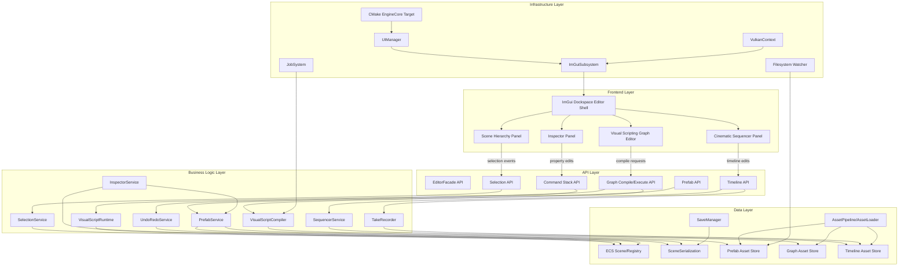
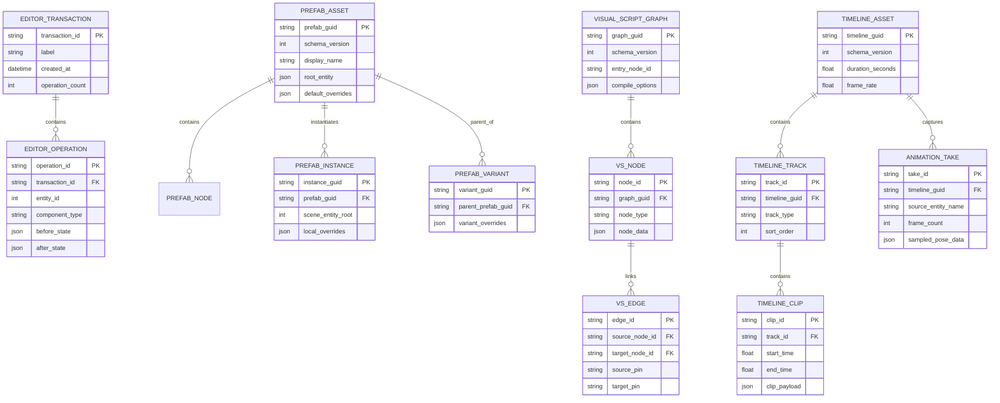
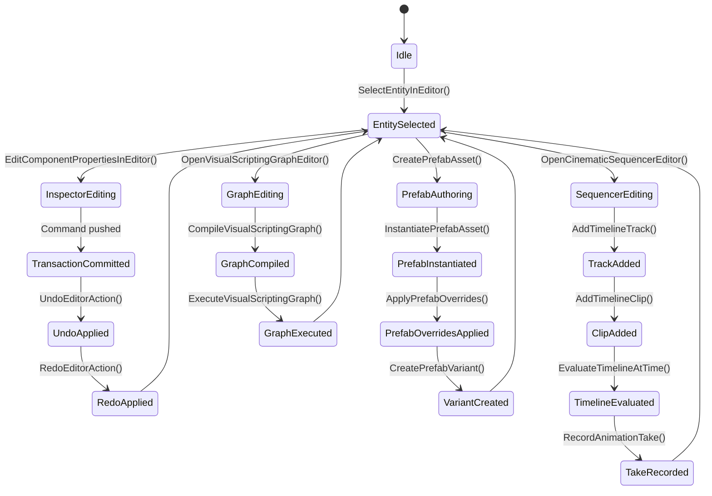

# Phase 21: Editor Foundations, Prefab Workflow & Visual Authoring

## Implementation Plan

---

## Goal

Phase 21 establishes a production-grade in-engine authoring workflow so developers can build scenes, gameplay logic, and cinematics without hardcoding every behavior. The phase introduces a true editor surface (hierarchy + inspector), transactional undo/redo, prefab authoring with variants, visual scripting graph tooling, and a cinematic sequencer with take recording. The implementation is designed to integrate with the current ECS, scene serialization, and UI stack while keeping runtime determinism and save/load fidelity intact. The outcome is a coherent authoring platform where edits are safe, reversible, and portable across projects.

---

## Context Map

### Files to Modify

| File | Purpose | Changes Needed |
|------|---------|----------------|
| `CMakeLists.txt` | EngineCore compile surface | Add all new Phase 21 editor/prefab/graph/sequencer sources to `EngineCore` target |
| `Core/UI/UIManager.h` | Global UI subsystem entrypoint | Add editor-mode lifecycle hooks, editor panel orchestration, and editor draw/update pass integration |
| `Core/UI/UIManager.cpp` | UI frame loop and rendering integration | Wire editor panel rendering order, editor state update, and safe interaction with existing message overlays |
| `Core/UI/ImGuiSubsystem.h` | ImGui integration boundary | Add editor panel toggles, dockspace mode, and panel render callback slots |
| `Core/UI/ImGuiSubsystem.cpp` | ImGui runtime implementation | Implement hierarchy/inspector/sequencer panel hosting and persistent layout support |
| `Core/ECS/Scene.h` | Scene authoring target | Add stable editor entity metadata accessors (display name, selection identity) used by hierarchy/inspector |
| `Core/ECS/Scene.cpp` | Scene operations | Implement helper methods for editor-safe entity traversal, parent-child validation, and deterministic ordering |
| `Core/MCP/SceneSerialization.h` | Scene/prefab schema base | Extend serialization schema for prefab linkage, override metadata, graph assets, and timeline assets |
| `Core/State/SaveManager.h` | Save/load system bridge | Add hooks for editor-authoring asset persistence flows where needed |
| `Core/State/SaveManager.cpp` | Save/load implementation | Ensure prefab/graph/timeline derived assets can be persisted with versioned schema metadata |
| `Core/Editor/*` (new) | New Phase 21 domain | Introduce editor panels, selection model, command stack, prefab services, graph compiler/runtime, and sequencer services |
| `Core/Asset/*` (selected) | Asset handling path | Add prefab, graph, and timeline asset type descriptors and load/cook plumbing |

### Dependencies (may need updates)

| File | Relationship |
|------|--------------|
| `Core/Application.cpp` | Main loop host where editor mode enters per-frame update/render flow |
| `Core/ECS/Components/Components.h` | Shared component include hub used by inspector reflection editors and prefab serialization |
| `Core/Renderer/Mesh.h` + `Core/Renderer/Mesh.cpp` | Inspector and prefab systems may inspect mesh/material references |
| `Core/MCP/MCPAllTools.h` | Optional future bridge if editor actions are exposed to MCP tooling |
| `Core/State/SceneLoader.h` + `.cpp` | Sequencer preview and prefab instantiation can depend on scene state transitions |

### Test Files

| Test | Coverage |
|------|----------|
| `Core/Tests/Editor/EditorCommandStackTests.cpp` (new) | Undo/redo branching, transaction grouping, and deterministic replay |
| `Core/Tests/Editor/PrefabSerializationTests.cpp` (new) | Prefab create/instantiate/override/variant round-trip correctness |
| `Core/Tests/Editor/VisualScriptCompileTests.cpp` (new) | Graph validation, compilation, and deterministic execution semantics |
| `Core/Tests/Editor/SequencerEvaluationTests.cpp` (new) | Timeline track/clip evaluation, blending, and time-scrub determinism |
| `Core/Tests/Integration/EditorAuthoringPipelineTests.cpp` (new) | End-to-end flow: edit -> undo -> prefab -> sequence -> save/load |

### Reference Patterns

| File | Pattern |
|------|---------|
| `Core/UI/ImGuiSubsystem.cpp` | Existing panel rendering and overlay toggle patterns to extend for editor dockspace |
| `Core/UI/UIManager.cpp` | Per-frame lifecycle orchestration and subsystem ownership conventions |
| `Core/MCP/SceneSerialization.h` | JSON schema + component serialization style for new prefab/graph/timeline payloads |
| `Core/State/SaveManager.cpp` | Versioned persistence, checksum validation, and callback-based scene serialization |
| `docs/plans/phase-20-advanced-physics-destruction/implementation-plan.md` | Documentation format, depth, and step/sub-step structure baseline |

### Risk Assessment

- [x] Breaking changes to public API
- [x] Database migrations needed (asset schema version migration rather than RDBMS)
- [x] Configuration changes required (CMake source list and editor build toggles)

---

## Requirements

### Editor Panel Framework (Step 21.1)

- Implement `OpenSceneHierarchyPanel()` to provide entity tree traversal, search/filter, and stable selection sync
- Implement `OpenInspectorPanel()` to provide component-aware property editing with validation and dirty-state tracking
- Implement `SelectEntityInEditor()` to synchronize selection state between hierarchy panel, viewport picking, and inspector
- Implement `EditComponentPropertiesInEditor()` with typed editors, clamped ranges, and transactional command emission
- Add dockable editor shell behavior using existing ImGui subsystem and non-invasive integration with runtime overlays
- Ensure panel interactions do not break runtime input capture semantics already used by `UIManager` and `Application`

### Transactional History & Editor Safety (Step 21.2)

- Implement `UndoEditorAction()` and `RedoEditorAction()` with branch-aware command stack semantics
- Add command grouping (transactions) so compound edits can be undone/redone atomically
- Persist enough command metadata to support deterministic replay during debug sessions
- Ensure undo/redo operations re-trigger dependent editor state updates (selection, inspector refresh, prefab override marks)

### Prefab Authoring & Variant Inheritance (Step 21.3)

- Implement `CreatePrefabAsset()` for selected entity hierarchies with deterministic ID remapping
- Implement `InstantiatePrefabAsset()` for scene insertion with stable prefab instance linkage
- Implement `ApplyPrefabOverrides()` for pushing instance deltas back to base asset safely
- Implement `CreatePrefabVariant()` with parent-child prefab inheritance and override masking
- Add prefab serialization schema versioning and migration support
- Validate nested prefab behavior and circular inheritance guardrails

### Visual Scripting Graph Authoring (Step 21.4)

- Implement `OpenVisualScriptingGraphEditor()` with node palette, graph canvas, pins, links, and metadata panels
- Implement `CompileVisualScriptingGraph()` from editable graph into deterministic executable IR
- Implement `ExecuteVisualScriptingGraph()` in runtime with explicit frame-step semantics
- Add type checking, cycle/validation diagnostics, and compile-time error reporting
- Expose breakpoint/watch instrumentation for graph debugging in editor mode

### Cinematic Sequencer & Take Recording (Step 21.5)

- Implement `OpenCinematicSequencerEditor()` with timeline lanes, transport controls, and scrub interaction
- Implement `AddTimelineTrack()` for camera/animation/audio/event channels
- Implement `AddTimelineClip()` with clip ranges, offsets, easing, and overlap rules
- Implement `EvaluateTimelineAtTime()` for deterministic preview at arbitrary time cursor
- Implement `RecordAnimationTake()` for capturing runtime pose data into timeline clips
- Guarantee playback parity between editor preview and in-game runtime execution

---

## Technical Considerations

### System Architecture Overview



### Technology Stack Selection

| Layer | Technology | Rationale |
|-------|------------|-----------|
| Frontend | Dear ImGui (existing) | Already integrated; fastest path for editor-grade dockable tooling |
| API | C++ service/facade interfaces | Matches engine architecture and avoids external RPC dependency for core editor loop |
| Business Logic | ECS services + command pattern | Natural fit for undo/redo, deterministic changes, and scene-authoring workflows |
| Data | JSON-backed versioned assets (`nlohmann::json`) | Reuses established serialization path (`SceneSerialization.h`, SaveManager callbacks) |
| Infrastructure | Existing Vulkan/UI/JobSystem/CMake stack | Minimizes platform risk by extending already shipping subsystems |

### Integration Points

- **UI Integration:** Extend `UIManager` and `ImGuiSubsystem` to host editor panels while preserving existing debug overlays
- **ECS Integration:** Inspector writes via command objects into ECS components through `Scene`/`Entity` APIs
- **Serialization Integration:** Reuse `SceneSerialization.h` conventions for prefab, graph, and timeline payloads
- **Persistence Integration:** Reuse `SaveManager` callback model to persist editor artifacts consistently
- **Asset Integration:** Route prefab/graph/timeline files through `AssetPipeline` and `AssetLoader` for runtime/editor parity

### Deployment Architecture

```text
Core/
├── Editor/
│   ├── EditorContext.h
│   ├── EditorState.h
│   ├── EditorSelection.h/.cpp
│   ├── Panels/
│   │   ├── SceneHierarchyPanel.h/.cpp
│   │   ├── InspectorPanel.h/.cpp
│   │   ├── VisualScriptingGraphPanel.h/.cpp
│   │   └── SequencerPanel.h/.cpp
│   ├── Commands/
│   │   ├── IEditorCommand.h
│   │   ├── CommandTransaction.h
│   │   ├── CommandStack.h/.cpp
│   │   └── ComponentPropertyCommand.h/.cpp
│   ├── Prefab/
│   │   ├── PrefabAsset.h
│   │   ├── PrefabManager.h/.cpp
│   │   ├── PrefabOverride.h
│   │   └── PrefabVariant.h
│   ├── VisualScripting/
│   │   ├── GraphAsset.h
│   │   ├── GraphCompiler.h/.cpp
│   │   ├── GraphRuntime.h/.cpp
│   │   └── NodeTypeRegistry.h/.cpp
│   └── Sequencer/
│       ├── TimelineAsset.h
│       ├── TimelineTrack.h
│       ├── TimelineClip.h
│       ├── SequencerRuntime.h/.cpp
│       └── TakeRecorder.h/.cpp
├── UI/
│   ├── UIManager.h/.cpp                 # Editor lifecycle integration
│   └── ImGuiSubsystem.h/.cpp            # Dockspace + panel hosting
├── MCP/
│   └── SceneSerialization.h             # Extended schemas for new asset types
└── Asset/
    ├── AssetTypes.h                      # Add Prefab/Graph/Timeline asset kinds
    ├── AssetPipeline.h/.cpp              # Include new artifact build paths
    └── AssetLoader.h/.cpp                # Runtime/editor loading support
```

### Scalability Considerations

- **Hierarchy virtualization:** render only visible rows in large scenes (10k+ entities target)
- **Inspector reflection caching:** avoid rebuilding component metadata every frame
- **Command memory cap:** bounded history with configurable transaction pruning
- **Graph compile batching:** compile graph IR on worker threads and cache artifact hashes
- **Sequencer pre-sampling:** cache sampled curves/clips for smooth scrubbing

---

## Database Schema Design

> This phase does not introduce an RDBMS. The model below defines versioned asset schemas and in-memory indexes that behave like logical tables.

### Editor Authoring Data Model



### Table Specifications

| Logical Table | Critical Fields | Constraints |
|---------------|-----------------|------------|
| `PREFAB_ASSET` | `prefab_guid`, `schema_version`, `root_entity` | GUID unique, schema version required, root entity payload required |
| `PREFAB_INSTANCE` | `instance_guid`, `prefab_guid`, `local_overrides` | Instance GUID unique, parent prefab must exist, override payload optional |
| `VISUAL_SCRIPT_GRAPH` | `graph_guid`, `entry_node_id`, `compile_options` | Graph GUID unique, entry node required for executable graphs |
| `TIMELINE_ASSET` | `timeline_guid`, `duration_seconds`, `frame_rate` | Positive duration and frame rate enforced |
| `EDITOR_OPERATION` | `operation_id`, `before_state`, `after_state` | Operation IDs unique, both states required for undo/redo |

### Indexing Strategy

- `prefab_guid`, `variant_guid`, `graph_guid`, `timeline_guid` are hashed lookup keys
- Track clip retrieval index: `(timeline_guid, start_time, end_time)`
- Undo history index: `(transaction_id, operation_id)` preserving operation order
- Entity mapping index: `(scene_entity_root, instance_guid)` for prefab rebind speed

### Foreign Key Relationships

- `PREFAB_INSTANCE.prefab_guid -> PREFAB_ASSET.prefab_guid`
- `PREFAB_VARIANT.parent_prefab_guid -> PREFAB_ASSET.prefab_guid`
- `VS_NODE.graph_guid -> VISUAL_SCRIPT_GRAPH.graph_guid`
- `TIMELINE_TRACK.timeline_guid -> TIMELINE_ASSET.timeline_guid`
- `TIMELINE_CLIP.track_id -> TIMELINE_TRACK.track_id`

### Database Migration Strategy

- Embed `schema_version` in every serialized asset payload
- Maintain migration adapters per asset type (`Prefab`, `Graph`, `Timeline`)
- Apply forward migrations at load time and rewrite canonical latest schema on save
- Store migration provenance in editor logs to simplify regression triage

---

## API Design

### Editor Runtime API Surface (C++)

```cpp
namespace Core::Editor {

struct EditorContext;
struct EntitySelectionState;
struct PropertyEditRequest;
struct PropertyEditResult;

// Step 21.1
void OpenSceneHierarchyPanel(EditorContext& ctx);
void OpenInspectorPanel(EditorContext& ctx);
bool SelectEntityInEditor(EditorContext& ctx, entt::entity entity, const char* source);
PropertyEditResult EditComponentPropertiesInEditor(EditorContext& ctx, const PropertyEditRequest& req);

// Step 21.2
bool UndoEditorAction(EditorContext& ctx);
bool RedoEditorAction(EditorContext& ctx);

// Step 21.3
Result<std::string> CreatePrefabAsset(EditorContext& ctx, entt::entity rootEntity, std::string_view outputPath);
Result<entt::entity> InstantiatePrefabAsset(EditorContext& ctx, std::string_view prefabGuid, const SpawnOptions& options);
Result<void> ApplyPrefabOverrides(EditorContext& ctx, std::string_view instanceGuid);
Result<std::string> CreatePrefabVariant(EditorContext& ctx, std::string_view parentPrefabGuid, const VariantOptions& options);

// Step 21.4
void OpenVisualScriptingGraphEditor(EditorContext& ctx, std::string_view graphGuid);
Result<CompiledGraphIR> CompileVisualScriptingGraph(EditorContext& ctx, std::string_view graphGuid);
Result<void> ExecuteVisualScriptingGraph(EditorContext& ctx, std::string_view graphGuid, ExecutionMode mode);

// Step 21.5
void OpenCinematicSequencerEditor(EditorContext& ctx, std::string_view timelineGuid);
Result<std::string> AddTimelineTrack(EditorContext& ctx, std::string_view timelineGuid, TrackType type, std::string_view displayName);
Result<std::string> AddTimelineClip(EditorContext& ctx, std::string_view trackId, const TimelineClipCreateInfo& clipInfo);
Result<TimelineEvaluationResult> EvaluateTimelineAtTime(EditorContext& ctx, std::string_view timelineGuid, float timeSeconds);
Result<std::string> RecordAnimationTake(EditorContext& ctx, std::string_view timelineGuid, entt::entity sourceEntity, const TakeRecordOptions& options);

} // namespace Core::Editor
```

### Request/Response Contracts (Editor Tooling JSON Types)

```ts
type SelectEntityRequest = {
  entityId: number;
  source: "hierarchy" | "viewport" | "inspector";
};

type EditComponentPropertyRequest = {
  entityId: number;
  componentType: string;
  propertyPath: string;
  value: unknown;
  transactionLabel?: string;
};

type CreatePrefabRequest = {
  rootEntityId: number;
  outputPath: string;
  includeChildren: boolean;
};

type TimelineClipCreateRequest = {
  trackId: string;
  startTime: number;
  endTime: number;
  clipType: "animation" | "audio" | "camera" | "event";
  payload: Record<string, unknown>;
};
```

### Authentication and Authorization

- Local in-editor APIs are process-local and do not require user auth tokens
- If routed through MCP/remote tooling, enforce capability checks through existing MCP validation path (`ActionValidator`)
- Define authorization scopes:
  - `editor.read` (query scene/editor state)
  - `editor.write` (mutate scene/components)
  - `editor.asset.write` (prefab/graph/timeline file writes)
- Disallow destructive write operations when runtime safety lock is enabled

### Error Handling Strategies

| Error Code | Scenario | Strategy |
|-----------|----------|----------|
| `Editor.InvalidEntity` | Selection/property edit for stale entity | Reject and refresh hierarchy selection state |
| `Editor.ComponentMissing` | Edit requested for absent component | Return explicit error + inspector reload hint |
| `Editor.CommandStackEmpty` | Undo/redo with no available command | No-op with explicit status message |
| `Prefab.CircularVariant` | Variant parent chain loops | Abort creation and report full parent chain |
| `Graph.TypeMismatch` | Link pin types incompatible | Mark edge invalid with compile diagnostic |
| `Timeline.InvalidRange` | Clip end before start | Reject clip and keep track unchanged |

### Rate Limiting and Caching

- Debounce inspector value-change events before command emission (e.g., drag edits)
- Cache hierarchy flattening results per frame and invalidate only on structural changes
- Cache component reflection metadata by type hash
- Cache compiled visual script IR by graph content hash
- Cache timeline evaluated channels for scrubbing windows

---

## Frontend Architecture

### Component Hierarchy Documentation

```text
Editor Workspace
├── Main Dockspace (ImGui dock node)
│   ├── Scene Hierarchy Panel
│   │   ├── Search Bar
│   │   ├── Entity Tree View
│   │   └── Context Menu (create/delete/duplicate/prefab actions)
│   ├── Inspector Panel
│   │   ├── Selected Entity Header
│   │   ├── Component Foldout List
│   │   ├── Property Editors (typed)
│   │   └── Add Component Menu
│   ├── Visual Scripting Panel
│   │   ├── Node Palette
│   │   ├── Graph Canvas
│   │   ├── Node Inspector
│   │   └── Compile/Run Toolbar
│   └── Sequencer Panel
│       ├── Timeline Header + Transport
│       ├── Track List
│       ├── Clip Lanes
│       └── Playback/Scrub Controls
├── Editor Command History (Undo/Redo stack visualization)
└── Asset Browser (Prefab/Graph/Timeline assets)
```

### State Flow Diagram



### Reusable Component Library Specifications

| UI Element | Reuse Strategy |
|-----------|-----------------|
| Typed property row | Shared inspector widget for numeric/bool/string/vector edits |
| Search-filter toolbar | Shared between hierarchy, graph node palette, and asset browser |
| Track lane renderer | Shared for animation/audio/event tracks with pluggable clip renderer |
| Command status banner | Shared status surface for undo/redo/compile diagnostics |
| Validation badge | Common warning/error indicator used by inspector, graph, sequencer |

### State Management Patterns

- Central `EditorContext` object owning panel state + transient interaction state
- Immutable command payloads for history safety
- Event bus between panel modules (`SelectionChanged`, `PropertyEdited`, `AssetSaved`, `TimelineScrubbed`)
- Deterministic update order each frame:
  1. Input capture
  2. Panel interaction
  3. Command emission
  4. ECS/data mutation
  5. Panel redraw

### Type Definitions (C++)

```cpp
struct EditorContext {
    ECS::Scene* ActiveScene = nullptr;
    EditorSelectionState Selection;
    CommandStack History;
    PrefabManager Prefabs;
    VisualScriptGraphRuntime Graphs;
    SequencerRuntime Sequencer;
    bool IsPlayMode = false;
};

struct PropertyEditRequest {
    entt::entity Entity = entt::null;
    std::string ComponentType;
    std::string PropertyPath;
    Json NewValue;
    std::string TransactionLabel;
};
```

---

## Security & Performance

### Authentication and Authorization Requirements

- Restrict destructive editor APIs behind explicit edit-mode toggles
- Gate remote/editor-automation invocations via MCP capability checks when exposed
- Maintain immutable audit log of command transactions in debug builds

### Data Validation and Sanitization

- Validate all asset output paths (deny traversal outside project root)
- Validate property writes against reflected type/range metadata
- Validate graph compile input (no dangling pins, type mismatch, invalid entry nodes)
- Validate sequencer clip ranges and track compatibility before commit

### Performance Optimization Strategies

- Use virtualized hierarchy rendering for large scenes
- Use dirty flags to skip inspector rebuild when selection/components unchanged
- Batch graph canvas layout calculations only when graph topology changes
- Precompute timeline clip lookup buckets by time range for fast scrubbing

### Caching Mechanisms

- Component metadata cache (type hash -> editor descriptor)
- Prefab dependency cache (asset GUID -> dependency list)
- Compiled graph cache (graph hash -> executable IR)
- Timeline evaluation cache (timeline GUID + time bucket -> evaluated channels)

---

## Detailed Step Breakdown

### Step 21.1: Editor Panel Framework

#### Sub-step 21.1.1: Editor Core Scaffolding (v0.21.1.1)
- Create `Core/Editor/EditorContext.h` and `Core/Editor/EditorState.h`
- Define editor mode lifecycle (`Initialize`, `Update`, `Render`, `Shutdown`)
- Add explicit separation between runtime-only and editor-only update paths
- **Deliverable**: Stable editor context foundation

#### Sub-step 21.1.2: `OpenSceneHierarchyPanel()` (v0.21.1.2)
- Create `Core/Editor/Panels/SceneHierarchyPanel.h/.cpp`
- Render tree from ECS + `HierarchyComponent` with stable ordering
- Implement search/filter and collapse state persistence
- **Deliverable**: Interactive scene hierarchy panel

#### Sub-step 21.1.3: `OpenInspectorPanel()` (v0.21.1.3)
- Create `Core/Editor/Panels/InspectorPanel.h/.cpp`
- Build component foldouts using typed property editors
- Support add/remove component actions with safety checks
- **Deliverable**: Fully functional inspector panel

#### Sub-step 21.1.4: `SelectEntityInEditor()` (v0.21.1.4)
- Implement shared selection service in `Core/Editor/EditorSelection.h/.cpp`
- Sync selection from hierarchy panel, viewport picking, and inspector context
- Emit `SelectionChanged` events for dependent panels
- **Deliverable**: Unified editor entity selection

#### Sub-step 21.1.5: `EditComponentPropertiesInEditor()` (v0.21.1.5)
- Implement typed property write pipeline from inspector controls
- Validate value ranges/types before commit
- Route edits through command stack transaction API
- **Deliverable**: Safe property editing pipeline

#### Sub-step 21.1.6: Reflection Metadata Registry (v0.21.1.6)
- Add component editor metadata descriptors (name, category, editor widget type, constraints)
- Cache descriptors by component type hash
- Provide extension hook for future component-specific custom drawers
- **Deliverable**: Inspector reflection registry

#### Sub-step 21.1.7: Hierarchy Virtualization (v0.21.1.7)
- Flatten visible tree nodes each frame using expansion state
- Render only visible rows for large scenes
- Add row-level context menu actions (rename, duplicate, delete)
- **Deliverable**: Scalable hierarchy rendering

#### Sub-step 21.1.8: Multi-Select + Inspector Lock (v0.21.1.8)
- Add additive/range selection modes
- Implement lock mode to pin inspector to prior selection
- Support batch edits on compatible component/property sets
- **Deliverable**: Advanced selection UX

#### Sub-step 21.1.9: Viewport Selection Bridge (v0.21.1.9)
- Introduce entity pick callback bridge from render/viewport layer
- Resolve clicked entity -> hierarchy node reveal + inspector focus
- Guard against stale entity handles after scene mutations
- **Deliverable**: Viewport-to-editor selection bridge

#### Sub-step 21.1.10: Docking Layout Persistence (v0.21.1.10)
- Persist panel docking/layout presets per project
- Support layout reset and corruption recovery
- Integrate persistence into UI init/shutdown cycle
- **Deliverable**: Stable editor layout persistence

---

### Step 21.2: Transactional Undo/Redo

#### Sub-step 21.2.1: Command Interface & Transaction Model (v0.21.2.1)
- Create `Core/Editor/Commands/IEditorCommand.h`
- Define `Apply()` and `Revert()` contracts with deterministic behavior
- Add `CommandTransaction` aggregate wrapper
- **Deliverable**: Command system contracts

#### Sub-step 21.2.2: Command Stack Implementation (v0.21.2.2)
- Implement `CommandStack.h/.cpp` with bounded undo/redo stacks
- Add transaction labels and timestamps for debugging
- Support branch reset when new command is pushed after undo
- **Deliverable**: Functional command history stack

#### Sub-step 21.2.3: `UndoEditorAction()` (v0.21.2.3)
- Implement `UndoEditorAction(EditorContext&)`
- Pop and revert last transaction atomically
- Emit post-undo refresh events to hierarchy/inspector/prefab systems
- **Deliverable**: Undo action API

#### Sub-step 21.2.4: `RedoEditorAction()` (v0.21.2.4)
- Implement `RedoEditorAction(EditorContext&)`
- Reapply transaction from redo branch
- Preserve deterministic operation ordering and event emission
- **Deliverable**: Redo action API

#### Sub-step 21.2.5: Property Snapshot Diff Commands (v0.21.2.5)
- Implement generic component property diff command
- Store before/after values for nested fields and arrays
- Minimize payload by recording touched property paths only
- **Deliverable**: Component diff command support

#### Sub-step 21.2.6: Structural Commands (v0.21.2.6)
- Add commands for entity create/delete/duplicate/reparent
- Ensure hierarchy and selection are restored correctly on undo
- Validate against invalid parent-child loops on reparent operations
- **Deliverable**: Structural scene edit commands

#### Sub-step 21.2.7: History Serialization Hooks (v0.21.2.7)
- Add optional history snapshot export for debugging sessions
- Include operation metadata without requiring full scene dump
- Keep feature editor-only and disabled in shipping runtime
- **Deliverable**: Command history diagnostics

#### Sub-step 21.2.8: Command History UI (v0.21.2.8)
- Add compact history panel in editor shell
- Show transaction labels, counts, and current stack cursor
- Allow jump-to-state in debug mode
- **Deliverable**: Visual undo/redo introspection panel

---

### Step 21.3: Prefab Authoring and Variants

#### Sub-step 21.3.1: Prefab Asset Schema (v0.21.3.1)
- Define prefab asset JSON schema + version field
- Include root graph, component payloads, and stable local IDs
- Document override patch format (`path`, `op`, `value`)
- **Deliverable**: Versioned prefab schema

#### Sub-step 21.3.2: `CreatePrefabAsset()` (v0.21.3.2)
- Implement extraction of selected entity subtree into prefab payload
- Normalize scene-specific IDs to prefab-local stable IDs
- Write prefab asset to project content path with validation
- **Deliverable**: Prefab creation API

#### Sub-step 21.3.3: `InstantiatePrefabAsset()` (v0.21.3.3)
- Implement prefab instantiation into active scene
- Rebuild entity hierarchy with new runtime IDs + mapping table
- Attach `PrefabInstanceComponent` metadata for linkage tracking
- **Deliverable**: Prefab instantiation API

#### Sub-step 21.3.4: Override Tracking (v0.21.3.4)
- Detect local changes on prefab instances through command stream
- Record per-instance override operations by property path
- Surface override badges in inspector and hierarchy
- **Deliverable**: Prefab override tracker

#### Sub-step 21.3.5: `ApplyPrefabOverrides()` (v0.21.3.5)
- Implement safe apply flow from instance overrides back to base prefab
- Validate conflicting overrides across multiple instances
- Rebuild derived instances after successful apply
- **Deliverable**: Override apply API

#### Sub-step 21.3.6: Variant Inheritance Schema (v0.21.3.6)
- Define `PrefabVariant` payload with parent GUID + delta patch set
- Add inheritance resolution order and conflict semantics
- Add schema rules preventing parent self-reference
- **Deliverable**: Prefab variant data model

#### Sub-step 21.3.7: `CreatePrefabVariant()` (v0.21.3.7)
- Implement variant authoring from selected base prefab
- Store only delta from parent prefab baseline
- Register variant in asset index and inspector references
- **Deliverable**: Prefab variant creation API

#### Sub-step 21.3.8: Nested Prefab Support (v0.21.3.8)
- Support prefab children that reference other prefabs
- Resolve nested expansion order during instantiate/apply flows
- Detect and block circular nested dependency graphs
- **Deliverable**: Nested prefab support

#### Sub-step 21.3.9: Live Reload & Propagation (v0.21.3.9)
- Add file-watch driven prefab reload in editor mode
- Propagate base prefab edits to open instances and variants
- Preserve local overrides while rebasing inherited values
- **Deliverable**: Live prefab reload workflow

#### Sub-step 21.3.10: Prefab Validation/Test Harness (v0.21.3.10)
- Add round-trip serializer tests for prefab + variant assets
- Add deterministic hash checks on repeated save operations
- Add corrupted asset fallback diagnostics
- **Deliverable**: Prefab reliability test coverage

---

### Step 21.4: Visual Scripting Graph Toolchain

#### Sub-step 21.4.1: Graph Asset Model (v0.21.4.1)
- Define graph/node/edge schemas with versioning
- Add node category metadata and editor color/icon hints
- Add explicit entry node and execution domain tags
- **Deliverable**: Visual script graph schema

#### Sub-step 21.4.2: `OpenVisualScriptingGraphEditor()` (v0.21.4.2)
- Implement graph panel with canvas, pan/zoom, and selection
- Add node palette search and drag-drop node creation
- Add graph inspector panel for node properties
- **Deliverable**: Graph editor UI

#### Sub-step 21.4.3: Node/Pin Authoring UX (v0.21.4.3)
- Implement pin creation, edge linking, and unlinking interactions
- Enforce directional connection rules (exec/data pins)
- Provide inline validation badges for invalid links
- **Deliverable**: Robust graph editing interactions

#### Sub-step 21.4.4: Type System and Validation (v0.21.4.4)
- Add node pin type registry and coercion rules
- Validate unresolved references, type mismatches, and dead entry paths
- Emit diagnostics with source node/edge context
- **Deliverable**: Graph static validator

#### Sub-step 21.4.5: `CompileVisualScriptingGraph()` (v0.21.4.5)
- Convert graph topology into execution-order intermediate representation
- Resolve constant tables and parameter bindings
- Generate compile report with warnings/errors and cache key
- **Deliverable**: Graph compiler API

#### Sub-step 21.4.6: Runtime VM/Executor Core (v0.21.4.6)
- Implement graph executor state, stack, and event queue
- Support deterministic single-frame stepping
- Add safe abort on runaway graph execution
- **Deliverable**: Graph execution runtime core

#### Sub-step 21.4.7: `ExecuteVisualScriptingGraph()` (v0.21.4.7)
- Implement execution entrypoint for runtime/editor contexts
- Support trigger modes (`OnStart`, `OnEvent`, `Manual`)
- Bind graph outputs to ECS/component/property update hooks
- **Deliverable**: Graph execute API

#### Sub-step 21.4.8: Debugger Instrumentation (v0.21.4.8)
- Add breakpoints, step-over, and watch value inspection
- Persist debug breakpoints per graph asset
- Integrate debugger output into editor status panel
- **Deliverable**: Visual scripting debugger

#### Sub-step 21.4.9: ECS/Event Integration (v0.21.4.9)
- Bridge graph events to gameplay/event bus triggers
- Add bindings for common ECS operations (spawn, modify, signal)
- Ensure thread-safe queueing for cross-system operations
- **Deliverable**: Graph-to-engine integration layer

#### Sub-step 21.4.10: Compile Cache & Incremental Rebuild (v0.21.4.10)
- Hash graph content for incremental compilation
- Recompile only affected subgraphs on edit
- Add cache invalidation on node type schema updates
- **Deliverable**: Incremental graph build pipeline

---

### Step 21.5: Cinematic Sequencer and Take Recording

#### Sub-step 21.5.1: Timeline Data Model (v0.21.5.1)
- Define timeline/track/clip schemas and clip payload variants
- Add timeline frame-rate and duration normalization rules
- Add schema version/migration metadata
- **Deliverable**: Sequencer data model

#### Sub-step 21.5.2: `OpenCinematicSequencerEditor()` (v0.21.5.2)
- Implement sequencer panel with transport, timeline ruler, and lane view
- Add playback modes (play/pause/loop) and frame-step controls
- Add time cursor and snapping controls
- **Deliverable**: Sequencer editor UI

#### Sub-step 21.5.3: `AddTimelineTrack()` (v0.21.5.3)
- Implement track creation by type (`Camera`, `Animation`, `Audio`, `Event`)
- Add track reorder/mute/solo controls
- Validate track type compatibility with timeline target
- **Deliverable**: Timeline track authoring API

#### Sub-step 21.5.4: `AddTimelineClip()` (v0.21.5.4)
- Implement clip insertion with start/end range and payload metadata
- Support drag, trim, split, and overlap policies
- Emit clip edit commands for undo/redo integration
- **Deliverable**: Timeline clip authoring API

#### Sub-step 21.5.5: `EvaluateTimelineAtTime()` (v0.21.5.5)
- Implement deterministic evaluation of all active tracks at a given time
- Blend overlapping clip outputs using track-specific blend rules
- Return structured evaluation result for preview/runtime systems
- **Deliverable**: Timeline evaluation API

#### Sub-step 21.5.6: Clip Blending & Easing (v0.21.5.6)
- Add easing curve library for clip transitions
- Support additive/override blend modes per track type
- Add conflict diagnostics for invalid blend configurations
- **Deliverable**: Sequencer blending engine

#### Sub-step 21.5.7: Camera Track Runtime (v0.21.5.7)
- Implement camera cut track and transform interpolation track
- Add FOV and post-process keyframe channels
- Sync active camera updates with existing camera system
- **Deliverable**: Camera sequencer runtime path

#### Sub-step 21.5.8: Animation/Audio/Event Track Runtime (v0.21.5.8)
- Implement animation clip binding to animator components
- Implement audio cue trigger/stop behavior
- Implement event marker dispatch for gameplay hooks
- **Deliverable**: Multi-track runtime playback support

#### Sub-step 21.5.9: `RecordAnimationTake()` (v0.21.5.9)
- Implement sampled pose capture from selected animated entity
- Write captured frames into timeline clip asset format
- Add start/stop record controls and overwrite/append modes
- **Deliverable**: Animation take recording API

#### Sub-step 21.5.10: Preview Caching (v0.21.5.10)
- Cache sampled channels for smooth scrub response
- Invalidate cache only on affected track/clip edits
- Add perf metrics for cache hit/miss in editor stats
- **Deliverable**: Sequencer preview performance cache

#### Sub-step 21.5.11: Save/Load Parity (v0.21.5.11)
- Ensure timeline assets serialize consistently with scene/prefab references
- Validate editor preview == runtime playback for same timeline/time input
- Add load-time migration for legacy timeline payloads
- **Deliverable**: Runtime/editor parity guarantee for sequencer assets

---

## Dependencies

### External Libraries

- `imgui` (already integrated) for editor panel rendering
- `nlohmann_json` for asset schema serialization
- `EnTT` for ECS traversal and component editing
- `SDL3` + `Vulkan` stack for editor input/render hosting

### Internal Dependencies

- `Core/UI/UIManager.*`
- `Core/UI/ImGuiSubsystem.*`
- `Core/ECS/Scene.*`
- `Core/ECS/Entity.*`
- `Core/MCP/SceneSerialization.h`
- `Core/State/SaveManager.*`
- `Core/Asset/AssetPipeline.*`
- `Core/Asset/AssetLoader.*`

### Integration Requirements

- Add Phase 21 source files to `EngineCore` target in `CMakeLists.txt`
- Keep editor features disabled when editor mode flag is off
- Preserve existing runtime behavior when no editor panels are active

---

## Testing Strategy

### Unit Tests

- Command stack correctness (`push`, `undo`, `redo`, branch reset)
- Property edit validation and type safety for inspector edits
- Prefab schema round-trip and override patch application
- Graph compiler validation and deterministic IR output
- Timeline clip evaluation and blend/easing correctness

### Integration Tests

- End-to-end workflow:
  1. Create entity hierarchy
  2. Edit properties in inspector
  3. Undo/redo edits
  4. Create and instantiate prefab
  5. Author graph and execute
  6. Author timeline and evaluate
  7. Save/reload scene and assets
- Validate no regression to existing UI overlays and application input handling

### Performance Tests

- Hierarchy panel frame time with 1k/10k/50k entities
- Inspector responsiveness under rapid slider edits
- Graph compile latency for small/medium/large graphs
- Sequencer scrub latency with dense clip tracks

### Manual Validation Matrix

- Editor input capture (keyboard/mouse focus handoff)
- Multi-selection edit behavior
- Prefab variant inheritance conflict scenarios
- Sequencer preview/runtime parity checks

---

## Risk Mitigation

| Risk | Impact | Mitigation |
|------|--------|------------|
| Editor panel logic destabilizes runtime loop | High | Gate Phase 21 features behind explicit editor mode and isolate panel update path |
| Undo/redo corruption after structural scene edits | High | Use transaction boundaries + invariant checks after each apply/revert |
| Prefab override drift over time | High | Canonicalize patch paths and run diff validation before save/apply |
| Visual graph execution nondeterminism | Medium | Deterministic scheduler + fixed order event queue + replay tests |
| Sequencer track interactions become expensive | Medium | Pre-index clips and cache channel samples for scrubbing |

---

## Milestones

1. **v0.21.1.x** - Editor panel foundation (hierarchy/inspector/selection/property editing)
2. **v0.21.2.x** - Transactional history (undo/redo + command system)
3. **v0.21.3.x** - Prefab and variant pipeline
4. **v0.21.4.x** - Visual scripting authoring + compile/execute runtime
5. **v0.21.5.x** - Sequencer authoring + timeline evaluation + take recording

---

## References

- `engine_roadmap.md` (Phase 21 section, Step 21.1 - Step 21.5)
- `docs/plans/phase-20-advanced-physics-destruction/implementation-plan.md` (format/style precedent)
- `Core/UI/UIManager.h` + `Core/UI/UIManager.cpp` (UI orchestration pattern)
- `Core/UI/ImGuiSubsystem.h` + `Core/UI/ImGuiSubsystem.cpp` (panel rendering and input ownership)
- `Core/MCP/SceneSerialization.h` (schema and serialization patterns)
- `Core/State/SaveManager.h` + `Core/State/SaveManager.cpp` (persistence and versioning patterns)

<!-- release-doc-sync:2026-04-15 -->

## Release Sync (2026-04-15)

- Verified clean Release rebuild: `cmake --build build --config Release --target ALL_BUILD --clean-first -- /m /nologo /verbosity:minimal`.
- Verified Release test sweep: `ctest --test-dir build -C Release` (**18/18 passed**).
- Confirmed executable composition: `AIGameEngine` links `EngineCore`, and `EngineCore` includes `Core/MCP/HttpServer.cpp` + `Core/MCP/MCPServer.cpp`.
- Runtime MCP integration is now enabled in `Core::Application` by default; runtime flags: `--disable-mcp`, `--mcp-host=<host>`, `--mcp-port=<port>`.
