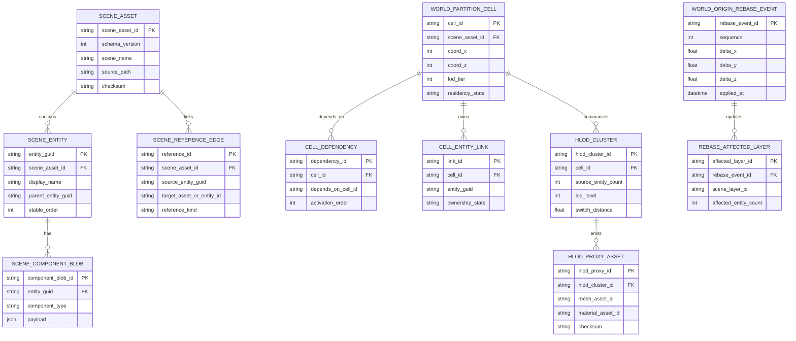
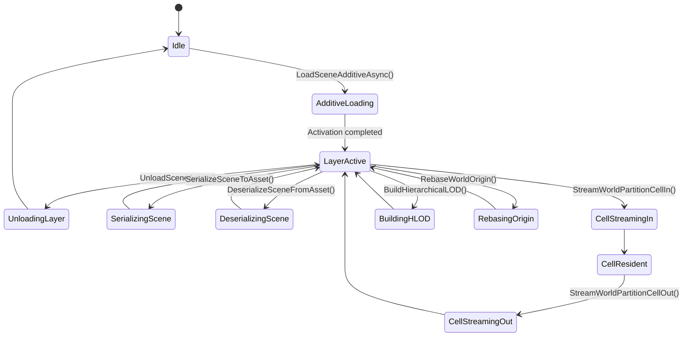

# Phase 22: Scene Serialization, Streaming & Open-World Runtime

## Implementation Plan

---

## Goal

Phase 22 upgrades the engine from single-scene loading and partial context dumping into a full multi-scene runtime with large-world streaming semantics. The implementation adds additive scene lifecycle APIs, complete scene-to-asset round-trip persistence, and world partition cell control that can stream content in and out under strict memory budgets. It also introduces hierarchical LOD generation and world-origin rebasing so large coordinates remain stable for rendering, physics, and multiplayer replication. The outcome is a production-ready open-world foundation where scene composition, persistence fidelity, and runtime streaming behavior are deterministic and tooling-friendly.

---

## Context Map

### Files to Modify

| File | Purpose | Changes Needed |
|------|---------|----------------|
| `CMakeLists.txt` | Engine compile surface | Add new Stage 22 runtime/serialization/partitioning modules to `EngineCore` |
| `Core/State/SceneLoader.h` | Scene loading contract | Add additive load/unload API contracts, layer handles, and async completion/cancellation semantics |
| `Core/State/SceneLoader.cpp` | Scene loader implementation | Implement additive load queue, staged activation, dependency-aware unload, and callback ordering guarantees |
| `Core/State/SaveManager.h` | Persistence bridge | Add scene-asset persistence entrypoints and callback contracts aligned with full-scene serialization |
| `Core/State/SaveManager.cpp` | Save/load orchestration | Route full scene asset serialization/deserialization through versioned schema contracts |
| `Core/MCP/SceneSerialization.h` | Scene schema baseline | Extend from current serialize-focused helpers to full asset round-trip with reference remapping metadata |
| `Core/Asset/AssetTypes.h` | Asset taxonomy | Add explicit scene/world-partition/HLOD asset kinds and schema/version metadata fields |
| `Core/Asset/AssetPipeline.h` | Dependency and cook orchestration | Add scene-cell and HLOD cook graph interfaces for partition-aware dependency hydration |
| `Core/Asset/AssetPipeline.cpp` | Dependency graph runtime | Implement topological dependency hydration path for streamed cell activation/deactivation |
| `Core/Asset/AssetLoader.h` | Runtime asset loading | Add async scene/cell/HLOD payload load helpers and stream handles for partitioned payloads |
| `Core/Asset/AssetLoader.cpp` | Runtime asset loading implementation | Add validated path loading and chunked payload reads for world partition cells |
| `Core/ECS/Systems/TerrainSystem.h` | Existing chunk streaming precedent | Add hooks/interfaces for partition cell residency and HLOD proxy handoff |
| `Core/ECS/Systems/TerrainSystem.cpp` | Runtime chunk lifecycle | Integrate cell residency ownership, unload budget enforcement, and distant-representation switching |
| `Core/ECS/Components/TerrainComponent.h` | Terrain + LOD config | Add HLOD build parameters and partition sizing metadata |
| `Core/Renderer/Terrain/TerrainChunk.h` | Chunk data model | Add partition cell ownership ID and HLOD proxy linkage metadata |
| `Core/Network/ServerReplicationSystem.h` | Multiplayer transform replication | Add world-origin offset awareness to replication serialization path |
| `Core/Network/ServerReplicationSystem.cpp` | Replication implementation | Apply/reverse origin offsets during send/receive and interest-management checks |
| `Core/Network/NetworkPackets.h` | Packet payload schema | Add optional world-origin sequence/version metadata for rebase-safe replication |
| `Core/Physics/PhysicsWorld.h` | Physics integration boundary | Add explicit world-shift API to remap active bodies during origin rebase |
| `Core/Physics/PhysicsWorld.cpp` | Physics world implementation | Apply rebase offsets to body transforms/constraints while preserving velocity state |
| `Core/World/*` (new) | Stage 22 domain | Add scene-layer runtime, partition runtime, HLOD builder, and world-origin rebase coordinator |
| `Core/UI/ImGuiSubsystem.h` | Runtime tooling UI | Add optional streaming diagnostics model (loaded layers, loaded cells, budgets) |
| `Core/UI/ImGuiSubsystem.cpp` | Runtime tooling UI implementation | Add debug panel to inspect/additive layers, cell residency, and rebase history |

### Dependencies (may need updates)

| File | Relationship |
|------|--------------|
| `Core/State/TransitionManager.h` + `.cpp` | Transition flow already calls `SceneLoader::LoadSceneAsync`; additive flow should remain compatible |
| `Core/Application.h` + `.cpp` | Main-loop update ordering for async load completion, streaming updates, and rebase application |
| `Core/JobSystem/JobSystem.h` + `.cpp` | Background deserialization, dependency hydration, and HLOD generation scheduling |
| `Core/ECS/Scene.h` + `.cpp` | Entity creation/destruction and registry traversal for full scene reconstruction |
| `Core/ECS/Entity.h` | Entity-level component access patterns used during scene rehydration |
| `Core/ECS/Components/NetworkTransformComponent.h` | Replication thresholds/state impacted by world-origin shifts |
| `Core/Asset/AssetManifest.h` + `.cpp` | Manifest versioning and cooked-path indexing for new scene/cell assets |
| `Core/Renderer/Terrain/TerrainGenerator.h` + `.cpp` | Existing LOD generation path to leverage for HLOD source preparation |

### Test Files

| Test | Coverage |
|------|----------|
| `Core/Tests/State/SceneLoaderAdditiveTests.cpp` (new) | `LoadSceneAdditiveAsync()` layered activation order and callback guarantees |
| `Core/Tests/State/SceneLoaderUnloadTests.cpp` (new) | `UnloadSceneAsync()` dependency-aware teardown and cancellation safety |
| `Core/Tests/Serialization/SceneAssetSerializeTests.cpp` (new) | `SerializeSceneToAsset()` schema completeness and deterministic output ordering |
| `Core/Tests/Serialization/SceneAssetDeserializeTests.cpp` (new) | `DeserializeSceneFromAsset()` entity/component/reference reconstruction fidelity |
| `Core/Tests/WorldStreaming/PartitionCellInTests.cpp` (new) | `StreamWorldPartitionCellIn()` dependency hydration and residency bookkeeping |
| `Core/Tests/WorldStreaming/PartitionCellOutTests.cpp` (new) | `StreamWorldPartitionCellOut()` budget enforcement and ownership transfer |
| `Core/Tests/WorldStreaming/HLODBuilderTests.cpp` (new) | `BuildHierarchicalLOD()` proxy generation correctness and distance-tier assignment |
| `Core/Tests/WorldStreaming/WorldOriginRebaseTests.cpp` (new) | `RebaseWorldOrigin()` transform/physics/network remap correctness |
| `Core/Tests/Integration/Stage22SceneRoundTripTests.cpp` (new) | Scene serialize -> deserialize -> streaming integration parity |
| `Core/Tests/Integration/Stage22OpenWorldRuntimeTests.cpp` (new) | Additive layers + partition stream + HLOD + rebase end-to-end behavior |

### Reference Patterns

| File | Pattern |
|------|---------|
| `Core/State/SceneLoader.cpp` | Existing async load/cancel/update lifecycle and progress reporting model |
| `Core/State/SaveManager.cpp` | Callback-driven scene persistence bridge with version/checksum handling |
| `Core/MCP/SceneSerialization.h` | Current component JSON schema style and entity traversal conventions |
| `Core/Asset/AssetPipeline.cpp` | Dependency graph and topological ordering model for staged hydration |
| `Core/Asset/AssetLoader.cpp` | Validated path loading and stream-handle model for large payloads |
| `Core/ECS/Systems/TerrainSystem.cpp` | Existing chunk queue/load/upload/unload lifecycle and memory cap behavior |
| `Core/Network/ServerReplicationSystem.cpp` | Transform packet serialization and interest-management logic to preserve during rebasing |
| `docs/plans/phase-21-editor-foundations-prefab-workflow-visual-authoring/implementation-plan.md` | Documentation structure and level of detail baseline |

### Risk Assessment

- [x] Breaking changes to public API
- [x] Database migrations needed (logical scene schema + partition metadata schema versioning)
- [x] Configuration changes required (CMake module graph and optional runtime diagnostics toggles)

---

## Requirements

### Additive Scene Streaming Runtime (Step 22.1)

- Implement `LoadSceneAdditiveAsync()` with staged prefetch, async deserialization, and non-blocking activation into a scene-layer registry
- Implement `UnloadSceneAsync()` with dependency-aware release ordering, lifecycle callbacks, and cancellation-safe teardown
- Preserve compatibility with existing `LoadSceneAsync()`, transition flow, and progress reporting APIs
- Provide explicit scene layer handles/IDs for deterministic load/unload control and tooling visibility
- Ensure activation ordering is deterministic across repeated runs with identical inputs
- Prevent duplicate additive loads of the same layer unless explicit reload policy is requested

### Scene Persistence Round-Trip (Step 22.2)

- Implement `SerializeSceneToAsset()` for full scene asset authoring (entities, components, hierarchy, references, metadata)
- Implement `DeserializeSceneFromAsset()` for full reconstruction of entities/components/references into runtime scene state
- Extend current `SceneSerialization` helpers to include full reconstruction metadata (stable IDs, parent graph, cross-asset refs)
- Add schema versioning and migration hooks for forward compatibility
- Guarantee deterministic serialization ordering for source control diff stability and reproducible artifact generation
- Integrate scene-asset save/load with `SaveManager` callback surfaces and `AssetPipeline` cook path

### Open-World Partition and Large-Coordinate Stability (Step 22.3)

- Implement `StreamWorldPartitionCellIn()` with dependency-graph hydration and staged residency transitions
- Implement `StreamWorldPartitionCellOut()` with ownership transfer, safe eviction ordering, and memory budget enforcement
- Implement `BuildHierarchicalLOD()` for distant proxy generation and streaming-friendly representation switching
- Implement `RebaseWorldOrigin()` with transform, physics, and network coordinate remapping that is deterministic and multiplayer-safe
- Add runtime budget policies (max resident cells, max memory, load/unload throttling) and telemetry for diagnostics
- Ensure rebase operations are synchronized with replication ticks and physics updates to avoid transient divergence

---

## Technical Considerations

### System Architecture Overview

```mermaid
graph TD
    subgraph Frontend Layer
        RuntimeTools[Streaming Runtime Tools Panel]
        LayerView[Scene Layer Inspector]
        CellView[Partition Cell Residency View]
        HLODView[HLOD Diagnostics View]
        RebaseView[World Origin Rebase Timeline]
    end

    subgraph API Layer
        SceneLayerAPI[Scene Layer API]
        SceneAssetAPI[Scene Asset Serialization API]
        PartitionAPI[World Partition Streaming API]
        HLODAPI[HLOD Build API]
        RebaseAPI[World Origin Rebase API]
        ValidationAPI[Validation and Policy API]
    end

    subgraph Business Logic Layer
        AdditiveRuntime[AdditiveSceneRuntimeService]
        SceneAssetSerializer[SceneAssetSerializer]
        SceneAssetDeserializer[SceneAssetDeserializer]
        PartitionRuntime[WorldPartitionRuntimeService]
        HLODBuilder[HierarchicalLODBuilder]
        BudgetController[StreamingBudgetController]
        OriginRebaseService[WorldOriginRebaseService]
    end

    subgraph Data Layer
        SceneAssetStore[Scene Asset Store]
        SceneSchema[Scene Serialization Schema]
        CellManifest[Partition Cell Manifest]
        DependencyGraph[Asset Dependency Graph]
        HLODArtifactStore[HLOD Artifact Store]
        RebaseJournal[Origin Shift Journal]
    end

    subgraph Infrastructure Layer
        SceneLoader[SceneLoader]
        SaveManager[SaveManager]
        AssetPipeline[AssetPipeline]
        AssetLoader[AssetLoader]
        TerrainSystem[TerrainSystem]
        PhysicsWorld[PhysicsWorld]
        Replication[ServerReplicationSystem]
        JobSystem[JobSystem]
        AppLoop[Application Main Loop]
    end

    RuntimeTools --> LayerView
    RuntimeTools --> CellView
    RuntimeTools --> HLODView
    RuntimeTools --> RebaseView

    LayerView --> SceneLayerAPI
    CellView --> PartitionAPI
    HLODView --> HLODAPI
    RebaseView --> RebaseAPI

    SceneLayerAPI --> ValidationAPI
    SceneAssetAPI --> ValidationAPI
    PartitionAPI --> ValidationAPI
    HLODAPI --> ValidationAPI
    RebaseAPI --> ValidationAPI

    SceneLayerAPI --> AdditiveRuntime
    SceneAssetAPI --> SceneAssetSerializer
    SceneAssetAPI --> SceneAssetDeserializer
    PartitionAPI --> PartitionRuntime
    PartitionAPI --> BudgetController
    HLODAPI --> HLODBuilder
    RebaseAPI --> OriginRebaseService

    AdditiveRuntime --> SceneLoader
    AdditiveRuntime --> SceneAssetDeserializer
    AdditiveRuntime --> SceneAssetStore
    SceneAssetSerializer --> SceneSchema
    SceneAssetDeserializer --> SceneSchema
    SceneAssetSerializer --> SaveManager
    SceneAssetSerializer --> AssetPipeline
    PartitionRuntime --> CellManifest
    PartitionRuntime --> DependencyGraph
    PartitionRuntime --> AssetLoader
    PartitionRuntime --> TerrainSystem
    HLODBuilder --> HLODArtifactStore
    HLODBuilder --> AssetPipeline
    BudgetController --> CellManifest
    OriginRebaseService --> RebaseJournal
    OriginRebaseService --> PhysicsWorld
    OriginRebaseService --> Replication
    OriginRebaseService --> AdditiveRuntime

    AppLoop --> AdditiveRuntime
    AppLoop --> PartitionRuntime
    AppLoop --> OriginRebaseService
    JobSystem --> SceneAssetDeserializer
    JobSystem --> PartitionRuntime
    JobSystem --> HLODBuilder
```



### Technology Stack Selection

| Layer | Technology | Rationale |
|-------|------------|-----------|
| Frontend | Existing Dear ImGui runtime diagnostics panels | Reuses current tooling UI integration with minimal architecture drift |
| API | C++ typed service interfaces | Matches engine architecture and avoids introducing external runtime dependencies |
| Business Logic | Service modules under `Core/World` + existing `State`/`Asset` systems | Keeps Stage 22 logic isolated while leveraging existing loader/saver/cooker subsystems |
| Data | Versioned JSON scene assets + cooked partition/HLOD artifacts | Aligns with existing serialization and asset pipeline conventions |
| Infrastructure | `SceneLoader`, `SaveManager`, `AssetPipeline`, `TerrainSystem`, `PhysicsWorld`, network replication | Reuses proven runtime foundations and centralizes new behavior in deterministic orchestration |

### Integration Points

- **Scene lifecycle integration:** Extend `SceneLoader` to maintain additive scene-layer lifecycle alongside existing async load path.
- **Persistence integration:** Route full scene-asset round-trip through `SaveManager` callbacks plus extended `SceneSerialization`.
- **Asset dependency integration:** Reuse `AssetDependencyGraph` topological ordering for cell hydration/dehydration sequencing.
- **Terrain/runtime integration:** Bridge partition residency and HLOD switching into current chunk loading/unload pathways.
- **Physics/network integration:** Apply world-origin rebase offsets in both physics body state and network packet serialization paths.

### Deployment Architecture

```text
Core/
├── State/
│   ├── SceneLoader.h/.cpp                     # Additive scene layer lifecycle
│   └── SaveManager.h/.cpp                     # Full scene asset persistence bridge
├── MCP/
│   └── SceneSerialization.h                   # Extended full-scene schema + remap metadata
├── World/                                     # New Stage 22 module root
│   ├── SceneLayers/
│   │   ├── SceneLayerTypes.h
│   │   ├── AdditiveSceneRuntime.h/.cpp
│   │   └── SceneLayerRegistry.h/.cpp
│   ├── Serialization/
│   │   ├── SceneAssetTypes.h
│   │   ├── SceneAssetSerializer.h/.cpp
│   │   ├── SceneAssetDeserializer.h/.cpp
│   │   └── SceneReferenceRemapper.h/.cpp
│   ├── Partition/
│   │   ├── WorldPartitionTypes.h
│   │   ├── WorldPartitionRuntime.h/.cpp
│   │   ├── PartitionCellManifest.h/.cpp
│   │   ├── StreamingBudgetController.h/.cpp
│   │   └── PartitionResidencyMap.h/.cpp
│   ├── HLOD/
│   │   ├── HLODBuilder.h/.cpp
│   │   ├── HLODClusterBuilder.h/.cpp
│   │   └── HLODProxyAssetWriter.h/.cpp
│   └── Origin/
│       ├── WorldOriginTypes.h
│       ├── WorldOriginRebaseService.h/.cpp
│       └── WorldOriginShiftJournal.h/.cpp
├── Asset/
│   ├── AssetTypes.h                           # Scene/cell/HLOD asset kinds
│   ├── AssetPipeline.h/.cpp                   # Cell dependency hydration
│   └── AssetLoader.h/.cpp                     # Runtime streaming for cell payloads
├── ECS/Systems/
│   └── TerrainSystem.h/.cpp                   # Partition-cell residency and HLOD proxy handoff
├── Physics/
│   └── PhysicsWorld.h/.cpp                    # Physics-safe coordinate remapping hook
└── Network/
    ├── NetworkPackets.h                       # Optional rebase metadata in transform stream
    └── ServerReplicationSystem.h/.cpp         # Rebase-aware transform serialization
```

### Scalability Considerations

- **Layer granularity:** additive layers should support coarse (district) and fine (building interior) scopes without API changes.
- **Cell residency cap:** enforce bounded resident cells and bounded queued streams to avoid unbounded memory growth.
- **Hydration parallelism:** perform dependency hydration and deserialization on worker threads with staged main-thread activation.
- **HLOD artifact reuse:** cache and reuse proxy artifacts by source hash to avoid repeated expensive rebuilds.
- **Rebase throttling:** only rebase when crossing configurable thresholds and coalesce rapid consecutive rebase requests.

---

## Database Schema Design

> This phase does not introduce an RDBMS. The model below defines logical scene/partition/runtime records serialized into scene assets, partition manifests, and runtime journals.

### Scene + Partition + Rebase Data Model



### Table Specifications

| Logical Table | Critical Fields | Constraints |
|---------------|-----------------|------------|
| `SCENE_ASSET` | `scene_asset_id`, `schema_version`, `checksum` | Asset ID unique, schema version required |
| `SCENE_ENTITY` | `entity_guid`, `scene_asset_id`, `stable_order` | Stable order unique per scene asset |
| `SCENE_COMPONENT_BLOB` | `component_type`, `payload` | Component type required; payload must validate against component schema |
| `WORLD_PARTITION_CELL` | `cell_id`, `coord_x`, `coord_z`, `residency_state` | Coordinate pair unique per partition namespace |
| `CELL_DEPENDENCY` | `cell_id`, `depends_on_cell_id`, `activation_order` | No self-dependency; acyclic dependency graph required |
| `HLOD_CLUSTER` | `hlod_cluster_id`, `lod_level`, `switch_distance` | LOD tier and switch distance required |
| `WORLD_ORIGIN_REBASE_EVENT` | `sequence`, `delta_x/y/z` | Sequence strictly monotonic |

### Indexing Strategy

- Scene entity lookup index: `(scene_asset_id, stable_order)`
- Component lookup index: `(entity_guid, component_type)`
- Cell residency lookup index: `(residency_state, lod_tier)`
- Cell dependency lookup index: `(cell_id, activation_order)`
- HLOD lookup index: `(cell_id, lod_level)`
- Rebase event lookup index: `(sequence)`

### Foreign Key Relationships

- `SCENE_ENTITY.scene_asset_id -> SCENE_ASSET.scene_asset_id`
- `SCENE_COMPONENT_BLOB.entity_guid -> SCENE_ENTITY.entity_guid`
- `WORLD_PARTITION_CELL.scene_asset_id -> SCENE_ASSET.scene_asset_id`
- `CELL_DEPENDENCY.cell_id -> WORLD_PARTITION_CELL.cell_id`
- `HLOD_CLUSTER.cell_id -> WORLD_PARTITION_CELL.cell_id`
- `HLOD_PROXY_ASSET.hlod_cluster_id -> HLOD_CLUSTER.hlod_cluster_id`
- `REBASE_AFFECTED_LAYER.rebase_event_id -> WORLD_ORIGIN_REBASE_EVENT.rebase_event_id`

### Database Migration Strategy

- Add explicit `scene_schema_version`, `partition_schema_version`, and `hlod_schema_version` fields to persisted payloads.
- Keep forward migration adapters in `SceneAssetDeserializer` and partition manifest loaders.
- Emit latest schema only on successful serialize/build flows; preserve source schema metadata for forensic recovery.
- Track migration provenance (source version -> target version) in artifact metadata for deterministic replay.

---

## API Design

### Stage 22 Runtime API Surface (C++)

```cpp
namespace Core::State {

struct AdditiveSceneLoadRequest;
struct AdditiveSceneUnloadRequest;
struct SceneLayerHandle;
struct SceneLayerLoadTicket;

// Step 22.1
Result<SceneLayerLoadTicket> LoadSceneAdditiveAsync(const AdditiveSceneLoadRequest& request);
Result<void> UnloadSceneAsync(const AdditiveSceneUnloadRequest& request);

} // namespace Core::State

namespace Core::World {

struct SceneAssetSerializeRequest;
struct SceneAssetSerializeResult;
struct SceneAssetDeserializeRequest;
struct SceneAssetDeserializeResult;
struct PartitionCellStreamInRequest;
struct PartitionCellStreamOutRequest;
struct PartitionCellStreamResult;
struct HLODBuildRequest;
struct HLODBuildResult;
struct WorldOriginRebaseRequest;
struct WorldOriginRebaseResult;

// Step 22.2
Result<SceneAssetSerializeResult> SerializeSceneToAsset(const SceneAssetSerializeRequest& request);
Result<SceneAssetDeserializeResult> DeserializeSceneFromAsset(const SceneAssetDeserializeRequest& request);

// Step 22.3
Result<PartitionCellStreamResult> StreamWorldPartitionCellIn(const PartitionCellStreamInRequest& request);
Result<void> StreamWorldPartitionCellOut(const PartitionCellStreamOutRequest& request);
Result<HLODBuildResult> BuildHierarchicalLOD(const HLODBuildRequest& request);
Result<WorldOriginRebaseResult> RebaseWorldOrigin(const WorldOriginRebaseRequest& request);

} // namespace Core::World
```

### Request/Response Contracts (Tooling JSON Types)

```ts
type AdditiveSceneLoadRequest = {
  scenePath: string;
  layerName: string;
  activationPolicy: "immediate" | "deferred";
  preloadDependencies: boolean;
  priority: "low" | "normal" | "high";
  cancellationToken?: string;
};

type AdditiveSceneUnloadRequest = {
  sceneLayerId: string;
  reason: "distance" | "transition" | "manual" | "budget";
  allowDependencyCascade: boolean;
  timeoutMs?: number;
};

type SceneAssetSerializeRequest = {
  sceneLayerIds: string[];
  outputAssetPath: string;
  includeRuntimeOnlyComponents: boolean;
  deterministicOrdering: boolean;
};

type SceneAssetDeserializeRequest = {
  sceneAssetPath: string;
  targetSceneLayer: string;
  remapEntityGuids: boolean;
  strictSchema: boolean;
};

type PartitionCellStreamInRequest = {
  partitionId: string;
  cellId: string;
  loadReason: "camera_proximity" | "prefetch" | "scripted";
  requestedLodTier: number;
  forceReload?: boolean;
};

type PartitionCellStreamOutRequest = {
  partitionId: string;
  cellId: string;
  releaseReason: "distance" | "memory_budget" | "manual";
  transferOwnershipTo?: string;
};

type HLODBuildRequest = {
  partitionId: string;
  sourceCellIds: string[];
  lodLevel: number;
  materialMergePolicy: "per_material" | "atlas";
  outputAssetPath: string;
};

type WorldOriginRebaseRequest = {
  delta: { x: number; y: number; z: number };
  reason: "distance_threshold" | "manual";
  requireNetworkAck: boolean;
  sequenceHint?: number;
};
```

### Authentication and Authorization

- Stage 22 engine APIs are process-local and do not require user identity tokens.
- If exposed through MCP tools, gate mutating operations by capabilities (`scene.stream`, `scene.serialize`, `world.rebase`).
- Restrict all asset read/write paths through validated project-relative paths following existing `AssetLoader` path validation patterns.
- Require explicit runtime flags for destructive operations (`allowSceneUnload`, `allowWorldOriginRebase`) in shipping builds.

### Error Handling Strategies

| Error Code | Scenario | Strategy |
|-----------|----------|----------|
| `SCENE_LAYER_ALREADY_LOADED` | `LoadSceneAdditiveAsync()` called for existing active layer | Return existing layer handle or reject based on reload policy |
| `SCENE_LAYER_LOAD_FAILED` | Layer parse/hydration failed | Return structured diagnostics (path, dependency, schema) |
| `SCENE_LAYER_UNLOAD_BLOCKED` | `UnloadSceneAsync()` would violate dependency constraints | Reject with blocking dependency list |
| `SCENE_ASSET_SCHEMA_MISMATCH` | `DeserializeSceneFromAsset()` schema version unsupported | Attempt migration path or fail with required version info |
| `SCENE_REFERENCE_RESOLUTION_FAILED` | Cross-entity/asset references unresolved during deserialize | Fail fast in strict mode; quarantine unresolved refs in permissive mode |
| `PARTITION_CELL_DEPENDENCY_FAILED` | `StreamWorldPartitionCellIn()` dependency hydration failed | Roll back partial cell activation and report missing dependencies |
| `PARTITION_MEMORY_BUDGET_EXCEEDED` | `StreamWorldPartitionCellOut()` required but blocked by ownership rules | Trigger ownership transfer flow or defer stream-in request |
| `HLOD_BUILD_FAILED` | `BuildHierarchicalLOD()` cluster/proxy generation failure | Keep source cells resident and emit detailed cluster diagnostics |
| `WORLD_ORIGIN_REBASE_REJECTED` | `RebaseWorldOrigin()` conflicts with active critical state (physics/network) | Defer rebase and return retry window |
| `WORLD_ORIGIN_REBASE_ACK_TIMEOUT` | Network synchronization for rebase sequence times out | Roll back or enter compatibility offset mode with warning |

### Rate Limiting and Caching Strategies

- Deduplicate repeated cell stream-in requests by `(partitionId, cellId, requestedLodTier)`.
- Cache scene serialization fingerprints by scene-layer revision hash to skip redundant writes.
- Cache HLOD artifacts by source-cell set hash and merge policy.
- Rate limit rebase operations (minimum frame/time spacing) to prevent oscillation under threshold edges.

---

## Frontend Architecture

### Component Hierarchy Documentation

```text
Open-World Runtime Debug Workspace
├── Scene Layer Panel
│   ├── Loaded Layer Table
│   ├── Additive Load Queue View
│   ├── Layer Activation Controls
│   └── Layer Unload Controls
├── Scene Asset Panel
│   ├── Serialize Scene Action
│   ├── Deserialize Scene Action
│   ├── Schema Version/Validation View
│   └── Reference Resolution Report
├── Partition Streaming Panel
│   ├── Resident Cell Grid
│   ├── Stream-In Queue Timeline
│   ├── Stream-Out Queue Timeline
│   ├── Dependency Hydration Inspector
│   └── Memory Budget Monitor
├── HLOD Panel
│   ├── Cluster Build Controls
│   ├── Proxy Artifact Status
│   └── Distance Switch Diagnostics
└── World Origin Panel
    ├── Current Origin Offset Display
    ├── Rebase Trigger Controls
    ├── Physics/Network Sync Status
    └── Rebase Event History
```

### State Flow Diagram



### Reusable Component Library Specifications

| UI Element | Reuse Strategy |
|-----------|-----------------|
| Async operation progress row | Shared between additive load/unload and cell stream-in/out flows |
| Dependency tree widget | Shared between scene-asset reference diagnostics and partition-cell dependency diagnostics |
| Budget gauge widget | Shared between memory budget and resident-cell count monitoring |
| Validation issue table | Shared for serialization schema errors and rebase/network safety warnings |
| Event timeline widget | Shared for additive lifecycle events and world-origin rebase history |

### State Management Patterns

- Central `OpenWorldRuntimeState` captures layer residency, cell residency, HLOD status, and active origin offset.
- Immutable operation result snapshots are appended for tooling history and debugging reproducibility.
- Event topics:
  - `SceneLayerLoadStarted`
  - `SceneLayerActivated`
  - `SceneLayerUnloadStarted`
  - `CellStreamInCompleted`
  - `CellStreamOutCompleted`
  - `HLODBuildCompleted`
  - `WorldOriginRebased`
- Deterministic update ordering:
  1. Poll async scene/cell/hLOD jobs
  2. Apply completed lifecycle transitions
  3. Apply optional world-origin rebase if safe window reached
  4. Publish diagnostics snapshot to tooling UI

### Type Definitions (C++)

```cpp
struct OpenWorldRuntimeState {
    SceneLayerRegistryState Layers;
    PartitionResidencyState Partition;
    HLODRuntimeState HLOD;
    WorldOriginState Origin;
    std::vector<RuntimeEventRecord> RecentEvents;
};

struct WorldOriginState {
    Math::Vec3 CurrentOffset{0.0f};
    uint64_t RebaseSequence = 0;
    bool RebaseInProgress = false;
};
```

---

## Security & Performance

### Authentication/Authorization Requirements

- Keep Stage 22 mutation APIs disabled by default in restricted runtime modes.
- Require explicit capability checks for tooling-invoked load/unload/serialize/rebase operations.
- Separate read-only diagnostics from mutating controls in runtime tooling panels.

### Data Validation and Sanitization

- Validate all scene/cell/HLOD asset paths using existing validated path handling conventions.
- Validate schema version and required fields before deserialization activation.
- Validate dependency graphs for cycles before cell activation.
- Validate rebase vectors against max allowed shift magnitude and sequence monotonicity.

### Performance Optimization Strategies

| Technique | Target | Implementation |
|-----------|--------|----------------|
| Staged additive activation | No frame hitches during scene-layer add | Deserialize on workers, activate on bounded main-thread chunks |
| Cell stream queues | Bounded per-frame streaming cost | Queue stream-in/stream-out with frame-level processing caps |
| Dependency topological hydration | Deterministic and minimal load stalls | Use `AssetDependencyGraph` order for staged dependency bring-up |
| HLOD proxy swapping | Reduce distant render cost | Switch from source cells to proxy assets at configurable distances |
| Rebase sync barrier | Avoid transient network/physics divergence | Apply rebase at synchronized simulation/replication boundary |
| Deterministic serialization order | Stable source control and cache keys | Sort entities/components/refs by stable GUID/order keys |

### Caching Mechanisms

- Scene asset cache keyed by `(scene_asset_id, schema_version, checksum)`.
- Cell residency cache keyed by `(partition_id, cell_id, lod_tier)`.
- HLOD proxy cache keyed by `(source_cell_hash, lod_level, merge_policy)`.
- Rebase journal cache keyed by sequence for rollback/replay diagnostics.

### Performance Budget

| System | Budget Goal |
|--------|-------------|
| Additive scene activation spike | <= 2.0 ms/frame activation overhead under normal layer size |
| Partition stream-in processing | <= configurable `N` cells/frame with bounded main-thread work |
| Partition memory footprint | Stay within configured resident-cell and memory caps |
| HLOD proxy swap latency | <= 1 frame visible transition delay |
| Rebase pause window | <= 1 simulation tick when applying coordinated rebase |
| Scene serialization throughput | Deterministic write speed sufficient for iterative editor/runtime workflows |

---

## Detailed Step Breakdown

### Step 22.1: Build additive scene streaming runtime and lifecycle hooks

#### Sub-step 22.1.1: `LoadSceneAdditiveAsync()` (v0.22.1.1)
- Extend `SceneLoader` with additive load requests that return a scene-layer handle/ticket.
- Add staged load phases:
  1. Validate request and deduplicate against active/pending layers.
  2. Prefetch scene dependencies through `AssetLoader`/`AssetPipeline` metadata.
  3. Deserialize scene content in worker tasks.
  4. Activate entities/components incrementally on main thread.
- Integrate additive progress reporting with current `LoadingProgress` structure.
- Ensure scene activation is non-blocking and deterministic under fixed input conditions.
- **Deliverable**: Additive async scene-layer load API with staged non-blocking activation.

#### Sub-step 22.1.2: `UnloadSceneAsync()` (v0.22.1.2)
- Add asynchronous unload request pipeline keyed by scene-layer handle.
- Implement dependency-aware release order:
  1. Validate that target layer can unload (no hard dependency blockers).
  2. Trigger `OnSceneUnload` lifecycle callbacks in deterministic order.
  3. Drain pending async operations tied to layer.
  4. Release entities, component resources, and cached handles.
- Add cancellation-safe behavior so partially-unloaded layers cannot remain in inconsistent states.
- **Deliverable**: Dependency-aware async layer unload API with safe teardown semantics.

#### Sub-step 22.1.3: Layer Registry and Conflict Policies (v0.22.1.3)
- Introduce `SceneLayerRegistry` tracking active/pending/failed layer states.
- Define duplicate-load policy (`reuse-existing`, `reject`, `reload`) and expose it in request options.
- Store deterministic activation order and parent/child layer relationships for tooling and unload logic.
- **Deliverable**: Stable layer registry and conflict policy model for additive scene runtime.

#### Sub-step 22.1.4: Lifecycle Events and Diagnostics Surface (v0.22.1.4)
- Emit structured lifecycle events for load start, dependency hydrate, activation complete, and unload complete.
- Add optional diagnostics panel hooks in `ImGuiSubsystem` to inspect layer state and pending operations.
- Ensure `TransitionManager` flows remain compatible with additive operations.
- **Deliverable**: Observable additive runtime lifecycle with diagnostics visibility.

---

### Step 22.2: Extend scene persistence beyond current context dump helpers

#### Sub-step 22.2.1: `SerializeSceneToAsset()` (v0.22.2.1)
- Create `SceneAssetSerializer` service that serializes:
  - Scene metadata (`name`, schema version, checksum metadata).
  - Entity records with stable IDs and hierarchy.
  - Component payloads for all supported runtime/editor components.
  - Cross-entity and cross-asset references.
- Reuse existing `SceneSerialization` component serializers where possible and close schema gaps for full reconstruction.
- Enforce deterministic ordering of entities/components/references for stable diff output.
- **Deliverable**: Full scene-to-asset serialization API producing versioned deterministic artifacts.

#### Sub-step 22.2.2: `DeserializeSceneFromAsset()` (v0.22.2.2)
- Create `SceneAssetDeserializer` service for complete runtime reconstruction from scene assets.
- Implement phased reconstruction:
  1. Parse and validate schema/version.
  2. Create all entities with stable remap table.
  3. Attach components with validated payload conversion.
  4. Resolve hierarchy and cross-reference edges.
  5. Finalize runtime-only system hooks.
- Integrate strict/permissive modes for unresolved references and migration fallback.
- **Deliverable**: Full scene asset rehydration API with deterministic reconstruction behavior.

#### Sub-step 22.2.3: Reference Remapping and GUID Stability (v0.22.2.3)
- Add GUID remap table for optional runtime duplication workflows.
- Preserve stable source GUIDs for deterministic replay/save pipelines when remap is disabled.
- Add unresolved-reference diagnostics payload with source location and target key.
- **Deliverable**: Robust reference remapping and diagnostics for complex scene graphs.

#### Sub-step 22.2.4: Schema Versioning and Migration Adapters (v0.22.2.4)
- Add schema version constants and migration adapters in deserializer path.
- Store migration provenance metadata in serialized artifact outputs.
- Add compatibility test fixtures for older schema versions.
- **Deliverable**: Forward-compatible scene schema evolution path.

---

### Step 22.3: Add large-world partitioning and streaming controls

#### Sub-step 22.3.1: `StreamWorldPartitionCellIn()` (v0.22.3.1)
- Implement world partition runtime service with cell residency map and staged stream-in.
- Hydrate cell dependencies using `AssetDependencyGraph` topological order before activation.
- Integrate cell activation with terrain/runtime systems and scene-layer ownership tables.
- Add request deduplication and queued-priority handling for camera-driven stream requests.
- **Deliverable**: Deterministic cell stream-in API with dependency hydration.

#### Sub-step 22.3.2: `StreamWorldPartitionCellOut()` (v0.22.3.2)
- Implement staged stream-out path with ownership transfer and reference safety checks.
- Enforce memory budgets:
  - Resident cell count cap.
  - Approximate memory cap.
  - Pending operation cap.
- Add policy-driven eviction (`LRU`, distance-weighted, explicit-priority override).
- Ensure unload respects in-flight systems (physics/network/script) before final release.
- **Deliverable**: Budget-aware, dependency-safe cell stream-out API.

#### Sub-step 22.3.3: `BuildHierarchicalLOD()` (v0.22.3.3)
- Introduce `HLODBuilder` pipeline:
  1. Cluster eligible entities/cells by spatial and material constraints.
  2. Build proxy geometry/material assets.
  3. Emit HLOD metadata linking proxy to source sets.
  4. Register artifacts with asset pipeline/manifest.
- Integrate with terrain/chunk distance logic for distant representation switching.
- Support rebuild-by-hash to avoid recomputing unchanged clusters.
- **Deliverable**: Streaming-friendly HLOD proxy generation and runtime switch metadata.

#### Sub-step 22.3.4: `RebaseWorldOrigin()` (v0.22.3.4)
- Implement coordinated world-origin shift service with deterministic sequence numbers.
- Apply offset remapping to:
  - Active scene-layer entity transforms.
  - Physics world bodies/constraints.
  - Network replication serialization and interest checks.
  - Partition/cell world-space metadata.
- Add safe-point gating so rebase occurs at deterministic simulation boundary.
- Persist rebase events to journal for replay/diagnostics.
- **Deliverable**: Physics/network-safe world-origin rebase API.

#### Sub-step 22.3.5: Rebase Synchronization Hardening (v0.22.3.5)
- Add replication protocol extension for optional rebase sequence metadata.
- Add acknowledgment/timeout strategy for multiplayer sessions during rebase.
- Add rollback/degraded-mode behavior when network rebase sync cannot complete.
- **Deliverable**: Robust multiplayer-safe rebase synchronization policy.

---

## Dependencies

### External Libraries

- `entt` for ECS entity/component traversal and reconstruction.
- `nlohmann_json` for scene schema serialization/deserialization and migration metadata.
- `Jolt` via `PhysicsWorld` for physics-safe coordinate remapping during origin shifts.
- Existing runtime threading primitives / `std::future` + `JobSystem` for async streaming workloads.

### Internal Dependencies

- `Core/State/SceneLoader.h` + `Core/State/SceneLoader.cpp`
- `Core/State/SaveManager.h` + `Core/State/SaveManager.cpp`
- `Core/MCP/SceneSerialization.h`
- `Core/Asset/AssetTypes.h`
- `Core/Asset/AssetPipeline.h` + `Core/Asset/AssetPipeline.cpp`
- `Core/Asset/AssetLoader.h` + `Core/Asset/AssetLoader.cpp`
- `Core/ECS/Systems/TerrainSystem.h` + `Core/ECS/Systems/TerrainSystem.cpp`
- `Core/ECS/Components/TerrainComponent.h`
- `Core/Renderer/Terrain/TerrainChunk.h`
- `Core/Network/NetworkPackets.h`
- `Core/Network/ServerReplicationSystem.h` + `Core/Network/ServerReplicationSystem.cpp`
- `Core/Physics/PhysicsWorld.h` + `Core/Physics/PhysicsWorld.cpp`
- `CMakeLists.txt`

### Integration Requirements

- Add Stage 22 modules to `EngineCore` in `CMakeLists.txt`.
- Keep Stage 22 features behind explicit runtime policies/flags where behavior could disrupt existing gameplay loops.
- Preserve backwards compatibility for existing single-scene load/save flows while additive/partition flows are introduced.

---

## Testing Strategy

### Unit Tests

| Test | Description |
|------|-------------|
| `SceneLoader_LoadSceneAdditiveAsync_ActivatesLayerDeterministically` | Ensures additive load activation order is stable across repeated runs |
| `SceneLoader_LoadSceneAdditiveAsync_DeduplicatesRequests` | Ensures duplicate load requests follow configured conflict policy |
| `SceneLoader_UnloadSceneAsync_RejectsBlockedDependencies` | Ensures unload fails cleanly when hard dependencies still active |
| `SceneSerializer_SerializeSceneToAsset_DeterministicOrdering` | Ensures serialized output ordering is stable and deterministic |
| `SceneDeserializer_DeserializeSceneFromAsset_ReconstructsHierarchy` | Ensures full parent/child hierarchy restoration |
| `SceneDeserializer_DeserializeSceneFromAsset_ResolvesReferences` | Ensures entity/asset references resolve correctly in strict mode |
| `Partition_StreamWorldPartitionCellIn_HydratesDependencies` | Ensures dependency graph hydration order is respected |
| `Partition_StreamWorldPartitionCellOut_EnforcesBudgetPolicy` | Ensures budget-driven stream-out path is deterministic |
| `HLOD_BuildHierarchicalLOD_GeneratesProxyArtifacts` | Ensures HLOD build emits valid proxy metadata and assets |
| `WorldOrigin_RebaseWorldOrigin_RemapsTransforms` | Ensures entity transforms are offset correctly and consistently |
| `WorldOrigin_RebaseWorldOrigin_RemapsPhysicsState` | Ensures body transforms/velocities remain valid after rebase |
| `WorldOrigin_RebaseWorldOrigin_RemapsReplicationSerialization` | Ensures network payloads and interest checks honor updated origin |

### Integration Tests

| Test | Description |
|------|-------------|
| `Stage22_AdditiveLoadThenUnload` | Load additive layer, activate, unload, and verify no leaked runtime references |
| `Stage22_SceneRoundTrip` | Serialize active layered scene to asset and deserialize into a fresh runtime scene |
| `Stage22_PartitionStreamingBudget` | Stream cells in/out under constrained memory budget and verify policy behavior |
| `Stage22_HLODStreamingTransition` | Verify source-cell to HLOD proxy switching at distance thresholds |
| `Stage22_RebaseWithActiveStreaming` | Perform rebase while partition streaming is active and verify consistency |
| `Stage22_RebaseWithReplication` | Verify multiplayer replication remains coherent across world-origin shift sequence |

### Performance Tests

| Test | Target |
|------|--------|
| `AdditiveLoad_FrameImpact` | Bounded frame-time spike during additive activation |
| `PartitionStreamIn_Throughput` | Sustained cell stream-in throughput within configured queue limits |
| `PartitionStreamOut_ReclaimLatency` | Predictable memory reclamation latency after cell outflow |
| `HLOD_BuildTime_Incremental` | Incremental HLOD rebuild significantly cheaper than full rebuild |
| `Rebase_ApplyLatency` | Rebase completed within configured simulation window |
| `SceneSerialize_Throughput` | Scene serialization throughput adequate for iterative authoring/runtime save use |

### Manual Validation Matrix

- Validate additive layer load/unload behavior through diagnostics panel with overlapping requests.
- Validate scene asset round-trip fidelity by comparing entity/component counts and reference integrity.
- Validate partition cell stream-in/out under constrained memory budget with visible telemetry.
- Validate HLOD proxy transitions at distance and verify source-cell fallback behavior.
- Validate world-origin rebase while physics entities and replicated entities are active.

---

## Risk Mitigation

| Risk | Impact | Mitigation |
|------|--------|------------|
| Additive activation introduces frame hitches | High | Stage activation and cap main-thread activation work per frame |
| Full scene deserialization breaks existing content | High | Strict schema validation + migration adapters + compatibility fixtures |
| Partition dependency cycles cause deadlocks | High | Validate and reject cyclic graphs before activation |
| Budget enforcement thrashes cells at boundaries | Medium | Hysteresis + cooldown windows + priority-aware eviction |
| HLOD proxies diverge from source fidelity | Medium | Cluster quality checks and fallback to source cells when proxy invalid |
| World-origin rebase desynchronizes network clients | High | Sequence-based rebase protocol, acknowledgement windows, rollback/degraded mode |
| Physics instability after rebase | High | Apply shift at safe simulation boundary and preserve velocities/constraint frames |

---

## Milestones

1. **v0.22.1.x** - Additive scene lifecycle APIs (`LoadSceneAdditiveAsync`, `UnloadSceneAsync`) and layer registry.
2. **v0.22.2.x** - Full scene asset round-trip (`SerializeSceneToAsset`, `DeserializeSceneFromAsset`) with schema migration support.
3. **v0.22.3.x** - Partition controls (`StreamWorldPartitionCellIn`, `StreamWorldPartitionCellOut`) and HLOD pipeline (`BuildHierarchicalLOD`).
4. **v0.22.4.x** - Large-coordinate stability (`RebaseWorldOrigin`) with physics/network synchronization hardening.

---

## References

- `engine_roadmap.md` (Phase 22 section, Step 22.1 - Step 22.3)
- `modern_engine_missing_functions.md` (Stage 22 missing function list)
- `Core/State/SceneLoader.h` + `Core/State/SceneLoader.cpp` (current async load/transition baseline)
- `Core/State/SaveManager.h` + `Core/State/SaveManager.cpp` (save/load callback persistence bridge)
- `Core/MCP/SceneSerialization.h` (current serialization helpers and schema conventions)
- `Core/Asset/AssetPipeline.h` + `Core/Asset/AssetPipeline.cpp` (dependency graph and cook orchestration patterns)
- `Core/Asset/AssetLoader.h` + `Core/Asset/AssetLoader.cpp` (runtime asset stream/load path validation patterns)
- `Core/ECS/Systems/TerrainSystem.h` + `Core/ECS/Systems/TerrainSystem.cpp` (chunk queue, unload, and memory cap patterns)
- `Core/ECS/Components/TerrainComponent.h` + `Core/Renderer/Terrain/TerrainChunk.h` (terrain LOD/chunk data contracts)
- `Core/Network/ServerReplicationSystem.h` + `Core/Network/ServerReplicationSystem.cpp` (transform replication path affected by rebasing)
- `Core/Network/NetworkPackets.h` (network payload schema extension points)
- `Core/Physics/PhysicsWorld.h` + `Core/Physics/PhysicsWorld.cpp` (physics world integration boundary)
- `docs/plans/phase-21-editor-foundations-prefab-workflow-visual-authoring/implementation-plan.md` (planning format baseline)

<!-- release-doc-sync:2026-04-15 -->

## Release Sync (2026-04-15)

- Verified clean Release rebuild: `cmake --build build --config Release --target ALL_BUILD --clean-first -- /m /nologo /verbosity:minimal`.
- Verified Release test sweep: `ctest --test-dir build -C Release` (**18/18 passed**).
- Confirmed executable composition: `AIGameEngine` links `EngineCore`, and `EngineCore` includes `Core/MCP/HttpServer.cpp` + `Core/MCP/MCPServer.cpp`.
- Runtime MCP integration is now enabled in `Core::Application` by default; runtime flags: `--disable-mcp`, `--mcp-host=<host>`, `--mcp-port=<port>`.
