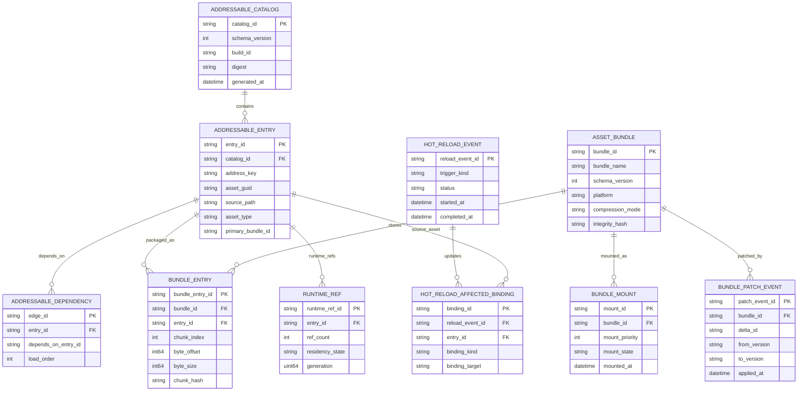
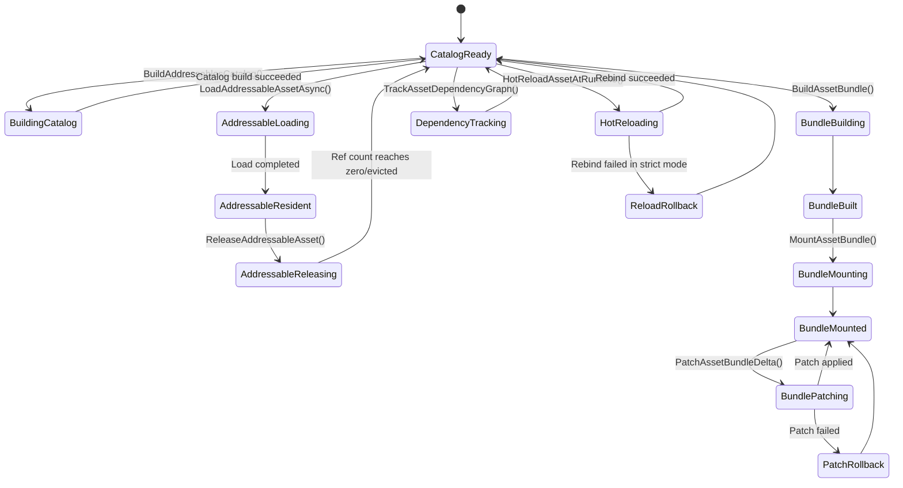

# Phase 23: Addressable Assets, Bundles & Hot Content Delivery

## Implementation Plan

---

## Goal

Phase 23 adds the engine content-delivery backbone required for live operations, DLC/mod packaging, and safe runtime content iteration. The implementation introduces deterministic addressable catalog generation, async runtime addressable loading with ref-counted lifetime control, bundle build/mount/patch workflows, and dependency-intelligent hot reload across renderer/audio/animation consumers. The outcome is a production-oriented asset-delivery pipeline where content identity, versioning, distribution, and runtime rebinding are deterministic, observable, and rollback-safe.

---

## Context Map

### Files to Modify

| File | Purpose | Changes Needed |
|------|---------|----------------|
| `CMakeLists.txt` | Engine compile surface | Register new Stage 23 addressables/bundles/hot-reload modules under `EngineCore` |
| `Core/Asset/AssetTypes.h` | Asset taxonomy and header metadata | Add catalog/bundle/hot-reload record enums/flags and version constants needed by Stage 23 services |
| `Core/Asset/AssetCooker.h` | Manifest schema contracts | Extend manifest entry metadata for bundle membership, address key, and deterministic dependency serialization |
| `Core/Asset/AssetCooker.cpp` | Manifest read/write implementation | Replace current placeholder parse path with structured read/write so Stage 23 catalog generation is reliable |
| `Core/Asset/AssetPipeline.h` | Dependency graph + runtime lookup interfaces | Add Stage 23 APIs for dependency snapshots, reverse lookup, and mount-layer aware resolution |
| `Core/Asset/AssetPipeline.cpp` | Dependency and lookup implementation | Extend `AssetDependencyGraph` and `AssetDatabase` with reverse-index access and mount-priority resolution |
| `Core/Asset/AssetLoader.h` | Runtime loading contracts | Add typed addressable load requests, load tickets, cancellation, and release handles |
| `Core/Asset/AssetLoader.cpp` | Runtime loading implementation | Bridge addressable keys to cooked paths/bundle entries and reuse existing sync/async load primitives |
| `Core/Asset/Addressables/AddressablesCatalog.h` (new) | Catalog domain types | Define catalog schema, deterministic address key policy, and manifest digest contracts |
| `Core/Asset/Addressables/AddressablesCatalog.cpp` (new) | Catalog builder | Implement `BuildAddressablesCatalog()` and catalog serialization/deserialization |
| `Core/Asset/Addressables/AddressableRuntime.h` (new) | Runtime addressable lifecycle | Define `LoadAddressableAssetAsync()` / `ReleaseAddressableAsset()` contracts, ref-count model, and cache policy |
| `Core/Asset/Addressables/AddressableRuntime.cpp` (new) | Runtime addressable service | Implement async dependency resolution, cancellation-aware loading, and deterministic release behavior |
| `Core/Asset/Bundles/AssetBundleBuilder.h` (new) | Bundle authoring contracts | Define bundle chunk layout, compression strategy flags, and output manifest contracts |
| `Core/Asset/Bundles/AssetBundleBuilder.cpp` (new) | Bundle authoring implementation | Implement `BuildAssetBundle()` and deterministic bundle chunk index emission |
| `Core/Asset/Bundles/AssetBundleMountService.h` (new) | Bundle mount interfaces | Define mount table, mount priority, and integrity validation contracts |
| `Core/Asset/Bundles/AssetBundleMountService.cpp` (new) | Mount implementation | Implement `MountAssetBundle()` with validated path/integrity checks and layered override lookup |
| `Core/Asset/Bundles/AssetBundlePatcher.h` (new) | Delta patch contracts | Define patch-set schema and transactional apply/revert strategy |
| `Core/Asset/Bundles/AssetBundlePatcher.cpp` (new) | Delta patch implementation | Implement `PatchAssetBundleDelta()` with atomic swap and corruption rollback |
| `Core/Asset/HotReload/AssetDependencyTracker.h` (new) | Dependency intelligence API | Define `TrackAssetDependencyGraph()` queries for transitive deps, reverse deps, and cycle diagnostics |
| `Core/Asset/HotReload/AssetDependencyTracker.cpp` (new) | Dependency intelligence implementation | Implement merged runtime/cook dependency graph snapshot service |
| `Core/Asset/HotReload/AssetHotReloadService.h` (new) | Runtime rebinding API | Define `HotReloadAssetAtRuntime()` request/result model and staged rebind transaction flow |
| `Core/Asset/HotReload/AssetHotReloadService.cpp` (new) | Runtime rebinding implementation | Implement renderer/audio/animation safe-point reload + rollback behavior |
| `Core/ECS/Components/MeshComponent.h` | Render binding state | Add optional hot-reload generation/version marker for static mesh rebinding safety |
| `Core/ECS/Components/SkeletalMeshComponent.h` | Skeletal mesh + animation binding state | Add generation/version tracking for mesh/clip rebinding and skinning re-registration |
| `Core/ECS/Components/AudioSourceComponent.h` | Audio binding state | Add optional clip-version stamp and restore policy for seamless audio reload |
| `Core/Audio/AudioSystem.h` | Audio runtime API | Add source-path-centric reload helper hooks required by runtime audio clip replacement |
| `Core/Audio/AudioSystem.cpp` | Audio runtime implementation | Implement handle-preserving restart/rebind logic for reloaded audio assets |
| `Core/Audio/AudioSourceSystem.h` | Audio source orchestration | Integrate hot-reload notification handling so active sources rebind deterministically |
| `Core/ECS/Systems/RenderSystem.cpp` | Static mesh draw command producer | Apply mesh resource generation checks to avoid stale pointers during hot swap |
| `Core/ECS/Systems/SkeletalRenderSystem.cpp` | Skeletal draw and skinning registration | Re-register/refresh skinning instance on skeletal mesh hot reload without dangling instance IDs |
| `Core/ECS/Systems/AnimatorSystem.cpp` | Animation clip consumption | Re-resolve clip pointers after mesh/animation reload to keep state machines stable |
| `Core/UI/ImGuiSubsystem.h` | Runtime diagnostics UI contract | Add content-delivery panel model for catalog/bundle/mount/reload telemetry |
| `Core/UI/ImGuiSubsystem.cpp` | Runtime diagnostics UI implementation | Add debug panel actions/telemetry for addressable loads, bundle mounts, and hot-reload events |
| `Core/Application.cpp` | Main-loop integration point | Pump staged hot-reload completion and diagnostics publication once per frame |
| `Core/Security/PathValidator.h` | Path safety policy baseline | Reuse and extend cooked-path validation flows for mounted bundle roots and patch staging paths |

### Dependencies (may need updates)

| File | Relationship |
|------|--------------|
| `Core/Asset/AssetPipeline.h` + `.cpp` | Existing `AssetDependencyGraph` and `AssetDatabase` are the primary baseline for Stage 23 dependency and lookup services |
| `Core/Asset/AssetLoader.h` + `.cpp` | Existing sync/async/streaming load helpers are reused under addressable key resolution |
| `Core/Asset/AssetCooker.h` + `.cpp` | Existing manifest structures seed catalog and bundle metadata but require stronger parser/serializer coverage |
| `Core/Audio/AudioSourceSystem.h` | Current source playback state machine is the runtime anchor for audio clip hot-rebind semantics |
| `Core/ECS/Systems/RenderSystem.cpp` | Static mesh pointer consumption path requires swap-safe generation checks |
| `Core/ECS/Systems/SkeletalRenderSystem.cpp` | Skeletal mesh + GPU skinning registration path requires deterministic re-registration after reload |
| `Core/ECS/Systems/AnimatorSystem.cpp` | Animation clip lookup uses `skeletal.MeshData` and must refresh clip references after content swap |
| `Core/Security/PathValidator.h` | Existing path canonicalization and root enforcement should guard bundle mount/patch file operations |
| `Core/JobSystem/JobSystem.h` + `.cpp` | Async catalog build, load, patch verification, and reload staging should be scheduled through existing job infrastructure |

### Test Files

| Test | Coverage |
|------|----------|
| `Core/Tests/Asset/AddressablesCatalogBuildTests.cpp` (new) | `BuildAddressablesCatalog()` deterministic key generation, schema output, and digest stability |
| `Core/Tests/Asset/AddressableLoadAsyncTests.cpp` (new) | `LoadAddressableAssetAsync()` dependency closure, cancellation, and cache-hit behavior |
| `Core/Tests/Asset/AddressableReleaseTests.cpp` (new) | `ReleaseAddressableAsset()` ref-count semantics, deferred eviction, and double-release protection |
| `Core/Tests/Asset/AssetBundleBuildTests.cpp` (new) | `BuildAssetBundle()` chunk table correctness, compression metadata, and deterministic output ordering |
| `Core/Tests/Asset/AssetBundleMountTests.cpp` (new) | `MountAssetBundle()` integrity checks, priority layering, and lookup override policy |
| `Core/Tests/Asset/AssetBundlePatchTests.cpp` (new) | `PatchAssetBundleDelta()` transactional apply/revert and corruption handling |
| `Core/Tests/Asset/DependencyTrackerTests.cpp` (new) | `TrackAssetDependencyGraph()` reverse lookup completeness and cycle diagnostics |
| `Core/Tests/Asset/HotReloadRuntimeTests.cpp` (new) | `HotReloadAssetAtRuntime()` renderer/audio/animation rebinding correctness |
| `Core/Tests/Integration/Stage23CatalogBundleFlowTests.cpp` (new) | Catalog build -> bundle build -> mount -> runtime addressable load end-to-end |
| `Core/Tests/Integration/Stage23HotReloadStabilityTests.cpp` (new) | Runtime asset hot reload under active rendering/audio/animation load |

### Reference Patterns

| File | Pattern |
|------|---------|
| `Core/Asset/AssetPipeline.cpp` | Dependency graph mutation, topological order generation, and runtime lookup table construction |
| `Core/Asset/AssetLoader.cpp` | Path-validated file load and async wrappers suitable for addressable runtime integration |
| `Core/Asset/AssetCooker.cpp` | Existing manifest write format and cook metadata emission |
| `Core/Audio/AudioSourceSystem.h` | Source lifecycle and handle-driven audio playback orchestration |
| `Core/ECS/Systems/RenderSystem.cpp` | Draw-command production from `MeshComponent::MeshData` pointers |
| `Core/ECS/Systems/SkeletalRenderSystem.cpp` | Skeletal instance registration and per-frame skinning upload synchronization |
| `Core/ECS/Systems/AnimatorSystem.cpp` | Animation clip retrieval from `skeletal.MeshData` and state-machine evaluation cadence |
| `docs/plans/phase-22-scene-serialization-streaming-open-world-runtime/implementation-plan.md` | Required plan depth/structure baseline |

### Risk Assessment

- [x] Breaking changes to public API
- [x] Database migrations needed (logical catalog/bundle schema versioning)
- [x] Configuration changes required (`CMakeLists.txt`, runtime feature flags, optional diagnostics panel)

---

## Requirements

### Addressable Catalog & Runtime Query System (Step 23.1)

- Implement `BuildAddressablesCatalog()` with deterministic GUID/address assignment derived from stable source-path normalization and manifest identity.
- Implement `LoadAddressableAssetAsync()` with dependency-aware async load scheduling, cache reuse, and cancellation support.
- Implement `ReleaseAddressableAsset()` with strict ref-counted lifetime and deterministic eviction policy.
- Ensure catalog output includes schema version, content digest, dependency references, and bundle placement metadata.
- Guarantee that repeated catalog builds from identical inputs produce byte-stable ordering and stable keys.
- Prevent key collision ambiguity by enforcing explicit duplicate-address conflict policies (`fail`, `override`, `alias`).

### Bundle Packaging + Mount + Patch Pipeline (Step 23.2)

- Implement `BuildAssetBundle()` with deterministic chunk ordering, compression metadata, and per-chunk integrity hashes.
- Implement `MountAssetBundle()` with path/integrity validation, mount-priority conflict resolution, and runtime lookup integration.
- Implement `PatchAssetBundleDelta()` with transactional chunk replacement and rollback-safe failure behavior.
- Support layered content delivery (`base`, `dlc`, `mod`, `hotfix`) with explicit precedence and deterministic override behavior.
- Keep bundle metadata compatible with catalog-driven key resolution and dependency closure.
- Enforce safe patch staging directories and fail-fast corruption detection before activation.

### Dependency Intelligence + Runtime Hot Reload (Step 23.3)

- Implement `TrackAssetDependencyGraph()` with transitive dependency lookups, reverse dependent lookups, and cycle diagnostics.
- Implement `HotReloadAssetAtRuntime()` with staged reload/rebind safety for renderer/audio/animation consumers.
- Ensure static mesh, skeletal mesh, and audio source consumers cannot observe partially swapped resources.
- Ensure animator clip pointers and skinning registrations are refreshed atomically with skeletal asset reloads.
- Emit structured telemetry for reload attempts, affected entities/sources, rollback cause, and completion status.
- Preserve frame stability by applying swap/rebind at controlled synchronization points in main-loop update order.

---

## Technical Considerations

### System Architecture Overview

```mermaid
graph TD
    subgraph Frontend Layer
        DeliveryPanel[Content Delivery Debug Panel]
        CatalogInspector[Catalog Inspector]
        BundleInspector[Bundle Mount Inspector]
        ReloadInspector[Hot Reload Timeline]
    end

    subgraph API Layer
        CatalogAPI[Catalog Build API]
        AddressableAPI[Addressable Runtime API]
        BundleAPI[Bundle Build and Mount API]
        PatchAPI[Delta Patch API]
        DependencyAPI[Dependency Tracker API]
        ReloadAPI[Hot Reload API]
    end

    subgraph Business Logic Layer
        CatalogService[AddressablesCatalogService]
        AddressableRuntime[AddressableRuntimeService]
        BundleBuilder[AssetBundleBuilderService]
        BundleMount[AssetBundleMountService]
        BundlePatch[AssetBundlePatchService]
        DependencyTracker[AssetDependencyTrackerService]
        HotReloadService[AssetHotReloadService]
    end

    subgraph Data Layer
        CatalogStore[Catalog JSON/Binary Store]
        BundleStore[Bundle Archives and Chunk Index]
        MountTable[Runtime Mount Table]
        RuntimeRefStore[Runtime RefCount Ledger]
        ReloadJournal[Hot Reload Event Journal]
    end

    subgraph Infrastructure Layer
        AssetPipeline[AssetPipeline]
        AssetDatabase[AssetDatabase]
        AssetLoader[AssetLoader]
        StreamingLoader[StreamingAssetLoader]
        AudioSystem[AudioSystem and AudioSourceSystem]
        RenderSystems[RenderSystem and SkeletalRenderSystem]
        AnimatorSystem[AnimatorSystem]
        PathValidator[PathValidator]
        JobSystem[JobSystem]
        AppLoop[Application Main Loop]
    end

    DeliveryPanel --> CatalogInspector
    DeliveryPanel --> BundleInspector
    DeliveryPanel --> ReloadInspector

    CatalogInspector --> CatalogAPI
    BundleInspector --> BundleAPI
    ReloadInspector --> ReloadAPI

    CatalogAPI --> CatalogService
    AddressableAPI --> AddressableRuntime
    BundleAPI --> BundleBuilder
    BundleAPI --> BundleMount
    PatchAPI --> BundlePatch
    DependencyAPI --> DependencyTracker
    ReloadAPI --> HotReloadService

    CatalogService --> CatalogStore
    CatalogService --> AssetPipeline
    AddressableRuntime --> AssetDatabase
    AddressableRuntime --> AssetLoader
    AddressableRuntime --> RuntimeRefStore
    BundleBuilder --> BundleStore
    BundleBuilder --> CatalogStore
    BundleMount --> MountTable
    BundleMount --> PathValidator
    BundlePatch --> BundleStore
    BundlePatch --> MountTable
    DependencyTracker --> AssetPipeline
    DependencyTracker --> RuntimeRefStore
    HotReloadService --> DependencyTracker
    HotReloadService --> RenderSystems
    HotReloadService --> AudioSystem
    HotReloadService --> AnimatorSystem
    HotReloadService --> ReloadJournal

    AppLoop --> AddressableRuntime
    AppLoop --> HotReloadService
    JobSystem --> CatalogService
    JobSystem --> AddressableRuntime
    JobSystem --> BundlePatch
```



### Technology Stack Selection

| Layer | Technology | Rationale |
|-------|------------|-----------|
| Frontend | Existing Dear ImGui diagnostics panel framework | Matches existing runtime tooling and avoids UI architecture drift |
| API | C++ typed service interfaces + lightweight request/result structs | Aligns with current engine architecture and deterministic runtime behavior |
| Business Logic | New services under `Core/Asset/Addressables`, `Core/Asset/Bundles`, `Core/Asset/HotReload` | Isolates Stage 23 complexity without overloading existing cooker/loader classes |
| Data | Versioned catalog + bundle index + patch manifest (JSON or binary) | Keeps schema evolution explicit and reproducible |
| Infrastructure | Existing `AssetPipeline`, `AssetLoader`, `AssetDatabase`, ECS/Audio systems, `PathValidator`, `JobSystem` | Reuses proven runtime primitives and minimizes duplicated logic |

### Integration Points

- **Catalog integration:** Build catalog from `AssetManifest` entries and dependency graph snapshots produced by `AssetPipeline`.
- **Runtime load integration:** Resolve key -> cooked path/bundle entry via mount table and feed resolved path into existing `AssetLoader` or `StreamingAssetLoader`.
- **Dependency integration:** Reuse and extend `AssetDependencyGraph` to provide reverse lookup needed by hot reload impact analysis.
- **Bundle mount integration:** Extend runtime lookup precedence so mounted bundle entries can override base cooked assets deterministically.
- **Hot-reload integration:** Coordinate safe rebind windows with `RenderSystem`, `SkeletalRenderSystem`, `AnimatorSystem`, `AudioSystem`, and `AudioSourceSystem`.
- **Safety integration:** Route all mount/patch file paths through `PathValidator` before any IO operation.

### Deployment Architecture

```text
Core/
├── Asset/
│   ├── AssetTypes.h                               # Stage 23 catalog/bundle metadata extensions
│   ├── AssetCooker.h/.cpp                         # Manifest schema + robust parse/write for catalog inputs
│   ├── AssetPipeline.h/.cpp                       # Dependency + lookup services extended for runtime intelligence
│   ├── AssetLoader.h/.cpp                         # Addressable async load/release bridge over existing loaders
│   ├── Addressables/                              # New Stage 23 catalog/runtime domain
│   │   ├── AddressablesCatalogTypes.h
│   │   ├── AddressablesCatalog.h/.cpp
│   │   ├── AddressableRuntimeTypes.h
│   │   └── AddressableRuntime.h/.cpp
│   ├── Bundles/                                   # New Stage 23 bundle domain
│   │   ├── AssetBundleTypes.h
│   │   ├── AssetBundleBuilder.h/.cpp
│   │   ├── AssetBundleMountService.h/.cpp
│   │   └── AssetBundlePatcher.h/.cpp
│   └── HotReload/                                 # New Stage 23 reload/dependency intelligence domain
│       ├── AssetDependencyTracker.h/.cpp
│       ├── AssetHotReloadTypes.h
│       └── AssetHotReloadService.h/.cpp
├── Audio/
│   ├── AudioSystem.h/.cpp                         # Source-path based rebind/restart support
│   └── AudioSourceSystem.h                        # Active source rebind policy
├── ECS/
│   ├── Components/
│   │   ├── MeshComponent.h                        # Mesh generation/version stamp
│   │   ├── SkeletalMeshComponent.h                # Skeletal generation/version stamp
│   │   └── AudioSourceComponent.h                 # Clip version/reload restore metadata
│   └── Systems/
│       ├── RenderSystem.cpp                       # Stale pointer prevention on mesh swap
│       ├── SkeletalRenderSystem.cpp               # Skinning re-register on skeletal swap
│       └── AnimatorSystem.cpp                     # Animation clip pointer refresh on reload
├── UI/
│   └── ImGuiSubsystem.h/.cpp                      # Content delivery diagnostics panel
└── Application.cpp                                # Frame-loop pump for staged reload completion
```

### Scalability Considerations

- **Catalog scale:** Support large catalogs (100k+ addressable records) with key index structures optimized for O(log n) lookup.
- **Load amplification control:** Collapse duplicate in-flight load requests for the same address key to a shared ticket/future.
- **Mount layering control:** Keep mount-table lookup deterministic with bounded priority levels and predictable tie-break rules.
- **Patch throughput:** Apply chunk-level patching in streaming fashion to avoid full bundle memory copies.
- **Hot-reload fanout:** Use dependency reverse lookups to only rebind truly affected entities/sources rather than full-scene reload.
- **Telemetry cost control:** Keep diagnostics sampling lightweight and defer heavy payload formatting to tooling requests.

---

## Database Schema Design

> This phase does not introduce an RDBMS. The model below defines logical records persisted in catalog artifacts, bundle metadata, and runtime journals.

### Addressables + Bundles + Reload Data Model



### Table Specifications

| Logical Table | Critical Fields | Constraints |
|---------------|-----------------|------------|
| `ADDRESSABLE_CATALOG` | `catalog_id`, `schema_version`, `digest` | Digest must uniquely identify catalog content set |
| `ADDRESSABLE_ENTRY` | `address_key`, `asset_guid`, `primary_bundle_id` | `address_key` unique per catalog; deterministic mapping required |
| `ADDRESSABLE_DEPENDENCY` | `entry_id`, `depends_on_entry_id`, `load_order` | No self-edge; directed graph must be acyclic in strict mode |
| `ASSET_BUNDLE` | `bundle_id`, `platform`, `integrity_hash` | Integrity hash required before mount eligibility |
| `BUNDLE_ENTRY` | `bundle_id`, `entry_id`, `chunk_index`, `chunk_hash` | Entry must map to exactly one bundle chunk location per bundle version |
| `BUNDLE_MOUNT` | `bundle_id`, `mount_priority`, `mount_state` | Active mount priority ordering must be deterministic |
| `BUNDLE_PATCH_EVENT` | `delta_id`, `from_version`, `to_version` | Version transition must be monotonic for a given bundle branch |
| `RUNTIME_REF` | `entry_id`, `ref_count`, `generation` | Ref count non-negative; generation increments on each successful swap |
| `HOT_RELOAD_EVENT` | `reload_event_id`, `status` | Status transitions constrained to valid lifecycle states |

### Indexing Strategy

- Addressable key lookup index: `(catalog_id, address_key)`
- Entry dependency lookup index: `(entry_id, load_order)`
- Reverse dependency lookup index: `(depends_on_entry_id, entry_id)`
- Bundle lookup index: `(bundle_id, platform, schema_version)`
- Mount resolution index: `(mount_state, mount_priority DESC, mounted_at DESC)`
- Runtime ref lookup index: `(entry_id, generation)`
- Reload journal lookup index: `(started_at DESC, status)`

### Foreign Key Relationships

- `ADDRESSABLE_ENTRY.catalog_id -> ADDRESSABLE_CATALOG.catalog_id`
- `ADDRESSABLE_DEPENDENCY.entry_id -> ADDRESSABLE_ENTRY.entry_id`
- `BUNDLE_ENTRY.bundle_id -> ASSET_BUNDLE.bundle_id`
- `BUNDLE_ENTRY.entry_id -> ADDRESSABLE_ENTRY.entry_id`
- `BUNDLE_MOUNT.bundle_id -> ASSET_BUNDLE.bundle_id`
- `BUNDLE_PATCH_EVENT.bundle_id -> ASSET_BUNDLE.bundle_id`
- `RUNTIME_REF.entry_id -> ADDRESSABLE_ENTRY.entry_id`
- `HOT_RELOAD_AFFECTED_BINDING.reload_event_id -> HOT_RELOAD_EVENT.reload_event_id`
- `HOT_RELOAD_AFFECTED_BINDING.entry_id -> ADDRESSABLE_ENTRY.entry_id`

### Database Migration Strategy

- Version `ADDRESSABLE_CATALOG` explicitly with a schema integer and migration adapters in catalog load path.
- Keep backward-compatible deserializers for at least one prior schema version in addressable runtime service.
- Version bundle metadata independently from catalog schema so content-pack evolution and key evolution can roll independently.
- Store migration provenance (`fromSchema`, `toSchema`, adapter ID) in reload and patch event records for diagnostics/replay.

---

## API Design

### Stage 23 Runtime API Surface (C++)

```cpp
namespace Core::Asset {

struct BuildAddressablesCatalogRequest;
struct BuildAddressablesCatalogResult;
struct LoadAddressableAssetRequest;
struct AddressableLoadTicket;
struct ReleaseAddressableAssetRequest;
struct BuildAssetBundleRequest;
struct BuildAssetBundleResult;
struct MountAssetBundleRequest;
struct MountAssetBundleResult;
struct PatchAssetBundleDeltaRequest;
struct PatchAssetBundleDeltaResult;
struct TrackAssetDependencyGraphRequest;
struct DependencyGraphSnapshot;
struct HotReloadAssetRequest;
struct HotReloadAssetResult;

// Step 23.1
Result<BuildAddressablesCatalogResult> BuildAddressablesCatalog(
    const BuildAddressablesCatalogRequest& request);
Result<AddressableLoadTicket> LoadAddressableAssetAsync(
    const LoadAddressableAssetRequest& request);
Result<void> ReleaseAddressableAsset(
    const ReleaseAddressableAssetRequest& request);

// Step 23.2
Result<BuildAssetBundleResult> BuildAssetBundle(
    const BuildAssetBundleRequest& request);
Result<MountAssetBundleResult> MountAssetBundle(
    const MountAssetBundleRequest& request);
Result<PatchAssetBundleDeltaResult> PatchAssetBundleDelta(
    const PatchAssetBundleDeltaRequest& request);

// Step 23.3
Result<DependencyGraphSnapshot> TrackAssetDependencyGraph(
    const TrackAssetDependencyGraphRequest& request);
Result<HotReloadAssetResult> HotReloadAssetAtRuntime(
    const HotReloadAssetRequest& request);

} // namespace Core::Asset
```

### Request/Response Contracts (Tooling JSON Types)

```ts
type BuildAddressablesCatalogRequest = {
  manifestPath: string;
  outputCatalogPath: string;
  keyStrategy: "path-hash" | "explicit-address" | "hybrid";
  includeBundlePlacement: boolean;
  strictDuplicatePolicy: "fail" | "override" | "alias";
};

type LoadAddressableAssetRequest = {
  addressKey: string;
  expectedType?: "Texture" | "Mesh" | "Shader" | "Audio" | "Animation";
  priority: "low" | "normal" | "high";
  allowBundleMountOnDemand: boolean;
  cancellationToken?: string;
};

type ReleaseAddressableAssetRequest = {
  addressKey: string;
  releaseReason: "normal" | "scene-unload" | "memory-pressure" | "manual";
  immediateEvict?: boolean;
};

type BuildAssetBundleRequest = {
  bundleName: string;
  platform: "windows" | "linux" | "macos";
  inputAddressKeys: string[];
  compressionMode: "none" | "fast" | "balanced" | "max";
  chunkSizeBytes: number;
  outputBundlePath: string;
};

type MountAssetBundleRequest = {
  bundlePath: string;
  mountPoint: string;
  mountPriority: number;
  verifyIntegrity: boolean;
  trustLevel: "official" | "user-mod";
};

type PatchAssetBundleDeltaRequest = {
  targetBundleId: string;
  deltaManifestPath: string;
  deltaPayloadPath: string;
  stagingDirectory: string;
  requireBackup: boolean;
};

type TrackAssetDependencyGraphRequest = {
  rootAddressKeys: string[];
  includeReverseDependents: boolean;
  includeTransitive: boolean;
  detectCycles: boolean;
};

type HotReloadAssetRequest = {
  addressKeys: string[];
  trigger: "file-change" | "patch-apply" | "manual";
  dryRun: boolean;
  rebindPolicy: "strict" | "best-effort";
};
```

### Authentication and Authorization

- Stage 23 APIs are engine-local by default and do not require identity tokens.
- If exposed via MCP/runtime tooling, gate mutating operations by capability scopes (`asset.catalog.build`, `asset.bundle.mount`, `asset.reload.hot`).
- Enforce read-only visibility for catalog/dependency inspection endpoints in restricted runtime modes.
- Require explicit runtime feature flag for bundle patch operations in shipping builds.

### Error Handling Strategies

| Error Code | Scenario | Strategy |
|-----------|----------|----------|
| `ADDRESSABLE_KEY_NOT_FOUND` | `LoadAddressableAssetAsync()` key absent in active catalog | Return typed failure with catalog ID and closest key suggestions |
| `ADDRESSABLE_KEY_AMBIGUOUS` | Key resolved to multiple entries due to invalid merge/mount state | Fail fast and emit mount conflict diagnostics |
| `ADDRESSABLE_DEPENDENCY_CYCLE` | `TrackAssetDependencyGraph()` detects cycle in strict mode | Reject load/reload and report cycle chain |
| `ADDRESSABLE_REFCOUNT_UNDERFLOW` | `ReleaseAddressableAsset()` called without active reference | Fail and log offender context without mutating state |
| `BUNDLE_INTEGRITY_FAILED` | `MountAssetBundle()` hash/signature mismatch | Reject mount and quarantine bundle path |
| `BUNDLE_PATCH_TRANSACTION_FAILED` | `PatchAssetBundleDelta()` fails mid-apply | Auto-revert staged changes and return rollback summary |
| `HOT_RELOAD_REBIND_FAILED` | `HotReloadAssetAtRuntime()` cannot rebind one or more consumers | Roll back swapped resources for strict mode; emit partial report in best-effort mode |
| `HOT_RELOAD_SAFEPOINT_TIMEOUT` | Reload cannot enter safe-point window in configured budget | Defer operation and return retry diagnostics |

### Rate Limiting and Caching Strategies

- Coalesce in-flight loads by `(catalogId, addressKey, expectedType)` so repeated requests share one async ticket.
- Cache dependency closures by `(catalogDigest, addressKey)` to avoid repeated transitive traversal.
- Cache bundle chunk index in memory while mounted; invalidate on patch apply or unmount.
- Rate-limit patch and hot-reload operations to prevent repeated oscillation from rapid file-change bursts.

---

## Frontend Architecture

### Component Hierarchy Documentation

```text
Content Delivery Workspace
├── Addressables Panel
│   ├── Active Catalog Header
│   ├── Address Key Search + Lookup
│   ├── Runtime Load Ticket Queue
│   └── Runtime RefCount Table
├── Bundles Panel
│   ├── Bundle Build Controls
│   ├── Mounted Bundle Table
│   ├── Mount Priority Editor
│   └── Integrity/Hash Validation View
├── Patch Panel
│   ├── Delta Apply Controls
│   ├── Patch Transaction Status
│   └── Rollback Event History
└── Hot Reload Panel
    ├── Dependency Impact Preview
    ├── Safe-Point Status
    ├── Rebind Summary (Render/Audio/Animation)
    └── Reload Event Timeline
```

### State Flow Diagram



### Reusable Component Library Specifications

| UI Element | Reuse Strategy |
|-----------|-----------------|
| Async operation row | Shared for addressable load tickets, patch transaction progress, and reload stages |
| Dependency tree widget | Shared for dependency tracker and hot reload impact preview |
| Integrity status badge | Shared for bundle build validation, mount validation, and patch verification |
| Event timeline widget | Shared for patch journal and hot-reload event stream |
| Key/value diagnostics table | Shared for catalog entry inspection and runtime resident asset inspection |

### State Management Patterns

- Central `ContentDeliveryRuntimeState` stores active catalog digest, mounted bundles, runtime ref counts, and latest reload events.
- Keep mount-table snapshots immutable per frame; mutate only at synchronized stage boundaries.
- Event topics:
  - `AddressablesCatalogBuilt`
  - `AddressableLoadStarted`
  - `AddressableLoadCompleted`
  - `AddressableReleased`
  - `AssetBundleBuilt`
  - `AssetBundleMounted`
  - `AssetBundlePatched`
  - `AssetDependencyGraphTracked`
  - `AssetHotReloadCompleted`
- Deterministic update order:
  1. Poll async load/build/patch jobs
  2. Apply completed mount-table changes
  3. Apply pending hot-reload swaps at safe point
  4. Publish diagnostics snapshot

### Type Definitions (C++)

```cpp
struct ContentDeliveryRuntimeState {
    std::string ActiveCatalogId;
    std::string ActiveCatalogDigest;
    std::unordered_map<std::string, RuntimeAddressableRefState> RuntimeRefs;
    std::vector<MountedBundleState> MountedBundles;
    std::vector<ContentDeliveryEventRecord> RecentEvents;
};

struct RuntimeAddressableRefState {
    std::string AddressKey;
    uint32_t RefCount = 0;
    uint64_t Generation = 0;
    bool Resident = false;
};
```

---

## Security & Performance

### Authentication/Authorization Requirements

- Keep mutating Stage 23 operations disabled by default in restricted runtime profiles.
- Separate read-only diagnostics APIs from mutating content-delivery controls.
- Require explicit capability checks before mount, patch, and hot-reload execution when routed through tooling.

### Data Validation and Sanitization

- Validate catalog, bundle, and patch paths through `PathValidator` before opening files.
- Validate catalog schema version and digest before activation.
- Validate bundle chunk hashes before mount and after patch apply.
- Validate dependency graph acyclic property in strict mode before async load/reload.
- Validate hot-reload target asset types before consumer rebinding.

### Performance Optimization Strategies

| Technique | Target | Implementation |
|-----------|--------|----------------|
| In-flight load deduplication | Prevent duplicate async work | Shared ticket map keyed by address key + expected type |
| Dependency closure cache | Reduce repeated graph traversal | Memoize transitive closures by catalog digest |
| Mount-table two-phase swap | Avoid lookup stalls during mount/patch | Build new table snapshot off-thread, atomically publish |
| Chunked patch apply | Keep patch memory bounded | Stream chunk reads/writes instead of full-bundle copy |
| Reload safe-point scheduler | Prevent frame spikes and race windows | Rebind at deterministic frame boundary with bounded per-frame budget |
| Generational handles | Prevent stale pointer use after swap | Increment generation and gate consumers on generation mismatch |

### Caching Mechanisms

- Addressable runtime cache keyed by `(catalogDigest, addressKey, expectedType)`.
- Dependency cache keyed by `(catalogDigest, addressKey, includeTransitive)`.
- Mounted bundle index cache keyed by `(bundleId, bundleVersion, mountPriority)`.
- Reload impact cache keyed by `(assetGuid, generation)` for repeated quick diagnostics.

### Performance Budget

| System | Budget Goal |
|--------|-------------|
| Addressable key lookup | <= 0.1 ms average runtime lookup |
| Addressable async dispatch overhead | <= 0.3 ms main-thread overhead per request |
| Bundle mount publish | <= 1 frame for mount-table swap after verification |
| Delta patch apply pause | <= configurable maintenance window; no main-loop stall beyond frame budget |
| Hot-reload swap pause | <= 1 frame synchronized swap window |
| Reload impact analysis | <= 2 ms for common single-asset reload fanout |

---

## Detailed Step Breakdown

### Step 23.1: Build addressable catalog generation and runtime query system

#### Sub-step 23.1.1: `BuildAddressablesCatalog()` (v0.23.1.1)
- Introduce `AddressablesCatalogService` that reads `AssetManifest` entries and emits deterministic catalog records.
- Build deterministic key mapping:
  1. Normalize source path case/separators.
  2. Compute stable asset GUID using existing `ComputeAssetId()` baseline + schema namespace salt.
  3. Derive address key using configured key strategy (`path-hash`, explicit, hybrid).
- Persist catalog schema with:
  - Catalog metadata (`schemaVersion`, `buildId`, `digest`, `generatedAt`).
  - Entry metadata (`addressKey`, `assetGuid`, `assetType`, `primaryBundle`).
  - Dependency edges sorted by stable key.
- Add duplicate key conflict resolution policy (`fail` default for deterministic authoring safety).
- **Deliverable**: Deterministic catalog build pipeline with stable output ordering.

#### Sub-step 23.1.2: `LoadAddressableAssetAsync()` (v0.23.1.2)
- Add runtime key resolution service:
  1. Resolve key in active catalog.
  2. Resolve mounted bundle override or base cooked path.
  3. Build dependency closure (direct + transitive).
  4. Queue dependency-first async load tasks.
- Reuse existing `AssetLoader::LoadTextureAsync/LoadMeshAsync/LoadShaderAsync` where types match.
- Add cancellation-aware tickets:
  - Shared in-flight ticket map to deduplicate duplicate requests.
  - Cancellation token registration and cooperative cancellation checks before activation.
- Add typed completion payloads and diagnostics for missing dependencies or type mismatch.
- **Deliverable**: Async dependency-aware addressable load runtime with ticket/cancellation model.

#### Sub-step 23.1.3: `ReleaseAddressableAsset()` (v0.23.1.3)
- Introduce runtime ref ledger keyed by address key and generation.
- Implement strict release behavior:
  1. Validate key exists and active ref > 0.
  2. Decrement ref count.
  3. When zero, schedule eviction and dependency release cascade according to policy.
- Add eviction policy controls (`immediate`, `deferred`, memory-pressure triggered).
- Protect against underflow and duplicate-release by returning typed failure without mutating state.
- **Deliverable**: Ref-counted addressable lifecycle with deterministic release and eviction policy.

#### Sub-step 23.1.4: Catalog Activation + Migration Hardening (v0.23.1.4)
- Add catalog schema migration adapters and strict activation validation.
- Keep active catalog immutable while loading next candidate catalog; perform atomic catalog swap only on successful validation.
- Record activation metadata in runtime diagnostics (old digest, new digest, reason).
- **Deliverable**: Safe catalog evolution and atomic activation path.

---

### Step 23.2: Build bundle packaging and mount pipeline for DLC/mod/patch workflows

#### Sub-step 23.2.1: `BuildAssetBundle()` (v0.23.2.1)
- Create bundle builder service with deterministic entry ordering by address key.
- Implement chunk layout strategy:
  1. Group entries by type and streaming profile.
  2. Pack into configurable chunk size boundaries.
  3. Compute per-chunk and whole-bundle integrity hashes.
- Emit bundle manifest containing chunk table, entry offsets, compression mode, and schema version.
- Ensure bundle output is reproducible for identical input set + build settings.
- **Deliverable**: Deterministic bundle build pipeline with chunk index + integrity metadata.

#### Sub-step 23.2.2: `MountAssetBundle()` (v0.23.2.2)
- Implement mount service with staged validation:
  1. Validate path and allowed mount root using `PathValidator`.
  2. Validate bundle header/schema version.
  3. Validate bundle hash/signature (if enabled).
  4. Build mount entry map and merge into runtime mount table by priority.
- Add mount conflict policy for duplicate address keys across mounted bundles.
- Publish immutable mount-table snapshot to runtime lookup services after successful merge.
- **Deliverable**: Integrity-validated mount pipeline with deterministic priority-based override behavior.

#### Sub-step 23.2.3: `PatchAssetBundleDelta()` (v0.23.2.3)
- Implement transactional delta patch workflow:
  1. Validate delta manifest and target bundle version.
  2. Stage patched chunks in temporary directory.
  3. Verify staged chunk integrity.
  4. Atomically swap staged bundle into active location.
  5. Refresh mount-table metadata and catalog linkage if needed.
- Add rollback path that restores prior bundle on any validation or apply failure.
- Emit structured patch journal event including old/new versions and changed chunk IDs.
- **Deliverable**: Atomic bundle delta patch pipeline with rollback safety.

#### Sub-step 23.2.4: Mount Priority Governance + Recovery Policies (v0.23.2.4)
- Define explicit mount tiers (`base`, `dlc`, `mod`, `hotfix`) and deterministic tie-breaks.
- Add recovery behavior for invalid mounted bundle discovered post-mount (quarantine and table rebuild).
- Add diagnostics panel support for mount conflicts and active override source per key.
- **Deliverable**: Deterministic mount precedence model with operational recovery controls.

---

### Step 23.3: Add dependency intelligence and runtime hot-reload tooling

#### Sub-step 23.3.1: `TrackAssetDependencyGraph()` (v0.23.3.1)
- Introduce merged dependency tracker that combines cook-time edges and runtime ref-state edges.
- Support graph queries:
  - Direct dependencies.
  - Transitive dependency closure.
  - Reverse dependents.
  - Cycle detection and cycle path report.
- Persist snapshot digest for debugging and reproducible issue triage.
- **Deliverable**: Runtime dependency intelligence API with reverse lookup and cycle diagnostics.

#### Sub-step 23.3.2: `HotReloadAssetAtRuntime()` (v0.23.3.2)
- Implement staged hot reload transaction:
  1. Resolve impacted assets via `TrackAssetDependencyGraph()`.
  2. Preload replacement resources and validate types.
  3. Enter safe-point window.
  4. Swap resources and rebind consumers.
  5. Commit or rollback transaction.
- Consumer rebind coverage:
  - `MeshComponent::MeshData` + `MeshPath`.
  - `SkeletalMeshComponent::MeshData` + animation clip sources.
  - `AudioSourceComponent::AudioClipPath` currently active handles.
  - Animator clip references derived from reloaded skeletal assets.
- Support `strict` and `best-effort` policies with explicit result summary.
- **Deliverable**: Transactional runtime hot-reload service with deterministic rebind behavior.

#### Sub-step 23.3.3: Renderer/Audio/Animation Safe Rebind Protocol (v0.23.3.3)
- Add generation-stamp checks in render and skeletal systems so draw commands cannot consume stale swapped resources.
- Re-register GPU skinning instance IDs when skeletal mesh identity changes.
- For active audio sources, preserve playback semantics during clip swap (resume at equivalent playback position when compatible).
- Refresh animator clip pointers after skeletal mesh reload and validate state machine continuity.
- **Deliverable**: Cross-system safe rebind protocol for render/audio/animation users.

#### Sub-step 23.3.4: Hot Reload Observability + Rollback Instrumentation (v0.23.3.4)
- Emit detailed reload event records:
  - Trigger source.
  - Impacted assets.
  - Impacted entities/sources.
  - Commit/rollback status.
  - Failure diagnostics.
- Add diagnostics UI panel for event playback and affected binding inspection.
- Add stress test hooks for repeated reload bursts and safe-point timeout handling.
- **Deliverable**: Operationally visible hot-reload pipeline with forensic-grade diagnostics.

---

## Dependencies

### External Libraries

- `nlohmann_json` for catalog/bundle/patch schema serialization.
- Standard C++ concurrency and filesystem (`std::future`, `std::filesystem`, `std::mutex`) for async IO and runtime coordination.
- `EnTT` for ECS traversal during hot-reload affected-binding rebinding.
- `miniaudio` via existing `AudioSystem` for runtime clip handle control during audio hot reload.

### Internal Dependencies

- `Core/Asset/AssetTypes.h`
- `Core/Asset/AssetCooker.h` + `Core/Asset/AssetCooker.cpp`
- `Core/Asset/AssetPipeline.h` + `Core/Asset/AssetPipeline.cpp`
- `Core/Asset/AssetLoader.h` + `Core/Asset/AssetLoader.cpp`
- `Core/Security/PathValidator.h`
- `Core/Audio/AudioSystem.h` + `Core/Audio/AudioSystem.cpp`
- `Core/Audio/AudioSourceSystem.h`
- `Core/ECS/Components/MeshComponent.h`
- `Core/ECS/Components/SkeletalMeshComponent.h`
- `Core/ECS/Components/AudioSourceComponent.h`
- `Core/ECS/Systems/RenderSystem.cpp`
- `Core/ECS/Systems/SkeletalRenderSystem.cpp`
- `Core/ECS/Systems/AnimatorSystem.cpp`
- `Core/UI/ImGuiSubsystem.h` + `Core/UI/ImGuiSubsystem.cpp`
- `Core/Application.cpp`
- `CMakeLists.txt`

### Integration Requirements

- Add all new Stage 23 source files to `EngineCore` in `CMakeLists.txt`.
- Keep Stage 23 runtime mutations behind explicit feature toggles in non-development configurations.
- Preserve compatibility with direct path-based runtime loading while addressable APIs are introduced incrementally.

---

## Testing Strategy

### Unit Tests

| Test | Description |
|------|-------------|
| `Addressables_BuildAddressablesCatalog_DeterministicOutput` | Ensures identical inputs produce identical catalog ordering and digest |
| `Addressables_BuildAddressablesCatalog_DuplicateKeyPolicy` | Ensures duplicate key handling matches configured policy |
| `Addressables_LoadAddressableAssetAsync_LoadsDependencyClosure` | Ensures dependency chain loads in dependency-first order |
| `Addressables_LoadAddressableAssetAsync_CancellationHonored` | Ensures cancellation token stops activation before commit |
| `Addressables_ReleaseAddressableAsset_RefCountSemantics` | Ensures release decrements and evicts only at zero refs |
| `Bundles_BuildAssetBundle_StableChunkLayout` | Ensures deterministic chunk assignment and offsets |
| `Bundles_MountAssetBundle_RejectsIntegrityFailure` | Ensures bad hash/signature bundles are rejected |
| `Bundles_PatchAssetBundleDelta_RollsBackOnFailure` | Ensures partial patch failures restore prior bundle state |
| `Dependency_TrackAssetDependencyGraph_ReverseLookupComplete` | Ensures reverse dependent queries are complete and ordered |
| `Dependency_TrackAssetDependencyGraph_CycleDetection` | Ensures cycle detection reports full cycle chain |
| `HotReload_HotReloadAssetAtRuntime_RebindsStaticMeshes` | Ensures static mesh consumers rebind to new generation |
| `HotReload_HotReloadAssetAtRuntime_RebindsSkeletalAndAnimator` | Ensures skeletal mesh + animator clip refresh remains stable |
| `HotReload_HotReloadAssetAtRuntime_RebindsAudioSources` | Ensures active audio sources preserve expected playback semantics |

### Integration Tests

| Test | Description |
|------|-------------|
| `Stage23_CatalogToRuntimeLoad` | Build catalog, activate catalog, load/release multiple addressable assets |
| `Stage23_BundleBuildMountLoad` | Build bundle from catalog keys, mount bundle, and load assets through mounted lookup |
| `Stage23_BundlePatchFlow` | Apply delta patch to mounted bundle and verify updated asset content resolution |
| `Stage23_DependencyAwareHotReload` | Reload one base asset and verify all impacted consumers are rebound |
| `Stage23_RenderAudioAnimationConcurrentReload` | Stress concurrent runtime loops while hot reloading mixed asset types |
| `Stage23_MountPriorityOverride` | Verify layered bundle override behavior across mount tiers |
| `Stage23_CatalogMigrationForwardCompat` | Load prior schema catalog and migrate to active runtime schema |
| `Stage23_ReloadRollbackStrictMode` | Force rebind failure and verify strict-mode rollback restores previous stable state |

### Tooling/Operational Validation

- Validate diagnostics panel correctly reflects active catalog digest, mounted bundle set, and runtime ref counts.
- Validate reload journal contains complete event details for successful and failed reload transactions.
- Validate mount conflict visualization shows effective winner per key under layered mount priority.

---

## Risk Mitigation

- **Manifest parser gap risk:** Replace current placeholder `AssetManifest::Load` parse logic early in the phase before catalog generation is wired.
- **Stale pointer risk during hot reload:** Use generation-stamped resources and safe-point swaps; reject consumer usage on stale generation.
- **Patch corruption risk:** Enforce transactional staging + hash verification + automatic rollback before mount-table publish.
- **Mount precedence drift risk:** Centralize precedence resolution in a single mount-table builder with deterministic sorting.
- **Runtime hitch risk:** Bound per-frame rebind work and move heavy preload/validation to worker jobs.
- **Schema drift risk:** Version catalog/bundle schemas independently and keep migration adapters with explicit provenance.
- **Operational blind spot risk:** Require structured events and diagnostics UI coverage for all mutating Stage 23 operations.

---

## Milestones

1. **Milestone 1: Catalog foundation complete**  
   `BuildAddressablesCatalog()` + schema validation + deterministic output.
2. **Milestone 2: Runtime addressables complete**  
   `LoadAddressableAssetAsync()` + `ReleaseAddressableAsset()` + ref ledger + cancellation/dedup.
3. **Milestone 3: Bundle pipeline complete**  
   `BuildAssetBundle()` + `MountAssetBundle()` + mount-table precedence.
4. **Milestone 4: Delta patching complete**  
   `PatchAssetBundleDelta()` + transactional rollback and patch journal.
5. **Milestone 5: Dependency intelligence and hot reload complete**  
   `TrackAssetDependencyGraph()` + `HotReloadAssetAtRuntime()` + render/audio/animation safe rebind diagnostics.

---

## References

- `engine_roadmap.md` (Phase 23 scope and required function targets)
- `Core/Asset/AssetCooker.h` + `Core/Asset/AssetCooker.cpp`
- `Core/Asset/AssetPipeline.h` + `Core/Asset/AssetPipeline.cpp`
- `Core/Asset/AssetLoader.h` + `Core/Asset/AssetLoader.cpp`
- `Core/Asset/AssetTypes.h`
- `Core/Security/PathValidator.h`
- `Core/Audio/AudioSystem.h` + `Core/Audio/AudioSystem.cpp`
- `Core/Audio/AudioSourceSystem.h`
- `Core/ECS/Components/MeshComponent.h`
- `Core/ECS/Components/SkeletalMeshComponent.h`
- `Core/ECS/Components/AudioSourceComponent.h`
- `Core/ECS/Systems/RenderSystem.cpp`
- `Core/ECS/Systems/SkeletalRenderSystem.cpp`
- `Core/ECS/Systems/AnimatorSystem.cpp`
- `CMakeLists.txt`
- `docs/plans/phase-22-scene-serialization-streaming-open-world-runtime/implementation-plan.md`

<!-- release-doc-sync:2026-04-15 -->

## Release Sync (2026-04-15)

- Verified clean Release rebuild: `cmake --build build --config Release --target ALL_BUILD --clean-first -- /m /nologo /verbosity:minimal`.
- Verified Release test sweep: `ctest --test-dir build -C Release` (**18/18 passed**).
- Confirmed executable composition: `AIGameEngine` links `EngineCore`, and `EngineCore` includes `Core/MCP/HttpServer.cpp` + `Core/MCP/MCPServer.cpp`.
- Runtime MCP integration is now enabled in `Core::Application` by default; runtime flags: `--disable-mcp`, `--mcp-host=<host>`, `--mcp-port=<port>`.
