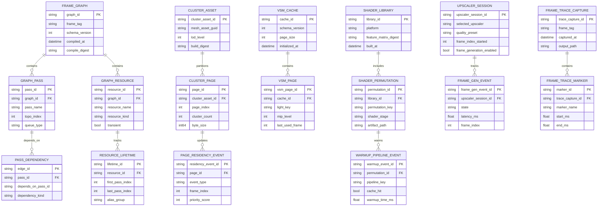
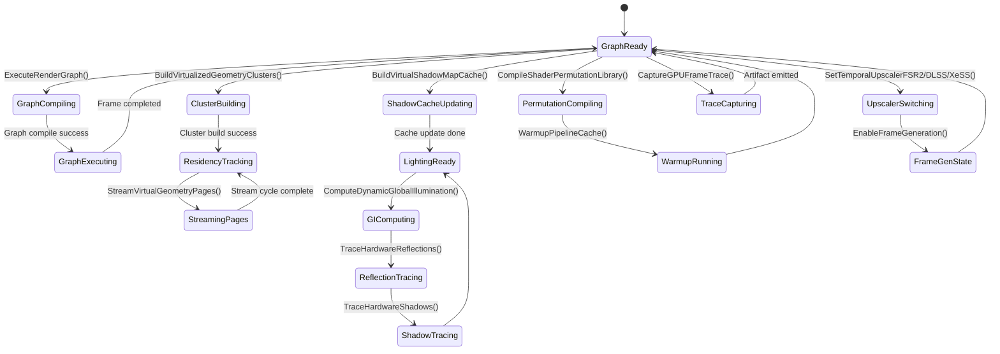

# Phase 24: Render Graph, Virtualized Geometry & Advanced Upscaling

## Implementation Plan

---

## Goal

Phase 24 upgrades the renderer from a pass-by-pass manually orchestrated pipeline into a modern frame graph architecture with virtualized geometry streaming, virtual shadow map residency, hybrid GI/RT lighting, shader permutation precompilation, and production-grade temporal upscaling controls. The implementation is grounded in current engine surfaces (`ForwardPlus`, `ZPrepass`, `ShadowPass`, `TAASystem`, `DynamicResolution`, Vulkan RHI) while closing known capability gaps (`RenderGraph`, virtualized geometry paging, RT reflection/shadow execution wiring, pipeline cache warmup, and GPU frame trace capture). The outcome is a deterministic, data-driven render runtime that can scale quality/performance across hardware tiers without introducing frame hitches or feature-fragmented code paths.

---

## Context Map

### Files to Modify

| File | Purpose | Changes Needed |
|------|---------|----------------|
| `CMakeLists.txt` | Engine compile surface | Register all new Phase 24 modules under `EngineCore`, including render graph, virtual geometry, shadow cache, upscaler adapters, shader permutation library, and frame trace services |
| `Core/RHI/RHIDevice.h` | Core RHI device abstraction | Add explicit APIs needed by render graph execution, pipeline cache warmup, and trace marker control |
| `Core/RHI/RHICommandList.h` | Command recording abstraction | Add resource barrier/marker and pass-scoped execution helpers required by render graph scheduling |
| `Core/RHI/RHIRenderPass.h` | Render pass description model | Extend descriptor metadata for graph pass registration and imported/external resource mapping |
| `Core/RHI/RHITexture.h` | Texture capability declarations | Add flags/metadata needed by transient aliasing, virtual page backing, and upscaler intermediates |
| `Core/RHI/RHIBuffer.h` | Buffer capability declarations | Add flags/metadata for transient allocation, page tables, and visibility feedback buffers |
| `Core/RHI/ShaderCompiler.h` | Shader compile API | Add permutation compile request/response contracts for library build pipeline |
| `Core/RHI/ShaderCompiler.cpp` | Shader compile implementation | Implement deterministic permutation matrix compilation and artifact metadata emission |
| `Core/RHI/ShaderPermutationLibrary.h` (new) | Permutation domain contracts | Define `CompileShaderPermutationLibrary()` request/result schema and permutation key model |
| `Core/RHI/ShaderPermutationLibrary.cpp` (new) | Permutation build service | Implement permutation matrix expansion, compile batching, cache lookup, and artifact write path |
| `Core/RHI/PipelineCacheManager.h` (new) | Runtime warmup contracts | Define `WarmupPipelineCache()` and cache persistence/invalidation policies |
| `Core/RHI/PipelineCacheManager.cpp` (new) | Runtime warmup implementation | Implement warmup job sequencing, hitch-safe pipeline precreation, and runtime cache telemetry |
| `Core/RHI/Vulkan/VulkanContext.h` | Vulkan lifecycle host | Add pipeline cache object ownership, frame trace capture controls, and timestamp marker helpers |
| `Core/RHI/Vulkan/VulkanContext.cpp` | Vulkan frame submission path | Wire warmup cache load/save, queue marker insertion, and frame trace capture trigger integration |
| `Core/RHI/Vulkan/VulkanPipelineState.h` | Vulkan PSO creation surface | Accept non-null pipeline cache handles and pipeline warmup metadata |
| `Core/RHI/Vulkan/VulkanPipelineState.cpp` | Vulkan PSO creation implementation | Route `vkCreateGraphicsPipelines` through cache manager and record warmup hit/miss metrics |
| `Core/RHI/Vulkan/VulkanRayTracing.h` | Vulkan RT extension declarations | Extend interfaces for reflection/shadow/GI frame graph integration and shader table reuse |
| `Core/RHI/Vulkan/VulkanRayTracing.cpp` (new) | Vulkan RT implementation | Implement missing device/command RT bridge used by reflection and shadow tracing sub-steps |
| `Core/Renderer/Mesh.h` | Mesh runtime data model | Add cluster/page metadata for virtualized geometry and material partition references |
| `Core/Renderer/Mesh.cpp` | Mesh import pipeline | Implement cluster build entry points and residency metadata extraction from imported topology |
| `Core/Renderer/ForwardPlus.h` | Existing lighting pass contracts | Add render graph pass registration hooks and graph resource handles |
| `Core/Renderer/ForwardPlus.cpp` | Existing lighting pass implementation | Migrate from direct pass execution to graph-registered execution nodes |
| `Core/Renderer/ZPrepass.h` | Existing depth prepass contracts | Add graph registration metadata and explicit depth resource declarations |
| `Core/Renderer/ZPrepass.cpp` | Existing depth prepass implementation | Route execution through graph runtime and transient depth aliasing contracts |
| `Core/Renderer/ShadowPass.h` | Existing raster shadow pass | Add bridge to virtual shadow map cache and fallback path policy |
| `Core/Renderer/ShadowPass.cpp` | Existing raster shadow implementation | Integrate virtual page cache update flow and per-light quality tier routing |
| `Core/Renderer/TAASystem.h` | Temporal resolve baseline | Add upscaler integration hooks and shared history contracts required by FSR2/DLSS/XeSS |
| `Core/Renderer/TAASystem.cpp` | Temporal resolve implementation | Refactor resolve flow to delegate to selected temporal upscaler backend |
| `Core/Renderer/DynamicResolution.h` | Dynamic resolution config surface | Add explicit API controls for Stage 24 upscaler selectors and frame generation guardrails |
| `Core/Renderer/DynamicResolution.cpp` | Dynamic resolution implementation | Wire quality preset switching and per-upscaler runtime constraints |
| `Core/Renderer/GlobalIllumination.h` | GI abstraction surface | Add `ComputeDynamicGlobalIllumination()` integration points and hybrid SSGI/RT arbitration |
| `Core/Renderer/GlobalIllumination.cpp` (new) | GI implementation | Implement technique selection, history accumulation, and frame graph pass wiring |
| `Core/Renderer/RTReflectionPass.h` | RT reflection contracts | Add `TraceHardwareReflections()` orchestration and fallback blending policy controls |
| `Core/Renderer/RTReflectionPass.cpp` (new) | RT reflection implementation | Implement tracing dispatch, denoise chain, and SSR/cubemap fallback composition |
| `Core/Renderer/RTShadowPass.h` | RT shadow contracts | Add `TraceHardwareShadows()` quality tier and per-light arbitration controls |
| `Core/Renderer/RTShadowPass.cpp` (new) | RT shadow implementation | Implement shadow tracing, denoise path, temporal accumulation, and cache-friendly output |
| `Core/Renderer/RayTracingManager.h` | RT feature gate manager | Add runtime policy hooks for GI/reflection/shadow fallback hierarchy |
| `Core/Renderer/RayTracingManager.cpp` (new) | RT feature gate implementation | Implement hardware capability checks, feature toggles, and adaptive quality governance |
| `Core/Renderer/RenderGraph/RenderGraphTypes.h` (new) | Render graph domain model | Define pass/resource descriptors, access states, alias windows, and diagnostics records |
| `Core/Renderer/RenderGraph/RenderGraphBuilder.h` (new) | Graph registration API | Define `RegisterRenderGraphPass()` contract and validation results |
| `Core/Renderer/RenderGraph/RenderGraphBuilder.cpp` (new) | Graph registration implementation | Implement pass/resource registration, dependency edge generation, and validation |
| `Core/Renderer/RenderGraph/RenderGraphExecutor.h` (new) | Graph execution API | Define `ExecuteRenderGraph()` compile/execute contract and frame outputs |
| `Core/Renderer/RenderGraph/RenderGraphExecutor.cpp` (new) | Graph execution implementation | Implement topological scheduling, barrier synthesis, transient aliasing, and command recording |
| `Core/Renderer/RenderGraph/TransientResourceAllocator.h` (new) | Alias allocator contracts | Define per-frame transient heap/page allocation for graph resources |
| `Core/Renderer/RenderGraph/TransientResourceAllocator.cpp` (new) | Alias allocator implementation | Implement interval coloring and heap reuse across non-overlapping graph resources |
| `Core/Renderer/VirtualGeometry/VirtualGeometryTypes.h` (new) | Virtual geometry model | Define cluster records, page tables, residency sets, and feedback formats |
| `Core/Renderer/VirtualGeometry/VirtualGeometryClusterBuilder.h` (new) | Cluster build API | Define `BuildVirtualizedGeometryClusters()` request/result contracts |
| `Core/Renderer/VirtualGeometry/VirtualGeometryClusterBuilder.cpp` (new) | Cluster build implementation | Build cluster hierarchy and serialized page chunks from mesh topology/material partitions |
| `Core/Renderer/VirtualGeometry/VirtualGeometryStreamingService.h` (new) | Residency stream API | Define `StreamVirtualGeometryPages()` contracts and budget/policy controls |
| `Core/Renderer/VirtualGeometry/VirtualGeometryStreamingService.cpp` (new) | Residency stream implementation | Implement camera-driven page request prioritization, async IO/decode/upload, and LRU eviction |
| `Core/Renderer/VirtualShadows/VirtualShadowMapCache.h` (new) | VSM cache API | Define `BuildVirtualShadowMapCache()` contracts and page residency metadata |
| `Core/Renderer/VirtualShadows/VirtualShadowMapCache.cpp` (new) | VSM cache implementation | Implement per-light page reuse, clipmap page tables, and invalidation controls |
| `Core/Renderer/Upscaling/TemporalUpscalerManager.h` (new) | Upscaler policy surface | Define selector APIs for FSR2/DLSS/XeSS and frame generation governance |
| `Core/Renderer/Upscaling/TemporalUpscalerManager.cpp` (new) | Upscaler manager implementation | Implement `SetTemporalUpscalerFSR2()`, `SetTemporalUpscalerDLSS()`, `SetTemporalUpscalerXeSS()` orchestration |
| `Core/Renderer/Upscaling/FrameGenerationController.h` (new) | Frame generation API | Define `EnableFrameGeneration()` controls, latency guardrails, and fallback policies |
| `Core/Renderer/Upscaling/FrameGenerationController.cpp` (new) | Frame generation implementation | Implement frame generation enablement pipeline, constraints, and runtime telemetry |
| `Core/Renderer/Diagnostics/GPUFrameTraceService.h` (new) | Trace capture API | Define `CaptureGPUFrameTrace()` request/result schema and artifact metadata |
| `Core/Renderer/Diagnostics/GPUFrameTraceService.cpp` (new) | Trace capture implementation | Implement GPU marker/timestamp capture, artifact export, and triage-friendly metadata |
| `Core/ECS/Systems/RenderSystem.cpp` | Draw command producer | Integrate virtualized geometry page residency checks and fallback mesh path behavior |
| `Core/ECS/Systems/SkeletalRenderSystem.cpp` | Skeletal draw path | Preserve compatibility when render graph resource handles replace direct pass pointers |
| `Core/ECS/Systems/LightSystem.h` | Light data model | Extend light metadata needed by VSM cache and RT shadow tier decisions |
| `Core/ECS/Systems/LightSystem.cpp` | Light data extraction | Emit per-light quality tier hints and shadow cache keys for Stage 24 lighting path |
| `Core/UI/ImGuiSubsystem.h` | Runtime diagnostics contracts | Add render graph, virtual geometry residency, upscaler, and frame trace panel models |
| `Core/UI/ImGuiSubsystem.cpp` | Runtime diagnostics UI | Add debug panels for graph DAG view, page residency, cache warmup stats, and trace export |
| `Core/Application.h` | Runtime orchestration contract | Add high-level Stage 24 renderer configuration hooks and optional diagnostics toggles |
| `Core/Application.cpp` | Frame loop orchestration | Integrate render graph execution, upscaler selection, and trace capture lifecycle boundaries |
| `src/main.cpp` | Runtime startup profile | Add optional CLI flags for warmup mode, upscaler preference, and trace capture trigger |

### Dependencies (may need updates)

| File | Relationship |
|------|--------------|
| `Core/Renderer/FrustumCulling.h` + `.cpp` | Existing visibility/culling output is the baseline signal for virtual geometry page request prioritization |
| `Core/Renderer/GPUSkinning.h` + `.cpp` | Skeletal paths must remain compatible with graph-managed resource bindings and transient buffers |
| `Core/Asset/AssetLoader.h` + `.cpp` | Virtual geometry page streamer should reuse existing asset IO/decode entry points where possible |
| `Core/Asset/AssetPipeline.h` + `.cpp` | Cluster/page artifacts should align with existing cook manifest and dependency registration conventions |
| `Core/JobSystem/JobSystem.h` + `.cpp` | Cluster build, permutation compile, and page streaming jobs should run through existing worker infrastructure |
| `Core/RHI/Vulkan/VulkanBuffer.h` + `.cpp` | Transient resource allocator and page table buffers require robust Vulkan allocation pathways |
| `Core/RHI/Vulkan/VulkanTexture.h` + `.cpp` | Virtual page-backed textures and upscaler intermediates rely on texture creation usage flags and views |
| `Core/Renderer/PostProcess/PostProcessManager.h` + `.cpp` | Upscaler output and frame generation inserts must preserve post-process ordering and compositing behavior |
| `Core/UI/UIManager.h` + `.cpp` | Stage 24 diagnostics panel state should route through existing UI subsystem orchestration flow |
| `Core/Profile.h` | Frame graph pass markers and trace annotations should reuse existing profiling macro conventions |

### Test Files

| Test | Coverage |
|------|----------|
| `Core/Tests/Renderer/RenderGraphRegistrationTests.cpp` (new) | `RegisterRenderGraphPass()` resource declaration validation and dependency edge correctness |
| `Core/Tests/Renderer/RenderGraphExecutionTests.cpp` (new) | `ExecuteRenderGraph()` topological scheduling, barrier ordering, and transient aliasing correctness |
| `Core/Tests/Renderer/RenderGraphDeterminismTests.cpp` (new) | Stable graph compile order across repeated runs with identical inputs |
| `Core/Tests/Renderer/VirtualGeometryClusterBuildTests.cpp` (new) | `BuildVirtualizedGeometryClusters()` cluster partitioning, bounds generation, and page layout determinism |
| `Core/Tests/Renderer/VirtualGeometryStreamingTests.cpp` (new) | `StreamVirtualGeometryPages()` request prioritization, residency updates, and eviction policy behavior |
| `Core/Tests/Renderer/VirtualShadowMapCacheTests.cpp` (new) | `BuildVirtualShadowMapCache()` page reuse, invalidation, and per-light cache key behavior |
| `Core/Tests/Renderer/HybridGITests.cpp` (new) | `ComputeDynamicGlobalIllumination()` hybrid SSGI/RT arbitration and fallback correctness |
| `Core/Tests/Renderer/RTReflectionTraceTests.cpp` (new) | `TraceHardwareReflections()` denoise chain and SSR/cubemap fallback blending behavior |
| `Core/Tests/Renderer/RTShadowTraceTests.cpp` (new) | `TraceHardwareShadows()` per-light quality tiers and denoise stability |
| `Core/Tests/RHI/ShaderPermutationLibraryTests.cpp` (new) | `CompileShaderPermutationLibrary()` matrix expansion, compile caching, and artifact metadata correctness |
| `Core/Tests/RHI/PipelineWarmupTests.cpp` (new) | `WarmupPipelineCache()` precreation ordering and hitch-prevention behavior |
| `Core/Tests/Renderer/UpscalerSelectionTests.cpp` (new) | `SetTemporalUpscalerFSR2()`, `SetTemporalUpscalerDLSS()`, `SetTemporalUpscalerXeSS()` selector and preset behavior |
| `Core/Tests/Renderer/FrameGenerationTests.cpp` (new) | `EnableFrameGeneration()` latency guardrails, fallback transitions, and state consistency |
| `Core/Tests/Renderer/GPUFrameTraceCaptureTests.cpp` (new) | `CaptureGPUFrameTrace()` artifact output and marker/timestamp integrity |
| `Core/Tests/Integration/Stage24EndToEndRendererTests.cpp` (new) | Render graph + virtual geometry + RT lighting + upscaling end-to-end frame execution |

### Reference Patterns

| File | Pattern |
|------|---------|
| `Core/Renderer/ForwardPlus.cpp` | Existing render-pass setup and resource creation conventions for migration into graph pass registration |
| `Core/Renderer/ZPrepass.cpp` | Existing depth pass lifecycle and resize behavior that should map into graph resources |
| `Core/Renderer/ShadowPass.cpp` | Existing directional shadow flow and matrix update pattern for VSM integration |
| `Core/Renderer/TAASystem.h` + `.cpp` | Current temporal accumulation model used as baseline for upscaler handoff |
| `Core/Renderer/DynamicResolution.h` + `.cpp` | Current resolution/adaptation policy and upscaler enum baseline |
| `Core/RHI/ShaderCompiler.cpp` | Existing shader compile pipeline and error reporting conventions |
| `Core/RHI/Vulkan/VulkanPipelineState.cpp` | Existing pipeline creation flow to extend with warmup/pipeline cache usage |
| `Core/RHI/Vulkan/VulkanContext.cpp` | Existing frame submission lifecycle for trace markers and capture integration |
| `Core/ECS/Systems/RenderSystem.cpp` | Draw command generation model to augment with virtual geometry residency checks |
| `docs/plans/phase-23-addressable-assets-bundles-hot-content-delivery/implementation-plan.md` | Required plan depth/structure baseline |

### Risk Assessment

- [x] Breaking changes to public API
- [x] Database migrations needed (logical render metadata schema versioning)
- [x] Configuration changes required (`CMakeLists.txt`, optional vendor upscaler SDK toggles, diagnostics feature flags)

---

## Requirements

### Render Graph Runtime (Step 24.1)

- Implement `RegisterRenderGraphPass()` with declarative read/write resource declarations, access intent, and explicit pass dependencies.
- Implement `ExecuteRenderGraph()` with deterministic topological scheduling, barrier synthesis, and transient resource aliasing.
- Support graph-imported external resources (swapchain, history buffers, UI outputs) and explicit lifetime boundaries.
- Provide graph validation errors for cycles, unresolved resources, invalid state transitions, and write-after-write hazards.
- Preserve compatibility with existing renderer pass classes while they migrate incrementally to graph registration.
- Emit graph diagnostics (compiled pass order, alias map, barrier list) for debugging and trace capture correlation.

### Virtualized Geometry Streaming (Step 24.2)

- Implement `BuildVirtualizedGeometryClusters()` from imported mesh topology and material partitions with deterministic output.
- Implement `StreamVirtualGeometryPages()` with camera-driven residency scoring, async page loading, upload staging, and LRU eviction.
- Maintain fallback rendering path for non-virtualized meshes and incomplete residency windows.
- Integrate visibility feedback into residency requests using frustum/camera/velocity context.
- Expose streaming budgets (memory/page count/upload bandwidth) and throttling controls.
- Ensure page residency transitions are safe across frame boundaries and do not invalidate active draw commands.

### Modern Shadow/GI + RT Fallback Hierarchy (Step 24.3)

- Implement `BuildVirtualShadowMapCache()` with page reuse, invalidation, and per-light clipmap management.
- Implement `ComputeDynamicGlobalIllumination()` using hybrid SSGI/RT routing based on hardware support and runtime budget.
- Implement `TraceHardwareReflections()` with denoise and fallback blending (SSR/cubemap hierarchy).
- Implement `TraceHardwareShadows()` with per-light quality tiers and robust raster fallback integration.
- Define explicit fallback arbitration rules when RT features are unsupported, disabled, or over-budget.
- Ensure GI/reflection/shadow history buffers are synchronized with render graph resource lifetimes.

### Shader Permutations + Pipeline Warmup (Step 24.4)

- Implement `CompileShaderPermutationLibrary()` for platform/material/feature matrices with deterministic key generation.
- Implement `WarmupPipelineCache()` to precreate critical pipeline variants and minimize runtime hitching.
- Persist warmup cache artifacts with schema/version metadata and invalidation rules tied to shader/library changes.
- Add staged warmup modes (`startup`, `background`, `on-demand`) with configurable frame-time budgets.
- Ensure failed permutation compilations emit actionable diagnostics and do not poison cache state.
- Integrate warmup telemetry into runtime diagnostics for hit/miss and compile latency visibility.

### Temporal Upscaling + Frame Generation + Diagnostics (Step 24.5)

- Implement `SetTemporalUpscalerFSR2()` integration path and quality presets.
- Implement `SetTemporalUpscalerDLSS()` integration path and quality presets.
- Implement `SetTemporalUpscalerXeSS()` integration path and quality presets.
- Implement `EnableFrameGeneration()` with latency guardrails, unsupported-hardware fallback, and deterministic toggling behavior.
- Implement `CaptureGPUFrameTrace()` with pass-level markers, timing metadata, and exportable artifacts for regression triage.
- Keep upscaler/frame generation mode transitions safe across dynamic resolution and TAA history boundaries.

---

## Technical Considerations

### System Architecture Overview

```mermaid
graph TD
    subgraph Frontend Layer
        RenderPanel[Render Graph Diagnostics Panel]
        VGPanel[Virtual Geometry Residency Panel]
        RTPanel[RT GI and Shadows Panel]
        UpscalePanel[Upscaler and Frame Generation Panel]
        TracePanel[GPU Frame Trace Capture Panel]
    end

    subgraph API Layer
        GraphAPI[Render Graph API]
        VGAPI[Virtual Geometry API]
        LightingAPI[Hybrid Lighting API]
        ShaderAPI[Shader Permutation and Warmup API]
        UpscaleAPI[Temporal Upscaler API]
        TraceAPI[GPU Frame Trace API]
    end

    subgraph Business Logic Layer
        GraphBuilder[RenderGraphBuilder]
        GraphExecutor[RenderGraphExecutor]
        TransientAlloc[TransientResourceAllocator]
        ClusterBuilder[VirtualGeometryClusterBuilder]
        PageStreamer[VirtualGeometryStreamingService]
        ShadowCache[VirtualShadowMapCache]
        HybridGI[GlobalIllumination Hybrid Service]
        RTReflections[RTReflectionPass]
        RTShadows[RTShadowPass]
        PermLib[ShaderPermutationLibraryService]
        WarmupSvc[PipelineCacheWarmupService]
        UpscaleMgr[TemporalUpscalerManager]
        FrameGen[FrameGenerationController]
        TraceSvc[GPUFrameTraceService]
    end

    subgraph Data Layer
        GraphDesc[Frame Graph Descriptor]
        AliasMap[Transient Alias Map]
        ClusterDB[Cluster and Page Artifacts]
        ResidencyState[Page Residency State]
        VSMState[VSM Page Cache State]
        PermStore[Permutation Artifact Store]
        PipelineCache[Pipeline Cache Store]
        UpscaleState[Upscaler Runtime State]
        TraceStore[Frame Trace Artifact Store]
    end

    subgraph Infrastructure Layer
        RHIDevice[RHIDevice and RHICommandList]
        VulkanCore[VulkanContext and VulkanPipelineState]
        RTDevice[VulkanRayTracing and RHIRayTracing]
        ECSRender[RenderSystem and LightSystem]
        TAAPath[TAASystem and DynamicResolution]
        AssetIO[AssetLoader and AssetPipeline]
        JobSys[JobSystem]
        AppLoop[Application Main Loop]
        UI[ImGuiSubsystem and UIManager]
    end

    RenderPanel --> GraphAPI
    VGPanel --> VGAPI
    RTPanel --> LightingAPI
    UpscalePanel --> UpscaleAPI
    TracePanel --> TraceAPI

    GraphAPI --> GraphBuilder
    GraphAPI --> GraphExecutor
    GraphAPI --> TransientAlloc
    VGAPI --> ClusterBuilder
    VGAPI --> PageStreamer
    LightingAPI --> ShadowCache
    LightingAPI --> HybridGI
    LightingAPI --> RTReflections
    LightingAPI --> RTShadows
    ShaderAPI --> PermLib
    ShaderAPI --> WarmupSvc
    UpscaleAPI --> UpscaleMgr
    UpscaleAPI --> FrameGen
    TraceAPI --> TraceSvc

    GraphBuilder --> GraphDesc
    GraphExecutor --> AliasMap
    ClusterBuilder --> ClusterDB
    PageStreamer --> ResidencyState
    ShadowCache --> VSMState
    PermLib --> PermStore
    WarmupSvc --> PipelineCache
    UpscaleMgr --> UpscaleState
    FrameGen --> UpscaleState
    TraceSvc --> TraceStore

    GraphExecutor --> RHIDevice
    WarmupSvc --> VulkanCore
    TraceSvc --> VulkanCore
    RTReflections --> RTDevice
    RTShadows --> RTDevice
    HybridGI --> RTDevice
    PageStreamer --> AssetIO
    ClusterBuilder --> AssetIO
    GraphExecutor --> ECSRender
    UpscaleMgr --> TAAPath
    FrameGen --> TAAPath
    AppLoop --> GraphExecutor
    JobSys --> PermLib
    JobSys --> PageStreamer
    JobSys --> WarmupSvc
    UI --> RenderPanel
    UI --> VGPanel
    UI --> RTPanel
    UI --> UpscalePanel
    UI --> TracePanel
```



### Technology Stack Selection

| Layer | Technology | Rationale |
|-------|------------|-----------|
| Frontend | Existing Dear ImGui diagnostics panel framework | Matches current runtime tooling and avoids UI architecture drift |
| API | C++ typed service interfaces with deterministic request/result contracts | Aligns with existing engine architecture and supports clear runtime governance |
| Business Logic | Dedicated Phase 24 services under `Core/Renderer/*` and `Core/RHI/*` | Isolates complex rendering features and avoids overloading existing pass classes |
| Data | Versioned JSON/binary metadata for graph diagnostics, cluster/page artifacts, warmup cache, and trace outputs | Keeps tooling outputs diffable and migration-aware |
| Infrastructure | Existing Vulkan backend, RHI abstractions, JobSystem, AssetPipeline | Reuses established subsystems and minimizes duplicate infrastructure |

### Integration Points

- **Pass migration integration:** Existing pass classes (`ForwardPlus`, `ZPrepass`, `ShadowPass`, post-process passes) become graph-registered nodes without losing current behavior.
- **Resource lifetime integration:** Graph alias allocator controls texture/buffer lifetimes to reduce memory while preserving pass safety.
- **Visibility integration:** Existing frustum and scene visibility outputs feed virtual geometry page request prioritization.
- **Lighting integration:** `LightSystem` outputs drive VSM cache page updates and RT shadow quality routing.
- **Temporal integration:** `TAASystem` and `DynamicResolution` are refactored into a pluggable upscaler backend model.
- **RHI integration:** Vulkan pipeline creation and command recording paths are extended for pipeline cache warmup and trace markers.
- **Diagnostics integration:** `ImGuiSubsystem` exposes frame graph execution order, page residency, warmup hit-rate, and trace capture controls.

### Deployment Architecture

```text
Core/
├── RHI/
│   ├── RHIDevice.h                                 # Stage 24 graph/warmup/trace extensions
│   ├── RHICommandList.h                            # Barrier and marker APIs for graph execution
│   ├── ShaderCompiler.h/.cpp                       # Permutation compile baseline extensions
│   ├── ShaderPermutationLibrary.h/.cpp             # New permutation build service
│   ├── PipelineCacheManager.h/.cpp                 # New pipeline warmup/cache service
│   └── Vulkan/
│       ├── VulkanContext.h/.cpp                    # Pipeline cache ownership + trace capture integration
│       ├── VulkanPipelineState.h/.cpp              # Cache-aware pipeline creation
│       ├── VulkanRayTracing.h/.cpp                 # RT implementation bridge for Stage 24 passes
│       ├── VulkanBuffer.h/.cpp                     # Transient/page-table buffer support
│       └── VulkanTexture.h/.cpp                    # Page-backed texture support
├── Renderer/
│   ├── RenderGraph/
│   │   ├── RenderGraphTypes.h
│   │   ├── RenderGraphBuilder.h/.cpp               # RegisterRenderGraphPass
│   │   ├── RenderGraphExecutor.h/.cpp              # ExecuteRenderGraph
│   │   └── TransientResourceAllocator.h/.cpp
│   ├── VirtualGeometry/
│   │   ├── VirtualGeometryTypes.h
│   │   ├── VirtualGeometryClusterBuilder.h/.cpp    # BuildVirtualizedGeometryClusters
│   │   └── VirtualGeometryStreamingService.h/.cpp  # StreamVirtualGeometryPages
│   ├── VirtualShadows/
│   │   └── VirtualShadowMapCache.h/.cpp            # BuildVirtualShadowMapCache
│   ├── Upscaling/
│   │   ├── TemporalUpscalerManager.h/.cpp          # SetTemporalUpscalerFSR2/DLSS/XeSS
│   │   └── FrameGenerationController.h/.cpp        # EnableFrameGeneration
│   ├── Diagnostics/
│   │   └── GPUFrameTraceService.h/.cpp             # CaptureGPUFrameTrace
│   ├── GlobalIllumination.h/.cpp                   # ComputeDynamicGlobalIllumination
│   ├── RTReflectionPass.h/.cpp                     # TraceHardwareReflections
│   ├── RTShadowPass.h/.cpp                         # TraceHardwareShadows
│   ├── TAASystem.h/.cpp                            # Upscaler backend integration
│   ├── DynamicResolution.h/.cpp                    # Quality presets and runtime scaling policy
│   └── Mesh.h/.cpp                                 # Cluster metadata extraction baseline
├── ECS/
│   └── Systems/
│       ├── RenderSystem.cpp                        # Virtual geometry residency-aware draw command emission
│       ├── SkeletalRenderSystem.cpp                # Graph-safe skeletal render integration
│       └── LightSystem.h/.cpp                      # VSM/RT tier metadata emission
├── UI/
│   ├── ImGuiSubsystem.h/.cpp                       # Stage 24 diagnostics panels
│   └── UIManager.h/.cpp                            # Tooling orchestration hooks
└── Application.h/.cpp                              # Stage 24 runtime orchestration boundaries
```

### Scalability Considerations

- **Graph complexity scale:** Support large graph sizes (100+ passes, 1000+ resources) with deterministic compile times and cached compile artifacts.
- **Memory scale:** Use transient aliasing and virtual page residency budgets to avoid unbounded memory growth at high scene density.
- **Permutation scale:** Prevent combinatorial explosion with feature-matrix pruning and compile-cache reuse.
- **Streaming scale:** Separate page request scoring from IO/upload execution to keep main-thread overhead bounded.
- **Quality scale:** Allow tiered feature sets (low-end raster fallback to high-end RT + frame generation) without divergent code forks.
- **Diagnostics scale:** Keep telemetry collection lightweight and defer heavy export formatting to explicit capture requests.

---

## Database Schema Design

> This phase does not introduce an RDBMS. The model below defines logical records persisted in graph diagnostics, virtual geometry metadata, warmup artifacts, and frame trace outputs.

### Render Graph + Virtual Geometry + Warmup Data Model



### Table Specifications

| Logical Table | Critical Fields | Constraints |
|---------------|-----------------|------------|
| `FRAME_GRAPH` | `graph_id`, `compile_digest` | Compile digest must uniquely identify graph layout and resource declarations |
| `GRAPH_PASS` | `graph_id`, `topo_index`, `queue_type` | `topo_index` must be unique per graph; queue type must be supported by backend |
| `GRAPH_RESOURCE` | `resource_name`, `resource_kind`, `transient` | Resource names unique per graph scope |
| `PASS_DEPENDENCY` | `pass_id`, `depends_on_pass_id` | No self-dependency; graph must remain acyclic |
| `RESOURCE_LIFETIME` | `first_pass_index`, `last_pass_index`, `alias_group` | `first <= last`; aliased resources cannot overlap lifetimes |
| `CLUSTER_PAGE` | `cluster_asset_id`, `page_index`, `byte_size` | Deterministic page index ordering and non-zero size |
| `PAGE_RESIDENCY_EVENT` | `page_id`, `frame_index`, `priority_score` | Event sequence per page must be monotonic by frame index |
| `VSM_PAGE` | `light_key`, `mip_level`, `last_used_frame` | Unique `(cache_id, light_key, mip_level, page coord)` identity |
| `SHADER_PERMUTATION` | `permutation_key`, `shader_stage`, `artifact_path` | Permutation key unique per library and stage |
| `WARMUP_PIPELINE_EVENT` | `pipeline_key`, `cache_hit`, `warmup_time_ms` | Warmup events should map to known permutation IDs |
| `UPSCALER_SESSION` | `selected_upscaler`, `quality_preset` | Upscaler must be one of supported backends for active hardware |
| `FRAME_TRACE_MARKER` | `marker_name`, `start_ms`, `end_ms` | Marker intervals must be non-negative and ordered |

### Indexing Strategy

- Graph pass lookup index: `(graph_id, topo_index)`
- Graph resource lookup index: `(graph_id, resource_name)`
- Dependency reverse lookup index: `(depends_on_pass_id, pass_id)`
- Cluster page lookup index: `(cluster_asset_id, page_index)`
- Residency timeline index: `(page_id, frame_index DESC)`
- VSM hot-page lookup index: `(cache_id, light_key, last_used_frame DESC)`
- Permutation lookup index: `(library_id, permutation_key, shader_stage)`
- Warmup summary index: `(pipeline_key, cache_hit, warmup_time_ms)`
- Upscaler state index: `(frame_generation_enabled, selected_upscaler, frame_index_started DESC)`
- Trace marker lookup index: `(trace_capture_id, start_ms)`

### Foreign Key Relationships

- `GRAPH_PASS.graph_id -> FRAME_GRAPH.graph_id`
- `GRAPH_RESOURCE.graph_id -> FRAME_GRAPH.graph_id`
- `PASS_DEPENDENCY.pass_id -> GRAPH_PASS.pass_id`
- `RESOURCE_LIFETIME.resource_id -> GRAPH_RESOURCE.resource_id`
- `CLUSTER_PAGE.cluster_asset_id -> CLUSTER_ASSET.cluster_asset_id`
- `PAGE_RESIDENCY_EVENT.page_id -> CLUSTER_PAGE.page_id`
- `VSM_PAGE.cache_id -> VSM_CACHE.cache_id`
- `SHADER_PERMUTATION.library_id -> SHADER_LIBRARY.library_id`
- `WARMUP_PIPELINE_EVENT.permutation_id -> SHADER_PERMUTATION.permutation_id`
- `FRAME_GEN_EVENT.upscaler_session_id -> UPSCALER_SESSION.upscaler_session_id`
- `FRAME_TRACE_MARKER.trace_capture_id -> FRAME_TRACE_CAPTURE.trace_capture_id`

### Database Migration Strategy

- Version all logical artifact schemas (`graph`, `cluster pages`, `shader library`, `trace`) independently.
- Keep backward-compatible readers for at least one prior schema version per artifact family.
- Tie invalidation to explicit digest keys (`shader source hash`, `feature matrix hash`, `render graph schema version`).
- Record migration provenance (`fromSchema`, `toSchema`, `adapterId`) in warmup and trace metadata logs.

---

## API Design

### Stage 24 Runtime API Surface (C++)

```cpp
namespace Core::Renderer {

struct RenderGraphPassRegistration;
struct RenderGraphPassHandle;
struct RenderGraphExecutionContext;
struct RenderGraphExecutionReport;

struct VirtualGeometryClusterBuildRequest;
struct VirtualGeometryClusterBuildResult;
struct VirtualGeometryStreamRequest;
struct VirtualGeometryStreamResult;

struct VirtualShadowCacheBuildRequest;
struct VirtualShadowCacheBuildResult;
struct DynamicGIRequest;
struct DynamicGIResult;
struct ReflectionTraceRequest;
struct ReflectionTraceResult;
struct ShadowTraceRequest;
struct ShadowTraceResult;

struct ShaderPermutationLibraryRequest;
struct ShaderPermutationLibraryResult;
struct PipelineWarmupRequest;
struct PipelineWarmupResult;

struct TemporalUpscalerFSR2Config;
struct TemporalUpscalerDLSSConfig;
struct TemporalUpscalerXeSSConfig;
struct FrameGenerationConfig;
struct FrameGenerationResult;

struct GPUFrameTraceRequest;
struct GPUFrameTraceArtifact;

// Step 24.1
Result<RenderGraphPassHandle> RegisterRenderGraphPass(
    const RenderGraphPassRegistration& registration);
Result<RenderGraphExecutionReport> ExecuteRenderGraph(
    const RenderGraphExecutionContext& context);

// Step 24.2
Result<VirtualGeometryClusterBuildResult> BuildVirtualizedGeometryClusters(
    const VirtualGeometryClusterBuildRequest& request);
Result<VirtualGeometryStreamResult> StreamVirtualGeometryPages(
    const VirtualGeometryStreamRequest& request);

// Step 24.3
Result<VirtualShadowCacheBuildResult> BuildVirtualShadowMapCache(
    const VirtualShadowCacheBuildRequest& request);
Result<DynamicGIResult> ComputeDynamicGlobalIllumination(
    const DynamicGIRequest& request);
Result<ReflectionTraceResult> TraceHardwareReflections(
    const ReflectionTraceRequest& request);
Result<ShadowTraceResult> TraceHardwareShadows(
    const ShadowTraceRequest& request);

// Step 24.4
Result<ShaderPermutationLibraryResult> CompileShaderPermutationLibrary(
    const ShaderPermutationLibraryRequest& request);
Result<PipelineWarmupResult> WarmupPipelineCache(
    const PipelineWarmupRequest& request);

// Step 24.5
Result<void> SetTemporalUpscalerFSR2(
    const TemporalUpscalerFSR2Config& config);
Result<void> SetTemporalUpscalerDLSS(
    const TemporalUpscalerDLSSConfig& config);
Result<void> SetTemporalUpscalerXeSS(
    const TemporalUpscalerXeSSConfig& config);
Result<FrameGenerationResult> EnableFrameGeneration(
    const FrameGenerationConfig& config);
Result<GPUFrameTraceArtifact> CaptureGPUFrameTrace(
    const GPUFrameTraceRequest& request);

} // namespace Core::Renderer
```

### Request/Response Contracts (Tooling JSON Types)

```ts
type RegisterRenderGraphPassRequest = {
  passName: string;
  queue: "graphics" | "compute" | "transfer";
  reads: Array<{ resource: string; state: string }>;
  writes: Array<{ resource: string; state: string }>;
  dependsOn?: string[];
  importedResources?: string[];
};

type ExecuteRenderGraphRequest = {
  frameTag: string;
  allowTransientAliasing: boolean;
  emitDiagnostics: boolean;
  maxCompileBudgetMs?: number;
};

type BuildVirtualizedGeometryClustersRequest = {
  meshAssetGuids: string[];
  maxClusterTriangles: number;
  materialPartitioning: "strict" | "merge-compatible";
  targetPageSizeBytes: number;
};

type StreamVirtualGeometryPagesRequest = {
  cameraPosition: [number, number, number];
  cameraVelocity: [number, number, number];
  viewProjection: number[];
  maxPagesToStreamIn: number;
  maxPagesToEvict: number;
  memoryBudgetMB: number;
};

type BuildVirtualShadowMapCacheRequest = {
  pageSize: number;
  clipmapLevels: number;
  maxResidentPages: number;
  invalidationMode: "conservative" | "aggressive";
};

type ComputeDynamicGlobalIlluminationRequest = {
  techniquePreference: "ssgi" | "rtgi" | "hybrid";
  quality: "low" | "medium" | "high" | "ultra";
  maxFrameBudgetMs: number;
};

type TraceHardwareReflectionsRequest = {
  quality: "low" | "medium" | "high" | "ultra";
  fallback: "ssr" | "cubemap" | "hybrid";
  maxRayDistance: number;
  samplesPerPixel: number;
};

type TraceHardwareShadowsRequest = {
  globalQuality: "off" | "low" | "medium" | "high" | "ultra";
  maxLightsWithRTShadows: number;
  temporalAccumulation: boolean;
};

type CompileShaderPermutationLibraryRequest = {
  platform: "windows";
  materialFeatures: string[];
  rendererFeatures: string[];
  optimizationLevel: "debug" | "release";
};

type WarmupPipelineCacheRequest = {
  mode: "startup" | "background" | "on-demand";
  warmupList: string[];
  perFrameBudgetMs: number;
  persistCache: boolean;
};

type SetTemporalUpscalerFSR2Request = {
  quality: "quality" | "balanced" | "performance" | "ultra-performance";
  sharpness: number;
};

type SetTemporalUpscalerDLSSRequest = {
  quality: "quality" | "balanced" | "performance" | "ultra-performance";
  autoExposure: boolean;
};

type SetTemporalUpscalerXeSSRequest = {
  quality: "ultra-quality" | "quality" | "balanced" | "performance";
  jitterResponsiveMask: boolean;
};

type EnableFrameGenerationRequest = {
  enabled: boolean;
  maxAddedLatencyMs: number;
  fallbackOnInputSpike: boolean;
};

type CaptureGPUFrameTraceRequest = {
  frameCount: number;
  includeMarkers: boolean;
  includePipelineStats: boolean;
  outputPath: string;
};
```

### Authentication and Authorization

- Stage 24 APIs are engine-local by default and do not require identity tokens.
- If surfaced via MCP/editor tooling, gate mutating operations by capability scopes (`renderer.graph.modify`, `renderer.streaming.control`, `renderer.trace.capture`).
- Keep trace capture and warmup controls read-only or disabled in restricted runtime profiles.
- Require explicit runtime feature flags for vendor SDK-dependent upscaler and frame generation controls.

### Error Handling Strategies

| Error Code | Scenario | Strategy |
|-----------|----------|----------|
| `RENDER_GRAPH_CYCLE_DETECTED` | `RegisterRenderGraphPass()` introduces cyclic dependency | Reject registration and emit cycle path diagnostics |
| `RENDER_GRAPH_RESOURCE_UNDECLARED` | Graph pass references unknown resource | Fail graph compile with pass/resource context |
| `RENDER_GRAPH_ALIAS_CONFLICT` | `ExecuteRenderGraph()` attempts invalid overlapping aliasing | Disable alias group and continue with isolated allocation (with warning) |
| `VIRTUAL_GEOMETRY_CLUSTER_BUILD_FAILED` | `BuildVirtualizedGeometryClusters()` fails topology partitioning | Fail request and keep original mesh path active |
| `VIRTUAL_GEOMETRY_PAGE_BUDGET_EXCEEDED` | `StreamVirtualGeometryPages()` cannot satisfy residency budget | Prioritize visible pages, defer lower-priority requests, emit telemetry |
| `VSM_CACHE_INVALIDATION_STORM` | `BuildVirtualShadowMapCache()` invalidates too many pages per frame | Throttle invalidation and fallback to raster shadow path |
| `RT_FEATURE_UNAVAILABLE` | `TraceHardwareReflections()` or `TraceHardwareShadows()` requested without RT support | Route to fallback hierarchy and report capability reason |
| `SHADER_PERMUTATION_COMPILE_FAILED` | `CompileShaderPermutationLibrary()` fails one or more variants | Return partial result with failure list; do not activate broken library |
| `PIPELINE_WARMUP_TIMEOUT` | `WarmupPipelineCache()` exceeds frame budget | Defer remaining pipelines to subsequent frames |
| `UPSCALER_BACKEND_UNAVAILABLE` | Requested FSR2/DLSS/XeSS backend missing or disabled | Keep current backend and return typed failure |
| `FRAME_GENERATION_LATENCY_GUARDRAIL` | `EnableFrameGeneration()` would exceed allowed latency | Reject enable request and keep frame generation disabled |
| `FRAME_TRACE_CAPTURE_FAILED` | `CaptureGPUFrameTrace()` cannot allocate capture resources | Return failure with cleanup and artifact path diagnostics |

### Rate Limiting and Caching Strategies

- Cache compiled graph plans by `(graphSignature, renderResolution, featureSet)`.
- Cache cluster build artifacts by `(meshAssetGuid, lodLevel, buildSettingsDigest)`.
- Coalesce duplicate page stream requests by `(pageId, residencyEpoch)` per frame.
- Cache RT fallback decisions by `(hardwareCaps, qualityPreset, frameBudgetTier)`.
- Cache permutation compile results by `(platform, shaderHash, permutationKey)`.
- Rate-limit trace capture to avoid repeated heavy captures during the same diagnostics window.

---

## Frontend Architecture

### Component Hierarchy Documentation

```text
Renderer Diagnostics Workspace
├── Render Graph Panel
│   ├── Graph Node Timeline
│   ├── Barrier and Alias Inspector
│   └── Pass Duration Breakdown
├── Virtual Geometry Panel
│   ├── Cluster Build Summary
│   ├── Page Residency Heatmap
│   ├── Streaming Queue Inspector
│   └── Budget and Eviction Monitor
├── Lighting and Shadows Panel
│   ├── VSM Cache Residency View
│   ├── Hybrid GI Mode Inspector
│   ├── RT Reflection Metrics
│   └── RT Shadow Tier Inspector
├── Upscaling Panel
│   ├── Upscaler Backend Selector
│   ├── Quality Preset Controls
│   ├── Frame Generation State
│   └── Latency Guardrail Meter
└── GPU Trace Panel
    ├── Capture Trigger Controls
    ├── Marker Timeline Preview
    └── Artifact Export Browser
```

### State Flow Diagram



### Reusable Component Library Specifications

| UI Element | Reuse Strategy |
|-----------|-----------------|
| Timeline widget | Shared between graph pass timings and frame trace marker timeline |
| Heatmap widget | Shared between virtual geometry residency and VSM cache residency panels |
| Queue inspector table | Shared for stream queue, warmup queue, and trace capture queue display |
| Preset selector control | Shared across upscaler quality, RT quality, and GI quality controls |
| Diagnostics event journal | Shared for graph validation warnings, stream policy events, and trace capture status |

### State Management Patterns

- Central `RendererModernizationState` stores graph compile report, residency state, warmup progress, upscaler selection, and trace status.
- Keep graph compile outputs immutable for the duration of a frame.
- Event topics:
  - `RenderGraphCompiled`
  - `RenderGraphExecuted`
  - `VirtualGeometryClustersBuilt`
  - `VirtualGeometryPagesStreamed`
  - `VirtualShadowMapCacheUpdated`
  - `DynamicGIComputed`
  - `HardwareReflectionsTraced`
  - `HardwareShadowsTraced`
  - `ShaderPermutationLibraryCompiled`
  - `PipelineCacheWarmupProgress`
  - `TemporalUpscalerChanged`
  - `FrameGenerationStateChanged`
  - `GPUFrameTraceCaptured`
- Deterministic update order:
  1. Resolve configuration changes (upscaler/quality toggles)
  2. Process stream and warmup job completions
  3. Compile/execute render graph
  4. Apply lighting and upscaling outputs
  5. Publish diagnostics snapshot

### Type Definitions (C++)

```cpp
struct RendererModernizationState {
    RenderGraphExecutionReport LastGraphReport;
    VirtualGeometryStreamResult LastStreamResult;
    VirtualShadowCacheBuildResult LastShadowCacheResult;
    PipelineWarmupResult WarmupStatus;
    std::string ActiveUpscaler;
    bool FrameGenerationEnabled = false;
    std::vector<RendererDiagnosticsEvent> RecentEvents;
};

struct RendererDiagnosticsEvent {
    std::string EventName;
    std::string Severity;
    std::string Details;
    uint64_t FrameIndex = 0;
};
```

---

## Security & Performance

### Authentication/Authorization Requirements

- Keep mutating Stage 24 controls disabled by default in shipping/restricted profiles.
- Separate read-only diagnostics from mutating controls (warmup, stream policy, trace capture).
- Require explicit runtime capability checks before enabling vendor-specific upscalers and frame generation.

### Data Validation and Sanitization

- Validate render graph resource declarations before graph compile.
- Validate cluster/page artifact schema and checksums before stream activation.
- Validate VSM page table bounds and light cache keys before writes.
- Validate permutation matrix inputs to prevent invalid shader stage combinations.
- Validate trace output paths and write permissions before capture start.

### Performance Optimization Strategies

| Technique | Target | Implementation |
|-----------|--------|----------------|
| Cached graph compile plans | Reduce per-frame graph compile overhead | Hash graph descriptors and reuse compiled execution plans |
| Transient resource aliasing | Lower peak memory usage | Lifetime interval coloring with non-overlap enforcement |
| Priority-driven page streaming | Keep visible geometry resident | Camera-centric scoring with deferred low-priority page loads |
| Incremental VSM invalidation | Avoid full shadow cache rebuilds | Per-light page invalidation windows and clipmap partial updates |
| Permutation compile pruning | Prevent compile explosion | Filter unused feature combos before compile dispatch |
| Warmup frame budgeting | Prevent warmup stalls | Budgeted per-frame warmup batches and deferred queueing |
| Upscaler transition guards | Avoid temporal artifacts during backend switch | History reset/synchronization and staged backend handoff |
| Scoped trace capture | Minimize runtime capture overhead | Capture only requested frames/markers and stream output incrementally |

### Caching Mechanisms

- Render graph compile cache keyed by `(graphSignature, resolution, featureMask)`.
- Virtual geometry page cache keyed by `(meshGuid, lodLevel, pageId)`.
- VSM page cache keyed by `(lightKey, clipLevel, pageCoord)`.
- Permutation artifact cache keyed by `(platform, permutationKey, shaderHash)`.
- Pipeline warmup cache keyed by `(pipelineKey, renderPassSignature, deviceFingerprint)`.
- Upscaler backend capability cache keyed by `(deviceVendor, driverVersion, backendName)`.

### Performance Budget

| System | Budget Goal |
|--------|-------------|
| Render graph compile (cached plan hit) | <= 0.3 ms |
| Render graph compile (cold plan) | <= 2.0 ms |
| Virtual geometry stream management | <= 1.0 ms main-thread overhead |
| Virtual page upload scheduling | <= 2.0 ms CPU scheduling overhead |
| VSM cache update | <= 1.5 ms average (bounded by quality tier) |
| GI + reflection + shadow tracing overhead | Configurable tier budget, default <= 6.0 ms at medium |
| Warmup per-frame budget | <= 1.0 ms in runtime mode |
| Upscaler switch transition | <= 1 frame controlled reset window |
| Frame generation latency overhead | Must remain below configured guardrail |
| GPU frame trace capture trigger cost | <= 0.5 ms control overhead (capture cost isolated to requested window) |

---

## Detailed Step Breakdown

### Step 24.1: Move pass scheduling to an explicit render graph architecture

#### Sub-step 24.1.1: `RegisterRenderGraphPass()` (v0.24.1.1)
- Introduce `RenderGraphBuilder` service and pass registration contracts:
  1. Register pass name, queue type, callback, and debug label.
  2. Declare read/write resources with expected access states.
  3. Declare explicit pass dependencies and imported resources.
- Add validation checks during registration:
  - Duplicate pass IDs.
  - Missing resources.
  - Invalid access combinations.
  - Direct cycle candidates.
- Provide pass handle output for deterministic downstream references.
- **Deliverable**: Declarative pass registration API with strict validation and deterministic identifiers.

#### Sub-step 24.1.2: `ExecuteRenderGraph()` (v0.24.1.2)
- Implement graph compile/execution pipeline:
  1. Build DAG and run topological sort.
  2. Compute resource lifetimes and alias intervals.
  3. Generate barriers and queue synchronization edges.
  4. Allocate transient resources and bind imported externals.
  5. Record pass callbacks to command lists in sorted order.
- Add deterministic compile digest generation for diagnostics and cache lookup.
- Emit execution report including pass order, barrier count, alias savings, and pass timings.
- **Deliverable**: Deterministic graph execution runtime with transient aliasing and explicit synchronization.

#### Sub-step 24.1.3: Graph Validation Tooling + Diagnostics Export (v0.24.1.3)
- Add graph export (`json`) of pass/resource DAG and resolved scheduling.
- Add graph validation diagnostics for UI display and frame trace correlation.
- Add optional strict mode that fails on ambiguous ordering or undeclared side effects.
- **Deliverable**: Production-ready graph introspection and failure diagnostics workflow.

---

### Step 24.2: Build virtualized geometry streaming path (Nanite-class capability target)

#### Sub-step 24.2.1: `BuildVirtualizedGeometryClusters()` (v0.24.2.1)
- Add cluster build pipeline to mesh import/runtime tooling:
  1. Partition mesh primitives by material boundaries.
  2. Build triangle clusters under configured triangle/vertex budgets.
  3. Compute cluster bounds and error metrics for hierarchical selection.
  4. Pack clusters into deterministic virtual pages.
- Persist cluster/page metadata for runtime streamer lookup.
- Add compatibility path to keep non-clusterized meshes renderable.
- **Deliverable**: Deterministic cluster/page artifact build path integrated with mesh import data.

#### Sub-step 24.2.2: `StreamVirtualGeometryPages()` (v0.24.2.2)
- Implement camera-driven residency stream loop:
  1. Gather visibility and camera motion context.
  2. Score candidate pages by projected importance.
  3. Enqueue page loads and GPU uploads by priority.
  4. Evict least-recently-used pages under memory pressure.
- Add stream-safe synchronization so page transitions do not invalidate active draw state.
- Add budget controls for memory, upload bandwidth, and per-frame stream operations.
- **Deliverable**: Runtime page residency management with deterministic prioritization and bounded resource usage.

#### Sub-step 24.2.3: Residency Telemetry + Failure Recovery (v0.24.2.3)
- Emit structured residency events (page requested, loaded, promoted, evicted, failed).
- Add fallback rendering behavior for missing pages (coarse LOD/placeholder).
- Add diagnostics panel for page heatmap, queue pressure, and budget saturation.
- **Deliverable**: Observable and recoverable virtual geometry runtime behavior.

---

### Step 24.3: Add modern shadow/GI and hardware RT fallback hierarchy

#### Sub-step 24.3.1: `BuildVirtualShadowMapCache()` (v0.24.3.1)
- Implement virtual shadow map page cache service:
  1. Build per-light clipmap page tables.
  2. Allocate/update only invalidated pages.
  3. Track page reuse and invalidation causes.
- Integrate with existing `ShadowPass` raster path as source/fallback.
- Expose per-light cache occupancy and invalidation diagnostics.
- **Deliverable**: High-density shadow page cache with deterministic update and reuse strategy.

#### Sub-step 24.3.2: `ComputeDynamicGlobalIllumination()` (v0.24.3.2)
- Implement hybrid GI orchestration:
  1. Evaluate hardware capability and frame budget.
  2. Choose SSGI, RTGI, or hybrid composition path.
  3. Execute GI pass and temporal accumulation.
- Integrate with existing `GlobalIllumination` configuration model and history textures.
- Add fallback policies when RT features are unavailable or budget-constrained.
- **Deliverable**: Runtime GI solver with deterministic quality/fallback arbitration.

#### Sub-step 24.3.3: `TraceHardwareReflections()` (v0.24.3.3)
- Implement reflection trace execution path:
  1. Build/validate RT pipeline and SBT.
  2. Dispatch reflection rays by quality preset.
  3. Run denoise and temporal accumulation.
  4. Blend fallback sources (SSR/cubemap) on misses or low confidence.
- Add per-material override support and reflection performance telemetry.
- **Deliverable**: Hardware reflection tracing with denoise and robust fallback blending.

#### Sub-step 24.3.4: `TraceHardwareShadows()` (v0.24.3.4)
- Implement RT shadow tracing path:
  1. Route per-light quality tiers and sample counts.
  2. Dispatch trace pass and temporal stabilization.
  3. Denoise and combine with raster shadow fallback.
- Enforce max RT-shadowed light count budget with deterministic downgrade behavior.
- **Deliverable**: Hardware shadow tracing with per-light tier control and fallback stability.

#### Sub-step 24.3.5: Unified Hybrid Lighting Policy Governor (v0.24.3.5)
- Add policy layer coordinating GI/reflection/shadow quality vs frame budget.
- Apply deterministic downgrade order under pressure (`RT shadows -> reflections -> GI complexity`).
- Emit policy transition events for diagnostics and regression triage.
- **Deliverable**: Stable, budget-aware hybrid lighting governance.

---

### Step 24.4: Harden shader compilation and runtime warmup behavior

#### Sub-step 24.4.1: `CompileShaderPermutationLibrary()` (v0.24.4.1)
- Implement permutation matrix builder:
  1. Enumerate platform/material/feature variants.
  2. Prune invalid and unused combinations.
  3. Compile permutations in deterministic order.
  4. Emit artifact metadata and digest.
- Add compile-cache lookup and incremental rebuild support.
- Track compile failures with per-permutation diagnostics and severity.
- **Deliverable**: Deterministic permutation library build system with cache-aware incremental behavior.

#### Sub-step 24.4.2: `WarmupPipelineCache()` (v0.24.4.2)
- Implement pipeline warmup queue:
  1. Build warmup candidate list from permutation library and known pass usage.
  2. Precreate pipelines using Vulkan pipeline cache handle.
  3. Apply frame-budgeted warmup in runtime mode.
- Add warmup hit/miss telemetry and completion status reporting.
- **Deliverable**: Runtime warmup service that minimizes first-use pipeline hitches.

#### Sub-step 24.4.3: Pipeline Cache Persistence + Invalidation Policy (v0.24.4.3)
- Persist cache artifacts with device fingerprint and schema version metadata.
- Invalidate caches on shader hash mismatch, driver fingerprint mismatch, or schema incompatibility.
- Add safe fallback path when cache load fails or warmup entries are stale.
- **Deliverable**: Reliable cache persistence model with explicit invalidation governance.

---

### Step 24.5: Add modern temporal upscaling + frame generation controls

#### Sub-step 24.5.1: `SetTemporalUpscalerFSR2()` (v0.24.5.1)
- Implement FSR2 backend adapter and configuration bridge.
- Map quality presets to scale factors and sharpening policy.
- Synchronize jitter/history requirements with existing `TAASystem`.
- **Deliverable**: FSR2 selection and runtime quality control path.

#### Sub-step 24.5.2: `SetTemporalUpscalerDLSS()` (v0.24.5.2)
- Implement DLSS backend adapter and capability checks.
- Map quality presets and exposure configuration to runtime state.
- Add safe fallback if DLSS backend unavailable at runtime.
- **Deliverable**: DLSS selection and runtime quality control path with graceful fallback.

#### Sub-step 24.5.3: `SetTemporalUpscalerXeSS()` (v0.24.5.3)
- Implement XeSS backend adapter and quality mapping.
- Integrate jitter/motion-vector contract with shared temporal pipeline.
- Add compatibility fallback and diagnostics on unsupported hardware.
- **Deliverable**: XeSS selection and runtime quality control path with deterministic behavior.

#### Sub-step 24.5.4: `EnableFrameGeneration()` (v0.24.5.4)
- Implement frame generation control service:
  1. Validate backend support and input latency guardrail.
  2. Enable/disable frame generation state transitions safely.
  3. Route fallback on latency spikes or backend failures.
- Expose guardrail telemetry (`added latency`, `fallback reason`, `active state`).
- **Deliverable**: Controlled frame generation runtime with safety-first fallback logic.

#### Sub-step 24.5.5: `CaptureGPUFrameTrace()` (v0.24.5.5)
- Implement frame trace capture service:
  1. Inject pass-level GPU markers and timestamps.
  2. Capture selected frame window metadata.
  3. Export trace artifact with pass/resource summary.
- Correlate trace markers with render graph pass IDs and warmup events.
- **Deliverable**: Actionable GPU frame trace artifacts for diagnostics and regression triage.

#### Sub-step 24.5.6: Runtime Upscaler/Framegen Policy Coordination (v0.24.5.6)
- Add unified runtime policy for upscaler and frame generation transitions.
- Enforce deterministic state transitions and history resets when backend changes.
- Add diagnostics panel controls and event logs for policy transitions.
- **Deliverable**: Stable runtime quality control loop across upscaling and frame generation features.

---

## Dependencies

### External Libraries

- `nlohmann_json` for diagnostics/metadata serialization (graph diagnostics, warmup reports, trace artifacts).
- `shaderc` (already integrated) for shader permutation compilation.
- Optional vendor SDK integrations for advanced upscalers/frame generation:
  - AMD FSR2 integration layer
  - NVIDIA NGX/DLSS integration layer
  - Intel XeSS integration layer
- Vulkan extension support through existing Vulkan SDK for timing/marker and RT operations.

### Internal Dependencies

- `Core/RHI/RHIDevice.h`
- `Core/RHI/RHICommandList.h`
- `Core/RHI/ShaderCompiler.h` + `Core/RHI/ShaderCompiler.cpp`
- `Core/RHI/Vulkan/VulkanContext.h` + `Core/RHI/Vulkan/VulkanContext.cpp`
- `Core/RHI/Vulkan/VulkanPipelineState.h` + `Core/RHI/Vulkan/VulkanPipelineState.cpp`
- `Core/RHI/RHIRayTracing.h`
- `Core/Renderer/Mesh.h` + `Core/Renderer/Mesh.cpp`
- `Core/Renderer/ForwardPlus.h` + `Core/Renderer/ForwardPlus.cpp`
- `Core/Renderer/ZPrepass.h` + `Core/Renderer/ZPrepass.cpp`
- `Core/Renderer/ShadowPass.h` + `Core/Renderer/ShadowPass.cpp`
- `Core/Renderer/TAASystem.h` + `Core/Renderer/TAASystem.cpp`
- `Core/Renderer/DynamicResolution.h` + `Core/Renderer/DynamicResolution.cpp`
- `Core/Renderer/GlobalIllumination.h`
- `Core/Renderer/RTReflectionPass.h`
- `Core/Renderer/RTShadowPass.h`
- `Core/Renderer/RayTracingManager.h`
- `Core/ECS/Systems/RenderSystem.cpp`
- `Core/ECS/Systems/SkeletalRenderSystem.cpp`
- `Core/ECS/Systems/LightSystem.h` + `Core/ECS/Systems/LightSystem.cpp`
- `Core/UI/ImGuiSubsystem.h` + `Core/UI/ImGuiSubsystem.cpp`
- `Core/Application.h` + `Core/Application.cpp`
- `CMakeLists.txt`

### Integration Requirements

- Add all new Stage 24 source files to `EngineCore` in `CMakeLists.txt` (explicit source list is required).
- Keep RT and vendor upscaler integrations behind capability/feature toggles with deterministic fallback behavior.
- Preserve compatibility between legacy pass execution and graph-based execution during migration.
- Resolve namespace split (`Core::Renderer` vs `AIEngine::Rendering`) through a single canonical namespace policy plus compatibility shim during transition.

---

## Testing Strategy

### Unit Tests

| Test | Description |
|------|-------------|
| `RenderGraph_RegisterRenderGraphPass_RejectsCycles` | Ensures cyclic dependencies are rejected with actionable diagnostics |
| `RenderGraph_RegisterRenderGraphPass_ValidatesResourceDeclarations` | Ensures undeclared/invalid resource access is reported |
| `RenderGraph_ExecuteRenderGraph_DeterministicTopoOrder` | Ensures stable pass order for identical graph input |
| `RenderGraph_ExecuteRenderGraph_ValidTransientAliasing` | Ensures aliasing only occurs for non-overlapping lifetimes |
| `VirtualGeometry_BuildVirtualizedGeometryClusters_DeterministicLayout` | Ensures deterministic cluster/page output for identical meshes |
| `VirtualGeometry_StreamVirtualGeometryPages_PriorityAndBudgetCompliance` | Ensures stream decisions respect visibility priority and budgets |
| `VirtualShadow_BuildVirtualShadowMapCache_PageReuseAndInvalidation` | Ensures cache reuse and controlled invalidation behavior |
| `GI_ComputeDynamicGlobalIllumination_HybridFallbackRouting` | Ensures correct SSGI/RTGI routing under capability constraints |
| `RT_TraceHardwareReflections_FallbackBlendCorrectness` | Ensures SSR/cubemap fallback blending behaves as configured |
| `RT_TraceHardwareShadows_PerLightTierSelection` | Ensures per-light quality tier routing and fallback correctness |
| `Shader_CompileShaderPermutationLibrary_PrunesInvalidCombos` | Ensures invalid feature combinations are removed before compile |
| `Shader_WarmupPipelineCache_RespectsFrameBudget` | Ensures runtime warmup does not exceed per-frame budget cap |
| `Upscaler_SetTemporalUpscalerFSR2_QualityPresetMapping` | Ensures FSR2 quality presets map to expected runtime configuration |
| `Upscaler_SetTemporalUpscalerDLSS_FallbackOnUnavailableBackend` | Ensures graceful fallback when DLSS backend is unavailable |
| `Upscaler_SetTemporalUpscalerXeSS_HistorySync` | Ensures XeSS transition synchronizes temporal history correctly |
| `FrameGeneration_EnableFrameGeneration_LatencyGuardrail` | Ensures frame generation enablement honors latency thresholds |
| `Trace_CaptureGPUFrameTrace_ExportsMarkersAndTiming` | Ensures capture artifacts include expected marker/timestamp content |

### Integration Tests

| Test | Description |
|------|-------------|
| `Stage24_RenderGraphMigrationFlow` | Existing pass chain migrated to graph registration executes with parity |
| `Stage24_VirtualGeometryTraversal` | Camera traversal drives page stream-in/out under memory budget |
| `Stage24_HybridLightingFallback` | GI/reflection/shadow routing degrades deterministically when RT disabled |
| `Stage24_PermutationWarmupAndFirstUse` | Warmup avoids first-use pipeline hitch on representative frame |
| `Stage24_UpscalerSwitchRuntime` | Runtime switches across FSR2/DLSS/XeSS remain stable |
| `Stage24_FrameGenerationPolicy` | Frame generation toggles under latency pressure with expected fallback |
| `Stage24_GPUFrameTraceTriageFlow` | Captured trace artifacts correlate graph passes and warmup events |
| `Stage24_EndToEndModernFrame` | Render graph + virtual geometry + hybrid lighting + upscaler full-frame run |

### Tooling/Operational Validation

- Validate diagnostics panels show graph compile report, alias savings, and barrier summary per frame.
- Validate virtual geometry panel shows stream queue pressure, residency coverage, and eviction causes.
- Validate warmup panel reports queue progress, cache hit-rate, and invalidation reasons.
- Validate trace panel produces export artifacts with pass-level timing and marker correlation.

---

## Risk Mitigation

- **Graph migration regression risk:** Keep dual-path execution switch during migration and parity-check key frame outputs.
- **Memory pressure risk from virtual pages:** Enforce hard residency budgets with deterministic LRU eviction and fallback meshes.
- **RT inconsistency risk across hardware:** Centralize capability checks and fallback arbitration in one policy layer.
- **Permutation explosion risk:** Prune feature matrix aggressively and cache compile artifacts by deterministic keys.
- **Warmup stall risk:** Budget warmup work per frame and defer long-tail variants to background queue.
- **Upscaler transition artifact risk:** Force controlled history reset/reseed on backend switch.
- **Frame generation latency risk:** Enforce latency guardrails and auto-fallback on input/latency spikes.
- **Observability gap risk:** Require structured diagnostics events and trace-correlation IDs for all Stage 24 subsystems.

---

## Milestones

1. **Milestone 1: Render graph foundation complete**  
   `RegisterRenderGraphPass()` + `ExecuteRenderGraph()` + graph diagnostics export.
2. **Milestone 2: Virtual geometry pipeline complete**  
   `BuildVirtualizedGeometryClusters()` + `StreamVirtualGeometryPages()` + residency tooling.
3. **Milestone 3: Modern shadow/GI/RT hierarchy complete**  
   `BuildVirtualShadowMapCache()` + `ComputeDynamicGlobalIllumination()` + `TraceHardwareReflections()` + `TraceHardwareShadows()`.
4. **Milestone 4: Shader library and warmup complete**  
   `CompileShaderPermutationLibrary()` + `WarmupPipelineCache()` + cache persistence policy.
5. **Milestone 5: Temporal upscaler backend integration complete**  
   `SetTemporalUpscalerFSR2()` + `SetTemporalUpscalerDLSS()` + `SetTemporalUpscalerXeSS()`.
6. **Milestone 6: Frame generation and trace diagnostics complete**  
   `EnableFrameGeneration()` + `CaptureGPUFrameTrace()` + runtime policy/telemetry controls.

---

## References

- `engine_roadmap.md` (Phase 24 scope and required function targets)
- `modern_engine_missing_functions.md` (rendering parity function gap set)
- `CMakeLists.txt`
- `Core/Renderer/Mesh.h` + `Core/Renderer/Mesh.cpp`
- `Core/Renderer/ForwardPlus.h` + `Core/Renderer/ForwardPlus.cpp`
- `Core/Renderer/ZPrepass.h` + `Core/Renderer/ZPrepass.cpp`
- `Core/Renderer/ShadowPass.h` + `Core/Renderer/ShadowPass.cpp`
- `Core/Renderer/TAASystem.h` + `Core/Renderer/TAASystem.cpp`
- `Core/Renderer/DynamicResolution.h` + `Core/Renderer/DynamicResolution.cpp`
- `Core/Renderer/GlobalIllumination.h`
- `Core/Renderer/RTReflectionPass.h`
- `Core/Renderer/RTShadowPass.h`
- `Core/Renderer/RayTracingManager.h`
- `Core/RHI/RHIDevice.h`
- `Core/RHI/RHICommandList.h`
- `Core/RHI/ShaderCompiler.h` + `Core/RHI/ShaderCompiler.cpp`
- `Core/RHI/RHIRayTracing.h`
- `Core/RHI/Vulkan/VulkanContext.h` + `Core/RHI/Vulkan/VulkanContext.cpp`
- `Core/RHI/Vulkan/VulkanPipelineState.h` + `Core/RHI/Vulkan/VulkanPipelineState.cpp`
- `Core/RHI/Vulkan/VulkanRayTracing.h`
- `Core/ECS/Systems/RenderSystem.cpp`
- `Core/ECS/Systems/SkeletalRenderSystem.cpp`
- `Core/ECS/Systems/LightSystem.h` + `Core/ECS/Systems/LightSystem.cpp`
- `Core/UI/ImGuiSubsystem.h` + `Core/UI/ImGuiSubsystem.cpp`
- `docs/plans/phase-23-addressable-assets-bundles-hot-content-delivery/implementation-plan.md`
