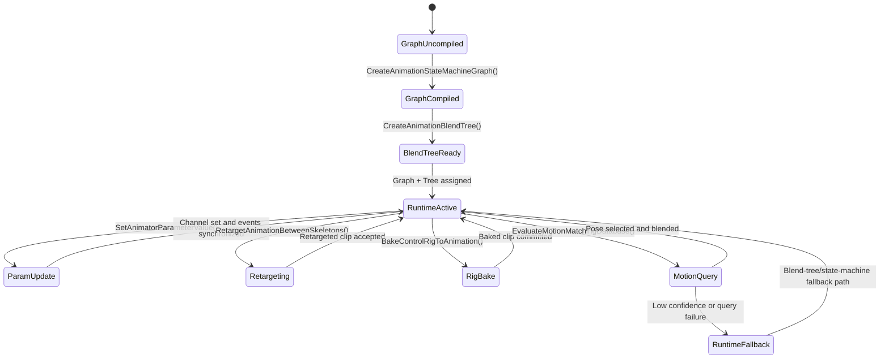

# Phase 25: Animation Runtime 2.0, Rig Retargeting & Motion Matching

## Implementation Plan

---

## Goal

Phase 25 upgrades the current animation runtime from a mostly clip/state-driven evaluator into a modern graph-authored animation stack with robust retargeting, procedural rig bake, and data-driven motion matching. The implementation builds on existing engine surfaces (`AnimatorComponent`, `AnimatorSystem`, `IKSystem`, `SkeletalMeshComponent`, `Mesh` skeletal import, and MCP animation tools), while closing key capability gaps: graph-level authoring/runtime compilation, typed parameter channels with deterministic event sync, cross-skeleton retarget profiles, control-rig-to-clip bake workflows, and fast pose-search locomotion selection. The target outcome is a deterministic, scalable animation runtime that supports gameplay, tools, and cinematic workflows through explicit APIs and versioned data contracts.

---

## Context Map

### Files to Modify

| File | Purpose | Changes Needed |
|------|---------|----------------|
| `CMakeLists.txt` | Engine compile surface | Add all new Stage 25 animation modules to `EngineCore` and keep include/link surfaces deterministic |
| `Core/ECS/Components/AnimatorComponent.h` | Runtime animation state data model | Extend state-machine structure to graph-native model (node/edge metadata, layered graph IDs, typed parameter channels, event routing metadata) |
| `Core/ECS/Components/SkeletalMeshComponent.h` | Skeletal playback state container | Add runtime fields required by motion-matching selection and retarget output tracking (feature-cache handle, selected pose ID, trajectory history handle) |
| `Core/ECS/Components/IKComponent.h` | Procedural rig baseline | Add optional control-rig channel bindings and bake-track export toggles to bridge IK/control-rig bake workflows |
| `Core/ECS/Systems/AnimatorSystem.h` | Animator orchestration API | Integrate graph-evaluation entrypoints and motion-matching query/update hooks |
| `Core/ECS/Systems/AnimatorSystem.cpp` | Animator orchestration implementation | Replace per-state-only orchestration path with graph-compiled execution; integrate typed parameter channels and motion-matching selector integration |
| `Core/ECS/Systems/IKSystem.h` | IK orchestration contract | Add optional control-rig solve stage boundaries and deterministic ordering guarantees relative to animator/motion matching |
| `Core/ECS/Systems/IKSystem.cpp` | IK orchestration implementation | Provide explicit pre-bake and post-bake solve capture hooks for control-rig-to-animation workflows |
| `Core/ECS/Systems/SkeletalRenderSystem.h` | Skeletal update/render boundary | Add explicit runtime mode flags to avoid double-evaluation conflicts when graph runtime is authoritative |
| `Core/ECS/Systems/SkeletalRenderSystem.cpp` | Skeletal update/render implementation | Gate legacy `EvaluateAnimation` path when graph runtime owns pose generation; retain skinning upload behavior |
| `Core/Renderer/Mesh.h` | Skeleton/clip model | Add retarget metadata support (rest-pose normalization descriptors, optional bone-role tags) and motion-feature extraction helpers |
| `Core/Renderer/Mesh.cpp` | Skeleton/clip import implementation | Populate optional role metadata and stabilize channel ordering required by retargeting/motion database build |
| `Core/Asset/AssetTypes.h` | Asset taxonomy | Extend `AssetType` with Stage 25 animation artifacts (graph asset, retarget profile, control rig asset, motion database asset) plus header metadata |
| `Core/Asset/AssetCooker.h` | Cooker interfaces and manifest model | Add Stage 25 cooker contracts and manifest metadata for graph, retarget profile, control-rig bake, and motion matching database artifacts |
| `Core/Asset/AssetCooker.cpp` | Cooking implementation | Implement deterministic cook/serialize path for new Stage 25 asset types and feature-index artifacts |
| `Core/Asset/AssetPipeline.h` | Dependency orchestration | Add dependency registration helpers for graph->clip, profile->skeleton, and motion-db->clip link graphs |
| `Core/Asset/AssetPipeline.cpp` | Dependency orchestration implementation | Track reverse dependencies for animation graph/re-target/motion DB reindex workflows and hot-reload invalidation |
| `Core/Asset/AssetLoader.h` | Runtime asset loading contract | Add typed load interfaces for graph/profile/control-rig/motion database assets |
| `Core/Asset/AssetLoader.cpp` | Runtime asset loading implementation | Add validated deserialization and version checks for new Stage 25 binary/json artifacts |
| `Core/MCP/MCPAnimationTools.h` | MCP animation tooling surface | Add tool actions for graph creation/update, typed parameter set, retarget profile application, and motion-matching diagnostics |
| `Core/MCP/SceneSerialization.h` | Scene serialization schema | Add missing schema + serialization coverage for `AnimatorComponent`, `SkeletalMeshComponent`, `IKComponent`, and Stage 25 graph/profile references |
| `Core/MCP/MCPSceneTools.h` | Scene edit/import workflow | Extend spawn/modify/import/export workflows to preserve animation graph/profile/control-rig metadata |
| `Core/UI/ImGuiSubsystem.h` | Runtime diagnostics model | Add Stage 25 animation runtime panel data contracts (graph state, retarget status, pose-search telemetry) |
| `Core/UI/ImGuiSubsystem.cpp` | Runtime diagnostics UI | Add debug panels for graph node state, parameter channel timeline, retarget map validity, and motion-search scores |
| `Core/Animation/AnimationRuntimeTypes.h` (new) | Shared Stage 25 domain types | Define common request/result structs, IDs, version fields, and diagnostics payloads |
| `Core/Animation/Graph/AnimationStateMachineGraph.h` (new) | Graph runtime contract | Define `CreateAnimationStateMachineGraph()` build request/graph representation/runtime handles |
| `Core/Animation/Graph/AnimationStateMachineGraph.cpp` (new) | Graph runtime implementation | Compile authored state/transition declarations into deterministic runtime execution graph |
| `Core/Animation/Graph/AnimationGraphValidator.h` (new) | Graph validation | Validate cycles, missing states, invalid transitions, and unsupported layered graph relationships |
| `Core/Animation/Graph/AnimationGraphValidator.cpp` (new) | Graph validation implementation | Emit actionable diagnostics for build-time and runtime graph invalid states |
| `Core/Animation/Blend/AnimationBlendTreeBuilder.h` (new) | Blend tree construction contract | Define `CreateAnimationBlendTree()` input/output models including directional locomotion and additive overlays |
| `Core/Animation/Blend/AnimationBlendTreeBuilder.cpp` (new) | Blend tree construction implementation | Build and normalize 1D/2D/additive blend tree nodes with deterministic weight computation |
| `Core/Animation/Blend/BlendTreeEvaluationCache.h` (new) | Runtime blend cache | Cache active node sets and parameter-space neighbor search results |
| `Core/Animation/Blend/BlendTreeEvaluationCache.cpp` (new) | Runtime blend cache implementation | Maintain per-entity blend-tree evaluation cache to reduce repeated search overhead |
| `Core/Animation/Parameters/AnimatorParameterChannel.h` (new) | Typed parameter channel contract | Define `SetAnimatorParameterValue()` requests, channel typing rules, event synchronization semantics |
| `Core/Animation/Parameters/AnimatorParameterChannel.cpp` (new) | Typed parameter channel implementation | Validate and apply parameter updates deterministically; trigger transition/event sync integration |
| `Core/Animation/Events/AnimationEventSynchronizer.h` (new) | Event sync API | Route parameter-driven event triggers, state enter/exit callbacks, and timeline event emission with frame-order guarantees |
| `Core/Animation/Events/AnimationEventSynchronizer.cpp` (new) | Event sync implementation | Implement deterministic event queue and one-shot trigger reset semantics |
| `Core/Animation/Retarget/RetargetTypes.h` (new) | Retargeting data model | Define profile, bone-map template, chain rules, root-scale policy, and validation metadata |
| `Core/Animation/Retarget/RetargetProfile.h` (new) | Retarget profile API | Define profile creation/load/validation interfaces for authorable retarget templates |
| `Core/Animation/Retarget/RetargetProfile.cpp` (new) | Retarget profile implementation | Implement profile validation, canonicalization, and serialization |
| `Core/Animation/Retarget/AnimationRetargeter.h` (new) | Retarget execution contract | Define `RetargetAnimationBetweenSkeletons()` and associated result diagnostics |
| `Core/Animation/Retarget/AnimationRetargeter.cpp` (new) | Retarget execution implementation | Apply per-bone mapping, coordinate-space conversion, scale compensation, and root-motion propagation |
| `Core/Animation/ControlRig/ControlRigTypes.h` (new) | Control-rig domain model | Define rig channels, constraints, control curves, and bake settings |
| `Core/Animation/ControlRig/ControlRigRuntime.h` (new) | Control-rig solve contract | Define rig evaluation interfaces and transform channel outputs consumable by bake runtime |
| `Core/Animation/ControlRig/ControlRigRuntime.cpp` (new) | Control-rig solve implementation | Evaluate controls/constraints in deterministic order and emit per-bone transform curves |
| `Core/Animation/ControlRig/ControlRigBaker.h` (new) | Rig bake contract | Define `BakeControlRigToAnimation()` request/result model and artifact emission |
| `Core/Animation/ControlRig/ControlRigBaker.cpp` (new) | Rig bake implementation | Sample control-rig outputs, bake to clip channels, reduce keys, and emit import/export-safe animation assets |
| `Core/Animation/MotionMatching/MotionMatchingDatabase.h` (new) | Motion DB model | Define pose records, feature vectors, trajectory metadata, and index layouts |
| `Core/Animation/MotionMatching/MotionMatchingDatabase.cpp` (new) | Motion DB implementation | Build/load/validate pose database and cache-friendly runtime data layout |
| `Core/Animation/MotionMatching/PoseFeatureExtractor.h` (new) | Feature extraction contract | Define extraction of joint-space, velocity, contact, and trajectory features from clips |
| `Core/Animation/MotionMatching/PoseFeatureExtractor.cpp` (new) | Feature extraction implementation | Generate normalized feature vectors and per-pose annotations for runtime lookup |
| `Core/Animation/MotionMatching/MotionMatchingRuntime.h` (new) | Runtime query contract | Define `EvaluateMotionMatchingDatabase()` API and candidate scoring/ranking result models |
| `Core/Animation/MotionMatching/MotionMatchingRuntime.cpp` (new) | Runtime query implementation | Evaluate nearest-pose search, continuity penalties, and blend-in selection decisions |
| `Core/Animation/MotionMatching/MotionSearchIndex.h` (new) | Search index abstraction | Define pluggable nearest-neighbor index (brute-force baseline + optional accelerated backend) |
| `Core/Animation/MotionMatching/MotionSearchIndex.cpp` (new) | Search index implementation | Implement deterministic candidate retrieval and configurable search budget controls |
| `Core/Animation/MotionMatching/TrajectoryPredictor.h` (new) | Query trajectory helper | Predict short-horizon trajectory features for motion-search query construction |
| `Core/Animation/MotionMatching/TrajectoryPredictor.cpp` (new) | Query trajectory implementation | Compute future trajectory samples from input velocity/heading with deterministic filtering |

### Dependencies (may need updates)

| File | Relationship |
|------|--------------|
| `Core/ECS/Systems/AnimatorSystem.cpp` | Current state machine + blend-tree orchestration is the primary baseline to migrate into graph runtime execution |
| `Core/ECS/Components/AnimatorComponent.h` | Existing parameter/state/layer model anchors backward-compatible Stage 25 graph and parameter-channel evolution |
| `Core/ECS/Systems/IKSystem.cpp` | Existing procedural solve order must integrate with control-rig bake and runtime graph evaluation sequencing |
| `Core/ECS/Systems/SkeletalRenderSystem.cpp` | Current `AutoUpdate` evaluation path must avoid pose conflicts when Stage 25 graph runtime becomes authoritative |
| `Core/Renderer/Mesh.cpp` | Existing skeleton/animation GLTF loading order and channel parsing are prerequisites for retarget and motion database build |
| `Core/Asset/AssetPipeline.cpp` | Existing dependency graph and manifest surfaces should be reused for graph/profile/motion database dependency tracking |
| `Core/Asset/AssetLoader.cpp` | Existing validated cooked-asset loading path should be reused for Stage 25 artifact deserialization |
| `Core/MCP/MCPAnimationTools.h` | Existing parameter/state/IK tooling is the baseline for expanded graph/retarget/motion tooling controls |
| `Core/MCP/SceneSerialization.h` | Currently omits animator/skeletal/IK component serialization; Stage 25 requires full schema coverage for data-authored animation workflows |
| `Core/UI/ImGuiSubsystem.cpp` | Existing runtime diagnostics panels should host Stage 25 graph and motion-matching telemetry |
| `Core/JobSystem/JobSystem.h` + `.cpp` | Motion database build/indexing and control-rig bake jobs should use current worker infrastructure |
| `Core/Security/PathValidator.h` | New Stage 25 artifact IO (profiles, graph assets, motion DB) should retain validated path guarantees |

### Test Files

| Test | Coverage |
|------|----------|
| `Core/Tests/Animation/AnimationGraphBuildTests.cpp` (new) | `CreateAnimationStateMachineGraph()` graph compile validity, cycle detection, and deterministic node ordering |
| `Core/Tests/Animation/AnimationGraphRuntimeTests.cpp` (new) | Runtime graph evaluation across state transitions, layered state machines, and transition interruption rules |
| `Core/Tests/Animation/AnimationBlendTreeBuildTests.cpp` (new) | `CreateAnimationBlendTree()` node layout validation, directional blend-space setup, additive overlay wiring |
| `Core/Tests/Animation/AnimationBlendTreeEvalTests.cpp` (new) | Blend-weight normalization and deterministic clip contribution under changing parameters |
| `Core/Tests/Animation/AnimatorParameterChannelTests.cpp` (new) | `SetAnimatorParameterValue()` type safety, trigger semantics, and event synchronization behavior |
| `Core/Tests/Animation/RetargetProfileValidationTests.cpp` (new) | Retarget profile/bone-map validation and canonicalization behavior |
| `Core/Tests/Animation/AnimationRetargeterTests.cpp` (new) | `RetargetAnimationBetweenSkeletons()` pose fidelity, root-motion preservation, and scale compensation |
| `Core/Tests/Animation/ControlRigBakerTests.cpp` (new) | `BakeControlRigToAnimation()` clip generation, key reduction quality, and deterministic bake output |
| `Core/Tests/Animation/MotionMatchingDatabaseTests.cpp` (new) | Motion database build/load consistency and feature vector validation |
| `Core/Tests/Animation/MotionMatchingRuntimeTests.cpp` (new) | `EvaluateMotionMatchingDatabase()` query scoring, continuity penalties, and fallback selection behavior |
| `Core/Tests/MCP/MCPAnimationToolStage25Tests.cpp` (new) | New MCP animation actions for graph creation, typed parameter updates, retarget operations, and motion query diagnostics |
| `Core/Tests/Serialization/SceneSerializationAnimationTests.cpp` (new) | Scene serialization round-trip for animator/skeletal/IK + Stage 25 graph/profile references |
| `Core/Tests/Integration/Stage25GraphToSkinningTests.cpp` (new) | End-to-end animator graph -> IK -> skeletal render skinning path correctness |
| `Core/Tests/Integration/Stage25RetargetAndBakePipelineTests.cpp` (new) | Retargeted clip + control-rig bake pipeline integration and runtime playback correctness |
| `Core/Tests/Integration/Stage25MotionLocomotionSelectionTests.cpp` (new) | Motion-matching locomotion selection and blend continuity under variable trajectory input |

### Reference Patterns

| File | Pattern |
|------|---------|
| `Core/ECS/Components/AnimatorComponent.h` | Current state/transition/parameter structures and blending helpers to evolve into graph-authorable runtime model |
| `Core/ECS/Systems/AnimatorSystem.cpp` | Current transition evaluation and blending execution cadence to preserve during graph migration |
| `Core/ECS/Systems/IKSystem.cpp` | Existing procedural adjustment ordering to integrate with control-rig bake and runtime graph outputs |
| `Core/ECS/Systems/SkeletalRenderSystem.cpp` | Current skinning upload integration and pose data ownership boundary |
| `Core/Renderer/Mesh.h` + `.cpp` | Existing skeleton/clip structures and GLTF import channel handling baseline |
| `Core/MCP/MCPAnimationTools.h` | Existing animation MCP action schema, argument validation, and result formatting style |
| `Core/MCP/SceneSerialization.h` | Existing JSON schema and component serialization conventions to extend for Stage 25 animation components |
| `Core/Asset/AssetPipeline.h` + `.cpp` | Existing dependency graph and cook orchestration patterns to reuse for new animation artifacts |
| `docs/plans/phase-24-render-graph-virtualized-geometry-advanced-upscaling/implementation-plan.md` | Required plan depth/section layout baseline |

### Risk Assessment

- [x] Breaking changes to public API
- [x] Database migrations needed (logical animation graph/profile/motion database schema versioning)
- [x] Configuration changes required (`CMakeLists.txt`, runtime feature toggles, diagnostics panel additions)

---

## Requirements

### Animation Graph + Layered Blend Runtime (Step 25.1)

- Implement `CreateAnimationStateMachineGraph()` for data-authored graph definitions with explicit layered-state orchestration and deterministic runtime compilation.
- Implement `CreateAnimationBlendTree()` with directional locomotion blending, additive overlays, and reusable blend-node templates.
- Implement `SetAnimatorParameterValue()` with typed channels (`float`, `bool`, `int`, `trigger`) and deterministic event synchronization.
- Preserve compatibility with existing `AnimatorComponent` helper APIs (`SetFloat`, `SetBool`, `SetTrigger`, `SetLayerWeight`) through an adapter layer.
- Support deterministic graph evaluation order and transition arbitration under parallel update constraints.
- Provide diagnostics for graph validation errors, parameter type mismatch, and runtime transition conflicts.

### Retargeting + Control Rig Bake Pipeline (Step 25.2)

- Implement `RetargetAnimationBetweenSkeletons()` using bone-map templates and retarget profiles with root-motion and scale handling.
- Implement `BakeControlRigToAnimation()` for runtime/editor interchange and cinematic capture workflows.
- Support retarget profile authoring, validation, serialization, and versioned migration.
- Preserve source clip continuity where possible (timing, event markers, and optional contact tags).
- Provide deterministic bake output (stable key ordering and reproducible key reduction).
- Integrate retarget + bake artifacts into existing asset cook/load and hot-reload workflows.

### Motion Matching Runtime (Step 25.3)

- Implement `EvaluateMotionMatchingDatabase()` for pose-search locomotion selection with feature-vector query scoring.
- Build and maintain motion databases from imported animation clips with normalized feature extraction.
- Support configurable query budgets, continuity penalties, and deterministic fallback to blend-tree/state-machine locomotion.
- Provide runtime diagnostics for pose candidates, chosen clip/frame, score decomposition, and query timing.
- Ensure motion query behavior is deterministic for equivalent input stream and fixed timestep.
- Keep runtime search overhead bounded and scalable across entity counts.

---

## Technical Considerations

### System Architecture Overview

```mermaid
graph TD
    subgraph Frontend Layer
        GraphPanel[Animation Graph Panel]
        ParamPanel[Parameter Channels Panel]
        RetargetPanel[Retarget Profile Panel]
        RigBakePanel[Control Rig Bake Panel]
        MotionPanel[Motion Matching Diagnostics Panel]
    end

    subgraph API Layer
        GraphAPI[CreateAnimationStateMachineGraph API]
        BlendAPI[CreateAnimationBlendTree API]
        ParamAPI[SetAnimatorParameterValue API]
        RetargetAPI[RetargetAnimationBetweenSkeletons API]
        BakeAPI[BakeControlRigToAnimation API]
        MotionAPI[EvaluateMotionMatchingDatabase API]
    end

    subgraph Business Logic Layer
        GraphCompiler[AnimationGraphCompiler]
        BlendBuilder[BlendTreeBuilder]
        ParamChannelSvc[ParameterChannelService]
        EventSyncSvc[AnimationEventSynchronizer]
        RetargetSvc[AnimationRetargeter]
        RigRuntime[ControlRigRuntime]
        RigBakeSvc[ControlRigBaker]
        MotionRuntime[MotionMatchingRuntime]
        MotionIndexer[MotionSearchIndex]
    end

    subgraph Data Layer
        GraphStore[Animation Graph Asset Store]
        ProfileStore[Retarget Profile Store]
        RigStore[Control Rig Store]
        MotionStore[Motion Database Store]
        ParamState[Animator Parameter Channel State]
        EventJournal[Animation Event Journal]
    end

    subgraph Infrastructure Layer
        AnimatorSystem[AnimatorSystem]
        IKSystem[IKSystem]
        SkeletalRender[SkeletalRenderSystem]
        MeshImport[Mesh GLTF Import]
        AssetPipeline[Asset Pipeline and Loader]
        MCPTools[MCP Animation Tools]
        JobSystem[JobSystem]
    end

    GraphPanel --> GraphAPI
    ParamPanel --> ParamAPI
    RetargetPanel --> RetargetAPI
    RigBakePanel --> BakeAPI
    MotionPanel --> MotionAPI

    GraphAPI --> GraphCompiler
    BlendAPI --> BlendBuilder
    ParamAPI --> ParamChannelSvc
    ParamAPI --> EventSyncSvc
    RetargetAPI --> RetargetSvc
    BakeAPI --> RigRuntime
    BakeAPI --> RigBakeSvc
    MotionAPI --> MotionRuntime
    MotionAPI --> MotionIndexer

    GraphCompiler --> GraphStore
    BlendBuilder --> GraphStore
    ParamChannelSvc --> ParamState
    EventSyncSvc --> EventJournal
    RetargetSvc --> ProfileStore
    RigRuntime --> RigStore
    RigBakeSvc --> GraphStore
    MotionRuntime --> MotionStore
    MotionIndexer --> MotionStore

    AnimatorSystem --> GraphCompiler
    AnimatorSystem --> ParamChannelSvc
    AnimatorSystem --> MotionRuntime
    IKSystem --> RigRuntime
    SkeletalRender --> AnimatorSystem
    MeshImport --> RetargetSvc
    MeshImport --> MotionIndexer
    AssetPipeline --> GraphStore
    AssetPipeline --> ProfileStore
    AssetPipeline --> RigStore
    AssetPipeline --> MotionStore
    MCPTools --> GraphAPI
    MCPTools --> ParamAPI
    MCPTools --> RetargetAPI
    MCPTools --> MotionAPI
    JobSystem --> MotionIndexer
    JobSystem --> RigBakeSvc
```



### Technology Stack Selection

| Layer | Technology | Rationale |
|-------|------------|-----------|
| Frontend | Existing Dear ImGui diagnostics panel framework | Matches current runtime tooling with minimal architecture drift |
| API | C++ typed service interfaces + MCP JSON request/response contracts | Aligns with engine architecture and current MCP integration model |
| Business Logic | New `Core/Animation/*` services + existing ECS systems | Isolates Stage 25 complexity while reusing runtime update pipelines |
| Data | Versioned JSON/binary animation graph/profile/motion artifacts | Enables deterministic builds and migration-aware persistence |
| Infrastructure | Existing `Mesh` import path, `AssetPipeline`, `AssetLoader`, `JobSystem`, ECS animation systems | Reuses stable engine primitives and minimizes duplicated runtime pathways |

### Integration Points

- **Animator integration:** `AnimatorSystem` remains orchestrator, but delegates state decisions to compiled animation graph runtime and motion-matching selector.
- **Blend integration:** Existing `BlendTree` support in `AnimatorComponent`/`AnimatorSystem` is extended rather than replaced, preserving current gameplay APIs.
- **Parameter integration:** `SetAnimatorParameterValue()` becomes canonical typed setter; legacy `SetFloat`/`SetBool`/`SetTrigger` call through channel service.
- **Event integration:** Transition/timeline/parameter events are synchronized through a deterministic event queue to avoid out-of-order trigger consumption.
- **Retarget integration:** `Mesh` skeleton and clip structures remain canonical source/target containers for retargeting.
- **Control-rig integration:** IK/control constraints remain procedural layer but become consumable by bake workflow to generate reusable clips.
- **Motion integration:** Motion matching coexists with blend trees; runtime policy can fall back to legacy locomotion when query confidence is low.
- **Asset integration:** Stage 25 artifacts are cooked/loaded via existing asset pipeline and validated loader boundaries.
- **MCP integration:** Animation tools gain graph/parameter/retarget/motion controls so AI tooling can orchestrate Stage 25 features.
- **Serialization integration:** Scene serialization adds explicit animator/skeletal/IK support to preserve data-authored animation graphs in scene round trips.

### Deployment Architecture

```text
Core/
├── Animation/
│   ├── AnimationRuntimeTypes.h
│   ├── Graph/
│   │   ├── AnimationStateMachineGraph.h/.cpp      # CreateAnimationStateMachineGraph
│   │   └── AnimationGraphValidator.h/.cpp
│   ├── Blend/
│   │   ├── AnimationBlendTreeBuilder.h/.cpp       # CreateAnimationBlendTree
│   │   └── BlendTreeEvaluationCache.h/.cpp
│   ├── Parameters/
│   │   └── AnimatorParameterChannel.h/.cpp        # SetAnimatorParameterValue
│   ├── Events/
│   │   └── AnimationEventSynchronizer.h/.cpp
│   ├── Retarget/
│   │   ├── RetargetTypes.h
│   │   ├── RetargetProfile.h/.cpp
│   │   └── AnimationRetargeter.h/.cpp             # RetargetAnimationBetweenSkeletons
│   ├── ControlRig/
│   │   ├── ControlRigTypes.h
│   │   ├── ControlRigRuntime.h/.cpp
│   │   └── ControlRigBaker.h/.cpp                 # BakeControlRigToAnimation
│   └── MotionMatching/
│       ├── MotionMatchingDatabase.h/.cpp
│       ├── PoseFeatureExtractor.h/.cpp
│       ├── MotionSearchIndex.h/.cpp
│       ├── TrajectoryPredictor.h/.cpp
│       └── MotionMatchingRuntime.h/.cpp           # EvaluateMotionMatchingDatabase
├── ECS/
│   ├── Components/
│   │   ├── AnimatorComponent.h                    # Graph + typed parameter channels
│   │   ├── SkeletalMeshComponent.h                # Motion selection runtime fields
│   │   └── IKComponent.h                          # Control-rig bridge metadata
│   └── Systems/
│       ├── AnimatorSystem.h/.cpp                  # Stage 25 orchestration
│       ├── IKSystem.h/.cpp                        # Rig solve order + bake capture hooks
│       └── SkeletalRenderSystem.h/.cpp            # Pose ownership boundaries
├── Renderer/
│   └── Mesh.h/.cpp                                # Retarget metadata + feature extraction inputs
├── Asset/
│   ├── AssetTypes.h                               # Stage 25 asset type extensions
│   ├── AssetCooker.h/.cpp                         # Stage 25 cooker support
│   ├── AssetPipeline.h/.cpp                       # Dependency graph extensions
│   └── AssetLoader.h/.cpp                         # Stage 25 runtime load support
├── MCP/
│   ├── MCPAnimationTools.h                        # Stage 25 tool actions
│   ├── SceneSerialization.h                       # Animator/skeletal/IK serialization
│   └── MCPSceneTools.h                            # Scene mutation + Stage 25 metadata support
└── UI/
    └── ImGuiSubsystem.h/.cpp                      # Graph/retarget/motion diagnostics panels
```

### Scalability Considerations

- **Entity count scale:** Graph evaluation should support 500+ animated entities with deterministic behavior and bounded per-entity update costs.
- **Layer scale:** Layered state machines should support at least 8 logical layers per animator without nondeterministic edge evaluation.
- **Graph complexity scale:** Graph compile should handle 100+ states and 500+ transitions with stable compile order and diagnostics.
- **Retarget scale:** Profile-based retargeting should support large skeletons (200+ bones) and batch processing of multiple clips.
- **Bake scale:** Control-rig bake should support long cinematic sequences with chunked processing to avoid large memory spikes.
- **Motion DB scale:** Motion database should support tens of thousands of poses with configurable search budgets and deterministic candidate ranking.
- **Tooling scale:** Diagnostics should degrade gracefully (sampling/aggregation) under high entity counts to avoid editor/runtime stalls.

---

## Database Schema Design

> This phase does not introduce an RDBMS. The model below defines logical records persisted in animation graph assets, retarget profiles, bake outputs, and motion matching databases.

### Animation Graph + Retarget + Motion Matching Data Model

```mermaid
erDiagram
    ANIMATION_GRAPH ||--o{ ANIMATION_STATE_NODE : contains
    ANIMATION_GRAPH ||--o{ ANIMATION_TRANSITION_EDGE : contains
    ANIMATION_GRAPH ||--o{ ANIMATION_LAYER : contains
    ANIMATION_STATE_NODE ||--o| BLEND_TREE : references
    BLEND_TREE ||--o{ BLEND_TREE_NODE : contains
    ANIMATION_GRAPH ||--o{ PARAMETER_CHANNEL_DEF : defines
    PARAMETER_CHANNEL_DEF ||--o{ PARAMETER_EVENT_BINDING : drives
    RETARGET_PROFILE ||--o{ RETARGET_BONE_MAP : contains
    RETARGET_PROFILE ||--o{ RETARGET_CHAIN_RULE : contains
    CONTROL_RIG_ASSET ||--o{ CONTROL_CHANNEL : contains
    CONTROL_RIG_ASSET ||--o{ RIG_CONSTRAINT : contains
    CONTROL_RIG_BAKE_JOB ||--o{ BAKED_ANIMATION_CLIP : emits
    MOTION_DB ||--o{ MOTION_POSE : contains
    MOTION_DB ||--o{ MOTION_TRAJECTORY_SAMPLE : contains
    MOTION_QUERY_LOG }o--|| MOTION_DB : queries
    MOTION_QUERY_LOG }o--|| MOTION_POSE : selected

    ANIMATION_GRAPH {
        string graph_id PK
        string graph_name
        int schema_version
        string default_state
        datetime authored_at
    }

    ANIMATION_STATE_NODE {
        string state_id PK
        string graph_id FK
        string state_name
        string clip_ref
        bool is_blend_tree
        float speed_multiplier
    }

    ANIMATION_TRANSITION_EDGE {
        string edge_id PK
        string graph_id FK
        string source_state_id
        string target_state_id
        float duration_sec
        string curve_type
        int priority
    }

    ANIMATION_LAYER {
        string layer_id PK
        string graph_id FK
        string layer_name
        int layer_index
        bool additive
        float default_weight
    }

    BLEND_TREE {
        string blend_tree_id PK
        string state_id FK
        string parameter_x
        string parameter_y
        float min_x
        float max_x
        float min_y
        float max_y
    }

    BLEND_TREE_NODE {
        string node_id PK
        string blend_tree_id FK
        string node_type
        string clip_ref
        float pos_x
        float pos_y
    }

    PARAMETER_CHANNEL_DEF {
        string parameter_id PK
        string graph_id FK
        string parameter_name
        string parameter_type
        string default_value
        bool network_synced
    }

    PARAMETER_EVENT_BINDING {
        string binding_id PK
        string parameter_id FK
        string event_name
        string trigger_mode
    }

    RETARGET_PROFILE {
        string profile_id PK
        string profile_name
        string source_skeleton_tag
        string target_skeleton_tag
        int schema_version
    }

    RETARGET_BONE_MAP {
        string map_id PK
        string profile_id FK
        string source_bone
        string target_bone
        string rotation_policy
        string translation_policy
    }

    RETARGET_CHAIN_RULE {
        string chain_rule_id PK
        string profile_id FK
        string chain_name
        float scale_factor
        bool preserve_length
    }

    CONTROL_RIG_ASSET {
        string rig_id PK
        string rig_name
        int schema_version
        string skeleton_tag
    }

    CONTROL_CHANNEL {
        string channel_id PK
        string rig_id FK
        string control_name
        string control_type
        string default_value
    }

    RIG_CONSTRAINT {
        string constraint_id PK
        string rig_id FK
        string constraint_type
        string target_a
        string target_b
    }

    CONTROL_RIG_BAKE_JOB {
        string bake_job_id PK
        string rig_id FK
        string output_clip_name
        float sample_rate
        float key_reduction_tolerance
    }

    BAKED_ANIMATION_CLIP {
        string baked_clip_id PK
        string bake_job_id FK
        string clip_ref
        int key_count
        float duration_sec
    }

    MOTION_DB {
        string motion_db_id PK
        string db_name
        int schema_version
        int feature_dimension
        int pose_count
    }

    MOTION_POSE {
        string pose_id PK
        string motion_db_id FK
        string clip_ref
        float clip_time_sec
        bool left_foot_contact
        bool right_foot_contact
    }

    MOTION_TRAJECTORY_SAMPLE {
        string sample_id PK
        string motion_db_id FK
        string pose_id FK
        float horizon_sec
        float pos_x
        float pos_z
        float facing_yaw
    }

    MOTION_QUERY_LOG {
        string query_id PK
        string motion_db_id FK
        string selected_pose_id FK
        float best_score
        float continuity_penalty
        float query_time_ms
    }
```



### Table Specifications

| Logical Table | Key Columns | Notes |
|---------------|-------------|-------|
| `ANIMATION_GRAPH` | `graph_id`, `schema_version`, `default_state` | Authoring root object for graph runtime compile |
| `ANIMATION_STATE_NODE` | `state_id`, `clip_ref`, `is_blend_tree` | State nodes that can point to a clip or blend tree |
| `ANIMATION_TRANSITION_EDGE` | `source_state_id`, `target_state_id`, `priority` | Deterministic transition order and curve metadata |
| `ANIMATION_LAYER` | `layer_index`, `additive`, `default_weight` | Layered playback policy |
| `BLEND_TREE` + `BLEND_TREE_NODE` | `parameter_x`, `parameter_y`, `node_type` | Directional locomotion and additive overlay model |
| `PARAMETER_CHANNEL_DEF` | `parameter_name`, `parameter_type`, `network_synced` | Canonical typed parameter channel definitions |
| `PARAMETER_EVENT_BINDING` | `parameter_id`, `event_name`, `trigger_mode` | Event synchronization metadata |
| `RETARGET_PROFILE` + `RETARGET_BONE_MAP` | `source_skeleton_tag`, `target_skeleton_tag` | Profile and bone mapping for retarget pipeline |
| `CONTROL_RIG_ASSET` + `CONTROL_CHANNEL` + `RIG_CONSTRAINT` | `rig_id`, `control_type`, `constraint_type` | Control-rig model and constraints |
| `CONTROL_RIG_BAKE_JOB` + `BAKED_ANIMATION_CLIP` | `sample_rate`, `key_reduction_tolerance`, `key_count` | Bake configuration and result metadata |
| `MOTION_DB` + `MOTION_POSE` + `MOTION_TRAJECTORY_SAMPLE` | `feature_dimension`, `pose_count`, `horizon_sec` | Pose-search dataset with trajectory context |
| `MOTION_QUERY_LOG` | `selected_pose_id`, `best_score`, `query_time_ms` | Runtime diagnostics and regression triage |

### Indexing Strategy

- Primary key index on all IDs (`graph_id`, `state_id`, `profile_id`, `motion_db_id`, etc.).
- Composite index on transition lookup: `(graph_id, source_state_id, priority DESC)`.
- Composite index on parameter lookups: `(graph_id, parameter_name)`.
- Composite index on retarget map lookup: `(profile_id, source_bone)`.
- Composite index on motion pose lookup: `(motion_db_id, clip_ref, clip_time_sec)`.
- Composite index on motion query diagnostics: `(motion_db_id, query_time_ms)`.

### Foreign Key Relationships

- `ANIMATION_STATE_NODE.graph_id -> ANIMATION_GRAPH.graph_id`
- `ANIMATION_TRANSITION_EDGE.graph_id -> ANIMATION_GRAPH.graph_id`
- `ANIMATION_LAYER.graph_id -> ANIMATION_GRAPH.graph_id`
- `BLEND_TREE.state_id -> ANIMATION_STATE_NODE.state_id`
- `BLEND_TREE_NODE.blend_tree_id -> BLEND_TREE.blend_tree_id`
- `PARAMETER_CHANNEL_DEF.graph_id -> ANIMATION_GRAPH.graph_id`
- `PARAMETER_EVENT_BINDING.parameter_id -> PARAMETER_CHANNEL_DEF.parameter_id`
- `RETARGET_BONE_MAP.profile_id -> RETARGET_PROFILE.profile_id`
- `RETARGET_CHAIN_RULE.profile_id -> RETARGET_PROFILE.profile_id`
- `CONTROL_CHANNEL.rig_id -> CONTROL_RIG_ASSET.rig_id`
- `RIG_CONSTRAINT.rig_id -> CONTROL_RIG_ASSET.rig_id`
- `CONTROL_RIG_BAKE_JOB.rig_id -> CONTROL_RIG_ASSET.rig_id`
- `BAKED_ANIMATION_CLIP.bake_job_id -> CONTROL_RIG_BAKE_JOB.bake_job_id`
- `MOTION_POSE.motion_db_id -> MOTION_DB.motion_db_id`
- `MOTION_TRAJECTORY_SAMPLE.motion_db_id -> MOTION_DB.motion_db_id`
- `MOTION_TRAJECTORY_SAMPLE.pose_id -> MOTION_POSE.pose_id`
- `MOTION_QUERY_LOG.motion_db_id -> MOTION_DB.motion_db_id`
- `MOTION_QUERY_LOG.selected_pose_id -> MOTION_POSE.pose_id`

### Database Migration Strategy

- Add schema version headers for all Stage 25 artifact families (`graph`, `retarget`, `control_rig`, `motion_db`).
- Introduce migration adapters for forward-compatible field additions (optional channels, new constraint types, extra motion feature dimensions).
- Keep strict downgrade behavior: artifacts with future-major schema fail fast and provide actionable diagnostics.
- Preserve deterministic canonical ordering on migration writes so source control diffs remain stable.

---

## API Design

### Stage 25 Runtime API Surface (C++)

```cpp
namespace Core::Animation {

struct AnimationGraphBuildRequest;
struct AnimationGraphBuildResult;
struct AnimationBlendTreeBuildRequest;
struct AnimationBlendTreeBuildResult;
struct AnimatorParameterSetRequest;
struct AnimatorParameterSetResult;
struct RetargetAnimationRequest;
struct RetargetAnimationResult;
struct BakeControlRigRequest;
struct BakeControlRigResult;
struct MotionMatchingQuery;
struct MotionMatchingResult;

AnimationGraphBuildResult CreateAnimationStateMachineGraph(
    const AnimationGraphBuildRequest& request);

AnimationBlendTreeBuildResult CreateAnimationBlendTree(
    const AnimationBlendTreeBuildRequest& request);

AnimatorParameterSetResult SetAnimatorParameterValue(
    ECS::AnimatorComponent& animator,
    const AnimatorParameterSetRequest& request);

RetargetAnimationResult RetargetAnimationBetweenSkeletons(
    const RetargetAnimationRequest& request);

BakeControlRigResult BakeControlRigToAnimation(
    const BakeControlRigRequest& request);

MotionMatchingResult EvaluateMotionMatchingDatabase(
    const MotionMatchingQuery& query);

} // namespace Core::Animation
```

### Request/Response Contracts (Tooling JSON Types)

```ts
type CreateAnimationStateMachineGraphRequest = {
  graphName: string;
  defaultState: string;
  layers: Array<{
    name: string;
    index: number;
    additive: boolean;
    defaultWeight: number;
  }>;
  states: Array<{
    id: string;
    clip: string;
    speed: number;
    loop: boolean;
    blendTreeId?: string;
  }>;
  transitions: Array<{
    source: string;
    target: string;
    duration: number;
    curve: "linear" | "easeIn" | "easeOut" | "easeInOut" | "cubic";
    priority: number;
    conditions: Array<{
      parameter: string;
      op: ">" | "<" | "==" | "!=" | ">=" | "<=";
      value: number | boolean | string;
    }>;
  }>;
};

type CreateAnimationBlendTreeRequest = {
  treeName: string;
  parameterX: string;
  parameterY?: string;
  minX: number;
  maxX: number;
  minY?: number;
  maxY?: number;
  nodes: Array<{
    id: string;
    type: "clip" | "blend1D" | "blend2D" | "additive" | "override";
    clip?: string;
    posX?: number;
    posY?: number;
    children?: string[];
    additiveWeight?: number;
  }>;
  rootNodeId: string;
};

type SetAnimatorParameterValueRequest = {
  entity: string;
  parameterName: string;
  parameterType: "float" | "bool" | "int" | "trigger";
  value?: number | boolean;
  eventSyncMode?: "immediate" | "next-update" | "transition-boundary";
};

type RetargetAnimationBetweenSkeletonsRequest = {
  sourceClip: string;
  sourceSkeleton: string;
  targetSkeleton: string;
  profileId: string;
  preserveRootMotion: boolean;
  normalizeScale: boolean;
  outputClipName: string;
};

type BakeControlRigToAnimationRequest = {
  rigId: string;
  targetSkeleton: string;
  sampleRateHz: number;
  startTimeSec: number;
  endTimeSec: number;
  keyReductionTolerance: number;
  outputClipName: string;
};

type EvaluateMotionMatchingDatabaseRequest = {
  databaseId: string;
  currentPoseId?: string;
  trajectory: Array<{
    time: number;
    posX: number;
    posZ: number;
    facingYaw: number;
  }>;
  desiredVelocity: [number, number, number];
  maxCandidates: number;
  continuityWeight: number;
};
```

### Authentication and Authorization

- Stage 25 APIs are engine-local by default and require no identity layer in standalone runtime.
- If exposed through MCP/editor endpoints, gate mutating actions by capability scopes:
  - `animation.graph.write`
  - `animation.parameters.write`
  - `animation.retarget.execute`
  - `animation.controlrig.bake`
  - `animation.motionmatching.query`
- Keep high-cost operations (`retarget`, `bake`, `motion-db rebuild`) behind explicit feature flags in constrained runtime profiles.

### Error Handling Strategies

| Error Code | Scenario | Strategy |
|-----------|----------|----------|
| `ANIM_GRAPH_CYCLE_DETECTED` | `CreateAnimationStateMachineGraph()` receives cyclic transitions | Reject graph compile and emit cycle path diagnostics |
| `ANIM_GRAPH_STATE_MISSING` | Transition references unknown state | Fail compile with state/edge context |
| `ANIM_BLENDTREE_INVALID_ROOT` | `CreateAnimationBlendTree()` root node missing or invalid | Reject tree build and preserve prior runtime tree |
| `ANIM_BLENDTREE_WEIGHT_INVALID` | Weight normalization fails due to malformed node data | Return validation error and disable tree activation |
| `ANIM_PARAMETER_TYPE_MISMATCH` | `SetAnimatorParameterValue()` type does not match channel definition | Reject set request and report expected/received types |
| `ANIM_PARAMETER_CHANNEL_MISSING` | Unknown parameter channel | Reject set request; preserve previous runtime state |
| `ANIM_RETARGET_PROFILE_INVALID` | `RetargetAnimationBetweenSkeletons()` profile fails validation | Abort retarget and report missing/invalid bone mappings |
| `ANIM_RETARGET_SKELETON_INCOMPATIBLE` | Source/target skeleton constraints violate profile | Abort retarget and emit compatibility diagnostics |
| `ANIM_RIG_BAKE_CONSTRAINT_FAILURE` | `BakeControlRigToAnimation()` cannot solve required constraints | Abort bake job with per-frame/channel diagnostics |
| `ANIM_RIG_BAKE_RANGE_INVALID` | Bake time range or sample rate invalid | Reject request before execution |
| `ANIM_MOTION_DB_MISSING` | `EvaluateMotionMatchingDatabase()` references unknown database | Reject query and return fallback directive |
| `ANIM_MOTION_QUERY_TIMEOUT` | Query exceeds configured time budget | Return best partial candidate set or fallback |
| `ANIM_MOTION_FEATURE_DIMENSION_MISMATCH` | Query feature vector size incompatible with database | Reject query with expected dimension details |

### Rate Limiting and Caching Strategies

- Cache compiled graph artifacts by `(graphDigest, schemaVersion)`.
- Cache blend-tree neighborhood lookup by `(treeId, paramQuantizedBucket)`.
- Coalesce repeated parameter updates within the same frame by `(entityId, parameterId)`.
- Cache validated retarget profiles by `(profileId, sourceSkeletonHash, targetSkeletonHash)`.
- Cache control-rig bake intermediate transforms per frame chunk to reduce repeated constraint solves.
- Cache motion query candidate shortlist by `(databaseId, quantizedTrajectoryHash, currentPoseBucket)`.

---

## Frontend Architecture

### Component Hierarchy Documentation

```text
Animation Runtime Workspace
├── Graph Authoring Panel
│   ├── State Node Inspector
│   ├── Transition Condition Editor
│   ├── Layer Stack Editor
│   └── Graph Validation Output
├── Blend Tree Panel
│   ├── 1D/2D Blend Space Editor
│   ├── Additive Overlay Configuration
│   └── Runtime Weight Preview
├── Parameter Channels Panel
│   ├── Typed Parameter Table
│   ├── Event Binding Inspector
│   └── Trigger Timeline View
├── Retargeting Panel
│   ├── Bone-Map Template Editor
│   ├── Profile Validation Report
│   └── Batch Retarget Job Queue
├── Control Rig Bake Panel
│   ├── Rig Channel Curves
│   ├── Bake Settings (sample rate, key reduction)
│   └── Output Clip Preview
└── Motion Matching Panel
    ├── Database Statistics
    ├── Query Candidate Scores
    ├── Selected Pose Timeline
    └── Fallback Reason Journal
```

### State Flow Diagram



### Reusable Component Library Specifications

| UI Element | Reuse Strategy |
|-----------|-----------------|
| Node graph editor | Shared between animation state graph and control-rig graph views |
| Curve timeline widget | Shared between parameter-event sync preview and control-rig bake preview |
| Validation diagnostics table | Shared between graph validation, retarget profile validation, and motion-db integrity checks |
| Candidate score table | Shared between transition arbitration debug and motion-match candidate ranking |
| Job queue monitor | Shared between retarget batch operations, rig bake jobs, and motion-db indexing jobs |

### State Management Patterns

- Central `AnimationRuntimeDiagnosticsState` stores graph status, active layer state, parameter channel values, retarget status, bake status, and motion-matching telemetry.
- Event topics:
  - `AnimationGraphCompiled`
  - `AnimationBlendTreeBuilt`
  - `AnimatorParameterValueSet`
  - `RetargetAnimationCompleted`
  - `ControlRigBakeCompleted`
  - `MotionMatchingEvaluated`
- Deterministic frame update order:
  1. Apply queued parameter channel updates
  2. Evaluate state graph transitions
  3. Evaluate blend tree outputs
  4. Apply motion-matching override (if enabled and confidence threshold passed)
  5. Apply IK/control-rig procedural stage
  6. Publish event queue and diagnostics snapshot

### Type Definitions (C++)

```cpp
struct AnimationRuntimeDiagnosticsState {
    std::string ActiveGraphId;
    std::string ActiveStateName;
    std::string ActiveMotionDatabaseId;
    float LastMotionQueryTimeMs = 0.0f;
    float LastMotionBestScore = 0.0f;
    bool LastMotionUsedFallback = false;
    std::vector<AnimationRuntimeEvent> RecentEvents;
};

struct AnimationRuntimeEvent {
    std::string EventName;
    std::string Severity;
    std::string Details;
    uint64_t FrameIndex = 0;
};
```

---

## Security & Performance

### Authentication/Authorization Requirements

- Mutating Stage 25 runtime controls are disabled by default in shipping-restricted profiles.
- Separate read-only diagnostics from mutating authoring operations in MCP/tooling endpoints.
- Require explicit feature gates for expensive workflows (`retarget`, `control-rig bake`, `motion-db rebuild`).

### Data Validation and Sanitization

- Validate all graph nodes/edges before runtime activation.
- Validate parameter channel type/value compatibility on every `SetAnimatorParameterValue()` call.
- Validate retarget profiles against both source and target skeleton inventories.
- Validate control-rig channel constraints before bake execution.
- Validate motion database feature dimension and index integrity before query use.
- Validate output paths for baked clips and generated motion databases through existing path validation routines.

### Performance Optimization Strategies

| Technique | Target | Implementation |
|-----------|--------|----------------|
| Graph compile caching | Reduce graph rebuild cost | Cache by graph digest and schema version |
| Layer evaluation pruning | Reduce per-frame cost | Skip inactive layers and unreachable graph branches |
| Parameter update coalescing | Reduce redundant channel writes | Merge duplicate parameter updates per entity/frame |
| Retarget batch chunking | Bound memory footprint | Process clip segments in fixed-size frame chunks |
| Bake key reduction | Reduce bake output size | Tolerance-based key thinning with deterministic order |
| Motion query shortlist | Bound query cost | Two-phase search (coarse shortlist then full scoring) |
| Query budget governor | Keep frame time stable | Hard cap query time and trigger deterministic fallback |
| Diagnostics sampling | Keep tooling lightweight | Aggregate score histograms instead of full raw dumps every frame |

### Caching Mechanisms

- Animation graph cache keyed by `(graphId, graphDigest, schemaVersion)`.
- Blend-tree evaluation cache keyed by `(entityId, treeId, quantizedParams)`.
- Parameter channel cache keyed by `(entityId, parameterId, frameIndex)`.
- Retarget profile cache keyed by `(profileId, sourceSkeletonHash, targetSkeletonHash)`.
- Control-rig bake cache keyed by `(rigId, inputTrackHash, bakeSettingsHash)`.
- Motion query cache keyed by `(databaseId, trajectoryHash, currentPoseIdBucket)`.

### Performance Budget

| System | Budget Goal |
|--------|-------------|
| Graph compile (cached) | <= 0.2 ms |
| Graph compile (cold) | <= 1.5 ms |
| Per-entity graph evaluation | <= 0.15 ms average |
| Per-entity blend-tree evaluation | <= 0.10 ms average |
| Per-entity parameter channel update application | <= 0.03 ms average |
| Retarget operation (single 5s clip, offline/editor path) | <= 80 ms |
| Control-rig bake (single 5s clip at 60 Hz, offline/editor path) | <= 150 ms |
| Motion query per entity (runtime) | <= 0.20 ms |
| Motion query fallback decision overhead | <= 0.02 ms |
| Diagnostics update overhead | <= 0.30 ms/frame in debug mode |

---

## Detailed Step Breakdown

### Step 25.1: Upgrade animation state orchestration and blend logic

#### Sub-step 25.1.1: `CreateAnimationStateMachineGraph()` (v0.25.1.1)
- Introduce graph-authoring runtime contracts and deterministic compile path:
  1. Define graph schema (`states`, `transitions`, `layers`, `entry/default`, optional tags).
  2. Add graph validator (missing states, duplicate IDs, cycles, dangling transitions).
  3. Compile authored graph into runtime adjacency/index structures optimized for per-frame evaluation.
  4. Persist compile diagnostics with source mapping (`state`, `transition`, `layer`).
- Integrate graph runtime with `AnimatorComponent`:
  - Preserve existing default state and transition semantics where possible.
  - Add adapter path from legacy flat state machine declarations to graph representation.
- Add deterministic evaluation order:
  - Layer order by `LayerIndex`.
  - Transition order by `Priority`.
  - Stable tie-breakers by state/edge ID.
- **Deliverable**: Data-authored, layered state-machine graph runtime with deterministic compile/evaluation behavior.

#### Sub-step 25.1.2: `CreateAnimationBlendTree()` (v0.25.1.2)
- Extend blend-tree build path from existing runtime structures to authorable builder API:
  1. Define tree build schema for 1D/2D/additive/override nodes.
  2. Validate node topology (single root, valid child references, no cycles).
  3. Normalize blend-space parameter bounds and compute stable node ordering.
  4. Add optional additive overlay definitions and bone-mask references.
- Integrate blend tree with graph states/layers:
  - Allow state-level blend-tree assignment.
  - Allow layer-level blend-tree overrides with additive/override behavior.
- Add evaluation cache to avoid repeated neighbor search for near-identical parameter values.
- **Deliverable**: Authorable blend-tree builder supporting directional locomotion and additive overlays with deterministic runtime evaluation.

#### Sub-step 25.1.3: `SetAnimatorParameterValue()` (v0.25.1.3)
- Implement typed parameter channel service:
  1. Define channel types and conversion constraints.
  2. Enforce strict type checks (no silent coercion).
  3. Support trigger channels with one-shot consumption policy.
  4. Support optional integer channels for enum-like state controls.
- Implement event synchronization:
  - Map parameter updates to event dispatch policy (`immediate`, `next-update`, `transition-boundary`).
  - Ensure deterministic order between parameter updates and transition evaluation.
  - Preserve current trigger-reset behavior while formalizing timing guarantees.
- Integrate MCP action layer:
  - Update `MCPAnimationTools` to route `setParameter` through typed channel service.
  - Keep backward-compatible argument contract for existing tools.
- **Deliverable**: Typed, deterministic parameter channel update API with explicit event synchronization behavior.

#### Sub-step 25.1.4: Runtime Orchestration and Compatibility Bridge (v0.25.1.4)
- Unify runtime pose ownership:
  1. Ensure `AnimatorSystem` is authoritative for local pose generation when animator graph is active.
  2. Gate `SkeletalRenderSystem::EvaluateAnimation` auto-update fallback path when graph runtime is active.
  3. Keep legacy active-clip playback path for entities without animator graph assignment.
- Add staged rollout mode:
  - Legacy state machine mode.
  - Hybrid mode (legacy state + graph diagnostics).
  - Full graph runtime mode.
- Add diagnostics counters for migration safety (`legacy_fallback_count`, `graph_eval_count`, `orchestration_conflict_count`).
- **Deliverable**: Backward-compatible runtime migration path that prevents double-evaluation conflicts and enables controlled rollout.

---

### Step 25.2: Add retargeting and procedural rig bake pipeline

#### Sub-step 25.2.1: `RetargetAnimationBetweenSkeletons()` (v0.25.2.1)
- Implement retarget profile model and validation:
  1. Authorable profile with source/target skeleton tags.
  2. Bone-map templates with optional chain rules.
  3. Rotation/translation policy per mapped bone (`copy`, `relative`, `scaled`).
  4. Optional unmapped-bone policy (`keep bind`, `inherit parent`, `skip`).
- Implement retarget runtime:
  - Convert source clip keyframes into target skeleton basis.
  - Preserve root-motion continuity and optional scale normalization.
  - Emit detailed diagnostics for missing bones and policy fallbacks.
- Integrate asset pipeline:
  - Add profile artifact type and serialization.
  - Add retarget output clip metadata linking source clip/profile/target skeleton.
- **Deliverable**: Deterministic profile-driven retargeting pipeline across skeletons with explicit mapping diagnostics.

#### Sub-step 25.2.2: `BakeControlRigToAnimation()` (v0.25.2.2)
- Implement control-rig runtime solve surface:
  1. Define control channels and constraints.
  2. Evaluate rig channels over requested bake time range.
  3. Capture per-frame bone transforms in local skeleton space.
  4. Bake captured samples into animation channels.
- Implement bake post-processing:
  - Key reduction with tolerance and deterministic ordering.
  - Optional curve smoothing and discontinuity detection.
  - Preserve event markers and support user-supplied event channels.
- Integrate with runtime/editor interchange:
  - Export baked clips as standard animation assets.
  - Support re-import to graph/blend-tree consumers.
- **Deliverable**: Control-rig-to-clip bake pipeline suitable for runtime/editor interchange and cinematic capture.

#### Sub-step 25.2.3: Retarget + Rig Bake Interop and Batch Workflow (v0.25.2.3)
- Add batch job orchestration:
  1. Retarget source clip set to target skeleton(s).
  2. Run optional control-rig bake pass over retargeted output.
  3. Emit artifact lineage metadata (`source clip`, `profile`, `rig`, `settings`).
- Add rollback-safe artifact publishing:
  - Validate output before replacing active references.
  - Keep previous artifacts for fallback on validation failure.
- Add MCP/tooling commands for batch retarget+bake operations and progress reporting.
- **Deliverable**: Production-ready retarget+bake batch pipeline with reproducible output and safe publication.

---

### Step 25.3: Add data-driven high-fidelity locomotion

#### Sub-step 25.3.1: `EvaluateMotionMatchingDatabase()` (v0.25.3.1)
- Implement motion query runtime:
  1. Build query feature vector from desired velocity + trajectory samples + optional contact requirements.
  2. Retrieve candidate poses from search index.
  3. Compute final score with continuity penalties and context constraints.
  4. Return selected pose and blend-in recommendation.
- Integrate with animator runtime:
  - Allow motion-matching override for locomotion layer/state subset.
  - Fallback to graph/blend-tree locomotion on low confidence or budget overrun.
- Add deterministic selection policy:
  - Stable tie-breakers for identical scores.
  - Frame-to-frame hysteresis to reduce clip thrash.
- **Deliverable**: Runtime motion-matching selector that returns deterministic pose choices with explicit fallback behavior.

#### Sub-step 25.3.2: Motion Database Build and Search Index Pipeline (v0.25.3.2)
- Implement database build path:
  1. Extract per-pose features from animation clips.
  2. Normalize features and annotate contacts/trajectory.
  3. Build runtime search index (baseline brute force + optional accelerated backend).
  4. Serialize database + index with schema/version metadata.
- Integrate with asset pipeline:
  - Add motion-db cooker and loader contracts.
  - Track dependencies to source clips for incremental rebuild.
- Add integrity checks:
  - Feature dimension consistency.
  - Pose count and index entry consistency.
  - Deterministic ordering for identical input sets.
- **Deliverable**: Deterministic motion database build and index pipeline integrated with existing asset infrastructure.

#### Sub-step 25.3.3: Runtime Telemetry, Budget Governance, and Fallback Stability (v0.25.3.3)
- Add runtime budget governor:
  - Enforce query-time budget and candidate-count limits.
  - Trigger deterministic fallback path when budget is exceeded.
- Add diagnostics:
  - Per-query timing and selected score decomposition.
  - Candidate shortlist snapshots.
  - Fallback reason categories.
- Add regression hooks:
  - Capture representative query datasets for deterministic replay tests.
  - Compare selection drift across engine revisions.
- **Deliverable**: Observable and budget-safe motion-matching runtime suitable for production gameplay loops.

---

## Dependencies

### External Libraries

- `glm` for vector/quaternion math and interpolation used by graph/blend/retarget/motion pipelines.
- `nlohmann_json` for serialization of graph/profile/motion diagnostics and tooling payloads.
- Existing `EnTT` runtime for component-based animation system integration.
- Optional accelerated nearest-neighbor backend can be added behind `MotionSearchIndex` abstraction (not required for baseline implementation).

### Internal Dependencies

- `Core/ECS/Components/AnimatorComponent.h`
- `Core/ECS/Components/SkeletalMeshComponent.h`
- `Core/ECS/Components/IKComponent.h`
- `Core/ECS/Systems/AnimatorSystem.h` + `Core/ECS/Systems/AnimatorSystem.cpp`
- `Core/ECS/Systems/IKSystem.h` + `Core/ECS/Systems/IKSystem.cpp`
- `Core/ECS/Systems/SkeletalRenderSystem.h` + `Core/ECS/Systems/SkeletalRenderSystem.cpp`
- `Core/Renderer/Mesh.h` + `Core/Renderer/Mesh.cpp`
- `Core/Asset/AssetTypes.h`
- `Core/Asset/AssetCooker.h` + `Core/Asset/AssetCooker.cpp`
- `Core/Asset/AssetPipeline.h` + `Core/Asset/AssetPipeline.cpp`
- `Core/Asset/AssetLoader.h` + `Core/Asset/AssetLoader.cpp`
- `Core/MCP/MCPAnimationTools.h`
- `Core/MCP/SceneSerialization.h`
- `Core/MCP/MCPSceneTools.h`
- `Core/UI/ImGuiSubsystem.h` + `Core/UI/ImGuiSubsystem.cpp`
- `Core/JobSystem/JobSystem.h` + `Core/JobSystem/JobSystem.cpp`
- `Core/Security/PathValidator.h`
- `CMakeLists.txt`

### Integration Requirements

- Add all new Stage 25 source files to `EngineCore` in `CMakeLists.txt` (explicit source list policy).
- Keep existing animator helper APIs operational by routing through new typed parameter channel service.
- Preserve deterministic update order across animator -> IK/control-rig -> skeletal render upload boundaries.
- Extend scene serialization schema to include animator/skeletal/IK data so graph-authored animation state persists through scene workflows.
- Keep MCP animation tool contracts backward-compatible while adding Stage 25 actions/fields.

---

## Testing Strategy

### Unit Tests

| Test | Description |
|------|-------------|
| `AnimationGraph_CreateAnimationStateMachineGraph_RejectsCycles` | Ensures cyclic transition graphs are rejected with clear diagnostics |
| `AnimationGraph_CreateAnimationStateMachineGraph_DeterministicCompileOrder` | Ensures stable node/edge compile order for identical input |
| `BlendTree_CreateAnimationBlendTree_ValidatesTopology` | Ensures invalid root/child references are rejected |
| `BlendTree_CreateAnimationBlendTree_AdditiveOverlayEvaluation` | Ensures additive overlays are evaluated and weighted correctly |
| `Parameters_SetAnimatorParameterValue_TypeSafety` | Ensures strict type checks and no silent coercions |
| `Parameters_SetAnimatorParameterValue_TriggerConsumption` | Ensures trigger channels are consumed/reset as specified |
| `Retarget_RetargetAnimationBetweenSkeletons_ProfileValidation` | Ensures invalid profile mappings are rejected |
| `Retarget_RetargetAnimationBetweenSkeletons_RootMotionPreservation` | Ensures root-motion policy is applied correctly |
| `ControlRig_BakeControlRigToAnimation_KeyReductionDeterminism` | Ensures deterministic key reduction output for same input |
| `ControlRig_BakeControlRigToAnimation_ConstraintFailureDiagnostics` | Ensures solver failures are surfaced with actionable diagnostics |
| `MotionMatching_EvaluateMotionMatchingDatabase_StableTieBreak` | Ensures deterministic tie-break behavior across equal-score candidates |
| `MotionMatching_EvaluateMotionMatchingDatabase_BudgetFallback` | Ensures query budget overflow triggers deterministic fallback |
| `Serialization_AnimatorStage25RoundTrip` | Ensures animator graph/channel/profile references survive serialization round trip |
| `MCP_AnimationStage25ActionValidation` | Ensures MCP argument validation for Stage 25 animation operations |

### Integration Tests

| Test | Description |
|------|-------------|
| `Stage25_GraphRuntimeWithLayers` | Multi-layer graph and blend-tree orchestration under gameplay-style parameter updates |
| `Stage25_AnimatorToIKToSkinning` | End-to-end pose flow from animator graph through IK to skinning matrix upload |
| `Stage25_RetargetPlaybackParity` | Retargeted clip playback maintains expected motion continuity on target skeleton |
| `Stage25_ControlRigBakePlayback` | Baked clip from control rig plays back correctly in graph runtime |
| `Stage25_RetargetThenBakePipeline` | Retarget output fed into control-rig bake and reintegrated into runtime |
| `Stage25_MotionMatchingLocomotionSelection` | Motion query picks stable poses under changing trajectory and velocity |
| `Stage25_MotionFallbackStability` | Runtime fallback to blend-tree locomotion behaves deterministically when query invalid |
| `Stage25_SerializationAndMCPInterchange` | Scene export/import plus MCP operations preserve Stage 25 animation data integrity |

### Tooling/Operational Validation

1. Validate graph compile diagnostics in `ImGuiSubsystem` panel for malformed and valid graphs.
2. Validate MCP animation tooling can create/update graph data and typed parameters without schema drift.
3. Validate retarget and bake batch jobs emit artifact lineage metadata and preserve previous artifacts on failure.
4. Validate motion-matching diagnostics capture candidate scores and fallback reasons for regression triage.

---

## Risk Mitigation

| Risk | Impact | Mitigation |
|------|--------|------------|
| Runtime behavior drift during graph migration | Incorrect animation transitions and gameplay regressions | Stage rollout modes (legacy/hybrid/full graph) and transition parity tests |
| Pose ownership conflict between animator and skeletal render systems | Double-evaluation and unstable poses | Explicit authoritative runtime policy and gating of legacy auto-update path |
| Retarget profile quality variance across skeleton families | Distorted animation output | Profile validation tooling and per-chain policy overrides with diagnostics |
| Control-rig bake cost spikes on long sequences | Tool/runtime stalls | Chunked bake processing and job-system offload |
| Motion query cost variability under large databases | Frame-time instability | Query budget governor, candidate shortlist phase, deterministic fallback |
| Serialization schema drift for new animation data | Lost data on scene round trip | Versioned schema and migration adapters with round-trip tests |
| MCP contract breakage for existing animation actions | Tooling regressions | Backward-compatible action schema and compatibility tests |

---

## Milestones

1. **Milestone 25.A - Graph and Parameter Runtime Foundation**
   - Complete `CreateAnimationStateMachineGraph()` (v0.25.1.1)
   - Complete `CreateAnimationBlendTree()` (v0.25.1.2)
   - Complete `SetAnimatorParameterValue()` (v0.25.1.3)
   - Complete orchestration compatibility bridge (v0.25.1.4)

2. **Milestone 25.B - Retarget and Control-Rig Bake Pipeline**
   - Complete `RetargetAnimationBetweenSkeletons()` (v0.25.2.1)
   - Complete `BakeControlRigToAnimation()` (v0.25.2.2)
   - Complete retarget+bake interop and batch publishing (v0.25.2.3)

3. **Milestone 25.C - Motion Matching Runtime**
   - Complete `EvaluateMotionMatchingDatabase()` (v0.25.3.1)
   - Complete motion database/index build pipeline (v0.25.3.2)
   - Complete runtime budget governance and telemetry (v0.25.3.3)

4. **Milestone 25.D - Stabilization and Integration Sign-off**
   - Pass Stage 25 unit/integration regression suite
   - Validate scene serialization and MCP interchange for Stage 25 data
   - Validate deterministic behavior across representative animation workloads

---

## References

- `engine_roadmap.md` (Phase 25 section, Step 25.1 through 25.3)
- `Core/ECS/Components/AnimatorComponent.h`
- `Core/ECS/Systems/AnimatorSystem.h` + `Core/ECS/Systems/AnimatorSystem.cpp`
- `Core/ECS/Systems/IKSystem.h` + `Core/ECS/Systems/IKSystem.cpp`
- `Core/ECS/Systems/SkeletalRenderSystem.h` + `Core/ECS/Systems/SkeletalRenderSystem.cpp`
- `Core/Renderer/Mesh.h` + `Core/Renderer/Mesh.cpp`
- `Core/MCP/MCPAnimationTools.h`
- `Core/MCP/SceneSerialization.h`
- `Core/Asset/AssetTypes.h`
- `Core/Asset/AssetCooker.h` + `Core/Asset/AssetCooker.cpp`
- `Core/Asset/AssetPipeline.h` + `Core/Asset/AssetPipeline.cpp`
- `docs/plans/phase-23-addressable-assets-bundles-hot-content-delivery/implementation-plan.md`
- `docs/plans/phase-24-render-graph-virtualized-geometry-advanced-upscaling/implementation-plan.md`
