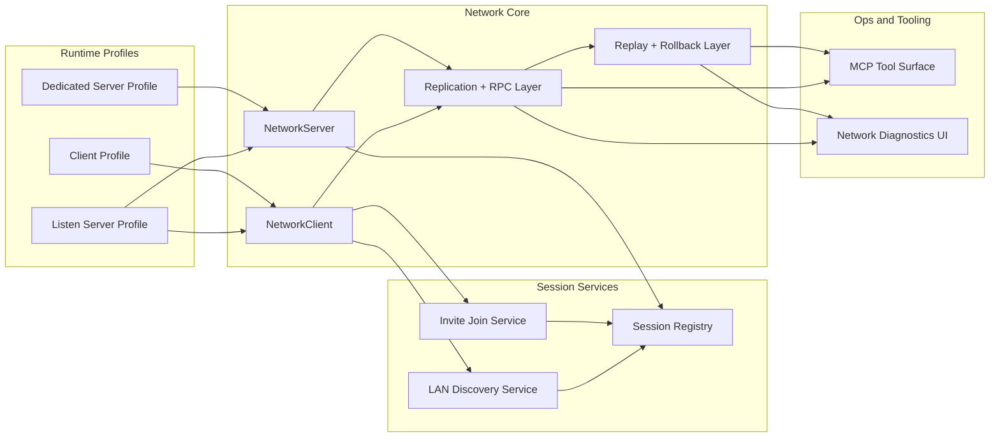
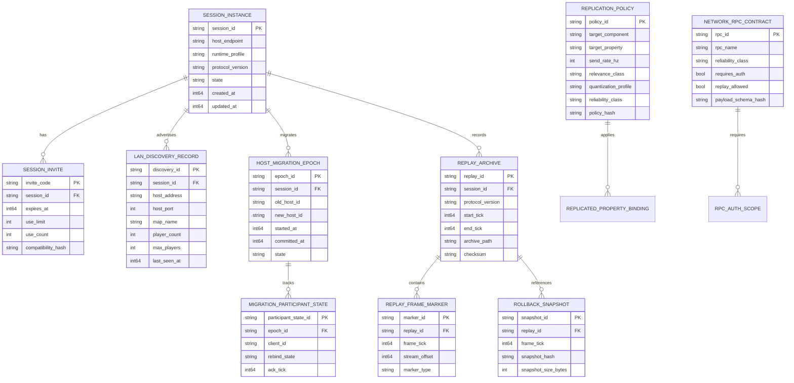
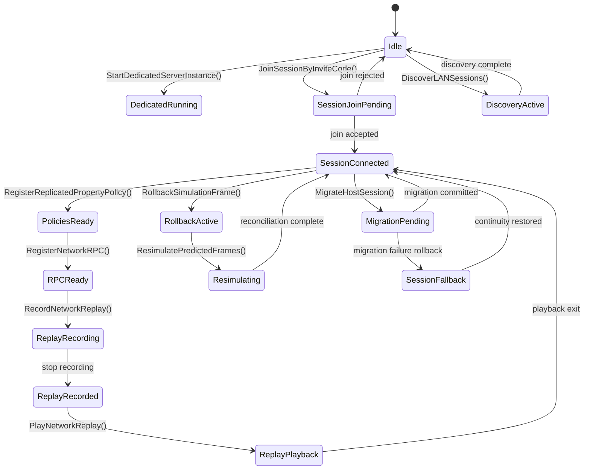

# Phase 26: Multiplayer Product Layer, Replay System & Rollback Framework

## Implementation Plan

---

## Goal

Phase 26 evolves the current low-level networking foundation into a full multiplayer product layer with explicit server/session orchestration, replication/RPC governance, deterministic replay capture/playback, rollback correction, and host continuity controls. The implementation builds on existing engine surfaces (`NetworkManager`, `NetworkServer`, `NetworkClient`, replication/prediction/reconciliation systems, and `NetworkTransformComponent`) while closing major productization gaps: dedicated server runtime profiles, secure session join/discovery, policy-driven replication contracts, replay archives, frame rollback services, and host migration state transfer. The target outcome is a deterministic and operationally resilient multiplayer runtime that can support both gameplay and production diagnostics. This phase also defines stable data/API contracts so future tooling (MCP + debug UI + automation) can operate on networking state without ad hoc per-feature hooks.

---

## Context Map

### Files to Modify

| File | Purpose | Changes Needed |
|------|---------|----------------|
| `CMakeLists.txt` | Engine compile surface | Register all new Stage 26 modules (session orchestration, policy registry, replay, rollback, host migration, diagnostics) under `EngineCore` |
| `Core/Application.h` | Runtime host contract | Add runtime role/profile mode options needed by headless dedicated server startup |
| `Core/Application.cpp` | Runtime loop orchestration | Add fixed-timestep network tick sequencing and optional headless/no-UI execution mode |
| `src/main.cpp` | Process startup entrypoint | Add CLI/profile parsing to select client/listen/dedicated runtime mode |
| `Core/Network/NetworkManager.h` | Network runtime baseline | Add role/profile lifecycle integration hooks and session metadata surface |
| `Core/Network/NetworkManager.cpp` | Network runtime baseline implementation | Add deterministic startup/shutdown ordering for dedicated runtime + session layer services |
| `Core/Network/NetworkServer.h` | Authoritative server core | Add explicit session ID/invite metadata, host migration handoff hooks, and replay marker callbacks |
| `Core/Network/NetworkServer.cpp` | Authoritative server implementation | Integrate handshake/session binding, migration signals, and replay frame marker emission |
| `Core/Network/NetworkClient.h` | Client connection core | Add invite-code join, LAN discovery consume path, replay playback mode hooks |
| `Core/Network/NetworkClient.cpp` | Client connection implementation | Integrate secure join flow, discovery filter consumption, and rollback replay-aware state gates |
| `Core/Network/NetworkPackets.h` | Protocol schema | Extend packet taxonomy with session discovery, policy hash, replay marker, rollback correction, and migration control packets |
| `Core/ECS/Components/NetworkTransformComponent.h` | Replication component policy baseline | Add policy handle/reference and quantization profile ID fields |
| `Core/Network/ServerReplicationSystem.h` | Server replication contract | Add policy registry integration, policy hash stamping, and per-property replication controls |
| `Core/Network/ServerReplicationSystem.cpp` | Server replication implementation | Route send decisions through policy rules (rate/relevance/quantization) and emit diagnostics |
| `Core/Network/ClientReplicationSystem.h` | Client replication contract | Add policy-compatibility verification and replay-consume path integration |
| `Core/Network/ClientReplicationSystem.cpp` | Client replication implementation | Add policy mismatch handling, replay timeline packet consumption, and deterministic apply order |
| `Core/Network/ClientPredictionSystem.h` | Prediction contract | Add rollback/resimulation API bridges and correction reason metadata |
| `Core/Network/ClientPredictionSystem.cpp` | Prediction implementation | Expose explicit `ResimulatePredictedFrames()` flow with deterministic replay of buffered inputs |
| `Core/Network/ServerReconciliationSystem.h` | Authoritative correction contract | Add rollback snapshot integration and correction replay metadata emission |
| `Core/Network/ServerReconciliationSystem.cpp` | Authoritative correction implementation | Integrate rollback coordinator for frame rewind and deterministic re-simulate execution |
| `Core/UI/ImGuiSubsystem.h` | Debug UI schema | Add Stage 26 network diagnostics panel contracts (session, replay, rollback, migration telemetry) |
| `Core/UI/ImGuiSubsystem.cpp` | Debug UI implementation | Add runtime panels for session orchestration, replication policy status, replay timeline, rollback counters |
| `Core/MCP/MCPServer.h` | MCP server capability declarations | Add capability scopes for mutating networking operations (session, replay, rollback, migration) |
| `Core/MCP/MCPServer.cpp` | MCP dispatch implementation | Gate Stage 26 tool actions and expose structured diagnostics for tooling clients |
| `Core/Security/PathValidator.h` | File path safety | Reuse/extend validation for replay archive read/write and migration snapshot artifacts |
| `Core/Asset/AssetTypes.h` | Asset taxonomy | Add replay archive / migration snapshot artifact type metadata for optional pipeline integration |
| `Core/Asset/AssetPipeline.h` | Artifact orchestration | Add replay archive indexing and retention metadata hooks |
| `Core/Asset/AssetPipeline.cpp` | Artifact orchestration implementation | Add deterministic archive registration and cleanup integration for replay products |
| `Core/Network/Session/SessionTypes.h` (new) | Session domain model | Define session IDs, invite code records, discovery records, and compatibility descriptors |
| `Core/Network/Session/DedicatedServerRuntime.h` (new) | Dedicated server API | Define `StartDedicatedServerInstance()` request/result contracts and lifecycle controls |
| `Core/Network/Session/DedicatedServerRuntime.cpp` (new) | Dedicated server implementation | Bootstrap headless server runtime profile, feature flags, and service registration |
| `Core/Network/Session/SessionJoinService.h` (new) | Session join API | Define `JoinSessionByInviteCode()` request/result and validation diagnostics |
| `Core/Network/Session/SessionJoinService.cpp` (new) | Session join implementation | Resolve invite -> session endpoint, validate compatibility/auth token, execute secure join |
| `Core/Network/Session/LANSessionDiscoveryService.h` (new) | LAN discovery API | Define `DiscoverLANSessions()` request/result, filter model, and time budget policy |
| `Core/Network/Session/LANSessionDiscoveryService.cpp` (new) | LAN discovery implementation | Execute broadcast query, aggregate responses, enforce compatibility filters and dedupe |
| `Core/Network/Replication/ReplicationPolicyTypes.h` (new) | Replication policy model | Define property policy schema (rate, relevance class, quantization profile, reliability constraints) |
| `Core/Network/Replication/ReplicationPolicyRegistry.h` (new) | Policy registry API | Define `RegisterReplicatedPropertyPolicy()` and policy lookup/hash contracts |
| `Core/Network/Replication/ReplicationPolicyRegistry.cpp` (new) | Policy registry implementation | Implement validation, deduplication, deterministic policy hashing, and runtime lookup |
| `Core/Network/RPC/NetworkRPCTypes.h` (new) | RPC contract model | Define RPC descriptors, auth scopes, replay flags, reliability class |
| `Core/Network/RPC/NetworkRPCRegistry.h` (new) | RPC registry API | Define `RegisterNetworkRPC()` with handler metadata and execution policy |
| `Core/Network/RPC/NetworkRPCRegistry.cpp` (new) | RPC registry implementation | Register/validate RPC contracts, dispatch handlers, enforce auth/replay constraints |
| `Core/Network/Replay/ReplayTypes.h` (new) | Replay data model | Define replay header, frame marker, channel stream index, and playback timeline state |
| `Core/Network/Replay/NetworkReplayRecorder.h` (new) | Replay recording API | Define `RecordNetworkReplay()` request/result and recorder controls |
| `Core/Network/Replay/NetworkReplayRecorder.cpp` (new) | Replay recording implementation | Capture packet stream + authoritative frame markers and write deterministic archive format |
| `Core/Network/Replay/NetworkReplayPlayer.h` (new) | Replay playback API | Define `PlayNetworkReplay()` controls (seek, pause, speed, frame-step) |
| `Core/Network/Replay/NetworkReplayPlayer.cpp` (new) | Replay playback implementation | Decode replay timeline and inject frame-accurate state into client/runtime playback path |
| `Core/Network/Rollback/RollbackTypes.h` (new) | Rollback data model | Define snapshot IDs, rollback reasons, simulation frame records, correction metadata |
| `Core/Network/Rollback/RollbackCoordinator.h` (new) | Rollback API | Define `RollbackSimulationFrame()` request/result and snapshot retention policies |
| `Core/Network/Rollback/RollbackCoordinator.cpp` (new) | Rollback implementation | Restore authoritative snapshot, rewind frame, and trigger deterministic correction pipeline |
| `Core/Network/Rollback/PredictionResimulation.h` (new) | Resimulation API | Define `ResimulatePredictedFrames()` request/result and divergence diagnostics |
| `Core/Network/Rollback/PredictionResimulation.cpp` (new) | Resimulation implementation | Replay buffered inputs from rewind point and emit correction blend directives |
| `Core/Network/Migration/HostMigrationTypes.h` (new) | Migration domain model | Define migration candidate scoring, migration token/session epoch, and transfer artifacts |
| `Core/Network/Migration/HostMigrationCoordinator.h` (new) | Host migration API | Define `MigrateHostSession()` request/result and transition state machine |
| `Core/Network/Migration/HostMigrationCoordinator.cpp` (new) | Host migration implementation | Elect candidate, transfer authoritative state, rebind clients, and commit new host epoch |
| `Core/Network/Diagnostics/NetworkDiagnosticsState.h` (new) | Diagnostics state model | Define session/replay/rollback/migration telemetry snapshot consumed by UI + MCP |
| `Core/Network/Diagnostics/NetworkDiagnosticsState.cpp` (new) | Diagnostics aggregation implementation | Aggregate runtime counters/timings/errors and expose thread-safe read API |

### Dependencies (may need updates)

| File | Relationship |
|------|--------------|
| `Core/Network/NetworkPackets.h` | Core protocol schema used by server/client/replication/prediction/reconciliation; Stage 26 packet additions must remain backward-compatible where possible |
| `Core/Network/NetworkServer.cpp` | Existing handshake and connection management are baseline for dedicated server startup/session join/migration binding |
| `Core/Network/NetworkClient.cpp` | Existing handshake state machine is baseline for invite-code join and discovery-consumed connection |
| `Core/Network/ServerReplicationSystem.cpp` | Existing transform replication path is baseline for policy-governed property replication |
| `Core/Network/ClientPredictionSystem.cpp` | Existing reconciliation/resimulation path is baseline for explicit rollback + deterministic resimulate APIs |
| `Core/Network/ServerReconciliationSystem.cpp` | Existing authoritative input validation is baseline for rollback-trigger conditions and correction metadata |
| `Core/ECS/Components/NetworkTransformComponent.h` | Existing per-entity replication metadata is baseline for policy handle integration |
| `Core/Application.cpp` | Runtime loop sequencing controls deterministic ordering for network tick, replay record/playback, rollback, and migration events |
| `Core/MCP/MCPServer.cpp` | Existing capability gating path should host Stage 26 networking tool scopes and diagnostics actions |
| `Core/UI/ImGuiSubsystem.cpp` | Existing debug overlay conventions should host Stage 26 network control/telemetry panels |
| `Core/Security/PathValidator.h` | Existing validated path handling should guard replay archive and migration artifact IO |
| `Core/Asset/AssetPipeline.cpp` | Existing artifact registration can be reused for replay archive indexing and retention metadata |

### Test Files

| Test | Coverage |
|------|----------|
| `Core/Tests/Network/DedicatedServerRuntimeTests.cpp` (new) | `StartDedicatedServerInstance()` runtime profile enforcement and lifecycle transitions |
| `Core/Tests/Network/SessionJoinInviteTests.cpp` (new) | `JoinSessionByInviteCode()` lookup, validation, token expiry, and secure join behavior |
| `Core/Tests/Network/LANDiscoveryTests.cpp` (new) | `DiscoverLANSessions()` broadcast query handling, compatibility filters, dedupe behavior |
| `Core/Tests/Network/ReplicationPolicyRegistryTests.cpp` (new) | `RegisterReplicatedPropertyPolicy()` schema validation, deterministic hash generation, conflict handling |
| `Core/Tests/Network/NetworkRPCRegistryTests.cpp` (new) | `RegisterNetworkRPC()` auth checks, reliability class validation, replay flag handling |
| `Core/Tests/Network/ReplayRecorderTests.cpp` (new) | `RecordNetworkReplay()` frame marker ordering, stream integrity, archive determinism |
| `Core/Tests/Network/ReplayPlayerTests.cpp` (new) | `PlayNetworkReplay()` seek/time control behavior and frame-accurate playback state |
| `Core/Tests/Network/RollbackCoordinatorTests.cpp` (new) | `RollbackSimulationFrame()` snapshot restore and corrected authoritative rewind behavior |
| `Core/Tests/Network/PredictionResimulationTests.cpp` (new) | `ResimulatePredictedFrames()` deterministic input replay and divergence diagnostics |
| `Core/Tests/Network/HostMigrationCoordinatorTests.cpp` (new) | `MigrateHostSession()` candidate election, state transfer integrity, and rebind behavior |
| `Core/Tests/Network/Stage26ProtocolCompatibilityTests.cpp` (new) | Packet schema/version compatibility across join/replay/migration paths |
| `Core/Tests/Integration/Stage26ReplayRollbackLoopTests.cpp` (new) | End-to-end replay record -> playback -> rollback -> resimulation behavior |
| `Core/Tests/Integration/Stage26HostMigrationContinuityTests.cpp` (new) | Live session host migration without entity ownership/state discontinuity |
| `Core/Tests/Integration/Stage26SessionProductFlowTests.cpp` (new) | Dedicated server start + invite join + LAN discovery + replication policy + RPC integration |

### Reference Patterns

| File | Pattern |
|------|---------|
| `Core/Network/NetworkServer.cpp` | Existing handshake acceptance/rejection flow and connection lifecycle handling |
| `Core/Network/NetworkClient.cpp` | Existing handshake state machine and connection failure recovery behavior |
| `Core/Network/ServerReplicationSystem.cpp` | Existing per-client replication state and packet batching model |
| `Core/Network/ClientReplicationSystem.cpp` | Existing packet dispatch, transform update, and interpolation application order |
| `Core/Network/ClientPredictionSystem.cpp` | Existing input buffering + reconciliation + resimulation pattern |
| `Core/Network/ServerReconciliationSystem.cpp` | Existing server-side input validation and correction application pattern |
| `Core/ECS/Components/NetworkTransformComponent.h` | Existing replication flags/thresholds/priorities baseline |
| `Core/MCP/MCPServer.cpp` | Existing MCP method routing, capability checks, and structured error response style |
| `Core/UI/ImGuiSubsystem.cpp` | Existing overlay panel and diagnostics rendering style |
| `docs/plans/phase-25-animation-runtime-2-0-rig-retargeting-motion-matching/implementation-plan.md` | Required structure/depth baseline for Stage 26 plan formatting |

### Risk Assessment

- [x] Breaking changes to public API
- [x] Database migrations needed (logical session/replay/rollback schema versioning)
- [x] Configuration changes required (`CMakeLists.txt`, runtime profile flags, optional headless launch args)

---

## Requirements

### Dedicated Server + Session Orchestration APIs (Step 26.1)

- Implement `StartDedicatedServerInstance()` with a headless runtime profile that disables client-only systems and enforces server-only feature flags.
- Implement `JoinSessionByInviteCode()` with session lookup, invite validation (expiry/use limits/compatibility), and secure join token exchange.
- Implement `DiscoverLANSessions()` with bounded broadcast discovery, compatibility filtering, deduplication, and deterministic ranking.
- Provide explicit runtime mode boundaries between client, listen server, and dedicated server roles.
- Preserve compatibility with current `NetworkServer`/`NetworkClient` handshake contracts during staged rollout.
- Surface operational diagnostics (startup failures, join rejection causes, discovery latency/statistics) through MCP and debug UI.

### Replication + RPC Contract Control (Step 26.2)

- Implement `RegisterReplicatedPropertyPolicy()` for property-level update frequency, relevance policy, quantization profile, and reliability class.
- Implement `RegisterNetworkRPC()` with reliability class declarations, auth checks, replay eligibility metadata, and payload validation rules.
- Integrate replication policy lookup into server-side send decisions and per-client relevance evaluation.
- Ensure policy and RPC registrations are deterministic and hash-stable for compatibility checks between peers.
- Preserve existing transform replication/prediction behavior as a fallback path when policy/RPC registry is not yet assigned.
- Emit actionable diagnostics for policy conflicts, unsupported RPC declarations, and compatibility mismatches.

### Deterministic Replay + Rollback + Host Continuity (Step 26.3)

- Implement `RecordNetworkReplay()` capturing inbound/outbound network stream plus authoritative frame markers and metadata.
- Implement `PlayNetworkReplay()` with timeline controls (seek, pause, speed, frame step) and frame-accurate playback state reconstruction.
- Implement `RollbackSimulationFrame()` to rewind to authoritative snapshot frames and apply corrected state.
- Implement `ResimulatePredictedFrames()` to replay buffered client inputs from rollback point without hard snaps where possible.
- Implement `MigrateHostSession()` to elect a successor host, transfer authoritative state, and rebind all participants with minimal disruption.
- Keep replay, rollback, and migration behaviors deterministic under fixed timestep and identical input stream conditions.

---

## Technical Considerations

### System Architecture Overview

```mermaid
graph TD
    subgraph Frontend Layer
        NetPanel[Network Control Panel]
        SessionPanel[Session/Invite Panel]
        ReplayPanel[Replay Timeline Panel]
        RollbackPanel[Rollback Diagnostics Panel]
        MigrationPanel[Host Migration Panel]
    end

    subgraph API Layer
        DedicatedAPI[StartDedicatedServerInstance API]
        JoinAPI[JoinSessionByInviteCode API]
        LanAPI[DiscoverLANSessions API]
        PolicyAPI[RegisterReplicatedPropertyPolicy API]
        RpcAPI[RegisterNetworkRPC API]
        ReplayRecordAPI[RecordNetworkReplay API]
        ReplayPlayAPI[PlayNetworkReplay API]
        RollbackAPI[RollbackSimulationFrame API]
        ResimAPI[ResimulatePredictedFrames API]
        MigrationAPI[MigrateHostSession API]
    end

    subgraph Business Logic Layer
        DedicatedSvc[DedicatedServerRuntimeService]
        SessionSvc[SessionJoinService]
        LanSvc[LANDiscoveryService]
        PolicySvc[ReplicationPolicyRegistry]
        RpcSvc[NetworkRPCRegistry]
        ReplayRecorder[NetworkReplayRecorder]
        ReplayPlayer[NetworkReplayPlayer]
        RollbackSvc[RollbackCoordinator]
        ResimSvc[PredictionResimulationService]
        MigrationSvc[HostMigrationCoordinator]
        NetDiagSvc[NetworkDiagnosticsAggregator]
    end

    subgraph Data Layer
        SessionStore[Session/Invite Store]
        PolicyStore[Replication Policy Store]
        RpcStore[RPC Contract Store]
        ReplayStore[Replay Archive Store]
        RollbackStore[Rollback Snapshot Store]
        MigrationStore[Migration Epoch Store]
        DiagStore[Diagnostics Snapshot Store]
    end

    subgraph Infrastructure Layer
        AppLoop[Application Main Loop]
        NetMgr[NetworkManager]
        NetServer[NetworkServer]
        NetClient[NetworkClient]
        Replication[Server/Client Replication Systems]
        PredictRecon[Prediction/Reconciliation Systems]
        MCP[MCP Server]
        ImGui[ImGuiSubsystem]
        JobSys[JobSystem]
        AssetPipeline[AssetPipeline]
    end

    NetPanel --> SessionPanel
    NetPanel --> ReplayPanel
    NetPanel --> RollbackPanel
    NetPanel --> MigrationPanel

    SessionPanel --> DedicatedAPI
    SessionPanel --> JoinAPI
    SessionPanel --> LanAPI
    ReplayPanel --> ReplayRecordAPI
    ReplayPanel --> ReplayPlayAPI
    RollbackPanel --> RollbackAPI
    RollbackPanel --> ResimAPI
    MigrationPanel --> MigrationAPI

    DedicatedAPI --> DedicatedSvc
    JoinAPI --> SessionSvc
    LanAPI --> LanSvc
    PolicyAPI --> PolicySvc
    RpcAPI --> RpcSvc
    ReplayRecordAPI --> ReplayRecorder
    ReplayPlayAPI --> ReplayPlayer
    RollbackAPI --> RollbackSvc
    ResimAPI --> ResimSvc
    MigrationAPI --> MigrationSvc

    DedicatedSvc --> SessionStore
    SessionSvc --> SessionStore
    LanSvc --> SessionStore
    PolicySvc --> PolicyStore
    RpcSvc --> RpcStore
    ReplayRecorder --> ReplayStore
    ReplayPlayer --> ReplayStore
    RollbackSvc --> RollbackStore
    MigrationSvc --> MigrationStore
    NetDiagSvc --> DiagStore

    DedicatedSvc --> NetMgr
    SessionSvc --> NetClient
    LanSvc --> NetClient
    PolicySvc --> Replication
    RpcSvc --> Replication
    ReplayRecorder --> NetServer
    ReplayRecorder --> NetClient
    ReplayPlayer --> Replication
    RollbackSvc --> PredictRecon
    ResimSvc --> PredictRecon
    MigrationSvc --> NetServer
    MigrationSvc --> NetClient
    NetDiagSvc --> MCP
    NetDiagSvc --> ImGui
    ReplayRecorder --> AssetPipeline
    ReplayPlayer --> JobSys
```



### Technology Stack Selection

| Layer | Selection | Rationale |
|------|-----------|-----------|
| Runtime networking | GameNetworkingSockets (`ISteamNetworkingSockets`) | Already integrated, suitable for reliable/unreliable channels and connection lifecycle callbacks |
| ECS integration | EnTT component systems | Existing replication/prediction/reconciliation systems already operate against ECS scene/registry surfaces |
| Data contracts | C++20 structs + `nlohmann_json` (tooling payloads) | Matches existing engine patterns and MCP JSON-RPC ecosystem |
| Math/runtime transforms | `glm` + engine `Math` wrappers | Current transform/rotation/velocity paths already use these types |
| Tooling integration | MCP JSON-RPC endpoints | Existing tool invocation path can host Stage 26 actions and diagnostics |
| Runtime diagnostics | ImGui overlay panels | Existing debug UI path can display session/replay/rollback/migration telemetry |
| Async workloads | Existing `JobSystem` | Replay IO/decode and migration prep can be offloaded without blocking main network tick |

### Integration Points

- `StartDedicatedServerInstance()` must integrate with `Application` runtime mode and `NetworkServer` lifecycle ownership.
- `JoinSessionByInviteCode()` must bridge `SessionJoinService` to `NetworkClient::Connect` with validated endpoint/token metadata.
- `DiscoverLANSessions()` must integrate with client networking sockets while preserving existing connection callback behavior.
- `RegisterReplicatedPropertyPolicy()` must be consumed by `ServerReplicationSystem::ProcessTransformUpdates` and any future component replication channels.
- `RegisterNetworkRPC()` must integrate with packet decode/dispatch path (`RemoteCallPacket`) and auth scope checks.
- `RecordNetworkReplay()` and `PlayNetworkReplay()` must integrate with packet send/receive flow and deterministic frame markers from replication/reconciliation ticks.
- `RollbackSimulationFrame()` and `ResimulatePredictedFrames()` must integrate with prediction/reconciliation state ownership and correction smoothing policies.
- `MigrateHostSession()` must coordinate server/client connection state, ownership metadata, and session epoch updates without orphaned entities.

### Deployment Architecture



### Scalability Considerations

- Keep dedicated server mode deterministic and headless so session hosts can scale without renderer/UI overhead.
- Bound LAN discovery and invite lookup latency with strict query budgets and cached response windows.
- Use replication policy tiers to prevent high-frequency updates for low-value properties under high entity counts.
- Keep RPC dispatch table hash-based and prevalidated to avoid per-call reflection overhead.
- Separate replay write buffers from hot replication paths to avoid packet-send jitter.
- Bound rollback snapshot retention by configured frame windows and memory ceilings.
- Keep host migration state transfer incremental/chunked for larger sessions.

---

## Database Schema Design

### Multiplayer Session + Replay + Rollback Data Model



### Table Specifications

| Table | Key Fields | Notes |
|------|------------|-------|
| `session_instance` | `session_id`, `runtime_profile`, `protocol_version`, `state` | Source of truth for active multiplayer session metadata |
| `session_invite` | `invite_code`, `session_id`, `expires_at`, `use_limit`, `compatibility_hash` | Secure join gate for invite-code flow |
| `lan_discovery_record` | `discovery_id`, `session_id`, `host_address`, `player_count`, `last_seen_at` | Cached LAN discovery candidates for UI/tooling |
| `replication_policy` | `policy_id`, `target_component`, `target_property`, `send_rate_hz`, `quantization_profile` | Policy registry for property replication behavior |
| `network_rpc_contract` | `rpc_id`, `rpc_name`, `requires_auth`, `replay_allowed`, `payload_schema_hash` | Registry of allowed RPC contracts |
| `replay_archive` | `replay_id`, `session_id`, `start_tick`, `end_tick`, `archive_path`, `checksum` | Replay metadata and archive indexing |
| `replay_frame_marker` | `marker_id`, `replay_id`, `frame_tick`, `stream_offset`, `marker_type` | Frame-accurate seek points and authoritative markers |
| `rollback_snapshot` | `snapshot_id`, `replay_id`, `frame_tick`, `snapshot_hash`, `snapshot_size_bytes` | Snapshot window used by rollback coordinator |
| `host_migration_epoch` | `epoch_id`, `session_id`, `old_host_id`, `new_host_id`, `state` | Migration transition tracking |
| `migration_participant_state` | `participant_state_id`, `epoch_id`, `client_id`, `rebind_state`, `ack_tick` | Per-client migration convergence status |

### Indexing Strategy

| Index | Target | Rationale |
|------|--------|-----------|
| `idx_session_invite_code_active` | `session_invite(invite_code, expires_at)` | Fast invite validation and expiration checks |
| `idx_lan_discovery_recent` | `lan_discovery_record(last_seen_at)` | Efficient pruning of stale LAN responses |
| `idx_replication_policy_lookup` | `replication_policy(target_component, target_property)` | Constant-time policy lookup in replication hot path |
| `idx_rpc_contract_name` | `network_rpc_contract(rpc_name)` | Fast RPC dispatch resolution |
| `idx_replay_archive_session` | `replay_archive(session_id, start_tick)` | Replay listing/filter by session and timeline |
| `idx_replay_marker_seek` | `replay_frame_marker(replay_id, frame_tick)` | Frame-accurate replay seek |
| `idx_rollback_snapshot_tick` | `rollback_snapshot(replay_id, frame_tick)` | Fast snapshot lookup during rollback |
| `idx_migration_epoch_active` | `host_migration_epoch(session_id, state)` | Query active/pending migration states quickly |

### Foreign Key Relationships

| Child Table | Parent Table | Constraint |
|-------------|--------------|------------|
| `session_invite.session_id` | `session_instance.session_id` | `ON DELETE CASCADE` |
| `lan_discovery_record.session_id` | `session_instance.session_id` | `ON DELETE CASCADE` |
| `replay_archive.session_id` | `session_instance.session_id` | `ON DELETE CASCADE` |
| `replay_frame_marker.replay_id` | `replay_archive.replay_id` | `ON DELETE CASCADE` |
| `rollback_snapshot.replay_id` | `replay_archive.replay_id` | `ON DELETE CASCADE` |
| `host_migration_epoch.session_id` | `session_instance.session_id` | `ON DELETE CASCADE` |
| `migration_participant_state.epoch_id` | `host_migration_epoch.epoch_id` | `ON DELETE CASCADE` |

### Database Migration Strategy

- Version all Stage 26 session/replay/rollback schemas with explicit `schema_version` metadata.
- Add non-destructive migration adapters from baseline networking state where metadata did not previously exist.
- Validate migration integrity by checksum/hash verification for replay archive and snapshot metadata.
- Keep backwards-compatible read support for at least one prior schema revision during staged rollout.

---

## API Design

### Stage 26 Runtime API Surface (C++)

```cpp
namespace Core::Network {

DedicatedServerStartResult StartDedicatedServerInstance(
    const DedicatedServerStartRequest& request);

SessionJoinResult JoinSessionByInviteCode(
    const SessionInviteJoinRequest& request);

LANDiscoveryResult DiscoverLANSessions(
    const LANDiscoveryRequest& request);

ReplicationPolicyRegistrationResult RegisterReplicatedPropertyPolicy(
    const ReplicatedPropertyPolicyRegistrationRequest& request);

NetworkRPCRegistrationResult RegisterNetworkRPC(
    const NetworkRPCRegistrationRequest& request);

ReplayRecordResult RecordNetworkReplay(
    const ReplayRecordRequest& request);

ReplayPlaybackResult PlayNetworkReplay(
    const ReplayPlaybackRequest& request);

RollbackResult RollbackSimulationFrame(
    const RollbackRequest& request);

ResimulationResult ResimulatePredictedFrames(
    const ResimulationRequest& request);

HostMigrationResult MigrateHostSession(
    const HostMigrationRequest& request);

} // namespace Core::Network
```

### Request/Response Contracts (Tooling JSON Types)

```ts
type StartDedicatedServerInstanceRequest = {
  serverName: string;
  bindAddress: string;
  port: number;
  maxClients: number;
  tickRate: number;
  headless: true;
  runtimeProfile: "dedicated";
  featureFlags: {
    disableRenderer: boolean;
    disableUI: boolean;
    enableReplay: boolean;
    enableHostMigration: boolean;
  };
};

type JoinSessionByInviteCodeRequest = {
  inviteCode: string;
  clientDisplayName: string;
  protocolVersion: number;
  buildCompatibilityHash: string;
  authToken?: string;
};

type DiscoverLANSessionsRequest = {
  timeoutMs: number;
  maxResults: number;
  requireProtocolVersion?: number;
  requireBuildCompatibilityHash?: string;
  includeListenServers: boolean;
  includeDedicatedServers: boolean;
};

type RegisterReplicatedPropertyPolicyRequest = {
  policyId: string;
  targetComponent: string;
  targetProperty: string;
  sendRateHz: number;
  relevanceClass: "global" | "nearby" | "owner-only" | "team-only";
  quantizationProfile: "none" | "coarse" | "normal" | "high";
  reliabilityClass: "unreliable" | "reliable" | "reliable-ordered";
};

type RegisterNetworkRPCRequest = {
  rpcName: string;
  targetEntityScope: "global" | "entity";
  reliabilityClass: "unreliable" | "reliable" | "reliable-ordered";
  requiresAuth: boolean;
  replayAllowed: boolean;
  payloadSchemaHash: string;
};

type RecordNetworkReplayRequest = {
  sessionId: string;
  outputPath: string;
  includeInboundPackets: boolean;
  includeOutboundPackets: boolean;
  includeAuthoritativeMarkers: boolean;
  maxDurationSeconds?: number;
};

type PlayNetworkReplayRequest = {
  replayId: string;
  startTick?: number;
  playbackSpeed: number;
  paused: boolean;
  loop: boolean;
};

type RollbackSimulationFrameRequest = {
  sessionId: string;
  targetTick: number;
  reason: "authoritative-correction" | "desync-detected" | "manual-debug";
  preserveClientVisualSmoothing: boolean;
};

type ResimulatePredictedFramesRequest = {
  sessionId: string;
  fromTick: number;
  toTick: number;
  maxFramesPerUpdate: number;
};

type MigrateHostSessionRequest = {
  sessionId: string;
  migrationStrategy: "best-ping" | "highest-fps" | "manual-candidate";
  candidateClientId?: string;
  timeoutMs: number;
  requireReplayCheckpoint: boolean;
};
```

### Authentication and Authorization

- Stage 26 runtime APIs are engine-local by default; no identity layer is required for local standalone use.
- If exposed through MCP or external control endpoints, apply capability scopes:
  - `network.session.start`
  - `network.session.join`
  - `network.discovery.read`
  - `network.replication.policy.write`
  - `network.rpc.register`
  - `network.replay.record`
  - `network.replay.play`
  - `network.rollback.execute`
  - `network.hostmigration.execute`
- Require auth-token validation for invite-code join when running in non-local/trusted deployments.

### Error Handling Strategies

| Error Code | Scenario | Strategy |
|-----------|----------|----------|
| `NET_DEDICATED_PROFILE_INVALID` | `StartDedicatedServerInstance()` request profile conflicts with runtime mode | Reject startup and return explicit profile mismatch diagnostics |
| `NET_DEDICATED_PORT_BIND_FAILED` | Dedicated server cannot bind requested address/port | Abort startup and include bind endpoint/system error |
| `NET_INVITE_CODE_INVALID` | `JoinSessionByInviteCode()` receives unknown or malformed invite code | Reject join with normalized invalid-code response |
| `NET_INVITE_EXPIRED_OR_EXHAUSTED` | Invite is expired or exceeds use-limit policy | Reject join and report expiration/use-limit state |
| `NET_LAN_DISCOVERY_TIMEOUT` | `DiscoverLANSessions()` exceeds time budget | Return partial results with timeout flag |
| `NET_REPLICATION_POLICY_CONFLICT` | `RegisterReplicatedPropertyPolicy()` conflicts with existing policy | Reject registration and report conflicting policy IDs |
| `NET_RPC_CONTRACT_INVALID` | `RegisterNetworkRPC()` has invalid reliability/auth/replay combination | Reject registration with field-level diagnostics |
| `NET_RPC_AUTH_FAILED` | RPC invocation fails auth scope checks | Reject invocation and emit security event |
| `NET_REPLAY_ARCHIVE_CORRUPT` | Replay stream checksum mismatch during `PlayNetworkReplay()` | Abort playback and preserve runtime session state |
| `NET_REPLAY_MARKER_MISSING` | Playback seek target has no frame marker | Fallback to nearest valid marker and report drift |
| `NET_ROLLBACK_SNAPSHOT_UNAVAILABLE` | `RollbackSimulationFrame()` cannot find required snapshot | Reject rollback and trigger full-sync fallback |
| `NET_RESIM_DIVERGENCE_EXCEEDED` | `ResimulatePredictedFrames()` exceeds divergence threshold | Apply hard correction path and emit diagnostics |
| `NET_HOST_MIGRATION_CANDIDATE_INVALID` | `MigrateHostSession()` candidate fails health/compat checks | Reject candidate and evaluate next ranked candidate |
| `NET_HOST_MIGRATION_COMMIT_FAILED` | Migration state transfer/rebind fails to commit | Roll back to prior host epoch and return failure state |

### Rate Limiting and Caching Strategies

- Rate-limit invite join attempts per client/IP and per invite code to reduce brute-force misuse.
- Cache invite lookup results by `(inviteCode, compatibilityHash)` for short TTL windows.
- Cache LAN discovery results by `(queryHash, subnet)` for rolling update windows.
- Cache replication policy lookups by `(componentType, propertyId)` in replication hot paths.
- Cache RPC dispatch table by `(rpcHash, schemaHash)` with immutable snapshot swap on updates.
- Cache replay frame marker index by `(replayId, markerInterval)` for seek acceleration.
- Cache rollback snapshot references by `(sessionId, tickBucket)` to reduce lookup overhead.

---

## Frontend Architecture

### Component Hierarchy Documentation

```text
Multiplayer Runtime Workspace
├── Session Control Panel
│   ├── Runtime Role Selector (client/listen/dedicated)
│   ├── Dedicated Server Start Controls
│   ├── Invite Code Join Controls
│   └── LAN Discovery Result Table
├── Replication Policy Panel
│   ├── Policy Registry Table
│   ├── Property Policy Editor
│   ├── Policy Hash/Compatibility View
│   └── Replication Throughput Graph
├── RPC Contract Panel
│   ├── RPC Registry Table
│   ├── Auth Scope Inspector
│   ├── Reliability Class View
│   └── RPC Error/Event Feed
├── Replay Panel
│   ├── Replay Record Controls
│   ├── Replay Archive Browser
│   ├── Timeline Scrubber + Frame Markers
│   └── Playback State Inspector
├── Rollback Panel
│   ├── Snapshot Window Inspector
│   ├── Rollback Trigger Controls
│   ├── Resimulation Progress View
│   └── Divergence/Error Metrics
└── Host Migration Panel
    ├── Candidate Ranking View
    ├── Migration Phase Timeline
    ├── Participant Rebind Status
    └── Continuity/Recovery Diagnostics
```

### State Flow Diagram



### Reusable Component Library Specifications

| UI Element | Reuse Strategy |
|-----------|-----------------|
| Session table widget | Shared between LAN discovery results and migration participant status |
| Timeline widget | Shared between replay playback timeline and migration phase timeline |
| Diagnostics event feed | Shared between RPC validation errors, rollback divergence alerts, and migration warnings |
| Policy editor row | Shared between replication policy editing and RPC contract metadata editor |
| Throughput chart widget | Shared between replication bandwidth view and replay recorder write-rate telemetry |

### State Management Patterns

- Central `NetworkDiagnosticsState` stores session mode, join/discovery status, policy hashes, replay status, rollback counters, and migration phase.
- Event topics:
  - `DedicatedServerStarted`
  - `SessionJoinCompleted`
  - `LANSessionsDiscovered`
  - `ReplicationPolicyRegistered`
  - `NetworkRPCRegistered`
  - `ReplayRecordingStarted`
  - `ReplayPlaybackUpdated`
  - `RollbackApplied`
  - `ResimulationCompleted`
  - `HostMigrationCommitted`
- Deterministic update order:
  1. Process connection/session events
  2. Apply replication policy and RPC registry updates
  3. Process replay record/playback frame hooks
  4. Apply rollback and resimulation operations
  5. Process migration state machine transitions
  6. Publish diagnostics snapshot

### Type Definitions (C++)

```cpp
struct NetworkDiagnosticsState {
    std::string ActiveSessionId;
    std::string RuntimeProfile;
    bool DedicatedRunning = false;
    uint32_t LastServerTick = 0;
    uint32_t ReplayCurrentTick = 0;
    uint32_t LastRollbackTick = 0;
    uint32_t PendingResimFrames = 0;
    std::string MigrationState;
    std::vector<std::string> RecentNetworkEvents;
};

struct ReplayTimelineMarker {
    uint32_t FrameTick = 0;
    uint64_t StreamOffset = 0;
    std::string MarkerType;
};
```

---

## Security & Performance

### Authentication/Authorization Requirements

- Require capability checks before mutating session/policy/RPC/replay/rollback/migration operations through MCP.
- Validate invite-code join tokens and compatibility metadata before opening gameplay channels.
- Enforce RPC auth scopes and reject calls that exceed client role permissions.
- Restrict host migration trigger privileges to authoritative host/admin contexts.
- Restrict replay archive file IO to validated sandboxed paths.

### Data Validation and Sanitization

- Validate all session/invite fields (format, length, TTL, use limits).
- Validate LAN discovery response payload bounds and protocol/build compatibility fields.
- Validate policy registration fields (target component/property existence, rate bounds, quantization enum).
- Validate RPC registration payload schema hash and reliability/auth/replay compatibility.
- Validate replay archive headers/checksums/frame marker monotonicity before playback.
- Validate rollback snapshot existence and resimulation frame ranges before execution.

### Performance Optimization Strategies

| Technique | Target | Implementation |
|-----------|--------|----------------|
| Session lookup cache | Invite join latency | Cache invite/session resolution for short TTL |
| Discovery dedupe buckets | LAN discovery overhead | Deduplicate responses by `(sessionId, endpoint)` |
| Policy lookup cache | Replication hot path cost | Precompute property -> policy pointers/hash |
| RPC dispatch table snapshot | RPC invocation overhead | Immutable hash map snapshots swapped atomically |
| Replay buffered writes | Recorder overhead | Double-buffered append queue with chunked flush |
| Replay marker index | Playback seek cost | Build marker map at load time for nearest-seek lookup |
| Snapshot ring buffer | Rollback memory stability | Fixed-size per-session snapshot window |
| Resimulation frame budget | Runtime stability | Bound frames processed per update and carry remainder |
| Migration state chunking | Host migration spikes | Chunk participant rebind/state transfer by budget |

### Caching Mechanisms

- Session cache keyed by `(inviteCode, protocolVersion, compatibilityHash)`.
- Discovery cache keyed by `(subnetHash, filterHash, queryWindowId)`.
- Replication policy cache keyed by `(componentTypeId, propertyId)`.
- RPC contract cache keyed by `(rpcNameHash, schemaHash)`.
- Replay marker cache keyed by `(replayId, markerBucket)`.
- Rollback snapshot cache keyed by `(sessionId, frameTickBucket)`.
- Migration candidate cache keyed by `(sessionId, epoch, healthSnapshotId)`.

### Performance Budget

| System | Budget Goal |
|--------|-------------|
| Dedicated server startup (warm path) | <= 400 ms |
| Invite-code join validation | <= 10 ms average |
| LAN discovery query + filter pass | <= 80 ms (query window dependent) |
| Replication policy lookup per property | <= 0.01 ms average |
| RPC dispatch decision overhead | <= 0.02 ms average |
| Replay recording overhead (server tick) | <= 0.20 ms average |
| Replay playback seek (nearest marker) | <= 1.5 ms |
| Rollback snapshot restore | <= 0.40 ms average |
| Resimulation per predicted frame | <= 0.08 ms average |
| Host migration commit pause | <= 250 ms target |

---

## Detailed Step Breakdown

### Step 26.1: Add dedicated-server and session orchestration APIs

#### Sub-step 26.1.1: `StartDedicatedServerInstance()` (v0.26.1.1)
- Introduce dedicated runtime profile and startup service:
  1. Define `DedicatedServerStartRequest/Result` contracts with headless/profile/feature-flag fields.
  2. Add `Application` runtime mode selection and headless startup path.
  3. Bootstrap `NetworkManager` + `NetworkServer` services in deterministic order.
  4. Disable client/UI/render-only subsystems in dedicated mode.
- Add lifecycle controls:
  - Startup validation (port/profile/tick rate/resource caps).
  - Graceful shutdown and stop reason propagation.
  - Health/heartbeat diagnostics for tooling.
- **Deliverable**: Dedicated server instance startup API with headless profile enforcement and deterministic lifecycle behavior.

#### Sub-step 26.1.2: `JoinSessionByInviteCode()` (v0.26.1.2)
- Implement invite-based session join flow:
  1. Define invite code parser/validator and compatibility checks.
  2. Resolve invite -> session endpoint and protocol metadata.
  3. Execute secure token handshake before enabling gameplay packet channels.
  4. Integrate failure handling (expired code, mismatched build, invalid scope).
- Add observability:
  - Join latency and rejection reason telemetry.
  - Normalized error codes for MCP/UI surfaces.
- **Deliverable**: Secure invite-code join API with deterministic validation and structured rejection diagnostics.

#### Sub-step 26.1.3: `DiscoverLANSessions()` (v0.26.1.3)
- Implement bounded LAN discovery service:
  1. Define discovery query/response packet schema.
  2. Broadcast query and collect candidate responses within a fixed timeout budget.
  3. Apply compatibility filters and dedupe records.
  4. Rank/sort sessions deterministically (e.g., ping, slots, version match).
- Add resilience:
  - Partial-results return on timeout.
  - Invalid response sanitization and ignore policy.
- **Deliverable**: LAN discovery API with compatibility filtering, deterministic ranking, and bounded runtime overhead.

#### Sub-step 26.1.4: Session Product Layer Integration (v0.26.1.4)
- Connect dedicated/join/discovery into a unified session orchestrator:
  1. Add session state machine (`Idle -> Hosting/Joining/Connected`).
  2. Normalize session metadata distribution to diagnostics and tooling.
  3. Add compatibility hash/version checks shared across all entry points.
  4. Add staged rollout mode for legacy direct-connect fallback.
- **Deliverable**: Unified session orchestration layer with controlled migration from legacy connection flows.

---

### Step 26.2: Strengthen replication and RPC contract control

#### Sub-step 26.2.1: `RegisterReplicatedPropertyPolicy()` (v0.26.2.1)
- Implement replication policy registry:
  1. Define policy schema (`component`, `property`, `sendRate`, `relevance`, `quantization`, `reliability`).
  2. Add schema validation and conflict detection.
  3. Generate deterministic policy hash for compatibility verification.
  4. Expose registry query/update APIs for replication systems.
- Integrate policy enforcement:
  - Route `ServerReplicationSystem` property-send decisions through policy lookup.
  - Fallback to existing transform replication defaults when policy is absent.
- **Deliverable**: Policy-driven replication registration API with deterministic hashing and runtime enforcement.

#### Sub-step 26.2.2: `RegisterNetworkRPC()` (v0.26.2.2)
- Implement RPC contract registry:
  1. Define RPC descriptor schema (name hash, payload schema hash, reliability, auth scope, replay support).
  2. Validate registration against reliability/auth constraints.
  3. Build immutable dispatch snapshots for runtime invocation.
  4. Emit diagnostics for registration conflicts and invalid schemas.
- Integrate dispatch controls:
  - Enforce auth checks before handler invocation.
  - Tag replay-eligible RPCs for recorder pipeline inclusion.
- **Deliverable**: Explicit RPC registration API with reliability/auth/replay governance.

#### Sub-step 26.2.3: Contract Compatibility and Runtime Enforcement Bridge (v0.26.2.3)
- Harden policy/RPC compatibility across peers:
  1. Add policy + RPC contract hash exchange during handshake/session join.
  2. Reject or downgrade sessions on incompatible contract sets.
  3. Add runtime mismatch alarms (MCP/UI telemetry + log events).
  4. Preserve backwards compatibility mode for incremental rollout.
- **Deliverable**: Runtime contract compatibility layer that prevents silent replication/RPC drift across participants.

---

### Step 26.3: Build deterministic replay and rollback systems

#### Sub-step 26.3.1: `RecordNetworkReplay()` (v0.26.3.1)
- Implement replay recorder:
  1. Capture inbound/outbound packet streams with channel metadata.
  2. Insert authoritative frame markers at deterministic tick boundaries.
  3. Persist replay archive headers + checksums + marker index.
  4. Support runtime controls (`start`, `stop`, `flush`, `cancel`).
- Add retention and artifact metadata:
  - Session ID, protocol/build hash, start/end ticks, optional tags.
- **Deliverable**: Deterministic replay recording API producing frame-indexed archive artifacts.

#### Sub-step 26.3.2: `PlayNetworkReplay()` (v0.26.3.2)
- Implement replay playback runtime:
  1. Load replay archive and validate checksum/schema.
  2. Build marker seek index for frame-accurate timeline navigation.
  3. Provide time controls (`seek`, `pause`, `speed`, `frame-step`).
  4. Inject replay stream into simulation/apply path without live session mutation.
- Add diagnostics:
  - Current tick, seek drift, playback mode, decode timing.
- **Deliverable**: Frame-accurate replay playback API with deterministic timeline controls.

#### Sub-step 26.3.3: `RollbackSimulationFrame()` (v0.26.3.3)
- Implement rollback coordinator:
  1. Maintain snapshot ring buffer at configured rollback window.
  2. Resolve target tick -> snapshot and restore authoritative state.
  3. Rewind simulation frame with explicit correction reason metadata.
  4. Coordinate correction handoff to client prediction/reconciliation systems.
- Add safety boundaries:
  - Abort rollback outside retention window.
  - Emit forced full-sync fallback on missing snapshots.
- **Deliverable**: Authoritative rollback API with deterministic snapshot restore and correction semantics.

#### Sub-step 26.3.4: `ResimulatePredictedFrames()` (v0.26.3.4)
- Implement post-rollback resimulation:
  1. Enumerate buffered unacknowledged inputs from rollback point.
  2. Re-run simulation callbacks in deterministic sequence order.
  3. Track divergence metrics and apply smoothing/snap policy.
  4. Cap frames processed per update for stability.
- Add diagnostics:
  - Frames resimulated, divergence distance histogram, hard-correction count.
- **Deliverable**: Deterministic resimulation API that reconciles predicted frames without uncontrolled snapping.

#### Sub-step 26.3.5: `MigrateHostSession()` (v0.26.3.5)
- Implement host migration coordinator:
  1. Rank migration candidates by health/latency/performance policies.
  2. Snapshot authoritative state and transfer migration artifact to selected host.
  3. Rebind clients to new host endpoint with session epoch bump.
  4. Commit migration transaction and finalize continuity state.
- Add failure handling:
  - Timeout + retry candidate fallback.
  - Roll back to prior host state when commit cannot converge.
- **Deliverable**: Host migration API providing resilient peer-host continuity with explicit epoch transitions.

#### Sub-step 26.3.6: Replay/Rollback/Migration Observability and Governance (v0.26.3.6)
- Add runtime governance + telemetry:
  1. Aggregate replay/rollback/migration counters and timings into diagnostics state.
  2. Expose control + read APIs through MCP and debug panels.
  3. Add deterministic replay/rollback regression datasets for future automation.
  4. Add runtime feature gates and safe fallback paths for production stability.
- **Deliverable**: Operationally observable Stage 26 runtime with controllable safety gates and deterministic regression instrumentation.

---

## Dependencies

### External Libraries

- `GameNetworkingSockets` for transport, connection lifecycle, and reliable/unreliable channels.
- `glm` + engine math wrappers for transform, velocity, and correction computations.
- `nlohmann_json` for tooling contracts and diagnostics payload serialization.
- Optional compression backend for replay archive payload blocks (behind an abstraction; baseline can remain uncompressed).

### Internal Dependencies

- `Core/Application.h` + `Core/Application.cpp`
- `src/main.cpp`
- `Core/Network/NetworkManager.h` + `Core/Network/NetworkManager.cpp`
- `Core/Network/NetworkServer.h` + `Core/Network/NetworkServer.cpp`
- `Core/Network/NetworkClient.h` + `Core/Network/NetworkClient.cpp`
- `Core/Network/NetworkPackets.h`
- `Core/Network/ServerReplicationSystem.h` + `Core/Network/ServerReplicationSystem.cpp`
- `Core/Network/ClientReplicationSystem.h` + `Core/Network/ClientReplicationSystem.cpp`
- `Core/Network/ClientPredictionSystem.h` + `Core/Network/ClientPredictionSystem.cpp`
- `Core/Network/ServerReconciliationSystem.h` + `Core/Network/ServerReconciliationSystem.cpp`
- `Core/ECS/Components/NetworkTransformComponent.h`
- `Core/MCP/MCPServer.h` + `Core/MCP/MCPServer.cpp`
- `Core/UI/ImGuiSubsystem.h` + `Core/UI/ImGuiSubsystem.cpp`
- `Core/Security/PathValidator.h`
- `Core/Asset/AssetTypes.h`
- `Core/Asset/AssetPipeline.h` + `Core/Asset/AssetPipeline.cpp`
- `CMakeLists.txt`

### Integration Requirements

- Add all new Stage 26 source files to `EngineCore` in `CMakeLists.txt` (explicit source-list policy).
- Preserve existing handshake and replication behavior while enabling staged migration to policy/RPC-governed mode.
- Keep deterministic update order across networking, replay, rollback, and migration services under fixed timestep.
- Keep replay/migration artifact IO guarded by validated path and schema checks.
- Keep MCP networking operations capability-gated and read/write surfaces clearly separated.

---

## Testing Strategy

### Unit Tests

| Test | Description |
|------|-------------|
| `Session_StartDedicatedServerInstance_ProfileValidation` | Ensures dedicated profile constraints are enforced and invalid profile combinations are rejected |
| `Session_StartDedicatedServerInstance_HeadlessLifecycle` | Ensures startup/shutdown transitions and feature flags behave correctly in headless mode |
| `Session_JoinSessionByInviteCode_Validation` | Ensures malformed/expired/exhausted invite codes are rejected with expected errors |
| `Session_JoinSessionByInviteCode_CompatibilityChecks` | Ensures protocol/build compatibility hash checks are enforced |
| `Session_DiscoverLANSessions_FilterAndDedup` | Ensures discovery results are filtered and deduplicated deterministically |
| `Replication_RegisterReplicatedPropertyPolicy_ConflictDetection` | Ensures conflicting policy registrations are rejected with diagnostics |
| `Replication_RegisterReplicatedPropertyPolicy_HashDeterminism` | Ensures equivalent policy definitions produce identical hashes |
| `RPC_RegisterNetworkRPC_AuthAndReliabilityValidation` | Ensures invalid auth/reliability/replay combinations are rejected |
| `RPC_RegisterNetworkRPC_DispatchRegistration` | Ensures valid RPC contracts register and resolve by hash correctly |
| `Replay_RecordNetworkReplay_StreamIntegrity` | Ensures replay recorder emits deterministic frame markers and checksummed archives |
| `Replay_PlayNetworkReplay_FrameAccurateSeek` | Ensures playback seek lands on expected marker/tick states |
| `Rollback_RollbackSimulationFrame_SnapshotRestore` | Ensures rollback restores authoritative snapshot correctly |
| `Rollback_ResimulatePredictedFrames_DeterministicReplay` | Ensures resimulation output is stable for identical input history |
| `Migration_MigrateHostSession_CandidateSelection` | Ensures deterministic host candidate ranking under fixed metrics |
| `Migration_MigrateHostSession_CommitRollback` | Ensures migration failures roll back safely to previous epoch |

### Integration Tests

| Test | Description |
|------|-------------|
| `Stage26_DedicatedServerInviteJoinFlow` | Dedicated server start + invite-code join + session connect end-to-end |
| `Stage26_LANDiscoveryToJoinFlow` | LAN discovery results feed join flow with compatibility filter enforcement |
| `Stage26_ReplicationPolicyAndRPCContractFlow` | Policy registration and RPC contract enforcement in live replicated session |
| `Stage26_ReplayRecordPlaybackParity` | Record replay and verify playback reproduces authoritative frame sequence |
| `Stage26_RollbackResimulationCorrection` | Rollback trigger and resimulation reconcile client prediction without persistent drift |
| `Stage26_HostMigrationContinuity` | Host migration preserves ownership/session continuity across migration epoch |
| `Stage26_MCPAndImGuiDiagnosticsParity` | MCP and UI diagnostics report consistent Stage 26 runtime state |

### Tooling/Operational Validation

1. Validate dedicated/server/client runtime role transitions through CLI flags and diagnostics surfaces.
2. Validate invite join rejection reason mapping and LAN discovery ranking stability across repeated runs.
3. Validate replay archives for checksum, marker monotonicity, and schema version correctness.
4. Validate rollback/resimulation divergence metrics under induced network jitter/loss scenarios.
5. Validate host migration timeout/retry paths and continuity recovery on candidate failure.

---

## Risk Mitigation

| Risk | Impact | Mitigation |
|------|--------|------------|
| Dedicated runtime profile drift from client runtime | Startup instability and hidden dependency failures | Explicit runtime profile gates, startup validation matrix, and role-specific smoke tests |
| Invite/discovery misuse or malformed payloads | Unauthorized joins and instability | Strict validation/rate limits, compatibility hashing, and bounded query windows |
| Replication policy misconfiguration | Bandwidth spikes or stale gameplay state | Policy schema validation, conflict detection, and fallback defaults |
| RPC contract drift between peers | Runtime desync and invocation failures | Deterministic contract hash exchange and compatibility rejection |
| Replay archive corruption | Playback failures and unusable diagnostics | Checksums, schema versioning, and marker-level validation |
| Rollback snapshot gaps | Incomplete correction and hard desync | Snapshot retention policy + full-sync fallback path |
| Resimulation divergence under load | Visual instability and gameplay snap artifacts | Frame budget caps, smoothing policy, and divergence alarms |
| Host migration failure mid-transition | Session loss/disconnect storm | Transactional migration epochs, candidate fallback, rollback-to-old-host path |

---

## Milestones

1. **Milestone 26.A - Session Product Layer Foundation**
   - Complete `StartDedicatedServerInstance()` (v0.26.1.1)
   - Complete `JoinSessionByInviteCode()` (v0.26.1.2)
   - Complete `DiscoverLANSessions()` (v0.26.1.3)
   - Complete session orchestration integration bridge (v0.26.1.4)

2. **Milestone 26.B - Replication and RPC Governance**
   - Complete `RegisterReplicatedPropertyPolicy()` (v0.26.2.1)
   - Complete `RegisterNetworkRPC()` (v0.26.2.2)
   - Complete policy/RPC compatibility enforcement bridge (v0.26.2.3)

3. **Milestone 26.C - Replay, Rollback, and Host Continuity**
   - Complete `RecordNetworkReplay()` (v0.26.3.1)
   - Complete `PlayNetworkReplay()` (v0.26.3.2)
   - Complete `RollbackSimulationFrame()` (v0.26.3.3)
   - Complete `ResimulatePredictedFrames()` (v0.26.3.4)
   - Complete `MigrateHostSession()` (v0.26.3.5)
   - Complete observability/governance hardening (v0.26.3.6)

4. **Milestone 26.D - Stabilization and Sign-off**
   - Pass Stage 26 unit/integration regression suites
   - Validate deterministic replay/rollback behavior against representative datasets
   - Validate host migration continuity and recovery paths under injected failures

---

## References

- `engine_roadmap.md` (Phase 26 section, Step 26.1 through 26.3)
- `Core/Network/NetworkManager.h` + `Core/Network/NetworkManager.cpp`
- `Core/Network/NetworkServer.h` + `Core/Network/NetworkServer.cpp`
- `Core/Network/NetworkClient.h` + `Core/Network/NetworkClient.cpp`
- `Core/Network/NetworkPackets.h`
- `Core/Network/ServerReplicationSystem.h` + `Core/Network/ServerReplicationSystem.cpp`
- `Core/Network/ClientReplicationSystem.h` + `Core/Network/ClientReplicationSystem.cpp`
- `Core/Network/ClientPredictionSystem.h` + `Core/Network/ClientPredictionSystem.cpp`
- `Core/Network/ServerReconciliationSystem.h` + `Core/Network/ServerReconciliationSystem.cpp`
- `Core/ECS/Components/NetworkTransformComponent.h`
- `Core/Application.h` + `Core/Application.cpp`
- `src/main.cpp`
- `Core/MCP/MCPServer.h` + `Core/MCP/MCPServer.cpp`
- `Core/UI/ImGuiSubsystem.h` + `Core/UI/ImGuiSubsystem.cpp`
- `docs/plans/phase-25-animation-runtime-2-0-rig-retargeting-motion-matching/implementation-plan.md`
- `docs/plans/phase-28-profiling-automation-production-build-pipeline/implementation-plan.md`

<!-- release-doc-sync:2026-04-15 -->

## Release Sync (2026-04-15)

- Verified clean Release rebuild: `cmake --build build --config Release --target ALL_BUILD --clean-first -- /m /nologo /verbosity:minimal`.
- Verified Release test sweep: `ctest --test-dir build -C Release` (**18/18 passed**).
- Confirmed executable composition: `AIGameEngine` links `EngineCore`, and `EngineCore` includes `Core/MCP/HttpServer.cpp` + `Core/MCP/MCPServer.cpp`.
- Runtime MCP integration is now enabled in `Core::Application` by default; runtime flags: `--disable-mcp`, `--mcp-host=<host>`, `--mcp-port=<port>`.
