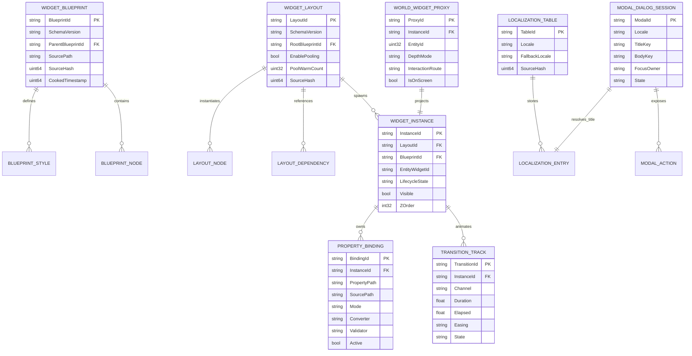
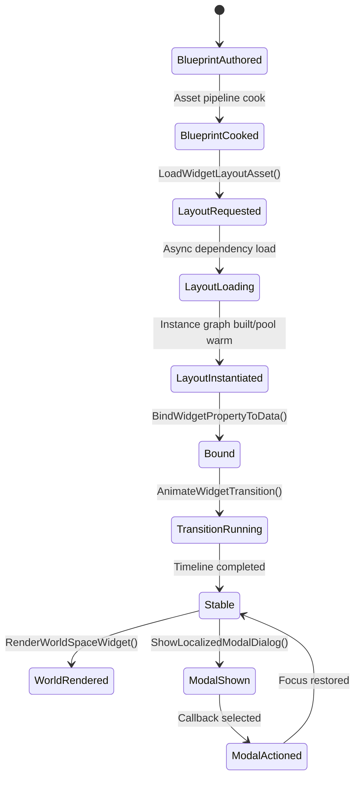

# Phase 27: Runtime UI Authoring, Data Binding & World Widgets

## Implementation Plan

---

## Goal

Phase 27 upgrades the current UI runtime from ad hoc text/message rendering into a production-style, data-driven UI platform with reusable blueprint assets, async layout loading, deterministic property binding, timeline transitions, depth-aware world-space widgets, and localized modal dialogs. The implementation is grounded in the existing engine surfaces (`UIManager`, `TextRenderer`, `UISystem`, `UIComponent`, `WorldUIComponent`, `SceneSerialization`, `AssetPipeline`, `AssetLoader`, and MCP UI tooling) while explicitly addressing known integration gaps: missing compile-surface wiring for several UI systems, partial/placeholder MCP UI execution paths, and divergent widget runtime contracts. The outcome is a consistent end-to-end UI stack where authored assets can be loaded and reused at runtime, UI state can be bound to gameplay data, and world-space/localized interaction flows can be executed with deterministic behavior and observable diagnostics.

---

## Context Map

### Files to Modify

| File | Purpose | Changes Needed |
|------|---------|----------------|
| `CMakeLists.txt` | Engine compile surface | Add all new Stage 27 modules and include currently unwired UI runtime files (`UISystem`, widget modules, world widget renderer, authoring/binding/transition/localization services) into `EngineCore` |
| `Core/Application.h` | Runtime host contract | Add Stage 27 runtime service handles and lifecycle hooks for UI authoring/binding/localization services |
| `Core/Application.cpp` | Main frame loop | Insert deterministic Stage 27 update sequence (layout async completion -> data binding sync -> transition tick -> world widget render submission -> modal routing) |
| `Core/ECS/Scene.h` | Scene contract | Add explicit UI system integration points and scene-level registration for Stage 27 UI services |
| `Core/ECS/Scene.cpp` | Scene update path | Wire `UISystem` and Stage 27 service update calls into `Scene::OnUpdate()` with stable ordering |
| `Core/UI/UIManager.h` | UI orchestration contract | Add API surface for blueprint/layout instantiation, transition dispatch, world widget rendering entrypoint, and localized modal management |
| `Core/UI/UIManager.cpp` | UI orchestration implementation | Integrate Stage 27 services into `BeginFrame/Update/Render/EndFrame`; route message/modal/world-widget ordering and focus arbitration |
| `Core/ECS/Systems/UISystem.h` | ECS UI system contract | Extend for blueprint-backed widget instance updates, binding dirty propagation, world widget render submission handles |
| `Core/ECS/Systems/UISystem.cpp` | ECS UI system implementation | Implement Stage 27 runtime synchronization between ECS components and widget instances created from layout assets |
| `Core/ECS/Components/UIComponent.h` | Screen-space component model | Add blueprint/layout references, binding group IDs, transition state refs, and modal routing metadata |
| `Core/ECS/Components/WorldUIComponent.h` | World-space component model | Add depth compositing policy, interaction hit routing config, and world widget blueprint instance references |
| `Core/MCP/SceneSerialization.h` | Scene serialization schema | Extend UI/worldUI JSON schema for blueprint/layout IDs, binding descriptors, transition state, locale keys/modal metadata |
| `Core/MCP/MCPUITools.h` | MCP UI control tools | Upgrade placeholder queue-only behavior to Stage 27 runtime integration for bindings/transitions/modal invocation and diagnostics |
| `Core/MCP/MCPAllTools.h` | Combined MCP factory | Ensure Stage 27 UI tool factory wiring is complete and compile-valid |
| `Core/Asset/AssetTypes.h` | Asset taxonomy | Add asset types for widget blueprint/layout/style/localization table assets |
| `Core/Asset/AssetCooker.h` | Cooker interfaces | Add cooker declarations for widget blueprint, widget layout, and localization table formats |
| `Core/Asset/AssetCooker.cpp` | Cooker implementation | Implement parsing/validation/cooking for UI blueprint/layout/localization assets with stable metadata hashes |
| `Core/Asset/AssetPipeline.h` | Pipeline contract | Add registration hooks for Stage 27 cookers and dependency graph APIs for widget blueprint inheritance/layout references |
| `Core/Asset/AssetPipeline.cpp` | Pipeline implementation | Register Stage 27 cookers and ensure dependency ordering/cook manifest includes UI assets |
| `Core/Asset/AssetLoader.h` | Runtime loader contract | Add typed loaders for cooked widget blueprint/layout/localization assets and async loading APIs |
| `Core/Asset/AssetLoader.cpp` | Runtime loader implementation | Implement safe read/validation/deserialization paths for Stage 27 cooked UI assets |
| `Core/Security/PathValidator.h` | Path security | Add optional Stage 27 UI asset roots and stricter validation for localization table lookups and modal content references |
| `Core/UI/Widgets/Widget.h` | Base widget contract | Reconcile widget API contract for Stage 27 (children traversal, hover/focus methods, position/pivot semantics, property introspection hooks) |
| `Core/UI/Widgets/Widget.cpp` | Base widget implementation | Implement new/normalized widget lifecycle methods required by layout loading, binding, and transition pipelines |
| `Core/UI/Widgets/WidgetSystem.h` | Widget runtime system contract | Align with actual `Widget` API and add instance pooling + runtime property reflection/binding hooks |
| `Core/UI/Widgets/WidgetSystem.cpp` | Widget runtime system implementation | Repair contract mismatch and implement batch build + hit testing + per-instance binding/transition processing |
| `Core/UI/Widgets/HUDWidgets.h` | Widget library contract | Align signatures with updated `Widget` base and declare data-bindable/transitionable properties for Stage 27 |
| `Core/UI/Widgets/HUDWidgets.cpp` | Widget library implementation | Implement property update hooks and transition channels required by blueprint/layout runtime |
| `BUILD_GUIDE.md` | Build documentation | Document Stage 27 asset cooking, runtime loading, and debug controls |
| `readme.md` | Project status docs | Update UI feature parity status and Stage 27 limitations/usage notes |
| `Core/UI/Authoring/WidgetBlueprintAsset.h` (new) | Blueprint domain model | Define schema and in-memory model for widget blueprint assets (prefab + style inheritance) |
| `Core/UI/Authoring/WidgetBlueprintAsset.cpp` (new) | Blueprint model implementation | Parse/validate/serialize widget blueprint assets and style inheritance rules |
| `Core/UI/Authoring/WidgetLayoutAsset.h` (new) | Layout domain model | Define layout tree, dependency list, pooling hints, and modal descriptors |
| `Core/UI/Authoring/WidgetLayoutAsset.cpp` (new) | Layout model implementation | Implement layout validation, merge/override rules, and deterministic node ordering |
| `Core/UI/Authoring/UIAssetAuthoringService.h` (new) | Authoring API | Define `CreateWidgetBlueprintAsset()` and `LoadWidgetLayoutAsset()` service contracts |
| `Core/UI/Authoring/UIAssetAuthoringService.cpp` (new) | Authoring API implementation | Implement creation/loading workflows, async dependency resolution, and pooling integration |
| `Core/UI/Binding/UIBindingTypes.h` (new) | Binding data model | Define binding modes, converters, validation hooks, and subscription metadata |
| `Core/UI/Binding/UIBindingService.h` (new) | Binding API | Define `BindWidgetPropertyToData()` request/result contracts and binding lifecycle controls |
| `Core/UI/Binding/UIBindingService.cpp` (new) | Binding API implementation | Implement one-way/two-way data flow, path resolution, and validation error reporting |
| `Core/UI/Animation/WidgetTransitionTypes.h` (new) | Transition data model | Define transition channels (alpha/position/scale/color/etc.) and timeline definitions |
| `Core/UI/Animation/WidgetTransitionService.h` (new) | Transition API | Define `AnimateWidgetTransition()` contract and timeline handle lifecycle |
| `Core/UI/Animation/WidgetTransitionService.cpp` (new) | Transition API implementation | Implement timeline execution, interruption policies, and completion callbacks |
| `Core/UI/World/WorldSpaceWidgetRenderer.h` (new) | World-widget renderer contract | Define `RenderWorldSpaceWidget()` API and depth-aware compositing/interaction routing inputs |
| `Core/UI/World/WorldSpaceWidgetRenderer.cpp` (new) | World-widget renderer implementation | Implement projection/depth/interactivity pipelines and routing events to UI modal/focus systems |
| `Core/UI/Localization/LocalizationTable.h` (new) | Localization model | Define locale table schema, fallback chain, and string lookup contracts |
| `Core/UI/Localization/LocalizationService.h` (new) | Localization service API | Define locale selection/fallback logic and localized string retrieval used by modal dialogs |
| `Core/UI/Localization/LocalizationService.cpp` (new) | Localization service implementation | Implement locale table loading, fallback traversal, and diagnostics |
| `Core/UI/Modal/ModalDialogService.h` (new) | Modal dialog API | Define `ShowLocalizedModalDialog()` contract, focus model, and action callback handling |
| `Core/UI/Modal/ModalDialogService.cpp` (new) | Modal dialog implementation | Implement localized modal creation, input capture, focus restore, and callback execution |

### Dependencies (may need updates)

| File | Relationship |
|------|--------------|
| `Core/UI/TextRenderer.h` + `.cpp` | Existing text rendering path is reused for label/modal/world-widget text channels and transition effects |
| `Core/UI/Anchoring.h` | Existing anchor math is baseline for blueprint/layout positioning and runtime pivot handling |
| `Core/ECS/Components/Components.h` | Component aggregation header must continue exposing updated `UIComponent` and `WorldUIComponent` |
| `Core/MCP/SceneSerialization.h` | Existing UI/worldUI serialization must remain backward-compatible while extending Stage 27 schemas |
| `Core/Asset/AssetPipeline.cpp` | Existing extension-based cooker registration model is reused for widget blueprint/layout/localization assets |
| `Core/Asset/AssetLoader.cpp` | Existing validated header/data read pattern is baseline for new cooked UI asset readers |
| `Core/Security/PathValidator.h` | Existing traversal/root checks are reused for Stage 27 UI asset and locale table file access |
| `Core/Application.cpp` | Frame sequencing is baseline for deterministic UI update order and input/focus arbitration |
| `Core/MCP/MCPUITools.h` | Existing Display/UpdateHUD patterns are baseline for introducing Stage 27 MCP-aware binding/transition/modal operations |

### Test Files

| Test | Coverage |
|------|----------|
| `Core/Tests/UI/WidgetBlueprintAssetTests.cpp` (new) | `CreateWidgetBlueprintAsset()` schema validation, style inheritance resolution, deterministic hash behavior |
| `Core/Tests/UI/WidgetLayoutLoaderTests.cpp` (new) | `LoadWidgetLayoutAsset()` async dependency loading, pooling hint parsing, and instance graph construction |
| `Core/Tests/UI/UIBindingServiceTests.cpp` (new) | `BindWidgetPropertyToData()` one-way/two-way flows, validation hook behavior, cycle prevention |
| `Core/Tests/UI/WidgetTransitionServiceTests.cpp` (new) | `AnimateWidgetTransition()` timeline execution, interruption behavior, and completion callback ordering |
| `Core/Tests/UI/WorldSpaceWidgetRendererTests.cpp` (new) | `RenderWorldSpaceWidget()` depth-aware compositing flags and interaction routing behavior |
| `Core/Tests/UI/LocalizedModalDialogTests.cpp` (new) | `ShowLocalizedModalDialog()` locale fallback, focus ownership, callback dispatch, and dismissal flows |
| `Core/Tests/UI/WidgetSystemContractTests.cpp` (new) | Reconciled `Widget`/`WidgetSystem` API compatibility and runtime behaviors |
| `Core/Tests/MCP/MCPUIToolStage27Tests.cpp` (new) | MCP UI tool integration with Stage 27 runtime services and structured error responses |
| `Core/Tests/Integration/Stage27UILayoutBindingFlowTests.cpp` (new) | End-to-end blueprint -> layout load -> bind -> transition pipeline |
| `Core/Tests/Integration/Stage27WorldWidgetModalInteractionTests.cpp` (new) | World-space widget interaction triggering localized modal dialogs with focus restore |

### Reference Patterns

| File | Pattern |
|------|---------|
| `Core/UI/UIManager.cpp` | Current UI lifecycle sequencing (`BeginFrame`, `Update`, `Render`, `EndFrame`) for Stage 27 service insertion points |
| `Core/ECS/Systems/UISystem.cpp` | Existing ECS traversal/update/render patterns for integrating blueprint-driven widget instances |
| `Core/MCP/SceneSerialization.h` | JSON schema + serialize/deserialize conventions used when extending UI/worldUI metadata |
| `Core/Asset/AssetPipeline.cpp` | Extension-to-cooker registration and dependency graph update pattern |
| `Core/Asset/AssetLoader.cpp` | Header validation and bounded file read conventions for runtime asset loading |
| `Core/Security/PathValidator.h` | Path traversal/root validation conventions for safe asset IO |
| `docs/plans/phase-26-multiplayer-product-layer-replay-system-rollback-framework/implementation-plan.md` | Current planning format baseline (sections, depth, and fine-grained sub-step structure) |

### Risk Assessment

- [x] Breaking changes to public API
- [x] Database migrations needed (logical UI asset schema versioning and runtime cache metadata evolution)
- [x] Configuration changes required (`CMakeLists.txt`, cooker registration, runtime initialization sequence)

---

## Requirements

### Declarative Widget Asset Pipeline + Runtime Loader (Step 27.1)

- Implement `CreateWidgetBlueprintAsset()` for reusable widget prefabs with style inheritance and deterministic blueprint IDs.
- Implement `LoadWidgetLayoutAsset()` with asynchronous dependency loading, deterministic node ordering, and runtime instance pooling.
- Introduce a typed widget blueprint/layout asset schema with explicit versioning, parent-style chain references, and validation diagnostics.
- Integrate blueprint/layout assets with `AssetPipeline` and `AssetLoader` so UI content can be cooked, hashed, and loaded like other runtime assets.
- Ensure safe path and schema handling for authoring and runtime loading flows.
- Keep backward compatibility with existing direct `UIComponent` text-driven usage during staged rollout.

### Robust Data Binding + Transition System (Step 27.2)

- Implement `BindWidgetPropertyToData()` supporting one-way and two-way binding modes with explicit converter and validation hooks.
- Implement `AnimateWidgetTransition()` with timeline-driven property channels and deterministic update/interrupt semantics.
- Add per-widget binding diagnostics and transition state introspection for debug panels and MCP tooling.
- Prevent cyclic or invalid binding graphs and surface actionable error codes.
- Ensure binding and transition updates are stable under variable frame times by using deterministic delta application rules.
- Maintain compatibility with static widgets that opt out of binding/transition features.

### World-Space + Localized Modal UI Primitives (Step 27.3)

- Implement `RenderWorldSpaceWidget()` with depth-aware compositing and interaction routing across world and screen-space UI layers.
- Implement `ShowLocalizedModalDialog()` with locale fallback chain, focus lock management, and action callback dispatch.
- Introduce localization table loading and fallback resolution without disrupting current message APIs.
- Support modal lifecycle states (queued, active, dismissed, timeout) and deterministic focus restoration.
- Ensure world-space interaction events and modal focus ownership do not conflict with existing ImGui input behavior.
- Expose structured runtime diagnostics for depth/interaction/focus/localization decisions.

---

## Technical Considerations

### System Architecture Overview

```mermaid
graph TD
    subgraph Frontend Layer
        RuntimeHUD[Runtime HUD + Layout Instances]
        DebugPanel[ImGui UI Authoring and Diagnostics Panels]
        ModalLayer[Localized Modal Dialog Stack]
        WorldOverlay[World-space Widget Overlay]
    end

    subgraph API Layer
        BlueprintAPI[CreateWidgetBlueprintAsset API]
        LayoutAPI[LoadWidgetLayoutAsset API]
        BindingAPI[BindWidgetPropertyToData API]
        TransitionAPI[AnimateWidgetTransition API]
        WorldWidgetAPI[RenderWorldSpaceWidget API]
        ModalAPI[ShowLocalizedModalDialog API]
    end

    subgraph Business Logic Layer
        BlueprintSvc[UIAssetAuthoringService]
        LayoutSvc[WidgetLayoutInstantiationService]
        BindingSvc[UIBindingService]
        TransitionSvc[WidgetTransitionService]
        WorldWidgetSvc[WorldSpaceWidgetRenderer]
        LocalizationSvc[LocalizationService]
        ModalSvc[ModalDialogService]
        FocusSvc[UIFocusRouter]
    end

    subgraph Data Layer
        BlueprintStore[Widget Blueprint Store]
        LayoutStore[Layout Asset Store]
        PoolStore[Widget Instance Pool]
        BindingStore[Binding Subscription Store]
        TimelineStore[Transition Timeline Store]
        LocaleStore[Localization Table Store]
        ModalState[Modal Session Store]
    end

    subgraph Infrastructure Layer
        UIManager[UIManager]
        UISystem[UISystem]
        Scene[Scene and ECS Registry]
        AssetPipeline[AssetPipeline and Cookers]
        AssetLoader[AssetLoader]
        TextRenderer[TextRenderer and Vulkan UI Pass]
        PathValidator[PathValidator]
        MCPTools[MCPUITools]
    end

    RuntimeHUD --> LayoutAPI
    RuntimeHUD --> BindingAPI
    RuntimeHUD --> TransitionAPI
    DebugPanel --> BlueprintAPI
    DebugPanel --> LayoutAPI
    DebugPanel --> BindingAPI
    DebugPanel --> TransitionAPI
    ModalLayer --> ModalAPI
    WorldOverlay --> WorldWidgetAPI

    BlueprintAPI --> BlueprintSvc
    LayoutAPI --> LayoutSvc
    BindingAPI --> BindingSvc
    TransitionAPI --> TransitionSvc
    WorldWidgetAPI --> WorldWidgetSvc
    ModalAPI --> ModalSvc

    BlueprintSvc --> BlueprintStore
    LayoutSvc --> LayoutStore
    LayoutSvc --> PoolStore
    BindingSvc --> BindingStore
    TransitionSvc --> TimelineStore
    LocalizationSvc --> LocaleStore
    ModalSvc --> ModalState
    ModalSvc --> LocalizationSvc
    ModalSvc --> FocusSvc

    BlueprintSvc --> AssetPipeline
    LayoutSvc --> AssetLoader
    LocalizationSvc --> AssetLoader
    WorldWidgetSvc --> UISystem
    WorldWidgetSvc --> TextRenderer
    BindingSvc --> UISystem
    TransitionSvc --> UISystem
    UIManager --> FocusSvc
    MCPTools --> BindingSvc
    MCPTools --> TransitionSvc
    MCPTools --> ModalSvc
    AssetLoader --> PathValidator
    AssetPipeline --> PathValidator
    UISystem --> Scene
```



### Technology Stack Selection

| Layer | Technology | Rationale |
|-------|------------|-----------|
| Authoring/Asset Format | JSON-authored blueprint/layout/localization sources + cooked binary metadata | Matches existing engine serialization patterns and keeps authored files diff-friendly |
| Runtime APIs | C++ service facades under `Core::UI` | Aligns with current subsystem architecture and reduces implicit coupling |
| Binding Engine | Typed property path resolver + converter/validator hooks | Enables safe two-way binding without runtime reflection abuse |
| Transition Engine | Timeline-based channel animation with deterministic tick | Predictable behavior across variable frame rates and reusable for modal/UI flows |
| World Widget Rendering | Existing projection + text rendering path augmented with depth/interactions | Reuses current `UISystem` and `TextRenderer` capabilities while adding missing compositing rules |
| Localization | Table-based key lookup with fallback chain | Minimal dependency overhead and deterministic string resolution |
| Tooling | ImGui diagnostics + MCP tools | Leverages current debug/control surfaces for runtime observability and automation |

### Integration Points

- **Compile Surface Recovery**: Add currently unwired UI modules (`UISystem`, widget runtime files, Stage 27 services) into `CMakeLists.txt` to ensure Stage 27 code is built and validated.
- **Main Loop Ordering**: Keep deterministic order in `Application`/`Scene` updates: data ingest -> bindings -> transitions -> world widget projection -> modal focus routing -> render submission.
- **ECS Integration**: Extend `UIComponent`/`WorldUIComponent` with blueprint/layout/binding metadata while preserving existing fields used by Stage 16 paths.
- **Serialization Integration**: Extend `SceneSerialization` schemas without breaking older saved scene payloads.
- **Asset Pipeline Integration**: Register Stage 27 cookers and dependency edges for blueprint inheritance and layout dependencies.
- **MCP Integration**: Upgrade `MCPUITools` from placeholder result queues to direct Stage 27 service calls with capability checks and error payloads.
- **Input/Focus Integration**: Coordinate ImGui capture flags with world-widget interaction and modal focus lock ownership.

### Deployment Architecture

```text
Core/
├── UI/
│   ├── UIManager.h/cpp
│   ├── Anchoring.h
│   ├── TextRenderer.h/cpp
│   ├── Widgets/
│   │   ├── Widget.h/cpp
│   │   ├── WidgetSystem.h/cpp
│   │   ├── HUDWidgets.h/cpp
│   │   └── (future additional widget classes)
│   ├── Authoring/
│   │   ├── WidgetBlueprintAsset.h/cpp
│   │   ├── WidgetLayoutAsset.h/cpp
│   │   └── UIAssetAuthoringService.h/cpp
│   ├── Binding/
│   │   ├── UIBindingTypes.h
│   │   └── UIBindingService.h/cpp
│   ├── Animation/
│   │   ├── WidgetTransitionTypes.h
│   │   └── WidgetTransitionService.h/cpp
│   ├── World/
│   │   └── WorldSpaceWidgetRenderer.h/cpp
│   ├── Localization/
│   │   ├── LocalizationTable.h
│   │   └── LocalizationService.h/cpp
│   └── Modal/
│       └── ModalDialogService.h/cpp
├── ECS/
│   ├── Components/
│   │   ├── UIComponent.h
│   │   └── WorldUIComponent.h
│   ├── Systems/
│   │   └── UISystem.h/cpp
│   └── Scene.h/cpp
├── Asset/
│   ├── AssetTypes.h
│   ├── AssetCooker.h/cpp
│   ├── AssetPipeline.h/cpp
│   └── AssetLoader.h/cpp
├── MCP/
│   ├── SceneSerialization.h
│   ├── MCPUITools.h
│   └── MCPAllTools.h
└── Security/
    └── PathValidator.h
```

### Scalability Considerations

- **Instance Pooling**: Reuse widget instances produced by `LoadWidgetLayoutAsset()` to avoid repeated heap churn for transient UI states.
- **Incremental Binding Updates**: Evaluate only dirty-bound properties when source data revisions change.
- **Timeline Batching**: Aggregate transition ticks in contiguous arrays for cache-friendly updates.
- **World Widget Culling**: Skip off-screen and fully faded world widgets before depth/interactivity tests.
- **Localization Cache**: Cache locale key lookups per active locale with generation-based invalidation when tables reload.
- **Modal Queue Policy**: Enforce max active modal count and queue policy to prevent starvation and UI flooding.

---

## Database Schema Design

### Runtime UI Data Model



### Table Specifications

| Store | Key Fields | Lifetime | Owner |
|------|------------|----------|-------|
| `WIDGET_BLUEPRINT` | `BlueprintId`, `ParentBlueprintId`, `SourceHash` | Persistent (asset cache/manifests) | UI authoring + asset pipeline |
| `WIDGET_LAYOUT` | `LayoutId`, `RootBlueprintId`, `PoolWarmCount` | Persistent (asset cache/manifests) | UI authoring + asset pipeline |
| `WIDGET_INSTANCE` | `InstanceId`, `LayoutId`, `EntityWidgetId` | Runtime transient/pool-backed | UIManager + UISystem |
| `PROPERTY_BINDING` | `BindingId`, `InstanceId`, `PropertyPath`, `SourcePath` | Runtime, with optional scene serialization | Binding service |
| `TRANSITION_TRACK` | `TransitionId`, `InstanceId`, `Channel`, `State` | Runtime transient | Transition service |
| `WORLD_WIDGET_PROXY` | `ProxyId`, `InstanceId`, `EntityId` | Runtime transient | World-space renderer |
| `LOCALIZATION_TABLE` | `TableId`, `Locale`, `FallbackLocale` | Persistent runtime cache | Localization service |
| `MODAL_DIALOG_SESSION` | `ModalId`, `Locale`, `State`, `FocusOwner` | Runtime transient | Modal dialog service |

### Indexing Strategy

- **Blueprint Lookup**: `BlueprintId`, `SourceHash`, and `ParentBlueprintId`.
- **Layout Lookup**: `LayoutId` and `RootBlueprintId`.
- **Instance Lookup**: `InstanceId`, `EntityWidgetId`, and `LayoutId`.
- **Binding Lookup**: `InstanceId + PropertyPath` composite.
- **Transition Lookup**: `InstanceId + Channel` composite.
- **Localization Lookup**: `Locale + key` and fallback chain cache by locale.
- **Modal Lookup**: active modal by `State == Active` and stack order index.

### Foreign Key Relationships

- `WIDGET_LAYOUT.RootBlueprintId` -> `WIDGET_BLUEPRINT.BlueprintId`
- `WIDGET_INSTANCE.LayoutId` -> `WIDGET_LAYOUT.LayoutId`
- `WIDGET_INSTANCE.BlueprintId` -> `WIDGET_BLUEPRINT.BlueprintId`
- `PROPERTY_BINDING.InstanceId` -> `WIDGET_INSTANCE.InstanceId`
- `TRANSITION_TRACK.InstanceId` -> `WIDGET_INSTANCE.InstanceId`
- `WORLD_WIDGET_PROXY.InstanceId` -> `WIDGET_INSTANCE.InstanceId`
- `MODAL_DIALOG_SESSION` localization keys -> `LOCALIZATION_ENTRY` rows in selected/fallback locales

### Database Migration Strategy

- Introduce explicit Stage 27 schema versions for blueprint/layout/localization asset payloads.
- Support backward-compatible readers that default missing Stage 27 fields to safe values.
- Add migration helpers for old `UIComponent`/`WorldUIComponent` scene payloads that lack blueprint/binding metadata.
- Version all cooked Stage 27 UI assets and reject unsupported forward versions with explicit error codes.

---

## API Design

### Stage 27 Runtime API Surface (C++)

```cpp
namespace Core::UI {

struct WidgetBlueprintAssetRequest {
    std::string BlueprintId;
    std::string ParentBlueprintId;
    nlohmann::json BlueprintDefinition;
    bool OverwriteExisting = false;
};

struct WidgetLayoutLoadRequest {
    std::string LayoutId;
    bool Async = true;
    bool EnablePooling = true;
    uint32_t PrewarmInstanceCount = 0;
};

struct WidgetBindingRequest {
    std::string WidgetInstanceId;
    std::string PropertyPath;
    std::string DataPath;
    std::string Mode; // one_way | two_way
    std::string ConverterId;
    std::string ValidatorId;
};

struct WidgetTransitionRequest {
    std::string WidgetInstanceId;
    std::string TransitionId;
    nlohmann::json Timeline;
    bool InterruptExisting = true;
};

struct WorldSpaceWidgetRenderRequest {
    std::string WidgetInstanceId;
    glm::vec3 WorldPosition;
    glm::mat4 ViewProjection;
    std::string DepthMode; // depth_test | depth_fade | overlay
    bool RouteInteraction = true;
};

struct LocalizedModalDialogRequest {
    std::string DialogId;
    std::string Locale;
    std::string TitleKey;
    std::string BodyKey;
    std::vector<std::string> ActionKeys;
    std::string FallbackLocale;
    bool RequireFocusLock = true;
};

Result CreateWidgetBlueprintAsset(const WidgetBlueprintAssetRequest& request);
Result LoadWidgetLayoutAsset(const WidgetLayoutLoadRequest& request);
Result BindWidgetPropertyToData(const WidgetBindingRequest& request);
Result AnimateWidgetTransition(const WidgetTransitionRequest& request);
Result RenderWorldSpaceWidget(const WorldSpaceWidgetRenderRequest& request);
Result ShowLocalizedModalDialog(const LocalizedModalDialogRequest& request);

} // namespace Core::UI
```

### Request/Response Contracts (Tooling JSON Types)

#### `CreateWidgetBlueprintAsset()` Contract

```json
{
  "blueprintId": "hud.health_bar.v1",
  "parentBlueprintId": "base.panel",
  "definition": {
    "type": "health_bar",
    "styles": { "fillColor": "#33DD66FF", "borderColor": "#000000CC" },
    "bindableProperties": ["progress", "visible", "color", "text"]
  },
  "overwrite": false
}
```

Success response:

```json
{
  "ok": true,
  "blueprintId": "hud.health_bar.v1",
  "schemaVersion": "27.1",
  "sourceHash": "0x8D12AA77CC44EE11",
  "warnings": []
}
```

#### `LoadWidgetLayoutAsset()` Contract

```json
{
  "layoutId": "combat_hud_layout",
  "async": true,
  "enablePooling": true,
  "prewarmInstanceCount": 8
}
```

Success response:

```json
{
  "ok": true,
  "layoutId": "combat_hud_layout",
  "resolvedDependencies": [
    "hud.health_bar.v1",
    "hud.ammo_counter.v2",
    "hud.crosshair.default"
  ],
  "instancePool": {
    "enabled": true,
    "warmCount": 8
  }
}
```

#### `BindWidgetPropertyToData()` Contract

```json
{
  "widgetInstanceId": "hud_health_001",
  "propertyPath": "progress",
  "dataPath": "player.health.normalized",
  "mode": "two_way",
  "converterId": "clamp_0_1",
  "validatorId": "finite_number"
}
```

Success response:

```json
{
  "ok": true,
  "bindingId": "bind_9f2a",
  "mode": "two_way",
  "propertyPath": "progress",
  "dataPath": "player.health.normalized"
}
```

#### `AnimateWidgetTransition()` Contract

```json
{
  "widgetInstanceId": "objective_popup_04",
  "transitionId": "objective_enter",
  "timeline": {
    "duration": 0.35,
    "channels": [
      { "property": "alpha", "from": 0.0, "to": 1.0, "easing": "ease_out_cubic" },
      { "property": "position.y", "from": -40.0, "to": 0.0, "easing": "ease_out_back" }
    ]
  },
  "interruptExisting": true
}
```

Success response:

```json
{
  "ok": true,
  "transitionHandle": "tr_014A",
  "state": "running",
  "duration": 0.35
}
```

#### `RenderWorldSpaceWidget()` Contract

```json
{
  "widgetInstanceId": "enemy_nameplate_71",
  "worldPosition": { "x": 14.5, "y": 3.2, "z": -8.9 },
  "depthMode": "depth_fade",
  "routeInteraction": true
}
```

Success response:

```json
{
  "ok": true,
  "widgetInstanceId": "enemy_nameplate_71",
  "screenPosition": { "x": 1132.4, "y": 412.7 },
  "visibility": {
    "onScreen": true,
    "depthOccluded": false,
    "alpha": 0.87
  }
}
```

#### `ShowLocalizedModalDialog()` Contract

```json
{
  "dialogId": "confirm_quit_to_menu",
  "locale": "fr-CA",
  "titleKey": "modal.quit.title",
  "bodyKey": "modal.quit.body",
  "actionKeys": ["common.cancel", "common.confirm"],
  "fallbackLocale": "en-US",
  "requireFocusLock": true
}
```

Success response:

```json
{
  "ok": true,
  "modalId": "modal_112c",
  "resolvedLocale": "fr",
  "fallbackUsed": true,
  "state": "active"
}
```

### Authentication and Authorization

- Route Stage 27 MCP-triggered operations through explicit UI capability scopes:
  - `ui.authoring.write`
  - `ui.layout.load`
  - `ui.binding.write`
  - `ui.transition.control`
  - `ui.modal.show`
- Restrict asset-creation and two-way binding operations to trusted tooling contexts.
- Keep runtime game-side UI calls available without MCP auth overhead.

### Error Handling Strategies

- Use typed `Result`/error-code responses for all Stage 27 APIs with actionable context:
  - `InvalidSchema`
  - `UnsupportedVersion`
  - `MissingDependency`
  - `BindingCycleDetected`
  - `BindingValidationFailed`
  - `TransitionChannelInvalid`
  - `LocalizationKeyNotFound`
  - `FocusLockConflict`
  - `WorldWidgetProjectionFailed`
- Never silently drop failed bindings/transitions; emit structured diagnostics.
- Preserve non-fatal fallback behavior for localization (fallback locale chain), but explicitly report fallback use.

### Rate Limiting and Caching Strategies

- Debounce repeated modal creation requests with identical dialog IDs in short windows.
- Throttle high-frequency two-way binding feedback loops with per-binding cooldown windows.
- Cache loaded blueprint/layout assets and localization tables with generation counters.
- Reuse transition timelines when templates are identical to reduce allocations.

---

## Frontend Architecture

### Component Hierarchy Documentation

```text
UIManager
├── ImGuiSubsystem
│   ├── UI Asset Authoring Panel
│   ├── Binding Diagnostics Panel
│   ├── Transition Timeline Inspector
│   └── Modal/Localization Inspector
├── UISystem Bridge
│   ├── Screen-space Widget Instances
│   └── World-space Widget Proxies
├── UIBindingService
├── WidgetTransitionService
├── WorldSpaceWidgetRenderer
└── ModalDialogService
    └── LocalizationService
```

### State Flow Diagram



### Reusable Component Library Specifications

| Component | Purpose | Stage 27 Additions |
|-----------|---------|--------------------|
| `Widget` | Base widget lifecycle | Property introspection, children traversal, hover/focus hooks, transition channel entrypoints |
| `WidgetSystem` | Batch/update/input runtime | Pooling, binding update pass, transition pass, API contract alignment |
| `UISystem` | ECS UI synchronization | Blueprint instance sync, world proxy registration, serialization-aware metadata updates |
| `WorldSpaceWidgetRenderer` | World-space rendering | Depth-aware compositing, interaction routing, visibility diagnostics |
| `ModalDialogService` | Modal lifecycle/focus | Localized content resolve, focus lock, callback dispatch |
| `LocalizationService` | Locale resolution | Locale chain fallback, table cache, diagnostics |

### State Management Patterns

- **Asset State**: `Unloaded -> Loading -> Ready -> Failed`.
- **Binding State**: `Detached -> Attached -> Dirty -> Synced -> Error`.
- **Transition State**: `Queued -> Running -> Completed` with `Interrupted` branch.
- **Modal State**: `Queued -> Active -> Resolved/Cancelled -> Closed`.
- **World Widget Visibility State**: `Projected -> Clipped/Occluded -> Rendered`.

### Type Definitions (C++)

```cpp
using WidgetBlueprintId = std::string;
using WidgetLayoutId = std::string;
using WidgetInstanceId = std::string;
using BindingId = std::string;
using TransitionHandle = std::string;
using ModalId = std::string;

enum class BindingMode : uint8_t { OneWay, TwoWay };
enum class TransitionState : uint8_t { Queued, Running, Completed, Interrupted, Failed };
enum class ModalState : uint8_t { Queued, Active, Resolved, Cancelled, Closed };
enum class WorldDepthMode : uint8_t { DepthTest, DepthFade, Overlay };
```

---

## Security & Performance

### Authentication/Authorization Requirements

- MCP-triggered authoring writes and modal controls require capability checks.
- Non-MCP runtime calls remain local engine API calls.
- Two-way binding endpoints that can mutate gameplay data require explicit opt-in allowlists.

### Data Validation and Sanitization

- Validate all blueprint/layout/localization source paths via `PathValidator`.
- Enforce schema-required fields and enum domains during asset creation/load.
- Validate binding property/data paths against registered property descriptors.
- Reject unsafe or unsupported transition channels at parse time.
- Sanitize localization key lookups and avoid direct string formatting of untrusted keys.

### Performance Optimization Strategies

- Keep binding evaluation O(changed bindings) by tracking source revision IDs.
- Evaluate transition channels in SoA-friendly buffers for cache efficiency.
- Short-circuit world-widget rendering for off-screen and fully occluded widgets.
- Reuse pooled widget instances to reduce allocations during frequent UI state changes.
- Batch modal text rendering through existing `TextRenderer` queue.

### Caching Mechanisms

- Blueprint and layout cache keyed by asset ID + source hash.
- Localization table cache keyed by locale; fallback chain resolution cached per key.
- Transition template cache keyed by transition ID hash.
- Binding path resolver cache keyed by widget type + property path.

### Performance Budget

| Subsystem | Target Budget | Notes |
|-----------|---------------|-------|
| Blueprint/layout load (steady-state cache hit) | < 0.2 ms/frame | Async load path amortized; sync path only for ready assets |
| Binding update pass | < 0.4 ms/frame | Measured at 200 active bindings |
| Transition update pass | < 0.25 ms/frame | Measured at 100 active transition tracks |
| World widget rendering prep | < 0.35 ms/frame | Projection/depth routing only; draw cost tracked separately |
| Modal/localization resolution | < 0.1 ms/frame | Cache hit path; fallback path logged for diagnostics |

---

## Detailed Step Breakdown

### Step 27.1: Build declarative widget asset pipeline and runtime loader

#### Sub-step 27.1.1: `CreateWidgetBlueprintAsset()` (v0.27.1.1)

- Add `UIAssetAuthoringService` contract and result/error types.
- Define blueprint schema fields:
  - `blueprintId`
  - `schemaVersion`
  - `parentBlueprintId`
  - `widgetType`
  - `styleOverrides`
  - `bindableProperties`
  - `defaultTransitions`
- Validate schema and inheritance graph (detect loops).
- Persist authored source blueprint and emit deterministic source hash.
- Add cooked metadata representation and manifest entry creation.
- Emit diagnostics for deprecated fields and unresolved parent references.
- **Deliverable**: Runtime-callable blueprint authoring API that creates valid reusable UI blueprint assets.

#### Sub-step 27.1.2: `LoadWidgetLayoutAsset()` (v0.27.1.2)

- Define layout schema containing node tree, blueprint references, optional pooling hints, and modal anchors.
- Add runtime loader with async dependency fetch for all referenced blueprint/style assets.
- Resolve blueprint inheritance before instance graph construction.
- Build deterministic instance tree ordering (stable sort by explicit node order + ID fallback).
- Add pooling:
  - prewarm support
  - checkout/checkin APIs
  - stale instance reset policy
- Integrate load completion callbacks and structured errors.
- **Deliverable**: Layout runtime loader with async dependency handling and pooled instance creation.

#### Sub-step 27.1.3: Stage 27 Asset Pipeline Integration (v0.27.1.3)

- Extend `AssetType` with Stage 27 UI asset categories.
- Add Stage 27 cookers in `AssetCooker` and register them in `AssetPipeline`.
- Track layout -> blueprint dependencies in `AssetDependencyGraph`.
- Extend `AssetLoader` with typed load paths for cooked blueprint/layout/localization assets.
- Ensure path validation/root restrictions for all new asset reads/writes.
- Update `BUILD_GUIDE.md` with UI asset cook/load examples.
- **Deliverable**: Fully wired cook/load pipeline for Stage 27 UI assets.

#### Sub-step 27.1.4: Widget Runtime Contract Reconciliation (v0.27.1.4)

- Reconcile `Widget` API with `WidgetSystem` expectations:
  - children traversal
  - hover hooks
  - position/pivot contract normalization
  - explicit property get/set path interfaces for binding
- Align `HUDWidgets` implementations to updated lifecycle methods.
- Remove or replace placeholder calls that do not compile under the unified contract.
- Add contract-focused tests for widget tree traversal and input hit testing.
- **Deliverable**: Stable widget runtime surface that supports Stage 27 authoring/loading features.

#### Sub-step 27.1.5: Compile-Surface and Runtime Wiring (v0.27.1.5)

- Register all Stage 27 files in `CMakeLists.txt`.
- Wire `UISystem` into scene/application update paths.
- Ensure `MCPAllTools`/`MCPUITools` compile and resolve Stage 27 UI factory/helpers.
- Add startup logs confirming Stage 27 services are initialized.
- **Deliverable**: Stage 27 modules are built and reachable in runtime flow.

### Step 27.2: Add robust UI data binding and transition system

#### Sub-step 27.2.1: `BindWidgetPropertyToData()` (v0.27.2.1)

- Implement binding registration API with:
  - widget instance validation
  - property path validation
  - data path resolution
  - mode selection (`one_way`/`two_way`)
- Add converter and validator plugin points.
- Add cycle detection for two-way graph creation.
- Implement dirty propagation and bounded update loop protections.
- Add explicit unbind APIs and automatic cleanup on widget destruction.
- Emit diagnostics counters (active bindings, validation failures, cycle rejections).
- **Deliverable**: Robust runtime property binding system with one-way/two-way modes and validation hooks.

#### Sub-step 27.2.2: `AnimateWidgetTransition()` (v0.27.2.2)

- Implement transition timeline parser and runtime scheduler.
- Support channel targets:
  - alpha
  - position.x/y
  - scale.x/y
  - color.r/g/b/a
  - optional custom property channels
- Implement easing functions and deterministic time progression.
- Add interruption policies: `cancel_previous`, `queue`, `blend`.
- Provide completion/cancellation callbacks.
- Add introspection APIs for debug/MCP (`GetTransitionState`-style diagnostics).
- **Deliverable**: Timeline-driven transition engine with deterministic behavior and state introspection.

#### Sub-step 27.2.3: Binding + Transition Coordination Layer (v0.27.2.3)

- Define precedence policy when binding and transition both target same property.
- Add per-property lock modes (`binding_wins`, `transition_wins`, `blend`).
- Add frame-order guarantees:
  1. apply binding source updates
  2. evaluate transitions
  3. commit final widget property values
- Prevent feedback loops where two-way bindings re-trigger transition side effects.
- Emit conflict diagnostics and fallback resolution actions.
- **Deliverable**: Coherent property-state arbitration between binding and transition subsystems.

#### Sub-step 27.2.4: MCP/Debug Tooling Integration for Step 27.2 (v0.27.2.4)

- Extend `MCPUITools` to trigger and inspect bindings/transitions directly.
- Add debug panel visualization for active bindings and transition timelines.
- Replace placeholder queued-only results with live runtime state responses.
- Add safe operation guards and granular error payloads.
- **Deliverable**: Tooling parity for runtime control and diagnostics of Stage 27 data-binding/transition features.

### Step 27.3: Expand world-space and localized modal UI primitives

#### Sub-step 27.3.1: `RenderWorldSpaceWidget()` (v0.27.3.1)

- Implement world-widget renderer service:
  - world->screen projection
  - depth-aware visibility policy
  - distance-based fade/scale policy
  - optional geometry occlusion checks
- Add compositing modes: `depth_test`, `depth_fade`, `overlay`.
- Implement interaction routing from world-space proxies to logical widget instances.
- Integrate with `UISystem` and `TextRenderer` draw submission.
- Expose visibility diagnostics (`onScreen`, `occluded`, `alpha`, `interactionTarget`).
- **Deliverable**: Depth-aware world-space widget rendering and interaction routing pipeline.

#### Sub-step 27.3.2: `ShowLocalizedModalDialog()` (v0.27.3.2)

- Implement modal dialog service with localized title/body/action labels.
- Add locale resolution chain:
  1. requested locale
  2. base language locale
  3. configured fallback locale
  4. engine default locale
- Add modal focus lock and input capture semantics.
- Add action callback dispatch and deterministic focus restore.
- Support queueing policy and timeout/auto-dismiss options.
- **Deliverable**: Localized modal dialog API with fallback, focus management, and callback routing.

#### Sub-step 27.3.3: Interaction and Focus Arbitration Bridge (v0.27.3.3)

- Define explicit focus ownership priority:
  1. active modal
  2. world-widget routed interaction
  3. screen-space interactive widget
  4. ImGui debug layer (when capture enabled)
- Add state machine for focus transitions and cancellation handling.
- Ensure escape/cancel actions unwind modal stack predictably.
- Emit focus arbitration diagnostics for debugging.
- **Deliverable**: Unified input/focus routing behavior across world widgets, modal dialogs, and existing debug UI.

#### Sub-step 27.3.4: Serialization + Persistence for Stage 27 UI Metadata (v0.27.3.4)

- Extend `SceneSerialization` for blueprint/layout refs, binding descriptors, and modal defaults.
- Add versioned migration for older scene JSON without Stage 27 fields.
- Validate deserialized binding/transition references before activation.
- **Deliverable**: Persistent and backward-compatible scene serialization for Stage 27 UI data.

---

## Dependencies

### External Libraries

- **EnTT**: ECS storage/query for `UIComponent` and `WorldUIComponent`.
- **nlohmann::json**: Blueprint/layout/localization schema representation and MCP payloads.
- **Dear ImGui**: Authoring/debug visualization panels.
- **SDL3 + Vulkan**: Input/event loop and render infrastructure integration for world/modal UI behavior.

### Internal Dependencies

- `UIManager`, `TextRenderer`, `Anchoring`
- `UISystem`, `Scene`, `UIComponent`, `WorldUIComponent`
- `AssetPipeline`, `AssetCooker`, `AssetLoader`, `AssetTypes`
- `PathValidator`
- `SceneSerialization`
- `MCPUITools` and `MCPAllTools`

### Integration Requirements

- All Stage 27 modules must compile under `EngineCore` target.
- `Scene::OnUpdate()` must execute Stage 27 update sequence.
- MCP UI tools must call real Stage 27 services (no placeholder-only queue behavior).
- Stage 27 serialization must preserve compatibility with existing scene payloads.

---

## Testing Strategy

### Unit Tests

- Blueprint schema parse/validate tests.
- Style inheritance resolution and cycle detection tests.
- Layout dependency resolution and deterministic instance ordering tests.
- Binding path validation, converter/validator execution, and cycle prevention tests.
- Transition timeline parser/easing/interruption tests.
- Localization fallback chain and key-resolution tests.
- Modal callback dispatch and focus lock/unlock tests.
- World-widget depth/compositing policy tests.

### Integration Tests

- End-to-end: `CreateWidgetBlueprintAsset()` -> cook -> `LoadWidgetLayoutAsset()` -> bind -> transition -> render.
- End-to-end: world-space interaction routes into modal action flow with focus restoration.
- MCP-driven flow: trigger binding updates and transitions; assert runtime state and responses.
- Scene load/save cycle preserving Stage 27 metadata.

### Tooling/Operational Validation

- ImGui diagnostics panel confirms active bindings/transitions/world widgets/modals in real time.
- Asset cook logs include Stage 27 UI asset counts and dependency ordering.
- Runtime logs report locale fallback hits and modal focus events.
- Verify startup logs indicate Stage 27 service initialization order and readiness.

---

## Risk Mitigation

| Risk | Impact | Mitigation |
|------|--------|------------|
| Widget runtime contract divergence remains unresolved | Stage 27 modules fail to compile or behave inconsistently | Execute Sub-step 27.1.4 early; add contract tests before binding/transition integration |
| Binding cycles or invalid two-way paths | Frame spikes, infinite feedback loops, corrupt UI/gameplay state | Enforce cycle detection, throttle updates, and explicit error states |
| Transition conflicts with active bindings | Flicker/jitter and non-deterministic property values | Define deterministic arbitration order and per-property precedence policy |
| World-widget input conflicts with ImGui/modal focus | Lost input or stuck focus states | Centralize focus arbitration with explicit ownership state machine |
| Missing localization keys | Broken modal UX or blank text | Implement fallback chain + missing-key diagnostics + optional placeholder policy |
| Large UI layouts causing load hitches | Runtime stutters | Async loading + pool prewarm + incremental activation |

---

## Milestones

1. **M1 - Stage 27 Foundations (v0.27.1.1 - v0.27.1.3)**  
   Blueprint and layout asset creation/loading APIs are implemented and integrated into asset cook/load pipeline.
2. **M2 - Runtime Contract Stabilization (v0.27.1.4 - v0.27.1.5)**  
   Widget runtime contract is reconciled and Stage 27 compile-surface/runtime wiring is complete.
3. **M3 - Binding Core (v0.27.2.1)**  
   One-way/two-way property binding with validation hooks is operational and covered by unit tests.
4. **M4 - Transition Core (v0.27.2.2 - v0.27.2.3)**  
   Timeline transitions run deterministically with conflict arbitration against bindings.
5. **M5 - Tooling Integration (v0.27.2.4)**  
   MCP and ImGui diagnostics can trigger/inspect Stage 27 binding/transition state.
6. **M6 - World + Modal Primitives (v0.27.3.1 - v0.27.3.4)**  
   Depth-aware world widgets and localized modal dialogs are integrated, routable, and serializable.

---

## References

- `engine_roadmap.md` (Phase 27 requirements and function names)
- `modern_engine_missing_functions.md` (UI/runtime parity target function list)
- `Core/UI/UIManager.h`
- `Core/UI/UIManager.cpp`
- `Core/ECS/Systems/UISystem.h`
- `Core/ECS/Systems/UISystem.cpp`
- `Core/ECS/Components/UIComponent.h`
- `Core/ECS/Components/WorldUIComponent.h`
- `Core/UI/Widgets/Widget.h`
- `Core/UI/Widgets/Widget.cpp`
- `Core/UI/Widgets/WidgetSystem.h`
- `Core/UI/Widgets/WidgetSystem.cpp`
- `Core/UI/Widgets/HUDWidgets.h`
- `Core/UI/Widgets/HUDWidgets.cpp`
- `Core/MCP/MCPUITools.h`
- `Core/MCP/SceneSerialization.h`
- `Core/Asset/AssetTypes.h`
- `Core/Asset/AssetCooker.h`
- `Core/Asset/AssetCooker.cpp`
- `Core/Asset/AssetPipeline.h`
- `Core/Asset/AssetPipeline.cpp`
- `Core/Asset/AssetLoader.h`
- `Core/Asset/AssetLoader.cpp`
- `Core/Security/PathValidator.h`
- `docs/plans/phase-26-multiplayer-product-layer-replay-system-rollback-framework/implementation-plan.md`

<!-- release-doc-sync:2026-04-15 -->

## Release Sync (2026-04-15)

- Verified clean Release rebuild: `cmake --build build --config Release --target ALL_BUILD --clean-first -- /m /nologo /verbosity:minimal`.
- Verified Release test sweep: `ctest --test-dir build -C Release` (**18/18 passed**).
- Confirmed executable composition: `AIGameEngine` links `EngineCore`, and `EngineCore` includes `Core/MCP/HttpServer.cpp` + `Core/MCP/MCPServer.cpp`.
- Runtime MCP integration is now enabled in `Core::Application` by default; runtime flags: `--disable-mcp`, `--mcp-host=<host>`, `--mcp-port=<port>`.
