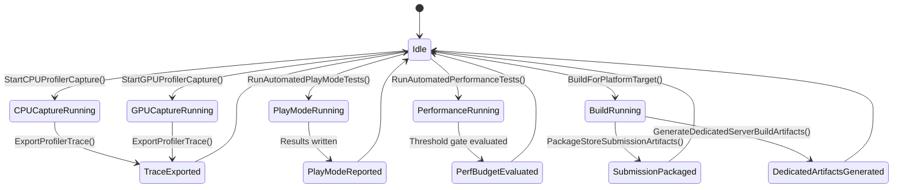

# Phase 28: Profiling, Automation & Production Build Pipeline

## Implementation Plan

---

## Goal

Phase 28 turns the current engine from a development prototype into an instrumented and release-ready delivery pipeline by formalizing profiling capture, runtime automation suites, and production packaging workflows. The implementation introduces first-class CPU/GPU profiling session APIs, deterministic play-mode and performance regression harnesses, and target-aware build orchestration that can produce shipping client outputs and dedicated server artifacts. The design is grounded in the current engine foundations: `Tracy` profiling macros in `Core/Profile.h`, Vulkan frame submission in `Core/RHI/Vulkan/VulkanContext.cpp`, asset cooking in `Core/Asset/AssetPipeline.*`, and existing CMake-based build flow. The outcome is a repeatable, evidence-driven workflow where frame diagnostics, gameplay validation, and distributable artifacts are produced by explicit engine APIs rather than ad hoc manual steps.

---

## Context Map

### Files to Modify

| File | Purpose | Changes Needed |
|------|---------|----------------|
| `CMakeLists.txt` | Build graph and target definitions | Add new profiling/automation/build-pipeline source sets, test targets, and optional dedicated server executable target |
| `Core/Profile.h` | Existing profiling macro entrypoint | Extend from macro-only usage to routed capture channels/session guards consumed by Stage 28 APIs |
| `Core/Application.h` | Runtime host contract | Add opt-in automation/profiling runtime mode wiring for headless test execution and capture sessions |
| `Core/Application.cpp` | Main frame loop and UI update order | Integrate per-frame capture markers, automation tick hooks, and deterministic frame stepping controls |
| `Core/RHI/Vulkan/VulkanContext.h` | Vulkan device/frame abstraction | Add GPU timing query management and pass-level timing extraction hooks |
| `Core/RHI/Vulkan/VulkanContext.cpp` | Frame submission path | Insert timestamp/query capture boundaries and exportable per-pass GPU timing records |
| `Core/UI/ImGuiSubsystem.h` | Debug UI schema | Add profiling/automation/build panel data contracts and capture state presentation |
| `Core/UI/ImGuiSubsystem.cpp` | Debug panel rendering | Implement profiling controls, automation run status, threshold results, and artifact links |
| `Core/UI/UIManager.h` | Cross-subsystem UI coordinator | Add profiler/build status forwarding and automation overlay entrypoints |
| `Core/UI/UIManager.cpp` | UI runtime orchestration | Route stats/capture summaries to ImGui subsystem and expose non-interactive automation status mode |
| `Core/Asset/AssetCooker.h` | Asset cook config types | Extend cook options for platform profile/build configuration mapping |
| `Core/Asset/AssetPipeline.h` | Cooking orchestrator | Add build-pipeline integration points and manifest emission used by packaging stages |
| `Core/Asset/AssetPipeline.cpp` | Asset cook implementation | Add deterministic cook manifests and cook cache validation for package reproducibility |
| `Core/Asset/AssetTypes.h` | Cooked-asset metadata | Add build/profile metadata tags to artifact header metadata payloads |
| `BUILD_GUIDE.md` | Current build runbook | Add Stage 28 workflow for profiling capture, automation execution, and packaging commands |
| `readme.md` | Project status and operational docs | Update limitations/status notes once Stage 28 pipeline APIs are integrated |
| `src/main.cpp` | Client executable entrypoint | Add argument-driven mode selection for automation runner and profiling capture CLI mode |
| `Core/Diagnostics/*` (new) | Profiling services | Add capture session manager, CPU/GPU capture adapters, marker channels, and trace export pipeline |
| `Core/Automation/*` (new) | Runtime validation suite | Add play-mode deterministic runner, performance budget gates, and regression report generation |
| `Core/Build/*` (new) | Production build/publish orchestration | Add target profile resolver, build command executor, artifact packaging, and dedicated-server artifact builder |
| `Tools/Build/*` (new) | Operational scripts | Add host scripts for multi-target orchestration, package assembly, and artifact publishing prep |

### Dependencies (may need updates)

| File | Relationship |
|------|--------------|
| `Core/Window.cpp` | Frame pacing and event loop behavior influences deterministic automation mode |
| `Core/JobSystem/JobSystem.h` + `.cpp` | Background tasks for trace export, performance sampling aggregation, and packaging file operations |
| `Core/State/SceneLoader.h` + `.cpp` | Scene loading and progress lifecycle for deterministic play-mode test setup |
| `Core/State/TransitionManager.h` + `.cpp` | Loading/transition synchronization used by play-mode automation state machine |
| `Core/Network/NetworkServer.h` + `.cpp` | Dedicated server build artifacts align with server runtime binary/flags |
| `Core/Network/NetworkManager.h` + `.cpp` | Runtime role distinctions that inform dedicated-server package profile metadata |

### Test Files

| Test | Coverage |
|------|----------|
| `Core/Tests/Diagnostics/ProfilerCaptureTests.cpp` (new) | `StartCPUProfilerCapture()`, `StartGPUProfilerCapture()`, session boundaries, marker channels |
| `Core/Tests/Diagnostics/TraceExportTests.cpp` (new) | `ExportProfilerTrace()` schema integrity, file outputs, and fallback behavior |
| `Core/Tests/Automation/PlayModeRunnerTests.cpp` (new) | `RunAutomatedPlayModeTests()` deterministic setup, scene lifecycle, and assertions |
| `Core/Tests/Automation/PerformanceRunnerTests.cpp` (new) | `RunAutomatedPerformanceTests()` metric sampling and budget gate evaluation |
| `Core/Tests/Build/BuildPipelineTests.cpp` (new) | `BuildForPlatformTarget()` profile resolution and command graph composition |
| `Core/Tests/Build/ArtifactPackagingTests.cpp` (new) | `PackageStoreSubmissionArtifacts()` bundle layout, metadata, and checksums |
| `Core/Tests/Build/DedicatedServerArtifactTests.cpp` (new) | `GenerateDedicatedServerBuildArtifacts()` headless packaging and symbol manifest generation |
| `Core/Tests/Integration/Stage28EndToEndTests.cpp` (new) | Capture -> export -> automation -> package full workflow |

### Reference Patterns

| File | Pattern |
|------|---------|
| `Core/Profile.h` | Existing profiling macro conventions and Tracy integration contract |
| `Core/Application.cpp` | Main-loop sequencing and subsystem update boundaries for instrumentation hooks |
| `Core/RHI/Vulkan/VulkanContext.cpp` | Frame command recording and submission flow where GPU capture hooks are inserted |
| `Core/UI/ImGuiSubsystem.cpp` | Overlay-style diagnostics panel rendering patterns for new profiling/build dashboards |
| `Core/Asset/AssetPipeline.cpp` | Existing cook orchestrator and manifest update pattern to reuse for build artifacts |
| `docs/plans/phase-21-editor-foundations-prefab-workflow-visual-authoring/implementation-plan.md` | Current planning format baseline (sections, depth, and step granularity) |

### Risk Assessment

- [x] Breaking changes to public API
- [x] Database migrations needed (logical trace/report/build manifest schema versioning)
- [x] Configuration changes required (CMake target graph, build scripts, runtime mode flags)

---

## Requirements

### Profiling Capture APIs (Step 28.1)

- Implement `StartCPUProfilerCapture()` with scoped session IDs, channel filtering, and runtime safety checks
- Implement `StartGPUProfilerCapture()` using pass-level Vulkan timestamp capture and queue-aware aggregation
- Implement `ExportProfilerTrace()` with stable trace schemas (`json`, optional chrome-trace compatibility) and artifact metadata
- Provide capture lifecycle controls (`start`, `stop`, `flush`, `cancel`) with deterministic ownership semantics
- Support marker channels (render, physics, network, UI, scripting, custom)
- Ensure capture APIs degrade gracefully when profiling is disabled at compile-time

### Automated Runtime Validation (Step 28.2)

- Implement `RunAutomatedPlayModeTests()` for deterministic scene-based gameplay packs
- Implement `RunAutomatedPerformanceTests()` with performance budget thresholds per platform profile
- Add deterministic execution controls (fixed timestep, deterministic seed, input script replay)
- Produce machine-readable and human-readable reports (JSON + summary markdown/text)
- Support regression baseline comparison and threshold-based pass/fail gating
- Ensure suites can run in both interactive and headless execution modes

### Production Build and Packaging (Step 28.3)

- Implement `BuildForPlatformTarget()` with profile-driven compile/cook/package stages
- Implement `PackageStoreSubmissionArtifacts()` with storefront-compliant bundles, metadata, and checksums
- Implement `GenerateDedicatedServerBuildArtifacts()` for headless binaries, symbols, and deployment metadata
- Support platform profile matrix expansion (Windows client baseline first, extensible for future targets)
- Emit reproducibility metadata (build config, git commit hash, cook manifest hash, toolchain signature)
- Integrate error categorization and retry-safe behavior for CI/CD orchestration use

---

## Technical Considerations

### System Architecture Overview

```mermaid
graph TD
    subgraph Frontend Layer
        Overlay[ImGui Tooling Overlay]
        ProfilerPanel[Profiler Capture Panel]
        AutomationPanel[Automation Suite Panel]
        BuildPanel[Build and Packaging Panel]
        ResultView[Run Result and Artifact Viewer]
    end

    subgraph API Layer
        ProfilingAPI[Profiling API Facade]
        AutomationAPI[Automation API Facade]
        BuildAPI[Build Pipeline API Facade]
        ValidationAPI[Input Validation and Capability Checks]
    end

    subgraph Business Logic Layer
        CPUSessionSvc[CPUCaptureSessionService]
        GPUSessionSvc[GPUCaptureSessionService]
        TraceExportSvc[TraceExportService]
        PlayModeRunner[PlayModeTestRunner]
        PerfRunner[PerformanceTestRunner]
        BuildOrchestrator[BuildOrchestrator]
        ArtifactPackager[ArtifactPackager]
        DedicatedServerBuilder[DedicatedServerBuildService]
    end

    subgraph Data Layer
        TraceStore[Profiler Trace Store]
        BaselineStore[Automation Baseline Store]
        ReportStore[Test and Performance Reports]
        CookManifest[Cook and Build Manifest]
        ArtifactIndex[Artifact Metadata Index]
    end

    subgraph Infrastructure Layer
        AppLoop[Application Main Loop]
        VulkanContext[VulkanContext Frame Path]
        JobSystem[JobSystem Worker Pool]
        AssetPipeline[AssetPipeline and AssetCooker]
        CMakeLayer[CMake Targets and Build Presets]
        ScriptLayer[Build Scripts and CI Entry Scripts]
    end

    Overlay --> ProfilerPanel
    Overlay --> AutomationPanel
    Overlay --> BuildPanel
    Overlay --> ResultView

    ProfilerPanel --> ProfilingAPI
    AutomationPanel --> AutomationAPI
    BuildPanel --> BuildAPI
    ResultView --> BuildAPI
    ResultView --> AutomationAPI

    ProfilingAPI --> ValidationAPI
    ProfilingAPI --> CPUSessionSvc
    ProfilingAPI --> GPUSessionSvc
    ProfilingAPI --> TraceExportSvc

    AutomationAPI --> ValidationAPI
    AutomationAPI --> PlayModeRunner
    AutomationAPI --> PerfRunner

    BuildAPI --> ValidationAPI
    BuildAPI --> BuildOrchestrator
    BuildAPI --> ArtifactPackager
    BuildAPI --> DedicatedServerBuilder

    CPUSessionSvc --> AppLoop
    GPUSessionSvc --> VulkanContext
    TraceExportSvc --> TraceStore
    PlayModeRunner --> ReportStore
    PerfRunner --> ReportStore
    PerfRunner --> BaselineStore
    BuildOrchestrator --> CMakeLayer
    BuildOrchestrator --> AssetPipeline
    ArtifactPackager --> ArtifactIndex
    DedicatedServerBuilder --> ArtifactIndex
    AssetPipeline --> CookManifest
    ScriptLayer --> BuildOrchestrator
    JobSystem --> TraceExportSvc
    JobSystem --> ArtifactPackager
```



### Technology Stack Selection

| Layer | Technology | Rationale |
|-------|------------|-----------|
| Frontend | Existing Dear ImGui tooling panels | Fastest path for in-engine capture/test/build controls with no extra UI dependencies |
| API | C++ engine facades with typed request/response contracts | Matches existing architecture and avoids brittle shell-only orchestration |
| Business Logic | Service classes (`Diagnostics`, `Automation`, `Build`) | Isolates Stage 28 workflows from render/gameplay runtime paths |
| Data | JSON-based traces/reports/manifests + cooked asset metadata | Reuses existing serialization patterns and keeps tooling outputs diff-friendly |
| Infrastructure | Tracy + Vulkan timestamps + CMake + JobSystem + PowerShell scripts | Leverages currently integrated stack (`Tracy`, Vulkan, CMake) with minimal dependency drift |

### Integration Points

- **Main Loop Integration**: `Application::Run()` provides session boundaries and deterministic frame stepping for capture/test mode
- **Render Integration**: `VulkanContext::DrawFrame()` provides pass/queue timing anchors for GPU capture
- **UI Integration**: `ImGuiSubsystem` and `UIManager` surface controls/results without disrupting gameplay overlays
- **Asset Integration**: `AssetPipeline` and `AssetCooker` produce cook manifests consumed by packaging
- **Build Integration**: CMake targets and scripts are orchestrated by typed API entrypoints to avoid manual command drift

### Deployment Architecture

```text
Core/
├── Diagnostics/
│   ├── ProfilerCaptureTypes.h
│   ├── ProfilerCaptureService.h/.cpp
│   ├── CPUProfilerCapture.h/.cpp
│   ├── GPUProfilerCapture.h/.cpp
│   ├── ProfilerChannelRegistry.h/.cpp
│   ├── TraceExporter.h/.cpp
│   └── TraceSchemas.h
├── Automation/
│   ├── AutomationTypes.h
│   ├── PlayModeTestRunner.h/.cpp
│   ├── PerformanceTestRunner.h/.cpp
│   ├── BaselineComparator.h/.cpp
│   └── AutomationReportWriter.h/.cpp
├── Build/
│   ├── BuildPipelineTypes.h
│   ├── PlatformBuildProfiles.h
│   ├── BuildOrchestrator.h/.cpp
│   ├── ArtifactPackager.h/.cpp
│   ├── StoreSubmissionPackager.h/.cpp
│   ├── DedicatedServerBuildService.h/.cpp
│   └── BuildManifestWriter.h/.cpp
├── UI/
│   ├── ImGuiSubsystem.h/.cpp            # Stage 28 control/result panels
│   └── UIManager.h/.cpp                 # Stage 28 status plumbing
├── RHI/Vulkan/
│   ├── VulkanContext.h/.cpp             # GPU timestamp and pass timing hooks
│   └── VulkanQueryHelpers.h/.cpp        # Query pool helper abstraction
└── Asset/
    ├── AssetCooker.h/.cpp               # Profile-aware cook options
    └── AssetPipeline.h/.cpp             # Build manifest and packaging hand-off

Tools/
└── Build/
    ├── build_for_target.ps1
    ├── package_store_submission.ps1
    └── generate_dedicated_server_artifacts.ps1
```

### Scalability Considerations

- **Trace buffering**: ring-buffered capture events with backpressure policy to prevent runaway allocations
- **Query batching**: GPU timestamp queries pooled and recycled per frame to avoid query object churn
- **Suite partitioning**: automation suites support sharding by scene/test category for parallel CI execution
- **Incremental packaging**: artifact packager reuses unchanged cooked bundles via manifest hash comparison
- **Profile matrix growth**: build profile schema supports adding new platform targets without API signature churn

---

## Database Schema Design

> This phase does not introduce an RDBMS. The model below defines logical trace/report/build records serialized as JSON manifests and artifact indexes.

### Profiling + Automation + Build Data Model

```mermaid
erDiagram
    PROFILER_CAPTURE_SESSION ||--o{ PROFILER_MARKER_CHANNEL : uses
    PROFILER_CAPTURE_SESSION ||--o{ GPU_PASS_TIMING : records
    PROFILER_CAPTURE_SESSION ||--o{ TRACE_ARTIFACT : exports
    PLAYMODE_TEST_RUN ||--o{ PLAYMODE_TEST_CASE_RESULT : contains
    PERFORMANCE_TEST_RUN ||--o{ PERFORMANCE_METRIC_SAMPLE : captures
    PERFORMANCE_TEST_RUN ||--o{ PERFORMANCE_BUDGET_RESULT : evaluates
    BUILD_EXECUTION ||--o{ BUILD_ARTIFACT : outputs
    BUILD_EXECUTION ||--o{ STORE_SUBMISSION_PACKAGE : bundles
    BUILD_EXECUTION ||--o{ DEDICATED_SERVER_ARTIFACT : generates

    PROFILER_CAPTURE_SESSION {
        string session_id PK
        string capture_type "cpu|gpu|mixed"
        datetime started_at
        datetime ended_at
        string profile_name
        bool completed
    }

    PROFILER_MARKER_CHANNEL {
        string channel_id PK
        string session_id FK
        string channel_name
        int event_count
    }

    GPU_PASS_TIMING {
        string timing_id PK
        string session_id FK
        string pass_name
        float gpu_time_ms
        string queue_name
    }

    TRACE_ARTIFACT {
        string artifact_id PK
        string session_id FK
        string format "json|chrome_trace"
        string path
        string checksum
    }

    PLAYMODE_TEST_RUN {
        string run_id PK
        string suite_name
        string scene_name
        int deterministic_seed
        bool passed
    }

    PLAYMODE_TEST_CASE_RESULT {
        string case_id PK
        string run_id FK
        string test_name
        string status "pass|fail|skip"
        string failure_reason
    }

    PERFORMANCE_TEST_RUN {
        string perf_run_id PK
        string profile_name
        int frame_count
        bool threshold_passed
    }

    PERFORMANCE_METRIC_SAMPLE {
        string sample_id PK
        string perf_run_id FK
        string metric_name
        float value
        int frame_index
    }

    PERFORMANCE_BUDGET_RESULT {
        string budget_result_id PK
        string perf_run_id FK
        string budget_name
        float threshold
        float observed
        bool passed
    }

    BUILD_EXECUTION {
        string build_id PK
        string target_platform
        string configuration
        string commit_hash
        datetime started_at
        datetime ended_at
        string status
    }

    BUILD_ARTIFACT {
        string artifact_id PK
        string build_id FK
        string artifact_type
        string output_path
        string checksum
    }

    STORE_SUBMISSION_PACKAGE {
        string package_id PK
        string build_id FK
        string storefront
        string manifest_path
        string bundle_path
    }

    DEDICATED_SERVER_ARTIFACT {
        string server_artifact_id PK
        string build_id FK
        string binary_path
        string symbols_path
        string deployment_manifest_path
    }
```



### Table Specifications

| Logical Table | Critical Fields | Constraints |
|---------------|-----------------|------------|
| `PROFILER_CAPTURE_SESSION` | `session_id`, `capture_type`, `started_at`, `completed` | Session ID unique, capture type required |
| `TRACE_ARTIFACT` | `artifact_id`, `session_id`, `format`, `path` | Artifact must reference existing session |
| `PLAYMODE_TEST_CASE_RESULT` | `case_id`, `run_id`, `status` | Status constrained to pass/fail/skip |
| `PERFORMANCE_BUDGET_RESULT` | `budget_result_id`, `budget_name`, `threshold`, `observed` | Numeric thresholds required, pass computed from observed vs threshold |
| `BUILD_ARTIFACT` | `artifact_id`, `build_id`, `artifact_type`, `output_path` | Build ID required, output path must pass path validation |

### Indexing Strategy

- Session lookup index: `(session_id)`
- Trace retrieval index: `(session_id, format)`
- Test run lookup index: `(suite_name, scene_name, run_id)`
- Performance budget lookup index: `(perf_run_id, budget_name)`
- Build artifact lookup index: `(build_id, artifact_type)`

### Foreign Key Relationships

- `PROFILER_MARKER_CHANNEL.session_id -> PROFILER_CAPTURE_SESSION.session_id`
- `GPU_PASS_TIMING.session_id -> PROFILER_CAPTURE_SESSION.session_id`
- `PLAYMODE_TEST_CASE_RESULT.run_id -> PLAYMODE_TEST_RUN.run_id`
- `PERFORMANCE_METRIC_SAMPLE.perf_run_id -> PERFORMANCE_TEST_RUN.perf_run_id`
- `BUILD_ARTIFACT.build_id -> BUILD_EXECUTION.build_id`

### Database Migration Strategy

- Version all persisted outputs (`trace_schema_version`, `report_schema_version`, `build_manifest_version`)
- Keep forward migration adapters in `TraceExporter` and report readers
- Write canonical latest schema on successful export/package completion
- Keep migration provenance metadata in artifact manifests for regression forensics

---

## API Design

### Stage 28 Runtime API Surface (C++)

```cpp
namespace Core::Diagnostics {

struct ProfilerCaptureRequest;
struct ProfilerCaptureSession;
struct TraceExportRequest;
struct TraceExportResult;

// Step 28.1
Result<ProfilerCaptureSession> StartCPUProfilerCapture(const ProfilerCaptureRequest& request);
Result<ProfilerCaptureSession> StartGPUProfilerCapture(const ProfilerCaptureRequest& request);
Result<TraceExportResult> ExportProfilerTrace(const TraceExportRequest& request);

} // namespace Core::Diagnostics

namespace Core::Automation {

struct PlayModeSuiteRequest;
struct PlayModeSuiteResult;
struct PerformanceSuiteRequest;
struct PerformanceSuiteResult;

// Step 28.2
Result<PlayModeSuiteResult> RunAutomatedPlayModeTests(const PlayModeSuiteRequest& request);
Result<PerformanceSuiteResult> RunAutomatedPerformanceTests(const PerformanceSuiteRequest& request);

} // namespace Core::Automation

namespace Core::Build {

struct PlatformBuildRequest;
struct PlatformBuildResult;
struct StoreSubmissionRequest;
struct StoreSubmissionResult;
struct DedicatedServerBuildRequest;
struct DedicatedServerBuildResult;

// Step 28.3
Result<PlatformBuildResult> BuildForPlatformTarget(const PlatformBuildRequest& request);
Result<StoreSubmissionResult> PackageStoreSubmissionArtifacts(const StoreSubmissionRequest& request);
Result<DedicatedServerBuildResult> GenerateDedicatedServerBuildArtifacts(const DedicatedServerBuildRequest& request);

} // namespace Core::Build
```

### Request/Response Contracts (Tooling JSON Types)

```ts
type ProfilerCaptureRequest = {
  profileName: string;
  channels: Array<"render" | "physics" | "network" | "ui" | "script" | "custom">;
  durationMs?: number;
  includeCpu: boolean;
  includeGpu: boolean;
  outputDirectory?: string;
};

type TraceExportRequest = {
  sessionId: string;
  format: "json" | "chrome_trace";
  outputPath: string;
  compress?: boolean;
};

type PlayModeSuiteRequest = {
  suiteName: string;
  scenePath: string;
  deterministicSeed: number;
  fixedDeltaTime: number;
  maxFrames: number;
  assertions: string[];
};

type PerformanceSuiteRequest = {
  profileName: string;
  scenarioId: string;
  warmupFrames: number;
  sampleFrames: number;
  budgets: Array<{ metric: "frame_ms" | "cpu_ms" | "gpu_ms" | "memory_mb"; threshold: number }>;
};

type PlatformBuildRequest = {
  platform: "windows-client";
  configuration: "Debug" | "Release";
  cookProfile: string;
  includeSymbols: boolean;
  outputDirectory: string;
};

type StoreSubmissionRequest = {
  storefront: "steam" | "epic" | "internal";
  buildId: string;
  channel: "qa" | "staging" | "production";
  metadata: Record<string, string>;
};

type DedicatedServerBuildRequest = {
  platform: "windows-server";
  configuration: "Release";
  includeSymbols: boolean;
  outputDirectory: string;
  serverConfigTemplatePath?: string;
};
```

### Authentication and Authorization

- Local engine APIs are process-local and do not require user identity tokens
- If exposed to MCP tooling, route through capability checks (`build.execute`, `automation.execute`, `profiling.capture`)
- Restrict filesystem writes to project-approved paths using existing path validation patterns
- Disallow production package creation if validation checks (manifest integrity, required metadata) fail

### Error Handling Strategies

| Error Code | Scenario | Strategy |
|-----------|----------|----------|
| `PROFILER_NOT_ENABLED` | Capture request when `TRACY_ENABLE`/capture backend unavailable | Return explicit failure and capabilities report |
| `PROFILER_SESSION_ACTIVE` | Start request while incompatible capture session is active | Reject or queue based on request policy |
| `TRACE_EXPORT_FAILED` | Serialization or filesystem write failure | Return partial diagnostics + preserve raw session state for retry |
| `AUTOMATION_SCENE_LOAD_FAILED` | Play mode suite scene cannot be loaded | Mark run failed with scene diagnostic details |
| `PERF_BUDGET_EXCEEDED` | Performance thresholds violated | Report failing metrics and include sample windows |
| `BUILD_PROFILE_INVALID` | Unknown or incomplete target profile | Reject before command execution |
| `PACKAGE_MANIFEST_INVALID` | Store metadata missing/invalid | Reject package and emit required field list |
| `DEDICATED_SERVER_ARTIFACT_FAILED` | Server binary/symbol bundle incomplete | Mark artifact generation failed with missing outputs |

### Rate Limiting and Caching Strategies

- Capture request cooldown per process to avoid overlapping high-cost captures
- Cache performance baseline files by `(profile, scenario, build config)` hash
- Cache cooked assets and skip unchanged inputs via `AssetPipeline` manifest checks
- Use trace chunked serialization for large captures to cap memory spikes

---

## Frontend Architecture

### Component Hierarchy Documentation

```text
Developer Tooling Workspace
├── Profiling Panel
│   ├── Capture Type Selector (CPU/GPU/Mixed)
│   ├── Marker Channel Selector
│   ├── Start/Stop Capture Controls
│   └── Export Trace Actions
├── Automation Panel
│   ├── Play-Mode Suite Runner
│   │   ├── Scene Selector
│   │   ├── Seed/Frame Config
│   │   └── Assertion Pack Selector
│   ├── Performance Suite Runner
│   │   ├── Profile Scenario Selector
│   │   ├── Budget Threshold Editor
│   │   └── Baseline Compare Toggle
│   └── Run Summary Grid
├── Build Pipeline Panel
│   ├── Platform/Config Profile Selector
│   ├── Build/Cook/Package Stage Toggles
│   ├── Submission Metadata Editor
│   └── Dedicated Server Artifact Generator
└── Artifact and Report Explorer
    ├── Trace Artifact List
    ├── Test Report List
    ├── Build Artifact Manifest
    └── Open Folder / Copy Path Actions
```

### State Flow Diagram



### Reusable Component Library Specifications

| UI Element | Reuse Strategy |
|-----------|-----------------|
| Profile selector row | Shared between profiling capture and performance suites |
| Run progress timeline | Shared visualization for automation and build stage progress |
| Results table | Shared sorted/filterable table for traces, test runs, and artifacts |
| Status badge system | Shared pass/fail/warn indicators across all Stage 28 panels |
| Manifest diff viewer | Shared utility for build and trace metadata comparisons |

### State Management Patterns

- Central `ToolingRuntimeState` object holds capture sessions, automation runs, and build jobs
- Immutable result payloads persisted after each run to avoid accidental mutation
- Event topics: `CaptureStarted`, `CaptureCompleted`, `SuiteStarted`, `SuiteCompleted`, `BuildStageChanged`, `ArtifactPublished`
- Deterministic update ordering:
  1. Poll run/build/capture workers
  2. Apply completed state transitions
  3. Update panel view models
  4. Render overlays

### Type Definitions (C++)

```cpp
struct ToolingRuntimeState {
    Diagnostics::CaptureSessionState Capture;
    Automation::AutomationRunState Automation;
    Build::BuildRunState Build;
    std::vector<std::string> RecentArtifacts;
};

struct BuildStageStatus {
    std::string StageName;
    BuildStageState State = BuildStageState::Pending;
    std::string Message;
    uint64_t DurationMs = 0;
};
```

---

## Security & Performance

### Authentication/Authorization Requirements

- Capability-gate mutation workflows when invoked through MCP or remote tool channels
- Require explicit `allowFilesystemWrites` runtime flag for packaging/export operations
- Separate read-only diagnostics mode from write-capable build mode

### Data Validation and Sanitization

- Validate all output paths using existing path validation conventions (`AssetLoader`/`AssetCooker` patterns)
- Validate profile and platform enums against allowlisted values
- Validate package metadata completeness before bundle creation
- Validate trace export format and size bounds before writing to disk

### Performance Optimization Strategies

| Technique | Target | Implementation |
|-----------|--------|----------------|
| Capture ring buffers | O(1) event ingestion | Lock-minimized fixed-capacity channels per marker stream |
| GPU query pooling | Zero per-frame query allocation | Reuse timestamp query pools across frames |
| Async trace serialization | No render-loop stalls | Export on worker threads after capture stop |
| Deterministic test stepping | Stable comparisons | Fixed timestep and seeded simulation |
| Incremental build/cook | Reduced rebuild time | Manifest/hash-driven dirty detection |
| Artifact deduplication | Reduced storage | Reuse unchanged bundles by checksum |

### Caching Mechanisms

- Trace cache index by `(session_id, format, compression)`
- Baseline cache by `(scenario, profile, config)`
- Build cache by `(platform, config, cook_profile, commit_hash)`
- Artifact checksum cache to skip duplicate package writes

### Performance Budget

| System | Budget Goal |
|--------|-------------|
| CPU capture overhead | <= 1.0 ms/frame in active capture mode |
| GPU capture overhead | <= 0.5 ms/frame when timestamping key passes |
| Play-mode automation variance | <= 2% frame-time drift across deterministic reruns |
| Performance suite runtime overhead | <= 5% over baseline frame cost |
| Build manifest generation | <= 1s per build output set |

---

## Detailed Step Breakdown

### Step 28.1: First-class CPU/GPU Profiling Capture APIs

#### Sub-step 28.1.1: `StartCPUProfilerCapture()` (v0.28.1.1)
- Create `Core/Diagnostics/CPUProfilerCapture.h/.cpp` and define capture request/session types
- Add channel filter registration (`render`, `physics`, `network`, `ui`, `script`, `custom`)
- Implement session lifecycle checks (single-writer policy, optional queued sessions)
- Route macro-based events (`PROFILE_SCOPE`, `PROFILE_FUNCTION`) through channel-aware capture adapter
- **Deliverable**: CPU capture API with scoped session start semantics

#### Sub-step 28.1.2: `StartGPUProfilerCapture()` (v0.28.1.2)
- Extend `VulkanContext` with timestamp query pool initialization and per-pass query indices
- Instrument frame path around key render boundaries for pass-level timestamps
- Aggregate queue timing results into normalized GPU timing events
- Support queue breakdown metadata in capture outputs
- **Deliverable**: GPU capture API with pass-level timing and queue attribution

#### Sub-step 28.1.3: `ExportProfilerTrace()` (v0.28.1.3)
- Create `Core/Diagnostics/TraceExporter.h/.cpp` with typed export request/result
- Define Stage 28 trace schema with session metadata, marker channels, and timing events
- Implement json and optional chrome trace format writers
- Emit checksum and export manifest metadata for downstream automation/build reports
- **Deliverable**: Persisted profiler trace artifacts and manifest

#### Sub-step 28.1.4: Marker Channel Registry (v0.28.1.4)
- Add `ProfilerChannelRegistry` for dynamic channel create/enable/disable behavior
- Provide per-channel priority and sampling policy configuration
- Add channel registry introspection for UI panel visualization
- **Deliverable**: Runtime-configurable marker channel system

#### Sub-step 28.1.5: Capture Session Coordination (v0.28.1.5)
- Implement `ProfilerCaptureService` that coordinates CPU and GPU capture lifecycles
- Add capture state machine (`Idle`, `Arming`, `Capturing`, `Stopping`, `Exporting`)
- Ensure thread-safe hand-off between frame thread and background exporter jobs
- **Deliverable**: Unified capture session coordinator

#### Sub-step 28.1.6: Profiling UI and CLI Hooks (v0.28.1.6)
- Add capture controls and session summaries in `ImGuiSubsystem` tooling panel
- Add command-line mode entrypoint for scripted capture sessions in `main.cpp`
- Expose recent capture artifacts and quick-export actions in tooling UI
- **Deliverable**: Usable profiling workflow for interactive and scripted runs

#### Sub-step 28.1.7: Capture Integrity and Fail-safe Handling (v0.28.1.7)
- Add guardrails for large traces (event caps, size caps, chunked writes)
- Add partial-export recovery metadata for interrupted captures
- Add diagnostics when profiling backend is unavailable or partially configured
- **Deliverable**: Robust capture reliability and diagnostics

---

### Step 28.2: Automated Runtime Validation Suites

#### Sub-step 28.2.1: `RunAutomatedPlayModeTests()` (v0.28.2.1)
- Create `Core/Automation/PlayModeTestRunner.h/.cpp` with scene + assertion suite model
- Integrate deterministic scene boot using `SceneLoader` and fixed-step simulation mode
- Add input script replay and event assertions for core gameplay flows
- Generate structured pass/fail results with per-case diagnostics
- **Deliverable**: Deterministic play-mode regression runner API

#### Sub-step 28.2.2: `RunAutomatedPerformanceTests()` (v0.28.2.2)
- Create `Core/Automation/PerformanceTestRunner.h/.cpp`
- Collect sampled CPU/GPU/frame/memory metrics across warmup and measurement windows
- Evaluate sampled metrics against profile-specific budget thresholds
- Emit gating results (pass/fail with threshold deltas)
- **Deliverable**: Performance regression runner with threshold gates

#### Sub-step 28.2.3: Deterministic Execution Harness (v0.28.2.3)
- Add automation runtime mode to `Application` for fixed timestep and seeded randomness
- Freeze non-deterministic runtime factors during automation windows
- Add explicit lifecycle boundaries for setup/run/teardown phases
- **Deliverable**: Stable deterministic runtime harness

#### Sub-step 28.2.4: Baseline Comparison and Drift Detection (v0.28.2.4)
- Create baseline comparison service with tolerance windows per metric/test
- Record baseline snapshots keyed by profile + scenario + configuration
- Flag regressions with ranked root-cause hints (cpu/gpu/memory hotspots)
- **Deliverable**: Regression drift detection layer

#### Sub-step 28.2.5: Report Writers and Artifact Emission (v0.28.2.5)
- Add automation report writers (`json`, summary text/markdown)
- Attach profiler trace artifact references to failing runs when available
- Include environment metadata (build config, seed, machine profile) in reports
- **Deliverable**: Consumable and auditable automation report outputs

#### Sub-step 28.2.6: Tooling Surface and Failure Triage (v0.28.2.6)
- Add automation panel controls in `ImGuiSubsystem`
- Add failed-case drill-down and artifact link-outs
- Add standardized failure classification tags for CI parsing
- **Deliverable**: Fast failure triage workflow in tooling UI

---

### Step 28.3: Shipping-grade Multi-platform Packaging Flow

#### Sub-step 28.3.1: `BuildForPlatformTarget()` (v0.28.3.1)
- Create `Core/Build/BuildOrchestrator.h/.cpp` and profile schema types
- Define stage graph (`configure`, `compile`, `cook`, `package`) with stage-level status tracking
- Execute CMake and asset cook pipeline with platform/config-specific parameters
- Persist build execution metadata and stage timings
- **Deliverable**: Platform-target build orchestration API

#### Sub-step 28.3.2: `PackageStoreSubmissionArtifacts()` (v0.28.3.2)
- Create `Core/Build/StoreSubmissionPackager.h/.cpp`
- Assemble storefront bundles (binary payload, metadata manifest, checksums, release notes payload)
- Validate required storefront metadata fields and compliance constraints
- Emit package manifest and artifact index entries
- **Deliverable**: Store submission package generation API

#### Sub-step 28.3.3: `GenerateDedicatedServerBuildArtifacts()` (v0.28.3.3)
- Create `Core/Build/DedicatedServerBuildService.h/.cpp`
- Produce headless server package contents (server binary, config template, symbols, deployment manifest)
- Emit server-specific artifact metadata for deployment systems
- Ensure server bundle excludes client-only assets and UI-heavy payloads
- **Deliverable**: Dedicated server artifact generation API

#### Sub-step 28.3.4: Artifact Manifest and Reproducibility (v0.28.3.4)
- Create build manifest writer with deterministic ordering and checksums
- Include git commit hash, build profile hash, and cook manifest hash in outputs
- Add manifest validation pass before package publication
- **Deliverable**: Reproducible build and artifact metadata guarantees

#### Sub-step 28.3.5: Symbol and Debug Artifact Policy (v0.28.3.5)
- Add configurable symbol generation/retention policy (`includeSymbols`, retention class)
- Package symbols separately with cross-reference manifest
- Support secure symbol path mapping for internal crash analysis workflows
- **Deliverable**: Structured symbol artifact handling

#### Sub-step 28.3.6: Scripted Entry Points and CI Readiness (v0.28.3.6)
- Add `Tools/Build/*.ps1` wrappers for build/package/server-artifact API execution
- Standardize exit codes and output payload formats for CI consumption
- Add dry-run mode for command graph validation without side effects
- **Deliverable**: Automation-friendly build and packaging command surface

---

## Dependencies

### External Libraries

- `Tracy` (already present) for CPU profiling event instrumentation backbone
- `Vulkan` timing query features for GPU pass-level timing
- `nlohmann_json` for trace/report/build manifest serialization
- `CMake` as the authoritative configure/build execution layer

### Internal Dependencies

- `Core/Profile.h`
- `Core/Application.h` + `Core/Application.cpp`
- `Core/RHI/Vulkan/VulkanContext.h` + `Core/RHI/Vulkan/VulkanContext.cpp`
- `Core/UI/ImGuiSubsystem.h` + `Core/UI/ImGuiSubsystem.cpp`
- `Core/UI/UIManager.h` + `Core/UI/UIManager.cpp`
- `Core/Asset/AssetCooker.h` + `Core/Asset/AssetCooker.cpp`
- `Core/Asset/AssetPipeline.h` + `Core/Asset/AssetPipeline.cpp`
- `Core/State/SceneLoader.h` + `Core/State/SceneLoader.cpp`
- `Core/JobSystem/JobSystem.h` + `Core/JobSystem/JobSystem.cpp`
- `CMakeLists.txt`

### Integration Requirements

- Add new Stage 28 modules to `EngineCore` source list in `CMakeLists.txt`
- Add optional dedicated server executable target (headless profile) once runtime entrypoint is defined
- Keep Stage 28 features opt-in via config flags to avoid altering default gameplay loop behavior

---

## Testing Strategy

### Unit Tests

| Test | Description |
|------|-------------|
| `Profiler_StartCPUSession` | Starts CPU capture with valid channel set |
| `Profiler_StartGPUSession` | Starts GPU capture and validates query allocation |
| `Profiler_ExportTraceJson` | Exports valid trace schema with required metadata |
| `Profiler_ExportTraceChunking` | Handles large capture export with chunking enabled |
| `Automation_PlayModeDeterministicSeed` | Repeated runs produce identical assertion outcomes |
| `Automation_PlayModeSceneLoadFailure` | Scene load failures return explicit diagnostics |
| `Automation_PerformanceBudgetPass` | Threshold gate passes under expected metrics |
| `Automation_PerformanceBudgetFail` | Threshold gate fails and reports violated metric |
| `Build_ProfileResolution` | Platform profile resolves compile/cook/package stage graph |
| `Build_PackageManifestValidation` | Store package fails on missing required metadata |
| `Build_DedicatedServerArtifactLayout` | Dedicated server output includes required binary/symbol/manifest |
| `Build_ArtifactChecksumStability` | Artifact checksums stable across identical inputs |

### Integration Tests

| Test | Description |
|------|-------------|
| `Stage28_CaptureToExport` | Start capture -> stop -> export trace -> validate artifact index |
| `Stage28_PlayModeWithProfiling` | Run play-mode suite with active capture and attach traces on failure |
| `Stage28_PerfSuiteWithBudgets` | Run performance suite and compare against saved baseline |
| `Stage28_BuildAndPackage` | Build target -> cook assets -> package submission artifacts |
| `Stage28_DedicatedServerArtifacts` | Build server target and generate deployable server artifact set |

### Performance Tests

| Test | Target |
|------|--------|
| `ProfilerCapture_OverheadCPU` | <= 1.0 ms/frame overhead while CPU capture active |
| `ProfilerCapture_OverheadGPU` | <= 0.5 ms/frame overhead for pass-level timestamping |
| `AutomationSuite_100Cases` | Complete deterministic suite in bounded runtime envelope |
| `PerfRegression_SamplingWindow` | Metric variance <= 2% across repeated deterministic runs |
| `BuildPipeline_Incremental` | Incremental rebuild skips unchanged stages and assets |

### Manual Validation Matrix

- Verify profiling panel can start/stop/export CPU and GPU captures without restarting application
- Verify automation suites run in both interactive and headless modes
- Verify build pipeline panel surfaces clear stage failures and artifact output paths
- Verify store package and dedicated server artifact manifests contain required metadata

---

## Risk Mitigation

| Risk | Impact | Mitigation |
|------|--------|------------|
| Profiling capture introduces frame stutter | High | Use ring buffers, deferred export, and bounded event retention |
| GPU timestamp integration destabilizes render path | High | Introduce query path behind feature flag and validation checks per device |
| Automation suites become flaky | High | Enforce deterministic mode (fixed timestep + seeded execution + stable scene setup) |
| Build orchestration drifts from actual CMake workflow | Medium | Execute canonical CMake commands only; avoid duplicated build logic |
| Package metadata mismatch for storefront submission | Medium | Validate against required schema before packaging |
| Dedicated server artifacts include client-only payloads | Medium | Use explicit include/exclude manifests and dedicated profile gating |

---

## Milestones

1. **v0.28.1.x** - Profiling capture APIs (`StartCPUProfilerCapture`, `StartGPUProfilerCapture`, `ExportProfilerTrace`)
2. **v0.28.2.x** - Automated validation APIs (`RunAutomatedPlayModeTests`, `RunAutomatedPerformanceTests`)
3. **v0.28.3.x** - Build and packaging APIs (`BuildForPlatformTarget`, `PackageStoreSubmissionArtifacts`, `GenerateDedicatedServerBuildArtifacts`)
4. **v0.28.4.x** - Integration hardening (reports, manifests, CI script entrypoints, diagnostics)

---

## References

- `engine_roadmap.md` (Phase 28 section, Step 28.1 - Step 28.3)
- `docs/plans/phase-21-editor-foundations-prefab-workflow-visual-authoring/implementation-plan.md` (format/style precedent)
- `Core/Profile.h` (profiling macro baseline and Tracy integration)
- `Core/Application.h` + `Core/Application.cpp` (runtime main loop integration point)
- `Core/RHI/Vulkan/VulkanContext.h` + `Core/RHI/Vulkan/VulkanContext.cpp` (GPU timing hook insertion points)
- `Core/UI/ImGuiSubsystem.h` + `Core/UI/ImGuiSubsystem.cpp` (tooling panel rendering patterns)
- `Core/UI/UIManager.h` + `Core/UI/UIManager.cpp` (UI orchestration and stats relay)
- `Core/Asset/AssetCooker.h` + `Core/Asset/AssetCooker.cpp` (cook options and path validation patterns)
- `Core/Asset/AssetPipeline.h` + `Core/Asset/AssetPipeline.cpp` (asset cook orchestration and manifest pattern)
- `BUILD_GUIDE.md` and `readme.md` (current build workflow and known limitations baseline)
