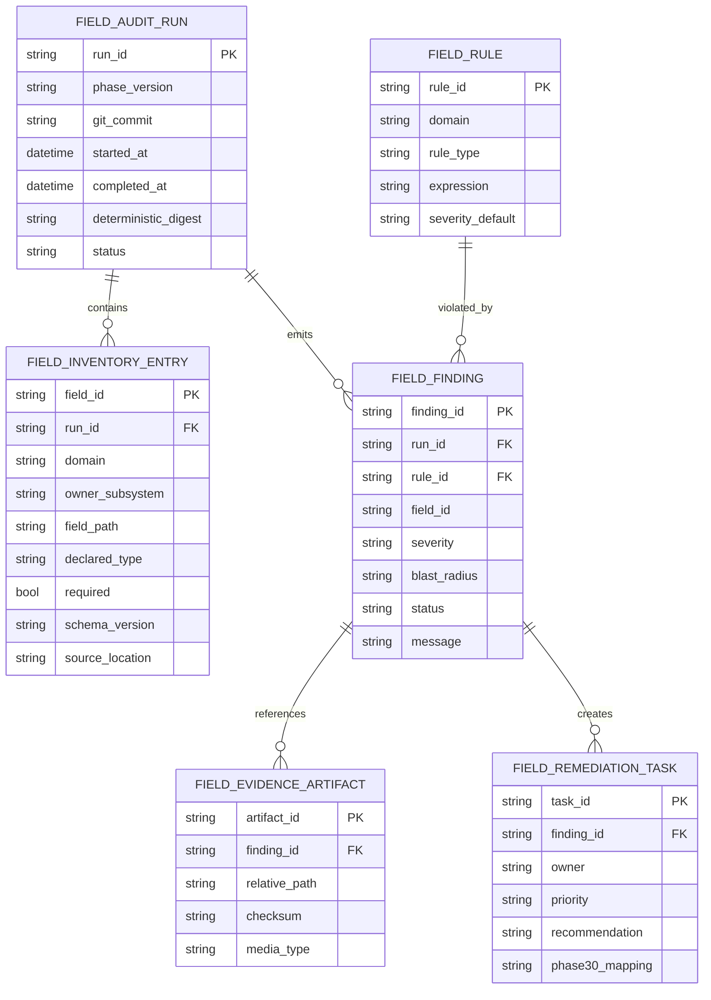
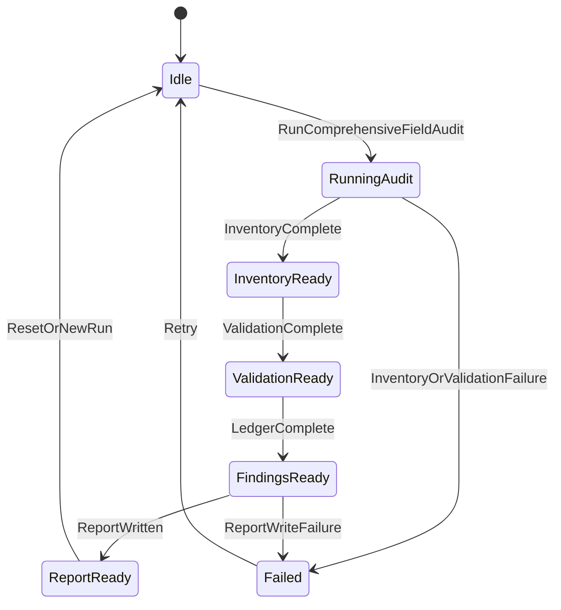

# Phase 29: Comprehensive Field Audit & Contract Validation

## Implementation Plan

---

## Goal

Phase 29 establishes a complete, deterministic audit system for every field contract surfaced by the engine runtime, serialized content, networking payloads, tooling protocols, and build artifacts. The implementation formalizes field inventory generation, rule-driven validation, and full-surface audit execution with reproducible outputs that can feed Phase 30 remediation work. This phase must produce machine-readable evidence and a prioritized issue ledger so defects can be fixed without ambiguous ownership or unverifiable claims. The final result is a stable audit baseline that can be rerun per build, compared across revisions, and enforced as a release gate for high-risk schema drift.

---

## Context Map

### Files to Modify

| File | Purpose | Changes Needed |
|------|---------|----------------|
| `CMakeLists.txt` | Build graph and test registration | Add Phase 29 audit modules and test targets |
| `Core/Application.h` | Runtime orchestration contract | Add optional audit bootstrap entrypoints for headless/manual execution |
| `Core/Application.cpp` | Main loop orchestration | Add non-invasive hooks for audit mode scheduling and report publication |
| `Core/UI/ImGuiSubsystem.h` | Tooling UI contract | Add field-audit panel data types and command triggers |
| `Core/UI/ImGuiSubsystem.cpp` | Debug tooling surface | Add field inventory/report visualization and run controls |
| `Core/MCP/MCPAllTools.h` | MCP tool registry | Register Stage 29 MCP tools for triggering and querying audits |
| `Core/MCP/MCPServer.cpp` | MCP server handlers | Add request parsing, execution routing, and response schemas for audit tools |
| `Core/MCP/JsonSerialization.h` | MCP payload schema helpers | Add JSON contracts for field inventory entries and findings |
| `Core/Asset/AssetPipeline.h` | Asset orchestration contracts | Expose manifest/schema metadata required for artifact field scans |
| `Core/Asset/AssetPipeline.cpp` | Asset pipeline implementation | Add audit extraction adapters for cooked/build manifests |
| `Core/State/SaveFile.h` | Save schema contract | Expose explicit field descriptors and schema version metadata |
| `Core/State/SaveFile.cpp` | Save serialization behavior | Add deterministic field-path export and compatibility flags |
| `Core/Network/NetworkContractState.h` | Network contract snapshot | Add field parity descriptors for replication/RPC/replay surfaces |
| `Core/Network/NetworkContractState.cpp` | Contract state assembly | Emit transport-facing field metadata for audit ingestion |
| `Core/Build/BuildPipelineTypes.h` | Build artifact schema contracts | Extend artifact metadata descriptors for audit visibility |
| `Core/Build/BuildOrchestrator.cpp` | Build output assembly | Publish field-level manifest metadata used by artifact audits |
| `Core/Build/StoreSubmissionPackager.cpp` | Store package metadata generation | Emit field descriptors and checksums for package schema audits |
| `Core/Build/DedicatedServerBuildService.cpp` | Dedicated server artifact generation | Emit deploy descriptor field metadata for audit checks |
| `Core/Audit/FieldAuditTypes.h` (new) | Shared Stage 29 types | Define inventory entries, rules, findings, severity, and run metadata |
| `Core/Audit/FieldInventoryService.h/.cpp` (new) | Field discovery engine | Implement runtime/serialized/protocol inventory generation |
| `Core/Audit/FieldValidationService.h/.cpp` (new) | Rule evaluation engine | Implement type/range/pattern/cross-field/version validations |
| `Core/Audit/FieldAuditRunner.h/.cpp` (new) | Audit orchestration | Execute full-surface runs and aggregate deterministic outputs |
| `Core/Audit/FieldIssueLedger.h/.cpp` (new) | Findings and triage | Deduplicate findings, compute severity/blast radius, emit remediation backlog |
| `Core/Audit/FieldAuditReportWriter.h/.cpp` (new) | Report persistence | Write JSON/markdown report bundles and evidence index files |
| `Core/Tests/Audit/FieldInventoryTests.cpp` (new) | Inventory coverage | Verify complete field capture and stable field identifiers |
| `Core/Tests/Audit/FieldValidationTests.cpp` (new) | Rule coverage | Verify nullability/type/range/pattern/invariant/compatibility checks |
| `Core/Tests/Audit/FieldAuditRunnerTests.cpp` (new) | End-to-end orchestration | Verify deterministic run output, error taxonomy, and evidence completeness |
| `Core/Tests/Audit/FieldIssueLedgerTests.cpp` (new) | Findings lifecycle | Verify deduplication, severity scoring, and remediation task generation |
| `Tools/Audit/RunFieldAudit.ps1` (new) | Scripted entrypoint | Provide local/CI orchestration wrapper for Stage 29 audit execution |
| `BUILD_GUIDE.md` | Operational runbook | Add Stage 29 audit execution and report interpretation guidance |

### Dependencies (may need updates)

| File | Relationship |
|------|--------------|
| `Core/Asset/AssetTypes.h` | Source of serialized asset field metadata |
| `Core/Asset/Addressables/AddressablesCatalogTypes.h` | Catalog field definitions used by serialized/protocol inventory |
| `Core/Asset/Bundles/AssetBundleTypes.h` | Bundle/manifest fields included in artifact audits |
| `Core/State/SaveManager.h` + `.cpp` | Save/load orchestration exposing persistence contract fields |
| `Core/Editor/Prefab/PrefabAsset.h` | Prefab serialization schema audited for required/optional contract drift |
| `Core/UI/Authoring/WidgetBlueprintAsset.h` + `WidgetLayoutAsset.h` | UI authoring field schemas covered by serialized inventory |
| `Core/UI/Binding/UIBindingTypes.h` | Binding field contract rules and pattern constraints |
| `Core/Network/RPC/NetworkRPCTypes.h` | RPC payload contracts used by protocol audits |
| `Core/Network/Replay/ReplayTypes.h` | Replay payload contracts and version compatibility checks |
| `Core/Network/Rollback/RollbackTypes.h` | Rollback frame contract fields for parity checks |
| `Core/Diagnostics/ProfilerCaptureTypes.h` | Existing diagnostics schema patterns for deterministic report structures |
| `Core/Automation/AutomationTypes.h` | Existing report and budget patterns to mirror in audit outputs |

### Test Files

| Test | Coverage |
|------|----------|
| `Core/Tests/Audit/FieldInventoryTests.cpp` | Runtime/serialized/protocol inventory completeness and stable IDs |
| `Core/Tests/Audit/FieldValidationTests.cpp` | Type/nullability/range/pattern/cross-field/version checks |
| `Core/Tests/Audit/FieldAuditRunnerTests.cpp` | Full audit orchestration, phase ordering, deterministic outputs |
| `Core/Tests/Audit/FieldIssueLedgerTests.cpp` | Finding deduplication, severity scoring, remediation backlog synthesis |
| `Core/Tests/Build/BuildPipelineTests.cpp` | Build metadata compatibility with Stage 29 artifact inventory |
| `Core/Tests/Build/ArtifactPackagingTests.cpp` | Store package field metadata extraction and checksum alignment |
| `Core/Tests/Build/DedicatedServerArtifactTests.cpp` | Dedicated-server deploy descriptor field contract coverage |
| `Core/Tests/Automation/PerformanceRunnerTests.cpp` | Audit-time performance budget and deterministic output constraints |

### Reference Patterns

| File | Pattern |
|------|---------|
| `docs/plans/phase-28-profiling-automation-production-build-pipeline/implementation-plan.md` | Plan depth, section ordering, and artifact-oriented implementation style |
| `Core/Diagnostics/TraceExporter.cpp` | Deterministic report writing and checksum-oriented output shaping |
| `Core/Build/StoreSubmissionPackager.cpp` | Validation-first workflow and manifest assembly conventions |
| `Core/Build/DedicatedServerBuildService.cpp` | Explicit failure taxonomy and deterministic digest generation |
| `Core/Asset/AssetPipeline.cpp` | Manifest production and cross-subsystem orchestration pattern |
| `Core/MCP/MCPServer.cpp` | Tool request parsing and response routing for operational APIs |

### Risk Assessment

- [x] Breaking changes to public API
- [x] Database migrations needed (logical audit schema/report versions)
- [x] Configuration changes required (CMake test targets, tooling scripts, CI gate wiring)

---

## Requirements

### Step 29.1: Exhaustive Field Inventory

- Implement `GenerateRuntimeFieldInventory()` to collect fields exposed by runtime systems (ECS components, renderer diagnostics, physics/network/UI/editor/public API contracts)
- Implement `GenerateSerializedFieldInventory()` for scenes, prefabs, saves, widgets, localization tables, addressable catalogs, bundles, and build artifacts
- Implement `GenerateProtocolFieldInventory()` for MCP payloads, packet schemas, RPC contracts, replay/rollback streams, and host migration metadata
- Implement `MergeFieldInventorySnapshots()` to normalize field IDs (`domain::type::fieldPath`), ownership tags, and version lineage
- Guarantee deterministic ordering and digest generation for inventory outputs

### Step 29.2: Rule-Driven Validation and Invariant Analysis

- Implement `ValidateFieldTypeAndNullabilityContracts()` for type alignment and optional/required mismatches
- Implement `ValidateFieldRangeEnumAndPatternDomains()` for numeric limits, enum set validity, identifier formats, and constrained strings
- Implement `ValidateCrossFieldInvariantRules()` for conditional requirements and dependency ordering
- Implement `ValidateFieldEvolutionCompatibility()` for backward/forward compatibility and migration safety windows
- Emit strict finding codes and evidence references for every failed rule

### Step 29.3: Full-Surface Audit Execution

- Implement `RunRuntimeStateFieldAudit()` with deterministic snapshots across startup, loaded scene, and teardown states
- Implement `RunCookedAndPackagedArtifactFieldAudit()` for cooked assets, build manifests, store bundles, and dedicated-server outputs
- Implement `RunNetworkAndReplayFieldAudit()` for replication parity, RPC schema fidelity, replay payload integrity, and rollback consistency
- Implement `RunToolingAndAuthoringFieldAudit()` for editor authoring schemas, MCP tool contracts, and automation report outputs
- Support both local CLI runs and CI-driven non-interactive runs

### Step 29.4: Findings, Compliance Reports, and Remediation Backlog

- Implement `GenerateFieldAuditIssueLedger()` with issue deduplication and first-seen revision tracking
- Implement `ComputeFieldIssueSeverityAndBlastRadius()` with impact scoring by runtime, persistence, network, build, and tooling domains
- Implement `ExportFieldAuditComplianceReport()` in JSON and markdown with reproducible evidence links
- Implement `CreateFieldRemediationBacklogFromAudit()` grouped by subsystem owner and fix category
- Produce a single deterministic run digest to anchor Phase 30 remediation progress tracking

---

## Technical Considerations

### System Architecture Overview

```mermaid
graph TD
    subgraph Frontend Layer
        AuditPanel[ImGui Field Audit Panel]
        FindingsView[Findings and Severity Viewer]
        EvidenceView[Evidence Artifact Browser]
        CLIEntry[PowerShell Audit Entry Script]
    end

    subgraph API Layer
        AuditAPI[Field Audit API Facade]
        MCPAuditAPI[MCP Audit Tool Endpoints]
        ValidationGateway[Rule and Capability Validation]
    end

    subgraph Business Logic Layer
        InventorySvc[FieldInventoryService]
        ValidationSvc[FieldValidationService]
        RunnerSvc[FieldAuditRunner]
        LedgerSvc[FieldIssueLedger]
        ReportSvc[FieldAuditReportWriter]
    end

    subgraph Data Layer
        InventoryStore[Field Inventory Snapshot]
        RuleStore[Constraint Rule Set]
        FindingStore[Audit Findings Ledger]
        EvidenceStore[Evidence Artifact Index]
        BacklogStore[Remediation Backlog Export]
    end

    subgraph Infrastructure Layer
        AppLoop[Application Runtime Loop]
        AssetPipeline[Asset Pipeline and Cooked Artifacts]
        BuildPipeline[Build and Packaging Outputs]
        NetworkRuntime[Replication RPC Replay Rollback]
        MCPServer[MCP Server]
        CMakeCI[CMake and CI Pipeline]
    end

    AuditPanel --> AuditAPI
    FindingsView --> AuditAPI
    EvidenceView --> AuditAPI
    CLIEntry --> AuditAPI

    AuditAPI --> ValidationGateway
    AuditAPI --> InventorySvc
    AuditAPI --> ValidationSvc
    AuditAPI --> RunnerSvc
    AuditAPI --> LedgerSvc
    AuditAPI --> ReportSvc
    MCPAuditAPI --> AuditAPI

    InventorySvc --> InventoryStore
    ValidationSvc --> RuleStore
    RunnerSvc --> FindingStore
    LedgerSvc --> FindingStore
    LedgerSvc --> BacklogStore
    ReportSvc --> EvidenceStore

    RunnerSvc --> AppLoop
    RunnerSvc --> AssetPipeline
    RunnerSvc --> BuildPipeline
    RunnerSvc --> NetworkRuntime
    MCPAuditAPI --> MCPServer
    CMakeCI --> RunnerSvc
```



### Technology Stack Selection

| Layer | Technology | Rationale |
|-------|------------|-----------|
| Frontend | Existing Dear ImGui tooling + PowerShell wrappers | Reuses current operator workflows with no new UI runtime dependencies |
| API | Typed C++ service facade + MCP endpoint integration | Keeps audit orchestration close to runtime contracts and tooling surface |
| Business Logic | Dedicated `Core/Audit` services | Isolates Phase 29 concerns and enables deterministic, testable workflows |
| Data | JSON artifacts + deterministic digests | Human-readable, CI-friendly outputs that integrate with current report patterns |
| Infrastructure | CMake, ctest, existing MCP server, build artifacts | Aligns with repository build/test/deployment conventions |

### Integration Points

- Runtime integration at `Application`/`ImGuiSubsystem` for manual audit triggering and report review
- MCP integration for headless trigger/query workflows
- Asset pipeline integration for serialized field extraction from cooked manifests
- Build pipeline integration for store and dedicated-server artifact schema validation
- Network integration for replication/RPC/replay/rollback field parity checks

### Deployment Architecture

```text
Core/
├── Audit/
│   ├── FieldAuditTypes.h
│   ├── FieldInventoryService.h/.cpp
│   ├── FieldValidationService.h/.cpp
│   ├── FieldAuditRunner.h/.cpp
│   ├── FieldIssueLedger.h/.cpp
│   └── FieldAuditReportWriter.h/.cpp
├── MCP/
│   ├── MCPAllTools.h                  # Register audit tools
│   └── MCPServer.cpp                  # Route audit tool requests
├── UI/
│   └── ImGuiSubsystem.h/.cpp          # Audit panel + findings view
├── Build/
│   ├── BuildPipelineTypes.h
│   ├── BuildOrchestrator.cpp
│   ├── StoreSubmissionPackager.cpp
│   └── DedicatedServerBuildService.cpp
└── Tests/
    └── Audit/
        ├── FieldInventoryTests.cpp
        ├── FieldValidationTests.cpp
        ├── FieldAuditRunnerTests.cpp
        └── FieldIssueLedgerTests.cpp

Tools/
└── Audit/
    └── RunFieldAudit.ps1
```

### Scalability Considerations

- Inventory generation supports chunked subsystem scans to avoid long single-thread stalls
- Rule evaluation can parallelize across field partitions using the job system
- Evidence artifacts are content-addressed by digest to avoid duplicate storage
- Incremental audit mode compares changed snapshots and revalidates only impacted domains
- CI mode supports severity-threshold gating (fail on Critical/High only) for faster iteration

---

## Database Schema Design

> Phase 29 stores audit state as JSON artifacts by default, but this logical schema defines deterministic structures for report integrity, future indexing, and CI analytics.



### Table Specifications

| Entity | Key Fields | Constraints |
|--------|------------|-------------|
| `FIELD_AUDIT_RUN` | `run_id`, `deterministic_digest`, `status` | `run_id` unique; digest required on success |
| `FIELD_INVENTORY_ENTRY` | `field_id`, `domain`, `field_path`, `declared_type` | unique `field_id`; non-empty domain/path/type |
| `FIELD_RULE` | `rule_id`, `rule_type`, `expression` | immutable rule IDs; expression versioned |
| `FIELD_FINDING` | `finding_id`, `severity`, `message` | severity in `{critical,high,medium,low,info}` |
| `FIELD_EVIDENCE_ARTIFACT` | `artifact_id`, `relative_path`, `checksum` | checksum must match written artifact |
| `FIELD_REMEDIATION_TASK` | `task_id`, `owner`, `priority` | owner required for non-info severity |

### Indexing Strategy

- `FIELD_INVENTORY_ENTRY(domain, owner_subsystem)` for subsystem triage
- `FIELD_FINDING(severity, status)` for release gating dashboards
- `FIELD_FINDING(field_id, rule_id)` for deduplication and trend analysis
- `FIELD_REMEDIATION_TASK(owner, priority)` for ownership queues

### Foreign Key Relationships

- `FIELD_INVENTORY_ENTRY.run_id -> FIELD_AUDIT_RUN.run_id`
- `FIELD_FINDING.run_id -> FIELD_AUDIT_RUN.run_id`
- `FIELD_FINDING.rule_id -> FIELD_RULE.rule_id`
- `FIELD_EVIDENCE_ARTIFACT.finding_id -> FIELD_FINDING.finding_id`
- `FIELD_REMEDIATION_TASK.finding_id -> FIELD_FINDING.finding_id`

### Database Migration Strategy

- Version all logical schemas with `auditSchemaVersion`
- Backward-compatible reader for one previous version minimum
- Failing migration emits `FIELD_AUDIT_SCHEMA_MIGRATION_FAILED`
- Keep migration manifests in deterministic order for repeatability

---

## API Design

### Core C++ API Surface

```cpp
namespace Core::Audit {

Result<FieldInventorySnapshot> GenerateRuntimeFieldInventory(const FieldInventoryRequest& request);
Result<FieldInventorySnapshot> GenerateSerializedFieldInventory(const FieldInventoryRequest& request);
Result<FieldInventorySnapshot> GenerateProtocolFieldInventory(const FieldInventoryRequest& request);
Result<FieldInventorySnapshot> MergeFieldInventorySnapshots(const MergeInventoryRequest& request);

Result<FieldValidationReport> ValidateFieldContracts(const FieldValidationRequest& request);
Result<FieldAuditRunResult> RunComprehensiveFieldAudit(const FieldAuditRunRequest& request);
Result<FieldIssueLedgerResult> GenerateFieldAuditIssueLedger(const FieldIssueLedgerRequest& request);

} // namespace Core::Audit
```

### MCP/Tool Endpoints

| Endpoint | Method | Purpose | Auth |
|----------|--------|---------|------|
| `/mcp/tools/runFieldAudit` | Tool call | Trigger full or scoped Stage 29 audit | Local MCP auth policy + tool allowlist |
| `/mcp/tools/getFieldAuditReport` | Tool call | Fetch report summary/findings/evidence paths | Local MCP auth policy + read scope |
| `/mcp/tools/exportFieldRemediationBacklog` | Tool call | Export Phase 30 backlog payload | Local MCP auth policy + write scope |

### Request/Response Types (TypeScript shape for MCP payloads)

```ts
type FieldAuditRunRequest = {
  scope: "runtime" | "serialized" | "protocol" | "full";
  includeEvidence: boolean;
  failOnSeverity: "critical" | "high" | "none";
  outputDirectory: string;
};

type FieldAuditRunResponse = {
  ok: boolean;
  runId?: string;
  deterministicDigest?: string;
  findingCounts?: Record<"critical" | "high" | "medium" | "low" | "info", number>;
  reportPath?: string;
  error?: string;
};
```

### Authentication and Authorization

- MCP endpoints remain local-only and bound to existing tool authorization model
- Audit execution endpoints require explicit allowlist entries
- Write operations (report export/backlog creation) require elevated tool scope

### Error Handling Strategy

- Structured failure taxonomy:
  - `FIELD_AUDIT_ARGUMENT_INVALID`
  - `FIELD_AUDIT_SCOPE_UNSUPPORTED`
  - `FIELD_AUDIT_INVENTORY_FAILED`
  - `FIELD_AUDIT_VALIDATION_FAILED`
  - `FIELD_AUDIT_REPORT_WRITE_FAILED`
  - `FIELD_AUDIT_SCHEMA_MIGRATION_FAILED`
- Partial failures reported with per-domain status + aggregate status
- CI mode exits non-zero on configured severity threshold violation

### Rate Limiting and Caching

- MCP audit triggers rate-limited per process (single active full audit)
- Inventory snapshot cache keyed by `(git_commit, scope, schemaVersion)`
- Evidence artifact cache keyed by content digest

---

## Frontend Architecture

### Component Hierarchy Documentation

```text
Field Audit Console
├── Header Card
│   ├── Title: "Stage 29 Field Audit"
│   ├── Scope Selector (runtime/serialized/protocol/full)
│   ├── Run Audit Button
│   └── Export Backlog Button
├── Run Summary Panel
│   ├── Run Metadata (runId, digest, duration)
│   ├── Severity Counters
│   └── Domain Status Chips
├── Findings Explorer
│   ├── Filters (severity, owner, domain, status)
│   ├── Findings Table
│   └── Finding Detail Drawer
│       ├── Rule Context
│       ├── Evidence Links
│       └── Suggested Remediation
└── Evidence Browser
    ├── Artifact List
    └── Manifest Preview
```

### State Flow Diagram



### Reusable Component Specifications

- `AuditRunSummaryWidget`: reusable summary strip for digest/status/severity counts
- `FindingsTableWidget`: sortable/filterable table with consistent severity rendering
- `EvidenceLinkListWidget`: artifact links with checksum and type metadata
- `RemediationTaskPreviewWidget`: owner-priority-fix mapping preview

### State Management Pattern

- Internal audit UI state stored in existing ImGui subsystem model
- Long-running run state updated by polling typed C++ audit API result structs
- Latest successful run snapshot cached for diff comparison against next run

### Type Contracts

- `FieldAuditUiState`
- `FieldAuditFilterState`
- `FieldFindingViewModel`
- `FieldEvidenceViewModel`

---

## Security & Performance

- Enforce path validation for all report/evidence output locations
- Redact sensitive payload values in findings; include field paths and schema metadata only
- Add explicit memory caps for in-process evidence aggregation
- Use chunked serialization for large inventories to avoid frame hitches
- Guard audit execution behind feature flags in shipping runtime builds
- Preserve deterministic output order to support reproducible CI diffs

---

## Detailed Step Breakdown

### Sub-step 29.1.1: `GenerateRuntimeFieldInventory()` (v0.29.1.1)

- Build runtime field collectors for ECS, UI, network runtime state, diagnostics, and build services
- Define canonical field ID composition and source trace metadata
- Acceptance criteria:
  - Stable field ID output across repeated runs on unchanged inputs
  - Coverage report includes all configured runtime domains

### Sub-step 29.1.2: `GenerateSerializedFieldInventory()` (v0.29.1.2)

- Add serializers for scene/prefab/save/widget/localization/addressables/bundle/build manifest schemas
- Normalize schema versions and required/optional flags
- Acceptance criteria:
  - Serialized inventory includes schema version and origin file path metadata
  - Missing schema metadata produces explicit warnings

### Sub-step 29.1.3: `GenerateProtocolFieldInventory()` (v0.29.1.3)

- Extract field contracts from MCP tool payloads, network packets, RPC definitions, replay/rollback streams
- Include transport and compatibility metadata
- Acceptance criteria:
  - Protocol inventory captures request and response fields separately
  - Replay/rollback contract fields are emitted with frame/tick semantics

### Sub-step 29.1.4: `MergeFieldInventorySnapshots()` (v0.29.1.4)

- Merge runtime, serialized, and protocol snapshots into unified inventory
- Deduplicate aliases while preserving lineage
- Acceptance criteria:
  - Deterministic merged ordering and stable digest
  - Collision/alias events recorded in merge diagnostics

### Sub-step 29.2.1: `ValidateFieldTypeAndNullabilityContracts()` (v0.29.2.1)

- Evaluate type parity and nullability consistency across domains
- Acceptance criteria:
  - Every mismatch includes rule ID, domain pair, and source evidence

### Sub-step 29.2.2: `ValidateFieldRangeEnumAndPatternDomains()` (v0.29.2.2)

- Validate numeric ranges, enum sets, regex/pattern rules, and identifier constraints
- Acceptance criteria:
  - Violations include expected constraint and observed value metadata

### Sub-step 29.2.3: `ValidateCrossFieldInvariantRules()` (v0.29.2.3)

- Implement dependent-field and conditional-required rule evaluation
- Acceptance criteria:
  - Invariant failures include dependency chain and evaluation trace

### Sub-step 29.2.4: `ValidateFieldEvolutionCompatibility()` (v0.29.2.4)

- Evaluate compatibility windows between current and prior schema versions
- Acceptance criteria:
  - Breaking changes flagged with migration recommendation placeholders

### Sub-step 29.3.1: `RunRuntimeStateFieldAudit()` (v0.29.3.1)

- Execute runtime scan phases (startup, steady-state, teardown)
- Acceptance criteria:
  - Runtime phase stamps and deterministic digest emitted

### Sub-step 29.3.2: `RunCookedAndPackagedArtifactFieldAudit()` (v0.29.3.2)

- Audit cooked assets and packaging artifacts from build outputs
- Acceptance criteria:
  - Store and dedicated-server artifact contracts validated and reported

### Sub-step 29.3.3: `RunNetworkAndReplayFieldAudit()` (v0.29.3.3)

- Validate replication/RPC/replay/rollback field parity
- Acceptance criteria:
  - Contract parity matrix emitted with pass/fail for each channel

### Sub-step 29.3.4: `RunToolingAndAuthoringFieldAudit()` (v0.29.3.4)

- Audit editor authoring and MCP tooling schemas
- Acceptance criteria:
  - Tool payload schema discrepancies mapped to owning subsystem

### Sub-step 29.4.1: `GenerateFieldAuditIssueLedger()` (v0.29.4.1)

- Create deduplicated issue ledger with finding lifecycle state
- Acceptance criteria:
  - Stable finding IDs and first-seen revision tracking

### Sub-step 29.4.2: `ComputeFieldIssueSeverityAndBlastRadius()` (v0.29.4.2)

- Apply scoring model for severity and impact breadth
- Acceptance criteria:
  - Scoring explanation included for every non-info finding

### Sub-step 29.4.3: `ExportFieldAuditComplianceReport()` (v0.29.4.3)

- Export machine and human-readable reports with evidence index
- Acceptance criteria:
  - Report bundles include deterministic checksum manifest

### Sub-step 29.4.4: `CreateFieldRemediationBacklogFromAudit()` (v0.29.4.4)

- Produce Phase 30-ready remediation task payload grouped by ownership
- Acceptance criteria:
  - Every critical/high finding mapped to at least one remediation task

---

## Dependencies

### External Libraries

- `nlohmann_json` for inventory/report serialization
- `spdlog` for audit run telemetry and diagnostic events
- `Tracy` (optional) for audit execution profiling and bottleneck analysis

### Internal Dependencies

- `Core/Application.h` + `Core/Application.cpp`
- `Core/MCP/MCPAllTools.h` + `Core/MCP/MCPServer.cpp`
- `Core/Asset/AssetPipeline.h` + `Core/Asset/AssetPipeline.cpp`
- `Core/State/SaveFile.h` + `Core/State/SaveFile.cpp`
- `Core/Network/NetworkContractState.h` + `Core/Network/NetworkContractState.cpp`
- `Core/Build/BuildPipelineTypes.h` + `Core/Build/BuildOrchestrator.cpp`

### Integration Requirements

- Add new `Core/Audit/*` modules to `EngineCore` source list
- Register new `Core/Tests/Audit/*` executables in `CMakeLists.txt`
- Add scripted entrypoint in `Tools/Audit/RunFieldAudit.ps1`
- Ensure report output paths pass existing path validation requirements

---

## Testing Strategy

| Test ID | Scope | Description | Expected Result |
|---------|-------|-------------|-----------------|
| `Audit_Inventory_RuntimeCoverage` | Unit | Runtime inventory contains required subsystem field sets | Pass with deterministic IDs |
| `Audit_Inventory_SerializedCoverage` | Unit | Serialized inventory captures scene/prefab/save/widget/addressables/bundles | Pass with schema metadata present |
| `Audit_Validation_TypeNullability` | Unit | Type/nullability mismatches produce expected findings | Pass with precise rule/error codes |
| `Audit_Validation_Invariants` | Unit | Cross-field dependency violations are detected | Pass with dependency traces |
| `Audit_Run_FullDeterminism` | Integration | Full audit run repeated on same input produces identical digest | Pass with equal digest and finding IDs |
| `Audit_Ledger_DedupAndSeverity` | Unit | Duplicate evidence merges to single finding with severity score | Pass with stable finding IDs |
| `Audit_Backlog_MappingCompleteness` | Integration | Critical/high findings map to remediation tasks | Pass with no unmapped high-priority findings |
| `Audit_MCP_TriggerAndQuery` | Integration | MCP tools trigger run and return structured report summary | Pass with valid response schema |

---

## Risk Mitigation

| Risk | Impact | Mitigation |
|------|--------|------------|
| Field inventory misses hidden contracts | High | Build domain-specific collectors + mandatory coverage assertions |
| Audit runtime causes performance instability | Medium | Chunked scans, job-system parallelism, and runtime feature gating |
| Findings are noisy and non-actionable | High | Strict rule taxonomy, deduplication, and ownership-tag requirements |
| Schema evolution breaks report parsing | Medium | Versioned report schema + backward-compatible reader |
| CI adoption blocked by false positives | Medium | Severity-threshold policy and scoped rerun support |

---

## Milestones

1. **v0.29.1.x** - Field inventory foundation (`GenerateRuntimeFieldInventory`, `GenerateSerializedFieldInventory`, `GenerateProtocolFieldInventory`, `MergeFieldInventorySnapshots`)
2. **v0.29.2.x** - Rule and invariant validation (`ValidateFieldTypeAndNullabilityContracts`, `ValidateFieldRangeEnumAndPatternDomains`, `ValidateCrossFieldInvariantRules`, `ValidateFieldEvolutionCompatibility`)
3. **v0.29.3.x** - Full-surface execution (`RunRuntimeStateFieldAudit`, `RunCookedAndPackagedArtifactFieldAudit`, `RunNetworkAndReplayFieldAudit`, `RunToolingAndAuthoringFieldAudit`)
4. **v0.29.4.x** - Findings and remediation handoff (`GenerateFieldAuditIssueLedger`, `ComputeFieldIssueSeverityAndBlastRadius`, `ExportFieldAuditComplianceReport`, `CreateFieldRemediationBacklogFromAudit`)

---

## References

- `engine_roadmap.md` (Phase 29 section)
- `docs/plans/phase-28-profiling-automation-production-build-pipeline/implementation-plan.md` (format baseline)
- `docs/plans/phase-27-runtime-ui-authoring-data-binding-world-widgets/implementation-plan.md` (style baseline)
- `Core/Asset/AssetPipeline.h` + `Core/Asset/AssetPipeline.cpp`
- `Core/State/SaveFile.h` + `Core/State/SaveFile.cpp`
- `Core/Network/NetworkContractState.h` + `Core/Network/NetworkContractState.cpp`
- `Core/Build/BuildPipelineTypes.h` + `Core/Build/BuildOrchestrator.cpp`
- `Core/MCP/MCPAllTools.h` + `Core/MCP/MCPServer.cpp`

<!-- release-doc-sync:2026-04-15 -->

## Release Sync (2026-04-15)

- Verified clean Release rebuild: `cmake --build build --config Release --target ALL_BUILD --clean-first -- /m /nologo /verbosity:minimal`.
- Verified Release test sweep: `ctest --test-dir build -C Release` (**18/18 passed**).
- Confirmed executable composition: `AIGameEngine` links `EngineCore`, and `EngineCore` includes `Core/MCP/HttpServer.cpp` + `Core/MCP/MCPServer.cpp`.
- Runtime MCP integration is now enabled in `Core::Application` by default; runtime flags: `--disable-mcp`, `--mcp-host=<host>`, `--mcp-port=<port>`.
