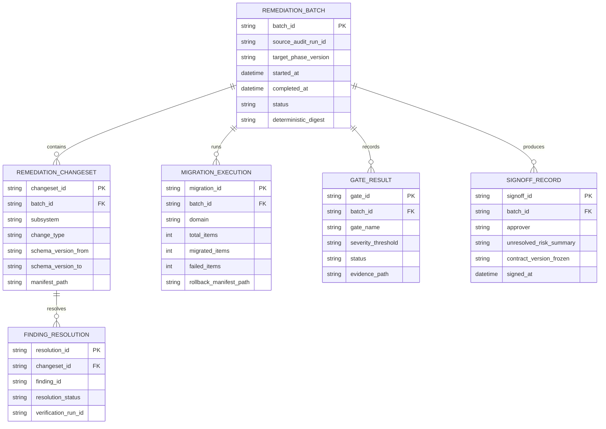
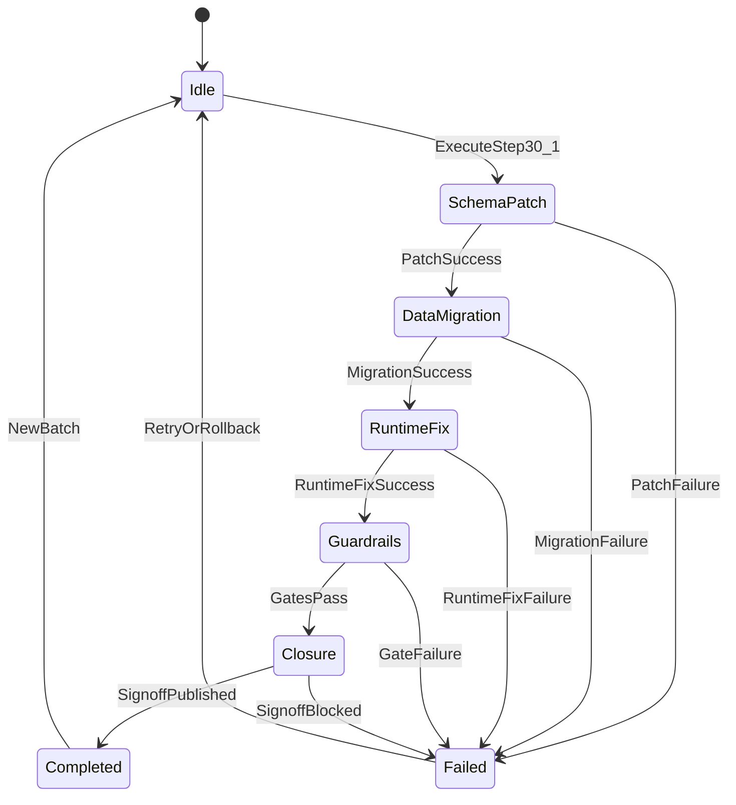

# Phase 30: Field Integrity Remediation, Hardening & Closure

## Implementation Plan

---

## Goal

Phase 30 resolves all actionable field defects identified in Phase 29 by converting audit findings into deterministic schema fixes, data migrations, runtime contract repairs, and permanent regression guardrails. This phase must eliminate critical/high field integrity issues across runtime, persistence, networking, tooling, and release artifacts without introducing incompatible behavior drift. The implementation centers on explicit remediation workflows, evidence-backed verification, and policy gates that block future regressions. The end state is a signed-off field contract baseline with clear governance controls for subsequent phases.

---

## Context Map

### Files to Modify

| File | Purpose | Changes Needed |
|------|---------|----------------|
| `CMakeLists.txt` | Build graph and validation targets | Add Phase 30 remediation modules and regression test targets |
| `Core/Audit/FieldAuditTypes.h` | Audit contracts from Phase 29 | Extend finding metadata to include remediation lineage and closure status |
| `Core/Audit/FieldIssueLedger.h/.cpp` | Finding lifecycle | Add remediation state transitions and unresolved-risk reporting |
| `Core/Audit/FieldAuditRunner.h/.cpp` | Audit rerun orchestrator | Add baseline diff modes and closure gating pass |
| `Core/Remediation/FieldRemediationTypes.h` (new) | Shared remediation contracts | Define patch/migration/fixset/task/signoff schemas |
| `Core/Remediation/FieldSchemaPatchService.h/.cpp` (new) | Step 30.1 schema repair | Implement schema/type/nullability/default corrections |
| `Core/Remediation/FieldMigrationService.h/.cpp` (new) | Step 30.2 data migration | Implement scene/prefab/save/UI/bundle/build manifest migrations |
| `Core/Remediation/RuntimeFieldFixService.h/.cpp` (new) | Step 30.3 runtime fixes | Implement binding/replication/update-order/packaging contract repairs |
| `Core/Remediation/FieldGuardrailService.h/.cpp` (new) | Step 30.4 hardening | Implement invariant assertions, contract test suites, and drift monitoring |
| `Core/Remediation/FieldSignoffService.h/.cpp` (new) | Step 30.5 closure | Implement signoff gating, risk disclosure report, and contract freeze workflow |
| `Core/Asset/AssetTypes.h` | Asset field schemas | Apply corrected schema definitions and compatibility aliases |
| `Core/Asset/AssetPipeline.h` + `.cpp` | Asset and manifest orchestration | Integrate migration transforms and remediation metadata propagation |
| `Core/State/SaveFile.h` + `.cpp` | Save schema and migration hooks | Apply schema patches and compatibility migration transforms |
| `Core/State/SaveManager.h` + `.cpp` | Save/load runtime integration | Add migration lifecycle, rollback strategy, and remediation telemetry |
| `Core/Editor/Prefab/PrefabAsset.h` | Prefab schema contract | Normalize required fields and migration metadata |
| `Core/UI/Authoring/WidgetBlueprintAsset.h` + `.cpp` | UI authoring field contracts | Patch schema drift and add migration guards |
| `Core/UI/Authoring/WidgetLayoutAsset.h` + `.cpp` | UI layout metadata | Repair key/index/anchor contract mismatches |
| `Core/UI/Binding/UIBindingTypes.h` + `.cpp` | Binding contract integrity | Fix field-path parity and two-way binding safety constraints |
| `Core/UI/Localization/LocalizationTable.h` + `.cpp` | Localization schema | Normalize locale key contracts and fallback-field metadata |
| `Core/Network/NetworkContractState.h` + `.cpp` | Contract parity source | Apply authoritative/client parity fixes and compatibility markers |
| `Core/Network/RPC/NetworkRPCTypes.h` + `.cpp` | RPC payload contracts | Repair serialization mappings and strict version compatibility tags |
| `Core/Network/Replay/ReplayTypes.h` + `.cpp` | Replay schema | Patch field drift, migration map, and deterministic decode ordering |
| `Core/Network/Rollback/RollbackTypes.h` + `.cpp` | Rollback frame contracts | Fix frame-phase field ordering and resimulation compatibility |
| `Core/Build/BuildPipelineTypes.h` | Build metadata schema | Correct release artifact field contracts and migration annotations |
| `Core/Build/StoreSubmissionPackager.cpp` | Store package outputs | Patch field names/required fields/checksum manifest contract consistency |
| `Core/Build/DedicatedServerBuildService.cpp` | Dedicated-server descriptors | Patch deploy manifest field contracts and symbol metadata conventions |
| `Core/MCP/MCPAllTools.h` + `Core/MCP/MCPServer.cpp` | Operational tooling | Add remediation execution/query tools and closure report endpoints |
| `Core/UI/ImGuiSubsystem.h` + `.cpp` | Operator UX | Add remediation progress dashboard and unresolved-risk visibility |
| `Core/Tests/Remediation/FieldSchemaPatchTests.cpp` (new) | Step 30.1 verification | Validate schema/type/default/nullability patch behavior |
| `Core/Tests/Remediation/FieldMigrationTests.cpp` (new) | Step 30.2 verification | Validate migration correctness and rollback safety |
| `Core/Tests/Remediation/RuntimeFieldFixTests.cpp` (new) | Step 30.3 verification | Validate runtime parity/binding/ordering fixes |
| `Core/Tests/Remediation/FieldGuardrailTests.cpp` (new) | Step 30.4 verification | Validate assertion gating and drift monitoring behavior |
| `Core/Tests/Remediation/FieldClosureTests.cpp` (new) | Step 30.5 verification | Validate signoff rules, unresolved-risk reports, and contract freeze |
| `Tools/Remediation/RunFieldRemediation.ps1` (new) | Scripted orchestration | Execute patch + migration + validation + signoff workflow in CI/local runs |
| `BUILD_GUIDE.md` | Operational guide | Document remediation workflow, closure criteria, and rollback process |

### Dependencies (may need updates)

| File | Relationship |
|------|--------------|
| `docs/plans/phase-29-comprehensive-field-audit-contract-validation/implementation-plan.md` | Source contract and finding model for remediation inputs |
| `Core/Audit/FieldAuditReportWriter.h/.cpp` | Report format consumed by remediation services |
| `Core/Automation/AutomationTypes.h` | Existing deterministic testing patterns reused by remediation suites |
| `Core/Diagnostics/ProfilerCaptureTypes.h` | Existing schema/reporting conventions for deterministic metadata |
| `Core/Security/PathValidator.h` | File-path safety for migration/report/signoff outputs |
| `Core/Application.h` + `.cpp` | Optional headless remediation mode bootstrap and lifecycle hooks |
| `Core/Asset/Addressables/AddressablesCatalogTypes.h` | Addressable schema remediation and compatibility mapping |
| `Core/Asset/Bundles/AssetBundleTypes.h` | Bundle metadata corrections and version upgrades |
| `Core/MCP/JsonSerialization.h` | Request/response schema upgrades for remediation APIs |

### Test Files

| Test | Coverage |
|------|----------|
| `Core/Tests/Remediation/FieldSchemaPatchTests.cpp` | Type/nullability/default/alias patch correctness |
| `Core/Tests/Remediation/FieldMigrationTests.cpp` | Scene/prefab/save/UI/bundle/build manifest migration correctness |
| `Core/Tests/Remediation/RuntimeFieldFixTests.cpp` | Runtime binding, replication parity, update ordering repairs |
| `Core/Tests/Remediation/FieldGuardrailTests.cpp` | Invariant assertions, contract regression suite, drift detector behavior |
| `Core/Tests/Remediation/FieldClosureTests.cpp` | Rerun diff, zero-critical gate, signoff and freeze policy enforcement |
| `Core/Tests/Audit/FieldAuditRunnerTests.cpp` | Compatibility with Phase 30 rerun/closure modes |
| `Core/Tests/Build/ArtifactPackagingTests.cpp` | Contract parity after remediation in store package outputs |
| `Core/Tests/Build/DedicatedServerArtifactTests.cpp` | Contract parity after remediation in dedicated-server outputs |

### Reference Patterns

| File | Pattern |
|------|---------|
| `docs/plans/phase-29-comprehensive-field-audit-contract-validation/implementation-plan.md` | Upstream audit phase structure and contracts |
| `Core/Build/StoreSubmissionPackager.cpp` | Deterministic manifest/checksum output and validation style |
| `Core/Build/DedicatedServerBuildService.cpp` | Structured artifact metadata and explicit failure taxonomy |
| `Core/Diagnostics/TraceExporter.cpp` | Deterministic report persistence and digest patterns |
| `Core/Audit/FieldIssueLedger.cpp` | Finding lifecycle and severity scoring baseline |
| `docs/plans/phase-28-profiling-automation-production-build-pipeline/implementation-plan.md` | Plan format, section depth, and milestone framing |

### Risk Assessment

- [x] Breaking changes to public API
- [x] Database migrations needed (logical remediation/signoff schema evolution)
- [x] Configuration changes required (new CMake tests, CI gates, remediation scripts)

---

## Requirements

### Step 30.1: Schema and Contract Defect Repair

- Implement `PatchFieldSchemaDefinitions()` to correct type/nullability/required-field mismatches
- Implement `NormalizeFieldDefaultAndFallbackPolicies()` for deterministic defaults and unambiguous fallback paths
- Implement `FixFieldSerializationMappings()` to unify runtime/editor/cooked names and alias handling
- Implement `VersionAndApplyFieldSchemaMigrations()` with forward/backward compatibility windows
- Require all schema patches to include provenance metadata (`findingId`, `ruleId`, `owner`, `remediationBatchId`)

### Step 30.2: Data-at-Rest Migration and Repair

- Implement `MigrateSceneAndPrefabFieldData()` to backfill required values and normalize stale graph layouts
- Implement `MigrateUIAndLocalizationFieldData()` to fix binding paths, localization key drift, and modal/world metadata mismatches
- Implement `MigrateAddressableBundleAndBuildManifestFieldData()` for catalog/bundle/build profile parity
- Implement `RepairPlayerSaveReplayAndAutomationFieldData()` to preserve deterministic baselines
- Provide rollback-safe migration checkpoints and partial failure recovery strategy

### Step 30.3: Runtime and Deployment Contract Corrections

- Implement `FixRuntimeFieldBindingAndReflectionRoutes()` across ECS, UI binding, animation, and tooling interfaces
- Implement `FixReplicationRPCAndRollbackFieldParity()` for authoritative/client and replay consistency
- Implement `FixFieldUpdateOrderingForDeterminism()` across frame phases, job boundaries, and serialization checkpoints
- Implement `FixStoreAndDedicatedServerFieldContracts()` for release metadata parity and deploy descriptor consistency
- Maintain behavior-safe defaults and explicit error outcomes for unsupported remediation requests

### Step 30.4: Permanent Guardrails and Regression Prevention

- Implement `AddFieldInvariantAssertions()` with explicit error taxonomy and subsystem ownership tags
- Implement `AddFieldContractRegressionSuites()` spanning runtime, persistence, networking, build artifacts, and MCP payloads
- Implement `AddFieldAuditGateToBuildPipeline()` to block release lanes on unresolved critical/high defects
- Implement `AddFieldDriftMonitoringAndAlerting()` between commits and produced artifacts
- Ensure guardrails support scoped suppression metadata for temporary waivers with expiry

### Step 30.5: Closure, Verification, and Governance

- Implement `ReRunFullFieldAuditAndDiffAgainstBaseline()` against Phase 29 baseline and Phase 30 interim checkpoints
- Implement `EnforceZeroCriticalFieldDefectGate()` with severity-aware fail conditions
- Implement `PublishFieldIntegritySignoffReport()` with unresolved-risk disclosures and owner acknowledgements
- Implement `FreezeFieldContractVersionForNextPhase()` with policy checkpoints and controlled change approval flow
- Require closure evidence bundle (reports, digests, migration manifests, waiver list, signoff record)

---

## Technical Considerations

### System Architecture Overview

```mermaid
graph TD
    subgraph Frontend Layer
        RemediationPanel[ImGui Remediation Console]
        MigrationView[Migration Progress and Rollback View]
        GateView[Regression Gate and Drift Monitor View]
        SignoffView[Closure and Signoff View]
        CLIEntry[PowerShell Remediation Runner]
    end

    subgraph API Layer
        RemediationAPI[Field Remediation API Facade]
        MCPRemediationAPI[MCP Remediation Endpoints]
        PolicyGateway[Policy and Authorization Gateway]
    end

    subgraph Business Logic Layer
        SchemaPatchSvc[FieldSchemaPatchService]
        MigrationSvc[FieldMigrationService]
        RuntimeFixSvc[RuntimeFieldFixService]
        GuardrailSvc[FieldGuardrailService]
        SignoffSvc[FieldSignoffService]
        AuditRunner[FieldAuditRunner Rerun Mode]
    end

    subgraph Data Layer
        FindingLedger[Phase 29 Finding Ledger]
        PatchManifest[Schema Patch Manifest]
        MigrationManifest[Data Migration Manifest]
        GateResultStore[Regression Gate Results]
        SignoffStore[Closure Signoff Report]
    end

    subgraph Infrastructure Layer
        AppRuntime[Application Runtime]
        AssetPipeline[Asset and Manifest Pipeline]
        NetworkRuntime[RPC Replay Rollback Runtime]
        BuildArtifacts[Store and Dedicated Server Artifacts]
        MCPServer[MCP Server]
        CMakeCI[CMake and CI Pipeline]
    end

    RemediationPanel --> RemediationAPI
    MigrationView --> RemediationAPI
    GateView --> RemediationAPI
    SignoffView --> RemediationAPI
    CLIEntry --> RemediationAPI

    MCPRemediationAPI --> RemediationAPI
    RemediationAPI --> PolicyGateway
    RemediationAPI --> SchemaPatchSvc
    RemediationAPI --> MigrationSvc
    RemediationAPI --> RuntimeFixSvc
    RemediationAPI --> GuardrailSvc
    RemediationAPI --> SignoffSvc
    RemediationAPI --> AuditRunner

    SchemaPatchSvc --> PatchManifest
    MigrationSvc --> MigrationManifest
    RuntimeFixSvc --> GateResultStore
    GuardrailSvc --> GateResultStore
    SignoffSvc --> SignoffStore
    AuditRunner --> FindingLedger

    SchemaPatchSvc --> AssetPipeline
    MigrationSvc --> AssetPipeline
    RuntimeFixSvc --> AppRuntime
    RuntimeFixSvc --> NetworkRuntime
    RuntimeFixSvc --> BuildArtifacts
    MCPRemediationAPI --> MCPServer
    CMakeCI --> GuardrailSvc
    CMakeCI --> SignoffSvc
```



### Technology Stack Selection

| Layer | Technology | Rationale |
|-------|------------|-----------|
| Frontend | Existing ImGui tooling + script entrypoints | Fastest operator path for remediation visibility and controls |
| API | Typed C++ remediation services + MCP tool routing | Aligns with existing runtime orchestration and local automation surfaces |
| Business Logic | Dedicated `Core/Remediation` service modules | Keeps fix logic explicit, testable, and separable by step responsibility |
| Data | JSON manifests/reports with deterministic digests | Supports reproducible auditing and signoff traceability |
| Infrastructure | CMake + ctest + MCP + build outputs | Uses established pipeline and avoids introducing unrelated dependencies |

### Integration Points

- Consume Phase 29 finding ledger as authoritative remediation input
- Apply schema patches before migration execution to avoid invalid transforms
- Run migration services before runtime fix services for data-contract alignment
- Execute guardrails and closure reruns in CI and local modes with shared result schema
- Publish signoff outputs through MCP and filesystem reports for operational visibility

### Deployment Architecture

```text
Core/
├── Remediation/
│   ├── FieldRemediationTypes.h
│   ├── FieldSchemaPatchService.h/.cpp
│   ├── FieldMigrationService.h/.cpp
│   ├── RuntimeFieldFixService.h/.cpp
│   ├── FieldGuardrailService.h/.cpp
│   └── FieldSignoffService.h/.cpp
├── Audit/
│   ├── FieldIssueLedger.h/.cpp
│   └── FieldAuditRunner.h/.cpp          # rerun + diff mode
├── UI/
│   └── ImGuiSubsystem.h/.cpp            # remediation dashboard
├── MCP/
│   ├── MCPAllTools.h
│   └── MCPServer.cpp                    # remediation tools
└── Tests/
    └── Remediation/
        ├── FieldSchemaPatchTests.cpp
        ├── FieldMigrationTests.cpp
        ├── RuntimeFieldFixTests.cpp
        ├── FieldGuardrailTests.cpp
        └── FieldClosureTests.cpp

Tools/
└── Remediation/
    └── RunFieldRemediation.ps1
```

### Scalability Considerations

- Batch remediation operations by subsystem to control memory pressure
- Use chunked migrations for large scene/save datasets
- Cache patch and migration manifests by run digest for restart-safe continuation
- Parallelize non-overlapping runtime fix domains using job-system work queues
- Keep closure reruns incremental when patch scope is constrained

---

## Database Schema Design

> Phase 30 persists remediation state as deterministic artifacts; this logical schema ensures repeatable sequencing, governance traceability, and closure evidence integrity.



### Table Specifications

| Entity | Key Fields | Constraints |
|--------|------------|-------------|
| `REMEDIATION_BATCH` | `batch_id`, `source_audit_run_id`, `status` | one active batch per source run; digest required on completion |
| `REMEDIATION_CHANGESET` | `changeset_id`, `subsystem`, `change_type` | manifest path required; schema version progression must be monotonic |
| `FINDING_RESOLUTION` | `resolution_id`, `finding_id`, `resolution_status` | finding mapped once per batch unless reopened |
| `MIGRATION_EXECUTION` | `migration_id`, `domain`, `failed_items` | rollback manifest required when failures exist |
| `GATE_RESULT` | `gate_id`, `gate_name`, `status` | gate names unique per batch; status in `{pass,fail,waived}` |
| `SIGNOFF_RECORD` | `signoff_id`, `approver`, `contract_version_frozen` | signoff blocked if unresolved critical findings exist |

### Indexing Strategy

- `REMEDIATION_CHANGESET(batch_id, subsystem)` for targeted rollback and diagnostics
- `FINDING_RESOLUTION(finding_id, resolution_status)` for closure completeness checks
- `MIGRATION_EXECUTION(batch_id, domain)` for migration progress dashboards
- `GATE_RESULT(batch_id, status)` for release gate summaries

### Foreign Key Relationships

- `REMEDIATION_CHANGESET.batch_id -> REMEDIATION_BATCH.batch_id`
- `FINDING_RESOLUTION.changeset_id -> REMEDIATION_CHANGESET.changeset_id`
- `MIGRATION_EXECUTION.batch_id -> REMEDIATION_BATCH.batch_id`
- `GATE_RESULT.batch_id -> REMEDIATION_BATCH.batch_id`
- `SIGNOFF_RECORD.batch_id -> REMEDIATION_BATCH.batch_id`

### Database Migration Strategy

- Version remediation artifact schema using `remediationSchemaVersion`
- Allow read compatibility for previous schema revision during rollout
- Require migration + rollback manifests for every schema-affecting change
- Emit `FIELD_REMEDIATION_SCHEMA_MIGRATION_FAILED` on conversion errors

---

## API Design

### Core C++ API Surface

```cpp
namespace Core::Remediation {

Result<FieldSchemaPatchResult> PatchFieldSchemaDefinitions(const FieldSchemaPatchRequest& request);
Result<FieldSchemaPatchResult> NormalizeFieldDefaultAndFallbackPolicies(const FieldSchemaPatchRequest& request);
Result<FieldSchemaPatchResult> FixFieldSerializationMappings(const FieldSchemaPatchRequest& request);
Result<FieldSchemaMigrationResult> VersionAndApplyFieldSchemaMigrations(const FieldSchemaMigrationRequest& request);

Result<FieldMigrationResult> MigrateSceneAndPrefabFieldData(const FieldMigrationRequest& request);
Result<FieldMigrationResult> MigrateUIAndLocalizationFieldData(const FieldMigrationRequest& request);
Result<FieldMigrationResult> MigrateAddressableBundleAndBuildManifestFieldData(const FieldMigrationRequest& request);
Result<FieldMigrationResult> RepairPlayerSaveReplayAndAutomationFieldData(const FieldMigrationRequest& request);

Result<RuntimeFieldFixResult> FixRuntimeFieldBindingAndReflectionRoutes(const RuntimeFieldFixRequest& request);
Result<RuntimeFieldFixResult> FixReplicationRPCAndRollbackFieldParity(const RuntimeFieldFixRequest& request);
Result<RuntimeFieldFixResult> FixFieldUpdateOrderingForDeterminism(const RuntimeFieldFixRequest& request);
Result<RuntimeFieldFixResult> FixStoreAndDedicatedServerFieldContracts(const RuntimeFieldFixRequest& request);

Result<FieldGuardrailResult> AddFieldInvariantAssertions(const FieldGuardrailRequest& request);
Result<FieldGuardrailResult> AddFieldContractRegressionSuites(const FieldGuardrailRequest& request);
Result<FieldGuardrailResult> AddFieldAuditGateToBuildPipeline(const FieldGuardrailRequest& request);
Result<FieldGuardrailResult> AddFieldDriftMonitoringAndAlerting(const FieldGuardrailRequest& request);

Result<FieldClosureResult> ReRunFullFieldAuditAndDiffAgainstBaseline(const FieldClosureRequest& request);
Result<FieldClosureResult> EnforceZeroCriticalFieldDefectGate(const FieldClosureRequest& request);
Result<FieldClosureResult> PublishFieldIntegritySignoffReport(const FieldClosureRequest& request);
Result<FieldClosureResult> FreezeFieldContractVersionForNextPhase(const FieldClosureRequest& request);

} // namespace Core::Remediation
```

### MCP/Tool Endpoints

| Endpoint | Method | Purpose | Auth |
|----------|--------|---------|------|
| `/mcp/tools/runFieldRemediationBatch` | Tool call | Execute configured remediation pipeline batch | Local MCP auth + remediation execute scope |
| `/mcp/tools/getFieldRemediationStatus` | Tool call | Query progress, failures, and gate status | Local MCP auth + read scope |
| `/mcp/tools/publishFieldSignoff` | Tool call | Publish closure/signoff report payload | Local MCP auth + signoff scope |

### Request/Response Types (TypeScript shape for MCP payloads)

```ts
type FieldRemediationBatchRequest = {
  sourceAuditRunId: string;
  steps: Array<"30.1" | "30.2" | "30.3" | "30.4" | "30.5">;
  strictMode: boolean;
  allowWaivers: boolean;
  outputDirectory: string;
};

type FieldRemediationBatchResponse = {
  ok: boolean;
  batchId?: string;
  status?: "running" | "failed" | "completed";
  unresolvedCriticalCount?: number;
  signoffReportPath?: string;
  error?: string;
};
```

### Authentication and Authorization

- Remediation execution restricted to local authenticated MCP tool contexts
- Signoff publication requires elevated approval scope
- Waiver usage requires explicit `waiverId` and expiration metadata

### Error Handling Strategy

- Explicit failure codes:
  - `FIELD_REMEDIATION_ARGUMENT_INVALID`
  - `FIELD_SCHEMA_PATCH_FAILED`
  - `FIELD_MIGRATION_FAILED`
  - `FIELD_RUNTIME_FIX_FAILED`
  - `FIELD_GUARDRAIL_ENFORCEMENT_FAILED`
  - `FIELD_SIGNOFF_BLOCKED`
  - `FIELD_CONTRACT_FREEZE_FAILED`
- Partial failure payloads include failed domain, owning subsystem, and rollback hint
- CI exit codes map directly to failure category for deterministic automation behavior

### Rate Limiting and Caching

- Single active remediation batch per audit baseline
- Cache migration checkpoints by `(batchId, domain, checkpointIndex)`
- Cache rerun diff results by `(sourceDigest, targetDigest)`

---

## Frontend Architecture

### Component Hierarchy Documentation

```text
Field Remediation Console
├── Header Card
│   ├── Title: "Stage 30 Field Remediation"
│   ├── Source Audit Run Selector
│   ├── Execute Batch Button
│   └── Publish Signoff Button
├── Batch Progress Panel
│   ├── Step Timeline (30.1 -> 30.5)
│   ├── Current Step Status
│   └── Failure/Retry Indicators
├── Migration & Fix Explorer
│   ├── Subsystem Filter
│   ├── Changeset Table
│   └── Changeset Detail Drawer
│       ├── Linked Findings
│       ├── Patch/Migration Manifest Links
│       └── Rollback Metadata
├── Guardrail & Gate Panel
│   ├── Invariant Assertion Results
│   ├── Regression Suite Status
│   └── Release Gate Status
└── Closure Panel
    ├── Rerun Diff Summary
    ├── Unresolved Risk List
    └── Contract Freeze Confirmation
```

### State Flow Diagram



### Reusable Component Specifications

- `RemediationStepTimelineWidget`
- `ChangesetLedgerTableWidget`
- `GateStatusBadgeStrip`
- `UnresolvedRiskDisclosureWidget`
- `ContractFreezeConfirmationWidget`

### State Management Patterns

- UI state managed in ImGui subsystem with typed remediation view model structs
- Long-running batch operations polled through remediation API status endpoints
- Last successful signoff state cached for quick baseline comparisons

### Type Contracts

- `FieldRemediationUiState`
- `RemediationBatchViewModel`
- `ChangesetViewModel`
- `GateResultViewModel`
- `FieldSignoffViewModel`

---

## Security & Performance

- Enforce strict path validation for all patch/migration/signoff output paths
- Redact sensitive field values from remediation logs; include metadata references only
- Require rollback manifests for any migration step that mutates persisted artifacts
- Use chunked migration and bounded in-memory buffers for large datasets
- Maintain deterministic execution ordering for reproducible audit reruns
- Prevent concurrent conflicting remediation batches via lease-based locking

---

## Detailed Step Breakdown

### Sub-step 30.1.1: `PatchFieldSchemaDefinitions()` (v0.30.1.1)

- Apply schema-level patches from findings: types, nullability, required flags
- Attach patch provenance metadata and manifest entries
- Acceptance criteria:
  - Every patched field references a source finding
  - Patch manifest is deterministic and checksum-stable

### Sub-step 30.1.2: `NormalizeFieldDefaultAndFallbackPolicies()` (v0.30.1.2)

- Consolidate defaults and fallback precedence rules
- Remove ambiguous fallback branches
- Acceptance criteria:
  - No multi-default ambiguity remains per field
  - Default/fallback report generated with owner tags

### Sub-step 30.1.3: `FixFieldSerializationMappings()` (v0.30.1.3)

- Align runtime/editor/cooked mapping names and aliases
- Acceptance criteria:
  - Serialization aliases preserve backward compatibility
  - Mapping conflicts return explicit failure codes

### Sub-step 30.1.4: `VersionAndApplyFieldSchemaMigrations()` (v0.30.1.4)

- Create versioned migrations and apply them with rollback checkpoints
- Acceptance criteria:
  - Migration and rollback manifests emitted
  - Schema version progression validated

### Sub-step 30.2.1: `MigrateSceneAndPrefabFieldData()` (v0.30.2.1)

- Migrate scene/prefab assets to corrected schema
- Acceptance criteria:
  - Required fields backfilled according to patch policy
  - Graph integrity checks pass after migration

### Sub-step 30.2.2: `MigrateUIAndLocalizationFieldData()` (v0.30.2.2)

- Migrate widget binding/localization schema data
- Acceptance criteria:
  - Binding keys and localization references resolve without drift

### Sub-step 30.2.3: `MigrateAddressableBundleAndBuildManifestFieldData()` (v0.30.2.3)

- Migrate addressable catalogs, bundles, and build manifests
- Acceptance criteria:
  - Bundle/catalog/build contract parity verified post-migration

### Sub-step 30.2.4: `RepairPlayerSaveReplayAndAutomationFieldData()` (v0.30.2.4)

- Repair save/replay/automation data contracts and deterministic assumptions
- Acceptance criteria:
  - Historical replay/save data remains loadable via compatibility path

### Sub-step 30.3.1: `FixRuntimeFieldBindingAndReflectionRoutes()` (v0.30.3.1)

- Fix runtime reflection and binding path defects across systems
- Acceptance criteria:
  - Runtime field resolution mismatch count reduced to zero for known defects

### Sub-step 30.3.2: `FixReplicationRPCAndRollbackFieldParity()` (v0.30.3.2)

- Correct authoritative/client payload parity and replay/rollback schema consistency
- Acceptance criteria:
  - Contract parity matrix passes for replication/RPC/replay/rollback channels

### Sub-step 30.3.3: `FixFieldUpdateOrderingForDeterminism()` (v0.30.3.3)

- Correct update ordering across frame phases and serialization boundaries
- Acceptance criteria:
  - Determinism checks pass on repeated simulation inputs

### Sub-step 30.3.4: `FixStoreAndDedicatedServerFieldContracts()` (v0.30.3.4)

- Correct release artifact metadata and deployment descriptor contracts
- Acceptance criteria:
  - Store and server manifests pass strict contract validation

### Sub-step 30.4.1: `AddFieldInvariantAssertions()` (v0.30.4.1)

- Add invariants for corrected field contracts at runtime/editor/build boundaries
- Acceptance criteria:
  - Assertion taxonomy includes ownership and finding lineage

### Sub-step 30.4.2: `AddFieldContractRegressionSuites()` (v0.30.4.2)

- Add comprehensive regression suites for repaired domains
- Acceptance criteria:
  - Regression suite includes explicit coverage map to Stage 30 fixes

### Sub-step 30.4.3: `AddFieldAuditGateToBuildPipeline()` (v0.30.4.3)

- Integrate severity-based release gate in build pipeline
- Acceptance criteria:
  - Release lane blocks on unresolved critical/high findings by policy

### Sub-step 30.4.4: `AddFieldDriftMonitoringAndAlerting()` (v0.30.4.4)

- Add drift detection between commits and generated artifacts
- Acceptance criteria:
  - Drift events include actionable diff and owning subsystem metadata

### Sub-step 30.5.1: `ReRunFullFieldAuditAndDiffAgainstBaseline()` (v0.30.5.1)

- Execute full rerun and baseline diff against Phase 29 + interim checkpoints
- Acceptance criteria:
  - Diff report includes resolved/regressed/new findings

### Sub-step 30.5.2: `EnforceZeroCriticalFieldDefectGate()` (v0.30.5.2)

- Enforce final critical-defect closure gate
- Acceptance criteria:
  - Closure fails if any unresolved critical finding remains

### Sub-step 30.5.3: `PublishFieldIntegritySignoffReport()` (v0.30.5.3)

- Publish signoff with unresolved-risk disclosure and ownership acknowledgements
- Acceptance criteria:
  - Signoff artifact includes full evidence index and approver metadata

### Sub-step 30.5.4: `FreezeFieldContractVersionForNextPhase()` (v0.30.5.4)

- Freeze contract version and establish controlled change policy
- Acceptance criteria:
  - Contract freeze manifest produced with policy checkpoint metadata

---

## Dependencies

### External Libraries

- `nlohmann_json` for patch/migration/report/signoff serialization
- `spdlog` for remediation telemetry and structured diagnostics
- `Tracy` (optional) for profiling heavy migration/fix workloads

### Internal Dependencies

- `Core/Audit/FieldAuditTypes.h` + `Core/Audit/FieldIssueLedger.h/.cpp`
- `Core/Audit/FieldAuditRunner.h/.cpp`
- `Core/Asset/AssetPipeline.h/.cpp`
- `Core/State/SaveFile.h/.cpp`
- `Core/Network/NetworkContractState.h/.cpp`
- `Core/Build/BuildPipelineTypes.h`
- `Core/MCP/MCPAllTools.h` + `Core/MCP/MCPServer.cpp`

### Integration Requirements

- Add `Core/Remediation/*` modules to `EngineCore` target in `CMakeLists.txt`
- Add `Core/Tests/Remediation/*` targets and ctest registration
- Add `Tools/Remediation/RunFieldRemediation.ps1` for CI/local orchestration
- Ensure remediation output artifacts are included in release diagnostics archives

---

## Testing Strategy

| Test ID | Scope | Description | Expected Result |
|---------|-------|-------------|-----------------|
| `Remediate_SchemaPatch_ContractFix` | Unit | Schema patch service applies expected contract corrections | Pass with deterministic patch manifest |
| `Remediate_Migration_RollbackSafety` | Integration | Migration failures trigger rollback using checkpoint manifests | Pass with no partial corruption |
| `Remediate_RuntimeParity_Network` | Integration | Replication/RPC/replay/rollback parity checks pass after fixes | Pass with zero parity errors |
| `Remediate_BuildArtifacts_ContractParity` | Integration | Store + dedicated-server manifest contracts remain valid | Pass with strict schema compliance |
| `Remediate_Guardrail_AssertionCoverage` | Unit | Invariant assertions fire for intentionally malformed data | Pass with expected error taxonomy |
| `Remediate_Gate_SeverityPolicy` | Integration | Build gate blocks unresolved critical/high findings by policy | Pass/fail according to threshold |
| `Remediate_Closure_SignoffIntegrity` | Integration | Closure report contains complete evidence and approvals | Pass with valid signoff manifest |
| `Remediate_ContractFreeze_Enforcement` | Integration | Post-freeze changes require policy-compliant version bump metadata | Pass with enforcement active |

---

## Risk Mitigation

| Risk | Impact | Mitigation |
|------|--------|------------|
| Remediation patches introduce behavioral regressions | High | Require finding-linked patch provenance + regression suites per subsystem |
| Data migration corrupts persisted artifacts | High | Mandatory rollback manifests and staged migration checkpoints |
| Runtime/network fixes break determinism | High | Determinism-focused regression tests and order-validation tooling |
| Guardrail noise blocks release throughput | Medium | Severity policy tuning + scoped waivers with expiry |
| Closure signoff misses unresolved issues | Medium | Zero-critical gate + unresolved-risk disclosure requirements |

---

## Milestones

1. **v0.30.1.x** - Schema and contract correction foundation (`PatchFieldSchemaDefinitions`, `NormalizeFieldDefaultAndFallbackPolicies`, `FixFieldSerializationMappings`, `VersionAndApplyFieldSchemaMigrations`)
2. **v0.30.2.x** - Data-at-rest migration and repair (`MigrateSceneAndPrefabFieldData`, `MigrateUIAndLocalizationFieldData`, `MigrateAddressableBundleAndBuildManifestFieldData`, `RepairPlayerSaveReplayAndAutomationFieldData`)
3. **v0.30.3.x** - Runtime/deployment integrity correction (`FixRuntimeFieldBindingAndReflectionRoutes`, `FixReplicationRPCAndRollbackFieldParity`, `FixFieldUpdateOrderingForDeterminism`, `FixStoreAndDedicatedServerFieldContracts`)
4. **v0.30.4.x** - Guardrails and prevention (`AddFieldInvariantAssertions`, `AddFieldContractRegressionSuites`, `AddFieldAuditGateToBuildPipeline`, `AddFieldDriftMonitoringAndAlerting`)
5. **v0.30.5.x** - Closure and governance (`ReRunFullFieldAuditAndDiffAgainstBaseline`, `EnforceZeroCriticalFieldDefectGate`, `PublishFieldIntegritySignoffReport`, `FreezeFieldContractVersionForNextPhase`)

---

## References

- `engine_roadmap.md` (Phase 30 section)
- `docs/plans/phase-29-comprehensive-field-audit-contract-validation/implementation-plan.md`
- `docs/plans/phase-28-profiling-automation-production-build-pipeline/implementation-plan.md`
- `Core/Audit/FieldAuditTypes.h`
- `Core/Audit/FieldIssueLedger.h` + `Core/Audit/FieldIssueLedger.cpp`
- `Core/Audit/FieldAuditRunner.h` + `Core/Audit/FieldAuditRunner.cpp`
- `Core/Asset/AssetPipeline.h` + `Core/Asset/AssetPipeline.cpp`
- `Core/Network/NetworkContractState.h` + `Core/Network/NetworkContractState.cpp`
- `Core/Build/BuildPipelineTypes.h`
- `Core/MCP/MCPServer.cpp`
